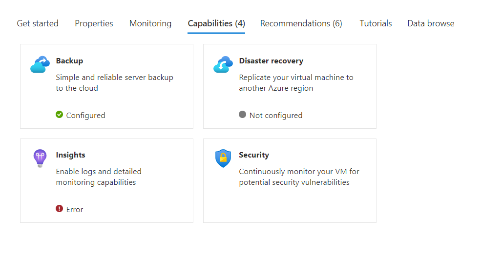

<a name="getstarted-capabilitiestab"></a>
# getstarted-CapabilitiesTab
* [getstarted-CapabilitiesTab](#getstarted-capabilitiestab)
    * [Description](#getstarted-capabilitiestab-description)
    * [Definitions:](#getstarted-capabilitiestab-definitions)
    * [UI Sample](#getstarted-capabilitiestab-ui-sample)
    * [Sample Snippet](#getstarted-capabilitiestab-sample-snippet)

<a name="getstarted-capabilitiestab-description"></a>
## Description
The Capabilities view is used to highlight valuable features of a resource that are not part of the Get Started or Properties content.
<a name="getstarted-capabilitiestab-definitions"></a>
## Definitions:
<a name="getstarted-capabilitiestab-definitions-an-object-with-the-following-properties"></a>
##### An object with the following properties
| Name | Required | Description
| ---|:--:|:--:|
|kind|True|Enum permitting the value: "Capabilities".
|capabilities|True|See [here](dx-getstarted-CapabilitiesTab-capabilities.md) for more on capabilities.
|default|False|If default is true, then set this tab as default tab. Only the first tab with valid default value will be set as default.
|fx.feature|False|
<a name="getstarted-capabilitiestab-ui-sample"></a>
## UI Sample

<a name="getstarted-capabilitiestab-sample-snippet"></a>
## Sample Snippet
  To add the Capabilities view, add the following example to the properties.tabs section in the [Declarative Resource Overview schema](portalfx-declarative-overview.md#declarative-resource-overview-schema)

```json
{
  "kind": "Capabilities",
  "capabilities": [
    {
      "title": "Backup",
      "icon": "MsPortalFx.Base.Images.Polychromatic.Backup",
      "description": "Simple and reliable server backup to the cloud",
      "action": {
        "menu": "tags"
      },
      "status": {
        "value": "[contains(resources().name, 'test')]",
        "valueMapping": [
          {
            "value": "true",
            "displayName": "Configured",
            "icon": "MsPortalFx.Base.Images.StatusBadge.Success"
          },
          {
            "value": "false",
            "displayName": "Not configured",
            "icon": "MsPortalFx.Base.Images.StatusBadge.None",
            "action": {
              "blade": {
                "name": "",
                "extension": "",
                "parameters": {},
                "inContextPane": true
              }
            }
          }
        ]
      }
    },
    {
      "title": "Disaster recovery",
      "icon": "MsPortalFx.Base.Images.Polychromatic.SiteRecovery",
      "description": "Replicate your virtual machine to another Azure region",
      "action": {
        "menu": "tags"
      },
      "status": {
        "value": "[not(contains(resources().name, 'test'))]",
        "valueMapping": [
          {
            "value": "true",
            "displayName": "Configured",
            "icon": "MsPortalFx.Base.Images.StatusBadge.Success"
          },
          {
            "value": "false",
            "displayName": "Not configured",
            "icon": "MsPortalFx.Base.Images.StatusBadge.None",
            "action": {
              "blade": {
                "name": "",
                "extension": "",
                "parameters": {},
                "inContextPane": true
              }
            }
          }
        ]
      }
    },
    {
      "title": "Insights",
      "icon": "MsPortalFx.Base.Images.Polychromatic.Insights",
      "description": "Enable logs and detailed monitoring capabilities",
      "action": {
        "menu": "tags"
      },
      "status": {
        "value": "[resources().properties.test]",
        "valueMapping": [
          {
            "value": "present",
            "displayName": "Configured",
            "icon": "MsPortalFx.Base.Images.StatusBadge.Success"
          },
          {
            "value": "notPresent",
            "displayName": "Not configured",
            "icon": "MsPortalFx.Base.Images.StatusBadge.None",
            "action": {
              "blade": {
                "name": "",
                "extension": "",
                "parameters": {},
                "inContextPane": true
              }
            }
          },
          {
            "value": "null",
            "displayName": "Error",
            "icon": "MsPortalFx.Base.Images.StatusBadge.Error"
          },
          {
            "value": "undefined",
            "displayName": "Error",
            "icon": "MsPortalFx.Base.Images.StatusBadge.Error"
          }
        ]
      }
    },
    {
      "title": "Security",
      "icon": "MsPortalFx.Base.Images.Polychromatic.SslCustomDomains",
      "description": "Continuously monitor your VM for potential security vulnerabilities",
      "action": {
        "menu": "tags"
      }
    }
  ]
}
```

