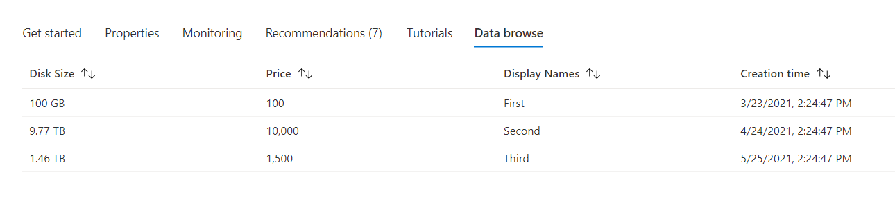
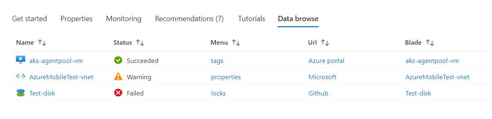

<a name="getstarted-databrowsetab"></a>
# getstarted-DataBrowseTab
* [getstarted-DataBrowseTab](#getstarted-databrowsetab)
    * [Description](#getstarted-databrowsetab-description)
    * [Definitions:](#getstarted-databrowsetab-definitions)
    * [UI Sample](#getstarted-databrowsetab-ui-sample)
    * [Sample Snippet](#getstarted-databrowsetab-sample-snippet)

<a name="getstarted-databrowsetab-description"></a>
## Description
The Data Browse view is used to display the array data in a table.
<a name="getstarted-databrowsetab-definitions"></a>
## Definitions:
<a name="getstarted-databrowsetab-definitions-an-object-with-the-following-properties"></a>
##### An object with the following properties
| Name | Required | Description
| ---|:--:|:--:|
|kind|True|Enum permitting the value: "DataBrowse".
|displayName|True|Display name for the Tab.
|default|False|If default is true, then set this tab as default tab. Only the first tab with valid default value will be set as default.
|fx.feature|False|
|ariaLabel|True|label of the command used for screen reader users.
|data|True|Data property accepts an array, and can be static or dynamic. In both cases, the data must map to the columns specified. You can specify a JMES path query in the `transforms` to manage the data.
|columns|True|Define the column to be shown in the DataBrowse view
<a name="getstarted-databrowsetab-ui-sample"></a>
## UI Sample
  
  
<a name="getstarted-databrowsetab-sample-snippet"></a>
## Sample Snippet
  To add the DataBrowse view, add the following example to the properties.tabs section in the [Declarative Resource Overview schema](portalfx-declarative-overview.md#declarative-resource-overview-schema)


Example for static array data source.

```json
{
    "kind": "DataBrowse",
    "displayName": "Data browse",
    "ariaLabel": "Data browse",
    "data": [
        {
            "diskSize": 100,
            "price": 100,
            "displayName": "a",
            "creationTime": "2021-03-23T21:24:47.7856737Z"
        },
        {
            "diskSize": 10000,
            "price": 10000,
            "displayName": "b",
            "creationTime": "2021-04-24T21:24:47.7856737Z"
        },
        {
            "diskSize": 1500,
            "price": 1500,
            "displayName": "c",
            "creationTime": "2021-05-25T21:24:47.7856737Z"
        }
    ],
    "columns": [
        {
            "displayName": "Disk Size",
            "name": "diskSize",
            "format": "Number",
            "sourceUnits": "Gigabytes",
            "maximumFractionDigits": 2
        },
        {
            "displayName": "Price",
            "name": "price"
        },
        {
            "displayName": "Display Names",
            "name": "displayName"
        },
        {
            "displayName": "Creation time",
            "name": "creationTime",
            "format": "Date"
        }
    ]
}
```

Example for resources() data source, the output for resources().resources must be an array.

```json
{
    "kind": "DataBrowse",
    "displayName": "Data browse",
    "ariaLabel": "Data browse",
    "data": "[resources().resources]",
    "columns": [
        {
            "displayName": "Name",
            "name": "name"
        },
        {
            "displayName": "VM Type",
            "name": "type"
        },
        {
            "displayName": "Location",
            "name": "location"
        }
    ]
}
```

Example for icon and link support.

```json
{
	"kind": "DataBrowse",
	"displayName": "Data browse",
	"ariaLabel": "testing",
	"data": [
		{
			"name": "resourceName1",
			"id": "/subscriptions/{subscription}/resourcegroups/{resourcegroup}/providers/{provider}/{resourceType}/{resourceName}",
			"status": "Succeeded",
			"menu": "tags",
			"urlText": "Azure portal",
			"urlAction": {
				"url": "https://azure.microsoft.com/"
			},
			"parameters": {
				"title": "resourceName1"
			}
		},
		{
			"name": "resourceName2",
			"id": "/subscriptions/{subscription}/resourcegroups/{resourcegroup}/providers/{provider}/{resourceType}/{resourceName}",
			"status": "Warning",
			"menu": "properties",
			"urlText": "Microsoft",
			"urlAction": {
				"url": "https://www.microsoft.com/en-us/"
			},
			"parameters": {
				"title": "resourceName2"
			}
		},
		{
			"name": "resourceName3",
			"id": "/subscriptions/{subscription}/resourcegroups/{resourcegroup}/providers/{provider}/{resourceType}/{resourceName}",
			"status": "Failed",
			"menu": "locks",
			"urlText": "Github",
			"urlAction": {
				"url": "https://github.com/"
			},
			"parameters": {
				"title": "resourceName3"
			}
		}
	],
	"columns": [
		{
			"displayName": "Name",
			"name": "name",
			"action": {
				"resourceId": "[$item.id]"
			}
		},
		{
			"displayName": "Status",
			"name": "status",
			"valueMapping": [
				{
					"value": "Succeeded",
					"displayName": "Succeeded",
					"icon": "MsPortalFx.Base.Images.StatusBadge.Outline.Success"
				},
				{
					"value": "Warning",
					"displayName": "Warning",
					"icon": "MsPortalFx.Base.Images.StatusBadge.Outline.Warning"
				},
				{
					"value": "Failed",
					"displayName": "Failed",
					"icon": "MsPortalFx.Base.Images.StatusBadge.Outline.Failed"
				}
			]
		},
		{
			"displayName": "Menu",
			"name": "menu",
			"action": {
				"menu": "[$item.menu]"
			}
		},
		{
			"displayName": "Url",
			"name": "urlText",
			"action": {
				"url": "[$item.urlAction.url]"
			}
		},
		{
			"displayName": "Blade",
			"name": "name",
			"action": {
				"blade": {
					"name": "A blade name",
					"extension": "An extension name",
					"parameters": "[$item.parameters]",
					"inContextPane": true
				}
			}
		}
	]
}
```

