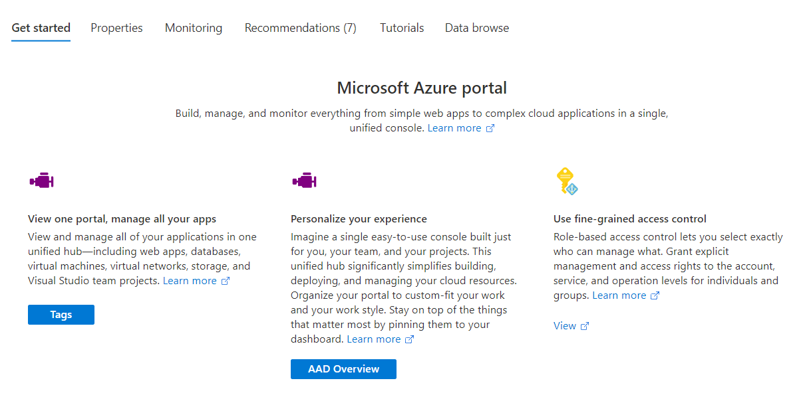

<a name="getstarted-getstartedtab"></a>
# getstarted-GetStartedTab
* [getstarted-GetStartedTab](#getstarted-getstartedtab)
    * [Description](#getstarted-getstartedtab-description)
    * [Guidance](#getstarted-getstartedtab-guidance)
    * [Definitions:](#getstarted-getstartedtab-definitions)
    * [UI Sample](#getstarted-getstartedtab-ui-sample)
    * [Sample Snippet](#getstarted-getstartedtab-sample-snippet)

<a name="getstarted-getstartedtab-description"></a>
## Description
The Getting Started view is the primary view that users first see in Declarative Resource Overview blade.
<a name="getstarted-getstartedtab-guidance"></a>
## Guidance
The purpose of the Getting Started view is to help the user learn about the resource and service. The Getting Started view consist of free form text followed by features, which can include actions such as URL, Blade and Menu open actions. The Menu action opens a menu item as defined with the id. In the example below, tags will open the Tags menu blade. [Learn more about configuring the resource menu](declarative-assets.md#configuring-the-resource-menu).
<a name="getstarted-getstartedtab-definitions"></a>
## Definitions:
<a name="getstarted-getstartedtab-definitions-an-object-with-the-following-properties"></a>
##### An object with the following properties
| Name | Required | Description
| ---|:--:|:--:|
|kind|False|Enum permitting the value: "GetStarted".
|title|True|Title for the tab. See the [UI Sample](#ui-sample) for an illustration
|description|False|Description for the tab. See the [UI Sample](#ui-sample) for an illustration
|learnMore|False|LearnMore link that follows the description section for the tab. See the [UI Sample](#ui-sample) for an illustration. See [here](dx-getstarted-LearnMoreLink.md) on how to define a link.
|features|True|See [GetStarted Cards](dx-getstarted-IconCardReference.md) for how to define cards.
|default|False|If default is true, then set this tab as default tab. Only the first tab with valid default value will be set as default.
<a name="getstarted-getstartedtab-ui-sample"></a>
## UI Sample
  
<a name="getstarted-getstartedtab-sample-snippet"></a>
## Sample Snippet
  To add the Getting Started view, add the following example to the `properties.tabs` section in the [Declarative Resource Overview schema](portalfx-declarative-overview.md#declarative-resource-overview-schema)

```json
{
    "kind": "GetStarted",
    "title": {
        "property": "tab1Title"
    },
    "description": {
        "property": "tab1Description"
    },
    "learnMore": {
        "url": "https://azure.microsoft.com/en-us/features/azure-portal/",
        "ariaLabel": "Learn more about Azure Portal"
    },
    "features": [
        {
            "title": {
                "property": "tab1feature1Title"
            },
            "description": {
                "property": "tab1feature1Description"
            },
            "learnMore": {
                "url": "https://azure.microsoft.com/en-us/features/azure-portal/",
                "ariaLabel": "Learn more about Azure Portal"
            },
            "icon": {
                "file": "../../Content/svg/engine.svg"
            },
            "action": {
                "menu": "tags",
                "displayName": {
                    "property": "tab1feature1actionDisplayName"
                }
            }
        },
        {
            "title": {
                "property": "tab1feature2Title"
            },
            "description": {
                "property": "tab1feature2Description"
            },
            "learnMore": {
                "url": "https://azure.microsoft.com/en-us/features/azure-portal/",
                "ariaLabel": "Learn more about Azure Portal"
            },
            "icon": {
                "file": "../../Content/svg/engine.svg"
            },
            "action": {
                "blade": {
                    "name": "ActiveDirectoryMenuBlade",
                    "extension": "Microsoft_AAD_IAM"
                },
                "displayName": {
                    "property": "tab1feature2actionDisplayName"
                }
            }
        },
        {
            "title": {
                "property": "tab1feature3Title"
            },
            "description": {
                "property": "tab1feature3Description"
            },
            "learnMore": {
                "url": "https://azure.microsoft.com/en-us/features/azure-portal/",
                "ariaLabel": "Learn more about Azure Portal"
            },
            "icon": {
                "file": "../../Content/svg/msi.svg"
            },
            "action": {
                "url": "https://www.azure.com",
                "displayName": {
                    "property": "tab1feature3actionDisplayName"
                }
            }
        }
    ]
}
```

