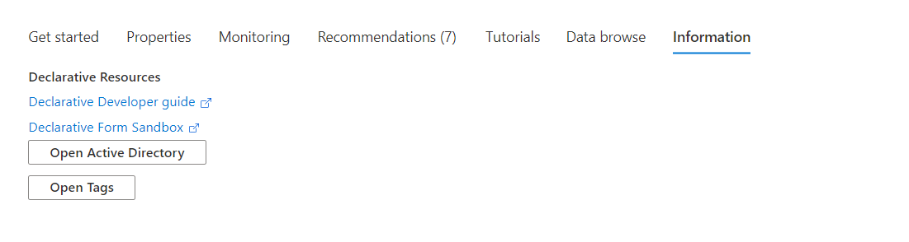

<a name="getstarted-informationtab"></a>
# getstarted-InformationTab
* [getstarted-InformationTab](#getstarted-informationtab)
    * [Description](#getstarted-informationtab-description)
    * [Definitions:](#getstarted-informationtab-definitions)
    * [UI Sample](#getstarted-informationtab-ui-sample)
    * [Sample Snippet](#getstarted-informationtab-sample-snippet)

<a name="getstarted-informationtab-description"></a>
## Description
The Information view allows you to specify an array of actions including URL, Blade and Menu open actions.
<a name="getstarted-informationtab-definitions"></a>
## Definitions:
<a name="getstarted-informationtab-definitions-an-object-with-the-following-properties"></a>
##### An object with the following properties
| Name | Required | Description
| ---|:--:|:--:|
|kind|False|Enum permitting the value: "Information".
|displayName|True|Display name for the Tab. Default value is "Information"
|features|True|Refer [InfoCard](dx-getstarted-InfoTab-InfoCardReference.md) for defining the cards
|default|False|If default is true, then set this tab as default tab. Only the first tab with valid default value will be set as default.
|fx.feature|False|
<a name="getstarted-informationtab-ui-sample"></a>
## UI Sample
  
<a name="getstarted-informationtab-sample-snippet"></a>
## Sample Snippet
  To add the Informations Tab, add the following example to the `properties.tabs` section in the [Declarative Resource Overview schema](portalfx-declarative-overview.md#declarative-resource-overview-schema)

```json
{
    "kind": "Information",
    "displayName": "Information",
    "features": [
        {
            "title": "Declarative Resources",
            "action": [
                {
                    "displayName": "Declarative Developer guide",
                    "url": "https://aka.ms/portalfx/declarative"
                },
                {
                    "displayName": "Declarative Form Sandbox",
                    "url": "https://aka.ms/form/sandbox"
                },
                {
                    "displayName": "Open Active Directory",
                    "blade": {
                    "name": "ActiveDirectoryMenuBlade",
                    "extension": "Microsoft_AAD_IAM"
                    }
                },
                {
                    "displayName": "Open Tags",
                    "menu": "tags"
                }
            ]
        }
    ]
}

```

