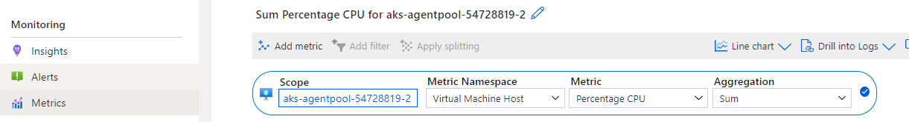

The metrics are derived from Azure Monitor.

Metrics can be defined as such
```
{
    "id": "Percentage CPU",
    "aggregationType": "Sum",
    "resourceMetadata": {
        "id": "[parameters('id')]"
    }
}
```
And the `id`, `aggregationType` and `namespace` must match what is available in Azure Monitor's `Metric`, `Aggregation` and `Metric Namespace`


