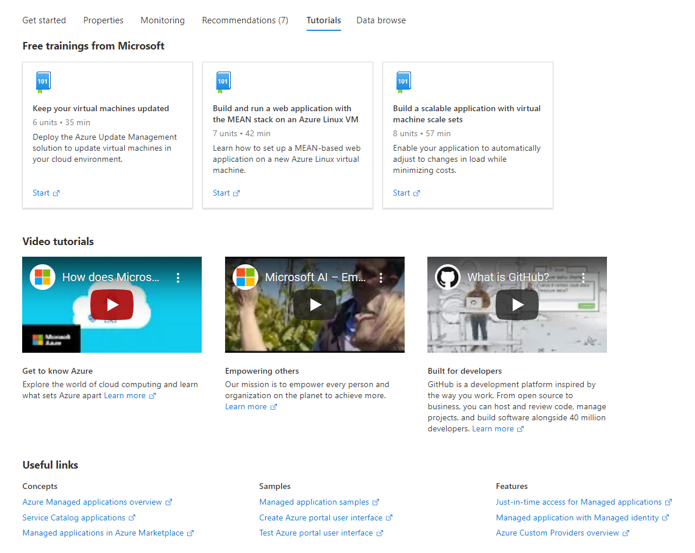

<a name="getstarted-tutorialstab"></a>
# getstarted-TutorialsTab
* [getstarted-TutorialsTab](#getstarted-tutorialstab)
    * [Description](#getstarted-tutorialstab-description)
    * [Definitions:](#getstarted-tutorialstab-definitions)
    * [UI Sample](#getstarted-tutorialstab-ui-sample)
    * [Sample Snippet](#getstarted-tutorialstab-sample-snippet)

<a name="getstarted-tutorialstab-description"></a>
## Description
The Tutorials view is used to display the most useful resource-specific Microsoft training, videos, and useful links to "How to…" documents.
<a name="getstarted-tutorialstab-definitions"></a>
## Definitions:
<a name="getstarted-tutorialstab-definitions-an-object-with-the-following-properties"></a>
##### An object with the following properties
| Name | Required | Description
| ---|:--:|:--:|
|kind|False|Enum permitting the value: "Tutorials".
|displayName|False|Display name for the Tab. Default value is "Tutorials"
|tilesGroup|False|<br>1) <code>tilesGroup.displayName</code> defines the section header for the tiles section(see UI sample for an example). <br>2) <code>tilesGroup.items</code>: See [here](dx-getstarted-tutorials-gettingStartedMSTileReference.md) for <code>tilesGroup.items</code> .
|videosGroup|False|<br>1) <code>videosGroup.displayName</code> defines the section header for the videos group section(see UI sample for an example). <br>2) <code>videosGroup.items</code>: See [here](dx-getstarted-tutorials-gettingStartedVideoCardReference.md) for <code>videosGroup.items</code> .
|linksGroup|False|<br>1) <code>linksGroup.displayName</code> defines the section header for the links group section(see UI sample for an example). <br>2) <code>linksGroup.items</code>: See [here](dx-getstarted-tutorials-gettingStartedLinksReference.md) for <code>linksGroup.items</code> .
|default|False|If default is true, then set this tab as default tab. Only the first tab with valid default value will be set as default.
|features|False|See [here](dx-getstarted-tutorials-gettingStartedVideoCardReference.md) for more.
|fx.feature|False|
<a name="getstarted-tutorialstab-ui-sample"></a>
## UI Sample
  
<a name="getstarted-tutorialstab-sample-snippet"></a>
## Sample Snippet
  To add the Tutorials view, add the following example to the `properties.tabs` section in the [Declarative Resource Overview schema](portalfx-declarative-overview.md#declarative-resource-overview-schema)

```json
{
    "kind": "Tutorials",
    "tilesGroup": {
        "displayName": {
            "property": "freeTrainingsFromMicrosoft"
        },
        "items": [
            {
                "title": {
                    "property": "tile1Title"
                },
                "icon": "MsPortalFx.Base.Images.Polychromatic.Learn",
                "subtitle": {
                    "property": "tile1Subtitle"
                },
                "description": {
                    "property": "tile1Description"
                },
                "action": {
                    "url": "https://www.azure.com",
                    "displayName": {
                        "property": "start"
                    }
                }
            }
        ]
    },
    "videosGroup": {
        "displayName": {
            "property": "tab2videosTitle"
        },
        "items": [
            {
                "title": {
                    "property": "tab2feature1Title"
                },
                "description": {
                    "property": "tab2feature1Description"
                },
                "learnMore": {
                    "url": "https://www.azure.com",
                    "ariaLabel": "Learn more about Azure"
                },
                "video": {
                    "src": "https://www.youtube.com/watch?v=KXkBZCe699A"
                }
            }
        ]
    },
    "linksGroup": {
        "displayName": "Useful links",
        "items": [
            {
                "title": "Concepts",
                "action": [
                    {
                        "url": "https://azure.microsoft.com/en-us/",
                        "displayName": "Azure Managed applications overview"
                    },
                    {
                        "url": "https://azure.microsoft.com/en-us/",
                        "displayName": "Service Catalog applications"
                    },
                    {
                        "url": "https://azure.microsoft.com/en-us/",
                        "displayName": "Managed applications in Azure Marketplace"
                    }
                ]
            }
        ]
    }
}

```

