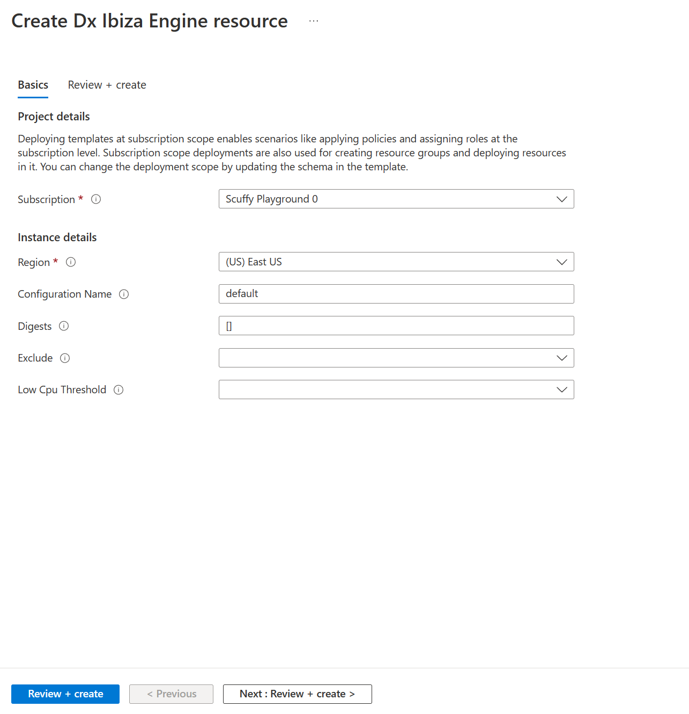

<a name="autogenformviewtype"></a>
# AutogenFormViewType
* [AutogenFormViewType](#autogenformviewtype)
    * [Description](#autogenformviewtype-description)
    * [Sections](#autogenformviewtype-sections)
    * [Properties Section](#autogenformviewtype-properties-section)
    * [UI Sample](#autogenformviewtype-ui-sample)
    * [Sample Snippet](#autogenformviewtype-sample-snippet)

<a name="autogenformviewtype-description"></a>
## Description
The AutogenForm view lets you convert ARM template to Form view and deploy a resource.
<a name="autogenformviewtype-sections"></a>
## Sections
| Name | Required | Description
| ---|:--:|:--:|
|kind|True|Enum permitting the value: "AutogenForm"
|parameters|False|Defines the parameters to be passed into a declarative blade, that then can be accessed using the parameters function. See [View parameters](dx-viewTypeParameters.md) for more.
|resources|False|The resources section takes an ARM resource id and apiVersion, which in turn makes a ARM GET request to retrieve the resource details. You can use the resources() function to retrieve the resource payload at runtime.
|properties|True|The properties section defines the AutogenForm that needs to be rendered. template and kind are required.
|fx.feature|False|
<a name="autogenformviewtype-properties-section"></a>
## Properties Section
<a name="autogenformviewtype-properties-section-an-object-with-the-following-properties"></a>
##### An object with the following properties
| Name | Required | Description
| ---|:--:|:--:|
|title|True|Title/header of the AutogenForm View displayed at the top of page
|deployment|False|Specify deployment kind and needed properties, set all deployment parameters, supply relative path to your deployment template. See [here](dx-view-autogenFormViewType-properties-deployment.md) for **deployment** property.
|fx.feature|False|
<a name="autogenformviewtype-ui-sample"></a>
## UI Sample
  
<a name="autogenformviewtype-sample-snippet"></a>
## Sample Snippet
  ### AutogenFormViewType details
To Convert to FormBlade, place ARM template file path under view.properties.deployment.template.file

<a name="autogenformviewtype-sample-snippet-example-json"></a>
#### example json

```json
{
  "$schema": "../../../Definitions/dx.schema.json",
  "view": {
    "kind": "AutogenForm",
    "properties": {
      "title": "Create Dx Ibiza Engine resource",
      "deployment": {
        "kind": "ResourceGroup",
        "template": {
          "file": "{ARM template file path}"
        }
      }
    }
  }
}

```

```json

{
  "$schema": "../../../Definitions/dx.schema.json",
  "view": {
    "kind": "AutogenForm",
    "parameters": [
        {
            "name": "parentId",
            "type": "key"
        }
    ],
    "resources": [
        {
            "id": "[parameters('parentId')]",
            "apiVersion": "0000-00-00"
        }
    ],
    "properties": {
      "title": "Create Dx Ibiza Engine resource",
      "deployment": {
        "kind": "ResourceGroup",
        "primaryResourceId": "[resources().id]",
        "templateParametersDefaultValueOverrides": {
          "profileName": "[resourceId(resources().id).name]"
        },
        "template": {
          "file": "{ARM template file path}"
        }
      }
    }
  }
}
```

