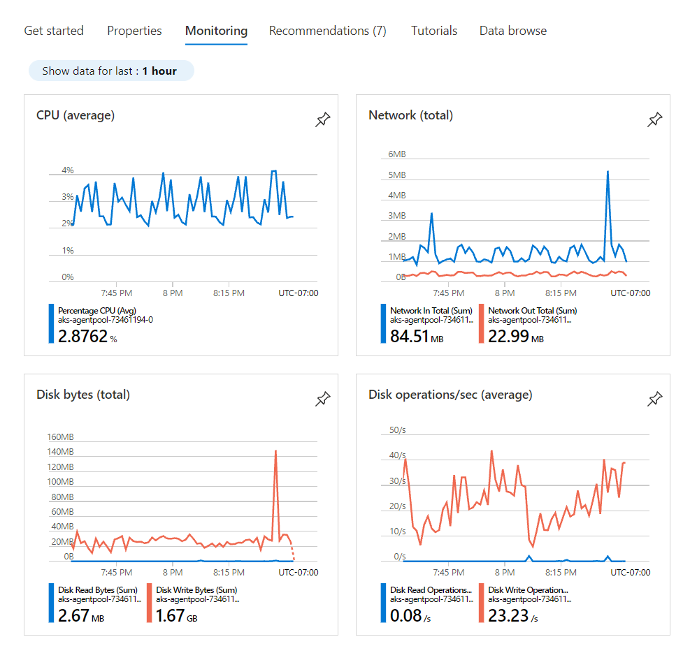

<a name="monitoringviewtype"></a>
# MonitoringViewType
* [MonitoringViewType](#monitoringviewtype)
    * [Description](#monitoringviewtype-description)
    * [Guidance](#monitoringviewtype-guidance)
        * [As a full screen blade opened from a resource menu](#monitoringviewtype-guidance-as-a-full-screen-blade-opened-from-a-resource-menu)
        * [As a tab in a resource overview (GetStarted view)](#monitoringviewtype-guidance-as-a-tab-in-a-resource-overview-getstarted-view)
    * [Sections](#monitoringviewtype-sections)
    * [Properties Section](#monitoringviewtype-properties-section)
    * [UI Sample](#monitoringviewtype-ui-sample)

<a name="monitoringviewtype-description"></a>
## Description
The Monitoring view is used to display the most useful resource-specific charts and metrics. The metrics are derived from Azure Monitor.
<a name="monitoringviewtype-guidance"></a>
## Guidance
Monitoring view can be configured to display in two ways -

1. As a full screen blade opened from a resource menu
2. As a tab in a resource overview (GetStarted view)

<a name="monitoringviewtype-guidance-as-a-full-screen-blade-opened-from-a-resource-menu"></a>
### As a full screen blade opened from a resource menu

To add the Monitoring view to be opened from a resource menu blade, add Properties definition (see `Properties definition samples` section) to the `properties.charts.items` as seen in the Monitoring view schema below.

```json
{
  "$schema": "../../../Definitions/dx.schema.json",
  "stringSource": "Resources/MyStrings.resjson",
  "view": {
    "kind": "Monitoring",
    "export": true,
    "parameters": [],
    "resources": [
      {
        "id": "[parameters('id')]",
        "apiVersion": "2020-06-01"
      }
    ],
    "essentials": {},
    "commands": [],
    "properties": {
      "title": "Monitoring Example",
      "charts": [
       {
         "title": "CPU (average)",
         "metrics": [
           {
             "id": "Percentage CPU",
             "aggregationType": "Avg",
             "resourceMetadata": {
               "id": "[parameters('id')]"
             }
            }
          ]
        }
      ]
    }
  }
}
```

<a name="monitoringviewtype-guidance-as-a-tab-in-a-resource-overview-getstarted-view"></a>
### As a tab in a resource overview (GetStarted view)

To add the Monitoring view as a tab in a resource overview, add the `Monitoring Tab` (see example) to the `properties.tabs` section as seen in the Resource Overview (GetStarted) schema below

```json
{
  "$schema": "../../Definitions/dx.schema.json",
  "stringSource": "Resources/MyStrings.resjson",
  "view": {
    "kind": "GetStarted",
    "export": true,
    "parameters": [
      {
        "name": "id",
        "type": "key"
      }
    ],
    "resources": [
      {
        "id": "[parameters('id')]",
        "apiVersion": "2014-04-01"
      }
    ],
    "essentials": {},
    "commands": [],
    "properties": {
        "title": "title",
        "tabs": [
        ]
    }
  }
}
```

<a name="monitoringviewtype-guidance-as-a-tab-in-a-resource-overview-getstarted-view-monitoring-tab-example"></a>
#### <code>Monitoring Tab</code> example

Add Properties definition (see `Properties definition samples` section) to the `charts.items` as seen in the Monitoring tab schema below. For each chart, you can define a title and metrics.

```json
{
  "kind": "Monitoring",
  "charts": [
    {
      "title": "CPU (average)",
      "metrics": [
        {
          "id": "Percentage CPU",
          "aggregationType": "Avg",
          "resourceMetadata": {
             "id": "[parameters('id')]"
          }
        }
      ]
    }
  ]
}
```
 
<a name="monitoringviewtype-sections"></a>
## Sections
| Name | Required | Description
| ---|:--:|:--:|
|kind|True|Enum permitting the value: "Monitoring".
|export|False|Enables this resulting blade to be exportable
|parameters|False|Defines the parameters that are input to the view.  Parameters can be required (key) or optional (optional).
|resources|False|Specify an array of GET ARM request based on the given Resource Id (`id`) and `apiVersion`. The response can be referenced in Property item values.
|dataSources|False|Specify an array of GET AAD Resource Graph request based on the given `path`. The response can be referenced in Property item values.
|messages|False|
|essentials|False|Defined Essentials section for Monitoring view
|commands|False|Defined Command button for Monitoring view
|properties|True|See [here](dx-view-monitoringViewType-properties.md) for more on properties.
|fx.feature|False|
<a name="monitoringviewtype-properties-section"></a>
## Properties Section
<a name="monitoringviewtype-properties-section-an-object-with-the-following-properties"></a>
##### An object with the following properties
| Name | Required | Description
| ---|:--:|:--:|
|title|True|Display title text for the Monitoring view
|charts|True|Defines the array of Monitoring view charts which contain charts and metrics.
|fx.feature|False|
<a name="monitoringviewtype-ui-sample"></a>
## UI Sample
  
