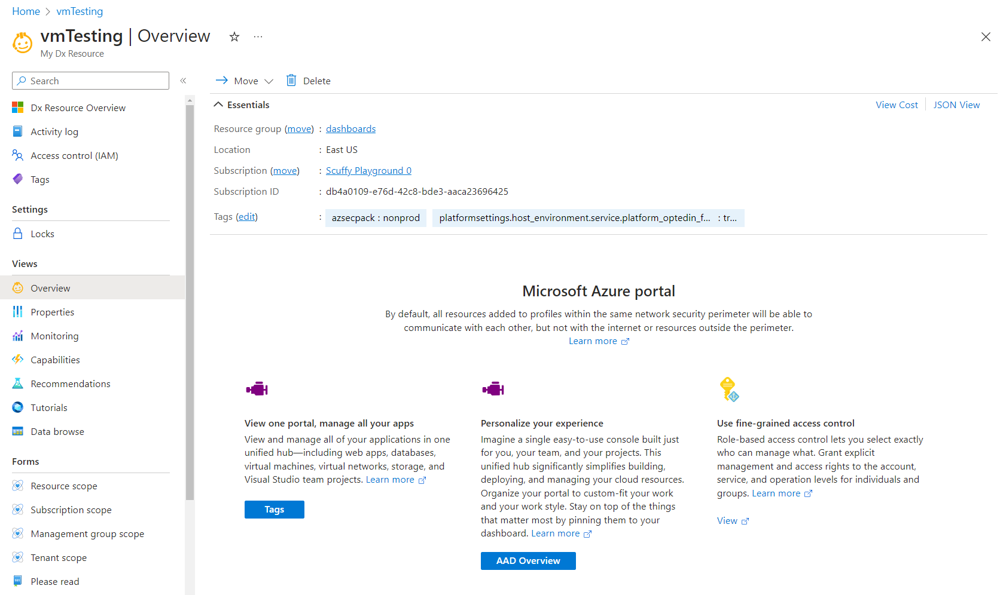

<a name="overviewviewtype"></a>
# OverviewViewType
* [OverviewViewType](#overviewviewtype)
    * [Description](#overviewviewtype-description)
    * [Guidance](#overviewviewtype-guidance)
        * [As a full screen blade opened from a resource menu](#overviewviewtype-guidance-as-a-full-screen-blade-opened-from-a-resource-menu)
    * [Sections](#overviewviewtype-sections)
    * [Properties Section](#overviewviewtype-properties-section)
    * [UI Sample](#overviewviewtype-ui-sample)

<a name="overviewviewtype-description"></a>
## Description
The Overview blade is used to showcase the top 3 resource actions and/or documents that are useful for users who are utilizing the resource for the first time.
<a name="overviewviewtype-guidance"></a>
## Guidance
<a name="overviewviewtype-guidance-as-a-full-screen-blade-opened-from-a-resource-menu"></a>
### As a full screen blade opened from a resource menu

To add the Overview view to be opened from a resource menu blade, add Properties definition (see `Properties definition samples` section) to the `properties.summary`and `properties.features` as seen in the Overview view schema below.

```json
{
  "$schema": "../../Definitions/dx.schema.json",
  "stringSource": "Resources/MyStrings.resjson",
  "view": {
    "kind": "Overview",
    "export": true,
    "parameters": [
      {
        "name": "id",
        "type": "key"
      }
    ],
    "resources": [
      {
        "id": "[parameters('id')]",
        "apiVersion": "2020-06-01"
      }
    ],
    "essentials": {},
    "commands": [
      {
        "kind": "MoveCommand",
        "id": "moveCommand",
        "displayName": {
          "property": "move"
        },
        "icon": "MsPortalFx.Base.Images.Move"
      },
      {
        "kind": "DeleteCommand",
        "id": "deleteCommand",
        "displayName": {
          "property": "delete"
        },
        "icon": "MsPortalFx.Base.Images.Delete",
        "confirmation": {
          "title": {
            "property": "deleteResourceTitle"
          },
          "message": {
            "property": "deleteResourceMessage"
          }
        },
        "definition": {
          "apiVersion": "2014-04-01"
        }
      }
    ],
    "properties": {
      "title": "title",
      "summary": {
        "title": {
          "property": "tab1Title"
        },
        "description": "By default, all resources added to profiles within the same network security perimeter will be able to communicate with each other, but not with the internet or resources outside the perimeter.",
        "learnMore": {
          "url": "https://azure.microsoft.com/en-us/features/azure-portal/",
          "ariaLabel": "Learn more about Azure Portal"
        }
      },
      "features": [
        {
          "title": {
            "property": "tab1feature1Title"
          },
          "description": {
            "property": "tab1feature1Description"
          },
          "learnMore": {
            "url": "https://azure.microsoft.com/en-us/features/azure-portal/",
            "ariaLabel": "Learn more about Azure Portal"
          },
          "icon": {
            "file": "../../Content/svg/engine.svg"
          },
          "action": [
            {
              "menu": "tags",
              "displayName": {
                "property": "tab1feature1actionDisplayName"
              }
            }
          ]
        },
        {
          "title": {
            "property": "tab1feature2Title"
          },
          "description": {
            "property": "tab1feature2Description"
          },
          "learnMore": {
            "url": "https://azure.microsoft.com/en-us/features/azure-portal/",
            "ariaLabel": "Learn more about Azure Portal"
          },
          "icon": {
            "file": "../../Content/svg/engine.svg"
          },
          "action": {
            "blade": {
              "name": "FormBladeArmRequest_Dx"
            },
            "displayName": {
              "property": "tab1feature2actionDisplayName"
            }
          }
        },
        {
          "title": {
            "property": "tab1feature3Title"
          },
          "description": {
            "property": "tab1feature3Description"
          },
          "learnMore": {
            "url": "https://azure.microsoft.com/en-us/features/azure-portal/",
            "ariaLabel": "Learn more about Azure Portal"
          },
          "icon": {
            "file": "../../Content/svg/msi.svg"
          },
          "action": {
            "url": "https://www.azure.com",
            "displayName": {
              "property": "tab1feature3actionDisplayName"
            }
          }
        }
      ]
    }
  }
}
```
 
<a name="overviewviewtype-sections"></a>
## Sections
| Name | Required | Description
| ---|:--:|:--:|
|kind|True|Enum permitting the value: "Overview".
|export|False|Designation for blade sharing across extensions. If set to `true` then it is available to be used by other extensions.
|parameters|False|Defines the parameters to be passed into a declarative blade, that then can be accessed using the parameters function. See [View parameters](dx-viewTypeParameters.md) for more.
|resources|False|The resources section takes an ARM resource id and apiVersion, which in turn makes a ARM GET request to retrieve the resource details. You can use the resources() function to retrieve the resource payload at runtime.
|dataSources|False|Supports Graph API. Use it to pre-load graph API before the view is rendered. See [here](dx-viewTypeDataSources.md) for **dataSources** property.
|messages|False|Display a banner at the top of the view. See [here](dx-enum-viewTypeMessages-items-kind.md) for details.
|essentials|False|Defines Essentials section for the view
|commands|False|The commands section defines the Commands in the command bar.See [here](dx-viewTypeCommands.md) for **commands** property.
|properties|True|See [here](dx-view-overviewViewType-properties.md) for more on properties.
|fx.feature|False|
<a name="overviewviewtype-properties-section"></a>
## Properties Section
<a name="overviewviewtype-properties-section-an-object-with-the-following-properties"></a>
##### An object with the following properties
| Name | Required | Description
| ---|:--:|:--:|
|title|True|Display title text for the Overview view
|summary|True|See [Overview Summary](dx-view-overviewViewType-SummaryReference.md) for how to define summary.
|features|True|See [Overview Cards](dx-getstarted-IconCardReference.md) for how to define cards.
|fx.feature|False|
<a name="overviewviewtype-ui-sample"></a>
## UI Sample
  
