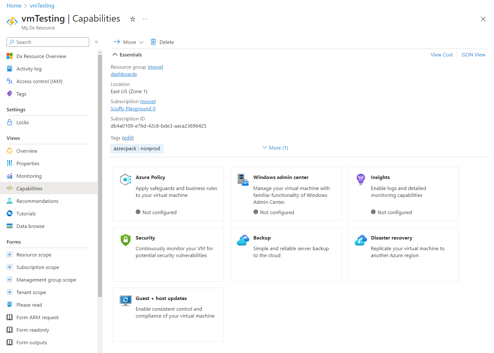

<a name="capabilitiesviewtype"></a>
# CapabilitiesViewType
* [CapabilitiesViewType](#capabilitiesviewtype)
    * [Description](#capabilitiesviewtype-description)
    * [Guidance](#capabilitiesviewtype-guidance)
        * [As a full screen blade opened from a resource menu](#capabilitiesviewtype-guidance-as-a-full-screen-blade-opened-from-a-resource-menu)
        * [As a tab in a resource overview (GetStarted view)](#capabilitiesviewtype-guidance-as-a-tab-in-a-resource-overview-getstarted-view)
    * [Sections](#capabilitiesviewtype-sections)
    * [Properties Section](#capabilitiesviewtype-properties-section)
    * [UI Sample](#capabilitiesviewtype-ui-sample)

<a name="capabilitiesviewtype-description"></a>
## Description
The Capabilities view is used to highlight valuable features of a resource that are not part of the Get Started or Properties content.
<a name="capabilitiesviewtype-guidance"></a>
## Guidance
Capabilities view can be configured to display in two ways -

1. As a full screen blade opened from a resource menu
2. As a tab in a resource overview (GetStarted view)

<a name="capabilitiesviewtype-guidance-as-a-full-screen-blade-opened-from-a-resource-menu"></a>
### As a full screen blade opened from a resource menu

To add the Capabilities view to be opened from a resource menu blade, add Properties definition (see `Properties definition samples` section) to the `properties.capabilities.items` as seen in the Capabilities view schema below.

```json
{
  "$schema": "../../../Definitions/dx.schema.json",
  "stringSource": "Resources/MyStrings.resjson",
  "view": {
    "kind": "Capabilities",
    "export": true,
    "parameters": [],
    "resources": [
      {
        "id": "[parameters('id')]",
        "apiVersion": "2020-06-01"
      }
    ],
    "essentials": {},
    "commands": [],
    "properties": {
      "title": "Capabilities Example",
      "capabilities": [
        {
          "title": "Backup",
          "icon": "MsPortalFx.Base.Images.Polychromatic.Backup",
          "description": "Simple and reliable server backup to the cloud",
          "action": {
            "menu": "tags"
          },
          "status": {
            "value": "[contains(resources().name, 'test')]",
            "valueMapping": [
              {
                "value": "true",
                "displayName": "Configured",
                "icon": "MsPortalFx.Base.Images.StatusBadge.Success"
              },
              {
                "value": "false",
                "displayName": "Not configured",
                "icon": "MsPortalFx.Base.Images.StatusBadge.None",
                "action": {
                  "blade": {
                    "name": "",
                    "extension": "",
                    "parameters": {},
                    "inContextPane": true
                  }
                }
              }
            ]
          }
        },
        {
          "title": "Disaster recovery",
          "icon": "MsPortalFx.Base.Images.Polychromatic.SiteRecovery",
          "description": "Replicate your virtual machine to another Azure region",
          "action": {
            "menu": "tags"
          },
          "status": {
            "value": "[not(contains(resources().name, 'test'))]",
            "valueMapping": [
              {
                "value": "true",
                "displayName": "Configured",
                "icon": "MsPortalFx.Base.Images.StatusBadge.Success"
              },
              {
                "value": "false",
                "displayName": "Not configured",
                "icon": "MsPortalFx.Base.Images.StatusBadge.None",
                "action": {
                  "blade": {
                    "name": "",
                    "extension": "",
                    "parameters": {},
                    "inContextPane": true
                  }
                }
              }
            ]
          }
        },
        {
          "title": "Insights",
          "icon": "MsPortalFx.Base.Images.Polychromatic.Insights",
          "description": "Enable logs and detailed monitoring capabilities",
          "action": {
            "menu": "tags"
          },
          "status": {
            "value": "[resources().properties.test]",
            "valueMapping": [
              {
                "value": "present",
                "displayName": "Configured",
                "icon": "MsPortalFx.Base.Images.StatusBadge.Success"
              },
              {
                "value": "notPresent",
                "displayName": "Not configured",
                "icon": "MsPortalFx.Base.Images.StatusBadge.None",
                "action": {
                  "blade": {
                    "name": "",
                    "extension": "",
                    "parameters": {},
                    "inContextPane": true
                  }
                }
              },
              {
                "value": "null",
                "displayName": "Error",
                "icon": "MsPortalFx.Base.Images.StatusBadge.Error"
              },
              {
                "value": "undefined",
                "displayName": "Error",
                "icon": "MsPortalFx.Base.Images.StatusBadge.Error"
              }
            ]
          }
        },
        {
          "title": "Security",
          "icon": "MsPortalFx.Base.Images.Polychromatic.SslCustomDomains",
          "description": "Continuously monitor your VM for potential security vulnerabilities",
          "action": {
            "menu": "tags"
          }
        }
      ]
    }
  }
}
```

<a name="capabilitiesviewtype-guidance-as-a-tab-in-a-resource-overview-getstarted-view"></a>
### As a tab in a resource overview (GetStarted view)

To add the Capabilities view as a tab in a resource overview, add the `Capabilities Tab` (see example) to the `properties.tabs` section as seen in the Resource Overview (GetStarted) schema below

```json
{
  "$schema": "../../Definitions/dx.schema.json",
  "stringSource": "Resources/MyStrings.resjson",
  "view": {
    "kind": "GetStarted",
    "export": true,
    "parameters": [
      {
        "name": "id",
        "type": "key"
      }
    ],
    "resources": [
      {
        "id": "[parameters('id')]",
        "apiVersion": "2014-04-01"
      }
    ],
    "essentials": {},
    "commands": [],
    "properties": {
        "title": "title",
        "tabs": [
        ]
    }
  }
}
```

<a name="capabilitiesviewtype-guidance-as-a-tab-in-a-resource-overview-getstarted-view-capabilities-tab-example"></a>
#### <code>Capabilities Tab</code> example

Add Properties definition (see `Properties definition samples` section) to the `capabilities.items` as seen in the Capabilities tab schema below.

```json
{
  "kind": "Capabilities",
  "capabilities": [
    {
      "title": "Backup",
      "icon": "MsPortalFx.Base.Images.Polychromatic.Backup",
      "description": "Simple and reliable server backup to the cloud",
      "action": {
        "menu": "tags"
      },
      "status": {
        "value": "[contains(resources().name, 'test')]",
        "valueMapping": [
          {
            "value": "true",
            "displayName": "Configured",
            "icon": "MsPortalFx.Base.Images.StatusBadge.Success"
          },
          {
            "value": "false",
            "displayName": "Not configured",
            "icon": "MsPortalFx.Base.Images.StatusBadge.None",
            "action": {
              "blade": {
                "name": "",
                "extension": "",
                "parameters": {},
                "inContextPane": true
              }
            }
          }
        ]
      }
    },
    {
      "title": "Disaster recovery",
      "icon": "MsPortalFx.Base.Images.Polychromatic.SiteRecovery",
      "description": "Replicate your virtual machine to another Azure region",
      "action": {
        "menu": "tags"
      },
      "status": {
        "value": "[not(contains(resources().name, 'test'))]",
        "valueMapping": [
          {
            "value": "true",
            "displayName": "Configured",
            "icon": "MsPortalFx.Base.Images.StatusBadge.Success"
          },
          {
            "value": "false",
            "displayName": "Not configured",
            "icon": "MsPortalFx.Base.Images.StatusBadge.None",
            "action": {
              "blade": {
                "name": "",
                "extension": "",
                "parameters": {},
                "inContextPane": true
              }
            }
          }
        ]
      }
    },
    {
      "title": "Insights",
      "icon": "MsPortalFx.Base.Images.Polychromatic.Insights",
      "description": "Enable logs and detailed monitoring capabilities",
      "action": {
        "menu": "tags"
      },
      "status": {
        "value": "[resources().properties.test]",
        "valueMapping": [
          {
            "value": "present",
            "displayName": "Configured",
            "icon": "MsPortalFx.Base.Images.StatusBadge.Success"
          },
          {
            "value": "notPresent",
            "displayName": "Not configured",
            "icon": "MsPortalFx.Base.Images.StatusBadge.None",
            "action": {
              "blade": {
                "name": "",
                "extension": "",
                "parameters": {},
                "inContextPane": true
              }
            }
          },
          {
            "value": "null",
            "displayName": "Error",
            "icon": "MsPortalFx.Base.Images.StatusBadge.Error"
          },
          {
            "value": "undefined",
            "displayName": "Error",
            "icon": "MsPortalFx.Base.Images.StatusBadge.Error"
          }
        ]
      }
    },
    {
      "title": "Security",
      "icon": "MsPortalFx.Base.Images.Polychromatic.SslCustomDomains",
      "description": "Continuously monitor your VM for potential security vulnerabilities",
      "action": {
        "menu": "tags"
      }
    }
  ]
}
```
 
<a name="capabilitiesviewtype-sections"></a>
## Sections
| Name | Required | Description
| ---|:--:|:--:|
|kind|True|Enum permitting the value: "Capabilities".
|export|False|Designation for blade sharing across extensions. If set to `true` then it is available to be used by other extensions.
|parameters|False|Defines the parameters to be passed into a declarative blade, that then can be accessed using the parameters function. See [View parameters](dx-viewTypeParameters.md) for more.
|resources|False|The resources section takes an ARM resource id and apiVersion, which in turn makes a ARM GET request to retrieve the resource details. You can use the resources() function to retrieve the resource payload at runtime.
|dataSources|False|Supports Graph API. Use it to pre-load graph API before the view is rendered. See [here](dx-viewTypeDataSources.md) for **dataSources** property.
|messages|False|Display a banner at the top of the view. See [here](dx-enum-viewTypeMessages-items-kind.md) for details.
|essentials|False|Defines Essentials section for the view
|commands|False|The commands section defines the Commands in the command bar.See [here](dx-viewTypeCommands.md) for **commands** property.
|properties|True|See [here](dx-view-capabilitiesViewType-properties.md) for more on properties.
|fx.feature|False|
<a name="capabilitiesviewtype-properties-section"></a>
## Properties Section
<a name="capabilitiesviewtype-properties-section-an-object-with-the-following-properties"></a>
##### An object with the following properties
| Name | Required | Description
| ---|:--:|:--:|
|title|True|Display title text for the Capabilities view
|capabilities|True|Defines the array of Capabilities tiles.
|fx.feature|False|
<a name="capabilitiesviewtype-ui-sample"></a>
## UI Sample
  
