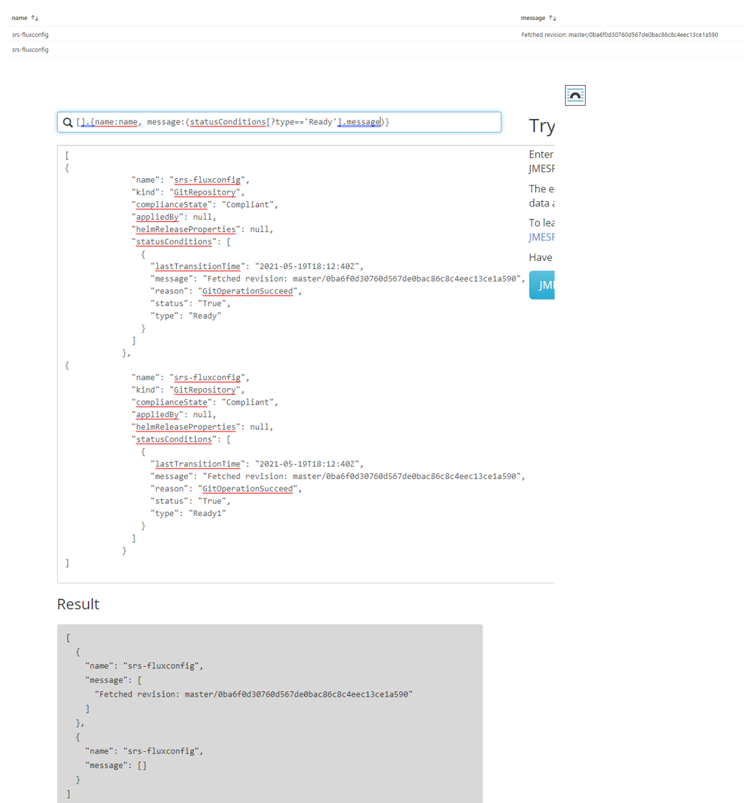

<a name="example-1"></a>
### Example 1
```json
{
    "kind": "DataBrowse",
    "displayName": "Data browse",
    "ariaLabel": "testing",
    "data": {
        "transforms": "[concat('[', '@.{caching:caching, createOption: createOption, name: name, osType:osType, managedDisk:managedDisk.to_string(@)}', ']')]",
        "input": "[resources().properties.storageProfile.osDisk]"
    }
}
```

<a name="example-2"></a>
### Example 2




please visit [here](https://jmespath.org/) to try out JMESPath
