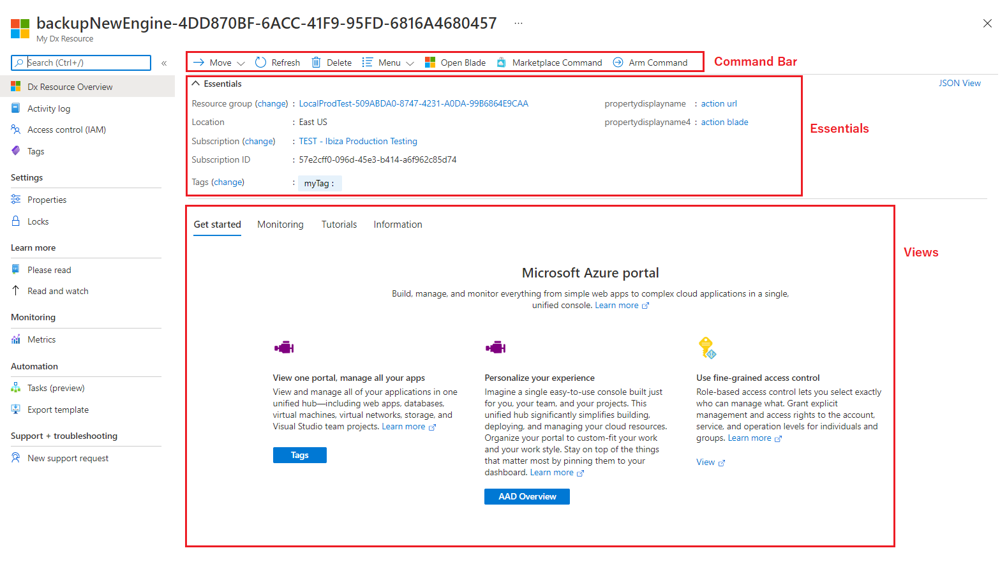

<a name="getstartedviewtype"></a>
# GetstartedViewType
* [GetstartedViewType](#getstartedviewtype)
    * [Description](#getstartedviewtype-description)
    * [Guidance](#getstartedviewtype-guidance)
    * [Getting started with Declarative Resource Overview blade](#getstartedviewtype-getting-started-with-declarative-resource-overview-blade)
        * [List of Supported Tabs](#getstartedviewtype-getting-started-with-declarative-resource-overview-blade-list-of-supported-tabs)
    * [Sections](#getstartedviewtype-sections)
    * [Properties Section](#getstartedviewtype-properties-section)
    * [UI Sample](#getstartedviewtype-ui-sample)

<a name="getstartedviewtype-description"></a>
## Description
The Declarative Resource Overview blade is is the home page for your resource, which provides the purpose, top actions and key information so that users can quickly get value from your resource.
<a name="getstartedviewtype-guidance"></a>
## Guidance

The Declarative Resource Overview blade includes the following sections:

1. Command bar - Define actions for your resource
2. Essentials - Display key properties of your resource
3. Views - Display key information of your resource


<a name="getstartedviewtype-getting-started-with-declarative-resource-overview-blade"></a>
## Getting started with Declarative Resource Overview blade

Below is an example the Declarative Resource Overview blade schema, as defined by the `GetStarted` kind. The `resources` section takes an ARM `id` and `apiVersion`, which in turn makes a ARM GET request to retrieve the resource details.  You can use the `resources()` function to retrieve the resource payload at runtime.


<a name="getstartedviewtype-getting-started-with-declarative-resource-overview-blade-declarative-resource-overview-schema"></a>
##### Declarative Resource Overview schema
<a name="resourceoverviewschema"></a>
```json
{
  "$schema": "../../Definitions/dx.schema.json",
  "stringSource": "Resources/MyStrings.resjson",
  "view": {
    "kind": "GetStarted",
    "export": true,
    "parameters": [
      {
        "name": "id",
        "type": "key"
      }
    ],
    "resources": [
      {
        "id": "[parameters('id')]",
        "apiVersion": "2014-04-01"
      }
    ],
    "essentials": {},
    "commands": [],
    "properties": {
        "title": "title",
        "tabs": []
    }
  }
}
```
The `essentials` section defines what is rendered in Essentials. The `messages` section defines the message in views. Only one message is displayed, the first message item which visible is 'true'. The `commands` section defines the Commands in the command bar. The `properties` section defines the tabbed Views to be rendered (under Essentials).  See below for an illustration.

<a name="getstartedviewtype-getting-started-with-declarative-resource-overview-blade-list-of-supported-tabs"></a>
### List of Supported Tabs
- [Getting Started](dx-getstarted-GetStartedTab.md)
- [Properties](dx-getstarted-PropertiesTab.md)
- [Monitoring](dx-getstarted-MonitoringTab.md)
- [Capabilities](dx-getstarted-CapabilitiesTab.md)
- [Recommendations](dx-getstarted-RecommendationsTab.md)
- [Tutorials](dx-getstarted-TutorialsTab.md)
- [DataBrowse](dx-getstarted-DataBrowseTab.md)
- [Information](dx-getstarted-InformationTab.md)
 
<a name="getstartedviewtype-sections"></a>
## Sections
| Name | Required | Description
| ---|:--:|:--:|
|kind|True|Enum permitting the value: "GetStarted".
|export|False|Designation for blade sharing across extensions. If set to `true` then it is available to be used by other extensions.
|contextPaneWidth|False|See [here](dx-enum-contextPaneWidth.md ) for the available options
|parameters|False|Defines the parameters to be passed into a declarative blade, that then can be accessed using the parameters function. See [View parameters](dx-viewTypeParameters.md) for more.
|resources|False|The resources section takes an ARM resource id and apiVersion, which in turn makes a ARM GET request to retrieve the resource details. You can use the resources() function to retrieve the resource payload at runtime.
|dataSources|False|Supports Graph API. Use it to pre-load graph API before the view is rendered. See [here](dx-viewTypeDataSources.md) for **dataSources** property.
|messages|False|Display a banner at the top of the view. See [here](dx-viewTypeMessages.md) for details.
|essentials|False|Defines Essentials section for the view
|commands|False|The commands section defines the Commands in the command bar.See [here](dx-viewTypeCommands.md) for **commands** property.
|properties|False|The properties section defines the tabbed Views to be rendered (under Essentials). See below for an illustration
|fx.feature|False|
<a name="getstartedviewtype-properties-section"></a>
## Properties Section
<a name="getstartedviewtype-properties-section-an-object-with-the-following-properties"></a>
##### An object with the following properties
| Name | Required | Description
| ---|:--:|:--:|
|title|True|Title of the GetStarted Tab
|tabs|True|See [List of Supported Tabs](#list-of-supported-tabs)
|fx.feature|False|
<a name="getstartedviewtype-ui-sample"></a>
## UI Sample
  
