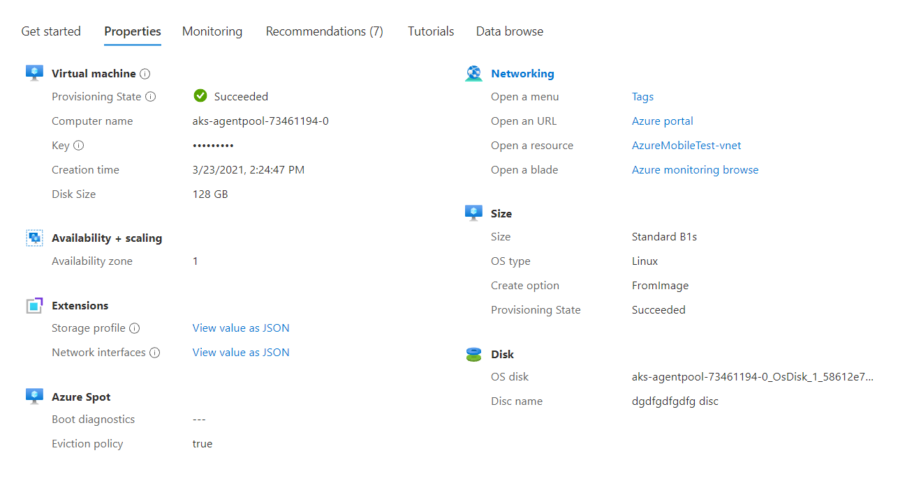

<a name="propertiesviewtype"></a>
# PropertiesViewType
* [PropertiesViewType](#propertiesviewtype)
    * [Description](#propertiesviewtype-description)
    * [Guidance](#propertiesviewtype-guidance)
        * [As a full screen blade opened from a resource menu](#propertiesviewtype-guidance-as-a-full-screen-blade-opened-from-a-resource-menu)
        * [As a tab in a resource overview (GetStarted view)](#propertiesviewtype-guidance-as-a-tab-in-a-resource-overview-getstarted-view)
    * [Sections](#propertiesviewtype-sections)
    * [Properties Section](#propertiesviewtype-properties-section)
    * [UI Sample](#propertiesviewtype-ui-sample)
    * [Sample Snippet](#propertiesviewtype-sample-snippet)
        * [Grouping](#propertiesviewtype-sample-snippet-grouping)
        * [Resources and Datasources](#propertiesviewtype-sample-snippet-resources-and-datasources)
        * [Property Items](#propertiesviewtype-sample-snippet-property-items)

<a name="propertiesviewtype-description"></a>
## Description
The Properties view is used to showcase resource-specific properties that are frequently accessed by users for the given resource. It can be used as a standalone properties view or as one of the tabs in a resource overview. The Properties view supports adding Secret and Date formats for secure string and datetime values respectively. It also supports adding sourceUnits and maximumFractionDigits for number value. SourceUnits indicates the unit of the original value. MaximumFractionDigits indicates the maximum fraction digits for the display value. The correct display unit is then automatically calculated. For example, if the original value is 1,363,148 SI bytes, and you specify source unit as `Bytes_SI` and MaximumFractionDigits as 1, the display string will be 1.3 GB. Properties view also supports adding an action link to an URL, a resource or a blade. You can learn more about the design pattern for properties [here](design-patterns-resource-manage.md#-example-properties-content-).
<a name="propertiesviewtype-guidance"></a>
## Guidance
Properties view can be configured to display in two ways -

1. As a full screen blade opened from a resource menu
2. As a tab in a resource overview (GetStarted view)

<a name="propertiesviewtype-guidance-as-a-full-screen-blade-opened-from-a-resource-menu"></a>
### As a full screen blade opened from a resource menu

To add the Properties view to be opened from a resource menu blade, add Properties definition (see `Properties definition samples` section) to the `properties.groups.items` as seen in the Properties view schema below.

```json
{
  "$schema": "../../../Definitions/dx.schema.json",
  "stringSource": "Resources/MyStrings.resjson",
  "view": {
    "kind": "Properties",
    "export": true,
    "parameters": [],
    "resources": [
      {
        "id": "[parameters('id')]",
        "apiVersion": "2020-06-01"
      }
    ],
    "essentials": {},
    "commands": [],
    "properties": {
      "title": "Properties Example",
      "groups": [
        {
          "displayName": "Virtual machine",
          "icon": "MsPortalFx.Base.Images.Polychromatic.VirtualMachine",
          "description": "This is a virtual machine.",
          "items": [
          ]
        },
        {
          "displayName": "Availability + scaling",
          "icon": "MsPortalFx.Base.Images.Polychromatic.AvailabilitySet",
          "items": [
          ]
        }
      ]
    }
  }
}
```

<a name="propertiesviewtype-guidance-as-a-tab-in-a-resource-overview-getstarted-view"></a>
### As a tab in a resource overview (GetStarted view)

To add the Properties view as a tab in a resource overview, add the `Properties Tab` (see example) to the `properties.tabs` section as seen in the Resource Overview (GetStarted) schema below

```json
{
  "$schema": "../../Definitions/dx.schema.json",
  "stringSource": "Resources/MyStrings.resjson",
  "view": {
    "kind": "GetStarted",
    "export": true,
    "parameters": [
      {
        "name": "id",
        "type": "key"
      }
    ],
    "resources": [
      {
        "id": "[parameters('id')]",
        "apiVersion": "2014-04-01"
      }
    ],
    "essentials": {},
    "commands": [],
    "properties": {
        "title": "title",
        "tabs": [
        ]
    }
  }
}
```

<a name="propertiesviewtype-guidance-as-a-tab-in-a-resource-overview-getstarted-view-properties-tab-example"></a>
#### <code>Properties Tab</code> example

Add Properties definition (see `Properties definition samples` section) to the `groups.items` as seen in the Properties tab schema below. For each group, you can define a `Menu action` which will enable a hyperlink for the group display name to open the defined menu item.

```json
{
    "kind": "Properties",
    "groups": [
        {
            "displayName": "Virtual machine",
            "icon": "MsPortalFx.Base.Images.Polychromatic.VirtualMachine",
            "action": {
                "menu": "tags"
            },
            "description": "This is a virtual machine.",
            "items": [
            ]
        }
    ]
}
```
 
<a name="propertiesviewtype-sections"></a>
## Sections
| Name | Required | Description
| ---|:--:|:--:|
|kind|True|Enum permitting the value: "Properties".
|export|False|Enables this resulting blade to be exportable
|contextPaneWidth|False|See [here](dx-enum-contextPaneWidth.md ) for the available options
|parameters|False|Defines the parameters that are input to the view. Parameters can be required (key) or optional (optional).
|resources|False|Specify an array of GET ARM request based on the given Resource Id (`id`) and `apiVersion`. The response can be referenced in Property item values.
|dataSources|False|Specify an array of GET AAD Resource Graph request based on the given `path`. The response can be referenced in Property item values.
|essentials|False|Defines Essentials section for Properties view
|commands|False|Defines Command button for Properties view
|properties|True|See [here](dx-view-propertiesViewType-properties.md) for more on properties.
|fx.feature|False|
<a name="propertiesviewtype-properties-section"></a>
## Properties Section
<a name="propertiesviewtype-properties-section-an-object-with-the-following-properties"></a>
##### An object with the following properties
| Name | Required | Description
| ---|:--:|:--:|
|title|True|Display title text for the Properties view
|groups|True|Defines the array of property view groups which contain property view items.
|fx.feature|False|
<a name="propertiesviewtype-ui-sample"></a>
## UI Sample
  
<a name="propertiesviewtype-sample-snippet"></a>
## Sample Snippet
  ## Properties definition samples

<a name="propertiesviewtype-sample-snippet-grouping"></a>
### Grouping

- Properties view is made up of groupings of property items
- A link to open a resource menu item, on click of the group display name, can be optionally configured. The `action.menu` referenced must exists for this action to work. If the `action` is configured, the group display name will render as a clickable link.
- Icon can be optionally configured. For complete list of supported icons, go to [icon enum](./dx-enum-svgEnum.md).
- Property items are added to the `items` array to be rendered under the same group
```json
{
    "displayName": "Disk",
    "icon": "MsPortalFx.Base.Images.Polychromatic.Discs",
    "action": {
        "menu": "disk"
    },
    "items": [
    ]
}
```

<a name="propertiesviewtype-sample-snippet-resources-and-datasources"></a>
### Resources and Datasources

Property values of a resource are often available at runtime.  In order to access these runtime data, the Properties view allows two types of GET operations

<a name="propertiesviewtype-sample-snippet-resources-and-datasources-arm-request"></a>
#### ARM Request

The `resources` is an array of ARM GET Request, which are executed when the Properties view is loaded. To define ARM Request, provide a valid ResourceID (id) and apiVersion.  You can have an array of ARM Request which is distinguishable with the `name` property
```json
"resources": [
    {
        "id": "[parameters('id')]",
        "apiVersion": "2020-06-01"
    },
    {
        "name": "vmInstanceView",
        "id": "[concat(parameters('id'), '?$expand=instanceView')]",
        "apiVersion": "2021-03-01"
    }
]
```
Example of referencing the response of the ARM Request
```json
{
    "displayName": "Disk Size",
    "value": "[resources().properties.storageProfile.osDisk.diskSizeGB]",
    "sourceUnits": "Gigabytes",
    "maximumFractionDigits": 2
}
{
    "displayName": "Visible if VM running",
    "value": "[resources('vmInstanceView').properties.instanceView.statuses.1.displayStatus]",
    "visible": "[equals(resources('vmInstanceView').properties.instanceView.statuses.1.code, 'PowerState/running')]"
}
```

<a name="propertiesviewtype-sample-snippet-resources-and-datasources-azure-active-directory-resource-graph-request"></a>
#### Azure Active Directory Resource Graph Request

The `dataSources` is an array of Resource Graph GET Request, which are executed when the Properties view is loaded. To define Resource Graph request, provide a valid Resource Graph query in the `path` property.  You can have an array of Resource Graph request which is distinguishable with the `name` property. Go [here](https://developer.microsoft.com/en-us/graph/graph-explorer) for help with Resource Graph query. Only Applications and Users queries are supported.

```json
"dataSources": [
    {
        "kind": "graph",
        "name": "graph",
        "path": "v1.0/me?$select=displayName,id,mail"
    }
],
```json

Example of referencing the response of the Resource Graph Request

```json
"name": "[dataSources('graph').displayName]"
```

<a name="propertiesviewtype-sample-snippet-property-items"></a>
### Property Items

<a name="propertiesviewtype-sample-snippet-property-items-actions"></a>
#### Actions

URL action - Enables clickable `url` that opens in a new browser window
```json
{
    "displayName": "Azure portal",
    "value": "https://azure.microsoft.com/",
    "action": {
        "url": "https://azure.microsoft.com/"
    }
}
```

Resource action - Enables clickable link that opens the Resource Overview for the specified `resourceId`
```json
{
    "displayName": "Open a resource",
    "value": "Resource name",
    "action": {
        "resourceId": "/subscriptions/{subscription}/resourcegroups/{resourcegroup}/providers/{provider}/{resourceType}/{resourceName}"
    }
}
```
Blade action - Enables clickable link that opens an Azure Portal blade defined by `blade` property
```json
{
    "displayName": "Open a blade",
    "value": "Blade name",
    "action": {
        "blade": {
            "name": "A blade name",
            "extension": "An extension name",
            "parameters": {
                "resId": "[resources().id]"
            }
        }
    }
}
```

Menu action - Enables clickable link that opens a menu item as defined by `action.menu`.  The menu must exists in the menu definition.
```json
{
    "displayName": "Open a menu",
    "value": "Tags",
    "action": {
        "menu": "tags"
    }
}
```

<a name="propertiesviewtype-sample-snippet-property-items-valuemapping"></a>
#### valueMapping

- valueMapping enables localization of the display name for the Property definition
- valueMapping allows multiple `displayName` to be used for a single Property definition where the `valueMapping.displayName` is displayed in the UI when `valueMapping.value` matches the `value` of the property
- valueMapping also supports displaying seperate `icon` types for each `valueMapping`.  For complete list of supported icons, go to [icon enum](./dx-enum-svgEnum.md).
```json
{
    "displayName": "Provisioning State",
    "value": "[resources().properties.provisioningState]",
    "description": "This is provisioning state.",
    "valueMapping": [
      {
        "value": "Succeeded",
        "displayName": "Succeeded",
        "icon": "MsPortalFx.Base.Images.StatusBadge.Outline.Success"
      },
      {
        "value": "Warning",
        "displayName": "Warning",
        "icon": "MsPortalFx.Base.Images.StatusBadge.Outline.Warning"
      },
      {
        "value": "Failed",
        "displayName": "Failed",
        "icon": "MsPortalFx.Base.Images.StatusBadge.Outline.Failed"
      }
    ]
}
```

<a name="propertiesviewtype-sample-snippet-property-items-format"></a>
#### Format

Secret - display the content in asterisks (*)
```json
{
    "displayName": "Key",
    "value": "[resources().id]",
    "format": "Secret"
}
```
Date - display the content as date value
```json
{
    "displayName": "Creation time",
    "value": "2021-03-23T21:24:47.7856737Z",
    "format": "Date"
}
```

<a name="propertiesviewtype-sample-snippet-property-items-sourceunit"></a>
#### SourceUnit

- All supported [source unit enums](./dx-enum-propertySourceUnits.md)
- Use `maximumFractionDigits` to set the number of decimal digits to display
```json
{
    "displayName": "Disk Size",
    "value": "[resources().properties.diskSize]",
    "sourceUnits": "Gigabytes",
    "maximumFractionDigits": 2
}
```

<a name="propertiesviewtype-sample-snippet-property-items-visibility"></a>
#### Visibility

- Visibility of the property item can be used to show/hide the property item
- If the `visible` property is set to **true** then the property item will show; otherwise, it will not be visible.  Default is **true**.
```json
{
    "displayName": "Visible if VM running",
    "value": "[resources('vmInstanceView').properties.instanceView.statuses.1.displayStatus]",
    "visible": "[equals(resources('vmInstanceView').properties.instanceView.statuses.1.code, 'PowerState/running')]"
}
```

