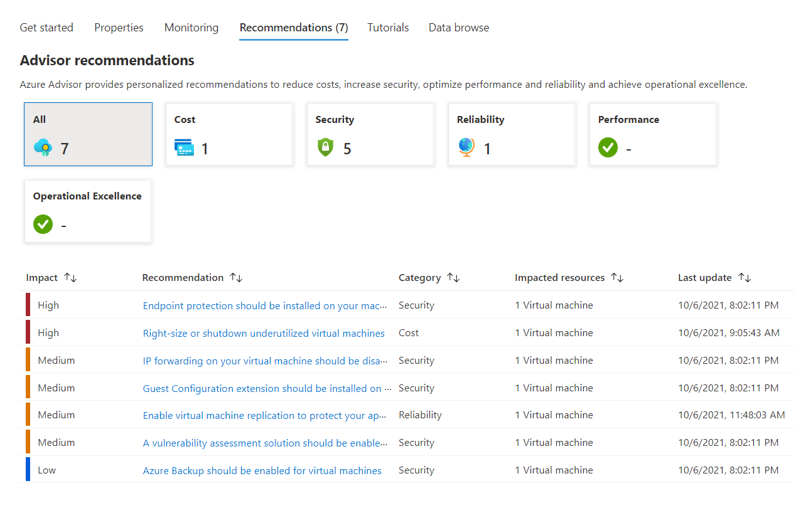

<a name="recommendationsviewtype"></a>
# RecommendationsViewType
* [RecommendationsViewType](#recommendationsviewtype)
    * [Description](#recommendationsviewtype-description)
    * [Guidance](#recommendationsviewtype-guidance)
        * [As a full screen blade opened from a resource menu](#recommendationsviewtype-guidance-as-a-full-screen-blade-opened-from-a-resource-menu)
        * [As a tab in a resource overview (GetStarted view)](#recommendationsviewtype-guidance-as-a-tab-in-a-resource-overview-getstarted-view)
    * [Sections](#recommendationsviewtype-sections)
    * [Properties Section](#recommendationsviewtype-properties-section)
    * [UI Sample](#recommendationsviewtype-ui-sample)

<a name="recommendationsviewtype-description"></a>
## Description
The Recommendations view is used to show the active Azure Advisor recommendations for the resource.
<a name="recommendationsviewtype-guidance"></a>
## Guidance
Recommendations view can be configured to display in two ways -

1. As a full screen blade opened from a resource menu
2. As a tab in a resource overview (GetStarted view)

<a name="recommendationsviewtype-guidance-as-a-full-screen-blade-opened-from-a-resource-menu"></a>
### As a full screen blade opened from a resource menu

To add the Recommendations view to be opened from a resource menu blade, add Properties definition (see `Properties definition samples` section) in the Recommendations view schema below.

```json
{
  "$schema": "../../../Definitions/dx.schema.json",
  "stringSource": "Resources/MyStrings.resjson",
  "view": {
    "kind": "Recommendations",
    "export": true,
    "parameters": [],
    "resources": [
      {
        "id": "[parameters('id')]",
        "apiVersion": "2020-06-01"
      }
    ],
    "essentials": {},
    "commands": [],
    "properties": {
      "title": "Recommendations Example"
    }
  }
}
```

<a name="recommendationsviewtype-guidance-as-a-tab-in-a-resource-overview-getstarted-view"></a>
### As a tab in a resource overview (GetStarted view)

To add the Recommendations view as a tab in a resource overview, add the `Recommendations Tab` (see example) to the `properties.tabs` section as seen in the Resource Overview (GetStarted) schema below.

```json
{
  "$schema": "../../Definitions/dx.schema.json",
  "stringSource": "Resources/MyStrings.resjson",
  "view": {
    "kind": "GetStarted",
    "export": true,
    "parameters": [
      {
        "name": "id",
        "type": "key"
      }
    ],
    "resources": [
      {
        "id": "[parameters('id')]",
        "apiVersion": "2014-04-01"
      }
    ],
    "essentials": {},
    "commands": [],
    "properties": {
        "title": "title",
        "tabs": [
        ]
    }
  }
}
```

<a name="recommendationsviewtype-guidance-as-a-tab-in-a-resource-overview-getstarted-view-recommendations-tab-example"></a>
#### <code>Recommendations Tab</code> example

Add Properties definition (see `Properties definition samples` section) in the Recommendations tab schema below.

```json
{
  "kind": "Recommendations"
}
```
 
<a name="recommendationsviewtype-sections"></a>
## Sections
| Name | Required | Description
| ---|:--:|:--:|
|kind|True|Enum permitting the value: "Recommendations".
|export|False|Designation for blade sharing across extensions. If set to `true` then it is available to be used by other extensions.
|parameters|False|Defines the parameters to be passed into a declarative blade, that then can be accessed using the parameters function. See [View parameters](dx-viewTypeParameters.md) for more.
|resources|False|The resources section takes an ARM resource id and apiVersion, which in turn makes a ARM GET request to retrieve the resource details. You can use the resources() function to retrieve the resource payload at runtime.
|dataSources|False|Supports Graph API. Use it to pre-load graph API before the view is rendered. See [here](dx-viewTypeDataSources.md) for **dataSources** property.
|messages|False|Display a banner at the top of the view. See [here](dx-enum-viewTypeMessages-items-kind.md) for details.
|essentials|False|Defines Essentials section for the view
|commands|False|The commands section defines the Commands in the command bar.See [here](dx-viewTypeCommands.md) for **commands** property.
|properties|True|See [here](dx-view-recommendationsViewType-properties.md) for more on properties.
|fx.feature|False|
<a name="recommendationsviewtype-properties-section"></a>
## Properties Section
<a name="recommendationsviewtype-properties-section-an-object-with-the-following-properties"></a>
##### An object with the following properties
| Name | Required | Description
| ---|:--:|:--:|
|title|True|Display title text for the Recommendations view
|fx.feature|False|
<a name="recommendationsviewtype-ui-sample"></a>
## UI Sample
  
