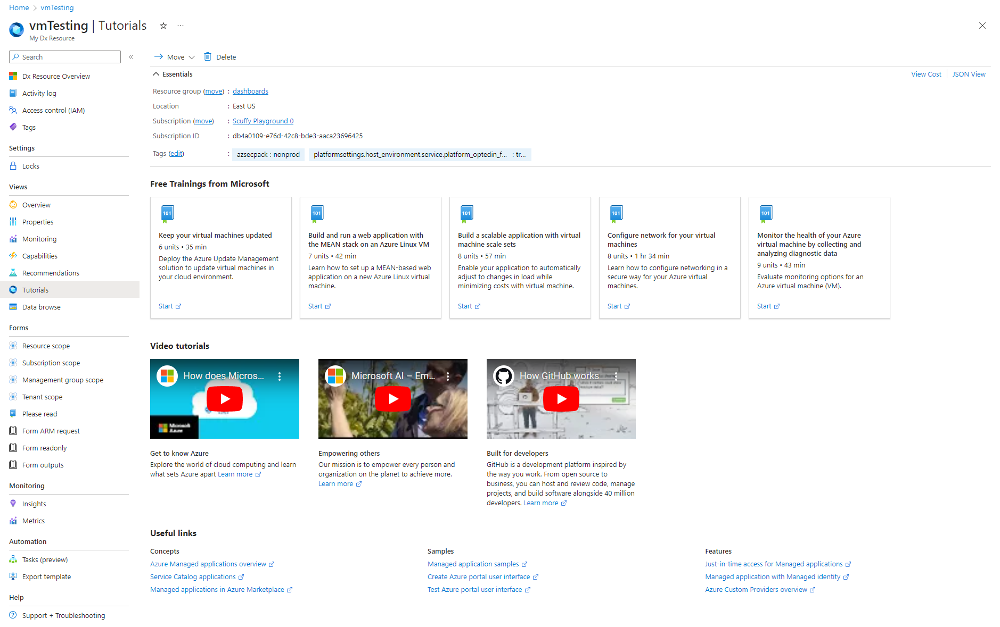

<a name="tutorialsviewtype"></a>
# TutorialsViewType
* [TutorialsViewType](#tutorialsviewtype)
    * [Description](#tutorialsviewtype-description)
    * [Guidance](#tutorialsviewtype-guidance)
        * [As a full screen blade opened from a resource menu](#tutorialsviewtype-guidance-as-a-full-screen-blade-opened-from-a-resource-menu)
        * [As a tab in a resource overview (GetStarted view)](#tutorialsviewtype-guidance-as-a-tab-in-a-resource-overview-getstarted-view)
    * [Sections](#tutorialsviewtype-sections)
    * [Properties Section](#tutorialsviewtype-properties-section)
    * [UI Sample](#tutorialsviewtype-ui-sample)

<a name="tutorialsviewtype-description"></a>
## Description
The Tutorials view is used to display the most useful resource-specific Microsoft training, videos, and useful links to “How to…” documents.
<a name="tutorialsviewtype-guidance"></a>
## Guidance
Tutorials view can be configured to display in two ways -

1. As a full screen blade opened from a resource menu
2. As a tab in a resource overview (GetStarted view)

<a name="tutorialsviewtype-guidance-as-a-full-screen-blade-opened-from-a-resource-menu"></a>
### As a full screen blade opened from a resource menu

To add the Tutorials view to be opened from a resource menu blade, add Properties definition (see `Properties definition samples` section) to the `tilesGroup.items`, `videosGroup.items` and `linksGroup.items` as seen in the Tutorials view schema below.

```json
{
  "$schema": "../../../Definitions/dx.schema.json",
  "stringSource": "Resources/MyStrings.resjson",
  "view": {
    "kind": "Tutorials",
    "export": true,
    "parameters": [],
    "resources": [
      {
        "id": "[parameters('id')]",
        "apiVersion": "2020-06-01"
      }
    ],
    "essentials": {},
    "commands": [],
    "properties": {
      "title": "Tutorials Example",
      "tilesGroup": {
        "displayName": {
          "property": "freeTrainingsFromMicrosoft"
        },
        "items": [
          {
            "title": {
              "property": "tile1Title"
            },
            "icon": "MsPortalFx.Base.Images.Polychromatic.Learn",
            "subtitle": {
              "property": "tile1Subtitle"
            },
            "description": {
              "property": "tile1Description"
            },
            "action": {
              "url": "https://www.azure.com",
              "displayName": {
                "property": "start"
              }
            }
          }
        ]
      },
      "videosGroup": {
        "displayName": {
          "property": "tab2videosTitle"
        },
        "items": [
          {
            "title": {
              "property": "tab2feature1Title"
            },
            "description": {
              "property": "tab2feature1Description"
            },
            "learnMore": {
              "url": "https://www.azure.com",
              "ariaLabel": "Learn more about Azure"
            },
            "video": {
              "src": "https://www.youtube.com/watch?v=KXkBZCe699A"
            }
          }
        ]
      },
      "linksGroup": {
        "displayName": "Useful links",
        "items": [
          {
            "title": "Concepts",
            "action": [
              {
                "url": "https://azure.microsoft.com/en-us/",
                "displayName": "Azure Managed applications overview"
              },
              {
                "url": "https://azure.microsoft.com/en-us/",
                "displayName": "Service Catalog applications"
              },
              {
                "url": "https://azure.microsoft.com/en-us/",
                "displayName": "Managed applications in Azure Marketplace"
              }
            ]
          }
        ]
      }
    }
  }
}
```

<a name="tutorialsviewtype-guidance-as-a-tab-in-a-resource-overview-getstarted-view"></a>
### As a tab in a resource overview (GetStarted view)

To add the Tutorials view as a tab in a resource overview, add the `Tutorials Tab` (see example) to the `properties.tabs` section as seen in the Resource Overview (GetStarted) schema below

```json
{
  "$schema": "../../Definitions/dx.schema.json",
  "stringSource": "Resources/MyStrings.resjson",
  "view": {
    "kind": "GetStarted",
    "export": true,
    "parameters": [
      {
        "name": "id",
        "type": "key"
      }
    ],
    "resources": [
      {
        "id": "[parameters('id')]",
        "apiVersion": "2014-04-01"
      }
    ],
    "essentials": {},
    "commands": [],
    "properties": {
        "title": "title",
        "tabs": [
        ]
    }
  }
}
```

<a name="tutorialsviewtype-guidance-as-a-tab-in-a-resource-overview-getstarted-view-tutorials-tab-example"></a>
#### <code>Tutorials Tab</code> example

Add Properties definition (see `Properties definition samples` section) to the `tilesGroup.items`, `videosGroup.items` and `linksGroup.items` as seen in the Tutorials tab schema below.

```json
{
  "kind": "Tutorials",
  "tilesGroup": {
    "displayName": {
      "property": "freeTrainingsFromMicrosoft"
    },
    "items": [
      {
        "title": {
          "property": "tile1Title"
        },
        "icon": "MsPortalFx.Base.Images.Polychromatic.Learn",
        "subtitle": {
          "property": "tile1Subtitle"
        },
        "description": {
          "property": "tile1Description"
        },
        "action": {
          "url": "https://www.azure.com",
          "displayName": {
            "property": "start"
          }
        }
      }
    ]
  },
  "videosGroup": {
    "displayName": {
      "property": "tab2videosTitle"
    },
    "items": [
      {
        "title": {
          "property": "tab2feature1Title"
        },
        "description": {
          "property": "tab2feature1Description"
        },
        "learnMore": {
          "url": "https://www.azure.com",
          "ariaLabel": "Learn more about Azure"
        },
        "video": {
          "src": "https://www.youtube.com/watch?v=KXkBZCe699A"
        }
      }
    ]
  },
  "linksGroup": {
    "displayName": "Useful links",
    "items": [
      {
        "title": "Concepts",
        "action": [
          {
            "url": "https://azure.microsoft.com/en-us/",
            "displayName": "Azure Managed applications overview"
          },
          {
            "url": "https://azure.microsoft.com/en-us/",
            "displayName": "Service Catalog applications"
          },
          {
            "url": "https://azure.microsoft.com/en-us/",
            "displayName": "Managed applications in Azure Marketplace"
          }
        ]
      }
    ]
  }
}
```
 
<a name="tutorialsviewtype-sections"></a>
## Sections
| Name | Required | Description
| ---|:--:|:--:|
|kind|True|Enum permitting the value: "Tutorials".
|export|False|Designation for blade sharing across extensions. If set to `true` then it is available to be used by other extensions.
|parameters|False|Defines the parameters to be passed into a declarative blade, that then can be accessed using the parameters function. See [View parameters](dx-viewTypeParameters.md) for more.
|resources|False|The resources section takes an ARM resource id and apiVersion, which in turn makes a ARM GET request to retrieve the resource details. You can use the resources() function to retrieve the resource payload at runtime.
|dataSources|False|Supports Graph API. Use it to pre-load graph API before the view is rendered. See [here](dx-viewTypeDataSources.md) for **dataSources** property.
|messages|False|Display a banner at the top of the view. See [here](dx-viewTypeMessages.md) for details.
|essentials|False|Defines Essentials section for the view
|commands|False|The commands section defines the Commands in the command bar.See [here](dx-viewTypeCommands.md) for **commands** property.
|properties|True|See [here](dx-view-tutorialsViewType-properties.md) for more on properties.
|fx.feature|False|
<a name="tutorialsviewtype-properties-section"></a>
## Properties Section
<a name="tutorialsviewtype-properties-section-an-object-with-the-following-properties"></a>
##### An object with the following properties
| Name | Required | Description
| ---|:--:|:--:|
|title|True|Display title text for the Tutorials view
|tilesGroup|False|<br>1) <code>tilesGroup.displayName</code> defines the section header for the tiles section(see UI sample for an example). <br>2) <code>tilesGroup.items</code>: See [here](dx-getstarted-tutorials-gettingStartedMSTileReference.md) for <code>tilesGroup.items</code> .
|videosGroup|False|<br>1) <code>videosGroup.displayName</code> defines the section header for the videos group section(see UI sample for an example). <br>2) <code>videosGroup.items</code>: See [here](dx-getstarted-tutorials-gettingStartedVideoCardReference.md) for <code>videosGroup.items</code> .
|linksGroup|False|<br>1) <code>linksGroup.displayName</code> defines the section header for the links group section(see UI sample for an example). <br>2) <code>linksGroup.items</code>: See [here](dx-getstarted-tutorials-gettingStartedLinksReference.md) for <code>linksGroup.items</code> .
|fx.feature|False|
<a name="tutorialsviewtype-ui-sample"></a>
## UI Sample
  
