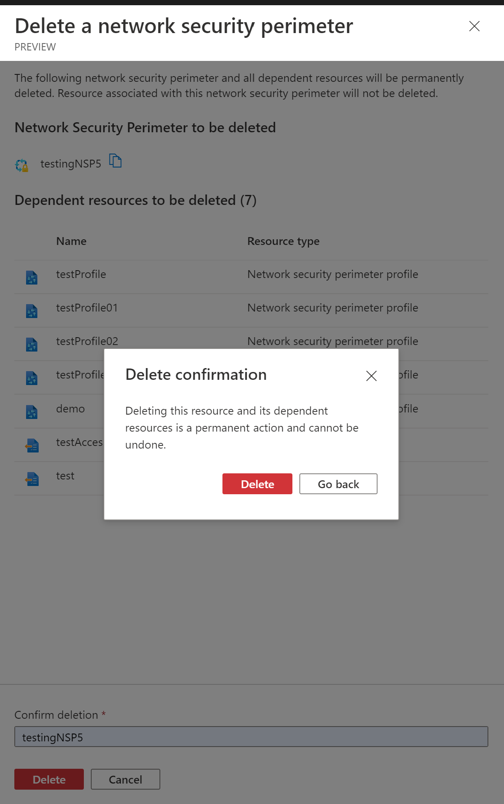

<a name="viewtypecommands-viewdeletecommand"></a>
# viewTypeCommands-viewDeleteCommand
* [viewTypeCommands-viewDeleteCommand](#viewtypecommands-viewdeletecommand)
    * [Definitions:](#viewtypecommands-viewdeletecommand-definitions)
    * [UI Sample](#viewtypecommands-viewdeletecommand-ui-sample)
    * [Sample Snippet](#viewtypecommands-viewdeletecommand-sample-snippet)

<a name="viewtypecommands-viewdeletecommand-definitions"></a>
## Definitions:
<a name="viewtypecommands-viewdeletecommand-definitions-an-object-with-the-following-properties"></a>
##### An object with the following properties
| Name | Required | Description
| ---|:--:|:--:|
|kind|False|Enum permitting the value: "DeleteCommand"
|id|True|Id of the command
|displayName|True|Display name of the command
|ariaLabel|False|label of the command used for screen reader users.
|tooltip|False|tooltip of the command
|icon|False|Icon to display with the command
|confirmation|False|Confirmation message box that appears when clicking command
|definition|True|See [here](dx-viewDeleteCommand-properties-definition.md) for more on definition.
|fx.feature|False|
<a name="viewtypecommands-viewdeletecommand-ui-sample"></a>
## UI Sample


<a name="viewtypecommands-viewdeletecommand-sample-snippet"></a>
## Sample Snippet
  
<a name="viewtypecommands-viewdeletecommand-sample-snippet-deletecommand"></a>
#### DeleteCommand

Use: View Commands

```json
{
    "kind": "DeleteCommand",
    "id": "deleteCommand",
    "displayName": {
        "property": "delete"
    },
    "icon": "MsPortalFx.Base.Images.Delete",
    "confirmation": {
        "title": {
        "property": "deleteResourceTitle"
        },
        "message": {
        "property": "deleteResourceMessage"
        },
        "dependentResources": [
            {
                "apiVersion": "2021-02-01-preview",
                "resourceType": "Microsoft.Network/networkSecurityPerimeters/profiles/accessRules",
                "icon": {
                    "file": "../../Content/SVG/PerimeterAccessRules.svg"
                }
            }
        ]
    },
    "definition": {
        "apiVersion": "2014-04-01"
    }
},
```

