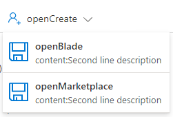

<a name="viewtypecommands-viewmenucommand"></a>
# viewTypeCommands-viewMenuCommand
* [viewTypeCommands-viewMenuCommand](#viewtypecommands-viewmenucommand)
    * [Definitions:](#viewtypecommands-viewmenucommand-definitions)
    * [UI Sample](#viewtypecommands-viewmenucommand-ui-sample)
    * [Sample Snippet](#viewtypecommands-viewmenucommand-sample-snippet)

<a name="viewtypecommands-viewmenucommand-definitions"></a>
## Definitions:
<a name="viewtypecommands-viewmenucommand-definitions-an-object-with-the-following-properties"></a>
##### An object with the following properties
| Name | Required | Description
| ---|:--:|:--:|
|kind|False|Enum permitting the value: "MenuCommand"
|id|False|Id of the command
|displayName|False|Display name of the command
|ariaLabel|False|label of the command used for screen reader users.
|tooltip|False|tooltip of the command
|icon|False|Icon to display with the command
|commands|True|List of commands displayed under menu. See below for details.
|fx.feature|False|
<a name="viewtypecommands-viewmenucommand-ui-sample"></a>
## UI Sample
  
<a name="viewtypecommands-viewmenucommand-sample-snippet"></a>
## Sample Snippet
  
<a name="viewtypecommands-viewmenucommand-sample-snippet-menucommand"></a>
#### MenuCommand

Use: Browse Commands, View Commands

Browse acceptable child commands:
* OpenBladeCommand

View acceptable child commands:

* [viewOpenBladeCommand](dx-viewTypeCommands-viewOpenBladeCommand.md)or [viewOpenBladeCommandWithContent](dx-viewTypeCommands-viewOpenBladeCommandWithContent.md)
* [viewOpenMarketplaceCommand](dx-viewTypeCommands-viewOpenMarketplaceCommand.md) or [viewOpenMarketplaceCommandWithContent](dx-viewTypeCommands-viewOpenMarketplaceCommandWithContent.md)
* [viewArmCommand](dx-viewTypeCommands-viewArmCommand.md)
* [viewDeleteCommand](dx-viewTypeCommands-viewDeleteCommand.md)
* [viewMoveCommand](dx-viewTypeCommands-viewMoveCommand.md)
* [viewRefreshCommand](dx-viewTypeCommands-viewRefreshCommand.md)

```json
{
    "kind": "MenuCommand",
    "id": "OpenCreateCommandId",
    "displayName": "openCreate",
    "icon": "MsPortalFx.Base.Images.AddTeamMember",
    "commands": [
        {
            "kind": "OpenBladeCommand",
            "id": "OpenBladeCommandId1",
            "displayName": "openBlade",
            "ariaLabel": "openBlade",
            "content": "content:Second line description",
            "icon": "MsPortalFx.Base.Images.Save",
            "blade": {
                "name": "MarkdownView_Dx",
                "parameters": {
                    "foo": "foo"
                },
                "inContextPane": true
            }
        },
        {
            "kind": "OpenMarketplaceCommand",
            "id": "OpenMarketplaceCommandId1",
            "displayName": "openMarketplace",
            "icon": "MsPortalFx.Base.Images.Save",
            "content": "content:Second line description",
            "marketplaceItemId": "Microsoft.WindowsServer2016Datacenter-ARM",
            "disabled": false
        }
    ]
},
```

