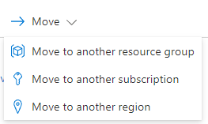

<a name="viewtypecommands-viewmovecommand"></a>
# viewTypeCommands-viewMoveCommand
* [viewTypeCommands-viewMoveCommand](#viewtypecommands-viewmovecommand)
    * [Definitions:](#viewtypecommands-viewmovecommand-definitions)
    * [UI Sample](#viewtypecommands-viewmovecommand-ui-sample)
    * [Sample Snippet](#viewtypecommands-viewmovecommand-sample-snippet)

<a name="viewtypecommands-viewmovecommand-definitions"></a>
## Definitions:
<a name="viewtypecommands-viewmovecommand-definitions-an-object-with-the-following-properties"></a>
##### An object with the following properties
| Name | Required | Description
| ---|:--:|:--:|
|kind|False|Enum permitting the value: "MoveCommand"
|id|True|Id of the command
|displayName|True|Display name of the command
|ariaLabel|False|label of the command used for screen reader users.
|tooltip|False|tooltip of the command
|icon|False|Icon to display with the command
|fx.feature|False|
<a name="viewtypecommands-viewmovecommand-ui-sample"></a>
## UI Sample
  
<a name="viewtypecommands-viewmovecommand-sample-snippet"></a>
## Sample Snippet
  
<a name="viewtypecommands-viewmovecommand-sample-snippet-movecommand"></a>
#### MoveCommand

Use: View Commands

```json
{
"kind": "MoveCommand",
"id": "moveCommand",
"displayName": {
    "property": "move"
},
"icon": "MsPortalFx.Base.Images.Move"
}
```

