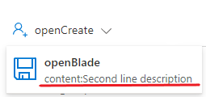

<a name="viewtypecommands-viewopenbladecommandwithcontent"></a>
# viewTypeCommands-viewOpenBladeCommandWithContent
* [viewTypeCommands-viewOpenBladeCommandWithContent](#viewtypecommands-viewopenbladecommandwithcontent)
    * [Definitions:](#viewtypecommands-viewopenbladecommandwithcontent-definitions)
    * [UI Sample](#viewtypecommands-viewopenbladecommandwithcontent-ui-sample)
    * [Sample Snippet](#viewtypecommands-viewopenbladecommandwithcontent-sample-snippet)

<a name="viewtypecommands-viewopenbladecommandwithcontent-definitions"></a>
## Definitions:
<a name="viewtypecommands-viewopenbladecommandwithcontent-definitions-an-object-with-the-following-properties"></a>
##### An object with the following properties
| Name | Required | Description
| ---|:--:|:--:|
|kind|False|Enum permitting the value: "OpenBladeCommand"
|id|False|Id of the command
|displayName|False|Display name of the command
|ariaLabel|False|label of the command used for screen reader users.
|tooltip|False|tooltip of the command
|content|False|Second line description of the command
|icon|False|Icon to display with the command
|blade|True|See [here](dx-bladeReferenceWithContextPane.md) for more on bladeReferenceWithContextPane.
|disabled|False|Disables the command when it evaluates to true. When disabled, the command is not clickable and is greyed out.
|fx.feature|False|
<a name="viewtypecommands-viewopenbladecommandwithcontent-ui-sample"></a>
## UI Sample
  
<a name="viewtypecommands-viewopenbladecommandwithcontent-sample-snippet"></a>
## Sample Snippet
  #### OpenBladeCommandWithContent

Use: Browse Commands, View Commands
Has to be used under MenuCommand

Views: {resourceid} can be used to reference the resource id of the contextual resource.

```json
{
    "kind": "MenuCommand",
    "id": "OpenCreateCommandId",
    "displayName": "openCreate",
    "icon": "MsPortalFx.Base.Images.AddTeamMember",
    "commands": [
        {
            "kind": "OpenBladeCommand",
            "id": "OpenBladeCommandId1",
            "displayName": "openBlade",
            "ariaLabel": "openBlade",
            "content": "content:Second line description",
            "icon": "MsPortalFx.Base.Images.Save",
            "blade": {
                "name": "MarkdownView_Dx",
                "parameters": {
                    "foo": "foo"
                },
                "inContextPane": true
            }
        }
    ]
}
```

