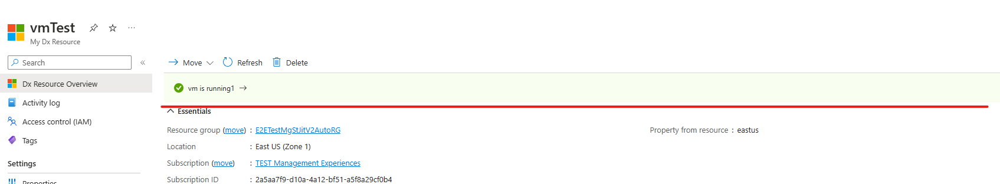
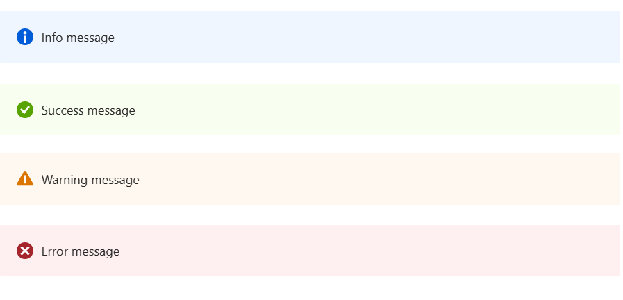

<a name="viewtypemessages"></a>
# viewTypeMessages
* [viewTypeMessages](#viewtypemessages)
    * [Guidance](#viewtypemessages-guidance)
    * [Definitions:](#viewtypemessages-definitions)
        * [An array of items, where each item is of the type:](#viewtypemessages-definitions-an-array-of-items-where-each-item-is-of-the-type)

<a name="viewtypemessages-guidance"></a>
## Guidance
The `messages` section defines the message in views. Only one message is displayed, the first message item which visible is 'true'.

Messages allows you to display a message in response to resource's state. There are four types of messages: Info, Success, Warning, Error. Only displaying first message which visible is 'true'. It also support uri, blade, resourceId for onClick action.

Since visible is optional, if not specified, it will be treated as true.

Given this example below, if VM is running, the second message item will be displayed, even though third message is also true. We only want to display the first true message item.
If VM is deallocated, first message item will be displayed.
If VM is neither deallocated or running, last message item will be displayed.

```json
"messages": [
      {
        "kind": "error",
        "message": "vm is deallocated",
        "visible": "[equals(resources('vmInstanceView').properties.instanceView.statuses.1.code, 'PowerState/deallocated')]",
        "action": {
          "resourceId": "/subscriptions/415b6834-1801-4f6e-a285-f646ec13fe34/resourceGroups/AzureMobileTest/providers/Microsoft.Network/virtualNetworks/AzureMobileTest-vnet"
        }
      },
      {
        "kind": "success",
        "message": "vm is running1",
        "visible": "[equals(resources('vmInstanceView').properties.instanceView.statuses.1.code, 'PowerState/running')]",
        "action": {
          "blade":
                 {
                   "name": "AzureMonitoringBrowseBlade",
                   "extension": "Microsoft_Azure_Monitoring",
                   "parameters": {
                     "resId": "[resources().id]"
                   },
                   "inContextPane": true
                 }
        }
      },
      {
        "kind": "success",
        "message": "vm is running2",
        "visible": "[equals(resources('vmInstanceView').properties.instanceView.statuses.1.code, 'PowerState/running')]",
        "action": {
          "blade":
                 {
                   "name": "AzureMonitoringBrowseBlade",
                   "extension": "Microsoft_Azure_Monitoring",
                   "parameters": {
                     "resId": "[resources().id]"
                   }
                 }
        }
      },
      {
        "kind": "info",
        "message": "Welcome to our extension! please take a look at our tutorial",
        "action": {
          "url": "https://ms.portal.azure.com/"
        }
      }
    ],
```


 
<a name="viewtypemessages-definitions"></a>
## Definitions:
<a name="viewtypemessages-definitions-an-array-of-items-where-each-item-is-of-the-type"></a>
### An array of items, where each item is of the type:
<a name="viewtypemessages-definitions-an-array-of-items-where-each-item-is-of-the-type-an-object-with-the-following-properties"></a>
##### An object with the following properties
| Name | Required | Description
| ---|:--:|:--:|
|kind|False|Kind of a message
|message|False|Text to display as a message
|action|False|Specifies the action to be taken on clicking the message.
|visible|False|When first message which visible is evaluated to *true* then the message will be displayed. Default value is **true**.
|fx.feature|False|
