* [Getting Started](#getting-started)
    * [How the portal works](#getting-started-how-the-portal-works)
    * [How extensions work](#getting-started-how-extensions-work)
    * [Getting started with the Portal SDK](#getting-started-getting-started-with-the-portal-sdk)
    * [Samples extension](#getting-started-samples-extension)
* [Common scenarios](#common-scenarios)
    * [Building browse experiences](#common-scenarios-building-browse-experiences)
    * [Building create experiences](#common-scenarios-building-create-experiences)
* [Basic Concepts](#basic-concepts)
    * [UI Concepts](#basic-concepts-ui-concepts)
    * [Blades](#basic-concepts-blades)
* [Blade opening and closing](#blade-opening-and-closing)
    * [Strongly typed blade reference classes](#blade-opening-and-closing-strongly-typed-blade-reference-classes)
    * [Opening blades (Recommended pattern)](#blade-opening-and-closing-opening-blades-recommended-pattern)
    * [Click callbacks](#blade-opening-and-closing-click-callbacks)
    * [Importing the PDE file](#blade-opening-and-closing-importing-the-pde-file)
* [Closing blades programatically](#closing-blades-programatically)
    * [Writing code that reacts to a blade being closed](#closing-blades-programatically-writing-code-that-reacts-to-a-blade-being-closed)
* [Developing Forms](#developing-forms)
    * [Loading, editing and saving data](#developing-forms-loading-editing-and-saving-data)
    * [Laying out your UI on the blade](#developing-forms-laying-out-your-ui-on-the-blade)
    * [Field Validation](#developing-forms-field-validation)
    * [Working with Edit Scopes](#developing-forms-working-with-edit-scopes)
    * [Integrating Forms with Commands](#developing-forms-integrating-forms-with-commands)
    * [FAQ](#developing-forms-faq)
    * [EditScope FAQ](#developing-forms-editscope-faq)
* [Controls](#controls)
    * [Date and Time](#controls-date-and-time)
    * [Drop downs](#controls-drop-downs)
    * [Editors](#controls-editors)
    * [Console](#controls-console)
    * [Forms](#controls-forms)
    * [Lists](#controls-lists)
    * [Grid](#controls-grid)
    * [Helpers and Indicators](#controls-helpers-and-indicators)
    * [Visualizing Data](#controls-visualizing-data)
    * [Donut chart](#controls-donut-chart)
    * [Build your own controls](#controls-build-your-own-controls)
* [Authentication](#authentication)
    * [Calling ARM](#authentication-calling-arm)
    * [Calling alternate resources](#authentication-calling-alternate-resources)
* [Working with data](#working-with-data)
    * [Master details browse scenario](#working-with-data-master-details-browse-scenario)
    * [Querying for data](#working-with-data-querying-for-data)
    * [Loading Data](#working-with-data-loading-data)
    * [Using DataViews](#working-with-data-using-dataviews)
    * [Observable map & filter](#working-with-data-observable-map-filter)
    * [Shaping and filtering data](#working-with-data-shaping-and-filtering-data)
    * [Auto-refreshing client-side data (a.k.a. 'polling')](#working-with-data-auto-refreshing-client-side-data-a-k-a-polling)
    * [Data merging](#working-with-data-data-merging)
    * [Explicitly/proactively reflecting server data changes on the client](#working-with-data-explicitly-proactively-reflecting-server-data-changes-on-the-client)
    * [Querying for virtualized data](#working-with-data-querying-for-virtualized-data)
    * [Type metadata](#working-with-data-type-metadata)
    * [Data atomization](#working-with-data-data-atomization)
* [Introduction to Parameter Collection](#introduction-to-parameter-collection)
    * [Roles](#introduction-to-parameter-collection-roles)
    * [Implementation](#introduction-to-parameter-collection-implementation)
    * [More details](#introduction-to-parameter-collection-more-details)
    * [ARM APIs](#introduction-to-parameter-collection-arm-apis)
* [Resource management](#resource-management)
    * [Assets](#resource-management-assets)
    * [ARM APIs](#resource-management-arm-apis)
    * [Essentials panel](#resource-management-essentials-panel)
    * [Defining permissions and checking access](#resource-management-defining-permissions-and-checking-access)
    * [Notifications](#resource-management-notifications)
    * [Subscriptions](#resource-management-subscriptions)
    * [Resource Tags](#resource-management-resource-tags)
    * [Resource moves](#resource-management-resource-moves)
* [Debugging](#debugging)
    * [Debugging extension load failures](#debugging-debugging-extension-load-failures)
    * [Testing in production](#debugging-testing-in-production)
    * [Marking automated tests as test/synthetic traffic](#debugging-marking-automated-tests-as-test-synthetic-traffic)
* [Other](#other)
    * [PDL Binding Quick Reference](#other-pdl-binding-quick-reference)
    * [Blade initialization](#other-blade-initialization)
    * [How to expose config settings for consumption in the client](#other-how-to-expose-config-settings-for-consumption-in-the-client)
* [Step by step walkthrough](#step-by-step-walkthrough)


 <h1 name="portalfx-extension-development"></h1>
  <h1 name="portalfx-howitworks"></h1>
 <properties title="" pageTitle="How the Azure Portal works" description="" authors="nickharris" />

<a name="getting-started"></a>
# Getting Started

<a name="getting-started-how-the-portal-works"></a>
## How the portal works

The [Azure portal](http://portal.azure.com) provides a consistent user interface that enables integration with various first and third party Microsoft Azure services. The portal is a [single page application](http://en.wikipedia.org/wiki/Single-page_application) which can dynamically load a collection of extensions.  Extensions are loaded via an IFRAME that provides a layer of isolation.  The IFRAMEs loaded by the portal do not project any visuals - they are entirely hidden.  Instead, the scripts loaded by these IFRAME interact with the API provided by the Azure Portal SDK.  This allows the portal to provide a consistent, safe, and predictable experience for users.

![Portal extension architecture][architecture]

<a name="getting-started-how-extensions-work"></a>
## How extensions work

Extensions are simply web applications written using the [Azure Portal SDK](../generated/downloads.md).  The web application will provide content loaded by the portal in an isolated context.

- Typically an extension is an [ASP.NET Web API](http://www.asp.net/web-api) project, which is modified to include content specific to the portal.
- The client APIs use [TypeScript](http://www.typescriptlang.org/) to provide a productive experience for building JavaScript.
- TypeScript is built using the [Asynchronous Module Loader (AMD)](http://requirejs.org/docs/whyamd.html) module system via [require.js](http://requirejs.org/).
- The core programming model follows the [Model View ViewModel](http://en.wikipedia.org/wiki/Model_View_ViewModel) pattern. Most [UI elements](#portalfx-ui-concepts) in the portal are backed by dynamic view models, which provide a 'live tile' style of UX.
- View models make heavy use of [Knockout](http://knockoutjs.com/) for binding data to the client.
- Building custom UI is enabled using standard web technologies like [HTML](https://developer.mozilla.org/en-US/docs/Web/HTML) and [CSS](https://developer.mozilla.org/en-US/docs/Web/CSS).
- Extensions are deployed to an endpoint owned by the service administrator.  Extension authors are responsible for hosting their own extensions.

**NOTE:** Learn more about [deployment](#portalfx-deployment).

When a user visits the Azure portal, extensions will be loaded based on the users subscription. Extensions can be loaded asynchronously, and even deactivated when it's not currently in use.

<a name="getting-started-how-extensions-work-what-s-different"></a>
### What&#39;s different?

The new Azure portal at [http://portal.azure.com](http://portal.azure.com) is significantly different from a developer perspective from the portal at [http://manage.windowsazure.com](http://manage.windowsazure.com). Based on feedback from developers who extended the management portal, we set out to solve a few challenges.

**NOTE:** The management portal at [http://manage.windowsazure.com](http://manage.windowsazure.com) can still be used for customers who require services not yet available on [http://portal.azure.com](http://portal.azure.com).

- Instead of a single frame, extensions run in their own IFRAME. This provides a certain level of process isolation, allowing for greater reliability, and data protection.
- Instead of a single code repository, extensions are now developed in a separate repository from the shell.
- Extension authors do not need to enlist the Azure portal source code repository to add new experiences.
- Extension authors are free to deploy their service as frequently or infrequently as desired.
- The new portal only loads the experiences required for the current user. Extensions can be removed from the portal at runtime if they are not being used, and dynamically re-loaded.

[architecture]: ../media/portalfx-deployment/deployment.png

 <h1 name="portalfx-creating-extensions"></h1>
 <properties title="" pageTitle="Creating an Extension" description="" authors="nickharris" />

<a name="getting-started-getting-started-with-the-portal-sdk"></a>
## Getting started with the Portal SDK

<a name="getting-started-getting-started-with-the-portal-sdk-prerequisites"></a>
### Prerequisites

- Microsoft Windows 8, Windows Server 2012 R2, or latest
- Visual Studio 2013 Update 4
- Latest version of the <a href="http://www.typescriptlang.org/#Download" target="_blank">TypeScript plugin for Visual Studio</a>
- Latest version of the <a href="../generated/downloads.md" target="_blank">Azure Portal SDK</a>

<a name="getting-started-getting-started-with-the-portal-sdk-creating-an-extension"></a>
### Creating an Extension
The Azure Portal SDK includes everything you need to build extensions for the portal.  Included are variety of tools and samples that help developers build extensions on top of the framework.

To start, launch Visual Studio and navigate to File -> New -> Project.  In the new project template, select Installed -> Visual C# -> Azure Portal.  Select the `Azure Portal Extension` project type, give it a unique name, and click 'OK':


- Next, hit F5 to compile, and run your extension in IIS Express.   
- On first run you should see a request to install a certificate for localhost for IIS express Accept the certificate to continue

  

You may get a debugging not enabled warning.  Feel free to enable or disable debugging, depending on your preferences.


Your extension will now be side loaded into the production portal.  The portal will prompt you to allow your side loaded extension.  Click __allow__.


Congratulations!  You've just created your first extension.

You will find that the project template has implemented many of the key components of an extension.  

- Marketplace Gallery Integration (How people create your resources)
- Browse (How people browse resources they have created)
- Resource Menu (How people use and manage resources they have created)

<a name="getting-started-getting-started-with-the-portal-sdk-marketplace-gallery-integration-and-create-experience"></a>
### Marketplace Gallery Integration and Create Experience

In your running portal, go to the marketplace by clicking __+New__ and then __See all__.


Then click the __Local Development__ category. A marketplace item will appear that matches the name you selected when creating your project.  The code to define the gallery package is located in the __GalleryPackages__ directory.


Click the gallery item to launch the item details blade. 


The gallery package includes all the categorization, text, and images that you've seen so far.  The code for all of this is located in the __GalleryPackages__ folder.

When you click the __Create__ button the portal will open the blade that is defined in __GalleryPackages/Create/UIDefinition.json__. 


The project template has implemented a basic create form that asks the user to specify the common Azure Resource properties.


The code that implements the create blade is located in __Client/Resource/Create__.  Note that the name "CreateBlade" in the __Create.pdl__ file matches the name in the __UIDefinition.json__ file.


Fill out the create form and click create to actually create a resource.

For more information on creating gallery packages and create forms see the [gallery documentation](/gallery-sdk/generated/index-gallery.md#Marketplace-Gallery-Integration-and-Create-Experience).

<a name="getting-started-getting-started-with-the-portal-sdk-browse"></a>
### Browse

In the running portal you can navigate to __Browse -> My Resources__ to see your extension's browse experience.  
  


If you have completed the marketplace and create tutorial above then you should see an item in the list.


The code for the browse implementation is located in __Client/Browse__.  You can replace the __Microsoft.PortalSdk/rootResources__ resource type name with your production Resource Provider (RP) type and your resources will show in the list on your next F5.


For more information on the browse experience see the [Browse documentation](#browse).

<a name="getting-started-getting-started-with-the-portal-sdk-resource-menu"></a>
### Resource Menu

Click on your resource from within the browse list to open the resource menu.  Many of the standard Azure experiences such as __tags__, __locks__, and __acess control__ have been automatically injected into your menu.


The code for the resource menu is located in __Browse/ViewModels/AssetTypeViewModel__. You can extend the menu by modifying the __getMenuConfig__ function.


For more information on the resource menu see the [Resource menu documentation](/gallery-sdk/generated/index-gallery.md#resource-management-resource-menu).

<a name="getting-started-getting-started-with-the-portal-sdk-next-steps"></a>
### Next Steps

Read more about [testing in production](#portalfx-testinprod).

Next Steps: To debug issues loading an extension in the portal, go through the [Debugging extension failures](#portalfx-debugging-extension-load-failures) guide.

<a name="getting-started-getting-started-with-the-portal-sdk-questions"></a>
### Questions?

Ask questions on: [https://stackoverflow.microsoft.com/questions/tagged?tagnames=ibiza](https://stackoverflow.microsoft.com/questions/tagged?tagnames=ibiza).
 <h1 name="portalfx-sample-extensions"></h1>
 <properties title="" pageTitle="PortalFx Getting Started" description="" authors="justbe" />

<a name="getting-started-samples-extension"></a>
## Samples extension

The samples extension provides an individual sample for each feature available in the framework.  The samples are organized into distinct areas:

![Samples extension][samples]

After installing the SDK, the local instance of the portal will open with the samples extension pre-registered.  You can open the solution file for the extension to view how specific parts of the API behave:

```
[My Documents]\PortalSDK\FrameworkPortal\Extensions\SamplesExtension\SamplesExtension.sln
```

If you are using IntelliMirror, you you find the samples and the portal in this location:

```
%LOCALAPPDATA%\PortalSDK\FrameworkPortal\Extensions\SamplesExtension\SamplesExtension.sln
```

If you make edits to the samples, you can refresh the portal to see your changes. Each sample demonstrates a single usage of the API.  It's great for detailed information on any one API.

This extension also includes a collection of integration tests which use our test framework to validate SDK scenarios.  You can use these tests as an example to build your own selenium tests for your extension.

> If you need help beyond the documentation and samples, reach out to Ibiza team on: [https://stackoverflow.microsoft.com/questions/tagged?tagnames=ibiza](https://stackoverflow.microsoft.com/questions/tagged?tagnames=ibiza).

[samples]: ../media/samples.png


<a name="common-scenarios"></a>
# Common scenarios
 <h1 name="portalfx-browse"></h1>
 <properties title="" pageTitle="Browse" description="" authors="flanakin" />

<a name="common-scenarios-building-browse-experiences"></a>
## Building browse experiences

The Favorites in the left nav and the Browse menu are the primary ways to launch tools and services within the portal. The default favorites are determined by C+E leadership based on the highest grossing services with the most engaged customers. New services will start in the Browse menu and, based on those metrics or the number of favorites surpasses other defaults, the list can be updated.

There are 3 ways you can be surfaced in Browse:

1. ["No-code" Browse](#resources) for ARM resources
2. [Browse service](#assets) for assets that don't use ARM (aka Browse v1)
3. [Custom blade](#blade) if you have a single instance and not a list of resources


<a name="resources"></a>
<a name="common-scenarios-building-browse-experiences-no-code-browse"></a>
### No-code Browse

"No-code" Browse automatically queries ARM for resources of a specific type and displays them in a paged grid. Simply define an asset type in PDL, specify the resource type, indicate that it should be visible in the Browse hub, and specify the API version that hubs extension should use to call ARM for the resource type. That's it.

```xml
<AssetType Name="Book" ... >
  <Browse Type="ResourceType" />
  <ResourceType ResourceTypeName="Microsoft.Press/books" ApiVersion="2016-01-01" />
</AssetType>
```


No-code Browse requires the following:

* Asset blade must accept a single `Id` input property
* Asset id must be the resource id (not an object)

<a name="create"></a>
<a name="common-scenarios-building-browse-experiences-no-code-browse-add-command"></a>
#### Add command
To allow people to create new resources from Browse, you can associate your asset type with a Marketplace item or category:

```xml
<AssetType
    Name="Book"
    MarketplaceItemId="Microsoft.Book"
    MarketplaceMenuItemId="menu/submenu"
    ...>
  <Browse Type="ResourceType" />
  <ResourceType ResourceTypeName="Microsoft.Press/books" ApiVersion="2016-01-01" />
</AssetType>
```

The Browse blade will launch the Marketplace item, if specified; otherwise, it will launch the Marketplace category blade for the specific menu item id (e.g. `gallery/virtualMachines/recommended` for Virtual machines > Recommended). To determine the right Marketplace category, contact the <a href="mailto:1store?subject=Marketplace menu item id">Marketplace team</a>. If neither is specified, the Add command won't be available.

<a name="columns"></a>
<a name="common-scenarios-building-browse-experiences-no-code-browse-customizing-columns"></a>
#### Customizing columns
By default, no-code Browse only shows the resource name, group, location, and subscription. To customize the columns, add a view-model to the `AssetType` and indicate that you have custom Browse config:

```xml
<AssetType Name="Book" ViewModel="BookViewModel" ... >
  <Browse Type="ResourceType" UseCustomConfig="true" />
  <ResourceType ResourceTypeName="Microsoft.Press/books" ApiVersion="2016-01-01" />
</AssetType>
```

Now, create the asset view-model class that implements the `getBrowseConfig()` function:

```ts
class BookViewModel implements ExtensionDefinition.ViewModels.ResourceTypes.BookViewModel.Contract {

    public getBrowseConfig(): PromiseV<MsPortalFx.Assets.BrowseConfig> {
        ...
    }
}
```

The `getBrowseConfig()` function provides the following configuration options for your Browse blade:

* **`columns`** - List of custom columns the user will be able to choose to display (coming soon)
* **`defaultColumns`** - List of column ids that will be used by default
* **`properties`** - Additional properties used by formatted columns (e.g. HTML formatting)

Start by specifying all possible custom columns you want to make available to customers using `BrowseConfig.columns`. Browse will share the list of standard ARM columns and any custom columns you define with users and let them choose which columns they want to see.

To specify which columns to show by default, save the column ids to `BrowseConfig.defaultColumns`. If any columns require additional data, like HTML-formatted columns that include 2 or more properties, save the additional property names (not the `itemKey`) to `BrowseConfig.properties`. Browse needs to initialize the grid with all the properties you'll use for supplemental data to ensure the grid will be updated properly.

```ts
class BookViewModel implements ExtensionDefinition.ViewModels.ResourceTypes.BookViewModel.Contract {

    public getBrowseConfig(): PromiseV<MsPortalFx.Assets.BrowseConfig> {
        return Q.resolve({
            // columns the user will be able to choose to display (coming soon)
            columns: [
                {
                    id: "author",
                    name: ko.observable<string>(ClientResources.author),
                    itemKey: "author"
                },
                {
                    id: "genre",
                    name: ko.observable<string>(ClientResources.genre),
                    itemKey: "genre",
                    format: MsPortalFx.ViewModels.Controls.Lists.Grid.Format.HtmlBindings,
                    formatOptions: {
                        htmlBindingsTemplate: "<div data-bind='text: genre'></div> (<div data-bind='text: subgenre'></div>)"
                    }
                }
            ],

            // default columns to show -- name always first, subscription always last
            defaultColumns: [
                ResourceColumns.resourceGroup,
                "author",
                "genre"
            ],

            // additional properties used to support the available columns
            properties: [
                "subgenre"
            ]
        });
    }
}
```

Notice that the genre column actually renders 2 properties: genre and subgenre. Because of this, we need to add "subgenre" to the array of additional properties to ensure it gets rendered properly to the grid.

At this point, you should be able to compile and see your columns show up in your Browse blade. Of course, you still need to populate your supplemental data. Let's do that now...

<a name="supplementaldata"></a>
<a name="common-scenarios-building-browse-experiences-no-code-browse-providing-supplemental-data"></a>
#### Providing supplemental data
In order to specify supplemental data to display on top of the standard resource columns, you'll need to opt in to specifying supplemental data in PDL:

```xml
<AssetType Name="Book" ViewModel="BookViewModel" ... >
  <Browse Type="ResourceType" UseSupplementalData="true" />
  <ResourceType ResourceTypeName="Microsoft.Press/books" ApiVersion="2016-01-01" />
</AssetType>
```

You'll also need to implement the `supplementalDataStream` property and `getSupplementalData()` function on your asset view-model:

```ts
class BookViewModel implements ExtensionDefinition.ViewModels.ResourceTypes.BookViewModel.Contract {

    public supplementalDataStream = ko.observableArray<MsPortalFx.Assets.SupplementalData>([]);

    public getBrowseConfig(): PromiseV<MsPortalFx.Assets.BrowseConfig> {
        ...
    }

    public getSupplementalData(resourceIds: string[], columns: string[]): Promise {
        ...
    }
}
```

After the Browse blade retrieves the first page of resources from ARM, it will call `getSupplementalData()` with the resource ids retrieved from ARM as well as the column ids currently being displayed in the grid. You'll then retrieve *only* the properties required to populate those columns for *only* the specified resource ids. **Do not query all properties for all resources!**

**NOTE:** The current subscriptions API will be deprecated once Browse v2 and Create v3 are complete. When this happens, extensions will no longer have a full list of all subscriptions and will be required to use this streaming data approach, which will significantly improve performance.

```ts
class BookViewModel implements ExtensionDefinition.ViewModels.ResourceTypes.BookViewModel.Contract {

    private _container: MsPortalFx.ViewModels.ContainerContract;
    private _dataContext: any;
    private _view: any;

    constructor(container: MsPortalFx.ViewModels.ContainerContract, initialState: any, dataContext: ResourceTypesArea.DataContext) {
        this._container = container;
        this._dataContext = dataContext;
    }

    ...

    public getSupplementalData(resourceIds: string[], columns: string[]): Promise {
        // NOTE: Do not create the view in the constructor. Initialize here to create only when needed.
        this._view = this._view || this._dataContext.bookQuery.createView(this._container);

        // connect the view to the supplemental data stream
        MsPortalFx.Assets.SupplementalDataStreamHelper.ConnectView(
            this._container,
            view,
            this.supplementalDataStream,
            (book: Book) => {
                return resourceIds.some((resourceId) => {
                    return ResourceTypesService.compareResourceId(resourceId, book.id());
                });
            },
            (book: Book) => {
                // save the resource id so Browse knows which row to update
                var data = <MsPortalFx.Assets.SupplementalData>{ resourceId: book.id() };

                // only save author if column is visible
                if (columns.indexOf("author") !== -1) {
                    data.author = robot.author();
                }

                // if the genre column is visible, also add the subgenre property
                if (columns.indexOf("genre") !== -1) {
                    data.genre = robot.genre;
                    data.subgenre = robot.subgenre;
                }

                return data;
            });

        // send resource ids to a controller and aggregate data into one client request
        return view.fetch({ resourceIds: resourceIds });
    }
}
```

**NOTE:** If you notice that some of the supplemental properties aren't being saved to the grid, double-check that the property names are either listed as the `itemKey` for a column or have been specified in `BrowseConfig.properties`. Unknown properties won't be saved to the grid.

**NOTE:** **Do not pre-initialize data.** Browse will show a loading indicator (coming soon) based on whether or not it's received data. If you initialize any supplemental data, this will inform the grid that loading has completed. Instead, leave cells empty when first displaying them.

Now, you should have supplemental data getting populated. Great! Let's add context menu commands...

<a name="commands"></a>
<a name="common-scenarios-building-browse-experiences-no-code-browse-adding-context-menu-commands"></a>
#### Adding context menu commands
Context menu commands in Browse must take a single `id` input parameter that is the resource id of the specific resource. To specify commands, add the name of the command group defined in PDL to Browse config:

```xml
<CommandGroup Name="BrowseBookCommands">
  ...
</CommandGroup>
```

```ts
class BookViewModel implements ExtensionDefinition.ViewModels.ResourceTypes.BookViewModel.Contract {

    public getBrowseConfig(): PromiseV<MsPortalFx.Assets.BrowseConfig> {
        return Q.resolve({
            // NOTE: Extension (commandGroupOwner) only required if from another extension
            contextMenu: {
                commandGroup: "BrowseBookCommands",
                commandGroupOwner: "<extension name>"
            },
            ...
        });
    }

    ...
}
```

If you need to expose different commands based on some other metadata, you can also specify the the command group in `SupplementalData.contextMenu` in the same way.

<a name="infobox"></a>
<a name="common-scenarios-building-browse-experiences-no-code-browse-adding-an-informational-message-link"></a>
#### Adding an informational message/link
If you need to display an informational message and/or link above the list of resources, add an `infoBox` to your Browse config:

```ts
class BookViewModel implements ExtensionDefinition.ViewModels.ResourceTypes.BookViewModel.Contract {

    public getBrowseConfig(): PromiseV<MsPortalFx.Assets.BrowseConfig> {
        return Q.resolve({
            infoBox: {
                image: MsPortalFx.Base.Images.Info(),
                text: resx.browseBookInfoBoxText,

                // optionally specify a blade to launch when the infobox is clicked
                blade: <MsPortalFx.ViewModels.DynamicBladeSelection>{
                    detailBlade: "BookInfoBlade",
                    detailBladeInputs: null
                },

                // ...or link to an external web page
                uri: "http://microsoftpress.com"

                // NOTE: Blade is preferred over link, if both are specified.
            },
            ...
        });
    }

    ...
}
```


<a name="assets"></a>
<a name="common-scenarios-building-browse-experiences-no-code-browse-browse-service"></a>
#### Browse service

The Browse service API provides support for custom data, whether that comes from ARM or another source.

**NOTE:** The Browse service API is no longer being maintained. All efforts have been refocused on our Browse v2 API, which starts with no-code. We'll continue to expand that thru the first half of 2015.

The UI for browse in the portal are implemented as part of the shell. This
means that extension authors are largely responsible for accepting a request
for a browse, reasoning about the browse criteria, and returning a list of
results. Extensions opt into this functionality by creating an asset type and
defining a browse service.

<a name="common-scenarios-building-browse-experiences-no-code-browse-defining-an-asset-type-permalink-asset-type-non-arm"></a>
#### Defining an Asset Type permalink-asset-type-non-arm

Asset types provide a way for the shell to understand high level objects in
your extension. Asset types are the portal's way of understanding the
capabilities of a given object. Currently, it defines services for:

  * Browse
  * Create
  * Notifications

The Asset Type is defined in PDL, and opts into various services and
capabilities it supports. The best example of browse can be found in the
samples under `\Client\Hubs\Browse\Browse.pdl`:

```xml
<AssetType Name="Robot"
           Text="Extension.Resources.Strings.robotAssetName"
           Icon="Extension.Resouces.Icons.robotIcon"
           BladeName="RobotBlade"
           PartName="RobotPart">
    <Browse ServiceViewModel="RobotBrowseService" />
    <GridColumns ServiceViewModel="RobotGridColumnsService" />
</AssetType>
```

The fields defined here work as follows:

* **Name** \- Identifier used for the asset type.
* **Text** \- JavaScript literal that stores the human readable name for the asset. See `\Client\Shared\SharedArea.ts`.
* **IconUri** \- JavaScript literal that stores the URI to the icon for the given asset.
* **BladeName** \- Reference to the blade that will be opened when this asset is selected in a list.
* **PartName** \- Reference to the part that will represent the asset on the startboard.
* **Browse ServiceViewModel** \- Class that provides browse services.
* **GridColumn ServiceViewModel** \- Class which provides grid columns services when displaying assets in browse or in resource lists.

An example of each of these classes can be found in the samples under
`\Client\Hubs\Browse\`. This also contains a full reference implementation.

<a name="common-scenarios-building-browse-experiences-no-code-browse-implementing-a-grid-column-provider"></a>
#### Implementing a Grid Column provider

In order to allow the shell to render the UI for your assets, we need to know
a little about the objects which will be returned. Specifically, the shell
needs a list of columns, and the properties on the asset objects which are
going to map to those columns. If you've worked with other grids, the API is
the same as defining a grid schema.

There is a reference implementation available at
`\Client\Hubs\Browse\Services\RobotGridColumnsService.ts`:

```ts
module SamplesExtension.Hubs {
    /**
     * Represents the grid columns service used by the robot asset type.
     */
    export class RobotGridColumnsService implements MsPortalFx.Services.GridColumns {
        /**
         * See interface.
         */
        public includeAssetIcon: boolean;

        /**
         * See interface.
         */
        public columns: MsPortalFx.ViewModels.Controls.Lists.Grid.Column[];

        /**
         * Initialize a new instance of the robot grid columns service.
         *
         * @param initialValue Initial state for the service.
         * @param context Data context for the service.
         */
        constructor(initialValue: any, dataContext: DataContext) {
            var usage = <MsPortalFx.Services.GridColumnsUsage>initialValue;

            // We ignore the usage for this asset type (always show same columns).

            // Return that the system should include the asset icon column along with the other columns for the
            // collection grid.
            this.includeAssetIcon = true;
            this.columns = [
                {
                    id: "name",
                    name: ko.observable<string>(SamplesExtension.Resources.Strings.robotNameColumn),
                    itemKey: "name"
                },
                {
                    id: "status",
                    name: ko.observable<string>(SamplesExtension.Resources.Strings.robotStatusColumn),
                    itemKey: "status"
                },
                {
                    id: "model",
                    name: ko.observable<string>(SamplesExtension.Resources.Strings.robotModelColumn),
                    itemKey: "model"
                },
                {
                    id: "manufacturer",
                    name: ko.observable<string>(SamplesExtension.Resources.Strings.robotManufacturerColumn),
                    itemKey: "manufacturer"
                },
                {
                    id: "os",
                    name: ko.observable<string>(SamplesExtension.Resources.Strings.robotOSColumn),
                    itemKey: "os"
                }
            ];
        }
    }
}
```

<a name="common-scenarios-building-browse-experiences-implementing-a-browse-provider"></a>
### Implementing a Browse provider

Browse provides a simple way to navigate assets in the portal. Implementing
browse is as easy as defining an asset type, adding a grid column service, and
writing the browse service. The workflow for browse is as follows:

1. The user asks for a list of assets.
2. The shell will create a new browse service view model.
3. The service will return an (initially empty) observable array which contains the results.
4. The service will ask it's back-end data source for an updated list of assets.
5. The list will be kept up to date via `MsPortalFx.Data.Loader` polling.
6. When the user closes the browse blade, the `canceled` property on the service is set to `true`.
7. The view model is disposed.

There is a full reference implementation in
`\Client\Hubs\Browse\Services\RobotBrowseService.ts`:

```ts
module SamplesExtension.Hubs {
    /**
     * Represents the browse service used by the robot asset type.
     */
    export class RobotBrowseService implements MsPortalFx.Services.BrowseOperation {
        /**
         * The result set which will contain the results of the browse as they come in.
         */
        public results: KnockoutObservableArray<any>;

        /**
         * This will be set to true to signal the browse operation that it should be canceled.
         */
        public canceled: KnockoutObservable<boolean>;

        /**
         * Initialize a new instance of the robot browse service.
         *
         * @param initialValue Initial state for the service.
         * @param context Data context for the service.
         */
        constructor(initialValue: any, context: DataContext) {
            var criteria = <MsPortalFx.Services.BrowseCriteria>initialValue,
                canceledSubscription: KnockoutSubscription<boolean>,
                dataSubscription: KnockoutSubscription<Robot[]>,
                dataSet = context.robotData.robotsDataSet,
                dataSetName = RobotData.robotsDataSetName;

            this.canceled = ko.observable<boolean>(false);
            this.results = ko.observableArray<any>();

            // Go to the data class and force a refresh of available robots from the server
            MsPortalFx.Data.Loader.forceRefresh(dataSetName).then(() => {
                // This is the mapper to watch a data set and publish mapped changes to the result set.
                dataSubscription = MsPortalFx.Services.DataSetAssetExpansionMapper.connectDataSet<Robot>(
                    dataSet.data, this.results, mapRobotToAssetDetails);
            });

            canceledSubscription = this.canceled.subscribe((canceled) => {
                // disconnect
                this.results = null;
                if (canceledSubscription !== null) {
                    canceledSubscription.dispose();
                    canceledSubscription = null;
                }
                if (dataSubscription !== null) {
                    dataSubscription.dispose();
                    dataSubscription = null;
                }
            });
        }
    }
}
```


<a name="blade"></a>
<a name="common-scenarios-building-browse-experiences-custom-blade-permalink-browse-custom-blade"></a>
### Custom blade permalink-browse-custom-blade

If you don't have a list of resources and simply need to add a custom blade to Browse, you can define an asset type with a `Browse` type of `AssetTypeBlade`. This tells Browse to launch the blade associated with the asset type. Note that the asset type doesn't actually refer to an instance of a resource in this case. This is most common for services that are only provisioned once per directory. In this case, the `PluralDisplayName` is used in the Browse menu, but the other display names are ignored. Feel free to set them to the same value.

```xml
<AssetType
    Name="CompanyLibrary"
    BladeName="CompanyLibraryBlade"
    PluralDisplayName="..."
    ... >
  <Browse Type="AssetTypeBlade" />
</AssetType>
```


 <h1 name="portalfx-create"></h1>
 <properties title="" pageTitle="Building create experiences" description="" authors="nickharris" />

<a name="common-scenarios-building-create-experiences"></a>
## Building create experiences

The Azure portal offers 3 ways to build a Create form:

1. *[Deploy to Azure](#portalfx-create-deploytoazure)*

    There are simple forms auto-generated from an ARM template with very basic controls and validation. Deploy to Azure is the quickest way to build a Create form and even integrate with the Marketplace,
    but is very limited in available validation and controls.

    Use [Deploy to Azure](#portalfx-create-deploytoazure) for [community templates](https://azure.microsoft.com/documentation/templates) and simple forms.

2. *[Solution templates](https://github.com/Azure/azure-marketplace/wiki)*

    These are simple forms defined by a JSON document separate from the template. Solution templates can be used by any service, however there are some limitations on supported controls.

    Use [Solution templates](https://github.com/Azure/azure-marketplace/wiki) for IaaS-focused ARM templates.

3. *Custom form*

    These are fully customized form built using TypeScript in an Azure portal extension. Most teams build custom Create forms for full flexibility in the UI and validation. This requires developing an extension.

<a name="common-scenarios-building-create-experiences-create-a-template-blade"></a>
### Create a template blade

<a name="common-scenarios-building-create-experiences-create-a-template-blade-create-marketplace-package-aka-gallery-package"></a>
#### Create Marketplace package (aka Gallery package)

The Marketplace provides a categorized collection of packages which can be created in the portal. Publishing your
package to the Marketplace is simple:

1. Create a package
1. Side-load your extension to test it locally
1. Publish it to the DF Marketplace yourself, if applicable
1. Set a "hide key" before testing in production
1. Send the package to the Marketplace team to publish it for production
1. Notify the Marketplace team when you're ready to go live

Note that the +New menu is curated and can change at any time, based on C+E leadership business goals. Ensure
documentation, demos, and tests use [Create from Browse](#portalfx-browse) or
[deep-links](#portalfx-links) as the entry point.

![The +New menu][plus-new]

Learn more about [publishing packages to the Marketplace](/documentation/sections/gallery).

![The Marketplace][marketplace]


<a name="common-scenarios-building-create-experiences-create-a-template-blade-handling-provider-callbacks"></a>
#### Handling provider callbacks


<a name="common-scenarios-building-create-experiences-create-a-template-blade-handling-provisioner-callbacks"></a>
#### Handling provisioner callbacks

The parameter collection framework is the piece that ties all the above components together. At the core, this framework
consists of two types of entities: Providers and Collectors. As their names suggest, providers implement an interface
that allows them to provide data to collectors in a well understood format. Similarly, collectors implement an interface
that allows them to collect this data from the providers.

Learn more about [parameter collectors](#portalfx-parameter-collection-overview).


<a name="common-scenarios-building-create-experiences-create-a-template-blade-build-form"></a>
#### Build form

Use built-in form fields, like TextField and DropDown, to build your form the way you want. Use the built-in EditScope
integration to manage changes and warn customers if they leave the form. Learn more about
[building forms](#portalfx-forms).

<a name="common-scenarios-building-create-experiences-create-a-template-blade-design-for-a-single-blade"></a>
#### Design for a single blade
All Create experiences should be designed for a single blade. Always prefer dropdowns over pickers (form fields that
allow selecting items from a list in a child blade) and avoid using [selectors](#controls-selectors-and-pickers)
(form fields that open child blades).

Email [ibizafxpm](mailto:ibizafxpm@microsoft.com?subject=Full-screen Create) if you have any questions about the current
state of full-screen Create experiences.

<a name="common-scenarios-building-create-experiences-create-a-template-blade-standard-arm-fields"></a>
#### Standard ARM fields
All ARM subscription resources require a subscription, resource group, location and pricing dropdown. The portal offers built-in controls
for each of these. Refer to the EngineV3 Create sample
(`SamplesExtension\Extension\Client\Create\EngineV3\ViewModels\CreateEngineBladeViewModel.ts`) for a working example.

<a name="common-scenarios-building-create-experiences-create-a-template-blade-standard-arm-fields-subscriptions-dropdown"></a>
##### Subscriptions dropdown
```ts
* `MsPortalFx.Azure.Subscriptions.DropDown`

// The subscriptions drop down.
var subscriptionsDropDownOptions: SubscriptionsDropDown.Options = {
    options: ko.observableArray([]),
    form: this,
    accessor: this.createEditScopeAccessor((data) => {
        return data.subscription;
    }),
    validations: ko.observableArray<MsPortalFx.ViewModels.Validation>([
        new MsPortalFx.ViewModels.RequiredValidation(ClientResources.selectSubscription)
    ]),
    // Providing a list of resource providers (NOT the resource types) makes sure that when
    // the deployment starts, the selected subscription has the necessary permissions to
    // register with the resource providers (if not already registered).
    // Example: Providers.Test, Microsoft.Compute, etc.
    resourceProviders: ko.observable([resourceProvider]),
    // Optional -> You can pass the gallery item to the subscriptions drop down, and the
    // the subscriptions will be filtered to the ones that can be used to create this
    // gallery item.
    filterByGalleryItem: this._galleryItem
};
this.subscriptionsDropDown = new SubscriptionsDropDown(container, subscriptionsDropDownOptions);
```
<a name="common-scenarios-building-create-experiences-create-a-template-blade-standard-arm-fields-resource-groups-dropdown"></a>
##### Resource groups dropdown
```ts
* `MsPortalFx.Azure.ResourceGroups.DropDown`

var resourceGroupsDropDownOptions: ResourceGroups.DropDown.Options = {
    options: ko.observableArray([]),
    form: this,
    accessor: this.createEditScopeAccessor((data) => {
        return data.resourceGroup;
    }),
    label: ko.observable<string>(ClientResources.resourceGroup),
    subscriptionIdObservable: this.subscriptionsDropDown.subscriptionId,
    validations: ko.observableArray<MsPortalFx.ViewModels.Validation>([
        new MsPortalFx.ViewModels.RequiredValidation(ClientResources.selectResourceGroup),
        new MsPortalFx.Azure.RequiredPermissionsValidator(requiredPermissionsCallback)
    ]),
    // Specifying the 'defaultNewValue' property provides a default name in the create new
    // text box (shown if the user chooses to create a new resource group). If a resource group
    // already exists with the same name, it will be automatically incremented (e.g.
    // "NewResourceGroup_1", "NewResourceGroup_2", etc.).
    defaultNewValue: "NewResourceGroup",
    // Optional -> RBAC permission checks on the resource group. Here, we're making sure the
    // user can create an engine under the selected resource group, but you can add any actions
    // necessary to have permissions for on the resource group.
    requiredPermissions: ko.observable({
        actions: actions,
        // Optional -> You can supply a custom error message. The message will be formatted
        // with the list of actions (so you can have {0} in your message and it will be replaced
        // with the array of actions).
        message: ClientResources.enginePermissionCheckCustomValidationMessage.format(actions.toString())
    })
};
this.resourceGroupDropDown = new ResourceGroups.DropDown(container, resourceGroupsDropDownOptions);
```
<a name="common-scenarios-building-create-experiences-create-a-template-blade-standard-arm-fields-locations-dropdown"></a>
##### Locations dropdown
```ts
* `MsPortalFx.Azure.Locations.DropDown`
* [`Fx/Specs/DropDown`](/portal-sdk/generated/portalfx-extension-development.md#portalfx-extension-pricing-tier)

  // The locations drop down.
 var locationsDropDownOptions: LocationsDropDown.Options = {
    options: ko.observableArray([]),
    form: this,
    accessor: this.createEditScopeAccessor((data) => {
        return data.location;
    }),
    subscriptionIdObservable: this.subscriptionsDropDown.subscriptionId,
    resourceTypesObservable: ko.observable([resourceType]),
    validations: ko.observableArray<MsPortalFx.ViewModels.Validation>([
        new MsPortalFx.ViewModels.RequiredValidation(ClientResources.selectLocation)
    ])
    // Optional -> Add location filtering by either providing a list of allowed locations
    // OR a list of disallowed locations (not both). This can also be an observable.
    // filter: {
    //     allowedLocations: {
    //         locationNames: [ "centralus" ],
    //         disabledMessage: "This location is disabled for demo purporses (not in allowed locations)."
    //     },
    //     OR -> disallowedLocations: [{
    //         name: "westeurope",
    //         disabledMessage: "This location is disabled for demo purporses (disallowed location)."
    //     }]
    // }
};
this.locationsDropDown = new LocationsDropDown(container, locationsDropDownOptions);
```
<a name="common-scenarios-building-create-experiences-create-a-template-blade-standard-arm-fields-pricing-dropdown"></a>
##### Pricing dropdown
```ts
*`MsPortalFx.Azure.Pricing.DropDown`

import * as Specs from "Fx/Specs/DropDown";
...
public specDropDown: Specs.DropDown;
...
this.specDropDown = new Specs.DropDown(container, {
    form: this,
    accessor: this.createEditScopeAccessor((data) => {
        return data.spec;
    }),
    supplyInitialData: supplyInitialData,
    /**
     * This extender should be the same extender view model used for the spec
     * picker blade. You may need to extend your data context or share your data context between
     * your create area and you spec picker area to use the extender with the current datacontext
     */
    specPickerExtender: new BillingSpecPickerExtender.BillingSpecPickerV3Extender(container, supplyInitialData(), dataContext)
});

```

<a name="common-scenarios-building-create-experiences-create-a-template-blade-wizards"></a>
#### Wizards
The Azure portal has a **legacy pattern** for wizard blades, however customer feedback and usability has proven the design
isn't ideal and shouldn't be used. Additionally, the wizard wasn't designed for
[Parameter Collector v3](#portalfx-parameter-collection-getting-started), which leads to a more
complicated design and extended development time. The Portal Fx team is testing a new design for wizards to address
these issues and will notify teams once usability has been confirmed and APIs updated. Wizards are discouraged and will
not be supported.

Email [ibizafxpm](mailto:ibizafxpm@microsoft.com?subject=Create wizards + full screen) if you have any questions about
the current state of wizards and full-screen Create support.

<a name="common-scenarios-building-create-experiences-validation"></a>
### Validation
Create is our first chance to engage with and win customers and every hiccup puts us at risk of losing customers; specifically
new customers. As a business, we need to lead that engagement on a positive note by creating resources quickly and easily.
When a customer clicks the Create button, it should succeed. This includes all types of errors – from
using the wrong location to exceeding quotas  to unhandled exceptions in the backend. [Adding validation to your form fields](#portalfx-forms-field-validation)
will help avoid failures and surface errors before deployment.

In an effort to resolve Create success regressions as early as possible, sev 2 [ICM](http://icm.ad.msft.net) (internal only)
incidents will be created and assigned to extension teams whenever the success rate
drops 5% or more for 50+ deployments over a rolling 24-hour period.

<a name="common-scenarios-building-create-experiences-validation-arm-template-deployment-validation"></a>
#### ARM template deployment validation
If your form uses the ARM provisioner, you need to opt in to deployment validation manually by adding
`CreateFeatures.EnableArmValidation` to the `HubsProvisioner<T>` options. Wizards are not currently supported; we are
working on a separate solution for wizards. Email [ibizafxpm](mailto:ibizafxpm@microsoft.com?subject=Create wizards + deployment validation)
if you have any questions about wizard support.

```ts
 this.armProvisioner = new HubsProvisioner.HubsProvisioner<DeployFromTemplateDataModel>(container, initialState, {
    supplyTemplateDeploymentOptions: this._supplyProvisioningPromise.bind(this),
    actionBar: this.actionBar,
    parameterProvider: this.parameterProvider,
    createFeatures: Arm.Provisioner.CreateFeatures.EnableArmValidation
});
```

Refer to the Engine V3 sample for a running example
- Client\Create\EngineV3\ViewModels\CreateEngineBladeViewModel.ts
- [http://aka.ms/portalfx/samples#create/microsoft.engine](http://aka.ms/portalfx/samples#create/microsoft.engine)

<a name="common-scenarios-building-create-experiences-automation-options"></a>
### Automation options
If your form uses the ARM provisioner, you will get an "Automation options" link in the action bar by default. This link
gets the same template that is sent to ARM and gives it to the user. This allows customers to automate the creation of
resources via CLI, PowerShell, and other supported tools/platforms. Wizards are not currently supported; we are working
on a separate solution for wizards.

Email [ibizafxpm](mailto:ibizafxpm@microsoft.com?subject=Create wizards + automation options)
if you have any questions about wizard support.


<a name="common-scenarios-building-create-experiences-testing"></a>
### Testing

Due to the importance of Create and how critical validation is, all Create forms should have automated testing to help
avoid regressions and ensure the highest possible quality for your customers. Refer to [testing guidance](#portalfx-test)
for more information on building tests for your form.

<a name="common-scenarios-building-create-experiences-feedback"></a>
### Feedback

When customers leave the Create blade before submitting the form, the portal asks for feedback. The feedback is stored
in the standard [telemetry](#portalfx-telemetry) tables. Query for
`source == "FeedbackPane" and action == "CreateFeedback"` to get Create abandonment feedback.


<a name="common-scenarios-building-create-experiences-telemetry"></a>
### Telemetry

Refer to [Create telemetry](/portal-sdk/generated/index-portalfx-extension-monitor.md#portalfx-telemetry-create) for additional information on usage dashboards and queries.

<a name="common-scenarios-building-create-experiences-troubleshooting"></a>
### Troubleshooting

Refer to the [troublshooting guide](#portalfx-create-troubleshooting) for additional debugging information.


<a name="common-scenarios-building-create-experiences-additional-topics"></a>
### Additional topics

<a name="common-scenarios-building-create-experiences-additional-topics-initiating-create-from-other-places"></a>
#### Initiating Create from other places
Some scenarios may require launching your Create experience from outside the +New menu or Marketplace. The following
are supported patterns:

* **From a command using the ParameterCollectorCommand** -- "Add Web Tests" command from the "Web Tests" blade for a web app
* **From a part using the SetupPart flow** -- "Continuous Deployment" setup from a web app blade

![Create originating from blade part][create-originating-from-blade-part]


[create-originating-from-blade-part]: ../media/portalfx-create/create-originating-from-blade-part.png
[plus-new]: ../media/portalfx-create/plus-new.png
[marketplace]: ../media/portalfx-ui-concepts/gallery.png


<a name="basic-concepts"></a>
# Basic Concepts
 <h1 name="portalfx-ui-concepts"></h1>
 <properties title="" pageTitle="UX Concepts" description="" authors="" />

<a name="basic-concepts-ui-concepts"></a>
## UI Concepts
Before you start building an extension for the portal, take a few minutes to review our terminology and concepts.

<a name="basic-concepts-ui-concepts-the-dashboard"></a>
### The dashboard

The dashboard is the first thing users see when they sign in to the portal. It's fully customizable - users can resize, re-order, pin, or unpin tiles to create a unique start experience. It also includes an integrated tile gallery, where users can pick and choose from new tiles that display information most relevant to them (and their resources). 

![dashboard][dashboard]

<a name="basic-concepts-ui-concepts-blades"></a>
### Blades

Blades are the primary way that users navigate through the portal. They show contextual information based on the object that opens them. There are several different blades types, but for the most part you can group them into two categories: non-customizable (or locked) blades, and customizable (or unlocked) blades. New blades open left to right, and stay open so users can visualize where they are in their workflow.

![Blade][blade]

<a name="basic-concepts-ui-concepts-blades-templateblade"></a>
#### TemplateBlade

This is the main and recommended authoring model for UI in the portal. The basic idea is that you provide an HTML template with your UI and a ViewModel with the logic that binds to that HTML template.

<a name="basic-concepts-ui-concepts-blades-menublade"></a>
#### MenuBlade

Show a menu at the left of a blade. This blade gets combined by the Shell with the blade that its opened at its right.


<a name="basic-concepts-ui-concepts-blades-locked-blades"></a>
#### Locked blades

Locked blades are usually task-focused (looking at a list of data, performing an action, etc.) and can't be user customized. 
You should only use a Blade or Locked Blade when creating Resource blade. 

[Learn more](#portalfx-blades)

<a name="basic-concepts-ui-concepts-commands"></a>
### Commands

Users click a command to take a specific action in a specific resource. Commands can show dialogs to confirm a direct action, or they can open blades to perform an indirect action. Never use commands as a navigation tool.

![Command][command]

[Learn more](#portalfx-commands)

<a name="basic-concepts-ui-concepts-parts"></a>
### Parts

A tile is the core UI component in the portal. Each one contains chunks of information updated in real time. Tiles can be resized, removed, pinned, or dragged to another blade. 

Design each tile to work in at least 3 different sizes so they can be easily customized. UX and Dev need to create multiple layouts and define the appropriate data ramp to make sure that larger parts provide additional data and context.

![Part][part]

[Learn more](#portalfx-parts)

<a name="basic-concepts-ui-concepts-top-bar"></a>
### Top bar

The top nav exposes global search (search works against resources only), notifications, settings, help, feedback and user directories (if they have more than one).

The top nav bar doesn't require any extension-specific work from you. 


<a name="basic-concepts-ui-concepts-left-nav"></a>
### Left nav

By default, the left nav shows the most-used Azure services. Users can click **Favorites** in the Browse menu to add, remove, or reorder services.

The left nav doesn't require any extension-specific work from you.

<a name="basic-concepts-ui-concepts-marketplace"></a>
### Marketplace

The marketplace houses all Microsoft and partner offerings, ranging from simple resources to complex multi-tier applications. Each can be installed using a simple wizard.

Before your package is allowed into the marketplace, you'll need to onboard with the Marketplace team. You'll also be expected to supply a set of marketplace icons for each one of your packages.  


[Learn more](#portalfx-ux-gallery)


[blade]: ../media/portalfx-ui-concepts/blade.png
[part]: ../media/portalfx-ui-concepts/part.png
[command]: ../media/portalfx-ui-concepts/command.png
[journey]: ../media/portalfx-ui-concepts/journey.png
[hub]: ../media/portalfx-ui-concepts/hub.png
[dashboard]: ../media/portalfx-ui-concepts/dashboard.png
[gallery]: ../media/portalfx-ui-concepts/gallery.png
 <h1 name="portalfx-parts"></h1>
 ## Parts (a.k.a. tiles) 

Parts (a.k.a. tiles) are a framework feature that let you integrate your UI on dashboards.  Parts used to be more prevalent on blades, but this is an older pattern.  If you are building a part for use on a blade then please reconsider.  

**Almost all blades in the system should be built using TemplateBlades which do not contain parts.**

The following sections covers the following topics.  

- When to, and when not to build parts
- How to use one of the built in parts to expose your data in pre-built views
- How to create a custom part where you define the look and feel as well as the data loading
- How to integrate your part into the part gallery (a.k.a. tile gallery)
- How to define the sizing behavior of your parts
- How to leverage per user part settings
- More advanced parts topics

<a name="basic-concepts-ui-concepts-when-to-and-when-not-to-build-parts"></a>
### When to, and when not to build parts

The Ibiza teaam has changed it's guidance on how to expose parts based on user feedback.  The team has also built new features to support the user feedback.   

Ibiza used to be full of blades that contained customizable parts (a.k.a. tiles) that served as the main way for users to navigate the UI. 
UI built that way was difficult to navigate, caused excessive navigation, caused excessive horizontal scrolling, and had a lot of performance overheard.

The newer experiences rely on more traditional menu blades to expose features to users, combined with TemplateBlades to expose content.  

There are still many cases where you want to expose rich monitoring, or at a glance data. To support those cases we now support multiple, shareable dashboards (formerly the single start board).

If you are building parts then __it's highly recommended that you build them for use on dashboards, rather than on blades__.

<a name="basic-concepts-ui-concepts-how-to-use-one-of-the-built-in-parts-to-expose-your-data-in-pre-built-views"></a>
### How to use one of the built in parts to expose your data in pre-built views

Ibiza provides several built in parts (a.k.a. intrinsic parts) that let you create a part that has a pre-defined view and interaction pattern, but lets you plug in our own data.

Here is an example of a very simple part, the __Button__ part.  It is simply an icon and a label that navigates to a blade when the user clicks it.

__You can see this code working in a [live sample here](http://aka.ms/portalfx/samples#blade/SamplesExtension/ButtonPartIntrinsicInstructions/selectedItem/ButtonPartIntrinsicInstructions/selectedValue/ButtonPartIntrinsicInstructions).__

To use a button part you first declare the part in the global __`<Definition>`__ section of your PDL (definition tag not shown).
```xml

<!-- Name - Give your part a unique name -->
<!-- PartKind - This is where you declare that you're using a built in part type -->
<!-- ViewModel A pointer to the view model type that will customize the view (label, icon, etc) -->
<!-- InitialSize - The initial size of the part, in this case 2 X 1 (Small) -->
<Part Name="ButtonPartSmall" 
      PartKind="Button"
      ViewModel="{ViewModel Name=ButtonPartViewModel, Module=./Intrinsic/ViewModels/ButtonPartViewModel}"
      InitialSize="Small" />

```

The matching view model lets you plug data into the part.  For this simple part, the data is just the label and icon, but for more data oriented parts this can be data gathered from a backend, like a resource provider.
```typescript

/**
* This sample uses the base class implementation. You can also implement the
* interface MsPortalFx.ViewModels.ButtonPartContract.
*/
export class ButtonPartViewModel extends MsPortalFx.ViewModels.ButtonPart {

   /**
    * Initialize the part.
    */
   constructor(container: MsPortalFx.ViewModels.PartContainerContract, initialState: any, dataContext: PartsArea.DataContext) {
       super();
       this.title(ClientResources.AssetTypeNames.Robot.singular);
       this.shortTitle(ClientResources.AssetTypeNames.Robot.singular);
       this.description(ClientResources.robotDescription);
       this.icon(SvgLogo.Content.SamplesExtension.Images.robot);

       container.assetName(ClientResources.robotManafacturerBotsAreUs);
   }
}

```

More info: [More about built in parts](#portalfx-parts-intrinsic)
Related: [Integrate your part with the tile gallery](##How to integrate your part into the part gallery (a.k.a. tile gallery))

<a name="basic-concepts-ui-concepts-how-to-create-a-custom-part-where-you-define-the-look-and-feel-as-well-as-the-data-loading"></a>
### How to create a custom part where you define the look and feel as well as the data loading

Unlike the built in parts discussed in the previous section, custom parts let you define the html template that will be bound to your view model. Your templates can (and in many cases should) refer to the [controls](#Controls) that are provided by the framework.

__You can see this code working in a [live sample here](http://aka.ms/portalfx/samples#blade/SamplesExtension/SDKMenuBlade/custompart).__

To create a custom part you first declare the part in the global __`<Definition>`__ section of your PDL (definition tag not shown).
```xml

<CustomPart Name="ExampleCustomPart"
            ViewModel="{ViewModel Name=ExampleCustomPartViewModel, Module=./Custom/ViewModels/ExampleCustomPartViewModel}"
            Template="{Html Source='Templates\\ExampleCustomPart.html'}"
            InitialSize="Large">
</CustomPart>

```

The pdl points to this html template.
```xml

<h3>This is a custom part</h3>

<p>
Number of clicks: <strong data-bind="text: numberOfClicks"></strong>
</p>

<div data-bind="visible: allowMoreClicks">
<button data-bind="click: increaseClickCount">Click me</button>
</div>

<div class="ext-too-many-clicks-box" data-bind="visible: !allowMoreClicks()">
That's too many clicks!
<button data-bind="click: resetClickCount">Reset</button>
</div>

<ul data-bind="foreach: myButtons">
<li>    
    <button data-bind="text: displayName, click: $parent.buttonClickHandler"></button>
    Number of clicks: <strong data-bind="text: clicked"></strong>
</li>
</ul>

```

That template will be bound (using [knockout](http://knockoutjs.com/)) to the view model below, which is also referred to in the pdl.
```typescript

/**
* Example view model for a custom part
*/
export class ExampleCustomPartViewModel {

   // Public properties bound to the UI in the part's template
   public numberOfClicks = ko.observable(0);
   public allowMoreClicks = ko.pureComputed(() => {
       return this.numberOfClicks() < 3;
   });

   /**
    * Constructs an instance of the custom part view model.
    */
   constructor(container: MsPortalFx.ViewModels.PartContainerContract, initialState: any, dataContext: PartsArea.DataContext) {
   }

   public increaseClickCount(): void {
       var currentCount = this.numberOfClicks();
       this.numberOfClicks(currentCount + 1);
   }

   public resetClickCount(): void {
       this.numberOfClicks(0);
   }

   public myButtons = ko.observableArray([
       {
           displayName: ko.observable("First button"),
           clicked: ko.observable(0)
       },
       {
           displayName: ko.observable("Second button"),
           clicked: ko.observable(0)
       }
   ]);

   public buttonClickHandler = function () {
       this.clicked(this.clicked() + 1);
   };
}

```

Related: [Integrate your part with the tile gallery](#how-to-integrate-your-part-into-the-part-gallery)

<a name="basic-concepts-ui-concepts-how-to-integrate-your-part-into-the-part-gallery"></a>
### How to integrate your part into the part gallery

The primary way that users add tiles to their dashboards is via the part gallery (a.k.a. tile gallery).  The tile gallery appears when:

- Users click the __edit dashboard__ command, or
- Users rearrange or resize a part on the dashboard

To register your part with the part gallery, you need to add the __PartGalleryInfo__ tag inside of your `<Part>` or `<CustomPart>` tag.
```xml

<PartGalleryInfo
  Title="{Resource generalGalleryPartTitle, Module=ClientResources}"
  Category="{Resource partGalleryCategorySample, Module=ClientResources}"
  Thumbnail="MsPortalFx.Base.Images.Favorite()"
  AutoConfigSelectablePath="configOnDropSelectable"/>

```

Title, Category, and Thumbnail are pretty self explanatory.  The AutoConfigSelectablePath property is a little more nuanced. Some tile experiences require the user to configure their part as soon as it is dropped from the tile gallery.  If your part has this requirement then the __AutoConfigSelectablePath__ property lets you do that.  This is the path to a selectable that lives within your view model.  This selectable will be set to true by the framework as soon as the part is dropped on a dashboard.  You can configure your selectable to open a context blade for configuration.  Here's an example of how you would configure such a selectable.
```typescript

// Configure the HotSpot's Selectable so it will be implicitly activated when the user drops this Part on a Dashboard.
const bladeSelection: FxViewModels.DynamicBladeSelection = {
    detailBlade: ExtensionDefinition.BladeNames.generalGalleryPartConfigurationBlade,
    detailBladeInputs: {}
};
const hotSpotSelectable = new FxViewModels.Selectable({
    selectedValue: bladeSelection
});
hotSpotSelectable.getDefaultSelection = () => {
    return Q(bladeSelection);
};
this.configureHotSpot.selectable = hotSpotSelectable;
this.configOnDropSelectable = hotSpotSelectable;
    
// Create a ParameterCollector that will open the configure Blade to modify 'configuration' -- this Part's Configuration.
const configuration = container.activateConfiguration<Inputs, Def.SettingsContract>();
const collector = new FxViewModels.ParameterCollector<PartConfiguration>(container, {
    selectable: hotSpotSelectable,

    // The Parts Configuration values are sent to the Provider Blade to be edited by the user.
    supplyInitialData: configuration.getValues.bind(configuration),

    // The edited Configuration values are returned from the Provider Blade and updated in this Part.
    // Any edits will cause 'onInputsSet' to be called again, since this is the method where the Part receives a new, consistent
    // set of inputs/settings.
    receiveResult: configuration.updateValues.bind(configuration)
});

// This Selectable must be dynamically registered due to a PDL compiler bug that rejects any <BladeAction> that opens a
// <ContextBlade> from a HotSpot.
container.registerSelectable(
    container,
    "GeneralGalleryPartConfigSelectable",
    hotSpotSelectable,
    {
        openInContextPane: true,
        parameterCollector: collector
    });
  
```

If your tile is associated with an Ibiza asset (like an ARM resource) then it should be associated with an asset type and have a single input definition whose IsAssetId property is 'True'.  If this is not the case then the part will appear in the General category of the part gallery.
 
<a name="basic-concepts-ui-concepts-how-to-define-the-sizing-behavior-of-your-parts"></a>
### How to define the sizing behavior of your parts

This section is based on [this live sample](http://aka.ms/portalfx/samples#blade/SamplesExtension/SDKMenuBlade/partsizes).

You have a lot of flexibility when it comes to sizing your tiles. It's prety much all covered in the PDL within the `<CustomPart>` tag.

This part supports only a single, standard size.  In this case, large.

```xml

<CustomPart Name="LargePart"
            ViewModel="{ViewModel Name=PartSizesLargePartViewModel, Module=./PartSizes/ViewModels/PartSizesViewModels}"
            Template="{Html Source='Templates\\SizeAwarePart.html'}"
            InitialSize="Large">

```

This part supports multiple, standard sizes.

```xml

<CustomPart Name="MiniPart"
            ViewModel="{ViewModel Name=PartSizesMiniPartViewModel, Module=./PartSizes/ViewModels/PartSizesViewModels}"
            Template="{Html Source='Templates\\SizeAwarePart.html'}"
            InitialSize="Mini">
  <CustomPart.SupportedSizes>
    <PartSize>Mini</PartSize>
    <PartSize>Normal</PartSize>
  </CustomPart.SupportedSizes>
</CustomPart>

```

This part is defaulted to an arbitrary size, and can be resized by the user.  The framework will automatically add a drag handle to this part because of the value `ResizeMode="User"`.

```xml

<CustomPart Name="CustomSizeUserResizePart"
            ViewModel="{ViewModel Name=PartSizesCustomSizeUserResizePartViewModel, Module=./PartSizes/ViewModels/PartSizesViewModels}"
            Template="{Html Source='Templates\\SizeAwarePart.html'}"
            InitialSize="Custom"
            InitialWidth="5"
            InitialHeight="2"
            ResizeMode="User">
</CustomPart>

```

This part is defaulted to an arbitrary size, and can be resized programatically.  

```xml

<CustomPart Name="CustomSizeProgrammaticResizePart"
            ViewModel="{ViewModel Name=PartSizesCustomSizeProgrammaticResizePartViewModel, Module=./PartSizes/ViewModels/PartSizesViewModels}"
            Template="{Html Source='Templates\\SizeAwareResizablePart.html'}"
            InitialSize="Custom"
            InitialWidth="6"
            InitialHeight="3"
            ResizeMode="Programmatic">
  <CustomPart.SupportedSizes>
    <PartSize>Tall</PartSize>
    <PartSize>Mini</PartSize>
    <PartSize>Wide</PartSize>
    <PartSize>Large</PartSize>
  </CustomPart.SupportedSizes>
</CustomPart>

```

This next snippet shows how to programatically resize your part from within your part view model.  The arguments are specified in grid units, not pixels.

```typescript

this.resizeToButton1.click = () => {
    container.resizeTo(resizeA.width, resizeA.height);
};

```

<a name="basic-concepts-ui-concepts-how-to-leverage-per-user-part-settings"></a>
### How to leverage per user part settings

Part implementation can read and write settings that get saved whenever the user saves their dashboard.  Private dashboards live in the Ibiza user settings service.  Shared dashboards are stored in ARM as Azure resources inside of the MS.Portal resource provider.

The dashboard gets saved as a JSON document that contains the list of parts on the dashboard, their sizes, positions, and settings.  It also contains dashboard level settings like the shared time range that many monitoring charts use.

There is a sample that covers this end to end at __SamplesExtension\Extension\Client\Parts\TileGallery__.  It is not a live sample that you can browse in dogfood, but the complete samples extension code comes bundled with the Ibiza SDK.

You can use the `<CustomPart.PartSettings>` tag to declare your settings in PDL

```xml

<CustomPart.Settings>
  <Setting Property="colorSettingValue" />
  <Setting Property="fontSettingValue" />
</CustomPart.Settings>

```

Here is the TypeScript portion of the code that reads and writes samples.

```typescript

import ClientResources = require("ClientResources");
import PartsArea = require("../../PartsArea");
import ExtensionDefinition = require("../../../_generated/ExtensionDefinition");
import Def = ExtensionDefinition.ViewModels.Parts.GeneralGalleryPart;

export = Main;

module Main {
"use strict";

import FxViewModels = MsPortalFx.ViewModels;
import PartContainerContract = FxViewModels.PartContainerContract;
import FxConfiguration = MsPortalFx.Composition.Configuration;
import TimeUnit = FxConfiguration.TimeUnit;

// We have to explicitly define our Inputs contract here rather than use Def.InputsContract since there is a PDL
// compiler bug where <Part.InputDefinitions> are not represented on Def.InputsContract.
export interface Inputs {
    timeRange: FxConfiguration.TimeRange,
    otherParameter: string
};

// We have to use this over Def.Settings because Def.Settings includes an old 'content' property that is no longer
// important to the Part Configuration design re: Part Settings.
export type Settings = Def.Settings$content$0;

// This will be used by the GeneralGalleryPartConfigurationPart too.
export type PartConfiguration = FxConfiguration.Part.ValuesWithMetadata<Inputs, Settings>;

export enum BackgroundColor {
    Default,
    Blue,
    Green,
    Yellow
}

export enum FontStyle {
    Default,
    Muted,
    AllCaps,
}

export class GeneralGalleryPart implements Def.Contract {
    public configOnDropSelectable: FxViewModels.Selectable<FxViewModels.DynamicBladeSelection>;
    public configureHotSpot: FxViewModels.Controls.HotSpot.ViewModel;

    public timeRange = ko.observable<string>();
    public otherParameter = ko.observable<string>();
    public css: KnockoutObservableBase<any>;  // For the 'css' binding in the corresponding HTML template.
    public location: string;

    // These are required by the portal presently.  Re: Part Settings, the Part below works exclusively in terms of
    // 'configuration.updateValues' to update settings values and 'onInputsSet(..., settings)' to receive settings values.
    public colorSettingValue = ko.observable<BackgroundColor>();
    public fontSettingValue = ko.observable<FontStyle>();

    // These store the raw color and font style values supplied to the Part.
    private _colorSetting = ko.observable<BackgroundColor>();
    private _fontSetting = ko.observable<FontStyle>();

    constructor(container: PartContainerContract, initialState: any, context: PartsArea.DataContext) {

        container.partTitle(ClientResources.generalGalleryPartTitle);

        // Create the HotSpot control that the user will click.
        this.configureHotSpot = new FxViewModels.Controls.HotSpot.ViewModel(container);
        this.configureHotSpot.clickableDuringCustomize = true;
        //parts#PartGalleryConfigOnDropDoc
        // Configure the HotSpot's Selectable so it will be implicitly activated when the user drops this Part on a Dashboard.
        const bladeSelection: FxViewModels.DynamicBladeSelection = {
            detailBlade: ExtensionDefinition.BladeNames.generalGalleryPartConfigurationBlade,
            detailBladeInputs: {}
        };
        const hotSpotSelectable = new FxViewModels.Selectable({
            selectedValue: bladeSelection
        });
        hotSpotSelectable.getDefaultSelection = () => {
            return Q(bladeSelection);
        };
        this.configureHotSpot.selectable = hotSpotSelectable;
        this.configOnDropSelectable = hotSpotSelectable;
            
        // Create a ParameterCollector that will open the configure Blade to modify 'configuration' -- this Part's Configuration.
        const configuration = container.activateConfiguration<Inputs, Def.SettingsContract>();
        const collector = new FxViewModels.ParameterCollector<PartConfiguration>(container, {
            selectable: hotSpotSelectable,

            // The Parts Configuration values are sent to the Provider Blade to be edited by the user.
            supplyInitialData: configuration.getValues.bind(configuration),

            // The edited Configuration values are returned from the Provider Blade and updated in this Part.
            // Any edits will cause 'onInputsSet' to be called again, since this is the method where the Part receives a new, consistent
            // set of inputs/settings.
            receiveResult: configuration.updateValues.bind(configuration)
        });

        // This Selectable must be dynamically registered due to a PDL compiler bug that rejects any <BladeAction> that opens a
        // <ContextBlade> from a HotSpot.
        container.registerSelectable(
            container,
            "GeneralGalleryPartConfigSelectable",
            hotSpotSelectable,
            {
                openInContextPane: true,
                parameterCollector: collector
            });
          //parts#PartGalleryConfigOnDropDoc
        // For fringe cases, this illustrates how the Part can understand whether it is located on a Dashboard or a Blade.
        // Importantly, the Part behavior shouldn't change between Dashboard and Blade.
        this.location = container.location === FxViewModels.PartLocation.Dashboard ?
            ClientResources.generalGalleryPartDashboardLocation :
            ClientResources.generalGalleryPartBladeLocation;

        // Data-driven styling for the Part.
        this.css = ko.computed(container, (lifetime) => {
            const colorSetting = this._colorSetting();
            const fontSetting = this._fontSetting();
            return {
                "msportalfx-bgcolor-h2": colorSetting === BackgroundColor.Blue,
                "msportalfx-bgcolor-i2": colorSetting === BackgroundColor.Green,
                "msportalfx-bgcolor-j2": colorSetting === BackgroundColor.Yellow,
                "msportalfx-text-muted-50": fontSetting === FontStyle.Muted,
                "msportalfx-text-header-small": fontSetting === FontStyle.AllCaps,
            };
        });
    }

    public onInputsSet(inputs: Inputs, settings: Def.SettingsContract): MsPortalFx.Base.Promise {

        // Any changes to the Part's Configuration values (see 'updateValues' above) will cause 'onInputsSet' to be called with the
        // new inputs/settings values.
        this.timeRange(inputs.timeRange ? timeRangeToString(inputs.timeRange) : ClientResources.generalGalleryPartNone);
        this.otherParameter(inputs.otherParameter || ClientResources.generalGalleryPartNone);
        this._colorSetting(settings && settings.content && settings.content.colorSettingValue || BackgroundColor.Default);
        this._fontSetting(settings && settings.content && settings.content.fontSettingValue || FontStyle.Default);

        return null;
    }
}

function timeRangeToString(timeRange: FxConfiguration.TimeRange): string {
    if (timeRange.relative) {
        const duration = timeRange.relative.duration;
        const plural = duration > 1;
        let timeUnit: string;
        switch (timeRange.relative.timeUnit) {
            case TimeUnit.Minute:
                timeUnit = plural ? ClientResources.timeUnitMinutes : ClientResources.timeUnitMinute;
                break;
            case TimeUnit.Hour:
                timeUnit = plural ? ClientResources.timeUnitHours : ClientResources.timeUnitHour;
                break;
            case TimeUnit.Day:
                timeUnit = plural ? ClientResources.timeUnitDays : ClientResources.timeUnitDay;
                break;
            case TimeUnit.Week:
                timeUnit = plural ? ClientResources.timeUnitWeeks : ClientResources.timeUnitWeek;
                break;
            case TimeUnit.Month:
                timeUnit = plural ? ClientResources.timeUnitMonths : ClientResources.timeUnitMonth;
                break;
            case TimeUnit.Year:
                timeUnit = plural ? ClientResources.timeUnitYears : ClientResources.timeUnitYear;
                break;
        }
        return "{0} {1} {2}".format(ClientResources.timeRangeLast, duration, timeUnit);
    } else {
        return "{0} - {1}".format(timeRange.absolute.from, timeRange.absolute.to);
    }
}
}

```

<a name="basic-concepts-ui-concepts-no-data-message"></a>
### No data message

Sometimes you may need to display a part for which no data is available. For example, before a user has enabled deployments, you might want to show a teaser 'deployment history' part containing sample data. To support this, part `container` objects now have a new property: `noDataMessage`.

If you populate the part with sample data and set `noDataMessage` to a nonempty string, for example:

```ts
container.noDataMessage("Enable deployments to see your history");
```

At this point the part will become grayed out, non-interactive, and will have the message overlaid onto it. Set the `noDataMessage` value back to `null` if you later need to remove the message. This feature should *only* be used when a part is currently not applicable because no data is available (to help the user realize the feature exists). If instead you are simply trying to disable a part while data loads, please continue to return a promise from `onInputsSet` or use the `container.operations` queue directly.

<a name="basic-concepts-ui-concepts-advanced-parts-topics"></a>
### Advanced Parts Topics

- [Part versioning](#portalfx-parts-versioning)
- [Retiring a part](#portalfx-parts-how-to-retire)
- [How to remove a part from an unlocked blade](#portalfx-parts-how-to-remove-from-blade)
- [Using the reveal content pattern for better performance](#portalfx-parts-revealContent)
- [Handling part errors](#portalfx-parts-errors)
- [Handling assets that no longer exist](#handling-assets-that-no-longer-exist)

  <h1 name="portalfx-parts-versioning"></h1>
 <properties title="Part Versioning" pageTitle="Part Versioning" description="Part Versioning" authors="adamabdelhamed" />

<a name="basic-concepts-ui-concepts-versioning"></a>
### Versioning

When users customize or pin a part the following state is stored and used the next time the part is loaded from a customized context.

1. Basic part metadata (e.g. part name, extension name, etc)
1. Part inputs (e.g. resource id)
1. Part settings (e.g. time range for a chart).

Over time, extension developers will find the need to modify the schema of a  part's inputs and/or settings to support new functionality.  Ibiza will always call your latest code, but it may call it with older versions of inputs and settings that were stored when an earlier version of your code was active.  

Your part may also be called with older inputs by code running in other extensions that may have taken a dependency on an earlier version of your part.  This is what happens when another extension uses a .pde file along with a `<PartReference/>`. 

To handle this you need to support backwards compatibility in your code.

<a name="basic-concepts-ui-concepts-walkthrough"></a>
### Walkthrough

For part inputs we've added the **CanUseOldInputVersion** attribute that you should set to true to indicate that your part can handle older versions of inputs.  We recommend you use that in conjunction with a new part property/input called 'version'.  

Inline parts can define the current version as a constant.  In this case, this is the first explicit version.  We recommend using 2 the first time you do this.

```xml
<Part Name="RobotPart"
      ViewModel="{ViewModel Name=RobotPartViewModel, Module=./Browse/ViewModels/RobotPartViewModel}"
      CanUseOldInputVersions="true"
      PartKind="Button"
      AssetType="Robot"
      AssetIdProperty="name">
    <Part.Properties>
        <Property Name="version"
                  Source="{Constant 2}" />
        <Property Name="name"
                  Source="{DataInput Property=id}" />
    </Part.Properties>
</Part>
```

Globally defined parts can't specify constant bindings, but the flow is mostly the same.

```xml
<CustomPart Name="RobotSummary2"
            Export="true"
            ViewModel="RobotSummaryViewModel"
            CanUseOldInputVersions="true"
            Template="{Html Source='Templates\\Robot.html'}"
            InitialSize="FullWidthFitHeight">
    <CustomPart.Properties>
        <Property Name="name"
                  Source="{DataInput Property=name}" />
        <Property Name="version"
                  Source="{DataInput Property=version}" /> <!-- currently 2 -->
    </CustomPart.Properties>
</CustomPart>
```

The meat of the solution is in your part view model code.  The example below shows how to handle explicitly versioned inputs as well as the version of your parts that existed in the wild before you added explicit versioning support.

```javascript
public onInputsSet(inputs: Def.InputsContract, settings: Def.SettingsContract): MsPortalFx.Base.Promise {
        var name: string;
        if (inputs.version === "2") {  // this block explicitly handles version 2, which is the latest
            name = inputs.name;
        } else if (inputs.version === "1") { // this block explicitly handles version 1, which is now old, but was an explicit version
            var oldInputs: any = inputs;
            name = oldInputs.oldName;
        } else if (MsPortalFx.Util.isNullOrUndefined(inputs.version)) { // this block handles any version of the inputs
            var oldestInputs: any = inputs;                             //  that existed before the version property was added
            name = oldestInputs.oldestName;
        } else {
            throw new Error("Unexpected version.  This should not happen, but there is one edge case where you temporarily deploy a new version, say version 3, and then roll back your code to version 2.  Any tiles pinned before you roll back will hit this block.");
        }
        return this._view.fetch(name);
    }
```

You can use the same exact technique for part settings.

```javascript
public onInputsSet(inputs: Def.InputsContract, settings: Def.SettingsContract): MsPortalFx.Base.Promise {
        var someSetting: string;
        if (settings.version === "2") {  // this block explicitly handles version 2, which is the latest
            someSetting = settings.someSetting;
        } else if (settings.version === "1") { // this block explicitly handles version 1, which is now old, but was an explicit version
            var oldSettings: any = settings;
            someSetting = oldSettings.oldSetting;
        } else if (MsPortalFx.Util.isNullOrUndefined(settings.version)) { // this block handles any version of the settings
            var oldestSettings: any = string;                             //  that existed before the version property was added
            someSetting = oldestSettings.oldestSetting;
        } else {
            throw new Error("Unexpected version.  This should not happen, but there is one edge case where you temporarily deploy a new version, say version 3, and then roll back your code to version 2.  Any tiles pinned before you roll back will hit this block.");
        }
        return this._view.fetch(name);
    }
```

  <h1 name="portalfx-parts-how-to-retire"></h1>
 <properties title="How to permanently retire a part" pageTitle="How to permanently retire a part" description="How to permanently retire a part" authors="adamabdelhamed" />

<a name="basic-concepts-ui-concepts-permanently-retire-a-part"></a>
### Permanently Retire a part

You may have built and shipped a part, but later decide to discontinue its functionality.  Since we provide a customizable system we need to handle cases where a user has pinned this part and incorporated it into the layout of the startboard.  Customers have clearly told us they do not like it when parts disappear from their startboard automatically.  The following process allows you to permanently retire your part while providing a good user experience around customizations.

To retire a part you should simply delete the majority of the code, but leave the bare minimum in place so that the tile still loads.  Then use the `container.noDataMessage()` api to inform the user that the part is no longer supported.

This ensures that users won't see parts failing unexpectedly on their dashboards, while also informing them that this part is no longer supported.
  <h1 name="portalfx-parts-how-to-remove-from-blade"></h1>
 <properties title="How to remove a part from a blade's default layout" pageTitle="How to remove a part from a blade's default layout" description="How to remove a part from a blade's default layout" authors="adamabdelhamed" />

<a name="basic-concepts-ui-concepts-removig-a-part-from-a-blade-s-default-layout"></a>
### Removig a part from a blade&#39;s default layout
Your unlocked blade's default layout should be reflective of tiles you think provide the most out of the box value to users while meeting your performance goals.  That layout may change over time, and you may decide that a part that included in a blade's default layout at one point in time should not be included going forward.  

If you find yourself in that position this is what you should do.

If your part was defined inline as a `<Part/>` or `<CustomPart>` element within a `<Blade/>` and `<Lens/>` then you have the pre-step of moving that part out of the blade and into your extension's global part catalog.

Else if your part is already defined in the global part catalog or is defined in another extension then you currently have a `<PartReference/>` tag in your blade rather than a `<Part/>` tag.

Next, you should replace your `<Part/>` or `<PartReference/>` tag with the `<RedirectPart/>` tag.

At this point we need to keep in mind that our goal is to remove the part from the default layout, but we still want to continue supporting instances of the part that users have pinned to their startboards.  You may also choose to allow new users to  find the part in the tile gallery.  If your goal was to permanently retire a part, including removing support for pinned instances and the tile gallery then read [How to permanently retire a part](#portalfx-parts-how-to-retire).

We use the `<Preserve/>` tag to properly configure the `<RedirectPart/>` to preserve pinned instances.

```xml
<RedirectPart Name="SAME EXACT NAME THAT WAS USED IN THE TAG THIS IS REPLACING">
    <Preserve PartType="NAME OF THE GLOBAL PART THAT DEFINES THE PART BEHAVIOR"
                        Extension="ONLY APPLICABLE IF THE PART IS DEFINED IN A DIFFERENT EXTENSION"/>
</RedirectPart>
```
  <h1 name="portalfx-parts-revealContent"></h1>
 <properties title="" pageTitle="Improving Part responsiveness" description="revealContent" authors="bradolenick" />

<a name="basic-concepts-ui-concepts-improving-part-responsiveness"></a>
### Improving Part responsiveness

<a name="basic-concepts-ui-concepts-improving-part-responsiveness-overview"></a>
#### Overview

As a Part loads, by default, the user is presented with a *blocking* loading indicator:

![Part with blocking loading indicator][opaque]
[opaque]: ../media/portalfx-parts-opaquespinner.png

By default, the lifetime of this *blocking* loading indicator is controlled by the promise returned from the Part's `onInputsSet` method:

```ts
public onInputsSet(inputs: Def.InputsContract): MsPortalFx.Base.Promise {
	// When this promise is resolved, the loading indicator is removed.
    return this._view.fetch(inputs.websiteId);
}
```

Now, it is quite common that a Part's content can be revealed (that is, the *blocking* loading indicator can be removed) earlier, allowing the user to interact with the Part while its data continues to load.  An example of this looks like:

![Part with non-blocking loading indicator][translucent]
[translucent]: ../media/portalfx-parts-translucentspinner.png

Here, essential content - like the "Accounts" SQL Database name - is displayed to the user while non-essential "status" (bottom left) loads in the background.
While "status" loads, a *non-blocking* loading indicator is displayed at the top of the Part.  Crucially, the user can activate the Part (can interact with the Part) while the Part is in this *non-blocking* loading state.

To optimize your Part to behave in this more responsive way, you'll use the `container.revealContent()` API from within your Part's view model.  A call to this API will:

* remove the *blocking* loading indicator
* reveal the Part's content
* apply the *non-blocking* loading indicator
* allow the user to interact with your Part

Depending on the nature of your Part, you will call `container.revealContent()`:

* from your Part view model's `constructor` *or*
* from your Part view model's `onInputsSet` function:
    * in a '.then(() => ...)' callback, once *essential data* has loaded
    * in 'onInputsSet' directly, before initiating data-loading    

You'll call `container.revealContent()` from your view model's `constructor` in scenarios where the Part has interesting content to display *even before any data is loaded*.  An example of this would be a chart that can show its X and Y-axis immediately:

```ts
export class BarChartPartViewModel implements Def.BarChartPartViewModel.Contract {

    public barChartVM: MsPortalFx.ViewModels.Controls.Visualization.Chart.Contract<string, number>;

    constructor(container: MsPortalFx.ViewModels.PartContainerContract, initialState: any, dataContext: ControlsArea.DataContext) {
        // Initialize the chart view model.
        this.barChartVM = new MsPortalFx.ViewModels.Controls.Visualization.Chart.ViewModel<string, number>(container);

        // Configure the chart view model (incomplete as shown).
        this.barChartVM.yAxis.showGridLines(true);
		
		container.revealContent();
	}
}
```
More often, you'll call `container.revealContent()` once some essential, fast-loading data is loaded:

```ts
public onInputsSet(inputs: MyPartInputs): Promise {
    // This larger Promise still controls the lifetime of all loading indicators (the
    // non-blocking one in this case, since 'container.revealContent()' has been called).
    return Q.all([
        this._essentialDataView.fetch(inputs.resourceId).then(() => {
            // Show the Part content once essential, fast-loading data loads.
            this._container.revealContent();
        }),
        this._slowLoadingNonEssentialDataView.fetch(inputs.resourceId)
    ]);
}
```
Less commonly, you'll call `container.revealContent()` when the essential data you'll display can be computed synchronously from the Part/Blade inputs:

```ts
public onInputsSet(inputs: MyPartInputs): Promise {

    // In this case, the 'resourceGroupName' is sufficient to allow the user to interact with the Part/Blade.
    var resourceDescriptor = ResourceTypes.parseResourceManagerDescriptor(inputs.resourceId);
    this.resourceGroupName(resourceDescriptor.resourceGroup);
    this._container.revealContent();

    // This Promise controls the lifetime of all loading indicators (the
    // non-blocking one in this case, since 'container.revealContent()' has been called).
    return this._dataView.fetch(inputs.resourceId);
}
```
In all cases above, the promise returned from `onInputsSet` still determines the visibility/presence of loading indicators.  Once the promise returned from `onInputsSet` is resolved, all loading indicators are removed:

![Fully loaded Part with no loading indicator][nospinner]
[nospinner]: ../media/portalfx-parts-nospinner.png

Also, if the promise returned from `onInputsSet` is rejected (due to the rejection of either the fast- or slow-loading data promise), the Part will transition to show the default error UX (a "sad cloud").
This treatment of the promise returned from `onInputsSet` behaves consistently, whether or not the Part makes use of `container.revealContent()`.  In this way, `container.revealContent()` is a *simple, additive* change you should use to optimize your Part's behavior.

<a name="basic-concepts-ui-concepts-improving-part-responsiveness-anti-patterns"></a>
#### Anti-patterns

It is important that loading indicators are consistently applied across the Parts/Blades of all extensions.  To achieve this:

**Do** call `container.revealContent()` to limit the time where the user sees *blocking* loading indicators.

**Do** return a Promise from `onInputsSet` that **reflects all data-loading** for your Part (or for your Blade, if the Blade is locked or `<TemplateBlade>`).

**Do not** return a Promise from `onInputsSet` that removes loading indicators *before all Part data is loaded*.  While your Part data loads, if the user sees no loading indicator, your Part will appear broken and/or unresponsive.  For instance,

```ts
public onInputsSet(inputs: MyPartInputs): Promise {
    this._view.fetch(inputs.resourceId);
    
    // DO NOT DO THIS!  Removes all loading indicators.
    // Your Part will look broken while the `fetch` above completes.
    return Q();
}
```

  <h1 name="portalfx-parts-errors"></h1>
 <properties title="" pageTitle="Handling part errors" description="" authors="adamabdelhamed" />

<a name="basic-concepts-ui-concepts-handling-part-errors"></a>
### Handling part errors

Occasionally while loading parts, your application may encounter some sort of unrecoverable error. In that case, the part may placed into a failure state:

![Failed part][520]

Parts should only be placed into a failed state if it is a system fault and there is no action that the user could take to correct the error. If the user could correct the error, then instead give them information about how to do so. For an example of a failing part, view the following file in the samples:

`\Client\Parts\Lifecycle\ViewModels\PartLifecycleViewModels.ts`

```ts
constructor(container: MsPortalFx.ViewModels.PartContainer, initialState: any, dataContext: DataContext) {
    container.fail(SamplesExtension.Resources.Strings.failedToLoad);
}
```

If the error later becomes fixed (for example, if you are polling for data, and a subsequent poll returns valid results), then you can call `container.recover()` to return the part to its normal display state.

<a name="basic-concepts-ui-concepts-best-practice-for-handling-part-errors"></a>
### Best practice for handling part errors

The sad cloud UX is intended for use cases where you don’t have any meaningful error to show to the user. Basically, it’s an unexpected error and the only thing they can do is try again.

If there’s an error that the user can actually do something about then you should launch the appropriate UX that lets them correct the issue. For example, if the error is caused because the user would need to enter some credentials somewhere then we recommend you do not fail the part and instead use one of the following options:

1. The part can handle the error and change its content to show the credentials input form
1. The part can handle the error and show a message that says ‘click here to enter credentials’. Clicking the part would launch a blade with the credentials form.
1. Whatever else you think is appropriate. The point is in this case you (the domain owner) know how to handle the error and should show the right UX.

[520]: ../media/portalfx-debugging/failure.png
  <h1 name="portalfx-parts-assets-dont-exist"></h1>
 <properties title="How to handle assets that no longer exist" pageTitle="How to handle assets that no longer exist" description="How to handle assets that no longer exist" authors="adamabdelhamed" />

<a name="basic-concepts-ui-concepts-handling-assets-that-no-longer-exist"></a>
### Handling assets that no longer exist

Many parts represent assets such as ARM resources that can be deleted from the UI, PowerShell, or calling REST APIs directly.  A stateless UI system would handle this reality by loading only assets that exist at the time the UI starts up.  Since Ibiza holds the state for all user customizations this 'Not Found' case needs to be handled in a few specific places.

* A part that has been pinned to the startboard represents an asset that no longer exists
  * Example: The VM part
* A part that has been pinned to the startboard depends on information provided by an asset that no longer exists
  * Example: The CPU chart for a VM part

<a name="basic-concepts-ui-concepts-handling-assets-that-no-longer-exist-automatic-http-404-handling"></a>
#### Automatic HTTP 404 handling

In an attempt to cover the most common scenarios Ibiza's built in data layer automatically detects HTTP 404 responses from AJAX calls.  When a part depends on data where a 404 has been detected Ibiza automatically makes the part non-interactive and displays a message of 'Not Found'.

The effect is that in most not found scenarios most users will see a more accurate 'Not found' message rather than the sad cloud UX that they see when there is an unexpected error.

This distinction also lets our telemetry system tell the difference between a part that fails to render because of bugs and a part that fails to render because the user's asset has been deleted. **Instances of 'Not Found' do not count against a part's reliability KPI**.

<a name="basic-concepts-ui-concepts-handling-assets-that-no-longer-exist-how-to-opt-out-of-automatic-http-404-handling"></a>
#### How to opt out of automatic HTTP 404 handling

We strongly encourage teams to use the default behavior of having Ibiza handle 404 responses automatically, but there may be some valid exceptions where the standard behavior may not be the best thing to do.  In those very rare cases you can opt out of automatic 404 handling by setting the showNotFoundErrors flag to false when creating your data views.

```js
this._dataView = dataContext.createView(container, { showNotFoundErrors: false });
```

If you do this then 404s will result in rejected promises as they always have and it will be up to your extension code to apply your special handling of 404 responses.


 <h1 name="portalfx-blades"></h1>
 <properties title="" pageTitle="Blades" description="" authors="adamabdelhamed" />

<a name="basic-concepts-blades"></a>
## Blades

Blades are the main UI container in the portal equivalent to "Windows" or "Pages" in other UX frameworks.

There are different types of blades that you can use:

Type | Description | Use For...
--- | --- | ---
**TemplateBlade** | This is the main and **recommended** authoring model for UI in the portal. The basic idea is that you provide an HTML template with your UI and a ViewModel with the logic that binds to that HTML template.<br/> [TemplateBlade walkthough](#portalfx-blades-templateBlade) <br/>[Learn more about TemplateBlade](#portalfx-blades-templateBlade-reference) | Creating any portal blade!
**MenuBlade** | Show a menu at the left of a blade. This blade gets combined by the Shell with the blade that its opened at its right.<br/> [Learn more about MenuBlade](#portalfx-blades-menublade) | Left side vertical menu
**Fx Blades** | The framework provides a limited set of built-in blades that encapsulate common patterns (like properties, quick start, create forms, etc.). <br/> [Learn more about FxBlades](#portalfx-blades-bladeKinds) | Properties, Quickstart, Coming Soon, Create  
**AppBlade** | This type of blade provides you an IFrame to host your UI enabling full flexibility and control. In this case you **won't** be able to use Ibiza Fx controls and will be fully responsible for accessibility, theming, and consistency.<br/> [Learn more about AppBlade](#portalfx-blades-appblades) | Rehost an existing experience or create a UI not supported by the Fx
**Blade with tiles** | This is our **legacy** authoring model. In this case you author your blades as a combination of lenses and parts. Given the complexity associated with this model, we are discouraging extension authors from using it.<br>[Learn more about legacy blades](#portalfx-blades-legacy) | Legacy


  <h1 name="portalfx-blades-templateBlade"></h1>
 <properties title="" pageTitle="Blades" description="" authors="adamabdelhamed" />

<a name="basic-concepts-blades-introduction-to-templateblade"></a>
### Introduction to TemplateBlade

TemplateBlade is the recommended way of authoring blades (which are equivalent to windows or pages in other systems) in Ibiza. You can think of a TemplateBlade as an HTML page. In this case, as an author, you provide an HTML template (and optionally a CSS file) and a view-model. 

<a name="basic-concepts-blades-introduction-to-templateblade-creating-your-first-templateblade"></a>
#### Creating your first TemplateBlade

1. Add the **blade definition** to your PDL file

```xml
<TemplateBlade
            Name="MyTemplateBlade"
            ViewModel="{ ViewModel Name=MyTemplateBladeViewModel, Module=./ViewModels/MyTemplateBladeViewModel }"
            InitialDisplayState="Maximized"
            Template="{ Html Source='Templates\\MyTemplateBlade.html' }">
</TemplateBlade>
```

1. Create a **ViewModel** TypeScript class. The code snippet shows the view-model for the template blade defined above. It just exposes two observable properties, but more complex behavior can be added when needed.

```js
export class MyTemplateBladeViewModel extends MsPortalFx.ViewModels.Blade {

    public text: KnockoutObservable<string>;
    public url: KnockoutObservable<string>;

    constructor(container: MsPortalFx.ViewModels.ContainerContract, initialState: any, dataContext: any) {
        super();
        this.title("InfoBox");
        this.subtitle("InfoBox Playground");

        this.text = ko.observable<string>("Go to the Azure Portal");
        this.url = ko.observable<string>("http://portal.azure.com");
    }

    public onInputsSet(inputs: any): MsPortalFx.Base.Promise {
        return null;
    }
}

```

1. Create a **template** for the blade using regular HTML and [knockout.js](http://knockoutjs.com/ "knockout.js"). The ko bindings are bound to public properties in the view-model defined above. 

```html
<div>This is an example template blade that shows a link.</div>

<a data-bind="text: text, attr: { href: url }" target="_blank"></a>
```

<a name="basic-concepts-blades-introduction-to-templateblade-using-an-ibiza-control-in-a-template-blade"></a>
#### Using an Ibiza control in a template Blade

The example above uses plain HTML in the template. Ibiza provides an extensive **controls library** that you can use in the HTML template of your blade. In this section we will use the InfoBox control instead of a regular HTML link.

1. Update the link element in the **HTML template** to a control container.

```html
<div>This is an example template blade that shows a link.</div>

<div data-bind="pcControl:infoBox"></div>
```

1. Update the blade view-model to expose (and instatiate) the control view-model.

```javascript
export class MyTemplateBladeViewModel extends MsPortalFx.ViewModels.Blade {

    // view-model for the infoBox control
    public infoBox: MsPortalFx.ViewModels.Controls.InfoBox.BaseViewModel;

    constructor(container: MsPortalFx.ViewModels.ContainerContract, initialState: any, dataContext: any) {
        super();
        this.title("InfoBox");
        this.subtitle("InfoBox Playground");

        // initialization of the InfoBox view-model
        this.infoBox = new MsPortalFx.ViewModels.Controls.InfoBox.LinkViewModel(container, {
            text: ko.observable<string>('Go to the Azure Portal'),
            image: ko.observable(MsPortalFx.Base.Images.Info()),
            clickableLink: ko.observable(MsPortalFx.ViewModels.Part.createClickableLinkViewModel(ko.observable<string>('http://portal.azure.com'))
        });
    }

    public onInputsSet(inputs: any): MsPortalFx.Base.Promise {
        return null;
    }
}
```

<a name="basic-concepts-blades-introduction-to-templateblade-passing-parameters-to-a-templateblade"></a>
#### Passing parameters to a TemplateBlade

Blades can receive input **parameters**. Those parameters are defined as part of the signature for the blade (optional). In this section we will add an "id" input parameter to our template blade.

1. Define the signature of the blade in the PDL definition

```xml
<TemplateBlade
            Name="MyTemplateBlade"
            ViewModel="{ ViewModel Name=MyTemplateBladeViewModel, Module=./ViewModels/MyTemplateBladeViewModel }"
            Template="{ Html Source='Templates\\MyTemplateBlade.html' }">
    <TemplateBlade.Parameters>
        <Parameter Name="id" />
    </TemplateBlade.Parameters>
</TemplateBlade>
```

2. Define the signature in the view-model

```javascript
import Def = ExtensionDefinition.ViewModels.Resource.MyTemplateBladeViewModel;

export class MyTemplateBladeViewModel extends MsPortalFx.ViewModels.Blade {

    // this property is part of the blade signature and is passed into onInputSet
    public id: KnockoutObservable<string>;

    public infoBox: MsPortalFx.ViewModels.Controls.InfoBox.BaseViewModel;

    constructor(container: MsPortalFx.ViewModels.ContainerContract, initialState: any, dataContext: any) {
        super();
        this.title("InfoBox");
        this.subtitle("InfoBox Playground");

        this.infoBox = new MsPortalFx.ViewModels.Controls.InfoBox.LinkViewModel(container, {
            text: ko.observable<string>('Go to the Azure Portal'),
            image: ko.observable(MsPortalFx.Base.Images.Info()),
            clickableLink: ko.observable(MsPortalFx.ViewModels.Part.createClickableLinkViewModel(ko.observable<string>('http://portal.azure.com'))
        });
    }

    public onInputsSet(inputs: Def.InputsContract): MsPortalFx.Base.Promise {
        // write the input property to the console
        console.log(inputs.id);
        return null;
    }
}
```

<a name="basic-concepts-blades-introduction-to-templateblade-adding-commands-to-a-templateblade"></a>
#### Adding commands to a TemplateBlade
Template blades can have **commands** at the top. In order to add the commands, you need to add a toolbar to your TemplateBlade and then define its contents in the TemplateBlade's view-model.

1. Add a **CommmandBar** element to your PDL template
```xml
<TemplateBlade
            Name="MyTemplateBlade"
            ViewModel="{ ViewModel Name=MyTemplateBladeViewModel, Module=./ViewModels/MyTemplateBladeViewModel }"
            Template="{ Html Source='Templates\\MyTemplateBlade.html' }">
    <TemplateBlade.Parameters>
        <Parameter Name="id" />
    </TemplateBlade.Parameters>
    <CommandBar />
</TemplateBlade>
```

1. Instantiate the **CommandBar** in the view-model

```javascript
import Def = ExtensionDefinition.ViewModels.Resource.MyTemplateBladeViewModel;

export class MyTemplateBladeViewModel extends MsPortalFx.ViewModels.Blade {

    public id: KnockoutObservable<string>;
    public infoBox: MsPortalFx.ViewModels.Controls.InfoBox.BaseViewModel;

    // toolbar view-model
    public commandBar: MsPortalFx.ViewModels.ToolbarContract;

    constructor(container: MsPortalFx.ViewModels.ContainerContract, initialState: any, dataContext: any) {
        super();
        this.title("InfoBox");
        this.subtitle("InfoBox Playground");

        this.infoBox = new MsPortalFx.ViewModels.Controls.InfoBox.LinkViewModel(container, {
            text: ko.observable<string>('Go to the Azure Portal'),
            image: ko.observable(MsPortalFx.Base.Images.Info()),
            clickableLink: ko.observable(MsPortalFx.ViewModels.Part.createClickableLinkViewModel(ko.observable<string>('http://portal.azure.com'))
        });

        // initialize the toolbar
        var button = new Toolbars.OpenLinkButton("http://azure.com");
        button.label("azure.com");
        button.icon(MsPortalFx.Base.Images.Hyperlink());
        this.commandBar = new Toolbars.Toolbar(container);
        this.commandBar.setItems( [ button ] );
    }

    public onInputsSet(inputs: Def.InputsContract): MsPortalFx.Base.Promise {
        return null;
    }
}
```

<a name="basic-concepts-blades-introduction-to-templateblade-adding-buttons-at-the-bottom-of-template-blade"></a>
#### Adding buttons at the bottom of template blade

Blades can have buttons that are docked to their bottom area. In this section we will show how to add them to our blade.

1. Add an **ActionBar** element in your PDL template. The ActionBar is a container of buttons that is docked to the bottom of the blade.

```xml
<TemplateBlade
            Name="MyTemplateBlade"
            ViewModel="{ ViewModel Name=MyTemplateBladeViewModel, Module=./ViewModels/MyTemplateBladeViewModel }"
            Template="{ Html Source='Templates\\MyTemplateBlade.html' }">
    <TemplateBlade.Parameters>
        <Parameter Name="id" />
    </TemplateBlade.Parameters>
    <ActionBar ActionBarKind="Generic" />
</TemplateBlade>
```

1. Instantiate the **ActionBar** in the view-model

```javascript
    export class MyTemplateBladeViewModel extends MsPortalFx.ViewModels.Blade {

        public id: KnockoutObservable<string>;
        public infoBox: MsPortalFx.ViewModels.Controls.InfoBox.BaseViewModel;

        // define the actionBar view-demol
        public actionBar: MsPortalFx.ViewModels.ActionBars.GenericActionBar.ViewModel;

        constructor(container: MsPortalFx.ViewModels.ContainerContract, initialState: any, dataContext: any) {
            super();
            this.title("InfoBox");
            this.subtitle("InfoBox Playground");

            this.infoBox = new MsPortalFx.ViewModels.Controls.InfoBox.LinkViewModel(container, {
                text: this.text,
                image: ko.observable(MsPortalFx.Base.Images.Info()),
                clickableLink: ko.observable(MsPortalFx.ViewModels.Part.createClickableLinkViewModel(this.url))
            });

            // initialize the ActionBar
            this.actionBar = new MsPortalFx.ViewModels.ActionBars.GenericActionBar.ViewModel(container);
            this.actionBar.actionButtonClick = () => {
                console.log("Clicked!!!");
            };
        }

        public onInputsSet(inputs: Def.InputsContract): MsPortalFx.Base.Promise {
            return null;
        }
    }
```

<a name="basic-concepts-blades-introduction-to-templateblade-making-your-blade-full-screen"></a>
#### Making your blade full screen

If you want your blade to open using the full screen, just add InitialState="Maximized" to the PDL definition of your blade, as shown below:

```xml
<TemplateBlade
            Name="MyTemplateBlade"
            ViewModel="{ ViewModel Name=MyTemplateBladeViewModel, Module=./ViewModels/MyTemplateBladeViewModel }"
            InitialDisplayState="Maximized"
            Template="{ Html Source='Templates\\MyTemplateBlade.html' }">
</TemplateBlade>
```

<a name="basic-concepts-blades-introduction-to-templateblade-showing-a-ui-shield-while-loading-data"></a>
#### Showing a UI shield while loading data

Sometimes you may want to prevent interaction with your blade while initializing it. In those cases, you can add a shield. The shield can be fully transparent or opaque. In all cases, a loading indicator UX is displayed in the blade. The code below shows how to set an opaque filter in your blade.

```javascript
constructor(container: FxCompositionBlade.Container, initialState: any, dataContext: BladesArea.DataContext) {
    super();

    var operation = Q.defer<any>();

    // show the shield while the operation promise is not resolved
    container.operations.add(operation.promise, { blockUi: true, shieldType: MsPortalFx.ViewModels.ShieldType.Opaque });

    // wait for 3 seconds and resolved the promise (which will remove the shield)
    window.setTimeout(() => { operation.resolve(); }, 3000);
}
```
  <h1 name="portalfx-blades-templateBlade-reference"></h1>
 <properties title="" pageTitle="Blades" description="" authors="adamabdelhamed" />

<a name="basic-concepts-blades-templateblade-reference"></a>
### TemplateBlade Reference

TemplateBlade is the **recommended** way of authoring blades in Ibiza (which are equivalent to windows or pages in other systems) in Ibiza.

Authoring template blades require you to provide a blade definition in PDL, an HTML template, and a ViewModel. In this article we will go through the details of the PDL definition and the capabilities in the ViewModel

You can learn the basics of authoring your first template blade in [this article](#portalfx-blade-templateBlade)

<a name="basic-concepts-blades-templateblade-reference-pdl"></a>
#### PDL

The snippet below shows a simple PDL definition for a basic template blade.

```xml
<TemplateBlade
            Name="MyTemplateBlade"
            ViewModel="{ ViewModel Name=MyTemplateBladeViewModel, Module=./ViewModels/MyTemplateBladeViewModel }"
            InitialDisplayState="Maximized"
            Template="{ Html Source='Templates\\MyTemplateBlade.html' }">
</TemplateBlade>
```

There are several other options when defining a TemplateBlade. Below are the most relevant ones:

Name | Description | Required?
--- | --- | ---
Name | Name of the blade. This name is used later to refer to this blade. | Yes
ViewModel | View-model supporting this blade. | Yes
Template | HTML template for the blade. | Yes
Size | Width of the blade. Defaults to *Medium*. | No
InitialDisplayState | Indicates if the blade is opened maximized or not. Default is *Normal* | No
Style | Visual style for the blade.Default is *Basic* | No
Pinnable | Flag that determines if the blade can be pinned or not. Default is *false* | No
ParameterProvider | Flag that determines if the blade is a parameter-provider. Default is *false* | No
Export | Flag that indicates if this blade is exported in your extension and therefore can be opened by other extensions. As a result, a strongly typed blade reference is created.


<a name="basic-concepts-blades-templateblade-reference-viewmodel"></a>
#### ViewModel

All TemplateBlades require a view-model. The sections below explain some of the key aspect to build that view-model.

<a name="basic-concepts-blades-templateblade-reference-viewmodel-base-class"></a>
##### Base class

All TemplateBlade extend the base class **MsPortalFx.ViewModels.Blade**.

```javascript
export class MyTemplateBladesBladeViewModel extends MsPortalFx.ViewModels.Blade
```

The base class provides access to basic functionality of the blade like setting the title, subtitle, and icon.

<a name="basic-concepts-blades-constructor"></a>
### Constructor

The TemplateBlade constructor receives 3 parameters:

* **container**: that is the container for the blade that provides access to Fx functionality (like lifetime management, etc.)
* **initialState**: initial state passed to the blade
* **dataContext**: data context passed into the template blade

The code snippet below shows a simple constructor for a TemplateBlade:

```typescript

constructor(container: FxViewModels.ContainerContract, initialState: any, dataContext: BladesArea.DataContext) {
    super();
    this.title(ClientResources.templateBladesBladeTitle);
    this.subtitle(ClientResources.samples);
    this.icon(MsPortalFx.Base.Images.Polychromatic.Info());
}

```

<a name="basic-concepts-blades-oninputset"></a>
### OnInputSet

OnInputSet gets invoked when all the inputs of your blade are set and it returns a promise that is handled by the shell.

If you don't need this functionality (e.g. you have no inputs to your blade) you don't need to implement this method.

When all your blade inputs are available onInputSet is invoked and all those inputs are passed.

```typescript

public onInputsSet(inputs: Def.TemplateBladeWithInputsAndOutputsViewModel.InputsContract): MsPortalFx.Base.Promise {
    // For this sample, show the value was received by adding it to a list.
    this.messages.push(inputs.exampleParameter);
    return null;
}

```

The code snippet below shows a more complex scenario where data is fetched based on the inputs to the blade (a promise for data load is returned)

```typescript

public onInputsSet(inputs: Def.ClientSideSortFilterGridPartViewModel.InputsContract): MsPortalFx.Base.Promise {
    // Update client-side sort/filter properties based on inputs
    this._currentSortProperty(inputs.sortProperty);
    this._currentFilterRunningStatus(inputs.filterRunningStatus);

    // Ensure the required data loads. Since this sample demonstrates client-side sorting/filtering,
    // it doesn't send any particular query to the server. It just fetches everything.
    // Since the query parameters don't change, this means it only issues an ajax request the first time
    // onInputsSet runs, and not on subsequent invocations.
    return this._websitesQueryView.fetch({});
}

```

<a name="basic-concepts-blades-oninputset-defining-the-signature-of-your-blade-inputs-and-outputs"></a>
#### Defining the signature of your blade (inputs and outputs)

You can define the signature of your blade as a set of input and output parameters.

To define those parameters you need to both declare them in your blade PDL definition (using the **TemplateBlade.Parameters** element) and also declare properties in your ViewModel for those parameters.

The parameters are passed to your ViewModel via **onInputSet** (which is described above).

To learn more about blade parameters, [read this article](#portalfx-blade-parameters)

<a name="basic-concepts-blades-oninputset-using-commandbar"></a>
#### Using CommandBar

The CommandBar is the container for the commands (clickable toolbar above the content area in the blade) in your TemplateBlade. 

To use a command bar you need to add a **CommandBar** element to your blade PDL definition.

```xml

<TemplateBlade Name="TemplateBladeWithCommandBar"
           ViewModel="{ViewModel Name=TemplateBladeWithCommandBarViewModel, Module=./Template/ViewModels/TemplateBladeViewModels}"
           Template="{Html Source='..\\..\\Blades\\Template\\Templates\\SharedTemplateBladeTemplate.html'}">
  <CommandBar />
</TemplateBlade>

```

The code below demonstrates a basic initialization example for a toolbar (adding a button and reacting to its click event)

```typescript

export class TemplateBladeWithCommandBarViewModel
extends Blade
implements Def.TemplateBladeWithCommandBarViewModel.Contract
{
/**
 * A list of messages that will be displayed in the UI.
 */
public messages = ko.observableArray<string>();

/**
 * View model for the command bar on this blade.
 */
public commandBar: Toolbars.Toolbar;

constructor(container: FxCompositionBlade.Container, initialState: any, dataContext: BladesArea.DataContext) {
    super();

    this.title(ClientResources.templateBladeWithCommandBar);

    var commandBarButton = new Toolbars.ToggleButton<boolean>();
    commandBarButton.label(ClientResources.templateBladeCommandBarToggleLabel);
    commandBarButton.icon(Images.Redo());
    commandBarButton.checked.subscribe(container,(isChecked) => {
        this.messages.push(ClientResources.templateBladeCommandBarToggleInfo.format(isChecked.toString()));
    });

    this.commandBar = new Toolbars.Toolbar(container);
    this.commandBar.setItems([commandBarButton]);
}
}

```

<a name="basic-concepts-blades-oninputset-advanced-topics"></a>
#### Advanced topics

Template blades can store settings, define how they behave when pinned to the dashboard, and display status, among other advanced capabilities.

  <h1 name="portalfx-blades-templateBlade-advanced"></h1>
 <properties title="" pageTitle="Blades" description="" authors="adamabdelhamed" />

<a name="basic-concepts-blades-templateblade-advanced-options"></a>
### TemplateBlade Advanced Options

<a name="basic-concepts-blades-deep-linking"></a>
### Deep linking

"Deep linking" is the feature where the portal URL is updated when a blade is opened (giving the user a URL to directly navigate to the new blade).
By design only certain blades are deep linkable. Blades that aren't deep linkable are those that can't be opened independent of some parent 
blade or part, like blades that return values to their caller. Think of these non-deep linkable blades as web pages in the middle of an website's
check-out experience.

One of the easiest ways to make your blade deep linkable is to mark your TemplateBlade as pinnable. See more information about pinning [here](#pinning-your-blade).

<a name="basic-concepts-blades-showing-a-shield-loading-status-in-your-blade"></a>
### Showing a shield / loading status in your blade

Sometimes you may want to prevent interaction with your blade while initializing it. In those cases, you can add a shield. The shield can be fully transparent or opaque. In all cases, a loading indicator UX is displayed in the blade. 

The code snippet below shows an extreme example where a filter is applied on a timer and it changes from opaque to transparent).

```typescript

export class TemplateBladeWithShieldViewModel
extends Blade
implements Def.TemplateBladeWithShieldViewModel.Contract
{
/**
 * The blade's title.
 */
public title: KnockoutObservable<string>;

/**
 * TextBox form field.
 */
public myTextBox: TextBox.ViewModel;

private _timerHandle: number;

constructor(container: FxCompositionBlade.Container, initialState: any, dataContext: BladesArea.DataContext) {
    super();

    this.title(ClientResources.templateBladeWithShield);

    const translucent = MsPortalFx.ViewModels.ShieldType.Translucent;
    const opaque = MsPortalFx.ViewModels.ShieldType.Opaque;
    var isTranslucent = true;

    var op = () => {
        var operation = Q.defer<any>();
        var shieldType = isTranslucent ? translucent : opaque;
        container.operations.add(operation.promise, { blockUi: true, shieldType: shieldType });

        isTranslucent = !isTranslucent;
        window.setTimeout(() => { operation.resolve(); }, 3000);
    };

    op();

    window.setInterval(op, 5000);

    // TextBox
    var textBoxOptions = <TextBox.Options>{
        label: ko.observable(ClientResources.formsSampleBasicTextBox)
    };
    this.myTextBox = new TextBox.ViewModel(container, textBoxOptions);
}

/**
 * Clean up any resources.
 */
public dispose(): void {
    window.clearInterval(this._timerHandle);
}
}

```

<a name="basic-concepts-blades-showing-a-notification-in-your-blade"></a>
### Showing a notification in your blade

Blades can display a status bar at their top that contains both text and a background color that can be used to convey information and status to users. For example, when validation fails in a form a red bar with a message can be displayed at the top of the blade.

This area is clickable and can either open a new blade or an external url.

This capability is exposed through the **statusBar** member in the Blade base class (using `this.statusBar(myStatus)` in your blade view-model).

```typescript

if (newContentState !== MsPortalFx.ViewModels.ContentState.None) {
    statusBar = {
        text: newDisplayText,
        state: newContentState,
        selection: stateDetailsBladeSelection,
        onActivated: onActivated
    }
}

this.statusBar(statusBar);

```

<a name="pinning-your-blade"></a>
<a name="basic-concepts-blades-pinning-your-blade"></a>
### Pinning your blade

You can mark your blades as able to be pinned to the dashboard by setting `Pinnable="true"` in the TemplateBlade's PDL definition.

By default blades are pinned as button parts to the dashboard.

If you desire to provide a different part represention you need to indicate that in the PDL definition of your blade.

<a name="basic-concepts-blades-storing-settings-for-your-blade"></a>
### Storing settings for your blade

You can store settings associated with a blade. Those settings need to be declared both in the PDL definition of your blade and in the view-model.

The code below shows how to define the settings in PDL using the `TemplateBlade.Settings` element.

```xml

<TemplateBlade Name="TemplateBladeWithSettings"
               ViewModel="{ViewModel Name=TemplateBladeWithSettingsViewModel, Module=./Template/ViewModels/TemplateBladeViewModels}"
               Template="{Html Source='Templates\\TemplateBladeWithSettings.html'}">
  <TemplateBlade.Settings>
    <Setting Property="colorSettingValue" />
    <Setting Property="fontSettingValue" />
  </TemplateBlade.Settings>
</TemplateBlade>

```

Once the settings are declared, you need to define them in your view-model too.

```typescript

// These are required by the portal presently.  Re: Part Settings, the Part below works exclusively in terms of
// 'configuration.updateValues' to update settings values and 'onInputsSet(..., settings)' to receive settings values.
public colorSettingValue = ko.observable<BackgroundColor>();
public fontSettingValue = ko.observable<FontStyle>();

```

The settings are retrieved through the blade container.

```typescript

const configuration = container.activateConfiguration<Settings>();
this.configureHotSpot = new HotSpotViewModel(container, {
    supplyBladeReference: () => {
        const bladeRef = new TemplateBladeWithSettingsConfigurationReference<BladeConfiguration, BladeConfiguration>({
            // The Configuration values are sent to the Provider Blade to be edited by the user.
            supplyInitialData: () => {
                return configuration.getValues();
            },

            // The edited Configuration values are returned from the Provider Blade and updated in this Part.
            // Any edits will cause 'onInputsSet' to be called again, since this is the method where the Part receives a new, consistent
            // set of inputs/settings.
            receiveResult: (result) => {
                configuration.updateValues(result);
            }
        });

        bladeRef.metadata = {
            isContextBlade: true
        };

        return bladeRef;
    }
});

```

The settings are also passed to onInputsSet.

```typescript

public onInputsSet(inputs: Def.TemplateBladeWithSettingsViewModel.InputsContract, settings: Def.TemplateBladeWithSettingsViewModel.SettingsContract): MsPortalFx.Base.Promise {
    // Any changes to the  Configuration values (see 'updateValues' above) will cause 'onInputsSet' to be called with the
    // new inputs/settings values.
    this._colorSetting(settings && settings.content && settings.content.colorSettingValue || BackgroundColor.Default);
    this._fontSetting(settings && settings.content && settings.content.fontSettingValue || FontStyle.Default);

    return null;
}

```

<a name="basic-concepts-blades-showing-unauthorized-ui-in-your-blade"></a>
### Showing Unauthorized UI in your blade

You can set your blade to Unauthorized UI using the **unauthorized** member of the blade container.

The code below does this statically, but it can also be done dynamically (e.g. based on a condition after data is loaded).

```typescript

constructor(container: MsPortalFx.ViewModels.ContainerContract,
            initialState: any,
            dataContext: BladesArea.DataContext) {
    super();
    this.title(ClientResources.bladeUnauthorized);
    this.subtitle(ClientResources.bladesLensTitle);

    /**
     * This call marks the Blade as unauthorized, which should display a specialized UI.
     */
    container.unauthorized();
}

```

<a name="basic-concepts-blades-showing-notice-ui-dynamically-in-your-blade"></a>
### Showing Notice UI dynamically in your blade

You can set your blade to Notice UI using **enableNotice** member of the blade container.

This can be done statically (e.g. in the constructor) or dynamically. In the example below, the blade is set to Notice UI if the **id** input parameter has a given value.

```typescript

public onInputsSet(inputs: any): MsPortalFx.Base.Promise {
    this.title(inputs.id);

    if (inputs.id === "42" || inputs.id === "43") {
        // to simulate the response from service and enable notice accordingly.
        return Q.delay(1000).then(() => {
            this._container.enableNotice({
                noticeTitle: ClientResources.comingSoonTitle,
                noticeHeader: ClientResources.comingSoon.format(inputs.id),
                noticeDescription: ClientResources.comingSoonDescription,
                noticeCallToActionText: ClientResources.comingSoonAction,
                noticeCallToActionUri: ClientResources.microsoftUri,
                noticeImageType: MsPortalFx.ViewModels.Controls.Notice.ImageType.ComingSoon
            });
        });
    } else {
        return null;
    }
}

```
  <h1 name="portalfx-blades-menublade"></h1>
 ## Menu Blade

Menu blade are rendered as a menu on the left side. Each item that is referenced from the menu is rendered using the same header than the menu, resulting in the two blades showing as one (similar to what resource menu blade does).

In summary:

* Menu blade is displayed as a menu (list of items), where each items opens a blade when clicked
* The menu blade is rendered to the left of the screen
* The blades opened from the menu share the chrome with the menu blade (so both blades look as one)

Menu blades are defined in PDL as shown below:

```xml

<MenuBlade
  Name="SampleMenuBlade"
  ViewModel="SampleMenuBlade" />

```

The code below shows how to define a menu blade view-model to open 4 different items:

```typescript

export class SampleMenuBlade extends FxMenuBlade.ViewModel {
    constructor(container: MsPortalFx.ViewModels.ContainerContract, initialState: any, dataContext: DataContext) {
        super(container);
        this.title(ClientResources.SampleMenuBlade.title);
        this.icon(FxImages.Gear());

        const resourceName = "roturn600";
        this.menu.groups([
            {
                id: "enginesgroup",
                displayText: ClientResources.AssetTypeNames.Engine.singular,
                items: [
                    // Menu item that demonstrates opening of a blade from a different extension
                    {
                        id: "browserelated",
                        displayText: ClientResources.SampleMenuBlade.relatedResources,
                        icon: null,
                        supplyBladeReference: () => {
                            return new HubsBladeReferences.MapResourceGroupBladeReference({
                                id: "/subscriptions/sub123/resourcegroups/snowtraxpxz",
                            });
                        },
                    },
                    // Menu item that demonstrates opening of a parameter collector blade for a create scenario
                    {
                        id: "createengine",
                        displayText: ClientResources.createEngine,
                        icon: null,
                        supplyBladeReference: () => {
                            return new BladeReferences.CreateEngineV3BladeReference({
                                supplyInitialData: () => {
                                    return {
                                        model: "Azure Engine 3.0",
                                    };
                                },
                                supplyProviderConfig: () => {
                                    return MsPortalFx.Base.Utilities.Internal.Serialization.toSerializableObject({
                                        provisioningConfig: {
                                            provisioningEnabled: true,
                                            galleryCreateOptions: CreateEngine.galleryCreateOptions,
                                            startboardProvisioningInfo: CreateEngine.startboardProvisioningInfo,
                                        },
                                        createEngineOptions: CreateEngine.createEngineOptions,
                                    });
                                },
                                receiveResult: result => {
                                    // Intentionally blank. The launched blade is responsible for the create operation.
                                }
                            });
                        },
                    },
                    // Menu item that demonstrates opting out of full width.
                    {
                        id: "fullwidthoptout",
                        displayText: ClientResources.SampleMenuBlade.optOut,
                        icon: null,
                        supplyBladeReference: () => {
                            return new BladeReferences.BladeWidthSmallBladeReference({bladeTitle: ClientResources.SampleMenuBlade.optOut});
                        },
                    },
                ],
            },
            {
                id: "group2",
                displayText: "Group #2",
                items: [
                    {
                        id: "unauthorizedblade",
                        displayText: ClientResources.bladeUnauthorized,
                        icon: null,
                        supplyBladeReference: () => new BladeReferences.UnauthorizedBladeReference(),
                    },
                    {
                        id: "bladeWithSummary",
                        displayText: resourceName,
                        icon: null,
                        supplyBladeReference: () => new BladeReferences.EngineBladeReference({
                            id: `/subscriptions/sub123/resourcegroups/snowtraxpxz/providers/Providers.Test/statefulIbizaEngines/${resourceName}`,
                        }),
                    },
                ],
            },
        ]);
        this.menu.setOptions({
            defaultId: "browserelated",
            // You can also specify an overview item over here. That would show up right at
            // the top of the menu right below the search box. See the SDKMenuBladeViewModel.ts
            // as an example. This sample intentionally doesn't specify the overview item to
            // test the case where no overview is specified.
        });
    }
}

```

A few things to notice in the code above:

* Menu can have different groups. In the code above there are two groups
* Each menu item opens a blade and all necessary parameters are provided
* Menu items can integrate with EditScope and ParameterProvider (shown in "createengine" item)
* At the end of the constructor, options for the menu are set. The option set in this case defines the id of the default item.

You can see MenuBlade in action in our SampleExtension [here](https://df.onecloud.azure-test.net/?SamplesExtension=true#blade/SamplesExtension/SampleMenuBlade/bladeWithSummary)
 
  <h1 name="portalfx-blades-bladeKinds"></h1>
 <properties title="" pageTitle="BladeKinds" description="" authors="adamabdelhamed,ashergarland" />

<a name="basic-concepts-blades-introduction-to-blade-kinds"></a>
### Introduction to Blade Kinds
Blade Kinds are common implementations of Blade experience which offer consistent UI and are easily implemented. Blade Kinds provide a simplified programming model with a closed UI. 

All you need to provide is the ViewModel. Advantages you receive beyond is simplicity; when the Blade Kinds are updated, you can use the updates and the layout without having to change your implementation.

Defining a Blade using a Blade Kind in PDL is a simplified version of the typical Blade PDL. All you need is to define multiple view models, typically a view model for the blade and a view model for the part.

```xml
<azurefx:QuickStartBlade ViewModel="" PartViewModel=""/>
```

To learn more about each of the Blade Kinds, start with the following topics:

- [QuickStart Blade](#portalfx-blades-bladeKinds-quickStart)
- [Properties Blade](#portalfx-blades-bladeKinds-properties)
- [Notice Blade](#portalfx-blades-bladeKinds-notice)
- [Setting List Blade](#portalfx-blades-bladeKinds-settingList)

  <h1 name="portalfx-blades-bladeKinds-quickStart"></h1>
 <properties title="" pageTitle="QuickStartBlade" description="" authors="adamabdelhamed,ashergarland" />

<a name="basic-concepts-blades-quickstart-blade"></a>
### QuickStart Blade
The QuickStart blade that provides a Blade which gives users a convenient way to learn how to use your service. Every services should have a QuickStart Blade.

![Demo][demo]

Defining a QuickStart Blade requires only a view model to define the blade and a view model to define the part.

The PDL to define a QuickStart Blade:

`\Client\Blades\BladeKind\BladeKinds.pdl`

```xml
  <azurefx:QuickStartBlade Name="QuickStartBlade"
                           ViewModel="{ViewModel Name=QuickStartBladeViewModel, Module=./BladeKind/ViewModels/BladeKindsViewModels}"
                           PartViewModel="{ViewModel Name=InfoListPartViewModel, Module=./BladeKind/ViewModels/InfoListPartViewModel}"
                           Parameter="info"/>
```
The TypeScript view model to define the Blade view model:

`\Client\Blades\BladeKind\ViewModels\BladeKindsViewModels.ts`

```ts
/**
 * The quick start blade view model for blade kinds.
 */
export class QuickStartBladeViewModel extends MsPortalFx.ViewModels.Blade {
    /**
     * Blade view model constructor.
     *
     * @param container Object representing the blade in the shell.
     * @param initialState Bag of properties saved to user settings via viewState.
     * @param dataContext Long lived data access object passed into all view models in the current area.
     */
    constructor(container: MsPortalFx.ViewModels.ContainerContract, initialState: any, dataContext: BladesArea.DataContext) {
        super();
        this.title(ClientResources.quickStartBladeTitle);
        this.subtitle(ClientResources.bladesLensTitle);
        this.icon(MsPortalFx.Base.Images.Polychromatic.Info());
    }

    /**
     * Invoked when the Part's inputs change.
     */
    public onInputsSet(inputs: any): MsPortalFx.Base.Promise {
        this.subtitle(inputs.info.text);
        return null; // No need to load anything
    }
}
```

The TypeScript view model to define the part view model:


`\Client\Blades\BladeKind\ViewModels\InfoListPartViewModel.ts`


```ts
/**
 * This sample uses the base class implementation. You can also implement the
 * interface MsPortalFx.ViewModels.Parts.InfoList.ViewModel.
 */
export class InfoListPartViewModel extends MsPortalFx.ViewModels.Parts.InfoList.ViewModel {
    private _text: KnockoutObservableBase<string>;
    private _bladeWithInputs: KnockoutObservableBase<MsPortalFx.ViewModels.DynamicBladeSelection>;

    /**
     * Initialize the part.
     */
    constructor(container: MsPortalFx.ViewModels.PartContainerContract, initialState: any, dataContext: BladesArea.DataContext) {
        super(initialState);

        this._text = ko.observable<string>("");

        var thirdBladeDisplayValue = ko.pureComputed(() => {
            return "{0} {1}".format(ExtensionDefinition.BladeNames.thirdBlade + ClientResources.sendingValue, this._text());
        });

        var infoListDesc1 = ko.pureComputed(() => {
            return "{0} - {1}".format(this._text(), ClientResources.infoListDesc1);
        });

        this._bladeWithInputs = ko.observable<MsPortalFx.ViewModels.DynamicBladeSelection>({
            detailBlade: ExtensionDefinition.BladeNames.thirdBlade,
            detailBladeInputs: {}
        });

        // add a section to open an external webpage.
        this.addSection(
            this._text,
            infoListDesc1,
            ClientResources.htmlSiteMSDNAddress,
            MsPortalFx.Base.Images.HeartPulse());

        // add a section to open a blade.
        this.addSection(
            ExtensionDefinition.BladeNames.firstBlade,
            ClientResources.infoListDesc3, {
                detailBlade: ExtensionDefinition.BladeNames.firstBlade,
                detailBladeInputs: {}
            }, MsPortalFx.Base.Images.Polychromatic.Browser());

        // add a secion that can have a list of links.
        this.addSection(
            ClientResources.infoListTitle2,
            ClientResources.infoListDesc2,
            [
                new Vm.Parts.InfoList.Link(
                    ClientResources.htmlSiteMicrosoftName,
                    ClientResources.htmlSiteMicrosoftAddress
                    ),
                new Vm.Parts.InfoList.Link(
                    ClientResources.targetBlade2Title,
                    {
                        detailBlade: ExtensionDefinition.BladeNames.secondBlade,
                        detailBladeInputs: {}
                    }
                    ),
                new Vm.Parts.InfoList.Link(
                    ClientResources.htmlSiteBingName,
                    ClientResources.htmlSiteBingAddress
                    ),
                new Vm.Parts.InfoList.Link(
                    thirdBladeDisplayValue,
                    this._bladeWithInputs
                    )
            ]);
    }

    /**
     * All sections should be added in the constructor, and should be updated via observables.
     */
    public onInputsSet(inputs: any): MsPortalFx.Base.Promise {
        var text = inputs.info.text;

        this._text(text);

        // update the blade binding with inputs value
        this._bladeWithInputs({
            detailBlade: ExtensionDefinition.BladeNames.thirdBlade,
            detailBladeInputs: {
                id: text
            }
        });


        return null; // No need to load anything
    }
}
```

[demo]: ../media/portalfx-bladeKinds/QuickStartBlade.PNG

  <h1 name="portalfx-blades-bladeKinds-properties"></h1>
 <properties title="" pageTitle="PropertiesBlade" description="" authors="ashergarland" />

<a name="basic-concepts-blades-properties-blade"></a>
### Properties Blade
The Properties blade that provides a Blade which gives users a convenient way access the properties of your service. 

![Demo][demo]

Defining a Properties Blade requires only a view model to define the blade and a view model to define the part.

The PDL to define a Properties Blade:

`\Client\Blades\BladeKind\BladeKinds.pdl`

```xml
  <azurefx:PropertiesBlade Name="PropertiesBlade"
                           ViewModel="{ViewModel Name=PropertiesBladeViewModel, Module=./BladeKind/ViewModels/BladeKindsViewModels}"
                           PartViewModel="{ViewModel Name=PropertiesPartViewModel, Module=./BladeKind/ViewModels/PropertiesPartViewModel}"
                           Parameter="info"/>
```
The TypeScript view model to define the Blade view model:

`\Client\Blades\BladeKind\ViewModels\BladeKindsViewModels.ts`

```ts
/**
 * The properties blade view model for blade kinds.
 */
export class PropertiesBladeViewModel extends MsPortalFx.ViewModels.Blade {
    /**
     * Blade view model constructor.
     *
     * @param container Object representing the blade in the shell.
     * @param initialState Bag of properties saved to user settings via viewState.
     * @param dataContext Long lived data access object passed into all view models in the current area.
     */
    constructor(container: MsPortalFx.ViewModels.ContainerContract, initialState: any, dataContext: BladesArea.DataContext) {
        super();
        this.title(ClientResources.propertiesBladeTitle);
        this.icon(MsPortalFx.Base.Images.Polychromatic.Info());
    }

    /**
     * Invoked when the Part's inputs change.
     */
    public onInputsSet(inputs: any): MsPortalFx.Base.Promise {
        this.subtitle(inputs.info.text);
        return null; // No need to load anything
    }
}
```

The TypeScript view model to define the part view model:


`\Client\Blades\BladeKind\ViewModels\PropertiesPartViewModel.ts`


```ts
/**
 * Properties part view model.
 */
export class PropertiesPartViewModel extends MsPortalFx.ViewModels.Parts.Properties.ViewModel {
    private _text: KnockoutObservableBase<string>;
    private _bladeWithInputs: KnockoutObservableBase<MsPortalFx.ViewModels.DynamicBladeSelection>;

    constructor(container: MsPortalFx.ViewModels.PartContainerContract, initialState: any, dataContext: BladesArea.DataContext) {
        super(initialState);

        var longTextProperty = new MsPortalFx.ViewModels.Parts.Properties.TextProperty(ClientResources.textPropertyLabel, ko.observable<string>(ClientResources.textPropertyValue));
        longTextProperty.wrappable(true);

        this._text = ko.observable<string>("");

        this.addProperty(longTextProperty);
        this.addProperty(new MsPortalFx.ViewModels.Parts.Properties.LinkProperty(ClientResources.linkPropertyLabel, ClientResources.microsoftUri, ClientResources.linkPropertyValue));

        this.addProperty(new MsPortalFx.ViewModels.Parts.Properties.OpenBladeProperty(
            ExtensionDefinition.BladeNames.firstBlade,
            ExtensionDefinition.BladeNames.firstBlade, {
                detailBlade: ExtensionDefinition.BladeNames.firstBlade,
                detailBladeInputs: {}
            }));

        this.addProperty(new MsPortalFx.ViewModels.Parts.Properties.CopyFieldProperty(ClientResources.copyFieldPropertyLabel, this._text));

        this.addProperty(new MsPortalFx.ViewModels.Parts.Properties.OpenBladeProperty(
            ExtensionDefinition.BladeNames.secondBlade,
            ExtensionDefinition.BladeNames.secondBlade, {
                detailBlade: ExtensionDefinition.BladeNames.secondBlade,
                detailBladeInputs: {}
            }));

        this.addProperty(new MsPortalFx.ViewModels.Parts.Properties.CallbackProperty(ClientResources.callbackPropertyLabel, ClientResources.callbackPropertyValue, () => {
            alert(this._text());
        }));

        this._bladeWithInputs = ko.observable<MsPortalFx.ViewModels.DynamicBladeSelection>({
            detailBlade: ExtensionDefinition.BladeNames.thirdBlade,
            detailBladeInputs: {}
        });

        var thirdBladeDisplayValue = ko.pureComputed(() => {
            return ExtensionDefinition.BladeNames.thirdBlade + ClientResources.sendingValue + this._text();
        });

        this.addProperty(new MsPortalFx.ViewModels.Parts.Properties.OpenBladeProperty(
            ExtensionDefinition.BladeNames.thirdBlade,
            thirdBladeDisplayValue,
            this._bladeWithInputs
        ));

        var multiLinks = ko.observableArray<MsPortalFx.ViewModels.Parts.Properties.Link>([
            {
                text: ClientResources.htmlSiteMicrosoftName,
                uri: ClientResources.htmlSiteMicrosoftAddress
            },
            {
                text: ClientResources.htmlSiteBingName,
                uri: ClientResources.htmlSiteBingAddress
            },
            {
                text: ClientResources.htmlSiteMSDNName,
                uri: ClientResources.htmlSiteMSDNAddress
            }
        ]);

        this.addProperty(new MsPortalFx.ViewModels.Parts.Properties.MultiLinksProperty(ClientResources.multiLinksPropertyLabel, multiLinks));
    }

    /**
     * All properties should be added in the constructor, and use observables to update properties.
     */
    public onInputsSet(inputs: any): MsPortalFx.Base.Promise {
        var text = inputs.info.text;

        this._text(text);

        // update the blade binding with inputs value
        this._bladeWithInputs({
            detailBlade: ExtensionDefinition.BladeNames.thirdBlade,
            detailBladeInputs: {
                id: text
            }
        });

        return null;
    }
}

```

[demo]: ../media/portalfx-bladeKinds/PropertiesBlade.PNG

  <h1 name="portalfx-blades-bladeKinds-notice"></h1>
 <properties title="" pageTitle="NoticeBlade" description="" authors="adamabdelhamed,ashergarland" />

<a name="basic-concepts-blades-notice-blade"></a>
### Notice Blade
The Notice blade that provides a Blade which gives you a convenient way to display a announcements to your users, such as coming soon features. 

![Demo][demo]

Defining a notice Blade requires only a view model to define the blade and a view model to define the part.

The PDL to define a Properties Blade:

`\Client\Blades\BladeKind\BladeKinds.pdl`

```xml
  <azurefx:NoticeBlade Name="NoticeBlade"
                       ViewModel="{ViewModel Name=NoticeBladeViewModel, Module=./BladeKind/ViewModels/BladeKindsViewModels}"
                       PartViewModel="{ViewModel Name=NoticePartViewModel, Module=./BladeKind/ViewModels/NoticePartViewModel}"
                       Parameter="info"/>
```
The TypeScript view model to define the Blade view model:

`\Client\Blades\BladeKind\ViewModels\BladeKindsViewModels.ts`

```ts
/**
 * The notice blade view model for blade kinds.
 */
export class NoticeBladeViewModel extends MsPortalFx.ViewModels.Blade {
    /**
     * Blade view model constructor.
     *
     * @param container Object representing the blade in the shell.
     * @param initialState Bag of properties saved to user settings via viewState.
     * @param dataContext Long lived data access object passed into all view models in the current area.
     */
    constructor(container: MsPortalFx.ViewModels.ContainerContract, initialState: any, dataContext: BladesArea.DataContext) {
        super();
        this.title(ClientResources.noticeBladeTitle);
    }

    /**
     * Invoked when the Part's inputs change.
     */
    public onInputsSet(inputs: any): MsPortalFx.Base.Promise {
        this.subtitle(inputs.info.text);
        return null; // No need to load anything
    }
}
```

The TypeScript view model to define the part view model:

`\Client\Blades\BladeKind\ViewModels\NoticePartViewModel.ts`

```ts
/**
 * Notice part view model.
 */
export class NoticePartViewModel extends MsPortalFx.ViewModels.Controls.Notice.ViewModel {
    /**
     * View model constructor.
     *
     * @param container Object representing the part in the shell.
     * @param initialState Bag of properties saved to user settings via viewState.
     * @param dataContext Long lived data access object passed into all view models in the current area.
     */
    constructor(container: MsPortalFx.ViewModels.PartContainerContract, initialState: any, dataContext: BladesArea.DataContext) {
        super();

        this.title(ClientResources.comingSoonTitle);
        this.description(ClientResources.comingSoonDescription);
        this.callToActionText(ClientResources.comingSoonAction);
        this.callToActionUri(ClientResources.microsoftUri);
        this.imageType(MsPortalFx.ViewModels.Controls.Notice.ImageType.ComingSoon);
    }

    /**
     * Update header based on service name.
     *
     * @param inputs Collection of inputs passed from the shell.
     * @returns A promise that needs to be resolved when data loading is complete.
     */
    public onInputsSet(inputs: any): MsPortalFx.Base.Promise {
        var serviceName = inputs.info.serviceName,
            header = ClientResources.comingSoon.format(serviceName);

        this.header(header);

        return null;
    }
}
```

[demo]: ../media/portalfx-bladeKinds/NoticeBlade.PNG

  <h1 name="portalfx-blades-bladeKinds-settingList"></h1>
 <properties title="" pageTitle="SettingListBlade" description="" authors="sewatson" />

<a name="basic-concepts-blades-setting-list-blade"></a>
### Setting List Blade

The Setting List Blade that provides a Blade which gives you a convenient way to display give your users access to a list of your service's settings.

![Demo][demo]

Defining a Settings Blade requires only a view model to define the blade and a view model to define the part.

The PDL to define a Settings Blade:

`\Client\Blades\BladeKind\BladeKinds.pdl`

```xml
  <azurefx:SettingListV2Blade Name="SettingListBlade"
                            ViewModel="{ViewModel Name=SettingListBladeViewModel, Module=./BladeKind/ViewModels/BladeKindsViewModels}"
                            PartViewModel="{ViewModel Name=SettingListPartViewModel, Module=./BladeKind/ViewModels/SettingListPartViewModel}"
                            Parameter="id"/>
```

The TypeScript view model to define the Blade view model:

`\Client\Blades\BladeKind\ViewModels\BladeKindsViewModels.ts`

```ts
/**
 * The setting list blade view model for blade kinds.
 */
export class SettingListBladeViewModel extends MsPortalFx.ViewModels.Blade {
    /**
     * Blade view model constructor.
     *
     * @param container Object representing the blade in the shell.
     * @param initialState Bag of properties saved to user settings via viewState.
     * @param dataContext Long lived data access object passed into all view models in the current area.
     */
    constructor(container: MsPortalFx.ViewModels.ContainerContract, initialState: any, dataContext: BladesArea.DataContext) {
        super();
        this.title(ClientResources.settingListBlade);
    }

    public onInputsSet(inputs: any): MsPortalFx.Base.Promise {
        this.subtitle(inputs.id);
        return null; // No need to load anything
    }
}
```

The TypeScript view model to define the part view model:

`\Client\Blades\BladeKind\ViewModels\SettingListPartViewModel.ts`

```ts
/**
 * The view model of the setting list part.
 */
export class SettingListPartViewModel extends MsPortalFx.ViewModels.Parts.SettingList.ViewModelV2 {
    private _propertySettingBladeInputs: KnockoutObservableBase<any>;
    private _keySettingBladeInputs: KnockoutObservableBase<any>;

    constructor(container: MsPortalFx.ViewModels.PartContainerContract, initialState: any, dataContext: BladesArea.DataContext) {
        this._propertySettingBladeInputs = ko.observable({});
        this._keySettingBladeInputs = ko.observable({});

         super(container, initialState, this._getSettings(container),
            {
             enableRbac: true,
             enableTags: true,
             groupable: true
            });
    }

    public onInputsSet(inputs: any): MsPortalFx.Base.Promise {
        var id = inputs.id;
        this.resourceId(id);

        this._propertySettingBladeInputs({ id: id });
        this._keySettingBladeInputs({ id: id });

        return null; // No need to load anything
    }

    private _getSettings(): MsPortalFx.ViewModels.Parts.SettingList.Setting[] {
        var propertySetting = new MsPortalFx.ViewModels.Parts.SettingList.Setting("property", ExtensionDefinition.BladeNames.propertySettingBlade, this._propertySettingBladeInputs),
            keySetting = new MsPortalFx.ViewModels.Parts.SettingList.Setting("key", ExtensionDefinition.BladeNames.keySettingBlade, this._keySettingBladeInputs);

        propertySetting.displayText(ClientResources.propertySetting);
        propertySetting.icon(MsPortalFx.Base.Images.Polychromatic.Controls());
        propertySetting.keywords([ClientResources.user]);

        keySetting.displayText(ClientResources.keySetting);
        keySetting.icon(MsPortalFx.Base.Images.Polychromatic.Key());

        return [propertySetting, keySetting];
    }
}
```

<a name="basic-concepts-blades-setting-list-blade-framework-settings"></a>
#### Framework settings

One of the goals of the Azure portal is standardizing key interaction patterns across different types of resources so customers can learn them once and apply them everywhere. There a few setting items which are consistent across most resources, to make that process easier the framework will automatically add certain settings but also allow optting in for any which we don't automatically add. All the Framework added settings can always be opted out, by specifying the opt in option as "false". Currently their are only two settings, RBAC and Audit logs (Events), which are added automatically. They are only added if a valid resource id has been specified within the "resourceId()" property on the settingsList viewmodel. The best way to set this is from within the onInputsSet call.

```ts
export class SettingListPartViewModel extends MsPortalFx.ViewModels.Parts.SettingList.ViewModelV2 {
    ...

     public onInputsSet(inputs: any): MsPortalFx.Base.Promise {
        var id = inputs.id;
        this.resourceId(id);

        return null
    }
}
```

<a name="basic-concepts-blades-setting-list-blade-tags-rbac"></a>
#### Tags/RBAC

[Tags] [tagsPage] and RBAC (Users) are the most common settings although we don't automatically add Tags, its extremely easy to opt in. We are looking to automatically add Tags in the future, for now if your resource supports tagging please opt in. To opt in set the following in the options parameter of the super call to the SettingsList viewmodel.

```ts
export class SettingListPartViewModel extends MsPortalFx.ViewModels.Parts.SettingList.ViewModelV2 {
    constructor(container: MsPortalFx.ViewModels.PartContainerContract, initialState: any, dataContext: BladesArea.DataContext) {
         super(container, initialState, this._getSettings(container),
            {
             enableRbac: true,
             enableTags: true,
             groupable: true
            });
    }
}
```

<a name="basic-concepts-blades-setting-list-blade-support-settings"></a>
#### Support settings

Troubleshooting and support are one of these key experiences. We'd like to provide customers with a consistent gesture so for every resource they can assess its health, check the audit logs, get troubleshooting information, or open a support ticket. Every resource should on-board with Support and opt in to the support settings, see the [on-boarding process] [supportOnboarding]. For any questions regarding the process please reach out to the support adoption alias <AzSFAdoption@microsoft.com>

Enabling the support settings takes slightly more effort due to coordination and validation required with the support extension. For each of the settings you first need to opt in following the same pattern as before through the options parameter within the super call to the SettingsList ViewModel.

```ts
export class SettingListPartViewModel extends MsPortalFx.ViewModels.Parts.SettingList.ViewModelV2 {
    constructor(container: MsPortalFx.ViewModels.PartContainerContract, initialState: any, dataContext: BladesArea.DataContext) {
         super(container, initialState, this._getSettings(container),
            {
             enableSupportHelpRequest: true,
             enableSupportTroubleshoot: true,
             enableSupportResourceHealth: true,
             enableSupportEventLogs: true,
             groupable: true
            });
    }
}
```

Then to test it use the following extension side feature flags, depending on which settings you are testing, **please ensure your extension name is in lower case.**

* ?<extensionname>_troubleshootsettingsenabled=true
* ?<extensionname>_healthsettingsenabled=true
* ?<extensionname>_requestsettingsenabled=true

*Example: ?microsoft_azure_classic_compute_requestsettingsenabled=true*

Next steps:

* [Onboard to support] [supportOnboarding].

[demo]: ../media/portalfx-bladeKinds/SettingListBlade.PNG
[tagsPage]: /documentation/articles/portalfx-tags/ "Tags"
[supportOnboarding]: https://microsoft.sharepoint.com/teams/WAG/EngSys/Supportability/_layouts/15/WopiFrame.aspx?sourcedoc={7210704b-64db-489b-9143-093e020e75b4}&action=edit&wd=target%28%2F%2FCustomerEnablement.one%7Cf42af409-12ab-4ae0-ba49-af361116063b%2FAt%20How-to%20for%20PGs%7C92cd2c56-c400-4a6d-a455-63ef92290ae9%2F%29 "Support on-boarding"


[part]: ../media/portalfx-bladeKinds/BladeKindsIntro.png
  <h1 name="portalfx-blades-appblades"></h1>
 <properties title="" pageTitle="Blades" description="" authors="adamabdelhamed" />

<a name="basic-concepts-blades-introduction-to-appblades"></a>
### Introduction to AppBlades

AppBlade provides you with an IFrame where you can render your content, resulting in maximum flexibility at the expense of additional developer responsibilities.

We recommend consider using AppBlade when:

* You have an existing experience that you want to bring to Ibiza without having to re-implement it
* You want to implement user interactions and/or experiences that are not supported by the components in Ibiza framework
* You have an experience that needs to be re-hosted in several environments

When using AppBlade you are responsible for:

* **Accessibility**: you are reponsible for making your blade accessible up to Microsoft standards
* **Theming**: you are responsible for responding to theming behavior
* **Consistent Look & feel**: you are responsible for coming up with a visual design that is consistent with the rest of Ibiza
* **Controls**: since you can't use Ibiza Fx controls you need to build your own controls or use available alternatives 

<a name="basic-concepts-blades-introduction-to-appblades-creating-your-first-appblade"></a>
#### Creating your first AppBlade

1. Add the **blade definition** to your PDL file

    ```xml
    <AppBlade Name="MicrosoftDocs"
            ViewModel="{ViewModel Name=MicrosoftDocsBladeViewModel, Module=./Summary/ViewModels/MicrosoftDocsBladeViewModel}"
            InitialDisplayState="Maximized">
    </AppBlade>
    ```

1. Create a **ViewModel** TypeScript class. The code snippet below shows the view-model for the template blade defined above. In this case, it is showing the docs.microsoft.azure.com into an AppBlade in Ibiza portal.

    ```javascript
    export class MicrosoftDocsBladeViewModel extends MsPortalFx.ViewModels.AppBlade.ViewModel {
        constructor(container: FxViewModels.ContainerContract, initialState: any, dataContext: any) {

            super(container, {
                source: 'https://docs.microsoft.com/'
            });

            this.title("docs.microsoft.com");
        }
    }
    ```

The source location for the contents of the IFrame is passed to the container using the **source** property in the **FxBlade.Options** (second parameter in the code snippet above).

<a name="basic-concepts-blades-introduction-to-appblades-using-the-ibiza-command-bar-in-your-appblade"></a>
#### Using the Ibiza command bar in your AppBlade

You can use the Ibiza command bar in your AppBlade and leverage the framework support while getting some consistency in the experience. In this case, you need to add a **CommandBar** to your PDL and configure it in your **ViewModel**. This is **optional**.

Using the CommandBar is the same than in any other existing scenarios. The code snippet below shows an example of setting a CommandBar in your AppBlade view-model.

```typescript

// You can add command bars to app blades.
this.commandBar = new Toolbar(container);
this.commandBar.setItems([this._openLinkButton()]);

```

```typescript

private _openLinkButton(): Toolbars.OpenLinkButton {
    var button = new Toolbars.OpenLinkButton("http://microsoft.com");

    button.label(ClientResources.ToolbarButton.openLink);
    button.icon(MsPortalFx.Base.Images.Hyperlink());

    return button;
}

```


<a name="basic-concepts-blades-introduction-to-appblades-exchanging-messages-between-your-iframe-and-the-ibiza-fx"></a>
#### Exchanging messages between your IFrame and the Ibiza Fx

The AppBlade ViewModel is hosted in the same hidden IFrame where your extension is loaded. The contents of the AppBlade are hosted in another IFrame that is visible in the screen.

Both IFrames (your UI and your Ibiza extension) can communicate via **postMessage**.

The following sections demonstrate how to exchange messages between both IFrames

<a name="basic-concepts-blades-introduction-to-appblades-sending-and-receiving-messages-from-ibiza"></a>
#### Sending and Receiving messages from Ibiza

<a name="basic-concepts-blades-introduction-to-appblades-sending-and-receiving-messages-from-ibiza-listen-to-a-message"></a>
##### Listen to a message

You can listen to messages using the **on** method in the **AppBlade** view-model.

The code snippet below demonstrates how to listen to a message from your IFrame in your Ibiza extension view-model.

```typescript

// This is an example of how to listen for messages from your iframe.
this.on("getAuthToken", () => {
    // This is an example of how to post a message back to your iframe.
    MsPortalFx.Base.Security.getAuthorizationToken().then((token) => {
        let header = token.header;
        let message = new FxAppBlade.Message("getAuthTokenResponse", header);

        this.postMessage(message);
    });
});

```

<a name="basic-concepts-blades-introduction-to-appblades-post-a-message"></a>
#### Post a message

You can post messages to you IFrame using the **postMessage** method in the **AppBlade** view-model.

The code snippet below demonstrates how to send a message from your Ibiza extension view-model to your IFrame.

```typescript

// This is another example of how to post a message back to your iframe.
this.postMessage(new FxAppBlade.Message("favoriteAnimal", "porcupine"));

```

<a name="basic-concepts-blades-introduction-to-appblades-post-theming-information"></a>
#### Post theming information

When using a template blade, you are responsible for implementing theming in your IFrame. The code snippet below demonstrates how to pass the current selected theme by the user to your IFrame using **postMessage** (which is the same technique used in the section above).

```typescript

// Get theme class and pass it to App Blade
MsPortalFx.Services.getSettings().then(settings => {
    let theme = settings["fxs-theme"];
    theme.subscribe(container, theme =>
        this.postMessage(new FxAppBlade.Message("theme", theme.name))
    ).callback(theme());
});

```

<a name="basic-concepts-blades-introduction-to-appblades-sending-and-receiving-messages-from-your-iframe"></a>
#### Sending and Receiving messages from your IFrame

<a name="basic-concepts-blades-introduction-to-appblades-sending-and-receiving-messages-from-your-iframe-listen-to-a-message"></a>
##### Listen to a message

You can listen to incoming messages by adding an event listener to your window, as shown in the snippet below:

```xml

window.addEventListener("message", receiveMessage, false);

```

Then, provide a handler for the incoming message. In the example below, the **receiveMessage** method handles three different incoming message types (including reacting to theming changes in the portal) 

```xml

// The message format is { signature: "pcIframe", data: "your data here" }
function receiveMessage(event) {
    // It is critical that we only allow trusted messages through. Any domain can send a message event and manipulate the html.
    // It is recommended that you enable the commented out check below to get the portal URL that is loading the extension.
    // if (event.origin.toLowerCase() !== trustedParentOrigin) {
    //     return;
    // }

    if (event.data["signature"] !== "FxAppBlade") {
        return;
    }
    var data = event.data["data"];
    var kind = event.data["kind"];

    if (!data) {
        return;
    }

    var postMessageContainer = document.getElementById("post-message-container");
    var divElement = document.createElement("div");
    divElement.className = "post-message";

    var message;

    switch (kind) {
        case "getAuthTokenResponse":
            message = data;
            divElement.style.background = "yellow";
            break;
        case "favoriteAnimal":
            message = "My favorite animal is: " + data;
            divElement.style.background = "pink";
            break;
        case "theme":
            message = "The current theme is: " + data;
            divElement.style.background = "lightblue";
            break;
    }

    var textNode = document.createTextNode(message);

    divElement.appendChild(textNode);
    postMessageContainer.appendChild(divElement);
}

```

<a name="basic-concepts-blades-introduction-to-appblades-sending-and-receiving-messages-from-your-iframe-post-a-message"></a>
##### Post a message

You can post messages back to the portal using **postMessage**. There is a required message that your IFrame needs to send back to the portal to indicate that it is ready to receive messages.

The code snippet below shows how to post that first required message and also how to send another additional message.

```xml

if (window.parent !== window) {
    // This is a required message. It tells the shell that your iframe is ready to receive messages.
    window.parent.postMessage({
        signature: "FxAppBlade",
        kind: "ready"
    }, shellSrc);

    // This is an example of a post message.
    window.parent.postMessage({
        signature: "FxAppBlade",
        kind: "getAuthToken"
    }, shellSrc);
}

```

  <h1 name="portalfx-blades-legacy"></h1>
 <properties title="" pageTitle="Blades" description="" authors="adamabdelhamed" />

<a name="basic-concepts-blades-introduction-to-blades"></a>
### Introduction to Blades

A blade is the vertical container that acts as the starting point for any journey. You can define multiple blades, each containing their own collection of statically defined lenses and parts.

![Blade][blade]

Defining a blade in PDL is simple. Blades can be created in any PDL file, and they will be aggregated at compile time into the extension definition:

`\Client\Blades\Locked\Locked.pdl`

```xml
<Blade Name="LockedBlade"
       ViewModel="LockedBladeViewModel">
    <Lens>
        ...
    </Lens>
</Blade>
```

Blades use view models to drive dynamic content include titles, icons, and status.  To learn more about blades, start with the following topics:

* [Controlling blade UI](#portalfx-blades-ui)
* [Opening blades](#portalfx-blades-opening)
* [Blade parameters](#portalfx-blades-parameters)
* [Blade properties](#portalfx-blades-properties)
* [Blade outputs](#portalfx-blades-outputs)
* [Pinning blades](#portalfx-blades-pinning)
* [Blade Kinds](#portalfx-blades-bladeKinds)
* [Closing blades](#portalfx-blades-closing)

* Controlling blade UI
  <h1 name="portalfx-blades-ui"></h1>
 <properties title="" pageTitle="Controlling the blade UI" description="" authors="adamabdelhamed" />

[Portal FX](/documentation/sections/portalfx) > [UI](/documentation/sections/portalfx#ui) > [Blades](#portalfx-blades) > Blade UI

<a name="basic-concepts-blades-controlling-blade-ui"></a>
### Controlling blade UI

Blades support a variety of APIs which make it easy to customize their behavior and experience.

<a name="basic-concepts-blades-controlling-blade-ui-title-icon"></a>
#### Title &amp; Icon

The title, subtitle, and icon of a blade can be customized with a View Model. This allows making real time changes to the title and icon based on the status of the asset. The View Model for a blade is a simple interface:

`Client\Blades\Template\ViewModels\TemplateBladeViewModels.ts`

```ts
export class TemplateBladesBladeViewModel extends MsPortalFx.ViewModels.Blade {

    constructor(container: MsPortalFx.ViewModels.ContainerContract, initialState: any, dataContext: BladesArea.DataContext) {
        super();
        this.title(ClientResources.templateBladesBladeTitle);
        this.subtitle(ClientResources.samples);
        this.icon(MsPortalFx.Base.Images.Polychromatic.Info());
    }
}

```

In this case, the information in the view model will be hard coded. Finally, you're ready to reference the view model from PDL:

```xml
<Blade Name="TemplateBladesBlade"
       ViewModel="TemplateBladesBladeViewModel">
  <Lens>
    ...
  </Lens>
</Blade>
```

<!--
  Blade Content State
-->

<a name="basic-concepts-blades-controlling-blade-ui-blade-content-state"></a>
#### Blade Content State

Blades have the ability to display a status at the top of the UI:

![Blade Status][blade-status]

The follow states are currently available:

* None
* Success
* Warning
* Error

The content state and its label are both set in the blade view model. They can be set initially, and changed at runtime to reflect the current state of the blade. For an example of using blade content states, view the following file in the samples:

`\Client\Blades\ContentState\ViewModels\ContentStateViewModels.ts`

```ts
this.contentState(MsPortalFx.Parts.ContentState.Success);
this.contentStateDisplayText("Success!");
```

<!--
  Locking
-->

<a name="basic-concepts-blades-controlling-blade-ui-locking"></a>
#### Locking

Locking a blade will prevent users from pinning its parts to the start board, moving parts around, or resizing parts. It's particularly useful when building a list control, an input form, or a create experience.  If you need a locked blade you should use `<TemplateBlade />` as opposed to the classic `<Blade Locked="True" />`.  TemplateBlade has been designed to significantly simplify the locked blade programming model, specifically allows you to use: 

- a single TypeScript ViewModel for the entire blade and its content
- a single <TemplateBlade> PDL element that uses a html template
- significant reduction in the amount of PDL
- significant reduction in property binding complexity

For example to define a TemplateBlade with CommandBar in PDL use the following:

```xml
  <TemplateBlade Name="TemplateBladeWithCommandBar"
                 ViewModel="TemplateBladeWithCommandBarViewModel"
                 Template="{Html Source='..\Templates\SomeTemplate.html'}">
    <CommandBar />
  </TemplateBlade>
```

Contrast TemplateBlade with the classic `<Blade Locked="true"` approach:

```xml
<Blade Name="Samples" 
       Locked="True"
       ViewModel="SomeBladeVideModel">
  <Blade.Commands>
    <Command Text="{Resource saveText, Module=ClientResources}"
             ViewModel="SaveCommandViewModel">
    </Command>
  </Blade.Commands>
  <Lens Name="SomeLens">
    <CustomPart Name="SomeCustomPart"
                  Template="{Html Source='Templates\\SomeTemplate.html'}"
                  ViewModel="SomePartViewModel">
    </CustomPart>
  </Lens>
</Blade>
```

For complete examples of TemplateBlades see SamplesExtension `Client\Blades\Template\Template.pdl`

<!--
  Width
-->

<a name="basic-concepts-blades-controlling-blade-ui-width"></a>
#### Width

When creating blades, you can choose from multiple widths. The default is 'Medium':

* Small
* Medium
* Large
* XLarge
* Expandable

This is defined statically on the blade, and cannot be changed by the user. Small blades are useful for displaying lists of information. The Large and XLarge sizes are useful for blades with dense information which doesn't fit on a normal width blade (such as documentation).

`\Client\Blades\BladeWidth\BladeWidth.pdl`

```xml
<Blade Name="Samples"
       Width="Small">

    <Lens>
     ...
    </Lens>

</Blade>
```

<!--
  Initial Display State
-->

<a name="basic-concepts-blades-controlling-blade-ui-initial-display-state"></a>
#### Initial Display State

When the user opens a blade, you can choose to have it open in the normal state, or in a maximized state:

* Maximized
* Normal

Users may always choose to restore the blade to its normal supported width. This is useful for blades which contain large amounts of information.

```xml
<Blade Name="Samples"
       InitialDisplayState="Maximized">
    <Lens>
     ...
    </Lens>
</Blade>
```

[blade]: ../media/portalfx-blades/blade.png
[blade-status]: ../media/portalfx-blades/blade-status.png

* Opening blades
  <h1 name="portalfx-blades-opening"></h1>
 <properties title="" pageTitle="Opening blades" description="" authors="adamabdelhamed" />

[Portal FX](/documentation/sections/portalfx) > [UI](/documentation/sections/portalfx#ui) > [Blades](#portalfx-blades) > Opening Blades

<a name="blade-opening-and-closing"></a>
# Blade opening and closing

This section describes how to open blades using the new (and recommended) container APIs as well as the older (not recommended) declarative APIs.

There is also a [live sample](http://aka.ms/portalfx/samples#blade/SamplesExtension/SDKMenuBlade/openbladeapi) available.

<a name="blade-opening-and-closing-strongly-typed-blade-reference-classes"></a>
## Strongly typed blade reference classes

When you compile your extension, a strongly typed blade reference class will be auto-generated for each blade in your system.  For example, if you have a blade called 'MyBlade', then a TypeScript class called 'MyBladeReference' will be generated in the _generated folder.  These blade reference classes can be used to open blades programmatically.
 
The BladeReference constructor accepts parameters such as Ids, as well as callback functions that allow the child blade to communicate backwards to the parent blade (shown later in the document).  Here is an example of how you would instantiate a blade reference that represents a website blade.

```javascript 
import { WebsiteBladeReference } from "../_generated/BladeReferences"; 
…
var bladeRef = new WebsiteBladeReference({
    parameters: { id: "_ARM_ID_HERE" }
});
```

Blade references are also generated for external extensions. The compiler creates a blade references module for every PDE file (Portal Definition Exports) you include.

If you want to open a blade in the a different extension you need to -
1. Ensure your project referencies the external extension's PDE file 
1. import the blade reference you desire from "../../_generated/<ExtesnionName>/BladeReference"

```javascript
import { LocationPickerV3BladeReference } from "../../_generated/HubsExtension/BladeReferences"
```

Blade references for parameter providers have a different signature that is nearly identical to the options that you provide to the ParameterCollector class.

<a name="blade-opening-and-closing-opening-blades-recommended-pattern"></a>
## Opening blades (Recommended pattern)

These methods are now available on your template blade container.

```javascript
    // opens a blade right now
    openBlade(bladeToOpen: BladeReference): Promise<boolean>; 
     
    // displays the blade placeholder right now, but shows a spinner until the given promise resolves
    openBladeAsync(promiseToDetermineBladeToOpen: Promise<BladeReference>): Promise<boolean>; 
     
    // opens a context blade right now
    openContextBlade(bladeToOpen: BladeReference): Promise<boolean>; 
     
    // displays the context blade placeholder right now, but shows a spinner until the given promise resolves
    openContextBladeAsync(promiseToDetermineBladeToOpen: Promise<BladeReference>): Promise<boolean>; 
```

Each of these methods returns a promise that generally returns true.  If there is a blade on the screen that has unsaved edits to a form, the framework will prompt the user, giving them the option to keep the unsaved blade open.  If the user chooses to continue working on their unsaved edits then the blade opening promise will return false.

For the Async methods, your code provides a promise.  If that promise fails (is rejected) then the promise returned from this API returns false.

<a name="blade-opening-and-closing-click-callbacks"></a>
## Click callbacks

In many cases, blade opening will be the result of a user interaction such as a click.  To support those scenarios many of our controls now support click callbacks.  You can use the blade opening APIs described above within these callbacks.  If the control you’re using supports highlighting the item that was clicked, such as the grid, then the highlight will be added to the click target automatically.  The highlight will be automatically cleared when the child blade closes.  Here are some examples:
 
<a name="blade-opening-and-closing-click-callbacks-button"></a>
### Button

Opens a blade when a button is clicked

```javascript
var button = new SimpleButton.ViewModel({
    // … skipping over other button options
    onClick: () => {
        container.openBlade(new SomeBladeReference(…));
    }
});
```

<a name="blade-opening-and-closing-click-callbacks-grid"></a>
### Grid

Opens a blade when a row on a grid is clicked
``` javascript 
var grid= new Grid.ViewModel<Website, WebsiteId>({
    // … skipping over other grid options
    onRowClicked: (item: Website) => {
        container.openBlade(new SomeBladeReference(/* website id likely passed as an input here */));
    }
});
```

<a name="blade-opening-and-closing-click-callbacks-custom-html"></a>
### Custom HTML

Opens a blade when an arbitrary html element is clicked.  
 
__NOTE__: The fxClick handler is new, and designed to handle the async nature of click communication between the shell and your extension
__NOTE__: You should use semantically correct HTML in order to meet accessibility requirements.

```javascript
// Your html template
<a data-bind= "fxClick: myOnClick">Click me!</a>
 
// Your template blade or part view model
public myOnClick(): void {
    container.openBlade(new SomeBladeReference(…));
}
```

If you call any of the container.open* methods from within an fxclick handler then the `ext-msportalfx-activated` class will be automatically added to the html element that was clicked.
The class will be automatically removed when the child blade is closed.

<a name="blade-opening-and-closing-click-callbacks-declarative-ways-to-open-blades-not-recommended-for-new-scenarios"></a>
### Declarative ways to open blades (Not recommended for new scenarios)

![Blade][blade]

<a name="blade-opening-and-closing-click-callbacks-declarative-ways-to-open-blades-not-recommended-for-new-scenarios-simple-blade-action-not-recommended-for-new-scenarios"></a>
#### Simple Blade Action (Not recommended for new scenarios)

The `<BladeAction>` tag provides the API required for opening a blade.  In the simplest of cases, the only required information is the name of the blade to launch:

`\SamplesExtension\Extension\Client\extension.pdl`

```xml
<Part Name="SamplesExtensionPart"
      PartKind="Button"
      ViewModel="{ViewModel Name=SamplesExtensionPartViewModel, Module=./ViewModels/SamplesViewModels}">
  <BladeAction Blade="SamplesExtensionBlade" />
</Part>
```

In the code snippet above, clicking on the part will launch the **SamplesExtensionBlade**.  The same pattern can be followed for commands:

`\SamplesExtension\Extension\Client\Commands\OpenBladeCommand\OpenBladeCommand.pdl`

```xml
<Command Kind="Blade"
       Name="OpenBladeCommand"
       Text="{Resource openBladeCommandNone, Module=ClientResources}"
       ViewModel="{ViewModel Name=OpenBladeCommand, Module=./OpenBladeCommand/ViewModels/OpenBladeCommandViewModels}">
  <BladeAction Blade="NoParameterChildBlade" />
</Command>
```

<a name="blade-opening-and-closing-click-callbacks-declarative-ways-to-open-blades-not-recommended-for-new-scenarios-passing-parameters-with-bladeinput-not-recommended-for-new-scenarios"></a>
#### Passing parameters with BladeInput (Not recommended for new scenarios)

The cases above are trivial, in that no information is passed from the part or the command to the opened blade.  This will actually be an uncommon occurrence.  Usually, at the very least an {id} will be passed from the part to the blade. To pass information while launching a blade, a `<BladeInput>` is used:

`\SamplesExtension\Extension\Client\Bindings\InputBindingsDifferentBlades\InputBindingsDifferentBlades.pdl`

```xml
<CustomPart Name="ParentPart"
            ViewModel="{ViewModel Name=InputBindingsDifferentBladesParentPartViewModel, Module=./InputBindingsDifferentBlades/ViewModels/InputBindingsDifferentBladesViewModels}"
            Template="{Html Source='Templates\\Parent.html'}">

  <BladeAction Blade="InputBindingsDifferentBladesChildBlade">
    <BladeInput Parameter="currentNumber"
                Source="selectedItem" />
  </BladeAction>
</CustomPart>
```

The sample above instructs the portal to open the `InputBindingsDifferentBladesChildBlade` blade, while passing a parameter named `currentNumber` to the blade.  The `selectedItem` property of the `InputBindingsDifferentBladesParentPartViewModel` view model will be used as the source of the argument passed to the blade.  To piece this all together:

* Blade - name of the blade to open
* Parameter - name of the blade parameter (argument) the `InputBindingsDifferentBladesChildBlade` is expecting to receive.
* Source - public observable property on the `InputBindingsDifferentBladesParentPartViewModel` view model which contains the information to pass to the new blade.
* content.* - this notes that the `selectedItem` property exists on the view model.  You may potentially also use container.*, which allows binding to properties available on the container object passed into the view model constructor.

The view model for the part which launches the blade defines the `selectedItem` property which is used for the source:

`\SamplesExtension\Extension\Client\Bindings\InputBindingsDifferentBlades\ViewModels\InputBindingsDifferentBladesViewModels.ts`

```ts
/// <reference path="../../../TypeReferences.d.ts" />
import BindingsArea = require("../../BindingsArea");
import ClientResources = require("ClientResources");

export class InputBindingsDifferentBladesParentPartViewModel {

    /**
     * List of options provided in the template.
     */
    public availableOptions: any = [1, 2, 3, 4, 5];

    /**
     * The item selected from the other blade.
     */
    public selectedItem: KnockoutObservable<number> = ko.observable(1);

    /**
     * Part view model constructor.
     */
    constructor(container: MsPortalFx.ViewModels.PartContainerContract, initialState: any, dataContext: BindingsArea.DataContext) {
        container.partTitle(ClientResources.parentPart);

        this.selectedItem.subscribe((newValue) => {
            console.info(ClientResources.selectedItemChanged);
        });
    }
}
```

<a name="blade-opening-and-closing-click-callbacks-declarative-ways-to-open-blades-not-recommended-for-new-scenarios-blade-parameters-not-recommended-for-new-scenarios"></a>
#### Blade Parameters (Not recommended for new scenarios)

Blades must explicitly declare which parameters they are required to receive.  Think of this as a function signature. There are [multiple types of parameters](#portalfx-blades-parameters), each of which can serve a special purpose. In the examples above, a `<BladeInput>` defined a `Parameter` property - that parameter must match the name of a parameter available on the launched blade.  To learn more about blade parameters, check out the [full documentation](#portalfx-blades-parameters).

`\SamplesExtension\Extension\Client\Bindings\InputBindingsDifferentBlades\InputBindingsDifferentBlades.pdl`

```xml
<Blade>
  ...
  <Blade.Parameters>

    <!--
      Typically a blade will have a key property (or set of key properties)
      that indicate uniqueness of the data within the blade.
     -->
    <Parameter Name="currentNumber" Type="Supplemental" />

  </Blade.Parameters>
</Blade>
```

The parameters passed to a blade can then be bound to parts, commands, or even the blade view model.  To learn more, visit [blade propertiess](#portalfx-blades-properties).

<a name="blade-opening-and-closing-click-callbacks-declarative-ways-to-open-blades-not-recommended-for-new-scenarios-receiving-data-with-bladeoutput-not-recommended-for-new-scenarios"></a>
#### Receiving data with BladeOutput (Not recommended for new scenarios)

In some cases, you may want to pass information from the current blade back to the parent blade. Blades can define a list of output properties that flow back to the calling blade. A common use for this binding is to return data from a child blade back to a part on its parent blade.

![Typical use of blade outputs][part-settings]

In this example, the parent blade defines a `BladeAction` which passes a `currentNumber` property to the child blade. This will allow changes in the View Model on the child blade to flow back to the view model on the parent blade.

`\SamplesExtension\Extension\Client\Bindings\OutputBindings\OutputBindings.pdl`

```xml
<CustomPart Name="ParentPart"
            ViewModel="{ViewModel Name=OutputBindingsParentPartViewModel,
                                  Module=./OutputBindings/ViewModels/OutputBindingsViewModels}"
            Template="{Html Source='Templates\\Parent.html'}">

  <BladeAction Blade="OutputBindingsChildBlade">
    <BladeOutput Parameter="currentNumber"
                 Target="currentNumber" />
  </BladeAction>
</CustomPart>
```

In the code above, the `onInputsSet` method of the `OutputBindingsParentPartViewModel` will be invoked when the `currentNumber` blade parameter changes in the child blade.

* Parameter - the name of the blade parameter passed to `OutputBindingsChildBlade`

* Target - the name on the `inputs` argument passed to the `onInputsSet` method of the `OutputBindingsParentPartViewModel` view model.

> [WACOM.NOTE] When the value of a blade output changes, the `onInputsSet` method of the part view model will be invoked.  The `inputs` object will contain the value of the output binding, which may not have been available when the first time `onInputsSet` is invoked.  This is one of the cases where `onInputsSet` is called multiple times for a given view model.

Learn more about [blade outputs](#portalfx-blades-outputs).

<a name="blade-opening-and-closing-click-callbacks-declarative-ways-to-open-blades-not-recommended-for-new-scenarios-grids-collectionparts-and-listviews"></a>
#### Grids, CollectionParts, and ListViews

Controls which are bound to a collection of elements (like the grid) can make the selection model a little more nuanced.  In most cases, the control will pass blade inputs which are defined by a property on the model object bound to the control:

`\SamplesExtension\Extension\Client\Data\MasterDetailBrowse\MasterDetailBrowse.pdl`

```xml
<Part Name="MasterBrowseListPart"
      ViewModel="{ViewModel Name=BrowseMasterListViewModel, Module=./MasterDetailBrowse/ViewModels/MasterViewModels}"
      PartKind="Grid">
  <BladeAction Blade="BrowseDetailBlade">
    <BladeInput Parameter="currentItemId"
                Source="{SelectedItem Property=id}" />
  </BladeAction>
</Part>
```

The new twist in the syntax is `Source="{SelectedItem Property=id}`.  This will identify the `id` property on the model object bound to the grid.  In this example, the `id` property is available on the `Website` model object, which is bound to the grid.  The grid only needs to declare itself as selectable:

```ts
private _websitesQueryView: MsPortalFx.Data.QueryView<SamplesExtension.DataModels.WebsiteModel, MasterDetailBrowseData.WebsiteQuery>;

...

var extensions = MsPortalFx.ViewModels.Controls.Lists.Grid.Extensions.SelectableRow,
    extensionsOptions = {
        selectableRow: {
            selectionMode: MsPortalFx.ViewModels.Controls.Lists.Grid.RowSelectionMode.Single,
            activateOnSelected: ko.observable<boolean>(true),
        }
    };

    super(this._websitesQueryView.items, extensions, <any>extensionsOptions);
```

<a name="blade-opening-and-closing-click-callbacks-declarative-ways-to-open-blades-not-recommended-for-new-scenarios-supporting-nested-selectables-not-recommended-for-new-scenarios"></a>
#### Supporting nested selectables (Not recommended for new scenarios)

In rare cases, your part may be select both by clicking the part, and by clicking on an item within the part.  The classic example of this interaction is the `CollectionPart`:

`\SamplesExtension\Extension\Client\Parts\Intrinsic\CollectionPart\CollectionPartIntrinsicInstructions.pdl`

```xml
<Part Name="SelectableCollectionPartLarge"
      PartKind="Collection"
      ViewModel="{ViewModel Name=SelectableCollectionPartViewModel, Module=./Intrinsic/ViewModels/CollectionPartViewModel}">
  <BladeAction Blade="CollectionDetailsBlade">
    <BladeInput
        Parameter="title"
        Source="rollupCount" />
  </BladeAction>
  <BladeAction
      Blade="ItemDetailsBlade"
      SelectableSource="selectableData">
    <BladeInput
        Parameter="title"
        Source="{SelectedItem Property=ssnId}" />
  </BladeAction>
</Part>
```

There are two separate `<BladeAction>` elements defined for this part.  The `CollectionDetailsBlade` is launched when the part is clicked, passing only a simple parameter which is available from the view model.  The `ItemDetailsBlade` is launched when clicking on a row in the collection part.  The `SelectableSource` defines the direct path to the selectable object on the Collection Part view model.

<a name="blade-opening-and-closing-click-callbacks-declarative-ways-to-open-blades-not-recommended-for-new-scenarios-launching-blades-from-another-extension-not-recommended-for-new-scenarios"></a>
#### Launching blades from another extension (Not recommended for new scenarios)

When using `<BladeAction>`, you're generally going to be launching blades from your own extension.  In some cases, you may [import a part from another extension](#portalfx-parts-sharing).  Using this technique, the source of the shared part will control launching of the blade.  However - in some cases you may want to launch a blade from another extension using a part from the current extension.  This is where `BladeReference` is useful.

 <h1 name="portalfx-extensibility-pde"></h1>
 ## The PDE File

You may not have noticed, but every time you build your project you're generating a .PDE file inside of the `\Client\_generated` directory. The PDE file contains a list of the parts which are exposed in the global scope, along with a few other pieces of metadata:

```json
{
  "extension": "HubsExtension",
  "version": "1.0",
  "sdkVersion": "1.0.8889.122 (rd_auxweb_n_f1(tomcox).130919-1440)",
  "schemaVersion": "0.9.1.0",
  "assetTypes": [
    {
      "name": "TagsCollection",
      "permissions": []
    }
    ...
  ],
  "parts": [
    {
      "name": "ChangeLogPart",
      "inputs": []
    },
    ...
  ],
  "blades": [
    {
      "name": "TagCollectionBlade",
      "keyParameters": [],
      "inputs": [],
      "outputs": []
    },
    ...
  ]
}
```

To share parts, blades, or asset types with another extension, **both extensions must be running in the same portal**. The sharing of parts occurs at runtime, which requires that both extensions be present within the shell for this technique to work.

<a name="blade-opening-and-closing-importing-the-pde-file"></a>
## Importing the PDE file

After you've generated the PDE file, it needs to be added to the project of the extension that wishes to consume your parts. First, add the file to your project. Next, you need to make a manual change to your .csproj file. Instead of using the `<Content>` compile action, you need to change it to `<ExtensionReference>`. Right click on your project file, and choose 'Unload Project'. Next, right click the project file again, and choose 'Edit'. Find the PDE file reference, and change the compile action:

```xml
<ExtensionReference Include="Client\References\HubsExtension.pde" />
```

Save the file, right click on your project file, and choose 'Reload Project'.


<a name="blade-opening-and-closing-importing-the-pde-file-consuming-the-blade-not-recommended-for-new-scenarios"></a>
##### Consuming the blade (Not recommended for new scenarios)

To launch the blade referenced by the PDE file, use a `<BladeAction>` as usual, but specifying the extension:

'\Client\ResourceTypes\ResourceTypes.pdl'

```xml
<BladeAction Blade="{BladeReference ResourceMapBlade, ExtensionName=HubsExtension}">
  <BladeInput
      Source="assetOwner"
      Parameter="assetOwner" />
  <BladeInput
      Source="assetType"
      Parameter="assetType" />
  <BladeInput
      Source="assetId"
      Parameter="assetId" />
</BladeAction>
```

<a name="blade-opening-and-closing-importing-the-pde-file-dynamic-blade-action-not-recommended-for-new-scenarios"></a>
#### Dynamic Blade Action (Not recommended for new scenarios)

In the examples above, the target blade to be launched is known at design time.  In some cases, the blade to launch may not be known until runtime.  To define the blade at runtime, use `<DynamicBladeAction>`:

`\SamplesExtension\Extension\Client\Blades\DynamicBlade\DynamicBlade.pdl`

```xml
<CustomPart Name="DynamicBladePart"
            ViewModel="{ViewModel Name=DynamicBladePartViewModel, Module=./DynamicBlade/ViewModels/DynamicBladePartViewModel}"
            Template="{Html Source='..\\..\\Common\\Templates\\PartWithTitle.html'}"
            InitialSize="Small">
  <DynamicBladeAction SelectableSource="container.selectable.value" />
</CustomPart>
```

Notice the `DynamicBladeAction` does not designate a target blade.  However - it does ask for the path to a `selectable` object.  Selectables are an advanced aspect of the API, which is generally abstracted for the extension developer.  In this case, we are targeting the selectable that belongs to the **entire part**.  You can also target selectables that belong to specific control view models.

The view model in this case will define the blade to launch at runtime.  When the state of the part changes, the `selectedValue` property of the selectable can be modified to accept a `DynamicBladeSelection` object:

`\SamplesExtension\Extension\Client\Navigation\DynamicBlades\ViewModels\DynamicBladesViewModels.ts`

```ts
import ExtensionDefinition = require("../../../_generated/ExtensionDefinition");

...

this._container.selectable.selectedValue(<MsPortalFx.ViewModels.DynamicBladeSelection>{
    detailBlade: ExtensionDefinition.BladeNames.bladeName,
    detailBladeInputs: {
        // If your blade expects inputs (these do not), you could pass the inputs here.
    }
});
```

The code above can be executed anytime the target blade will change.  This will not trigger the launching of the blade, simply change that blade to launch when the user clicks on the part (or command, or hotspot, etc).  The `ExtensionDefinition.BladeNames` object above contains a strongly typed list of available blades in the extension.

> [WACOM.NOTE] Dynamic blade selection should be avoided, unless there is a strict requirement for determining the blade at runtime.  Static definitions allow for better compile time checking of names and inputs.  Also, blade outputs are not supported when using dynamic blade selection.

This method can also be used to launch a blade from another extension, using the 'extension' property of `DynamicBladeSelection`.

<a name="blade-opening-and-closing-importing-the-pde-file-hotspots-not-recommended-for-new-scenarios"></a>
#### Hotspots (Not recommended for new scenarios)

When building [custom parts](#portalfx-parts-custom), you may want to launch a blade from a div, button, or `<a>` tag. To launch a blade, start with a `pcHotSpot` binding in your HTML template:

`\SamplesExtension\Extension\Client\ParameterCollection\CollectorAsHotSpot\Templates\CompositePart.html`

```html
<div data-bind="pcHotSpot: hotSpotSelectable">
  Click me [<span data-bind='text: hotSpotValue'></span>]GB
</div>
```

The `hotSpotSelectable` property needs to be a public property on your part view model of type `MsPortalFx.ViewModels.Selectable<boolean>`:

`\SamplesExtension\Extension\Client\ParameterCollection\CollectorAsHotSpot\ViewModels\CompositePartHotSpotViewModel.ts`

```ts
/**
 * Selectable for the hot spot.
 */
public hotSpotSelectable: MsPortalFx.ViewModels.Selectable<boolean>;

constructor(container: MsPortalFx.ViewModels.PartContainerContract,
            initialState: any,
            dataContext: ParameterCollectionArea.DataContext) {

    // Initialize the alphaSelectable
    this.hotSpotSelectable = new MsPortalFx.ViewModels.Selectable<boolean>({
        isSelected: !!(initialState && initialState.alphaSelectable && initialState.alphaSelectable.isSelected),
        selectedValue: !!(initialState && initialState.alphaSelectable && initialState.alphaSelectable.isSelected)
    });
}
```

The selectable object must be referenced from your PDL, hooking up the blade action to the selectable:

`\SamplesExtension\Extension\Client\ParameterCollection\ParameterCollection.pdl`

```xml
<BladeAction Blade="ParameterProviderFormBlade" SelectableSource="hotSpotSelectable" />
```

<a name="blade-opening-and-closing-importing-the-pde-file-advanced-selection-not-recommended-for-new-scenarios"></a>
#### Advanced selection (Not recommended for new scenarios)

In some cases, you may have scenarios where the list of selectable items are not known up front.  Generally, you can point at a single selectble control or selectable set control.  Some cases are a little problematic:

* A grid that contains other grids
* A grid with hotspots inside of it
* A List view with tree views

In these rare cases, you may need to inform the shell of other controls which are not known at design time.  These controls (hotspots, grids, buttons) are generated dynamically.  For example, in this case there are many hotspot objects which will support selection:

`\SamplesExtension\Extension\Client\Bindings\DynamicSelectableRegistration\Templates\DynamicHotSpots.html`

```html
<div data-bind="foreach: hotspots">
    <div data-bind="pcHotSpot: selectable">
        <span data-bind="text: label"></span>
    </div>
</div>
```

For each hotspot generated above, the shell needs to know which blade to launch.  This is accomplished by using the `container.regsiterSelectable` API:

`\SamplesExtension\Extension\Client\Bindings\DynamicSelectableRegistration\ViewModels\DynamicHotspots.ts`

```ts
var lifetime = this._container.createChildLifetime(),
    selectable = MsPortalFx.ViewModels.Part.createSelectableViewModel(),
    id = SelectableIdPrefix + this.hotspots().length,
    label = "Hotspot #" + (this.hotspots().length + 1);

// a registered selectable requires unique id.
// the id is used to save and restore the selectable state when the journey is restored
this._container.registerSelectable(lifetime, id, selectable);

// set the blade selector which describes which blade we want to open when this hotspot is clicked
selectable.selectedValue(<MsPortalFx.ViewModels.DynamicBladeSelection>{
    detailBlade: ExtensionDefinition.BladeNames.hotspotChildBlade,
    detailBladeInputs: {
        HotspotId: label
    }
});

// finally add it to our list of hotspots that is displayed
this.hotspots.push({
    label: label,
    selectable: selectable,
    lifetime: lifetime
});
```

The same API can be applied to grids, list views, buttons, or any control that exposes a selectable or selectableSet object.


* Blade parameters
  <h1 name="portalfx-blades-parameters"></h1>
 <properties title="" pageTitle="Blade Parameters" description="" authors="adamabdelhamed" />

<a name="blade-opening-and-closing-importing-the-pde-file-blade-parameters"></a>
### Blade Parameters

Blades must explicitly declare which parameters they are required to receive.  Think of this as a function signature. There are multiple types of parameters, each of which can serve a special purpose.

<a name="blade-opening-and-closing-importing-the-pde-file-blade-parameters-key-parameters"></a>
#### Key Parameters

Key parameters define properties which act as the primary key for the blade. A common example may be "Website Id: 42" for a given blade. Often, a blade will have a single input which defines this identifier. Key properties are used as a key in the shell to save user settings like the layout of the blade, part sizes, part state, etc.

```xml
<Blade>
  ...
  <Blade.Parameters>

    <!--
      Typically a blade will have a key property (or set of key properties)
      that indicate uniqueness of the data within the blade.
     -->
    <Parameter Name="WebsiteId" Type="Key" />

  </Blade.Parameters>
</Blade>
```

<a name="blade-opening-and-closing-importing-the-pde-file-blade-parameters-neweditscope-parameters"></a>
#### NewEditScope Parameters

For parts which provide form editing capabilities, they often need to request an editScopeId. Previously, developers were required to provide a name for this input, and go through some trials to access the Id. It is now provided as a simple input which can be accessed view the `editScopeId` BladeParameter.

```xml
<Blade>
  ...
  <Blade.Parameters>
    <!--
      EditScopes are a special kind of input. They are generated from the shell,
      and are not passed via a blade binding.
    -->
    <Parameter Type="NewEditScope" />
  </Blade.Parameters>
</Blade>
```

<a name="blade-opening-and-closing-importing-the-pde-file-blade-parameters-output-parameters"></a>
#### Output Parameters

Output parameters provide the ability to receive an input from a child blade. Functionally little has changed with output bindings, but now they are a special defined type of input:

```xml
<Blade>
  ...
  <Blade.Parameters>
    <!--
      Output parameters are not set at invocation time, and cannot be keys or edit scopes.
    -->
    <Parameter Name="queryMetricId" Type="Output" />
  </Blade.Parameters>
</Blade>
```

<a name="blade-opening-and-closing-importing-the-pde-file-blade-parameters-supplemental-parameters"></a>
#### Supplemental Parameters

Supplemental parameters provide no special function, and are not a key, but are used as additional data required by the part.

```xml
<Blade>
  ...
  <Blade.Parameters>

    <!--
      Supplemental inputs provide non-key parameters from launching blade. These may
      come from a different part on the launching blade.
    -->
    <Parameter Name="checkBoxValue" Type="Supplemental" />

  </Blade.Parameters>
</Blade>
```


* Blade properties
  <h1 name="portalfx-blades-properties"></h1>
 <properties title="" pageTitle="Blade Properties" description="" authors="adamabdelhamed" />

<a name="blade-opening-and-closing-importing-the-pde-file-blade-properties"></a>
### Blade Properties

Blades use blade view models to manage the display information. This includes information like the title, subtitle, icon, and status. To acquire this data, often your extension will load an object by Id. Information passed into the blade as a `BladeParamter` can be passed to the blade view model via a `<Property>` element. For an example, refer to this file in the samples:

```
\Client\Hubs\Browse\Browse.pdl
```

```xml
<Blade Name="RobotBlade" ViewModel="RobotBladeViewModel">
  <Blade.Parameters>
    <Parameter Name="id" Type="Key"/>
  </Blade.Parameters>

  <Blade.Properties>
    <Property Name="name" Source="{BladeParameter Name=id}"/>
  </Blade.Properties>
  ...
</Blade>
```

In this example an `id` property is passed into the blade as a parameter, and then the `name` property is passed into the blade view model. The blade view model may subscribe to changes in this value, and update the blade information as required. For an example, refer to this file in the samples:

`\Client\Hubs\Browse\ViewModels\RobotBladeViewModel.ts`

```ts
module SamplesExtension.Hubs {
    /**
     * Represents the view model used by the robot blade.
     */
    export class RobotBladeViewModel extends MsPortalFx.ViewModels.Blade {

        /**
         * The name property is provided by an input binding to the blade.
         */
        public name = ko.observable("");

        /**
         * When the name is passed, bind it to the blade title. You could also choose
         * to grab the whole robot and use other pieces of its data (see RobotPartViewModel)
         */
        constructor(initialValue: any, dataContext: DataContext) {
            super();
            this.subtitle(SamplesExtension.Resources.Strings.hubsLensTitle);
            this.icon(MsPortalFx.Base.Images.Polychromatic.Gears());

            this.title = ko.computed((): string => {
                var title = SamplesExtension.Resources.Strings.loadingText;

                if (this.name() !== "") {
                    title = SamplesExtension.Resources.Strings.robotTitle + ": " + this.name();
                }

                return title;
            });
        }
    }
}
```

When changes are made to the `name` property on the view model, the `title` is updated on the blade.

<a name="blade-opening-and-closing-importing-the-pde-file-blade-property-bindings"></a>
### Blade Property Bindings

In most cases, parts will bind to `{BladeParameter}` values passed into the blade. In some cases, you may want to bind directly to a value on a blade view model. The most common use of this binding is to transform a value from a `{BladeParameter}` into some other form.
  Consider the following blade view model:

`\Client\Blades\Properties\ViewModels\BladePropertyViewModels.ts`

```ts
/**
 * The blade view model for blade Properties.
 */
export class BladePropertiesBladeViewModel extends MsPortalFx.ViewModels.Blade {

    /**
     * The temperature in celcius is calculated as a public property, used by a part.
     */
    public tempInCelcius: KnockoutComputed<number>;

    private _tempInFahrenheit = ko.observable(0);

    /**
     * View model constructor.
     */
    constructor(container: MsPortalFx.ViewModels.ContainerContract, initialState: any, dataContext: DataContext) {
        super();
        this.title(SamplesExtension.Resources.Strings.bladePropertiesBladeTitle);
        this.icon(MsPortalFx.Base.Images.Polychromatic.Gears());

        this.tempInCelcius = ko.computed<number>(() => {
            return Math.round((this._tempInFahrenheit() - 32) * (5/9));
        });
    }

    /**
     * When the temperature in F is passed in, trigger the computed to calculate it in C
     */
    public onInputsSet(inputs: any): MsPortalFx.Base.Promise {
        this._tempInFahrenheit(inputs.tempInFahrenheit);
        this.title(SamplesExtension.Resources.Strings.bladePropertiesBladeTitle + " - " + inputs.tempInFahrenheit + " deg F");
        return null;
    }
}
```

The view model accepts an input of temperature in fahrenheit, and projects a new property of temperature in celcius. A part on this blade can bind to the public `tempInCelcius` property:

`\Client\Blades\Properties\BladeProperties.pdl`

```xml
<CustomPart Name="PropertyButtonPart"
            ViewModel="PropertyButtonPart"
            Template="{Html Source='Templates\\Temperature.html'}">
  <CustomPart.Properties>
    <!--
      This part accepts an input via a public property on the blade view model.
      These bindings are called BladeProperty bindings.
    -->
    <Property Name="tempInCelcius"
              Source="{BladeProperty content.tempInCelcius}" />
  </CustomPart.Properties>
</CustomPart>
```


* Blade outputs
  <h1 name="portalfx-blades-outputs"></h1>
 <properties title="" pageTitle="Blade Outputs" description="" authors="justbe" />

<a name="blade-opening-and-closing-importing-the-pde-file-blade-outputs"></a>
### Blade Outputs

In some cases, you may want to pass information from the current blade back to the parent blade. Blades can define a list of output properties that flow back to the calling blade. A common use for this binding is to return data from a child blade back to a part.

![Typical use of blade outputs][part-settings]

In this example, the parent blade defines a `BladeAction` which passes an `id` property to the child blade. This will allow changes in the View Model on the child blade to flow back to the view model on the parent blade.

`\SamplesExtension\Extension\Client\Bindings\OutputBindings\OutputBindings.pdl`

```xml
<CustomPart Name="ParentPart"
            ViewModel="{ViewModel Name=OutputBindingsParentPartViewModel,
                                  Module=./OutputBindings/ViewModels/OutputBindingsViewModels}"
            Template="{Html Source='Templates\\Parent.html'}">

  <BladeAction Blade="OutputBindingsChildBlade">
    <BladeOutput Parameter="currentNumber"
                 Target="currentNumber" />
  </BladeAction>
</CustomPart>
```

In the snippet above, `OutputBindingsChildBlade` will be opened with a `currentNumber` parameter.  The child blade will be responsible for setting the value on the output binding.  After that value is set, `onInputsSet` of the part will be invoked, this time with a value named `currentNumber`.

[part-settings]: ../media/portalfx-parts/part-settings.png


* Pinning blades 
 <h1 name="portalfx-blades-pinning"></h1>
 <properties title="" pageTitle="Pinning blades" description="" authors="nickharris" />

<a name="blade-opening-and-closing-importing-the-pde-file-pinning-blades"></a>
### Pinning blades

By default, all blades and parts are 'pinnable'.  Pinning a blade creates a part on the currently active dashboard.

Every blade in the portal has a default representation. The default part for a blade uses a [button part](#portalfx-parts-intrinsic-button).  The title, subtitle, and icon provided in the blade view model provide the data needed to create the default view.

<a name="blade-opening-and-closing-importing-the-pde-file-pinning-blades-creating-a-custom-pinned-part"></a>
#### Creating a custom pinned part

While the default pinned part is often sufficient, there are a few places where you may want to show a custom part representation.  

To use a custom pinned part, it's as easy as

`\SamplesExtension\Extension\Client\extension.pdl`

```xml
<!--
	Create a part in the <definition> element, making it available
	in the catalog.
-->
<Part Name="SDKPartType"
      ViewModel="SDKPartViewModel"
      PartKind="Button">
  <BladeAction Blade="SDKBlade"/>
</Part>

<Blade Name="SDKBlade"
  	   ViewModel="SDKBladeViewModel">
  <!--
  	The pinned part tag simply refers to a part already in the catalog.
  -->
  <PinnedPart PartType="SDKPartType" />
  ...
</Blade>
```

In the simple example above, the part in the catalog does not require inputs.  In the event that the part does require an input, the inputs must match the properties passed into the blade view model.  To learn more, check out [building pinnable parts](#portalfx-parts-pinning).

<a name="blade-opening-and-closing-importing-the-pde-file-pinning-blades-preventing-pinning"></a>
#### Preventing pinning

There are some cases where a blade should not be pinned.  Those generally include:

* Create flows
* Editable forms
* Steps in a wizard

> [WACOM.NOTE] Users generally expect blades to be pinnable.  Only use Pinnable="False" in places where the pinned blade truly adds no value.

To prevent a blade from being pinned, set `Pinnable="False"` in the blade definition.

`\SamplesExtension\Extension\Client\Security\Security.pdl`

```xml
<Blade Name="SecuritySampleBlade"
       Pinnable="False">
  ...
```

* Closing blades
 <h1 name="portalfx-blades-closing"></h1>
 <properties title="" pageTitle="Closing blades" description="" authors="adamabdelhamed" />

[Portal FX](/documentation/sections/portalfx) > [UI](/documentation/sections/portalfx#ui) > [Blades](#portalfx-blades) > Closing Blades

<a name="closing-blades-programatically"></a>
# Closing blades programatically

This snippet shows how to close the current blade.  This can be called from either a blade or part container.  You can optionally return untyped data to the parent blade when you close your own blade.

Check out the [blade opening sample](http://aka.ms/portalfx/samples#blade/SamplesExtension/SDKMenuBlade/openbladeapi) and you'll notice that the 'Close' button on the child blades that open is implemented using the new blade closing APIs.
 
The following metnods are now available on your template blade container.

```javascript

    import { Container as BladeContainer } from "Fx/Composition/Blade";
    …
    // closes the current blade now, optionally passing data back to the parent
    closeCurrentBlade(data?: any): Promise<boolean>; 
    // closes the current child blade now, if one is present
    closeChildBlade(): Promise<boolean>; 
    // closes the current child context blade now, if one is present
    closeContextBlade(): Promise<boolean>; 
```

The following methods are now available on your part container contract.

```javascript
    // closes the current child blade now, if one is present
    closeChildBlade(): Promise<boolean>; 
    // closes the current child context blade now, if one is present
    closeContextBlade(): Promise<boolean>; 
```

Each of these methods returns a promise that generally returns true.  If there is a blade on the screen that has unsaved edits to a form, the framework will prompt the user, giving them the option to keep the unsaved blade open.  If the user chooses to continue working on their unsaved edits then the blade closing promise will return false.

<a name="closing-blades-programatically-writing-code-that-reacts-to-a-blade-being-closed"></a>
## Writing code that reacts to a blade being closed

When opening a child blade, you can register the optional onClosed callback to be notified when the blade you've opened closes.  The child blade can send you untyped data that you can use in your callback.  Here is an example:
 
```javascript
import { BladeClosedReason } from "Fx/Composition";
...
container.openBlade(new SomeBladeReference({ … }, (reason: BladeClosedReason, data?: any) => {
        // Code that runs when the blade closes - Data will only be there if the child blade returned it
        // reason lets you differentiate between things like the user closing the blade via the close button vs. a parent blade programatically closing it
    });
```


[blade]: ../media/portalfx-blades/blade.png


 <h1 name="portalfx-forms"></h1>
 <properties title="" pageTitle="Working with Forms" description="" authors="sewatson" />

<a name="developing-forms"></a>
# Developing Forms

The SDK includes extensive support for displaying and managing user input. Forms are created using HTML templates, view models, and edit scopes. While developers are free to use standard HTML and Knockout to build their forms, using SDK framework includes support for:

  * Labels
  * Validation
  * Change tracking
  * Form reset
  * Persisting edits across journeys and browser sessions

![Forms Example][forms-example]

To get started using forms, pick from one of the following topics:

* [Layouting out UI](#portalfx-forms-sections)
* [Building a form](#portalfx-forms-construction)
* [Validation](#portalfx-forms-field-validation)
* [Edit Scopes](#portalfx-forms-working-with-edit-scopes)
* [Command integration](#portalfx-forms-integrating-with-commands)

[forms-example]: ../media/portalfx-forms/forms.png

 <h1 name="portalfx-forms-construction"></h1>
 <properties title="" pageTitle="Forms - Loading, editing and saving data" description="" authors="andrewbi" />

<a name="developing-forms-loading-editing-and-saving-data"></a>
## Loading, editing and saving data

The code for this example comes from the 'basic form' sample in SamplesExtension. The code lives in:
`\Client\Forms\Samples\Basic\FormsSampleBasic.pdl`
`\Client\Forms\Samples\Basic\Templates\FormSampleBasic.html`
`\Client\Forms\Samples\Basic\ViewModels\FromsSampleBasicBlade.ts`

We start by getting an edit scope via a `MsPortalFx.Data.EditScopeView` object. In this sample we'll read and write
data to the server directly via `ajax()` calls but you can also get an edit scope view from other data cache objects
if the data you have is already on the client.

We'll load/save our data by creating an `EditScopeCache` object and defining two functions. `supplyExistingData` will
read the data from the server & `saveEditScopeChanges` will write it back:

```typescript

let editScopeCache = EditScopeCache.createNew<WebsiteModel, number>({
    supplyExistingData: (websiteId, lifetime) => {
        return FxBaseNet.ajax({
            uri: Util.appendSessionId(MsPortalFx.Base.Resources.getAppRelativeUri("/api/Websites/" + websiteId)), // this particular endpoint requires sessionId to be in query string
            type: "GET",
            dataType: "json",
            cache: false,
            contentType: "application/json"
        }).then((data: any) => {
            // after you get the data from the ajax query you can do whatever transforms
            // you want in it to turn it into the model type you've defined
            return {
                id: ko.observable(data.id),
                name: ko.observable(data.name),
                running: ko.observable(data.running)
            };
        });
    },
    saveEditScopeChanges: (websiteId, editScope, edits, lifetime, dataToUpdate) => {
        // get the website from the edit scope
        let website = editScope.root;

        // if you need to do conversion on the data before posting to server you can do that
        // all we need to do here is turn the knockout object into json
        let serializableWebsite = ko.toJSON(website);

        this._saving(true);
        return FxBaseNet.ajax({
            uri: Util.appendSessionId(MsPortalFx.Base.Resources.getAppRelativeUri("/api/Websites/" + websiteId)),
            type: "POST",
            dataType: "json",
            cache: false,
            contentType: "application/json",
            data: serializableWebsite
        }).then(() => {
            // Instruct the EditScope to accept the user-authored, client-side changes as the new state of the
            // EditScope after the 'saveChanges' has completed successfully.
            // ('AcceptClientChanges' is the default behavior.  This promise could also be resolved with 'null' or 'undefined'.)
            return {
                action: Data.AcceptEditScopeChangesAction.AcceptClientChanges
            }
        }).finally(() => {
            this._saving(false);
        });
    }
});

```

Note the server returns strings but the model type we're using (`WebsiteModel`) is defined as:

```ts
interface WebsiteModel {
    id: KnockoutObservable<number>;
    name: KnockoutObservable<string>;
    running: KnockoutObservable<boolean>;
}
```

So during both save and load of the data we have to do some transforming to make it match the model type.

The control view models actually take a reference to a `Form.ViewModel` so we need to create a form and pass it the
reference to the edit scope:

```typescript

this._form = new Form.ViewModel<WebsiteModel>(this._lifetime);
this._form.editScope = this._editScopeView.editScope;

```

For this form we'll just display one textbox that lets the user edit the name of the 
website:

```typescript

let websiteName = new TextBox.ViewModel(
    this._lifetime,
    this._form,
    this._form.createEditScopeAccessor(data => data.name),
    {
        label: ko.observable(ClientResources.masterDetailEditWebsiteNameLabel),
        validations: ko.observableArray([
            new FxViewModels.RequiredValidation(ClientResources.masterDetailEditWebsiteNameRequired)
        ]),
        valueUpdateTrigger: ValueUpdateTrigger.Input // by default textboxes only update the value when the user moves focus. Since we don't do any expensive validation we can get updates on keypress
    });

// Section
this.section = new Section.ViewModel(this._lifetime, {
    children: ko.observableArray<any>([
        websiteName
    ])
});

```

We render the form using a section. If you add a list of controls to the section's children observable array they will be laid out one after the
other on the blade so it's often an easy way to get the standard look of most forms in the portal. Alternatively you could hand author the HTML 
for the form by binding each control into HTML template for the blade.

This sample also includes two commands at the top of the blade to save/discard. Commands are used since the design for this blade is
to stay open after a save/discard operation. If the blade was to close after save/discard then we would recommend using an action bar
at the bottom of the blade. The commands check to make sure the edit scope has been populated before they enable themselves via
the 'canExecute' computed we create. They also keep themselves disabled during save operations via an observable named `_saving`
that the part maintains:

```typescript

// set up save command
let saveCommand = new Toolbars.CommandButton();
saveCommand.label(ClientResources.saveText);
saveCommand.icon(FxBase.Images.Save());
saveCommand.command = {
    canExecute: ko.pureComputed(() => {
        // user can save when edit scope is dirty and we're not in the middle of a save operation
        let editScope = this._editScopeView.editScope();
        let editScopeDirty = !!editScope ? editScope.dirty() : false;
        return !this._saving() && editScopeDirty;
    }),
    execute: (context: any): FxBase.Promise => {
        return this._editScopeView.editScope().saveChanges();
    }
}

// set up discard command
let discardCommand = new Toolbars.CommandButton();
discardCommand.label(ClientResources.discardText);
discardCommand.icon(MsPortalFx.Base.Images.Delete());
discardCommand.command = {
    canExecute: ko.pureComputed(() => {
        // user can save when edit scope is dirty and we're not in the middle of a save operation
        let editScope = this._editScopeView.editScope();
        let editScopeDirty = !!editScope ? editScope.dirty() : false;
        return !this._saving() && editScopeDirty;
    }),
    execute: (context: any): FxBase.Promise => {
        this._editScopeView.editScope().revertAll();
        return null;
    }
}

this.commandBar = new Toolbars.Toolbar(this._lifetime);
this.commandBar.setItems([saveCommand, discardCommand]);

```

Since we're using the edit scope the save/disard commands can just call the `saveChanges()` or `revertAll()` methods on edit scope 
to trigger the right action.

 <h1 name="portalfx-forms-sections"></h1>
 <properties title="" pageTitle="Forms sections" description="" authors="andrewbi" />

<a name="developing-forms-laying-out-your-ui-on-the-blade"></a>
## Laying out your UI on the blade

While blade templates allow you to layout your controls as particular DOM elements we generally recommend an alternative approach
of binding a section view model into the DOM and then adding control view models to the section's `children` observable array.
The section provides default styling in terms of spacing and margins and an easier way to deal with dynamically adding/removing controls.
You can even use the CustomHtml control to author HTML in the middle of an autogenerated layout. A large majority of blades can use these
two controls to avoid having to put much HTML in your blade template but of course placing the controls in the DOM yourself is always
an option if needed.

As mentioned above to use a section you'll need to create a section view model and bind it into the DOM in your blade template using the 
'pcControl' binding handler. Then add all the controls you would like to be displayed to the `children` observable on the section. 
By default this lays them out one after the other on a blade. By using the section's `style` property you can achieve other layouts 
as well such as a table layout with controls in multiple rows and columns, a list of tabs or a combination of layouts.

Follow [this link](http://aka.ms/portalfx/samples#blade/SamplesExtension/SDKMenuBlade/formsallup) and then click on 'Basic Create Form' for an example and this of what it looks like.
This is the code to create the section:

```typescript

var mySectionOptions: Section.Options = {
    children: ko.observableArray<any>([
        this.myTextBox,
				this.myChecklessTextBox,
        this.myPasswordBox,
        this.myGroupDropDown,
        myDependentSection,
        this.myCheckBox,
        this.mySelector,
        this.myDropDown,
    ])
};
this.mySection = new Section.ViewModel(this._container, mySectionOptions);

```

And the template is just binding the section into the DOM:

```
<div class="msportalfx-form" data-bind="pcControl: mySection"></div>
```

Since it will autogenerate the layout for all of it's children.


[FormSection]: ../media/portalfx-forms-sections/forms-sections.png

 <h1 name="portalfx-forms-field-validation"></h1>
 <properties title="" pageTitle="Forms - field validation" description="" authors="sewatson" />

<a name="developing-forms-field-validation"></a>
## Field Validation

Validating input is one of the primary benefits of the forms API. Many simple and complex validators are available out of the box:

  * Required
  * Contains
  * Not Contains
  * Contains Characters
  * Not Contains Characters
  * Has Digit
  * Has Letter
  * Has Upper Case Letter
  * Has Lower Case Letter
  * Has Punctuation
  * Equals
  * Length Range
  * Min Length
  * Max Length
  * Numeric
  * Range
  * Min Value
  * Max Value
  * RegEx
  * Custom
  * Continuous Update

Validators also provide automatic error messages inside of a balloon control:

![Form Validation][form-validation]

For an example of each of these validators in action, view the following file in the samples:

`\Client\Forms\Samples\Validations\ViewModels\FormValidationsViewModels.ts`

Validators are added to the form objects that are available on the view model:

```ts
var nameTextboxOptions  = <MsPortalFx.ViewModels.Forms.TextBox.Options>{
      label: ko.observable(ClientResources.required),
      validations: ko.observableArray([
          new MsPortalFx.ViewModels.RequiredValidation(ClientResources.pleaseEnterSomeText)
      ])
  };
  this.nameTextbox  = new MsPortalFx.ViewModels.Forms.TextBox.ViewModel(
      this._container, this, "requiredFieldValue", nameTextboxOptions );
```

[form-validation]: ../media/portalfx-forms-field-validation/formValidation.png

 <h1 name="portalfx-forms-working-with-edit-scopes"></h1>
 <properties title="" pageTitle="Forms - working with edit scopes" description="" authors="nickharris" />

<a name="developing-forms-working-with-edit-scopes"></a>
## Working with Edit Scopes

[Watch the Working with Edit Scopes Video](/portal-sdk/generated/index-videos.md#working-with-editscope) 

(For quick answers to frequently-asked questions on EditScope, see the [EditScope FAQ](#portalfx-forms-edit-scope-faq).)

Edit scopes provide a standard way of managing edits over a collection of input fields, blades, and extensions. They provide many common functions that would otherwise be difficult to orchestrate:

  * Track changes in field values across a form
  * Track validation of all fields in a form
  * Provide a simple way to discard all changes in a form
  * Persist unsaved changes in a form to the cloud
  * Simplify merging changes from the server into the current edit

Any user edits collected in an edit scope are saved in the browser's session storage. This is managed for extension developers by the shell. Parts or blades may request an edit scope, but the most common usage is in a blade. A blade will define a `BladeParameter` with a `Type` of `NewEditScope`. This informs the shell that a blade is asking for a new edit scope object. Within the rest of the blade, that parameter can be attached to an `editScopeId` property on any part. For an example of requesting an edit scope from PDL, view the following sample:

`\Client\Data\MasterDetailEdit\MasterDetailEdit.pdl`

```xml
<!-- Display detail blade with an edit scope. Blade consists of a form and commands.-->
<Blade Name="DetailBlade"
       ViewModel="DetailBladeViewModel">
    <Blade.Parameters>
        <Parameter Name="currentItemId" Type="Key" />
        <Parameter Type="NewEditScope" />
        <Parameter Name="formValid" Type="Output" />
    </Blade.Parameters>

    <Lens Title="SamplesExtension.Resources.Strings.masterDetailEditDetailTitle">
        <CustomPart Name="DetailPart"
                    ViewModel="DetailPartViewModel"
                    Template="{Html Source=&#039;Templates\\WebsitesDetail.html&#039;}"
                    InitialSize="HeroWideFitHeight">
        <CustomPart.Properties>
            <!-- Generated by the shell. -->
            <Property Name="editScopeId"
                      Source="{BladeParameter editScopeId}" />
            <!-- Output parameter indicating whether the form is valid. -->
            <Property Name="valid"
                      Source="{BladeParameter formValid}"
                      Direction="Output" />
            <!-- Master passes an id of object that will be used to seed the edit scope. -->
            <Property Name="currentItemId"
                      Source="{BladeParameter currentItemId}" />
        </CustomPart.Properties>
      </CustomPart>
    </Lens>
</Blade>
```

Using this method, many parts (and commands!) on the blade may all read from the same editScopeId. This is very common when a command needs to save information about a part. After passing the editScopeId into the part as a property, the view model must load the edit scope from the cloud. The data in
the edit scope will include original values and saved edits. The pattern to access inputs on a part is to use the `onInputsSet` method. For an example of loading an edit scope, view the following file in the samples:

`\Client\Data\MasterDetailEdit\ViewModels\DetailViewModels.ts`

```ts
// create a new editScopeView
constructor(container: MsPortalFx.ViewModels.PartContainerContract,
            initialState: any,
            dataContext: DataContext) {
    super();
    ...
    this._editScopeView = dataContext.masterDetailEditSample.editScopeCache.createView(container);
    // Initialize editScope of the base class.
    this.editScope = this._editScopeView.editScope;
    ...
}
```

```ts
// update the editScopeView with a new id
public onInputsSet(inputs: any): MsPortalFx.Base.Promise {
    // Acquires edit scope seeded with an item with id currentItemId.
    return this._editScopeView.fetchForExistingData(inputs.editScopeId, inputs.currentItemId);
}
```

In the constructor, a new `MsPortalFx.Data.EditScopeView` object is created from the `dataContext`. The `EditScopeView` provides a stable observable reference to an `EditScope` object. The editScopeId will be passed in as a member of the `inputs` object when the part is bound. The `valid` computed
above is using the `section` object of the form to determine if the form is currently valid (not directly related to the edit scope, but this will come up in the commands section below). The code that loads the edit scope is largely related to data loading, so the data context is the preferred location for the
code. For an example of loading an edit scope from a data context, view the following sample:

`\Client\Data\MasterDetailEdit\MasterDetailEditData.ts`

```ts
this.editScopeCache = MsPortalFx.Data.EditScopeCache.create<DataModels.WebsiteModel, number>({
    entityTypeName: DataModels.WebsiteModelType,
    supplyExistingData: (websiteId: number) => {
        var deferred = $.Deferred<JQueryDeferredV<DataModels.WebsiteModel>>();

        this.initializationPromise.then(() => {
            var website = this.getWebsite(websiteId);
            if (website) {
                deferred.resolve(website);
            } else {
                deferred.reject();
            }
        });
        return deferred;
    }
});
```

The code above creates a new `EditScopeCache`, which is bound to the `DataModels.WebsiteModel` object type. The `fetchForExistingData()` method on the cache provides a promise, which informs the view model that the edit scope is loaded and available. For an example of using the edit scope within a form,
view the following sample:

`\Client\Data\MasterDetailEdit\ViewModels\DetailViewModels.ts`

```ts
private _initializeForm(): void {

        // Form fields.
        var websiteNameFieldOptions = <MsPortalFx.ViewModels.Forms.TextBoxOptions>{
            label: ko.observable(ClientResources.masterDetailEditWebsiteNameLabel),
            validations: ko.observableArray([
                new MsPortalFx.ViewModels.RequiredValidation(ClientResources.masterDetailEditWebsiteNameRequired),
                new MsPortalFx.ViewModels.RegExMatchValidation("^[a-zA-Z _]+$", ClientResources.masterDetailEditWebsiteNameValidation)
            ]),
            emptyValueText: ko.observable(ClientResources.masterDetailEditWebsiteNameInitial),
            labelPosition: ko.observable(MsPortalFx.ViewModels.Forms.LabelPosition.Left)
        };

        this.websiteNameField = new MsPortalFx.ViewModels.Forms.TextBox(this._container, this, "name", websiteNameFieldOptions);

        var isRunningFieldOptions = <MsPortalFx.ViewModels.Forms.OptionsGroupOptions<boolean>>{
            label: ko.observable(ClientResources.masterDetailEditRunningLabel),
            options: ko.observableArray([
                {
                    text: ko.observable(ClientResources.masterDetailEditRunningOn),
                    value: true
                },
                {
                    text: ko.observable(ClientResources.masterDetailEditRunningOff),
                    value: false
                }
            ]),
            labelPosition: ko.observable(MsPortalFx.ViewModels.Forms.LabelPosition.Left)
        };

        this.isRunningField = new MsPortalFx.ViewModels.Forms.OptionsGroup(this._container, this, "running", isRunningFieldOptions);

        var generalSectionOptions = <MsPortalFx.ViewModels.Forms.SectionOptions>{
            children: ko.observableArray([
                this.websiteNameField,
                this.isRunningField
            ]),
            style: ko.observable(MsPortalFx.ViewModels.Forms.SectionStyle.Wrapper),
        };

        this.generalSection = new MsPortalFx.ViewModels.Forms.Section(this._container, generalSectionOptions);
    }
```

The code above creates a new set of form field objects which are bound to the edit scope.

 <h1 name="portalfx-forms-integrating-with-commands"></h1>
 <properties title="" pageTitle="Integrating Forms with Commands" description="" authors="sewatson" />

<a name="developing-forms-integrating-forms-with-commands"></a>
## Integrating Forms with Commands

In most cases, editable forms are accompanied by commands which act upon those forms. There are two ways form data are made available to the command:

  * Part property bindings - a value from a part view model on a blade may be bound into the command view model
  * Edit scope loading - the editScopeId requested by the blade can be bound to a part and a command. By sharing an Id, they can act on the same object.

The most common use of part to command binding is sharing the `dirty` or `valid` properties of a form with a command view model. The command view model can choose to enable/disable save buttons based on validity, or enable/disable a discard button when edits are made. For an example of using a binding
between a part and command, view the `SaveItemCommand` class in the following sample:

`\Client\Data\MasterDetailEdit\ViewModels\DetailViewModels.ts`

```ts
this._editScopeView = dataContext.masterDetailEditSample.editScopeCache.createView(container);
this.enabled = ko.computed((): boolean => {
    // EditScopeId and currentItemId have to be already acquired, editscope dirty and the form valid to
    // command be enabled.
    return !this._editScopeView.loading() &&
        this._editScopeView.editScope() &&
        this._editScopeView.editScope().dirty() &&
        !this._editScopeView.editScope().saving() &&
        this._formValid();
});
```

In this snippet, the `enabled` property of the command is toggled based on the validity of the form. Inputs to this command include:

  * **editScopeId** \- loaded via a "NewEditScope" blade parameter
  * **currentItemId** \- loaded via a "Key" blade parameter
  * **formValid** \- loaded via the part containing a form on the blade


<a name="developing-forms-faq"></a>
## FAQ

<a name="developing-forms-faq-should-i-use-an-action-bar-or-a-commands-toolbar-on-my-form"></a>
### Should I use an action bar or a commands toolbar on my form?

It depends on the UX scenario you're building:
* If you're building a form to capture some data from the user and expect the blade to be closed after submitting the changes, then use an action bar. The action bar will have one button that says something like "OK", "Create", or "Submit". The blade should be immediately closed automatically once the action bar button is clicked. Users can abandon the form by manually closing it by clicking the close button (the top-right 'x' button). You probably want to use a parameter provider to simplify your code; it takes care of provisioning the edit scope and closing the blade based on action bar clicks. Also alternatively, you can use an action bar with two buttons (like "OK/Cancel"), but that requires further configuration of the action bar. That's not recommended though because all the "Cancel" button will do is already there in close button, which makes it redundant.
* If you're building a form to edit/update some data and expect the user to make multiple changes before the blade is closed, then use commands. You would normally have two commands at the top of the blade: "Save" and "Discard". The user can make edits and click "Save" to commit their changes. The blade should show the appropriate UX for saving the data and will stay on the screen after the data has been saved. The user can make further changes and click "Save" again. The user can also discard their changes by clicking "Discard". Once the user is satisfied with the changes, they can close theblade manually.

 <h1 name="portalfx-forms-edit-scope-faq"></h1>
 <properties title="" pageTitle="Forms - EditScope FAQ" description="" authors="brado" />

<a name="developing-forms-editscope-faq"></a>
## EditScope FAQ

For an end-to-end overview of EditScope and how it's used in the Azure Portal FX, please refer to the video and accompanying PowerPoint presentation here:  
[Forms: Working with Edit Scopes](#portalfx-forms-working-with-edit-scopes)

When applying EditScope to common Form scenarios, here is a quick reference with answers to frequently-asked questions.

<a name="developing-forms-editscope-faq-q-my-users-see-the-discard-change-pop-up-even-when-they-ve-made-no-changes-on-my-form-blade-what-s-wrong-here"></a>
### Q: My users see the &#39;discard change?&#39; pop-up, even when they&#39;ve made no changes on my Form Blade. What&#39;s wrong here?

The EditScope '`root`' property returns an object or array that includes uses of Knockout observables (`KnockoutObservable<T>` and `KnockoutObservableArray<T>`). Any observable located within the EditScope is designed to be modified/updated **only by the user**, via Form fields that are bound to EditScope observables. Importantly, these EditScope observables *were not designed* to be modified directly from extension TypeScript code. If extension code modifies an observable *during Form/Blade initialization*, the EditScope will record this *as a user edit*, and this "accidental edit" will trigger the 'discard changes?' pop-up when the user tries to close the associated Blade.  

Rather than initializing the EditScope by programmatically modifying/updating EditScope observables, use these alternative techniques:
* If the extension uses a ParameterProvider component to manage its EditScope, initialize the EditScope data in the '`mapIncomingData[Async]`' callback supplied to ParameterProvider.
* If the extension uses an EditScopeCache component to manage its EditScope, initialize the EditScope data in the '`supplyNewData`' and '`supplyExistingData`' callbacks supplied to EditScopeCache.
* If neither of the above techniques suits the scenario, the '`editScope.resetValue()`' method can be used to set a new/initial value for an EditScope observable in a way that *is not recorded as a user edit* (although this only works for observables storing primitive-typed values).  
  
  
<a name="developing-forms-editscope-faq-q-i-need-to-integrate-my-form-with-an-editscope-where-do-i-get-the-editscope-from"></a>
### Q: I need to integrate my Form with an EditScope. Where do I get the EditScope from?

This varies *according to the UX design* being developed. Extensions choose between using a ParameterProvider component or EditScopeCache component as follows:

**Use ParameterProvider** for this common UX scenario:
* **Pop-up/dialog-like Form** - The Blade makes use of an ActionBar with an 'Ok'-like button that commits user edits. Here, typically, when the user commits their edits, the Blade is implicitly closed (like a conventional UI pop-up/dialog).

**Use EditScopeCache** for these common UX scenarios:
* **Save/Revert Blade** - The Blade has discrete 'Save' and 'Revert changes' commands in the Blade's CommandBar. Typically, these commands will keep the Blade open so the user can perform successive edit/save cycles in the same Blade (without closing/reopening the Form Blade).
* **Document editing** - The user can make edits to the same EditScope/Form model across *multiple parent/child Blades*. Here, the parent Blade will pass its '`inputs.editScopeId`' input to any child Blade used to edit the same model as the parent Blade. The child Blade will use this '`inputs.editScopeId`' in its call to '`editScopeView.fetchForExistingData(editScopeId)`' to fetch the same EditScope utilized by the parent Blade. Scenarios like these resemble document editing.

When using ParameterProvider, the Blade will make use of '`parameterProvider.editScope`' to access the loaded/initialized EditScope.  
When using EditScopeCache, in the view model the Blade will make use of an EditScopeView (see '`editScopeCache.createView(...)`') to load/acquire the EditScope.  
  
  
<a name="developing-forms-editscope-faq-q-form-fields-have-two-constructor-overloads-which-should-i-use-what-is-an-editscopeaccessor"></a>
### Q: Form fields have two constructor overloads, which should I use? What is an EditScopeAccessor?

Form fields require a binding to one or more EditScope observables. Extension developers configure this binding by supplying - essentially - *a path from the root* of the EditScope/Form model down to the observable to which the Form field should bind. They can do this by selecting one of the two Form field constructor variations:  

* **EditScopeAccessor** (preferred, compile-time verified) - The Form field view model constructor accepts an EditScopeAccessor, wrapping *a compile-time verified lambda* returning the EditScope observable to which the Form field should bind:

```typescript

this.textBoxSimpleAccessor = new MsPortalFx.ViewModels.Forms.TextBox.ViewModel(
    container,
    this,
    this.createEditScopeAccessor<string>((data) => { return data.state; }),
    textBoxSimpleAccessorOptions);

```

* **String-typed path** (discouraged, not compile-time verified) - The Form field view model constructor accepts a *string-typed path* locating the EditScope observable to which the Form field should bind:

```typescript

this.textBoxViewModel = new MsPortalFx.ViewModels.Forms.TextBox.ViewModel(container, this, "name", textBoxOptions);

```

The EditScopeAccessor variant here (the first variant) is preferred for a couple of reasons:  

* The supplied lambda will be compile-time verified. This code will be more maintainable when - for instance - the property names on the Form model types are changed.
* There are advanced variations of EditScopeAccessor that enable less-common scenarios like: binding *multiple* EditScope observables to a single Form field, translating Form model data for presentation to the user, etc.:

```typescript

this.textBoxReadWriteAccessor = new MsPortalFx.ViewModels.Forms.TextBox.ViewModel(
    container,
    this,
    this.createEditScopeAccessor<string>(<MsPortalFx.ViewModels.Forms.EditScopeAccessors.Options<FormIntegratedFormData.FormIntegratedFormData, string>>{
        readFromEditScope: (data: FormIntegratedFormData.FormIntegratedFormData): string => {
            return data.state2().toUpperCase();
        },
        writeToEditScope: (data: FormIntegratedFormData.FormIntegratedFormData, newValue: string): void => {
            data.state2(newValue);
        }
    }),
    textBoxReadWriteAccessorOptions);

```  
  
  
<a name="developing-forms-editscope-faq-q-when-do-i-need-to-worry-about-type-metadata-portalfx-data-typemetadata-for-my-editscope"></a>
### Q: When do I need to worry about <a href="#portalfx-data-typemetadata">type metadata</a> for my EditScope?

For many of the most common, simple Form scenarios, there is *no need* to describe the EditScope/Form model in terms of type metadata. Generally speaking, supplying type metadata is the way to turn on *advanced* FX behavior, in much the same way that - in .NET - developers apply custom attributes to their .NET types to tailor .NET FX behavior for the types.  

Re: EditScope and Forms, extensions supply type metadata for the following scenarios:  

<a name="editable-grid"></a>
<a name="entity-type"></a>
* **Editable grid** - Today's editable grid was developed to work exclusively with EditScope 'entity' arrays. An EditScope 'entity' array is one where created/updated/deleted array items are tracked individually by EditScope. To grant this special treatment to an array in the EditScope/Form model, supply type metadata for the type of the array items (for the `T` in `KnockoutObservableArray<T>`). In the following, the type is marked as an "entity type" and, additionally, the property/properties that constitute the entity's 'id' are specified:  

In TypeScript:

```typescript

MsPortalFx.Data.Metadata.setTypeMetadata("GridItem", {
properties: {
    key: null,
    option: null,
    value: null
},
entityType: true,
idProperties: [ "key" ]
});

```

In C#:

```csharp

[TypeMetadataModel(typeof(Person), "SamplesExtension.DataModels")]
[EntityType]
public class Person
{
    /// <summary>
    /// Gets or sets the SSN of the person.
    /// The "Id" attribute will be serialized to TypeScript/JavaScript as part of type metadata, and will be used
    /// by MsPortalFx.Data.DataSet in its "merge" method to merge data by identity.
    /// </summary>
    [Id]
    public int SsnId { get; set; }
    
```
  
<a name="track-edits"></a>
* **Opting out of edit tracking** - There are Form scenarios where some properties on the EditScope/Form model are not meant for editing but are - possibly - for presentation only. In this situation, the extension can instruct EditScope to *not track* user edits for such EditScope/Form model properties, like so:

In TypeScript:  

    MsPortalFx.Data.Metadata.setTypeMetadata("Employee", {
        properties: {
            accruedVacationDays: { trackEdits: false },
            ...
        },
        ...
    });  

In C#:  

    [TypeMetadataModel(typeof(Employee))]
    public class Employee
    {
        [TrackEdits(false)]
        public int AccruedVacationDays { get; set; }

        ...
    }  

Extensions can supply type metadata to configure their EditScope as follows:  

* When using ParameterProvider, supply the '`editScopeMetadataType`' option to the ParameterProvider constructor.
* When using EditScopeCache, supply the '`entityTypeName`' option to '`MsPortalFx.Data.EditScopeCache.createNew`'.

To either of these, extensions pass the type name used when registering the type metadata via '`MsPortalFx.Data.Metadata.setTypeMetadata`'.  
  
  
<a name="developing-forms-editscope-faq-q-the-user-added-removed-rows-from-my-editable-grid-but-i-don-t-see-the-corresponding-adds-removes-in-my-editscope-array-what-gives"></a>
### Q: The user added/removed rows from my editable grid, but I don&#39;t see the corresponding adds/removes in my EditScope array.  What gives?

EditScope 'entity' arrays were designed with a few requirements in mind:
* The user's edits need to be serialized so that Journey-switching works with unsaved Form edits. For editing large arrays, the FX should not serialize array edits by persisting two full copies of the (could-be-large) array.
* In the UI, the FX will want to render an indication of what array items were created/updated/deleted. In some cases, array removes need to be rendered with strike-through styling.
* Array adds/remove need to be revertable for some scenarios.

The resulting EditScope design was to make EditScope 'entity' arrays behave differently than regular JavaScript arrays.  Importantly:
* 'Creates' are kept out-of-band
* 'Deletes' are non-destructive

To conveniently see the *actual* state of an EditScope 'entity' array, use the '`getEntityArrayWithEdits`' EditScope method. This returns:
* An array that includes 'created' entities and doesn't include 'deleted' entities
* Discrete arrays that individually capture 'created', 'updated' and 'deleted' entities  

This '`getEntityArrayWithEdits`' is particularly useful in ParameterProvider's '`mapOutgoingDataForCollector`' callback when returning an edited array to some ParameterCollector:

```typescript

this.parameterProvider = new MsPortalFx.ViewModels.ParameterProvider<DataModels.ServerConfig[], KnockoutObservableArray<DataModels.ServerConfig>>(container, {
    editScopeMetadataType: DataModels.ServerConfigType,
    mapIncomingDataForEditScope: (incoming) => {
        return ko.observableArray(incoming);  // Editable grid can only bind to an observable array.
    },
    mapOutgoingDataForCollector: (outgoing) => {
        const editScope = this.parameterProvider.editScope();

        // Use EditScope's 'getEntityArrayWithEdits' to return an array with all created/updated/deleted items.
        return editScope.getEntityArrayWithEdits<DataModels.ServerConfig>(outgoing).arrayWithEdits;
    }
});

```

<a name="apply-array-as-edits"></a>
And there is a corresponding '`applyArrayAsEdits`' EditScope method that simplifies applying edits to an existing EditScope 'entity' array. This is often done in a ParameterCollector's '`receiveResult`' callback:

```typescript

this.itemsCollector = new MsPortalFx.ViewModels.ParameterCollector<DataModels.ServerConfig[]>(container, {
    selectable: this.itemsSelector.selectable,
    supplyInitialData: () => {
        const editScope = this._editScopeView.editScope();

        // Use EditScope's 'getEntityArrayWithEdits' to develop an array with all created/updated/deleted items
        // in this entity array.
        return editScope.getEntityArrayWithEdits<DataModels.ServerConfig>(editScope.root.serverConfigs).arrayWithEdits;
    },
    receiveResult: (result: DataModels.ServerConfig[]) => {
        const editScope = this._editScopeView.editScope();

        // Use EditScope's 'applyArrayWithEdits' to examine the array returned from the Provider Blade
        // and apply any differences to our EditScope entity array in terms of created/updated/deleted entities.
        editScope.applyArrayAsEdits(result, editScope.root.serverConfigs);
    }
});

```

This pair of EditScope methods significantly simplifies working with EditScope 'entity' arrays.  
  
  
<a name="developing-forms-editscope-faq-q-some-of-my-form-data-is-not-editable-how-do-i-keep-editscope-from-tracking-changes-for-this-data"></a>
### Q: Some of my Form data is not editable. How do I keep EditScope from tracking changes for this data?

See [mention of '`trackEdits`'](#track-edits) above re: configuring an EditScope via type metadata.  
  
  
<a name="developing-forms-editscope-faq-q-my-form-data-is-just-key-value-pairs-how-do-i-model-a-dictionary-stringmap-in-editscope-why-can-t-i-just-use-a-javascript-object-like-a-property-bag"></a>
### Q: My Form data is just key/value-pairs. How do I model a Dictionary/StringMap in EditScope? Why can&#39;t I just use a JavaScript object like a property bag?

<a name="only-observable-changes"></a>
Like all models and view models treated by the Azure Portal FX, once the object/array is instantiated and returned to the FX in the course of rendering UI, any subsequent mutation of that object/array should be done by changing/mutating Knockout observables. Azure Portal controls and Knockout HTML template-rendering both subscribe to these observables and re-render only when these observables change value.  

This poses a challenge to the common JavaScript programming technique of treating a JavaScript object as a property bag of key/value-pairs. If an extension merely adds/removes keys from a model or view model object, the FX will not be aware of these changes. Importantly, EditScope will not recognize these changes as user edits and - in fact - such key adds/removes will put EditScope edit-tracking in an inconsistent state.  

So, how does an extension model a Dictionary/StringMap/property bag when using the Azure Portal FX (and EditScope specifically)?  

The pattern to follow here, simply, is to develop the Dictionary/StringMap/property bag as an observable array of key/value-pairs, like `KnockoutObservableArray<{ key: string; value: TValue; }>`.  

Often, additionally, it is important to let users edit the Dictionary/StringMap/property bag using *an editable grid*. In such cases, it is important to describe the array of key/value-pairs as an 'entity' array since editable grid can only be bound to an EditScope 'entity' array. See [above](#editable-grid) re: how to develop type metadata to use the array with editable grid.  

Here's a sample that does something similar, converting - in this case - an array of strings into an 'entity' array for consumption by editable grid.  

<a name="developing-forms-editscope-faq-q-my-form-data-is-just-key-value-pairs-how-do-i-model-a-dictionary-stringmap-in-editscope-why-can-t-i-just-use-a-javascript-object-like-a-property-bag-modeling-your-data-as-an-entity-array"></a>
#### Modeling your data as an &#39;entity&#39; array

```typescript

const wrapperTypeMetadataName = "ParameterProviderWithEditableStringsBladeViewModel_StringWrapperType";
MsPortalFx.Data.Metadata.setTypeMetadata(wrapperTypeMetadataName, {
name: wrapperTypeMetadataName,
properties: {
    value: null
},
entityType: true
});

export interface StringWrapperType {
value: KnockoutObservable<string>;
}

```  

<a name="developing-forms-editscope-faq-q-my-form-data-is-just-key-value-pairs-how-do-i-model-a-dictionary-stringmap-in-editscope-why-can-t-i-just-use-a-javascript-object-like-a-property-bag-converting-your-data-to-an-entity-array-for-consumption-by-editable-grid"></a>
#### Converting your data to an &#39;entity&#39; array for consumption by editable grid

```typescript

this.parameterProvider = new MsPortalFx.ViewModels.ParameterProvider<string[], KnockoutObservableArray<StringWrapperType>>(container, {
    editScopeMetadataType: wrapperTypeMetadataName,
    mapIncomingDataForEditScope: (incoming) => {
        // Editable grid only accepts an array of editable entities (that is, objects and not strings).
        const wrappedStrings = incoming.map((str) => {
            return {
                value: ko.observable(str)
            };
        });
        return ko.observableArray(wrappedStrings);  // Editable grid can only bind to an observable array.
    },
    mapOutgoingDataForCollector: (outgoing) => {
        const editScope = this.parameterProvider.editScope();

        // Use EditScope's 'getEntityArrayWithEdits' to return an array with all created/updated/deleted items.
        const entityArrayWithEdits = editScope.getEntityArrayWithEdits<StringWrapperType>(outgoing);

        // Unwrap each string to produce the expected string array.
        return entityArrayWithEdits.arrayWithEdits.map((wrapper) => {
            return wrapper.value();
        });
    }
});

```  
  
  
<a name="developing-forms-editscope-faq-q-what-do-i-return-from-saveeditscopechanges-i-don-t-understand-the-different-values-of-the-accepteditscopechangesaction-enum"></a>
### Q: What do I return from &#39;saveEditScopeChanges&#39;? I don&#39;t understand the different values of the &#39;<code>AcceptEditScopeChangesAction</code>&#39; enum.

When creating an EditScopeCache, the '`saveEditScopeChanges`' callback supplied by the extension is called to push EditScope edits to a server/backend. This callback returns a Promise that should be resolved when the 'save' AJAX call completes (once the server/backend accepts the user's edits).  

When the extension resolves this Promise, it can supply a value that instructs the EditScope how reset itself *to a clean/unedited state*. If no such value is returned during Promise resolution, then - by default - the EditScope is reset by taking the user's client-side edits and considering these values to be the new, clean/unedited EditScope state. This works for many scenarios.  

That said, there are scenarios where the default '`saveEditScopeChanges`' behavior *doesn't* work, like:  
* During 'save', the server/backend produces *new data values* that need to be merged into the EditScope.
* For "create new record" scenarios, after 'save', the user is to have their form cleared, so they can enter a new record.

For these cases, the extension will resolve their '`saveEditScopeChanges`' Promise with a value from the '`AcceptEditScopeChangesAction`' enum. Values of this enum allow the extension to specify - for instance - that:
* The EditScopeCache is to implicitly reload the EditScope data as part of completing the 'save' operation.
* The EditScope's data is to be reverted/cleared as part of completing the 'save' operation (the "create new record" UX scenario).
* ...etc.  

See the jsdoc comments around '`MsPortalFx.Data.AcceptEditScopeChangesAction`' for comprehensive documentation for each enum value.  

<a name="developing-forms-editscope-faq-q-what-do-i-return-from-saveeditscopechanges-i-don-t-understand-the-different-values-of-the-accepteditscopechangesaction-enum-caveat-anti-pattern"></a>
#### Caveat / anti-pattern

There is an important anti-pattern to avoid here re: '`saveEditScopeChanges`'. If the AJAX call that saves the user's edits fails, the extension should merely **reject** the '`saveEditScopeChanges`' Promise (which is natural to do with Q Promise-chaining/piping). The extension *should not* resolve their Promise with '`AcceptEditScopeChangesAction.DiscardClientChanges`', since this will lose the user's Form edits (a data-loss bug).
  
  
<a name="developing-forms-editscope-faq-common-error-entity-typed-object-array-is-not-known-to-this-edit-scope"></a>
### Common error: &quot;Entity-typed object/array is not known to this edit scope...&quot;

EditScope data follows a particular data model. In short, the EditScope is a hierarchy of 'entity' objects. By default, when the EditScope's '`root`' is an object, this object is considered an 'entity'. The EditScope becomes a hierarchy of 'entities' when:
* the EditScope includes an array of 'entity' objects
* some EditScope object includes a property that is 'entity'-typed  

An object is treated by EditScope as an 'entity' when type metadata associated with the object is marked as an 'entity' type (see [here](#entity-type) and the EditScope video/PPT [here](#portalfx-forms-working-with-edit-scopes) for more details).

Every 'entity' object is tracked by the EditScope as being created/updated/deleted. Extension developers define 'entities' at a granularity that suit their scenario, making it easy to determine what in their larger EditScope/Form data model has been user-edited.  

Now, regarding the error above, once the EditScope is initialized/loaded, 'entities' can be introduced and removed from the EditScope only via EditScope APIs. It is an unfortunate design limitation of EditScope that extensions cannot simply make an observable change to add a new 'entity' object or remove an existing 'entity' from the EditScope. If an extension tries to do an observable add (make an observable change that introduces an 'entity' object into the EditScope), they'll encounter the error discussed here.  

To correctly (according to the EditScope design) add or remove an 'entity' object into/out of an EditScope, here are APIs that are useful:
* ['`applyArrayAsEdits`'](#apply-array-as-edits) - This API accepts a new array of 'entity' objects. The EditScope proceeds to diff this new array against the existing EditScope array items, determine which 'entity' objects are created/updated/deleted, and then records the corresponding user edits.
* '`getCreated/addCreated`' - These APIs allow for the addition of new, 'created' entity objects. The '`getCreated`' method returns a distinct, out-of-band array that collects all 'created' entities corresponding to a given 'entity' array. The '`addCreated`' method is merely a helper method that places a new 'entity' object in this '`getCreated`' array.
* '`markForDelete`' - 'Deleting' an 'entity' from the EditScope is treated as a non-destructive operation. This is so that - if the extension chooses - they can render 'deleted' (but unsaved) edits with strike-through styling (or equivalent). Calling this '`markForDelete`' method merely puts the associated 'entity' in a 'deleted' state.  

<a name="developing-forms-editscope-faq-common-error-entity-typed-object-array-is-not-known-to-this-edit-scope-common-error-scenario"></a>
#### Common error scenario

Often, extensions encounter this "Entity-typed object/array is not known to this edit scope..." error as a side-effect of modeling their data as 'entities' binding with [editable grid](#editable-grid) in some ParameterProvider Blade.  Then, commonly, the error is encountered when applying the array edits in a corresponding ParameterCollector Blade.  Here are two schemes that can be useful to avoid this error:
* Use the ['`applyArrayAsEdits'`](#apply-array-as-edits) EditScope method mentioned above to commit array edits to an EditScope.
* Define type metadata for this array *twice* - once only for editing the data in an editable grid (array items typed as 'entities'), and separately for committing to an EditScope in the ParameterCollector Blade (array items typed as not 'entities').  
  
  
<a name="developing-forms-editscope-faq-common-error-encountered-a-property-foo-on-an-editable-object-that-is-not-present-on-the-original-object"></a>
### Common error: &quot;Encountered a property &#39;foo&#39; on an editable object that is not present on the original object...&quot;

As discussed [above](#only-observable-changes), the extension should mutate the EditScope/Form model by making observable changes and by calling EditScope APIs. For any object residing in the EditScope, merely adding/removing keys cannot be detected by EditScope (or by the FX at large) and, consequently, edits cannot be tracked. When an extension *attempts* to add/remove keys from an EditScope object, this puts the EditScope edit-tracking in an inconsistent state. When the EditScope detects such an inconsistency, it issues the error above to encourage the extension developer to use (exclusively) observable changes and EditScope APIs to mutate/change the EditScope/Form model.  


 <h1 name="portalfx-controls"></h1>
 <properties title="" pageTitle="Controls" description="" authors="ashergarland" />

<a name="controls"></a>
# Controls

Controls are the building blocks of your experience. They allow users to view, edit, and analyze data.

To learn more about any of our controls, click on any of the links below.

- [Button](http://aka.ms/portalfx/samples#blade/SamplesExtension/SimpleButtonInstructions/selectedItem/SimpleButtonInstructions/selectedValue/SimpleButtonInstructions)
- [Copyable Label](http://aka.ms/portalfx/samples#blade/SamplesExtension/CopyableLabelInstructions/selectedItem/CopyableLabelInstructions/selectedValue/CopyableLabelInstructions)
- [File Upload (async)](http://aka.ms/portalfx/samples#blade/SamplesExtension/AsyncFileUploadInstructions/selectedItem/AsyncFileUploadInstructions/selectedValue/AsyncFileUploadInstructions)
- [File Download Button](http://aka.ms/portalfx/samples#blade/SamplesExtension/FileDownloadButtonInstructions/selectedItem/FileDownloadButtonInstructions/selectedValue/FileDownloadButtonInstructions)
- [Text Block](https://df.onecloud.azure-test.net/?samplesExtension=true#blade/SamplesExtension/TextBlockInstructions/selectedItem/TextBlockInstructions/selectedValue/TextBlockInstructions)
- [OAuth Button](http://aka.ms/portalfx/samples#blade/SamplesExtension/OAuthButtonInstructions/selectedItem/OAuthButtonInstructions/selectedValue/OAuthButtonInstructions)
- [Splitter](http://aka.ms/portalfx/samples#blade/SamplesExtension/SplitterInstructions/selectedItem/SplitterInstructions/selectedValue/SplitterInstructions)
- [Selector](http://aka.ms/portalfx/samples#blade/SamplesExtension/SelectorInstructions/selectedItem/SelectorInstructions/selectedValue/SelectorInstructions)
- [Settings](http://aka.ms/portalfx/samples#blade/SamplesExtension/SettingsInstructions/selectedItem/SettingsInstructions/selectedValue/SettingsInstructions)
- [Single Setting](http://aka.ms/portalfx/samples#blade/SamplesExtension/SingleSettingInstructions/selectedItem/SingleSettingInstructions/selectedValue/SingleSettingInstructions)
- [Toolbar](http://aka.ms/portalfx/samples#blade/SamplesExtension/ToolbarInstructions/selectedItem/ToolbarInstructions/selectedValue/ToolbarInstructions)
- [Markdown Control](http://aka.ms/portalfx/samples#blade/SamplesExtension/MarkdownInstructions/selectedItem/MarkdownInstructions/selectedValue/MarkdownInstructions)


<a name="controls-date-and-time"></a>
## Date and Time

- [Date Picker](http://aka.ms/portalfx/samples#blade/SamplesExtension/DatePickerInstructions/selectedItem/DatePickerInstructions/selectedValue/DatePickerInstructions)
- [Date/Time Picker](http://aka.ms/portalfx/samples#blade/SamplesExtension/DateTimePickerInstructions/selectedItem/DateTimePickerInstructions/selectedValue/DateTimePickerInstructions)
- [Date/Time Range Picker](http://aka.ms/portalfx/samples#blade/SamplesExtension/DateTimeRangePickerInstructions/selectedItem/DateTimeRangePickerInstructions/selectedValue/DateTimeRangePickerInstructions)
- [Date Polyfills](http://aka.ms/portalfx/samples#blade/SamplesExtension/DatePolyFillsInstructions/selectedItem/DatePolyFillsInstructions/selectedValue/DatePolyFillsInstructions)
- [Day Picker](http://aka.ms/portalfx/samples#blade/SamplesExtension/DayPickerInstructions/selectedItem/DayPickerInstructions/selectedValue/DayPickerInstructions)
- [Duration Picker](http://aka.ms/portalfx/samples#blade/SamplesExtension/DurationPickerInstructions/selectedItem/DurationPickerInstructions/selectedValue/DurationPickerInstructions)
- [Time Picker](http://aka.ms/portalfx/samples#blade/SamplesExtension/TimePickerInstructions/selectedItem/TimePickerInstructions/selectedValue/TimePickerInstructions)

<a name="controls-drop-downs"></a>
## Drop downs
- [Drop Down](http://aka.ms/portalfx/samples#blade/SamplesExtension/DropDownInstructions/selectedItem/DropDownInstructions/selectedValue/DropDownInstructions)

<a name="controls-editors"></a>
## Editors

- Code editor
        <h1 name="portalfx-controls-editor"></h1>
 <properties title="" pageTitle="Editor" description="" authors="sewatson" />

<a name="controls-editors-editor"></a>
### Editor

Editor control in the FX SDK is a wrapper for the "Monaco" editor which supports various languages, syntax highligting, intellisense, real-time syntax checking and validation.

![Editor][editor-code]

<a name="controls-editors-editor-editor-basics"></a>
#### Editor Basics

To use the editor, compose a part that hosts the editor control, then use it from your extension.

You can control the behavior and features of the editor via initialization `options`. 

**Step 1**: Define the Html template for your part:

`\Client\Controls\Editor\Templates\EditorInstructions.html`

**Step 2**: Create a viewmodel to bind your control to. SampleEditorViewModel implements the viewmodel for the editor.

`\Client\Controls\Editor\ViewModels\EditorViewModels.ts.`

```typescript

/**
* ViewModel class for the editor sample.
*/
export class SampleEditorViewModel extends MsPortalFx.ViewModels.Controls.Documents.Editor.ViewModel {
   /**
    * Editor view model constructor.
    */
   constructor(lifetimeManager: MsPortalFx.Base.LifetimeManager) {
       // Mock up sample javascript file content.
       var content =
           [
               "function test1(name, job) {",
               "    alert('Welcome ' + name + ', the ' + job);",
               "}",
               "",
               "function test2() {",
               "    var x = '', i = 0;",
               "    for (i = 0; i < 10; i++) {",
               "        if (i == 3) {",
               "            continue;",
               "        }",
               "        x = x + 'The number is ' + i;",
               "    }",
               "    document.getElementById('demo').innerHTML = x;",
               "}"
           ].join("\n");

       // Set up whether or not to show line numbers and what the tab size is in the editor.
       var options = {
               lineNumbers: false,
               tabSize: 4,
               wrappingColumn: 0
           };

       // Initialize the editor with the above content and options, as well as set the type to be JavaScript.
       super(lifetimeManager, MsPortalFx.ViewModels.Controls.Documents.Editor.ContentType.JavaScript, content, options);
   }
}

/**
* ViewModel class for the editor sample part.
*/
export class EditorInstructionsPartViewModel
   implements Def.EditorInstructionsPartViewModel.Contract {

   /**
    * View model for the editor.
    */
   public editorVM: MsPortalFx.ViewModels.Controls.Documents.Editor.Contract;

   /**
    * View model for the save button.
    */
   public saveButton: MsPortalFx.ViewModels.Controls.Forms.Button.Contract;

   /**
    * Creates a new instance of the EditorInstructionsPartViewModel class.
    *
    * @param container The view model for the part container.
    * @param initialState The initial state for the part.
    * @param dataContext The data context.
    */
   constructor(
       container: MsPortalFx.ViewModels.PartContainerContract,
       initialState: any,
       dataContext: ControlsArea.DataContext) {

       // Initialize the editor view model.  If we were getting the data from teh data context, we would pass it in here.
       this.editorVM = new SampleEditorViewModel(container);

       // Initialize the save button and wire it up such that it saves the content of the editor.
       this.saveButton = new MsPortalFx.ViewModels.Controls.Forms.Button.ViewModel(container);
       this.saveButton.click = () => {
           this.editorVM.save.execute().then(() => {
               // Here is where you would put code that is executed after any changes have been written back to the content property on the viewmodel.
           });
       };
   }
}

```

**Step 3**: Now you can consume your part from an extension by referencing it in the PDL:

`\Client\Controls\Editor\EditorInstructions.pdl`

```xml

<CustomPart Name="b_EditorInstructions_part1"
            ViewModel="{ViewModel Name=EditorInstructionsPartViewModel, Module=./Editor/ViewModels/EditorViewModels}"
            InitialSize="FullWidthFitHeight"
            Template="{Html Source='Templates\\EditorInstructions.html'}" />
<PartReference Name="EditorApiReferencePart"
               InitialSize="FullWidthFitHeight"
               PartType="ModuleReferencePart">
  <PartReference.PropertyBindings>
    <Binding Property="moduleName"
             Source="{Constant MsPortalFx.ViewModels.Controls.Documents.Editor}" />
  </PartReference.PropertyBindings>
</PartReference>

```

[editor-code]: ../media/portalfx-controls/editor-code.png

- [Diff editor](http://aka.ms/portalfx/samples#blade/SamplesExtension/DiffEditorInstructions/selectedItem/DiffEditorInstructions/selectedValue/DiffEditorInstructions)
- Console
       <h1 name="portalfx-controls-console"></h1>
 <properties title="" pageTitle="Controls: Console" description="" authors="nickharris" />

<a name="controls-console"></a>
## Console
The console control provides a REPL like experience which can be used to replicate a Bash/PowerShell/Batch like experience.


`\SamplesExtension\Extension\Client\Controls\Console\Templates\ConsoleInstructions.html`

```html
<div data-bind='pcConsole: consoleViewModel'></div>
```

`\SamplesExtension\Extension\Client\Controls\Console\ViewModels\ConsoleViewModels.ts`

```ts
public consoleViewModel: MsPortalFx.ViewModels.Controls.Console.Contract;

constructor(container: MsPortalFx.ViewModels.PartContainerContract,
			initialState: any,
			dataContext: ControlsArea.DataContext) {

    // Initialize the console view model.
    this.consoleViewModel = new MsPortalFx.ViewModels.Controls.Console.ViewModel();

    // To get input from the user, subscribe to the command observable.
    // This is where you would parse the incomming command.
    // To show output, you can set the info, warning, success and error properties.
    this.consoleViewModel.command.subscribe(container, (s) => {
        // In this example, we are just piping back the input as an info, warning, success or error message based off of what you type in.
        switch (s) {
            case ClientResources.consoleInfo:
                this.consoleViewModel.info(s);
                break;
            case ClientResources.consoleWarning:
                this.consoleViewModel.warning(s);
                break;
            case ClientResources.consoleSuccess:
                this.consoleViewModel.success(s);
                break;
            case ClientResources.consoleError:
                this.consoleViewModel.error(s);
                break;
            default:
                this.consoleViewModel.error(s);
        }
    });

    // You can also observably set the prompt which is displayed above the > in the console.
    this.consoleViewModel.prompt = ko.observable(ClientResources.consolePrompt);
}
```


<a name="controls-forms"></a>
## Forms
- Check Box
  - [Standard Check Box](http://aka.ms/portalfx/samples#blade/SamplesExtension/CheckBoxInstructions)
  - [Tri State Check Box](http://aka.ms/portalfx/samples#blade/SamplesExtension/TriStateCheckBoxInstructions)
- [Custom HTML](http://aka.ms/portalfx/samples#blade/SamplesExtension/CustomFormFieldsBlade)

- Text Boxes
  - [MultiLine Text Box](http://aka.ms/portalfx/samples#blade/SamplesExtension/MultiLineTextBoxInstructions/selectedItem/MultiLineTextBoxInstructions/selectedValue/MultiLineTextBoxInstructions)
  - [Numeric Text Box](http://aka.ms/portalfx/samples#blade/SamplesExtension/NumericTextBoxInstructions/selectedItem/NumericTextBoxInstructions/selectedValue/NumericTextBoxInstructions)
  - [Text Box](http://aka.ms/portalfx/samples#blade/SamplesExtension/TextBoxInstructions/selectedItem/TextBoxInstructions/selectedValue/TextBoxInstructions)
  
- [Option Picker](http://aka.ms/portalfx/samples#blade/SamplesExtension/OptionPickerInstructions/selectedItem/OptionPickerInstructions/selectedValue/OptionPickerInstructions)

- [Password Box](http://aka.ms/portalfx/samples#blade/SamplesExtension/PasswordInstructions/selectedItem/PasswordInstructions/selectedValue/PasswordInstructions)

- [Search Box](http://aka.ms/portalfx/samples#blade/SamplesExtension/SearchBoxBlade/selectedItem/SearchBoxBlade/selectedValue/SearchBoxBlade)

- Sliders
  - [Standard Slider](http://aka.ms/portalfx/samples#blade/SamplesExtension/SliderInstructions/selectedItem/SliderInstructions/selectedValue/SliderInstructions)
  - [Custom Value Slider](http://aka.ms/portalfx/samples#blade/SamplesExtension/SlidersInstructions/selectedItem/SlidersInstructions/selectedValue/SlidersInstructions)
  - [Range Slider](http://aka.ms/portalfx/samples#blade/SamplesExtension/RangeSliderInstructions/selectedItem/RangeSliderInstructions/selectedValue/RangeSliderInstructions)
  - [Custom Range Slider](http://aka.ms/portalfx/samples#blade/SamplesExtension/RangeSliderInstructions/selectedItem/CustomRangeSliderInstructions/selectedValue/CustomRangeSliderInstructions)

<a name="controls-lists"></a>
## Lists

- [Gallery](http://aka.ms/portalfx/samples#blade/SamplesExtension/GalleryInstructions/selectedItem/GalleryInstructions/selectedValue/GalleryInstructions)
- [List View](http://aka.ms/portalfx/samples#blade/SamplesExtension/ListViewInstructions/selectedItem/ListViewInstructions/selectedValue/ListViewInstructions)
- [Tree View](http://aka.ms/portalfx/samples#blade/SamplesExtension/TreeViewInstructions/selectedItem/TreeViewInstructions/selectedValue/TreeViewInstructions)
- [String List](http://aka.ms/portalfx/samples#blade/SamplesExtension/StringListInstructions/selectedItem/StringListInstructions/selectedValue/StringListInstructions)
- [Query Builder](http://aka.ms/portalfx/samples#blade/SamplesExtension/QueryBuilderInstructions/selectedItem/QueryBuilderInstructions/selectedValue/QueryBuilderInstructions)
- Grid
	 <h1 name="portalfx-controls-grid"></h1>
 <properties title="" pageTitle="Introduction to Grid" description="" authors="sewatson" />

<a name="controls-grid"></a>
## Grid

The grid control in SDK provides a rich set of features to build experiences that visualize tabular, structured data.

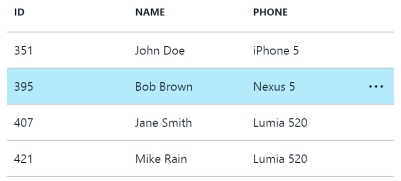

From simple experiences that visualize basic lists to advanced scenarios such as virtualized hierarchical data; the grid control can be configured with different options such as multiple selection, custom formatters, grouping, filtering, sorting, paging and virtualization.

<a name="controls-grid-getting-started"></a>
### Getting Started
The Grid API is in the MsPortalFx.ViewModels.Controls.Lists.Grid namespace.
To create a grid you will need to provide data, column definitions, plugins, and options. Some of the basic implementations are provided [here](#basic-samples).

[Grid Samples][GridSamples]

<a name="controls-grid-plugins"></a>
### Plugins
There are many plugins for the grid control to add behaviors.
Grid plugins are called "extensions" in the API.
The "extension" terminology can be confusing to portal "extension" authors.
So, in this document the grid extensions will be referred to as plugins.

- [SelectableRow](#selection-and-activation) - Plugin to have selectable rows.
- [ResizableColumn]()                        - Plugin to have resizable columns.
- [SortableColumn](#sorting)                 - Plugin to have sortable columns.
- [Filterable](#filtering)                   - Plugin to have filterable rows.
- [ContextMenuShortcut](#context-menus)      - Plugin to have a shortcut to the item context menu displayed in the row.
- [Pageable](#paging)                        - Plugin to handle and display large items in sequential pages.
- [Scrollable](#scrolling)                   - Plugin to display items with virtual scrolling.
- [Groupable](#grouping)                     - Plugin to group rows by column value.
- [Hierarchical](#hierarchical)              - Plugin to display hierarchical items.
- [EditableRow](#editing)                    - Plugin to have editable rows.
- [ReorderRow](#reordering)                  - Plugin to have reorder rows.
- [RightClickableRow]()                      - Plugin to have right-clickable row.
- [Hoverable]()                              - Plugin to enable hover index communication with other parts.

Plugins are enabled in three ways.
- with bit flags passed to the ViewModel constructor.
- by default.
- as a dependency of an enabled plugin.

To enable a plugin you need to do two things.
First, you must set the appropriate bit flag when you construct the grid.
It is important that you combine the bit flags with the "|" or "+" operator. 
*A common pitfall is to use "&" which results in no plugins.*
Second, you must provide plugin options.

The following sample shows a simple method of enabling the plugins:

```typescript

// Define the grid plugins and options.
this.grid = new Grid.ViewModel<WorkItem, WorkItem>(
    container,
    null,
    Grid.Extensions.Scrollable | Grid.Extensions.Filterable | Grid.Extensions.SortableColumn,
    {
        scrollable: <Grid.ScrollableOptions<WorkItem>>{
            dataNavigator: this._navigator
        },
        filterable: <Grid.FilterableOptions>{
            // Server filter causes the grid to use the data navigator for filtering.
            serverFilter: ko.observable(true)
        },
        sortableColumn: <Grid.SortableColumnOptions<WorkItem>>{
        }
    });

```

Plugin compatibility:

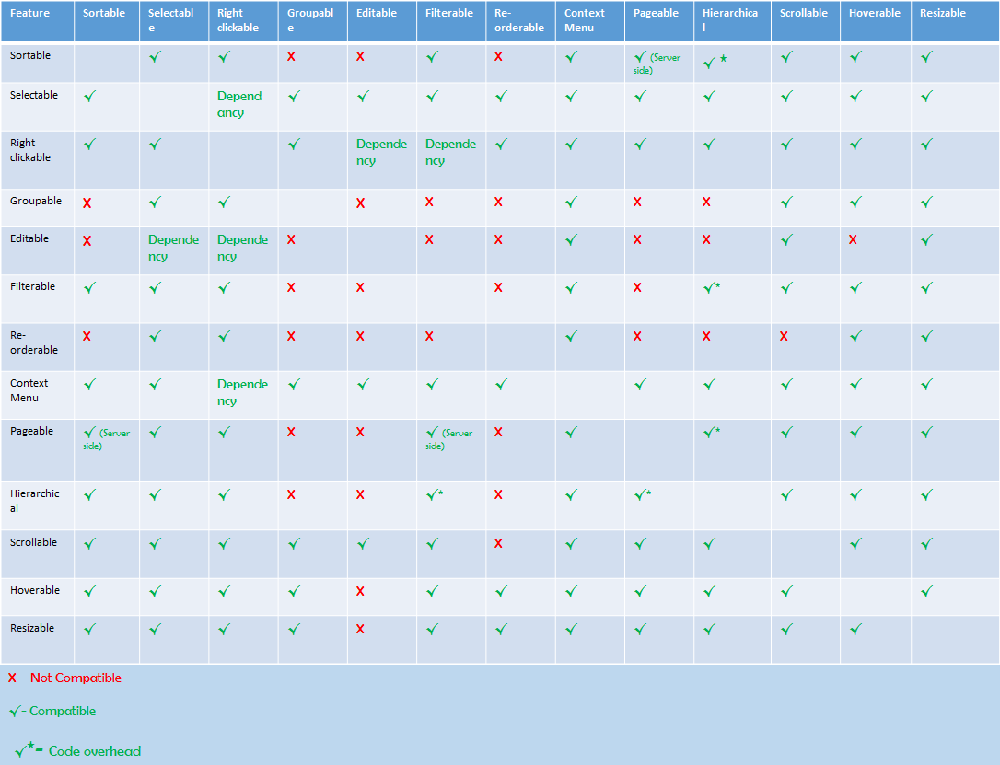

<a name="controls-grid-providing-data"></a>
### Providing Data
In the basic scenario your data is provided to the grid, throw the items param as a KnockoutObservableArray&lt;T>.
The array can be one you create or more commonly it will be the items property of a QueryView.

In virtualzation scenarios you will provide the data to the grid via a DataNavigator.
Navigators can support two data retrieval patterns.
- The first is sequential data access using continuation tokens.Sequential navigation can be enabled by the Pageable plugin.
- The second is using random data access aka skip-take. Random access navigation can be enabled by the Pageable or Scrollable plugins.

[Data Documentation](/portalfx-data.md)

<a name="controls-grid-defining-columns"></a>
### Defining Columns
Columns are defined by setting the columns property on the grid view model.
The header text of the column is declared with the name property.
Cell values for the column are determined by the itemKey property.
The itemKey specifies the name of the property on your data item.
For each data item the grid will use the itemKey to read the value.
There are many other column options that specify the formatting of the value or enable plugin specific behaviors.

```typescript

var columns: MsPortalFx.ViewModels.Controls.Lists.Grid.Column[] = [
    {
        itemKey: "name",
        name: ko.observable<string>(ClientResources.controlSampleName)
    },
    {
        itemKey: "ssnId",
        name: ko.observable<string>(ClientResources.controlSampleSsn)
    },
    {
        itemKey: "bills",
        name: ko.observable<string>(ClientResources.gridBasicGridBills)
    }
];
this.basicGridViewModel.columns = ko.observableArray<MsPortalFx.ViewModels.Controls.Lists.Grid.Column>(columns);

```

<a name="controls-grid-formatting"></a>
### Formatting
Columns are formatted using three key properties.
  - ``itemKey``: The property of your data item to display.  
  - ``format``: Optional format type from the Format enumeration. 
  - ``formatOptions``:  Optional formatter specific options.

By default values you specify with the column itemKey will be formated as text.
The text formatter does a simplistic toString conversion.
If you have an object or need more specific formatting for a date or number there are many built in formatters to use.

[Formatted Grid Sample][FormattedSample]

<a name="controls-grid-formatting-dates"></a>
### Formatting Dates
Dates are formatted using the Intl API using the current locale set by the user.
The data value of the date can be a number, string, or date.
The formatters will convert to date and then use the Intl API to convert to text.
The following formatters can be used for formatting dates:
- ShortDate: 7/18/2013
- LongDate: Thursday, July 18, 2013 
- MonthDay: July 18
- YearMonth: July, 2013
- ShortTime: 11:20 AM
- LongTime: 11:20:19 AM
- CustomDate: Any format posible using Intl date formatting

```typescript

{
    itemKey: "birthday",
    name: ko.observable<string>(ClientResources.controlSampleBirthday),
    format: MsPortalFx.ViewModels.Controls.Lists.Grid.Format.CustomDate,
    formatOptions: {
        dateFormat: {
            month: "long",
            day: "numeric",
        }
    }
},

```

You can create your on Intl option or use one of the predefined options from the ``Globalization.Intl`` namespace.

[Intl API DateTime][IntlAPIDateTime]
<a name="controls-grid-formatting-numbers"></a>
### Formatting Numbers
There is a single formatter for formatting numbers called the Number formatter.
The number formatter uses the Int API and will format to the current locale the user has set in the portal.
It is capable of formatting numbers in many ways including currency.

```typescript

{
    itemKey: "pairsOfShoes",
    name: ko.observable<string>(ClientResources.controlSamplePairsOfShoes),
    format: MsPortalFx.ViewModels.Controls.Lists.Grid.Format.Number,
    formatOptions: {
        numberFormat: { minimumFractionDigits: 1 }
    }
}

```

[Intl API Number][IntlAPINumber]

<a name="controls-grid-formatting-images"></a>
### Formatting Images
There are several formatters for displaying images in cells.
The preferred formatters are SvgIcon and SvgIconLookup.
The SvgIcon formatter allows you to display an SVG and optional text where the data value contains the SVG or an object containing the SVG and text.
The SvgIconLookup allows you to map data values to SVGs for display.  
There are two other similar formatters that use image uris instead of SVGs.
However, portal SVGs are preferred because they are themed.

<a name="controls-grid-formatting-uris"></a>
### Formatting Uris
There is a single Uri formatter that formats a data value containing a URI as a clickable link.
The data value can also be an object containing the URI, text, and target.

<a name="controls-grid-formatting-uris-formatting-text"></a>
#### Formatting Text
The default formatter for the Grid is the Text formatter.
There is also a TextLookup formatter that uses a map to convert specific data values to text.

<a name="controls-grid-formatting-html"></a>
### Formatting Html
The Html formatter allows you to display html.
The html is specified by your data values and can not include knockout data bindings.
If you need knockout bindings use the HtmBindings formatter.

<a name="controls-grid-custom-formatting-htmlbindings"></a>
### Custom Formatting (HtmlBindings)
The grid only has a single way to do custom formatting.
This is done using the HtmlBindings formatter.
With the HtmlBindings formatter you can specify an html template containing knockout bindings.
The $data object bound to the template will be in the following format where value is specified by the itemKey property and settings.item is your data item:

```
{
    value: any,
    settings: {
       item: T
    }
}
```

```typescript

{
    itemKey: "name",
    name: ko.observable<string>("{0}\\{1}".format(ClientResources.controlSampleName, ClientResources.controlSampleSmartPhone)),

    format: MsPortalFx.ViewModels.Controls.Lists.Grid.Format.HtmlBindings,
    formatOptions: {
        htmlBindingsTemplate: "<span data-bind='text: value'></span>\\<span data-bind='text: settings.item.smartPhone'></span>"
    }
},

```

<a name="controls-grid-selection-and-activation"></a>
### Selection and Activation
With the grid you can enable the SelectableRow extension that enables row selections and blade activations.
Selection and activation are seperate concepts that overlap in the grid.
Activation in the grid is displaying a blade.
Selection is the selecting of items within the grid.
Depending on your settings the act of selecting may also activate a blade.
This is done by either setting the selection option activateOnSelected to true or by setting specific columns to be activatable by defining `activatable = true`.
 
Blade activations can be homogeneous or heterogeneous.
For homogeneous blade activations you use BladeAction in PDL to specify the blade to open.
For heterogeneous blade activation you use DynamicBladeAction in PDL.
You must also implement createSelection to return a DynamicBladeSelection object per item.

[Grid Selection Sample][SelectableSample]
 
<a name="controls-grid-sorting"></a>
### Sorting
If you enable the SortableColumn plugin grid headers can be used to sort the data.
If you have a dataNavigator the sorting options will be passed to the navigator when changed and the navigator should handle the sorting -- typically by passing to the backend server as part of the query.
If you have local data in an observable items array the grid has a default sort callback that will sort the items in the array.
You can provide a custom sort for local data in the ``SortableColumnOptions sortCallback`` property.
 
For each column you can set the initial sortOrder.
You can also opt out of sorting for a column by setting ``sortable = false``;

[Grid Sorting Sample][SortableSample]
 
<a name="controls-grid-filtering"></a>
### Filtering
The grid has a Filterable row plugin that can be used for filtering.
The plugin provides a simple serch box UI that users can use to enter text.
The filtering can occur on the server or in the grid locally.
To enable filtering through the data navigator set serverFiltering to true.
Otherwise the filtering will occur in the grid on the client.

The client side filtering works as follows.
The set of properties to filter against are by default the itemkeys of all columns.
Alternatively, you can specify the set of properties to filter against usting the searchableColumns option.
For every searchable property the grid looks for a column definition.
If a column definition is found the grid looks for a filterableFormat option.
If a filterableFormat is found it isused to convert the data to value to a searchable string.
If a filterableFormat is not found the grid converts value to string using JSON.stringify and the text formatter.
The grid then searches for all the search terms in the formatted property values.
If every search term is found the item is added to the filter results.

[Grid Filtering Sample][FilterableSample]

<a name="controls-grid-editing"></a>
### Editing
The editable grid enables editing a list of data entities.
It allows for editing existing items, deleting items, and adding new items.
When a row is being edited the cells will be formatted with the ``editableFormat`` specified on the column.
When not being edited the cells are formatted with ``format`` specified in the column definition.
A row remains in the edit state until all the validators on the cells indicate the row is valid.

There are special formatters for editing that create form controls that allow data editing.
The formatters specifically for editing are 
- CheckBox
- TextBox
- MultiselectDropDown
- CheckBoxRowSelection
- DropDown

[Editable Grid Sample][EditableSample]
[All Controls in a Grid Sample][AllControlsSample]

<a name="controls-grid-paging"></a>
### Paging
The pagable plugin enables virtualization for large data sets using sequential and random access.
Alternatively, there is a scrollable plugin for random access scrolling.

For sequential data the ``type`` must be specified ``PageableType.Sequential``.
You must also supply a data navigator that supports loadByContinuationToken.
For sequential data the grid will load the first page of data and display a button for the user to load more data.

For random access data the ``type`` must be specified ``PageableType.Page``.
In addition a data navigator that supports loadBySkipTake is required.
For random access the grid will load the first page and display a pager control at the bottem that will allow the user to navigate through the data pages.

[Pageable Grid Sample][PageableSample]

<a name="controls-grid-grouping"></a>
### Grouping
The grid groupable plugin allows you to order your data into groups of rows with a group header.
To groups are determined by using the ``groupKey`` option to read the property of your data item.
Each item having the same value for the groupKey property will be in the same group.
By default the groups will be auto-generated for each unique group.
However, if you can generate and control the groups yourself through the ``groups`` property.

[Grid Grouping Sample][GroupedSample]

<a name="controls-grid-hierarchical"></a>
### Hierarchical
The hierarchical grid plugin allows you to display hierarchical data with expand and collapse of parent rows.
To display hierarchical data you must implement a hierarchy.
Hierarchies can be somewhat complicated to implement depending on your requirements.
Your hierarchy will supply the current items to display to the grid.
The hierarchy implementation is responsible for initializing and keeping track of the expanded states for all items.
The grid will notify the hierarchy when the user expands or collapses a row and the hierarchy must update the items.

Hierarchies may also support virtualization with the pagable or scrollable plugins.
For virtualization is common to create a custom data navigator that implements the hierarchy interface.
This is because the navigator will be outputing data items that exclude collapsed children.
Is is also important for virtual hierarchies to update the navigator ``metatdata totalItemCount`` on every expand/collapse to return the total items excluding collapsed children.
Updating the count lets the grid know the virtualization needs updating.

[Hierarchical Grid Sample (simplistic hierarchy that repeats)][HierarchicalSample]

[Pageable Hierarchical Grid Sample (also shows demand loading)][PageableHierarchicalSample]

[Scrollable Hierarchical Grid Sample (complicated structure and stream approach)][WorkitemScenarioSample]

<a name="controls-grid-context-menus"></a>
### Context Menus
The context menu shortcut is the ellipsis at the end of each grid row.
It enables displaying the context menu by click.
The context menu shorcut plugin is enabled by default.

To customize the context menu you must supply a ``commandGroup`` property on your grid item containg the command group you wish to display.

[Context Menu Shortcut Grid Sample][ContextMenuSample]
 
<a name="controls-grid-scrolling"></a>
### Scrolling
The scrollable grid plugin enables scrolling within the grid.
This is useful when the grid needs to fill an entire container and keep the headers at the top.
The container element must have a width and height or the scrolling will not display correctly.
The scrolling can be virtualized or non virtualized.

To fill a blade with the scrollable grid make the blade/part size ``FitToContainer``.
This will ensure the blade content area has a height and width set to the viewport size.
A scrollable grid fixture element directly in the blade will then work properly.

For virtualized scrolling you must supply a data navigator that supports loadBySkipTake.
For non-virtualized grids you do not supply a data navigator and just set the grid ``items`` property directly. 

[Scrollable Grid Sample][ScrollableSample]

<a name="controls-grid-reordering"></a>
### Reordering
The grid reorder row plugin allows users to reorder the items in the grid with drag drop.
The reordering can be automatic or handled by the extension using the ``reorderRow`` event.

[Reorderable Grid Sample][ReorderSample]

<a name="controls-grid-dynamic-grid-definitiona"></a>
### Dynamic Grid Definitiona
In some cases an extension may not know grid columns or other properties in advance.
In these sceanarios the extension author must define and create the grid at run-time.
There are several options for dynamic definition of a grid.

1. Create and add columns when data is available.  The columns property is an observable array and allows changes as needed.
2. Make the grid view model property on your part/blade observable. Instead of declaring `public grid: Grid.ViewModel<T>;` declare the grid as `public grid: KnockoutObservable<Grid.ViewModel<T>>;`. This makes your view model property observable so you can set it whenever you want.  You can also clear it by setting it to null. The template would be the same `<div data-bind="pcControl: grid"></div>`.
3. Use sections for layout.  If you are using sections you can add the grid to the section children dynamically.
4. CustomHtml control has an updatable inner viewmodel.
5. htmlTemplate binding allows you to dynamically specify both the view model and the template `<div data-bind="htmlTemplate: { data: viewModel, html: template }"></div>`

<a name="controls-grid-further-resources"></a>
### Further Resources
- [All Grid Samples][GridSamples]
- [Basic Grid Sample][BasicSample]
- [Formatted Grid Sample][FormattedSample]
- [Selectable Grid Sample][SelectableSample]
- [Context Menu Shortcut Grid Sample][ContextMenuSample]
- [Grouped Grid Sample][GroupedSample]
- [Filterable Grid Sample][FilterableSample]
- [Pageable Grid Sample][pageableSample]
- [Hierarchical Grid Sample][HierarchicalSample]
- [Scrollable Grid Sample][ScrollableSample]
- [Sortable Column Grid Sample][SortableSample]
- [Reorder Grid Sample][reorderSample]
- [Resizeable Column Grid Sample][resizableSample]
- [Editable Grid Sample][EditableSample]
- [All Controls in a Grid Sample][AllControlsSample]

[GridSamples]: http://aka.ms/portalfx/samples#blade/SamplesExtension/GridInstructions/selectedItem/GridInstructions/selectedValue/GridInstructions
[BasicSample]: http://aka.ms/portalfx/samples#blade/SamplesExtension/BasicGridInstructions
[FormattedSample]: http://aka.ms/portalfx/samples#blade/SamplesExtension/FormattedGridInstructions
[SelectableSample]: http://aka.ms/portalfx/samples#blade/SamplesExtension/SelectableGridInstructions
[ContextMenuSample]: http://aka.ms/portalfx/samples#blade/SamplesExtension/ContextMenuShortcutGridInstructions
[GroupedSample]: http://aka.ms/portalfx/samples#blade/SamplesExtension/GroupedGridInstructions
[FilterableSample]: http://aka.ms/portalfx/samples#blade/SamplesExtension/FilterableGridInstructions
[PageableSample]: http://aka.ms/portalfx/samples#blade/SamplesExtension/PageableGridInstructions
[HierarchicalSample]: http://aka.ms/portalfx/samples#blade/SamplesExtension/HierarchicalGridInstructions
[ScrollableSample]: http://aka.ms/portalfx/samples#blade/SamplesExtension/ScrollableGridInstructions
[SortableSample]: http://aka.ms/portalfx/samples#blade/SamplesExtension/SortableColumnGridInstructions
[ReorderSample]: http://aka.ms/portalfx/samples#blade/SamplesExtension/ReorderGridInstructions
[ResizeableSample]: http://aka.ms/portalfx/samples#blade/SamplesExtension/ResizableColumnGridInstructions
[EditableSample]: http://aka.ms/portalfx/samples#blade/SamplesExtension/EditableGridInstructions
[AllControlsSample]: http://aka.ms/portalfx/samples#blade/SamplesExtension/AllControlsGridInstructions
[PageableHierarchicalSample]: http://aka.ms/portalfx/samples#blade/SamplesExtension/PageableHierarchicalGridInstructions
[WorkitemScenarioSample]: http://aka.ms/portalfx/samples#blade/SamplesExtension/SDKMenuBlade/scenariosworkitem
[IntlAPIDateTime] https://developer.mozilla.org/en-US/docs/Web/JavaScript/Reference/Global_Objects/DateTimeFormat
[IntlAPINumber] https://developer.mozilla.org/en-US/docs/Web/JavaScript/Reference/Global_Objects/NumberFormat

	
<a name="controls-helpers-and-indicators"></a>
## Helpers and Indicators

- [Docked Balloon](http://aka.ms/portalfx/samples#blade/SamplesExtension/DockedBalloonInstructions/selectedItem/DockedBalloonInstructions/selectedValue/DockedBalloonInstructions)
- [Info Box](http://aka.ms/portalfx/samples#blade/SamplesExtension/InfoBoxInstructions/selectedItem/InfoBoxInstructions/selectedValue/InfoBoxInstructions)
- [Progress Bar](http://aka.ms/portalfx/samples#blade/SamplesExtension/ProgressBarInstructions/selectedItem/ProgressBarInstructions/selectedValue/ProgressBarInstructions)

<a name="controls-visualizing-data"></a>
## Visualizing Data

- Chart
     <h1 name="portalfx-controls-chart"></h1>
 ## Charts
Insert chart controls in your experience to allow your users to visualize and analyze their data.

[Chart](../media/portalfx-ui-concepts/chart.png)

In most cases, you will probably want to use the chart [intrinsic part](#portalfx-). The intrinsic part is maintained by the framework and will provide you with consistent layout with the rest of the portal.

If you are using a custom part template, charts can be added with the following html:

```xml
<div data-bind='pcChart: chartVM' style='height:500px'></div>
```

<a name="controls-visualizing-data-chart-views-and-series-views"></a>
### Chart views and series views

Our charts include the following **chart view** types which can be used separately or in tandem:

* Line
* Grouped bar
* Stacked bar
* Scatter
* Area
* Stacked area 

Chart views are the high-level view type for your chart.

```ts
// Initialize the view.  This is the code that makes this chart a bar chart.
var barChartView = new MsPortalFx.ViewModels.Controls.Visualization.Chart.BarChartView<string, number>(MsPortalFx.ViewModels.Controls.Visualization.Chart.BarChartType.Grouped);
this.chartVM.views([barChartView]);
```

A sample chart viewmodel with a single chart view type can be found here:
`\Client\Controls\Chart\ViewModels\BarChartViewModels.ts`

A sample chart viewmodel with multiple chart view types can be found here:
`\Client\Controls\Chart\ViewModels\OverlayedViewChartViewModel.ts`

**Series views** are visualizations of individual data series. Series views allow you to modify the color, display name, and interaction behavior of a particular series.

By default, series views will be generated for each of the chart views and each of the data series you add to your chart. For example, let's say you added three data series, seriesA, seriesB, and seriesC to a chart that has two chart views, a bar chart view and a line chart view. Your chart would have 6 series views, a bar chart series view and a line chart series view for each series. This default behavior is ideal for simple charts, especially those with one chart view type.

In some cases you may want to do some more interesting things with series views. Perhaps instead you want seriesA and seriesB to be visualized as bars and seriesC to be visualized as a line. To achieve this behavior you will need to turn off the auto-generate behavior.

```ts
this.chartVM.autogenerateSeriesViews(false);
```

You can then create and specialize your series views however you'd like.

```ts
var lineSeriesView = new MsPortalFx.ViewModels.Controls.Visualization.Chart.LineChartSeriesView<string, number>();
lineSeriesView.seriesName("LineSeries");
lineSeriesView.cssClass("msportalfx-bgcolor-c1");

var barSeriesView = new MsPortalFx.ViewModels.Controls.Visualization.Chart.SeriesView<string, number>(MsPortalFx.ViewModels.Controls.Visualization.Chart.BarChartType.Stacked);
barSeriesView.seriesName("BarSeries");

lineChartView.seriesView([lineSeriesView]);
barChartView.seriesView([barSeriesView]);
```

A good example of using the chart's auto-generated series views functionality is:
`\Client\Controls\Chart\ViewModels\LineChartDateBasedViewModels.ts`

To see a more advanced sample where series views are created explicitly by the extension see
`\Client\Controls\Chart\ViewModels\OverlayedViewChartViewModels.ts`

<a name="controls-visualizing-data-metrics"></a>
### Metrics
Metrics are the big data call-outs that pair with our chart controls to give the user interactive peeks into their data. Metrics can be configured manually by handling chart events, calculating values, and passing information to the metrics controls or by setting up metrics rules. 


<a name="controls-visualizing-data-metrics-rules"></a>
### Metrics rules
Metrics rules are a rule-based system that automatically hooks up metric values to different user interactions. For instance, by default (when the user is not interacting with the chart area) you may want your chart metrics to show the average value of each data series. This rule can be configured like so:

```ts
metricRule1.scope(Chart.MetricRuleScope.Default);
metricRule1_metric1.aggregationScope(Chart.MetricRuleAggregationScope.AllSeparately);
metricRule1_metric1.aggregationType(Chart.MetricRuleAggregationType.AverageY);
```

With this rule configured, when the user is not interacting with the chart area they will see one metric representing the average value of each data series on the chart.

See the following file for a full example of the metrics rules implementation:
`\Client\Controls\Chart\ViewModels\LineChartDateTimeViewModels.ts`


- Donut
  	 <h1 name="portalfx-controls-donut"></h1>
 
<a name="controls-donut-chart"></a>
## Donut chart

Donut charts are a great way to visualize proportional data.

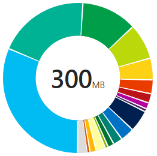

Donuts can be added to your part templates with the following html:

```xml
<div data-bind='pcDonut: donutVM' style='height:500px; width:500px'></div>
```

A sample view model can be found here:

`\Client\Controls\Donut\ViewModels\DonutViewModels.ts`

Other visualization controls:

* [Chart](#portalfx-controls-chart)

	
- Gauges
  - [Quota Gauge](http://aka.ms/portalfx/samples#blade/SamplesExtension/QuotaGaugeBlade)
  - [Single Value Gauge](http://aka.ms/portalfx/samples#blade/SamplesExtension/SingleValueGaugeBlade)
  - [Step Gauge](http://aka.ms/portalfx/samples#blade/SamplesExtension/StepGaugeBlade)
- Graphs
  - [Standard Graph](http://aka.ms/portalfx/samples#blade/SamplesExtension/graphInstructions)
  - [Custom Html Nodes](http://aka.ms/portalfx/samples#blade/SamplesExtension/graphCustomNodeInstructions)
- [Metrics](http://aka.ms/portalfx/samples#blade/SamplesExtension/MetricsInstructions/selectedItem/MetricsInstructions/selectedValue/MetricsInstructions)
- Maps
  - [Base Map](http://aka.ms/portalfx/samples#blade/SamplesExtension/BaseMapInstructions)
  - [Hexagon Layout Map](http://aka.ms/portalfx/samples#blade/SamplesExtension/HexagonMapInstructions)
- [Menu](http://aka.ms/portalfx/samples#blade/SamplesExtension/MenuInstructions/selectedItem/MenuInstructions/selectedValue/MenuInstructions)
- [Log Stream](http://aka.ms/portalfx/samples#blade/SamplesExtension/LogStreamInstructions/selectedItem/LogStreamInstructions/selectedValue/LogStreamInstructions)
- [Spec Comparison Table](http://aka.ms/portalfx/samples#blade/SamplesExtension/SpecComparisonTableInstructions/selectedItem/SpecComparisonTableInstructions/selectedValue/SpecComparisonTableInstructions)
- [Video Control](http://aka.ms/portalfx/samples#blade/SamplesExtension/VideoInstructions/selectedItem/VideoInstructions/selectedValue/VideoInstructions)
- [Legend](http://aka.ms/portalfx/samples#blade/SamplesExtension/Legend/selectedItem/Legend/selectedValue/Legend)
- [HotSpot](http://aka.ms/portalfx/samples#blade/SamplesExtension/HotSpotInstructions/selectedItem/HotSpotInstructions/selectedValue/HotSpotInstructions)
- [Video](http://aka.ms/portalfx/samples#blade/SamplesExtension/VideoInstructions/selectedItem/VideoInstructions/selectedValue/VideoInstructions)
- [Terminal Emulator](http://aka.ms/portalfx/samples#blade/SamplesExtension/TerminalEmulatorInstructionsBlade/selectedItem/TerminalEmulatorInstructionsBlade/selectedValue/TerminalEmulatorInstructionsBlade)

<a name="controls-build-your-own-controls"></a>
## Build your own controls

  	 <h1 name="portalfx-controls-custom-controls"></h1>
 ## Custom controls

<a name="controls-build-your-own-controls-important-note"></a>
### IMPORTANT NOTE:
- This feature is not yet enabled in production environment i.e. you cannot go to production as of now with custom control on your blade. This will enabled soon however, so you can start implmentation work now.
- As this is a preview feature both 'feature.customcontrols=true' and 'clientOptimizations=bundle' need to be specified in the portal's query string to enable custom controls.
- Custom controls is not enabled on sovereign\govt clouds. Custom controls feature will not work on these clouds.

<a name="controls-build-your-own-controls-sections"></a>
### Sections:
- [Custom control overview](#custom-control-overview)
- [Building a custom control](#custom-control-building)
   - [Build your control](#custom-control-build-it)
   - [Package the control in the ibiza framework](#custom-control-package-control)
- [Consuming a custom control](#custom-control-consuming)
- [Making a custom control that participate in validation](#custom-control-validation)
- [Advanced topics](#custom-control-advanced)
  - [Requiring non-AMD scripts from your custom control widget](#custom-control-non-amd-scripts)
- [Known issues](#custom-control-known-issues)
- [Fixed issues not yet fixed](#custom-control-not-yet-fixed)

<a name="custom-control-overview"></a>
<a name="controls-build-your-own-controls-custom-control-overview"></a>
### Custom control overview

Today if you want to build an ibiza extenison you are provided with Rich framework built in controls. Sometimes you may have a scenario for richer user experience where you need a custom cotrol.
In this case today, we give you 2 options: 
- You get complete Iframe at blade level to build controls,but with limitation that you cannot use any ibiza control within that blade
- You can contribute a framwork control into our repo, but here you will have to maaintain and develop this control using our review process.

To overcome this hurdles we came up with solution **Custom Control**
Basically custom controls feature:
- Enable partners to use custom controls along with ibiza framework controls.
- Enable partners to fulfill their custom controls need without taking a dependency on Ibiza team
- Enable partners to use Ibiza to write targeted forms controls
- Enable partners use controls written using other frameworks in their extension
- Enable partners to share controls across extensions


<a name="custom-control-building"></a>
<a name="controls-build-your-own-controls-building-a-custom-control"></a>
### Building a custom control

Building a custom control is can be divided into 3 easy steps:
1. Build your control
    Today there are lot of open source libraries that enable you to build custom controls with great features. Build your custom control using such open source libraries.
2. Package it in ibiza framework
    You will need to package your package your control for Shell to understand and render it into your experience. The steps are mentioned (here)[].
3. Consume your control in your extension
    Once you have packaged your control, you will consume that control into your extension for having rich customer experience. How to consume your custom control is mentioend [here]()

<a name="custom-control-build-it"></a>
<a name="controls-build-your-own-controls-building-a-custom-control-building-your-control"></a>
#### Building your control
Develop your control however you like. Once you have a control working on a standalone HTML page or something then the next step is to itegrate it into the portal.

<a name="custom-control-package-control"></a>
<a name="controls-build-your-own-controls-building-a-custom-control-package-the-control-in-the-ibiza-framework"></a>
#### Package the control in the ibiza framework
Once you have a working control there are just a few steps needed to package it in the framework:

<a name="controls-build-your-own-controls-building-a-custom-control-package-the-control-in-the-ibiza-framework-implement-custom-controls-contract-in-your-controls"></a>
##### Implement Custom Controls contract in your controls
Create a <Your Control name>.ts file, which should import and implement `Fx/Composition/CustomControl` contracts which are shown below. Your module along with custom control contract will have your control template and control specific functionality. 

```ts
  /**
     * Defines the contract for extension authored custom control.
     */
    export interface Contract<TOptions> {
        /**
         * Context properties that will be setup by shell for extension authored custom control.
         * Context object will be set before onInitialize method is called.
         */
        context: Context<TOptions>;

        /**
         * Initialize method will be called by the shell after setting up the context properties on the custom control.
         * Extension author should resolve the promise once the data is fetched and control is ready to render.
         * In the event that control can be revealed with partial data, call revealContent on the container object present in the context.
         */
        onInitialize(): Q.Promise<any>;

        /**
         * Optionally pass in a dispose method which will be invoked when the control is disposed.
         */
        dispose?(): void;
    }
```

<a name="controls-build-your-own-controls-building-a-custom-control-package-the-control-in-the-ibiza-framework-define-options-contract-for-custom-controls"></a>
##### Define options contract for Custom Controls
Once you have defined Custom Control contracts, you will need to create the options for your controls. This is basically the set of options your control will need from Shell when rendered in your extenions. 
You will create the <Your Control Name>Contracts.d.ts file which will have the options required for your controls. Below shows the example where we pass name as an option:
```ts    
    declare module <YourExtensionName>.BreadCrumb {
    
        export interface BreadCrumb {
            /**
            * Name of the BreadCrumb item. 
            */
            name: string;
        }
        export interface Options {
            breadCrumbs?: KnockoutObservableArray<BreadCrumb>;
            onBreadCrumbClick?: (breadCrumb: BreadCrumb) => void;
        }
    }
```

<a name="controls-build-your-own-controls-building-a-custom-control-package-the-control-in-the-ibiza-framework-define-control-pdl"></a>
##### Define control PDL
Once you have defined the options and contract for your controls, next you define is PDL with below fields:
 - `Name` the name of your control
 - `ModuleId` pointer to your control implementation
 - `OptionsContract` pointer to the options contract definition
 - `Export` set this to true if you wish to share your control across extensions. You can basically provide the options contract file and the PDE of your control to differernt extensions and they can render the control without re-writing it.
  - `IsFormField`(Optional) - set this to true if your control needs to behave like ibiza form field. The details are provided [here]().
 - `StyleSheet` (Optional) - point this to your control style sheet.

```xml
<Definition xmlns="http://schemas.microsoft.com/aux/2013/pdl"
              Area="Preview">
 
     <!--Set Export="true" only if extension author wants to share the control and allow another partner extension to consume this control.-->
     <Control
         Name="BreadCrumb"
         ModuleId="Preview/CustomControls/BreadCrumb/BreadCrumb"
         OptionsContract="<YourExtensionName>.BreadCrumb.Options"
         Export="true">
 
         <StyleSheet Source="{Css Source='./BreadCrumb.css'}" />
     </Control>
</Definition>
```
  
<a name="custom-control-consuming"></a>
<a name="controls-build-your-own-controls-consuming-a-custom-control"></a>
### Consuming a custom control

Once you have built your custom control, you can consume the control in yur experience in 3 steps:

<a name="controls-build-your-own-controls-consuming-a-custom-control-define-your-template-blade"></a>
##### Define your template blade
You need to identify the blade that carries custom controls by setting custom control property to true as shown below:

```xml
<Definition xmlns="http://schemas.microsoft.com/aux/2013/pdl"
            Area="Preview">

<TemplateBlade Name="FileExplorerSampleInstructions"
                ViewModel="{ViewModel Name=FileExplorerSampleBladeViewModel, Module=../Preview/CustomControlUsage/FileExplorerSample/ViewModels/FileExplorerSampleViewModels}"
                Template="{Html Source='Templates\\FileExplorerSampleInstructions.html'}"
                HasCustomControls="true" />
</Definition>
```

<a name="controls-build-your-own-controls-consuming-a-custom-control-refer-your-custom-control-in-template"></a>
##### Refer your custom control in template

You can refer your custom control just like normal pcControl reference.

```xml
<div data-bind='pcControl: breadCrumb'></div>
<div data-bind='pcControl: fileExplorerVM'></div>
```

<a name="controls-build-your-own-controls-consuming-a-custom-control-in-blade-viewmodel-use-control-reference-to-create-control-view-model"></a>
##### In blade ViewModel use control reference to create control view model

```ts
    this.breadCrumb = ControlReferences.BreadCrumb.createViewModel(container, {
            breadCrumbs: ko.observableArray(SampleData.getBreadCrumbs(SampleData.srcFolder)),
            onBreadCrumbClick: (breadCrumb) => {
                updateFileExplorerItems(breadCrumb.name);
            }
    });
```

<a name="custom-control-validation"></a>
<a name="controls-build-your-own-controls-making-a-custom-control-that-participate-in-validation"></a>
### Making a custom control that participate in validation
Your scenario may require you to develop a control that you wish to use in forms section of the blade along with other Ibiza form controls. Ibiza has the internal validation patterns for rest of the controls and if you wish that your control should behave 
similarly you will need to do 2 small changes in your control implmentation:

1. In Your PDL define the control as form field i.e.
`IsFormField="true"`

2. Your options contract module should inherit module `Fx/Controls/CustomControl/FormField` to make sure Shell identifies it as form field on your blade:
```
declare module "<YourExtensionName>/NumericSpinner" {
    import * as FormField from "Fx/Controls/CustomControl/FormField";

    /**
     * Specifies the options for NumericSpinner 
     */
    export interface Options extends FormField.Options<number> {
    }
}
```

<a name="custom-control-advanced"></a>
<a name="controls-build-your-own-controls-advanced-topics"></a>
### Advanced topics

<a name="custom-control-non-amd-scripts"></a>
<a name="controls-build-your-own-controls-advanced-topics-requiring-non-amd-scripts-from-your-custom-control-widget"></a>
#### Requiring non-AMD scripts from your custom control widget
If you're using 3rd party libraries to develop your control you may find the library was not developed to be loaded by RequireJS. You can still use require's config settings to load the file 
as a dependency of your widget.

<a name="custom-control-known-issues"></a>
<a name="controls-build-your-own-controls-known-issues"></a>
### Known issues
Currently certain controls do not work with the custom controls infrastructure. You will not be able to use custom controls if your blade contains any of the following. You can use 
the bugs to track the progress of any fixes:

- [OAuth button](http://vstfrd:8080/Azure/RD/_workitems#_a=edit&id=7301218)
- [File upload control](http://vstfrd:8080/Azure/RD/_workitems#_a=edit&id=7300948)
- [File download control](http://vstfrd:8080/Azure/RD/_workitems#_a=edit&id=7301179)
- [Progress bar](http://vstfrd:8080/Azure/RD/_workitems#_a=edit&id=7301223)
- [Show a better error experience when custom controls are used in an unlocked blade](http://vstfrd:8080/Azure/RD/_workitems#_a=edit&id=7915036)
- Issues around ProxiedObservablesV2
  - Use feature flag 'feature.pov2=false' to turn off ProxiedObservablesV2 feature if you hit PO errors


If you have other comments or find additional issues you can log a bug [here](http://vstfrd:8080/Azure/RD/AAPT%20-%20Ibiza%20-%20Partner%20Requests/_workItems/create/RDTask?%5BSystem.Title%5D=%5BCustom+Controls%5D+%3CYour+Ask%3E&%5BSystem.Description%5D=%3Cdiv%3E%3Cdiv%3ETeam+Name%3C%2Fdiv%3E%3Cdiv%3EExtension+Contact%3C%2Fdiv%3E%3Cdiv%3E%3Cspan+style%3D%22font-weight%3Abold%3B%22%3E%26lt%3BPUT+YOUR+PRIMARY+CONTACT+HERE%26gt%3B%3C%2Fspan%3E%3C%2Fdiv%3E%3Cdiv%3E%3Cb%3E%3Cbr%3E%3C%2Fb%3E%3C%2Fdiv%3E%3Cdiv%3EIbiza+Contact%3Cdiv%3E%3Cspan+style%3D%22font-weight%3Abold%3B%22%3E%3C%2Fspan%3E%3C%2Fdiv%3E%3C%2Fdiv%3E%3C%2Fdiv%3E%3Cdiv%3E%26lt%3BDescribe+Scenario%26gt%3B%3C%2Fdiv%3E&%5BSystem.Tags%5D=ClickStop2&%5BMicrosoft.VSTS.Common.ActivatedBy%5D=Shrey+Shirwaikar+%3CREDMOND%5Cshresh%3E&%5BMicrosoft.VSTS.Common.Priority%5D=&%5BMicrosoft.VSTS.Common.Triage%5D=Not+Triaged&%5BMicrosoft.VSTS.Scheduling.CompletedWork%5D=&%5BMicrosoft.VSTS.Scheduling.BaselineWork%5D=3&%5BMicrosoft.RD.KeywordSearch%5D=cs2&%5BMicrosoft.Azure.IssueType%5D=Dev+Work&%5BMicrosoft.Azure.WorkStatus%5D=In+Review&%5BMicrosoft.VSTS.Common.BacklogPriority%5D=130&%5BMicrosoft.VSTS.Common.StackRank%5D=2&%5BMicrosoft.Azure.ApprovedDate%5D=Thu+Jul+28+2016+22%3A00%3A50+GMT-0700+(Pacific+Daylight+Time)) 
or contact shresh\adamab.


<a name="authentication"></a>
# Authentication
 <h1 name="portalfx-authentication"></h1>
 ### Overview 

The portal uses an internal provider for authentication and authorization. 

The built-in cloud auth provider uses Azure Active Directory (AAD), which also supports Microsoft Account (MSA, formerly Windows Live ID) users. Please refer to _Accessing claims from your server_, if your extension needs to differentiate between AAD and MSA users.

During sign-in, the portal obtains a token containing claims that identify the signed-in user and retrieves directories and subscriptions s/he has access to, if any.

 **NOTE:** Users can sign in without a subscription. Extensions must gracefully handle this case and return 0 assets when queried._


<a name="authentication-sign-in-flow"></a>
#### Sign in flow

The following is a high-level representation of the sign-in flow provided by the portal:

1. User browses to the portal
2. The portal redirects to AAD to sign in
3. AAD redirects to the portal with a token
4. The portal gets a list of directories the user has access to from ARM
5. The portal gets a list of subscriptions the user has access to from ARM
6. The portal signs the user into the last-used directory, the home directory for AAD accounts, or the first directory it gets from ARM for MSA accounts
7. Finally, the portal loads the Startboard and all extensions

<a name="authentication-calling-arm"></a>
## Calling ARM

<a name="authentication-calling-arm-from-client"></a>
### From client

The recommended practice is to use cross-origin resource sharing (CORS) for all of your non-aggregated, non-orchestrated calls. If you need to call multiple sources for a single piece of UI, you should use a server API to orchestrate/aggregate those calls.

From the extension client to call any server API , use the built-in `ajax()` function to communicate with your extension server. This function will attach a token targeted at ARM specific to your extension to the HTTP header. 
**Do not use `jQuery.ajax()`** &ndash; it will not properly authorize your requests.

**NOTE:** If you have a scenario that isn't supported by `ajax()`, you can use the `getAuthorizationToken()` function to obtain a token and manually attach it to your own request._

<a name="authentication-calling-arm-from-server"></a>
### From Server

To call ARM from your extension server, use the `WebApiClient` class. Like the client `ajax()` function, this class attaches a token targeted at ARM to the request on your behalf.

```cs
    Uri arm = new Uri("https://management.azure.com/...");  // arm endpoint
    using (var client = new Microsoft.Portal.Framework.ClientProxy.WebApiClient())
    {
        // ConfigureAwait(false) is recommended to not forcibly resume on the same thread it started on
        // var data = await client.GetAsync<...>(arm).ConfigureAwait(false);
    }
```

<a name="authentication-calling-alternate-resources"></a>
## Calling alternate resources

**Only First Party Extensions (i.e. Internal/ Microsoft extensions that comply with Azure Privacy terms and conditions) are allowed to call alternate resources.  Third party extensions get an encrypted token that cannot be decrypted by services other than ARM so they cannot call alternate resources.**

If you are working on Internal / Microsoft extension but you are not sure that your extension scenarios comply with Azure terms and conditions then please reach out to [Ibiza LCA](mailto:ibiza-lca@microsoft.com).   

Calling alternate resources involves AAD Onboarding that can take 5-6 weeks so we recommend extension developers to think about this scenarios early in the design phase. 

<a name="authentication-calling-alternate-resources-from-client"></a>
#### From client
Only ibiza has the authority to mint tokens so in order to call external resourses extension developers need to request Ibiza to create the AAD and register the resources with Ibiza.

Here is an example that walks you through on how to enable Contoso_Extension, a sample extension, that can query Graph APIs from extension client :

1. To query graph API's, an extension owner would submit [RDTask](http://aka.ms/portalfx/newextension) to onboard AAD Application with the portal.AAD Onboarding can take 5-6 weeks so we recommend extension developers to think about this scenarios early in the design phase.
2. Once ibiza team has created the app in https://aadonboardingsiteppe.cloudapp.net/ you can reach out to  aadonboarding@microsoft.com to expedite the process.
3. Submit [RDTask](http://aka.ms/portalfx/newextension) to register the AAD Applciation created in Step 1 into the portal's extension config. This step can be done in parallel to Step 2.
   In this case the resourceAccess config for your extension in portal would look something like the following:

```json
{
    "name": "Contoso_Extension",
    "uri": "//stamp2.extension.contoso.com/Home",
    "uriFormat": "//{0}.extension.contoso.com/Home",
    "feedbackEmail": "extension.admin@contoso.com",
    "resourceAccess": [{
        "name": "",
        "resource": "https://management.core.windows.net/"
        }, {
        "name": "graph",
        "resource": "https://graph.windows.net"
        }]
}
```

4. Once the config changes are deployed in the requested (i.e. Dogfood/ PPE/ PROD) envirnonment then the extension will be able to request tokens for the graph resource using any of its data APIs

```ts
MsPortalFx.Base.Security.getAuthorizationToken({ resourceName: "graph" });

MsPortalFx.Base.Net.ajax({
    setAuthorizationHeader: { resourceName: "graph" }
});

new MsPortalFx.ViewModels.Controls.FileDownload.ViewModel(
    container,
    {
        context: ko.observable(new FileDownload.Context({
            ...
            addDefaultAuthorizationToken: {
                resourceName: "graph"
            },
            ...
        })),
    });

new MsPortalFx.ViewModels.FileDownloadCommand({
    authorizationOptions: {
        resourceName: "graph"
    }
});
```

<a name="authentication-calling-alternate-resources-from-controller-or-server-side"></a>
#### From Controller or Server-Side

In this scenario, extensions request a token targeted to the extension. Then the extension exchanges the token by calling AAD to communicate with alternate resources.

The workflow in this case will be a little different from the one we descrobed on the client side:


1. To query graph API's, an extension author needs to create AAD application on [https://aadonboardingsiteppe.cloudapp.net/](https://aadonboardingsiteppe.cloudapp.net/). AAD Onboarding can take 5-6 weeks so we recommend extension developers to think about this scenarios early in the design phase.
2. Once you have created the app you can reach out to  [aadonboarding@microsoft.com](aadonboarding@microsoft.com) to expedite the process.
3. Once you have the App Id submit [RDTask](http://aka.ms/portalfx/newextension) to register the AAD Applciation created in Step 1 into the portal's extension config. This step can be done in parallel to Step 2.
   In this case the resourceAccess config for your extension in portal would look something like the following:
```json
   {
        "name": "Contoso_Extension",
        "name": "Contoso_Extension",
        "uri": "//stamp2.extension.contoso.com/Home",
        "uriFormat": "//{0}.extension.contoso.com/Home",
        "resourceAccess": [{
            "name": "",
            "resource": "https://management.core.windows.net/"
        }, {
            "name": "self",
            "resource": "1a123abc-1234-1a2b-ab01-01ab01a1a1ab"
        }]
    }
```

Sample code for exchanging toke:

Add an extra parameter to ajax calls (setAuthorizationHeader = { resourceName: "self" }

Which means give me a token to myself and I�ll exchange that token later

```cs�
    MsPortalFx.Base.Net2.ajax({
        uri: "MyController/MyAction",
        setAuthorizationHeader: { resourceName: "self" }
    }).then((myData) => {
        // do work with data
    });
```

Controller code.
�
```cs
    // Get the token passed to the controller
    var portalAuthorizationHeader = PortalRequestContext.Current.GetCorrelationData<AuthorizationCorrelationProvider>();
    if (portalAuthorizationHeader == null) {
    ��� // This should never happen, the auth module should have returned 401 if there wasn�t a valid header present
    ��� throw new HttpException(401, "Unauthorized");
    }
�
    // Exchange it for the token that should pass to downstream services
    var exchangedAuthorizationHeader = GetExchangedToken(portalAuthorizationHeader, intuneClientId, intuneClientCert, "https://graph.windows.net/");
�
    // Call downstream service with exchanged header
    var headers = new NameValueCollection();
    headers.Add("Authorization", exchangedAuthorizationHeader);
    webApiClient.GetAsync(uri, "MyOperation", headers);
�
    // Helper method to exchange tokens
    string GetExchangedToken(string portalAuthorizationHeader, string clientId, X509Certificate2 clientCertificate, string resource) {

        // proof that the intune extension is making the token request
    ��� var clientAssertion = new ClientAssertionCertificate(clientId, clientCertificate);
    �
    ��� // proof that the request originated from the portal and is on behalf of a valid user
    ��� var accessToken = GetAccessTokenFromAuthorizationHeader(portalAuthorizationHeader);
    ��� var userAssertion = new UserAssertion(accessToken, "urn:ietf:params:oauth:grant-type:jwt-bearer"); 
    �
    ��� // the actual token exchange
    ��� var exchangedToken = authContext.AcquireToken(resource, clientAssertion, userAssertion); 
    �
    ��� return exchangedToken.GetAuthorizationHeader();
    }
�
    string GetAccessTokenFromAuthorizationHeader(string authorizationHeader) {
    ��� // The header will be in the form "Bearer ey��MZ"
    ��� // The access token in the last part of the header
    ��� var separator = new char[] { ' ' };
    ��� var accessToken = authorizationHeader.Split(separator, StringSplitOptions.RemoveEmptyEntries).LastOrDefault();
    �
    ��� return accessToken;
    }
```

<a name="authentication-calling-alternate-resources-accessing-claims"></a>
### Accessing claims

Tokens received from AAD contain a set of claims (key/value pairs) with information about user, including
personally-identifiable information (PII). Note that PII will only be available to extension who fall under the
[Azure privacy policy](https://www.microsoft.com/TrustCenter/Privacy). Extensions that don't fall under this policy
(e.g. share PII with third-parties) will not have access to the token or its claims. This is due to the fact that
Microsoft can be sued for abuse/misuse of PII as outlined by the privacy policy. Any exceptions need to be approved by
[Ibiza LCA](mailto:ibiza-lca@microsoft.com).

<a name="authentication-calling-alternate-resources-accessing-claims-accessing-claims-from-the-client"></a>
#### Accessing claims from the client
Extensions that do have access to claims can use the `getUserInfo()` API to retrieve common claims from the client. Note
that secondary claims, like name and email, may not always be available and cannot be guarranteed. Token claims may
change over time as AAD evolves. Do not make hard dependencies on claims and never extract claims yourself. Instead,
call Graph to get required user information.

```ts
MsPortalFx.Base.Security.getUserInfo() : PromiseV<MsPortalFx.Base.Security.UserInfo>

interface UserInfo {
    email: string;          // Guest accounts not homed in the current directory will have a UPN and not a valid email address
    givenName: string;      // Name may be empty if not provided in the token
    surname: string;        // Name may be empty if not provided in the token
    directoryId: string;
    directoryName: string;  // Directory name may be empty if calling Graph fails
    domainName: string;     // Directory domain may be empty if calling Graph fails
}
```

<a name="authentication-calling-alternate-resources-accessing-claims-accessing-claims-from-your-server"></a>
#### Accessing claims from your server
While not recommended, the token used to communicate with your server also contains claims that can be read from the
server using the [ASP.NET claims API](http://msdn.microsoft.com/en-us/library/ee517271.aspx). To simplify development,
the [HttpContext.User](http://msdn.microsoft.com/library/system.web.httpcontext.user.aspx) has been augmented with the
most commonly used claims.

First, reference the following assemblies:

* Microsoft.Portal.AadCore.dll
* System.IdentityModel.Tokens.Jwt.dll

Second, add the following to your **web.config** file:

<!-- INTERNAL NOTE: copy settings from src\StbPortal\Extensions\AzureHubsExtension\Web.config -->

```xml
<!-- deny anonymous users -->
<system.web>
    <authorization>
      <deny users="?" />
    </authorization>
</system.web>

<!-- allow the home page which serves the extension source -->
<!-- TODO: This loads your extension from ~/Index; change path to fit your needs -->
<location path="Index">
  <system.web>
    <authorization>
      <allow users="*" />
    </authorization>
  </system.web>
</location>

<!-- allow images and scripts -->
<location path="Content">
  <system.web>
    <authorization>
      <allow users="*" />
    </authorization>
  </system.web>
</location>
<location path="Scripts">
  <system.web>
    <authorization>
      <allow users="*" />
    </authorization>
  </system.web>
</location>

<configuration>
  <appSettings>
    <!-- For test, use authority="https://login.windows-ppe.net/" -->
    <!-- For PROD, use authority="https://login.windows.net/" -->
    <add key="Microsoft.Portal.Security.AzureActiveDirectory.AadAuthenticationConfiguration.Authority"
         value="https://login.windows-ppe.net/" />
    <add key="Microsoft.Portal.Security.AzureActiveDirectory.AadAuthenticationConfiguration.TenantId"
         value="common" />
    <add key="Microsoft.Portal.Security.AzureActiveDirectory.AadAuthenticationConfiguration.AllowedAudiences"
         value="['https://management.core.windows.net/']" />
    <add key="Microsoft.Portal.Security.AzureActiveDirectory.AadAuthenticationConfiguration.MinValidationCertUpdateInterval"
         value="PT05M" />
    <add key="Microsoft.Portal.Security.AzureActiveDirectory.AadAuthenticationConfiguration.MaxValidationCertUpdateInterval"
         value="PT24H" />
    <add key="Microsoft.Portal.Security.AzureActiveDirectory.AadAuthenticationConfiguration.ForwardDecryptedAuthorizationTokens"
         value="false" />
  </appSettings>
</configuration>
```

Lastly, use [HttpContext.User](http://msdn.microsoft.com/library/system.web.httpcontext.user.aspx) to retrieve the common claims:

```cs
// use IPortalIdentity for email and tenant id
// NOTE: Do not rely on IPortalIdentity.FirstName and LastName properties; they aren't consistenty populated
var portalUser = HttpContext.User.Identity as Microsoft.Portal.Framework.IPortalIdentity;
// portalUser.EmailAddress;
// portalUser.TenantId;

// use IAadIdentity (implements IPortalIdentity) for user id
// and to determine if the user is an MSA or AAD account
var aadUser = portalUser as Microsoft.WindowsAzure.Management.AadAuthentication.IAadIdentity;
if (aadUser != null)
{
    // aadUser.ObjectId;
    // aadUser.PrincipalId;
    // aadUser.IsOrgId
}
```

If you require additional claims, use the [ASP.NET claims API](http://msdn.microsoft.com/en-us/library/ee517271.aspx) to read the desired claims from the token. The [Supported token and claim types](http://msdn.microsoft.com/en-us/library/windowsazure/dn195587.aspx#BKMK_JWT) article on MSDN covers the default claims provided by AAD.

Due to token size constraints, additional information cannot be added to the token. Instead, any additional information required by an extension must be obtained from [AAD Graph API](http://msdn.microsoft.com/en-us/library/windowsazure/hh974482.aspx).


<a name="authentication-calling-alternate-resources-faqs"></a>
### FAQs

<a name="authentication-calling-alternate-resources-faqs-q-how-do-i-get-the-list-of-subscriptions-or-just-those-selected-by-a-user"></a>
#### Q: How do I get the list of subscriptions? Or just those selected by a user?

A: Call the `MsPortalFx.Azure.getAllSubscriptions()` or `MsPortalFx.Azure.getSelectedSubscriptions()` APIs (see the [subscriptions page](#portalfx-subscriptions) for more information).

<a name="authentication-calling-alternate-resources-faqs-q-when-do-authenticated-sessions-expire"></a>
#### Q: When do authenticated sessions expire?

A: The portal does not automatically log users out after a period of inactivity; it only logs a user out when the user's AAD-issued authentication token expires (because all subsequent operations would fail).
This generally happens after a few hours of usage (8 to 24 hours based on the type of account) or if the token was not refreshed/renewed for a period of time (typically 1 hour).
(Note that if the browser is in a situation where it cannot connect to the network for more than an hour, the user will likely get logged out.)

<a name="authentication-calling-alternate-resources-q-how-to-enable-local-portal-authentication"></a>
### Q: How to enable local portal authentication?

By default, authentication is not configured in the local portal to simplify development. Use the following to enable authentication:

1. Install [Internet Information Services (IIS)](http://msdn.microsoft.com/en-us/library/ms181052%28v=vs.80%29.aspx) (not IIS Express)
2. Install the [URL Rewrite module for IIS](http://www.iis.net/downloads/microsoft/url-rewrite)
3. Install the [Azure SDK](http://www.windowsazure.com/en-us/downloads)
4. Execute the **%programfiles(x86)%\Microsoft SDKs\PortalSDK\Tools\Setup-OneCloud.cmd** script

The **Setup-OneCloud.cmd** script creates a new IIS site configured to use the CURRENT test environment, which includes AAD-PPE and MSA-PROD. The new site can be accessed at [http://onestb.cloudapp.net/](http://onestb.cloudapp.net/). This site is located in the following folder on your system:

`%programfiles(x86)%\Microsoft SDKs\PortalSDK\StbPortal`

To change environments to either NEXT or DOGFOOD, update the web.config files for the portal, Hubs extension, and the Billing extension. Each extension has environment config at the top to simplify switching environments.

**NOTE:** This URL is configured within AAD and cannot be changed. A new hosts file entry was added to support loopback._

 <h1 name="portalfx-data"></h1>
 <properties title="" pageTitle="Working with Data" description="" authors="" />

<a name="working-with-data"></a>
# Working with data

- Master/details browse - How to share data across a parent blade that shows a list of 
resources and a child blade that shows details about an individual resource 

	 <h1 name="portalfx-data-masterdetailsbrowse"></h1>
 <properties title="" pageTitle="Data - Master details browse scenario" description="" authors="andrewbi" />

<a name="working-with-data-master-details-browse-scenario"></a>
## Master details browse scenario

The code for this example comes from the 'master detail browse' sample in SamplesExtension. The code lives in:
`\Client\MasterDetail\MasterDetailArea.ts`
`\Client\MasterDetail\MasterDetailBrowse\MasterDetailBrowse.pdl`
`\Client\MasterDetail\MasterDetailBrowse\MasterDetailBrowseData.ts`
`\Client\MasterDetail\MasterDetailBrowse\ViewModels\DetailViewModels.ts`
`\Client\MasterDetail\MasterDetailBrowse\ViewModels\MasterViewModels.ts`

The scenario modeled by this sample is one in which we want to retreive information from the server (a list of websites) and
visualize this data across multiple blades. We'll cache the data from the server using a QueryCache and then use that QueryCache
to visualize the websites across two blades. The first blade will show the list of websites in a grid. When the user activates
one of those websites we'll open a second blade to show more details about the activated website. The data for both blades will
be from the QueryCache we create. That saves us from having to query the server again when the second blade is opened and means
when data in the QueryCache is updated that update is reflected across all blades at the same time. This ensures the user is always
presented with a consistent view of the data.

<a name="working-with-data-master-details-browse-scenario-the-masterdetail-area-and-datacontext"></a>
### The MasterDetail Area and DataContext
The portal uses a concept calls an Area to hold the QueryCache and other data objects that will be shared across multiple blades.
To create an Area create a folder named for the area you're creating (`MasterDetail` in this case) inside your extension's `Client` folder. 
Inside the folder create a typescript file with the area name that ends in `Area` (so `MasterDetailArea.ts` in our example).
This file holds a DataContext class. This DataContext is the class that will be passed to all the view models associated with the area.
The DataContext for the MasterDetail Area contains the following:

```typescript

/**
* Context for data samples.
*/
export class DataContext {
   /**
    * This QueryCache will hold all the website data we get from the website controller.
    */
   public websitesQuery: QueryCache<WebsiteModel, WebsiteQueryParams>;

   /**
    * Provides a cache that will enable retrieving a single website.
    */
   public websiteEntities: EntityCache<WebsiteModel, number>;

   /**
    * Provides a cache for persisting edits against a website.
    */
   public editScopeCache: EditScopeCache<WebsiteModel, number>;

```

The QueryCache and the EntityCache are the two memebers relevant for the browse scenario we're going over. The DataContext also
contains an EditScopeCache which is used in the master detail edit scenario.

If you're creating a new Area one more step that needs to be done is to edit your `Program.ts` file to create the DataContext when your 
extension is loaded. Find the `initializeDataContexts` method and then use the `setDataContextFactory` method to set the DataContext like so:

```typescript

this.viewModelFactories.MasterDetail().setDataContextFactory<typeof MasterDetail>(
    "./MasterDetail/MasterDetailArea",
    (contextModule) => new contextModule.DataContext());

```

<a name="working-with-data-master-details-browse-scenario-the-websites-querycache-and-entitycache"></a>
### The websites QueryCache and EntityCache
Now that we've gone over the DataContext that is be available to all blades in the Area let's go over the data caches we'll use
in the master/detail browse scenario. 

The first is the QueryCache. We use a QueryCache to cache a list of items as opposed to an EntityCache which caches a single item.

```typescript

this.websitesQuery = new QueryCache<WebsiteModel, WebsiteQueryParams>({
    entityTypeName: SamplesExtension.DataModels.WebsiteModelType,

    // when fetch() is called on the cache the params will be passed to this function and it 
    // should return the right URI for getting the data
    sourceUri: (params: WebsiteQueryParams): string => {
        let uri = MsPortalFx.Base.Resources.getAppRelativeUri("/api/Websites");

        // if runningStatus is null we should get all websites
        // if a value was provided we should get only websites with that running status
        if (params.runningStatus !== null) {
            uri += "?$filter=Running eq " + params.runningStatus;
        }

        // this particular controller expects a sessionId as well but this is not the common case.
        // Unless your controller also requires a sessionId this can be omitted
        return Util.appendSessionId(uri);
    }
});

```

When we create the QueryCache to hold the websites we specify two things:

1. The name of entityType for a website. The QueryCache needs to know the shape of the data contained in it (which is defined by the
entity type) to handle the data appropriately.

2. A function that, given a set of parameters passed to a `fetch` call, returns the URI to populate the cache. In this case `runningStatus`
is the only parameter we have to deal with. Based on it's presense we'll modify the URI to query for the correct data.

For this sample that's all we need to do to configure the QueryCache. The QueryCache will be populated as we create Views over the cache
and call fetch() on them.

The other cache used in this sample is the EntityCache:

```typescript

this.websiteEntities = new EntityCache<WebsiteModel, number>({
    entityTypeName: SamplesExtension.DataModels.WebsiteModelType,

    // uriFormatter() is a function that helps you fill in the parameters passed by the fetch()
    // call into the URI used to query the backend. In this case websites are identified by a number
    // which uriFormatter() will fill into the id spot of this URI. Again this particular endpoint
    // requires the sessionId parameter as well but yours probably doesn't.
    sourceUri: FxData.uriFormatter(Util.appendSessionId(MsPortalFx.Base.Resources.getAppRelativeUri("/api/Websites/{id}")), true),

    // this property is how the EntityCache looks up a website from the QueryCache. This way we share the same
    // data object across multiple views and make sure updates are reflected across all blades at the same time
    findCachedEntity: {
        queryCache: this.websitesQuery,
        entityMatchesId: (website, id) => {
            return website.id() === id;
        }
    }
});

```

When creating the EntityCache for this example we specify three things:

1. The entityType name again so the cache can reason over the data.

2. The `sourceUri` property. Again this is a function that given the parameters from a `fetch()` call will return the URI the cache
should use to get the data. In this case we've used the `MsPortalFx.Data.uriFormatter()` helper method. This method will handle
the business of filling one or more parameters into the URI provided to it. In this case we only have one parameter, the `id` parameter,
which will be filled into the part of the URI containing `{id}`.

3. The `findCachedEntity` property. This is an optional property that allows us to look up an entity from the QueryCache rather than
going to the server and creating a second copy of the website data on the client. The two properties here are the QueryCache to use
and a function that given a item from the QueryCache will return say whether this is the object requested by the parameters to the
fetch call.

<a name="working-with-data-master-details-browse-scenario-implementing-the-master-view"></a>
### Implementing the master view
Now let's get in to how to visualize the data in the caches. The first step is to make sure the PDL that defines the blades
specifies the right Area so your view models receive your DataContext. In the `<Definition>` tag at the top of the PDL file 
include an Area attribute whose value corresponds to the name of your Area:

```xml

<Definition xmlns="http://schemas.microsoft.com/aux/2013/pdl"
Area="MasterDetail">

```

The view model for the websites list is in `\Client\MasterDetail\MasterDetailBrowse\ViewModels\MasterViewModels.ts`. You'll notice 
one of the first things the blade does is create a view on the QueryCache:

```typescript

this._websitesQueryView = dataContext.websitesQuery.createView(container);

```

The view is how you call `fetch()` to populate the QueryCache and also how you view the items returned by the fetch call. Note that
you may have multiple views over the same QueryCache. This happens when you have multiple blades on the screen at the same time
visualizing data from the same cache. The advantage of using views is it allows the QueryCache to handle the caching/refreshing/evicting
of data for you.

There are two controls on this blade and they both make use of the view we created. The grid visualizes the data in the QueryCache and
the OptionGroup control that allows the user to pick whether they want to see only websites that are in a running state, websites in 
a stopped state or both. We'll start by looking at how the grid is hooked up to the QueryCache then we'll examine how the OptionGroup
control works.

We pass the view's observable `items` array to the grid constructor as the `items` parameter:

```typescript

this.grid = new Grid.ViewModel<WebsiteModel, number>(this._lifetime, this._websitesQueryView.items, extensions, extensionsOptions);

```

It's okay that we haven't issued a `fetch()` on the QueryCache yet. Whenever the first `fetch` (or any subsequent fetch) is issued
the view's `items` array will be observably updated which will populate the grid with the results.

As is standard practice we'll call the view's `fetch` method on the blade's `onInputsSet()` and return the promise:

```typescript

/**
 * Invoked when the blade's inputs change
 */   
public onInputsSet(inputs: Def.BrowseMasterListViewModel.InputsContract): MsPortalFx.Base.Promise {
    return this._websitesQueryView.fetch({ runningStatus: this.runningStatus.value() });
}

```

That's enough to populate the QueryCache with items from the server and show them in the grid.

Now let's look at the OptionsGroup. We initialize the control and then subscribe to it's value property:

```typescript

this.runningStatus.value.subscribe(this._lifetime, (newValue) => {
    this.grid.loading(true);
    this._websitesQueryView.fetch({ runningStatus: newValue })
        .finally(() => {
            this.grid.loading(false);
        });
});

```

In the subscription we do the following:

1. Put the grid in a loading mode while we get the new data.
2. Request the new data by calling `fetch()` on the data view with new parameters.
3. Wait until fetch is done and take the grid out of loading mode.

There's no need to try to get the results of the fetch and replace the items in the grid because we've pointed the grid's items
array to the items array of the view. The view will update it's items array as soon as the fetch is complete.

If you look through the rest of the code you'll see we've configured the grid to activate any of the websites when they're clicked on.
We'll pass the 'id' of the website that is activated to the details blade as an input.

<a name="working-with-data-master-details-browse-scenario-implementing-the-detail-view"></a>
### Implementing the detail view
The detail view will use the EntityCache (which we hooked up to our QueryCache) from the DataContext to display the details of a
website. Once you understand what's going on in the master blade you should have a pretty good handle of what's going on here.
The blade starts by creating an view on the EntityCache:

```typescript

this._websiteEntityView = dataContext.websiteEntities.createView(container);

```

Then in the `onInputsSet` we call `fetch` passing the ID of the website we want the data for:

```typescript

/**
* Invoked when the blade's inputs change.
*/
public onInputsSet(inputs: Def.BrowseDetailViewModel.InputsContract): MsPortalFx.Base.Promise {
    return this._websiteEntityView.fetch(inputs.currentItemId);
}

```

When the fetch is completed the data will be available in the view's `item` property. This blade uses the `text` data-binding in it's
HTML template to show the name, id and running status of the website but obviously you could do whatever you want with the item.

- [Overview](#portalfx-data-overview)
- [Configuring the data cache](#portalfx-data-configuringdatacache)
- [Loading data](#portalfx-data-loadingdata)
- [Consuming data](#portalfx-data-dataviews)
- [Shaping data](#portalfx-data-projections)
- [Refreshing cached data](#portalfx-data-refreshingdata)
- [Virtualized data for the grid](#portalfx-data-virtualizedgriddata)
- [Typemetadata](#portalfx-data-typemetadata)
- Advanced topics
    - [Data atomization](#portalfx-data-atomization)

- Overview
	 <h1 name="portalfx-data-overview"></h1>
 ## Overview

The design of the Azure Portal UX provides unique challenges in regards to data access. Many Blades and Parts may be displayed at the same time, each instantiating a new view model instance, each view model often needing access to the same or related data. To optimize for these interesting data-access patterns, Azure Portal extensions follow a specific design pattern that consists of:  

* **Data-management** - [DataContexts](#data-overview-data-context), [DataCaches](#data-overview-data-cache), [DataViews](#data-overview-data-view)
* **Code organization** - [Areas](#data-overview-areas)

<a name="working-with-data-master-details-browse-scenario-a-bird-s-eye-view-of-data"></a>
### A bird&#39;s-eye view of Data
  
It can be difficult from documentation alone to piece together how the various Data concepts collectively achieve the goals of efficient data-loading/updating and effective memory-management for an extension. Here is a quick, animated walk-through of how the pieces fit together and how this design relates to the Azure Portal's adaptation of the conventional MVVM pattern for extension Blades and Parts.  

[Data architecture PowerPoint](https://auxdocs.blob.core.windows.net/media/DataArchitecture.pptx)

What follows is the next level of detail behind these concepts and how to apply them to an Azure Portal extension.  

<a name="data-overview-data-context"></a>
<a name="working-with-data-master-details-browse-scenario-shared-data-access-using-datacontext"></a>
### Shared data access using <strong>DataContext</strong>

For each [Area](#data-overview-areas) in an extension, there is a **singleton DataContext** instance that supports access to shared data (that is, data [loading](#portalfx-data-loadingdata), [caching](#portalfx-data-configuringdatacache), [refreshing and updating](#portalfx-data-refreshingdata)) for the Blades and Parts implemented in that Area. Wherever muliple Blades and Parts make use of common server data, the DataContext is an ideal place to locate data loading/updating logic for an extension Area.  

When a Blade or Part view model is instantiated, its constructor is supplied with a reference to the DataContext singleton instance for the associated extension Area.  In the Blade or Part view model constructor, the view model accesses the data required by that Blade or Part.

```typescript

constructor(container: MsPortalFx.ViewModels.ContainerContract, initialState: any, dataContext: MasterDetailArea.DataContext) {
    super();

    this.title(ClientResources.masterDetailEditMasterBladeTitle);
    this.subtitle(ClientResources.masterDetailEditMasterBladeSubtitle);

    this._view = dataContext.websitesQuery.createView(container);
    
```

The benefits of centralizing data access in a singleton DataContext include:  

  * **Caching/Sharing** - The DataContext singleton instance will live as long as the extension is loaded in the browser, so when a Blade is opened (and, consequently, a new Blade view model is instantiated), data required by the new Blade will often *already be loaded and cached in the DataContext*, as required by some previously opened Blade or rendered Part. Not only will this cached data be available *immediately* - optimizing rendering performance, perceived responsiveness - but also *no new AJAX calls* are unnecessary to load the data for the newly-opened Blade - reducing server load and COGs.
  * **Consistency** - It is very common for multiple Blades and Parts to render the same data (just in different detail, with different presentation). Moreover, there are situations where such Blades/Parts can be seen on the screen at the same time - or separated in time only by a single user navigation. In such cases, the user will expect to see all their Blades and Parts depicting the *exact same state of the user's data*. An effective way to achieve this consistency is to load only *a single copy of the data*, which is what DataContext is designed to do.
  * **Fresh data** - Users expect to see data in Blades and Parts that always reflects the state of their data in the cloud (and not stale or out-of-date data). Another benefit of loading and caching data in a single location is that the cached data can be regularly updated to accurately reflect the state of server data. See more details on refreshing data [here](#portalfx-data-refreshingdata).

<a name="data-overview-areas"></a>
<a name="working-with-data-master-details-browse-scenario-organizing-your-extension-source-code-into-areas"></a>
### Organizing your extension source code into <strong>Areas</strong>

Areas provide an easy way to partition your extension source code, making it simpler to develop an extension with a sizable team. Areas are largely a scheme for organizing extension source code, but they do impact how DataContexts are used in an extension. In the same way that extensions employ Areas in a way that collects related Blades and Parts, each Area also maintains *the data* required by these Blades and Parts. Every extension Area gets a distinct DataContext singleton, and the DataContext typically loads/caches/updates data of a few model types necessary to support the Area's Blades and Parts.  

An area is defined in your extension by taking a few steps:  

  * Create a folder in your `Client\` directory. The name of that folder is the name of your area.
  * In the root of that folder, create a DataContext (see below) named `[AreaName]Area.ts`, where `[AreaName]` is the name of the folder you just created. For example, the DataContext for the 'Security' area in the sample is located at `\Client\Security\SecurityArea.ts`.  

A typical extension resembles:

![Extensions can host multiple areas][extension-areas]

From a code organization standpoint, you can think of an Area as little more than a project-level folder. However, it becomes quite important when you start segmenting out data operations within your extension.

<a name="working-with-data-master-details-browse-scenario-developing-a-datacontext-for-your-area"></a>
### Developing a <strong>DataContext</strong> for your Area

Typically, the DataContext associated with a particular Area is instantiated from the '`initialize()`' method of '`\Client\Program.ts`', the entry point of your extension:

```typescript

this.viewModelFactories.MasterDetail().setDataContextFactory<typeof MasterDetail>(
    "./MasterDetail/MasterDetailArea",
    (contextModule) => new contextModule.DataContext());

```

There is a single DataContext class per Area. That class is - by convention - to be named '`[AreaName]Area.ts`'. For example, the 'MasterDetail' area of the samples has a '`MasterDetailArea.ts`' file created at the following location:

`\Client\MasterDetail\MasterDetailArea.ts`

```typescript

/**
* Context for data samples.
*/
export class DataContext {
   /**
    * This QueryCache will hold all the website data we get from the website controller.
    */
   public websitesQuery: QueryCache<WebsiteModel, WebsiteQueryParams>;

   /**
    * Provides a cache that will enable retrieving a single website.
    */
   public websiteEntities: EntityCache<WebsiteModel, number>;

   /**
    * Provides a cache for persisting edits against a website.
    */
   public editScopeCache: EditScopeCache<WebsiteModel, number>;

```

You may notice that the DataContext class does not dictate the use of any FX base class or interface. In practice, the members of a DataContext class are typically:  

* **DataCache classes** - The Azure Portal FX DataCache classes (`QueryCache`, `EntityCache` and the less-common `EditScopeCache`) are a simple and full-featured way of loading/caching data used by Blade and Part view models.
* **CRUD methods** (create, replace, update, delete) - Commands available on Blades and Parts often modify server data. These commands should be implemented in terms of methods on the DataContext class, where each method can issue AJAX calls and [reflect server changes](#portalfx-data-refreshingdata) in associated DataCaches.

<a name="data-overview-data-cache"></a>
<a name="working-with-data-master-details-browse-scenario-using-datacache-to-load-and-cache-data"></a>
### Using <strong>DataCache</strong> to load and cache data

The DataCache classes are a convenient way to load and cache data required by Blade and Part view models. These are designed to match typical data consumption requirements of Blade and Part view models:  

* **QueryCache** - Loads data of type `Array<T>` according to an extension-specified `TQuery` type. `QueryCache` is useful for loading data for *list-like views* like Grid, List, Tree, Chart, etc..
* **EntityCache** - Loads data of type `T` according to some extension-specified `TId` type. `EntityCache` is useful for loading data into property views and *single-record views*.
* (Less commonly used) **EditScopeCache** - Loads and manages instances of EditScope, which is a change-tracked, editable model [for use in Forms](#portalfx-forms-working-with-edit-scopes).  

From an API perspective these DataCache classes all share the same API and usage patterns:  

* **Step 1** - In a DataContext, the extension **creates and [configures](#portalfx-data-configuringdatacache) DataCache instances**. Briefly, configuration includes:  

    * How to load data when it is missing from the cache
    * How to implicitly refresh cached data, to keep it consistent with server state
    * Etc.

```typescript

this.websiteEntities = new MsPortalFx.Data.EntityCache<SamplesExtension.DataModels.WebsiteModel, number>({
    entityTypeName: SamplesExtension.DataModels.WebsiteModelType,
    sourceUri: MsPortalFx.Data.uriFormatter(Util.appendSessionId(DataShared.websiteByIdUri), true),
    findCachedEntity: {
        queryCache: this.websitesQuery,
        entityMatchesId: (website, id) => {
            return website.id() === id;
        }
    }
});

```

* **Step 2** - In its constructor, each Blade and Part view model **creates a DataView** with which to load and refresh data for the Blade/Part.

```typescript

this._websiteEntityView = dataContext.websiteEntities.createView(container);

```

* **Step 3** - When the Blade/Part view model receives its parameters in '`onInputsSet`', the view model **calls '`dataView.fetch()`'** to load data.

```typescript

/**
 * Invoked when the blade's inputs change
 */   
public onInputsSet(inputs: Def.BrowseMasterListViewModel.InputsContract): MsPortalFx.Base.Promise {
    return this._websitesQueryView.fetch({ runningStatus: this.runningStatus.value() });
}

```
  
A detailed walk-through of a scenario employing these concepts can be found [here](#portalfx-data-masterdetailsbrowse).

<a name="data-overview-data-view"></a>
<a name="working-with-data-master-details-browse-scenario-dataview-is-for-memory-management"></a>
### <strong>DataView</strong> is for memory management

**Memory management is very important in the Azure Portal, as memory overuse by N different extensions has been found to impact the user-perceived responsiveness of the Azure Portal.**

Each DataCache instance manages a set of *cache entries*, and DataCache includes automatic mechanisms to manage the number of cache entries present at a given time. This is important because DataCaches in an Area's DataContext will live as long as an extension is loaded, supporting potentially many Blades and Parts that will come and go as the user navigates in the Azure Portal.  

When a view model calls '`fetch(...)`' on its DataView, this '`fetch(...)`' call implicitly forms a ref-count to a DataCache cache entry, *pinning* the entry in the DataCache as long as the Blade/Part view model itself is alive (or, rather, hasn't been '`dispose()`'d by the FX). When all Blade/Part view models are disposed that hold ref-counts (indirectly, via DataView) to the same cache entry, the DataCache can elect to evict/discard the cache entry. In this way, the DataCache can manage its size *automatically* (without explicit extension code). 

<a name="working-with-data-master-details-browse-scenario-summary"></a>
### Summary

For more information on using the data APIs in the portal framework, read the documentation on [working with data](#portalfx-data).

Next Steps: Learn about [DataCaches](#portalfx-data-configuringdatacache).

[extension-areas]: ../media/portalfx-data-context/area.png

- Configuring the data cache
     <h1 name="portalfx-data-configuringdatacache"></h1>
 <properties title="" pageTitle="Configuring the data cache" description="" authors="bradolenick" />

<a name="working-with-data-querying-for-data"></a>
## Querying for data

Multiple parts or services in your extension will rely on the same set of data. In the case of queries, this may be a list of results. In the case of a details blade, it may be a single entity. In either case, it's critical to ensure that all parts reading a given set of data do the following:

- use a single HTTP request to access that data
- read from a single cache of data in memory
- release that data from memory when it is no longer required

These are all features `MsPortalFx.Data.QueryCache` and `MsPortalFx.Data.EntityCache` provide. `QueryCache` is used to query for a collection of data. `EntityCache` is used to load an individual entity. QueryCache takes a generic parameter for the type of object stored in its cache, and a type for the object that defines the query (in the example below, `WebsiteQuery`). The following code will create a QueryCache which polls the `sourceUri` endpoint on a timed interval:

`\Client\Data\MasterDetailBrowse\MasterDetailBrowseData.ts`

```ts
export interface WebsiteQuery {
    runningStatus: boolean;
}

public websitesQuery = new MsPortalFx.Data.QueryCache<DataModels.WebsiteModel, WebsiteQuery>({
    entityTypeName: DataModels.WebsiteModelType,
    sourceUri: MsPortalFx.Base.Resources.getAppRelativeUri("/api/Websites?runningStatus={0}"),
    poll: true
});
```

Each parameter used in query cache works as follows:

- *DataModels.WebsiteModel* - Model type for the website. This is usually auto-generated (see TypeMetadata section below).
- *WebsiteQuery* - Type that defines the parameters for the query. This often will include sort order, filter parameters, paging data, etc.
- *entityTypeName* - Provides the name of the metadata type. This is usually auto-generated (see TypeMetadata section below).
- *sourceUri* - Provides the endpoint which will accept the HTTP request.
- *poll* - A boolean which determines whether entries in this cache should be refreshed on a timer.  You can use it in conjunction with property pollInterval can be used to override the default poll interval and pollPreservesClientOrdering can be used to preserve the client's existing record order when polling as opposed to using the order from the server response.
- *supplyData* - Allows you to override the logic used to perform an AJAX request. Allows for making the AJAX call, and post-processing the data before it is placed into the cache.

- Loading data
     <h1 name="portalfx-data-loadingdata"></h1>
 <properties title="" pageTitle="Querying for data" description="" authors="bradolenick" />

<a name="working-with-data-loading-data"></a>
## Loading Data

<a name="working-with-data-loading-data-controlling-the-ajax-call-with-supplydata"></a>
### Controlling the AJAX call with <code>supplyData</code>

In the simple case, the QueryCache is given a simple `sourceUri` attribute which it uses to form a request. This request is sent via a `GET`, with a default set of headers. In some cases, developers may wish to manually make the request.  This can be useful for a few scenarios:

- The request needs to be a `POST` instead of `GET`
- You need to send custom HTTP headers with the request
- The data needs to be processed on the client before placing it inside of the cache

To override the code that makes the request, use the `supplyData` method:

`\Client\Data\SupplyData\SupplyData.ts`

```ts
public websitesQuery = new MsPortalFx.Data.QueryCache<SamplesExtension.DataModels.WebsiteModel, any>({
    entityTypeName: SamplesExtension.DataModels.WebsiteModelType,
    sourceUri: MsPortalFx.Data.uriFormatter(Shared.websitesControllerUri),

    // Overriding the supplyData function and supplying our own logic used to perform an ajax
    // request.
    supplyData: (method, uri, headers, data) => {
        // Using MsPortalFx.Base.Net.ajax to perform our custom ajax request
        return MsPortalFx.Base.Net.ajax({
            uri: uri,
            type: "GET",
            dataType: "json",
            cache: false,
            contentType: "application/json"
        }).then((response: any) => {
            // Post processing the response data of the ajax request.
            if (Array.isArray(response) && response.length > 5) {
                return response.slice(5);
            }
            else {
                return response;
            }
        });
    }
});
```

<a name="working-with-data-loading-data-optimize-number-cors-preflight-requests-to-arm-using-invokeapi"></a>
### Optimize number CORS preflight requests to ARM using invokeApi

If you use CORS to call ARM directly from your extension, you will notice that the browser actually makes two network calls for every one Ajax call in your client code. Here is a before and after example:

<a name="working-with-data-loading-data-optimize-number-cors-preflight-requests-to-arm-using-invokeapi-before-using-invokeapi"></a>
#### Before using invokeApi:

```ts
    public resourceEntities = new MsPortalFx.Data.EntityCache<DataModels.RootResource, string>({
        entityTypeName: ExtensionTemplate.DataModels.RootResourceType,
        sourceUri: MsPortalFx.Data.uriFormatter(endpoint + "{id}?" + this._armVersion, false),
        supplyData: (httpMethod: string, uri: string, headers?: StringMap<any>, data?: any, params?: any) => {
            return MsPortalFx.Base.Net.ajax({
                uri: uri,
                type: httpMethod || "GET",
                dataType: "json",
                traditional: true,
                headers: headers,
                contentType: "application/json",
                setAuthorizationHeader: true,
                cache: false,
                data: data
            })
        }
    });

```

This results in a CORS preflight request for each unique uri.  For example, if the user were to browse to two separate resource `aresource` and `otherresource` it would result in the following requests

```
Preflight 
    Request
        URL:https://management.azure.com/subscriptions/74b34cf3-8c42-46d8-ac89-f18c83815ea3/resourceGroups/testresourcemove/providers/Microsoft.PortalSdk/rootResources/aresource?api-version=2014-04-01&_=1447122511837 
        Method:OPTIONS
        Accept: */*
    Response
        HTTP/1.1 200 OK
        Access-Control-Allow-Methods: GET,POST,PUT,DELETE,PATCH,OPTIONS,HEAD
        Access-Control-Allow-Origin: *
        Access-Control-Max-Age: 3600
    Request
        URL:https://management.azure.com/subscriptions/74b34cf3-8c42-46d8-ac89-f18c83815ea3/resourceGroups/somerg/providers/Microsoft.PortalSdk/rootResources/otherresource?api-version=2014-04-01&_=1447122511837 
        Method:OPTIONS
        Accept: */*
    Response
        HTTP/1.1 200 OK
        Access-Control-Allow-Methods: GET,POST,PUT,DELETE,PATCH,OPTIONS,HEAD
        Access-Control-Allow-Origin: *
        Access-Control-Max-Age: 3600

Actual CORS request to resource
    Request
        https://management.azure.com/subscriptions/74b34cf3-8c42-46d8-ac89-f18c83815ea3/resourceGroups/somerg/providers/Microsoft.PortalSdk/rootResources/aresource?api-version=2014-04-01&_=1447122511837  HTTP/1.1
        Method:GET
    Response
        HTTP/1.1 200 OK
        ...some resource data..
    Request
        https://management.azure.com/subscriptions/74b34cf3-8c42-46d8-ac89-f18c83815ea3/resourceGroups/somerg/providers/Microsoft.PortalSdk/rootResources/otherresource?api-version=2014-04-01&_=1447122511837  HTTP/1.1
        Method:GET
    Response
        HTTP/1.1 200 OK
        ...some otherresource data..
```

As you can see this is making one preflight request per each MsPortalFx.Base.Net.ajax request. In the extreme case, if network latency were the dominant factor this would be a 50% overhead.

<a name="working-with-data-loading-data-optimize-number-cors-preflight-requests-to-arm-using-invokeapi-after-applying-the-invokeapi-optimization"></a>
#### After applying the invokeApi optimization

To apply the invokeApi optimization ensure you:

1. supply the invokeApi option directly to your MsPortalFx.Base.Net.ajax({...}) option.  This allows us to use a fixed endpoint https://management.azure.com/api/invoke to issue all the requests to. The actual path and query string are actually passed as a header "x-ms-path-query". At the "api/invoke" endpoint, ARM reconstructs the original URL on the server side and processes the request in its original form. 
1. remove cache:false.  This avoids emitting a unique timestamp (e.g &_=1447122511837) on every request which would invalidate the single uri benefit invokeApi provides.

The following demonstrates the application of this optimization

```ts
    public resourceEntities = new MsPortalFx.Data.EntityCache<DataModels.RootResource, string>({
        entityTypeName: ExtensionTemplate.DataModels.RootResourceType,
        sourceUri: MsPortalFx.Data.uriFormatter(endpoint + "{id}?" + this._armVersion, false),
        supplyData: (httpMethod: string, uri: string, headers?: StringMap<any>, data?: any, params?: any) => {
            return MsPortalFx.Base.Net.ajax({
                uri: uri,
                type: httpMethod || "GET",
                dataType: "json",
                traditional: true,
                headers: headers,
                contentType: "application/json",
                setAuthorizationHeader: true,
                invokeApi: "api/invoke",
                data: data
            })
        }
    });    
```

and results in the following requests:

```
Preflight 
    Request
        URL: https://management.azure.com/api/invoke HTTP/1.1
        Method:OPTIONS
        Accept: */*
        Access-Control-Request-Headers: accept, accept-language, authorization, content-type, x-ms-client-request-id, x-ms-client-session-id, x-ms-effective-locale, x-ms-path-query
        Access-Control-Request-Method: GET

    Response
        HTTP/1.1 200 OK
        Cache-Control: no-cache, no-store
        Access-Control-Max-Age: 3600
        Access-Control-Allow-Origin: *
        Access-Control-Allow-Methods: GET,POST,PUT,DELETE,PATCH,OPTIONS,HEAD
        Access-Control-Allow-Headers: accept, accept-language, authorization, content-type, x-ms-client-request-id, x-ms-client-session-id, x-ms-effective-locale, x-ms-path-query

Actual Ajax Request
    Request
        URL: https://management.azure.com/api/invoke
        x-ms-path-query: /subscriptions/74b34cf3-8c42-46d8-ac89-f18c83815ea3/resourceGroups/somerg/providers/Microsoft.PortalSdk/rootResources/aresource?api-version=2014-04-01
        Method:GET      
    Response
        HTTP/1.1 200 OK
        ...some aresource data..
    Request
        URL: https://management.azure.com/api/invoke
        x-ms-path-query: /subscriptions/74b34cf3-8c42-46d8-ac89-f18c83815ea3/resourceGroups/somerg/providers/Microsoft.PortalSdk/rootResources/otherresource?api-version=2014-04-01
        Method:GET
    Response
        HTTP/1.1 200 OK
        ...some otherresource data..
```
In the above you will note that:

1. the preflight request is cached for an hour
1. the request is now always for a single resource https://management.azure.com/api/invoke. Because all requests now go through this single endpoint it results in a single preflight request that is used for all subsequent requests - a great improvement on the previous approach that illustrated one preflight per request.
1. the x-ms-path-query preserves the request for the original path segments, query string and hash from the query cache

Within the Portal implementation itself, we have applied this optimization to the Hubs extension and have observed about 15% gains for the scenarios we tested (resources and resource-groups data load) with normal network latency. As latencies get higher, the benefits should be greater.

<a name="working-with-data-loading-data-reusing-loaded-cached-data-with-findcachedentity"></a>
### Reusing loaded/cached data with <code>findCachedEntity</code>

Browsing resources is a very common activity in the new Azure Portal.  Here, columns in the resource list should be loaded using a `QueryCache<TEntity, ...>`.  When the user activates a resource list item, the details shown in the resource Blade should be loaded using an `EntityCache<TEntity, ...>`, where `TEntity` is often shared between these two data caches.  To show details of a resource, rather than issue an ajax call to load the resource details model into `EntityCache`, use the `findCachedEntity` option to locate this already loaded entity in some other `QueryCache` (or even nested in some other `EntityCache`):

```ts
this.websiteEntities = new MsPortalFx.Data.EntityCache<SamplesExtension.DataModels.WebsiteModel, number>({
    entityTypeName: SamplesExtension.DataModels.WebsiteModelType,
    sourceUri: MsPortalFx.Data.uriFormatter(DataShared.websiteByIdUri),
    findCachedEntity: {
        queryCache: this.websitesQuery,
        entityMatchesId: (website, id) => {
            return website.id() === id;
        }
    }
});

``` 

<a name="working-with-data-loading-data-ignore-redundant-data-with-cachedajax"></a>
### Ignore redundant data with <code>cachedAjax()</code>

If the call to `MsPortalFx.Base.Net.ajax()` is replaced with `MsPortalFx.Base.Net.cachedAjax()` then a hash is generated on the server providing change detection.  This not only saves network bandwidth it also saves client side processing.

This capability is built into the SDK as a server side filter that will be switched on when the header `x-ms-cache-tag` is present.  This value is a SHA256 hash of the return data plus the query information.  Please note that if using a backend server that is not utilizing the SDK then this filter may not be available by default and the calculation may need to be implemented by the service provider.

The calculation should ensure uniqueness of the query and result, logically speaking:

`x-ms-cache-tag = sha256(method + URL + query string + query body + result)`

If the `RequestHeader.x-ms-cache-tag` == `ResponseHeader.x-ms-cache-tag` then do not return any data and instead return the status `304` `NOT MODIFIED`.

When using `cachedAjax()` the return data is always wrapped in the following interface:

```ts
export interface AjaxCachedResult<T> {
    cachedAjax?: boolean;
    data?: T;
    modified?: boolean;
    textStatus?: string;
    jqXHR?: JQueryXHR<T>;
}
```

The parameters are:

- `cachedAjax` serves as a signature to let the `dataLoader` know that this return result was from `cachedAjax()` instead of `ajax()`.
- `data` contains the returned data or `null` if the data was not modified.
- `modified` indicates that this is a different result from the previous query and that the `data` attribute represents the current value.
- `textStatus` is a human readable success status indicator.
- `jqXHR` is the ajax result object containing further details for the call.

The following example shows the same `supplyData` override using `cachedAjax()`:

```ts
public websitesQuery = new MsPortalFx.Data.QueryCache<SamplesExtension.DataModels.WebsiteModel, any>({
    entityTypeName: SamplesExtension.DataModels.WebsiteModelType,
    sourceUri: MsPortalFx.Data.uriFormatter(Shared.websitesControllerUri),

    // Overriding the supplyData function and supplying our own logic used to perform an ajax
    // request.
    supplyData: (method, uri, headers, data) => {
        // Using MsPortalFx.Base.Net.cachedAjax to perform our custom ajax request
        return MsPortalFx.Base.Net.cachedAjax({
            uri: uri,
            type: "GET",
            dataType: "json",
            cache: false,
            contentType: "application/json"
        }).then((response: MsPortalFx.Base.Net.AjaxCachedResult<any>) => {
            // Post processing the response data of the ajax request.
            if (response.modified && Array.isArray(response.data) && response.data.length > 5) {
                return response.data = response.data.slice(5);
            }
            return response;
        });
    }
});
```

In this example when `response.modified` is equal to false then no merge operation is performed.

<a name="working-with-data-loading-data-making-authenticated-ajax-calls"></a>
### Making authenticated AJAX calls

For most services, developers will make Ajax calls from the client to the server. Often the server will act as a proxy, making another call to a back end API (such as ARM) which requires authentication. When bootstrapping extensions, the portal will pass a JWT token to the extension. That same token can be included in the HTTP headers of a request to ARM, providing end to end authentication. To help make those authenticated calls, the portal includes an API which performs Ajax requests similar to the jQuery `$.ajax()` library named `MsPortalFx.Base.Net.ajax()`. If you're using QueryCache or EntityCache, this class is used by default. However, it can also be used independently:

`\Client\Data\Loader\LoaderSampleData.ts`

```ts
var promise = MsPortalFx.Base.Net.ajax({
    uri: "/api/websites/list",
    type: "GET",
    dataType: "json",
    cache: false,
    contentType: "application/json",
    data: JSON.stringify({ param: "value" })
});
```

- Consuming data
     <h1 name="portalfx-data-dataviews"></h1>
 <properties title="" pageTitle="Consuming Data" description="" authors="" />

<a name="working-with-data-using-dataviews"></a>
## Using DataViews

The `QueryView` and `EntityView` both serve the purposes of presenting data from the cache to the view model, and providing reference counting. A DataView is created from the `createView` method of a QueryCache or EntityCache:

`\Client\Data\MasterDetailBrowse\ViewModels\MasterViewModels.ts`

```ts
this._websitesQueryView = dataContext.masterDetailBrowseSample.websitesQuery.createView(container);
```

In the sample above, the `container` object acts as a *lifetime object*. Lifetime objects inform the cache when a given view is currently being displayed on the screen. This allows the shell to make several adjustments for performance:

- Adjust polling interval when the part is not on the screen
- Automatically dispose of data when the blade containing the part is closed

Creating a DataView does not result in a data load operation from the server. The server is only queried when the `fetch` operation of the view is invoked:

`\Client\Data\MasterDetailBrowse\ViewModels\MasterViewModels.ts`

```ts
public onInputsSet(inputs: any): MsPortalFx.Base.Promise {
    return this._websitesQueryView.fetch({ runningStatus: inputs.filterRunningStatus.value });
}
```

The `runningStatus` is a filter which will be applied to the query. This allows several views to be created over a single cache, each presenting a potentially different data set.

<a name="working-with-data-observable-map-filter"></a>
## Observable map &amp; filter

In many cases, you may want to shape your data to fit the view you are binding to. There are many cases where this is useful:

- Shaping data to match the contract of a control (data points of a chart, for instance)
- Adding a computed property to a model object
- Filtering data on the client based on a property

The recommended approach to these cases is to use the `map` and `filter` methods found in the <a href="https://github.com/stevesanderson/knockout-projections" target="_blank">Knockout projections</a> library, included in the SDK.

See [Shaping and filtering your data](#portalfx-data-projections) for more details.

<!--
    Base.Net.Ajax
-->

- Shaping data
     <h1 name="portalfx-data-projections"></h1>
 <a name="data-shaping"></a>
<a name="working-with-data-shaping-and-filtering-data"></a>
## Shaping and filtering data

<a name="working-with-data-shaping-and-filtering-data-understanding-observable-map-and-mapinto"></a>
### Understanding observable map() and mapInto()

When working with data in a QueryCache the most common operation you'll want to do is reshape all the items in the cache into a format that is better for displaying in the UI. Let's look at example that shows how knockout observable versions of `map()` and `mapInto()` can be used to accomplish this and some pitfalls to watch out for.

The sample we'll look at will take a QueryCache of `Robot` objects. The data model for a `Robot` looks like:

<!-- this is generated so I couldn't put comments in to do an include-section -->
```ts
interface Robot {
    name: KnockoutObservable<string>;
    status: KnockoutObservable<string>;
    model: KnockoutObservable<string>;
    manufacturer: KnockoutObservable<string>;
    os: KnockoutObservable<string>;
    specId: KnockoutObservable<string>;
}
```

What we want to do is put each robot in a grid with three columns. The two columns (name and status) will be the same data as that of the model but the third column will be a combination of properties from the model object in the QueryCache. We'll combine the model and manufacturer observables into a single property. The interface for the data to show in the grid is then:

```typescript

/**
* Details for the shaped data that is bound to the grid.
*/
export interface RobotDetails {
   name: KnockoutObservableBase<string>;
   status: KnockoutObservableBase<string>;
   modelAndMfg: KnockoutObservableBase<string>;
}

```

A naive implementation of this might go something like this (ignore the lines about `projectionId` and `_logMapFunctionRunning()` for now. They're used for logging in the sample we'll get to in a sec):

```typescript

var projectedItems = this._view.items.map<RobotDetails>(this._currentProjectionLifetime, (itemLifetime, robot) => {
    var projectionId = this._uuid++;
    this._logMapFunctionRunning(projectionId, robot);
    return <RobotDetails>{
        name: ko.observable(robot.name()),
        status: ko.observable(robot.status()),
        modelAndMfg: ko.observable("{0}:{1}".format(robot.model(), robot.manufacturer()))
    };
});

```

Without knowing too much about map() this looks like a fairly reasonable implementation. We know `robot.name()` has the name of the robot and `robot.model()` and `robot.manufacturer()` will give us the model and manufacturer values. The `RobotDetails` interface we're using to model the data in the grid requires observables for it's `name` and `modelAndMfg` properties so we'll throw the strings we get from the QueryCache model into a pair of observables and call it done.

Well, not quite. Let's open up a sample and see why this causes problems. In samples extension search for the __Understanding map() and mapInto()__ sample. When the blade opens up click on the __Buggy Map__ button to load the grid with a data projection code shown above. You should see something like the following show up in the __log stream__ control at the bottom of the blade:

```
Creating buggy map() projection
Creating a projection (projection id=4, robot=Bolt)
Creating a projection (projection id=5, robot=Botly)
Creating a projection (projection id=6, robot=Spring)
Creating a projection (projection id=7, robot=MetalHead)
```

Let's talk about what's happening here. We've created the projection shown above and passed it to the grid. Since there are four items in the QueryCache the projection will run four times, once on each object. Everytime we run the mapping function on an item in the grid this sample creates a new ID for the resulting `RobotDetails` object. You can see the robot names and the ID we generated for the details object in the output above.

Activate the first time in the grid so the child blade opens then what we're going to do is simulate the QueryCache getting an updated property value (generally by polling the server) for that activated item. You can do this by clicking on the 'update status' command at the top of the blade. When you click you'll see that the status for the 'Bolt' robot was updated but the child blade closed. Why did it do that? It's still the same item in the QueryCache, we've just updated one of it's properties. And you can see the top row of the grid is still an item with a name of 'Bolt'. The answer can be found in the __log__ at the bottom of the blade:

```
Updating robot status to 'processor' (robot='Bolt')
Creating a projection (projection id=8, robot=Bolt)
```

You'll notice after the status observable updates the map's projection function runs and computes __a different projected item__. The object with projectionId === 4 is gone and has been replaced with a new item with projectionId === 8. This is the reason the child blade closed. The item that was in selectableSet's activatedItems observable array no longer exists in the grid's list of items. It has been replaced by an item with the same `name` and `modelAndMfg` but a new `status`.

To understand why the map does this you need to understand a little how map() works. When the mapping function you supply runs knockout is watching to see what observable values are read and it then takes a dependency on those values (just like ko.pureComputed or ko.reactor). If any of those values change knockout knows the generated item is now out of date because the source for that item has changed. How does the map function generate an update-to-date projection? The only way it can, by running the mapping function again. This can be especially bad if you do something expensive in your mapping function.

The same thing happens if you update the model property of the top item (by clicking the 'update model' command):

```
Updating model to 'into' (robot=Bolt)
Creating a projection (projection id=10, robot=Bolt)
```

Reason is the same. During our mapping function we wrote:

```
modelAndMfg: ko.observable("{0}:{1}".format(robot.model(), robot.manufacturer()))
```

Which means the map projection will run again anytime robot.model() is observably updated. This causes the old item to be removed from the grid and an entirely new item to be added.

This obviously isn't what we want so how do we write projections that don't do this? In the case of a property we want to pass through straight from the data model to the grid model (like the `status` property in this example) you simply pass the observable. Don't get the current string value out of the observable and shove it into a different observable. So this line from our mapping function:

```
status: ko.observable(robot.status()),
```

becomes this:

```
status: robot.status,
```

We can't take the same approach with the `modelAndMfg` property however since we need to combine multiple properties from the data model to produce one property on the grid model. For cases like this you should use a ko.pureComputed() like so:

```
modelAndMfg: ko.pureComputed(() => {
    return "{0}:{1}".format(robot.model(), robot.manufacturer());
})
```

This prevents the map() from taking a dependency on robot.model() and robot.manufacturer() because __the pureComputed() function takes the dependency on robot.model() and robot.manufacturer()__. Since the pureComputed() we created will update whenever model() or manufacturer() updates ko.map knows it will not need to rerun your mapping function to keep the projection object up-to-date when those observables change in the source model.

A correct implemenation of the map above then looks like (again ignore uuid and the logging functions):

```typescript

var projectedItems = this._view.items.map<RobotDetails>(this._currentProjectionLifetime, (itemLifetime, robot) => {
    var projectionId = this._uuid++;
    this._logMapFunctionRunning(projectionId, robot);
    return <RobotDetails>{
        name: robot.name,
        status: robot.status,
        modelAndMfg: ko.pureComputed(() => {
            this._logComputedRecalculating(projectionId, robot);
            return "{0}:{1}".format(robot.model(), robot.manufacturer());
        })
    };
});

```

You can click on the 'Proper map' button in the sample and perform the same actions to see the difference. Now updating a property on the opened grid item no longer results in a rerunning of your map function. Instead changes to `status` are pushed directly to the DOM and changes to `model` cause the pureComputed to recalculate but importantly __do not change the object in grid.items()__.

Now that you understand how `map()` works we can introduce `mapInto()`. Here's the code the same projection implemented with mapInto():

```typescript

var projectedItems = this._view.items.mapInto<RobotDetails>(this._currentProjectionLifetime, (itemLifetime, robot) => {
    var projectionId = this._uuid++;
    this._logMapFunctionRunning(projectionId, robot);
    return <RobotDetails>{
        name: robot.name,
        status: robot.status,
        modelAndMfg: ko.pureComputed(() => {
            this._logComputedRecalculating(projectionId, robot);
            return "{0}:{1}".format(robot.model(), robot.manufacturer());
        })
    };
});

```

You can see how it reacts by clicking on the 'Proper mapInto' button and then add/remove/update the items. The code and behavior are the exact same. So how are map() and mapInto() different? We can see with a buggy implementation of a projection using mapInto():

```typescript

var projectedItems = this._view.items.mapInto<RobotDetails>(this._currentProjectionLifetime, (itemLifetime, robot) => {
    var projectionId = this._uuid++;
    this._logMapFunctionRunning(projectionId, robot);
    return <RobotDetails>{
        name: ko.observable(robot.name()),
        status: ko.observable(robot.status()),
        modelAndMfg: ko.observable("{0}:{1}".format(robot.model(), robot.manufacturer()))
    };
});

```

This is the same as our buggy implementation of map() we wrote earlier. Hit the 'Buggy mapInto' button and then play around with updating status() and model() of the top row while that row is activated. You'll notice, unlike map(), that the child blade doesn't close however you'll also notice that when the source data in the QueryCache changes __the observable changes are not present in the projected object__. The reason for this is mapInto() ignores any observables that use in the mapping function you supply. It is therefore guaranteed that a projected item will stay the same item as long as the source item is around but if you write your map incorrectly it isn't guaranteed the projected data is update to date.

So to summarize:

Function | Projection always guaranteed up to date | Projected object identity will not change
--- | --- | ---
map() | Yes | No
mapInto() | No | Yes

However if the projection is done correctly both functions should work identically.

<a name="working-with-data-shaping-and-filtering-data-using-knockout-projections"></a>
### Using Knockout projections

In many cases extension authors will want to shape and filter data as it is loaded via QueryView and EntityView.

[Knockout projections](https://github.com/stevesanderson/knockout-projections) provide a simple way to efficiently perform `map` and `filter` functions over an observable array of model objects.  This allows you to add new computed properties to model objects, exclude unneeded properties on model objects, and generally change the structure of an object that is inside an array.  If used correctly, the Knockout projections library does this efficiently by only executing the developer-supplied mapping/filtering function when new data is added to the array and when data is modified. The Knockout projections library is included by default in the SDK.  You can learn more by [reading this blog post](http://blog.stevensanderson.com/2013/12/03/knockout-projections-a-plugin-for-efficient-observable-array-transformations/).

The samples extension includes an example of using a __projected array__ to bind to a grid:

`\Client\Data\Projection\ViewModels\ProjectionBladeViewModel.ts`

```typescript

this._view = dataContext.robotData.robotsQuery.createView(container);

// As items are added or removed from the underlying items array,
// individual changed items will be re-evaluated to create the computed
// value in the resulting observable array.
var projectedItems = this._view.items.mapInto<RobotDetails>(container, (itemLifetime, robot) => {
    return <RobotDetails>{
        name: robot.name,
        computedName: ko.pureComputed(() => {
            return "{0}:{1}".format(robot.model(), robot.manufacturer());
        })
    };
});

this.grid = new Grid.ViewModel<RobotDetails, string>(
    container,
    projectedItems,
    Grid.Extensions.SelectableRow);

```

<a name="working-with-data-shaping-and-filtering-data-chaining-uses-of-map-and-filter"></a>
### Chaining uses of <code>map</code> and <code>filter</code>

Often, it is convenient to chain uses of `map` and `filter`:
<!-- the below code no longer lives in samples extension anywhere -->
```ts
// Wire up the contents of the grid to the data view.
this._view = dataContext.personData.peopleQuery.createView(container);
var projectedItems = this._view.items
    .filter((person: SamplesExtension.DataModels.Person) => {
        return person.smartPhone() === "Lumia 520";
    })
    .map((person: SamplesExtension.DataModels.Person) => {
        return <MappedPerson>{
            name: person.name,
            ssnId: person.ssnId
        };
    });

var personItems = ko.observableArray<MappedPerson>([]);
container.registerForDispose(projectedItems.subscribe(personItems));
```

This filters to only Lumia 520 owners and then maps to just the columns the grid uses.  Additional pipeline stages can be added with more map/filters/computeds to do more complex projections and filtering.

<a name="working-with-data-shaping-and-filtering-data-anti-patterns-and-best-practices"></a>
### Anti-patterns and best practices

**Do not** unwrap observables directly in your mapping function - When returning a new object from the function supplied to `map`, you should **avoid unwrapping observables** directly in the mapping function, illustrated by `computedName` here:

```ts
var projectedItems = this._view.items.map<RobotDetails>({
    mapping: (robot: SamplesExtension.DataModels.Robot) => {
        return <RobotDetails>{
            name: robot.name,
            
            // DO NOT DO THIS!  USE A COMPUTED INSTEAD!
            computedName: "{0}:{1}".format(robot.model(), robot.manufacturer());
        };
    },
    ...
```

The `computedName` property above is the source of a common bug where **"my grid loses selection when my QueryCache refreshes"**.  The reason for this is subtle.  If you unwrap observables in your mapping function, you will find that - each time the observable changes - your mapping function will be invoked again, (inefficiently) *generating an entirely new object*.  Since the Azure Portal FX's selection machinery presently relies on JavaScript object identity, selection tracked relative to the *old object* will be lost when this object is replaced by the *new object* generated by your mapping function.  Ignoring bugs around selection, generating new objects can lead to UI flicker and performance problems, as more UI is re-rendered than is necessary to reflect data changes. 

**Do** follow these two patterns to avoid re-running of mapping functions and to avoid unnecessarily generating new output objects:
 
* **Reuse observables from the input object** - Above, the `name` property above simply reuses - in the projected output object - an observable *from the input object*
* **Use `ko.computed()` for new, computed properties** - The `computedName` property above uses a Knockout `computed` and unwraps observables *in the function defining the `computed`*.  With this, only the `computedName` property is recomputed when the input `robot` object changes.

**Do** use `map` and `filter` to reduce the size of the data you are binding to a control - See [Use map and filter to reduce size of rendered data](/portal-sdk/generated/index-portalfx-extension-monitor.md#use-map-and-filter-to-reduce-size-of-rendered-data).

**Do not** use `subscribe` to project\shape data - An extreme anti-pattern would be to not use `map` at all when projecting/shaping data for use in controls:

```ts
// DO NOT DO THIS!
this._view.items.subscribe((items) => {
    var mappedItems: MappedPerson[] = [];
    for (var i = 0; i < items.length; i++) {
        // create a new mapped person for every item
        mappedItems.push({
            name: items[i].name,
            model: robot.model()
        });
    }

    this.selectableGridViewModel.items(mappedItems);
});
```

There are two significant problems with `subscribe` used here:

* Whenever `this._view.items` changes, an *entirely new array containing entirely new objects* will be generated.  Your scenario will suffer from the cost of serializing/deserializing this new array to the grid control and from the cost of fully re-rendering your grid.
* Whenever the `robot.model` observable changes, this change *will not be reflected in the grid*, since no code has subscribed to this `robot.model` observable.

- Refreshing cached data
     <h1 name="portalfx-data-refreshingdata"></h1>
 <properties title="" pageTitle="Consuming Data" description="" authors="" />


<a name='refresh-implicitrefresh'></a>
<a name="working-with-data-auto-refreshing-client-side-data-a-k-a-polling"></a>
## Auto-refreshing client-side data (a.k.a. &#39;polling&#39;)

In many scenarios, users expect to see their rendered data update implicitly as server data changes. This is fairly straightforward to accomplish by configuring your QueryCache/EntityCache to include 'polling'.

```typescript

public robotsQuery = new MsPortalFx.Data.QueryCache<SamplesExtension.DataModels.Robot, any>({
    entityTypeName: SamplesExtension.DataModels.RobotType,
    sourceUri: () => Util.appendSessionId(RobotData._apiRoot),
    poll: true
});

```

Additionally, the extension can customize the polling interval by using the '`pollingInterval`' option. By default, the polling interval is 60 seconds. It can be customized down to a minimum of 10 seconds. The minimum is enforced to avoid server load that might result from some accidental, overly aggressive change to '`pollingInterval`' by an extension developer. (There have been cases where even this 10 second minumum has caused customer impact due to increased server load.)

<a name='refresh-datamerging'></a>
<a name="working-with-data-data-merging"></a>
## Data merging

For Azure Portal UI to be responsive, it is often important - when data changes - to avoid rerendering entire Blades and Parts. Rather, in most cases, it is better to make *granular* data changes so that FX controls and Knockout HTML templates can rerender *only small portions* of Blade/Part UI. In many common cases of refreshing data, the newly-loaded server data *precisely matches* already-cached data, and in this case *no UI rerendering happens*.

When QueryCache/EntityCache data is refreshed - either *implicitly* as [above](#refresh-implicitrefresh) or *explicitly* as described [here](#refresh-explicitrefresh) - newly-loaded server data is added to already-cached, client-side data through a process called "data merging":

* The newly-loaded server data is compared to already-cached data
* Differences between newly-loaded and already-cached data are detected. For instance, "property <X> on object <Y> changed value" and "the Nth item in array <Z> was removed".
* The differences are applied to the already-cached data, via changes to Knockout observables.

For many scenarios, "data merging" requires no configuration and is simply an implementation detail of ['polling'](#refresh-implicitrefresh) and [explicitly requested '`refresh`'](#refresh-explicitrefresh). In some scenarios, there are gotcha's to look out for...  

<a name="working-with-data-data-merging-data-merging-caveats"></a>
### Data merging <strong>caveats</strong>

<a name="working-with-data-data-merging-data-merging-caveats-supply-type-metadata-for-arrays"></a>
#### Supply type metadata for arrays

When detecting changes between items in an already-loaded array and a newly-loaded array, the "data merging" algorithm requires some per-array configuration. Specifically, the "data merging" algorithm - without configuration - doesn't know how to match items between the old and new arrays. Without configuration, the algorithm considers each already-cached array item as 'removed' (since it matches no item in the newly-loaded array) and every newly-loaded array item as 'added' (since it matches no item in the already-cached array). This effectively replaces *the entire cached array's contents*, even in those cases where the server data hasn't changed. This can often be the cause of performance problems in your Blade/Part (poor responsiveness, hanging), even while users - sadly - see no pixel-level UI problems.  

To proactively warn you of these potential performance problems, the "data merge" algorithm will log warnings to the console that resemble:

```
Base.Diagnostics.js:351 [Microsoft_Azure_FooBar]  18:55:54 
MsPortalFx/Data/Data.DataSet Data.DataSet: Data of type [No type specified] is being merged without identity because the type has no metadata. Please supply metadata for this type.
```

Any array cached in your QueryCache/EntityCache must be configured for "data merging" by using [type metadata](#portalfx-data-typemetadata). Specifically, for each `Array<T>`, the extension has to supply type metadata for type `T` that describes the "id" properties for that type (see examples of this [here](#portalfx-data-typemetadata)). With this "id" metadata, the "data merging" algorithm can match already-cached and newly-loaded array items and can merge these *in-place* (with no per-item array remove/add). With this, when the server data doesn't change, each cached array item will match a newly-loaded server item, each will merge in-place with no detected chagnes, and the merge will be a no-op for the purposes of UI rerendering.

<a name="working-with-data-data-merging-data-merging-caveats-data-merge-failures"></a>
#### Data merge failures

As "data merging" proceeds, differences are applied to the already-cached data via Knockout observable changes. When these observables are changed, Knockout subscriptions are notified and Knockout `reactors` and `computeds` are reevaluated. Any associated (often extension-authored) callback here **can throw an exception** and this will halt/preempt the current "data merge" cycle. When this happens, the "data merging" algorithm issues an error resembling:

```
Data merge failed for data set 'FooBarDataSet'. The error message was: ...
```

Importantly, this error is not due to bugs in the data-merging algorithm. Rather, some JavaScript code (frequently extension code) is causing an exception to be thrown. This error should be accompanied with a JavaScript stack trace that extension developers can use to isolate and fix such bugs.  

<a name="working-with-data-data-merging-data-merging-caveats-entityview-item-observable-doesn-t-change-on-refresh"></a>
#### EntityView &#39;<code>item</code>&#39; observable doesn&#39;t change on refresh?

Occasionally, extension developers are surprised that the EntityView '`item`' observable does not change (doesn't notify subscribers) when the EntityView/EntityCache is refreshed (either [implicitly](#refresh-implicitrefresh) or [explicitly](#refresh-explicitrefresh)) and, consequently, code like this doesn't work as expected:

```ts
entityView.item.subscribe(lifetime, () => {
    const item = entityView.item();
    if (item) {
        // Do something with 'newItem' after refresh.
        doSomething(item.customerName());
    }
});
```

This is because the "data merge" algorithm doesn't *replace* already-cached objects (unless such an object is an array item). Rather, objects are merged *in-place*, to optimize for limited/no UI re-rendering when data changes (see [here](#refresh-datamerging) for details).  

A better coding pattern to follow is to use `ko.reactor` and `ko.computed` as below:  

```ts
ko.reactor(lifetime, () => {
    const item = entityView.item();
    if (item) {
        // Do something with 'newItem' after refresh.
        doSomething(item.customerName());
    }
});
```

With this, the supplied callback will be called both when the '`item`' observable changes (when the data first loads) and also when any properties on the entity change (like '`customerName`' above).

<a name='refresh-explicitrefresh'></a>
<a name="working-with-data-explicitly-proactively-reflecting-server-data-changes-on-the-client"></a>
## Explicitly/proactively reflecting server data changes on the client

As server data changes, there are scenario where the extension should *take explicit steps* to keep their QueryCache and EntityCache data consistent with the server. In terms of UX, explicit refreshing of a QueryCache/EntityCache is necessary in scenarios like:  

* **User makes server changes** - User initiates some action and, as a consequence, the extension issues an AJAX call that *changes server data*. As a best-practice, this AJAX call is typically issued from an extension DataContext.

```typescript

public updateRobot(robot: SamplesExtension.DataModels.Robot): FxBase.PromiseV<any> {
    return FxBaseNet.ajax({
        uri: Util.appendSessionId(RobotData._apiRoot + robot.name()),
        type: "PUT",
        contentType: "application/json",
        data: ko.toJSON(robot)
    }).then(() => {
        // This will refresh the set of data that is available in the underlying data cache.
        this.robotsQuery.refreshAll();
    });
}

```

In this scenario, since the AJAX call will be issued from a DataContext, refreshing data in QueryCaches/EntityCaches will be done using QueryCache/EntityCache methods directly. See ["Refreshing/updating a QueryCache/EntityCache"](#refresh-datacache) below.
  
<a name="refresh-dataview-sample"></a>
* **User clicks 'Refresh' command** - (Less common) The user clicks on some 'Refresh'-like command on a Blade or Part, implemented in that Blade/Part's view model.

```ts
class RefreshCommand implements MsPortalFx.ViewModels.Commands.Command<void> {
    private _websiteView: MsPortalFx.Data.EntityView<Website>;

    public canExecute: KnockoutObservableBase<boolean>;

    constructor(websiteView: MsPortalFx.Data.EntityView<Website>) {
        this.canExecute = ko.computed(() => {
            return !websiteView.loading();
        });

        this._websiteView = websiteView;
    }

    public execute(): MsPortalFx.Base.Promise {
        return this._websiteView.refresh();
    }
```
  
In this scenario, since the data being refreshed is that data rendered *in a specific Blade/Part*, refreshing data in the associated QueryCache/EntityCache is best done in terms of QueryView/EntityView methods (for that QueryView/EntityView in use by the Blade/Part view model). See ["Refreshing a QueryView/EntityView"](#refresh-dataview) below.

<a name="refresh-datacache"></a>
<a name="working-with-data-explicitly-proactively-reflecting-server-data-changes-on-the-client-refreshing-or-updating-a-querycache-entitycache"></a>
### Refreshing or updating a <strong>QueryCache/EntityCache</strong>

There are a number of methods available on QueryCache/EntityCache that make it straightforward and efficient to keep client-side cached data consistent with server data. Which of these is appropriate varies by scenario, and these are discussed individually below.  

To understand the design behind this collection of methods and how to select the appropriate method to use, it's important to understand a bit about the DataCache/DataView design (in detail [here](???)). Specifically, QueryCache/EntityCache is designed as a collection of *cache entries*. In some cases, where there are multiple active Blades and Parts, a given QueryCache/EntityCache might contain *many cache entries*. So, below, you'll see '`refreshAll`' - which issues N AJAX calls to refresh all N entries of a QueryCache/EntityCache - as well as alternative, per-cache-entry methods that allow for *more granular, often more efficient* refreshing of QueryCache/EntityCache data.

<a name="working-with-data-explicitly-proactively-reflecting-server-data-changes-on-the-client-refreshing-or-updating-a-querycache-entitycache-refreshall"></a>
#### &#39;<code>refreshAll</code>&#39;
  
As mentioned above, this method will issue an AJAX call (either using the '`supplyData`' or '`sourceUri`' option supplied to the QueryCache/EntityCache) for each entry currently held in the QueryCache/EntityCache.  Upon completion, each AJAX result is [merged](#refresh-datamerging) onto its corresponding cache entry.  

```typescript

public updateRobot(robot: SamplesExtension.DataModels.Robot): FxBase.PromiseV<any> {
    return FxBaseNet.ajax({
        uri: Util.appendSessionId(RobotData._apiRoot + robot.name()),
        type: "PUT",
        contentType: "application/json",
        data: ko.toJSON(robot)
    }).then(() => {
        // This will refresh the set of data that is available in the underlying data cache.
        this.robotsQuery.refreshAll();
    });
}

```

If the (optional) '`predicate`' parameter is supplied to the '`refreshAll`' call, then only those entries for which the predicate returns 'true' will be refreshed.  This '`predicate`' feature is useful when the extension undestands the nature of the server data changes and can - based on this knowledge - chose to *not* refresh QueryCache/EntityCache entries whose server data hasn't changed.

<a name="refresh-datacache-refresh"></a>
<a name="working-with-data-explicitly-proactively-reflecting-server-data-changes-on-the-client-refreshing-or-updating-a-querycache-entitycache-refresh"></a>
#### &#39;<code>refresh</code>&#39;
  
The '`refresh`' method is useful when the server data changes are known to be specific to a single cache entry (a single query in the case of QueryCache, a single entity 'id' in the case of EntityCache).

```typescript

public updateSparkPlug(sparkPlug: SamplesExtension.DataModels.SparkPlug): FxBase.PromiseV<any> {
    return FxBaseNet.ajax({
        uri: Util.appendSessionId(SparkPlugData._apiRoot),
        type: "PUT",
        contentType: "application/json",
        data: ko.toJSON(sparkPlug)
    }).then(() => {
        // This will refresh the set of data that is available in the underlying data cache.
        // The {} params let the cache know to re-fetch any data that matches these parameters.
        // In the case of this contrived scenario, we always fetch all data.  In the future we
        // will add a way to refresh all (or selective) caches for a given type.  The second param
        // manages lifetime, which is not needed in this case.
        this.sparkPlugsQuery.refresh({}, null);
        this.sparkPlugEntities.refresh(this._getSparkPlugId(sparkPlug), null);
    });
}

```
  
Using '`refresh`', only *a single AJAX call* will be issued to the server.

<a name="working-with-data-explicitly-proactively-reflecting-server-data-changes-on-the-client-refreshing-or-updating-a-querycache-entitycache-applychanges"></a>
#### &#39;<code>applyChanges</code>&#39;

In some scenarios, AJAX calls to the server to refresh cached data can be *avoided entirely*. For instance, the user may have fully described the server data changes by filling out a Form on a Form Blade. In this case, the necessary QueryCache/EntityCache changes are known *by the extension directly* without having to make an AJAX call to their server. This use of '`applyChanges`' can be a nice optimization to avoid some AJAX traffic to your servers.

**Example - Adding an item to a QueryCache entry**

```typescript

public createRobot(robot: SamplesExtension.DataModels.Robot): FxBase.PromiseV<any> {
    return FxBaseNet.ajax({
        uri: Util.appendSessionId(RobotData._apiRoot),
        type: "POST",
        contentType: "application/json",
        data: ko.toJSON(robot)
    }).then(() => {
        // This will refresh the set of data that is displayed to the client by applying the change we made to 
        // each data set in the cache. 
        // For this particular example, there is only one data set in the cache. 
        // This function is executed on each data set selected by the query params.
        // params: any The query params
        // dataSet: MsPortalFx.Data.DataSet The dataset to modify
        this.robotsQuery.applyChanges((params, dataSet) => {
            // Duplicates on the client the same modification to the datacache which has occured on the server.
            // In this case, we created a robot in the ca, so we will reflect this change on the client side.
            dataSet.addItems(0, [robot]);
        });
    });
}

```

**Example - Removing an item to a QueryCache entry**

```typescript

public deleteRobot(robot: SamplesExtension.DataModels.Robot): FxBase.PromiseV<any> {
    return FxBaseNet.ajax({
        uri: Util.appendSessionId(RobotData._apiRoot + robot.name()),
        type: "DELETE"
    }).then(() => {
        // This will notify the shell that the robot is being removed.
        MsPortalFx.UI.AssetManager.notifyAssetDeleted(ExtensionDefinition.AssetTypes.Robot.name, robot.name());

        // This will refresh the set of data that is displayed to the client by applying the change we made to 
        // each data set in the cache. 
        // For this particular example, there is only one data set in the cache.
        // This function is executed on each data set selected by the query params.
        // params: any The query params
        // dataSet: MsPortalFx.Data.DataSet The dataset to modify
        this.robotsQuery.applyChanges((params, dataSet) => {
            // Duplicates on the client the same modification to the datacache which has occured on the server.
            // In this case, we deleted a robot in the cache, so we will reflect this change on the client side.
            dataSet.removeItem(robot);
        });
    });
}

```

Similar to '`refreshAll`', the '`applyChanges`' method accepts a function that is called for each cache entry currently in the QueryCache/EntityCache, allowing the extension to update only those cache entries known to be effected by the server changes made by the user.
  
<a name="working-with-data-explicitly-proactively-reflecting-server-data-changes-on-the-client-refreshing-or-updating-a-querycache-entitycache-forceremove"></a>
#### &#39;<code>forceRemove</code>&#39;
  
A subtlety of QueryCache/EntityCache is that it can hold onto cache entries for some time *after the last Blade/Part has been closed/unpinned*. This design supports the common scenario where a user closes a Blade (for instance) and immediately reopens it.  

Now, when the server data for a given cache entry *has been entirely deleted*, then the extension will want to forcibly remove corresponding entries from their QueryCache (less common) and EntityCache (more common). The '`forceRemove`' method does just this.  

```typescript

public deleteComputer(computer: SamplesExtension.DataModels.Computer): FxBase.PromiseV<any> {
    return FxBaseNet.ajax({
        uri: Util.appendSessionId(ComputerData._apiRoot + computer.name()),
        type: "DELETE"
    }).then(() => {
        // This will notify the shell that the computer is being removed.
        MsPortalFx.UI.AssetManager.notifyAssetDeleted(ExtensionDefinition.AssetTypes.Computer.name, computer.name());

        // This will refresh the set of data that is displayed to the client by applying the change we made to 
        // each data set in the cache. 
        // For this particular example, there is only one data set in the cache.
        // This function is executed on each data set selected by the query params.
        // params: any The query params
        // dataSet: MsPortalFx.Data.DataSet The dataset to modify
        this.computersQuery.applyChanges((params, dataSet) => {
            // Duplicates on the client the same modification to the datacache which has occured on the server.
            // In this case, we deleted a computer in the cache, so we will reflect this change on the client side.
            dataSet.removeItem(computer);
        });

        // This will force the removal of the deleted computer from this EntityCache.  Subsequently, any Part or
        // Blades that use an EntityView to fetch this deleted computer will likely receive an expected 404
        // response.
        this.computerEntities.forceRemove(computer.name());
    });
}

```
  
Once called, the corresponding cache entry will be removed. If the user were to - somehow - open a Blade or drag/drop a Part that tried to load the deleted data, the QueryCache/EntityCache would try to create an entirely new cache entry, and - presumably - it would fail to load the corresponding server data. In such a case, by design, the user would see a 'data not found' user experience in that Blade/Part.  

When using '`forceRemove`', the extension will also - typically - want to take steps to ensure that any existing Blades/Parts are no longer making use of the removed cache entry (via QueryView/EntityView). When the extension notifies the FX of a deleted ARM resource via '`MsPortalFx.UI.AssetManager.notifyAssetDeleted()`' (see [here](#portalfx-assets) for details), the FX will automatically show 'deleted' UX in any corresponding Blades/Parts. If the user clicked some 'Delete'-style command on a Blade to trigger the '`forceRemove`', often the extension will elect to *programmatically close the Blade* with the 'Delete' command (in addition to making associated AJAX and '`forceRemove`' calls from their DataContext).
  
<a name="refresh-datacache"></a>
<a name="working-with-data-explicitly-proactively-reflecting-server-data-changes-on-the-client-refreshing-a-queryview-entityview"></a>
### Refreshing a <strong>QueryView/EntityView</strong>

In some Blades/Parts, there can be a specific 'Refresh' command that is meant to refresh only that data visible in the given Blade/Part. In this scenario, it is the QueryView/EntityView that serves as a reference/pointer to that Blade/Part's data, and it's with that QueryView/EntityView that the extension should refresh the data.  (See a sample [here](#refresh-dataview-sample)).  

When '`refresh`' is called, a Promise is returned that reflects the progress/completion of the corresponding AJAX call. In addition, the '`isLoading`' observable property of QueryView/EntityView also changes to 'true' (useful for controlling UI indications that the refresh is in progress, like temporarily disabling the clicked 'Refresh' command).  

At the QueryCache/EntityCache level, in response to the QueryView/EntityView '`refresh`' call, an AJAX call will be issued for the corresponding QueryCache/EntityCache cache entry, precisely in the same manner that would happen if the extension called QueryCache/EntityCache's '`refresh`' method with the associated cache key (see [here](#refresh-datacache-refresh)).  

<a name="working-with-data-explicitly-proactively-reflecting-server-data-changes-on-the-client-refreshing-a-queryview-entityview-queryview-entityview-refresh-caveat"></a>
#### QueryView/EntityView &#39;<code>refresh</code>&#39; <strong>caveat</strong>

There is one subtety to the '`refresh`' method available on QueryView/EntityView that sometimes trips up extension developers. You will notice that '`refresh`' accepts no parameters. This is because '`refresh`' was designed to refresh *already-loaded data*. An initial call to QueryView/EntityView's '`fetch`' method establishes a cache entry in the corresponding QueryCache/EntityCache that includes the URL information with which to issue an AJAX call when '`refresh`' is later called.  

Sometimes, extensions developers feel it is important - when a Blade opens or a Part is first displayed - to *implicitly refresh* the Blade's/Part's data (in cases where the data may have already been loaded/cached for use in some previously viewed Blade/Part). To make this so, they'll sometimes call QueryView/EntityView's '`fetch`' and '`refresh`' methods in succession. This is a minor anti-pattern that should probably be avoided. This "refresh my data on Blade open" pattern trains the user to open Blades to fix stale data (even close and then immediately reopen the same Blade) and can often be a symptom of a missing 'Refresh' command or [auto-refreshing data](#refresh-implicitrefresh) that's configured with too long a polling interval.  

- Virtualized data for the grid
     <h1 name="portalfx-data-virtualizedgriddata"></h1>
 <properties title="" pageTitle="Virtualized grid data" description="" authors="bradolenick" />

<a name="working-with-data-querying-for-virtualized-data"></a>
## Querying for virtualized data

If your back end is going to return significant amounts of data, you should consider using the `DataNavigator` class provided by the framework. There are two models for querying virtualized data from the server:

1. __"Load more" model__: With this model, a page of data is loaded, the user scrolls to the bottom, and then the next page of data is loaded.  There is no way to scroll to "page 5", and all data is represented in a timeline.  This works best with APIs that provide continuation tokens, or timeline based data.

2. __Paged model__: The classic paged model provides either a pager control, or a virtualized scrollbar which represents the paged data.  It works best with back end APIs that have a skip/take style data virtualization strategy.

Both of these use the existing `QueryCache` and the `MsPortalFx.Data.RemoteDataNavigator` entities to orchestrate virtualization.


<a name="working-with-data-querying-for-virtualized-data-load-more-continuation-token"></a>
#### Load more / continuation token

![Load more grid][loadmore-grid]

The 'load more' approach requires setting up a `QueryCache` with a navigation element.  The navigation element describes the continuation token model:

`\SamplesExtension\Extension\Client\Controls\ProductData.ts`

```ts
this.productsCache = new MsPortalFx.Data.QueryCache<SamplesExtension.DataModels.Product, ProductQueryParams>({
    entityTypeName: SamplesExtension.DataModels.ProductType,
    sourceUri: MsPortalFx.Data.uriFormatter(ProductData.QueryString),
    navigation: {
        loadByContinuationToken: (
            suppliedQueryView: MsPortalFx.Data.QueryView<SamplesExtension.DataModels.Product, ProductQueryParams>,
            query: ProductQueryParams,
            reset: boolean,
            filter: string): MsPortalFx.Base.Promise => {

            var token = reset ? "" :
                (suppliedQueryView.metadata() ?
                suppliedQueryView.metadata().continuationToken :
                "");

            return suppliedQueryView.fetch({ token: token, categoryId: query.categoryId });
        }
    },
    processServerResponse: (response: any) => {
        return <MsPortalFx.Data.DataCacheProcessedResponse>{
            data: response.products,
            navigationMetadata: {
                totalItemCount: response.totalCount,
                continuationToken: response.continuationToken
            }
        };
    }
});
```

In the view model, use the `Pageable` extension for the grid, with the `Sequential` type. Instead of the `createView` API on the QueryCache, use the `createNavigator` API which integrates with the virtualized data system:


`\SamplesExtension\Extension\Client\Controls\Grid\ViewModels\PageableGridViewModel.ts`

```ts
constructor(container: MsPortalFx.ViewModels.PartContainerContract,
            initialState: any,
            dataContext: ControlsArea.DataContext) {

    // create the data navigator from the data context (above)
    this._sequentialDataNavigator = dataContext.productDataByContinuationToken.productsCache.createNavigator(container);

    // Define the extensions you wish to enable.
    var extensions = MsPortalFx.ViewModels.Controls.Lists.Grid.Extensions.Pageable;

    // Define the options required to have the extensions behave properly.
    var pageableExtensionOptions = {
        pageable: {
            type: MsPortalFx.ViewModels.Controls.Lists.Grid.PageableType.Sequential,
            dataNavigator: this._sequentialDataNavigator
        }
    };

    // Initialize the grid view model.
    this.sequentialPageableGridViewModel = new MsPortalFx.ViewModels.Controls.Lists.Grid
        .ViewModel<SamplesExtension.DataModels.Product, ProductSelectionItem>(
            null, extensions, pageableExtensionOptions);

    // Set up which columns to show.  If you do not specify a formatter, we just call toString on
    // the item.
    var basicColumns: MsPortalFx.ViewModels.Controls.Lists.Grid.Column[] = [
        {
            itemKey: "id",
            name: ko.observable(ClientResources.gridProductIdHeader)
        },
        {
            itemKey: "description",
            name: ko.observable(ClientResources.gridProductDescriptionHeader)
        },
    ];
    this.sequentialPageableGridViewModel.showHeader = true;

    this.sequentialPageableGridViewModel.columns =
        ko.observableArray<MsPortalFx.ViewModels.Controls.Lists.Grid.Column>(basicColumns);

    this.sequentialPageableGridViewModel.summary =
        ko.observable(ClientResources.basicGridSummary);

    this.sequentialPageableGridViewModel.noRowsMessage =
        ko.observable(ClientResources.nobodyInDatabase);
}


public onInputsSet(inputs: any): MsPortalFx.Base.Promise {
    return this._sequentialDataNavigator.setQuery({ categoryId: inputs.categoryId });
}
```

<a name="working-with-data-querying-for-virtualized-data-pageable-skip-take-grid"></a>
#### Pageable / skip-take grid

![Pageable grid][pageable-grid]

The pageable approach requires setting up a `QueryCache` with a navigation element.  The navigation element describes the skip-take behavior:

`\SamplesExtension\Extension\Client\Controls\ProductPageableData.ts`

```ts
var QueryString = MsPortalFx.Base.Resources
    .getAppRelativeUri("/api/Product/GetPageResult?skip={skip}&take={take}");

var productsCache = new MsPortalFx.Data.QueryCache<SamplesExtension.DataModels.Product, ProductPageableQueryParams>({

    entityTypeName: SamplesExtension.DataModels.ProductType,
    sourceUri: MsPortalFx.Data.uriFormatter(ProductPageableData.QueryString),
    navigation: {
        loadBySkipTake: (
            suppliedQueryView: MsPortalFx.Data.QueryView<SamplesExtension.DataModels.Product, ProductPageableQueryParams>,
            query: ProductPageableQueryParams,
            skip: number,
            take: number,
            filter: string): MsPortalFx.Base.Promise => {

                return suppliedQueryView.fetch({ skip: skip.toString(), take: take.toString(), categoryId: query.categoryId });
        }
    },
    processServerResponse: (response: any) => {
        return <MsPortalFx.Data.DataCacheProcessedResponse>{
            data: response.products,
            navigationMetadata: {
                totalItemCount: response.totalCount,
                continuationToken: response.continuationToken
            }
        };
    }
});
```

In the view model, use the `Pageable` extension for the grid, with the `Pageable` type. Instead of the `createView` API on the QueryCache, use the `createNavigator` API which integrates with the virtualized data system:


`\SamplesExtension\Extension\Client\Controls\Grid\ViewModels\PageableGridViewModel.ts`

```ts
constructor(container: MsPortalFx.ViewModels.PartContainerContract,
            initialState: any,
            dataContext: ControlsArea.DataContext) {

    this._pageableDataNavigator = dataContext.productDataBySkipTake.productsCache.createNavigator(container);

    // Define the extensions you wish to enable.
    var extensions = MsPortalFx.ViewModels.Controls.Lists.Grid.Extensions.Pageable;

    // Define the options required to have the extensions behave properly.
    var pageableExtensionOptions = {
        pageable: {
            type: MsPortalFx.ViewModels.Controls.Lists.Grid.PageableType.Pageable,
            dataNavigator: this._pageableDataNavigator,
            itemsPerPage: ko.observable(20)
        }
    };

    // Initialize the grid view model.
    this.pagingPageableGridViewModel = new MsPortalFx.ViewModels.Controls.Lists.Grid
        .ViewModel<SamplesExtension.DataModels.Product, ProductSelectionItem>(
            null, extensions, pageableExtensionOptions);

    // Set up which columns to show.  If you do not specify a formatter, we just call toString on
    // the item.
    var basicColumns: MsPortalFx.ViewModels.Controls.Lists.Grid.Column[] = [
        {
            itemKey: "id",
            name: ko.observable(ClientResources.gridProductIdHeader)
        },
        {
            itemKey: "description",
            name: ko.observable(ClientResources.gridProductDescriptionHeader)
        },
    ];

    this.pagingPageableGridViewModel.showHeader = true;

    this.pagingPageableGridViewModel.columns =
        ko.observableArray<MsPortalFx.ViewModels.Controls.Lists.Grid.Column>(basicColumns);

    this.pagingPageableGridViewModel.summary =
        ko.observable(ClientResources.basicGridSummary);

    this.pagingPageableGridViewModel.noRowsMessage =
        ko.observable(ClientResources.nobodyInDatabase);
}

public onInputsSet(inputs: any): MsPortalFx.Base.Promise {
    return this._pageableDataNavigator.setQuery({ categoryId: inputs.categoryId });
}
```

[loadmore-grid]: ../media/portalfx-data/loadmore-grid.png
[pageable-grid]: ../media/portalfx-data/pageable-grid.png

- Typemetadata
     <h1 name="portalfx-data-typemetadata"></h1>
 <properties title="" pageTitle="Using type metadata" description="" authors="nickharris" />

<a name="working-with-data-type-metadata"></a>
## Type metadata
When performing merge operations, the DataSet library will need to know a little bit about the schema of your model objects. For example, in the case of a Website, we want to know the property which defines the primary key of that object. This information which describes the object, and all of its properties is referred to in the portal as *type metadata*. Type metadata can be manually coded using existing libraries. However, for developers using C#, we provide two features that make this easier:

- Generation of type metadata from C# to TypeScript at build time
- Generation of TypeScript model interfaces from C# model objects

Both of these features allow you to write your model objects once in C#, and then let the compiler generate interfaces and data for use at runtime.

To use type metadata generation, you need to keep your model objects (aka Data Transfer Objects / DTOs) in a separate .NET project from your extension. For an example, check out the `SamplesExtension.DataModels` project included in the SDK. The class library project used to generate models requires the following dependencies:

- System.ComponentModel.DataAnnotations
- System.ComponentModel.Composition
- Microsoft.Portal.TypeMetadata

`Microsoft.Portal.TypeMetadata` can be found at the following location:
`%programfiles(x86)%\Microsoft SDKs\PortalSDK\Libraries\Microsoft.Portal.TypeMetadata.dll`

At the top of any C# file using the `TypeMetadataModel` annotation, the following namespaces must be imported:

- `System.ComponentModel.DataAnnotations`
- `Microsoft.Portal.TypeMetadata`

For an example of a model class which generates TypeScript, open the following sample:

```cs
// \SamplesExtension.DataModels\Robot.cs

using System.ComponentModel.DataAnnotations;
using Microsoft.Portal.TypeMetadata;

namespace Microsoft.Portal.Extensions.SamplesExtension.DataModels
{
    /// <summary>
    /// Representation of a robot used by the browse sample.
    /// </summary>
    [TypeMetadataModel(typeof(Robot), "SamplesExtension.DataModels")]
    public class Robot
    {
        /// <summary>
        /// Gets or sets the name of the robot.
        /// </summary>
        [Key]
        public string Name { get; set; }

        /// <summary>
        /// Gets or sets the status of the robot.
        /// </summary>
        public string Status { get; set; }

        /// <summary>
        /// Gets or sets the model of the robot.
        /// </summary>
        public string Model { get; set; }

        /// <summary>
        /// Gets or sets the manufacturer of the robot.
        /// </summary>
        public string Manufacturer { get; set; }

        /// <summary>
        /// Gets or sets the Operating System of the robot.
        /// </summary>
        public string Os { get; set; }
    }
}
```

In the sample above, the `[TypeMetadataModel]` data attribute designates this class as one which should be included in the type generation. The first parameter to the data attributes notes the type we're targeting (this is always the same as the class you are decorating). The second attribute provides the TypeScript namespace for the model generated object. If you do not specify a namespace, the .NET namespace of the model object will be used. The `[Key]` attribute on the name field designates the name property as the primary key field of the object. This is required when performing merge operations from data sets and edit scopes.

<a name="working-with-data-type-metadata-setting-options"></a>
### Setting options

By default, the generated files will be placed in the `\Client\_generated` directory. They will still need to be explicitly included in the csproj for your extension. The TypeScript interface generation and metadata generation are both controlled via properties in your extension's csproj file. The `SamplesExtension.DataModels` project is already configured to generate models. 

Dependent on the version of the SDK you use the following changes are required to your project:

 * From Release 4.15 forward all you need to do is reference your DataModels project and ensure your datamodels are marked with the appropriate TypeMetadataModel attribute  
 * Versions prior to 4.15 require the following change to add this capability to another .NET project, the following changes need to be made to the extension (not model) csproj file:

    `SamplesExtension.csproj`

```xml
<ItemGroup>
    <GenerateInterfacesDataModelAssembly
        Include="..\SamplesExtension.DataModels\bin\$(Configuration)\Microsoft.Portal.Extensions.SamplesExtension.DataModels.dll" />
</ItemGroup>
```

    The addition of `GenerateInterfaces` to the existing `CompileDependsOn` element will ensure the `GenerateInterfaces`         target is executed with the appropriate settings. The `AssemblyPaths` property notes the path on disk where the model        project assembly will be placed during a build.

<a name="working-with-data-type-metadata-using-the-generated-models"></a>
### Using the generated models

Make sure that the generated TypeScript files are included in your csproj. The easiest way to include new models in your extension project is to the select the "Show All Files" option in the Solution Explorer of Visual Studio. Right click on the `\Client\_generated` directory in the solution explorer and choose "Include in Project". Inside of the `\Client\_generated` folder you will find a file named by the fully qualified namespace of the interface. In many cases, you'll want to instantiate an instance of the given type. One way to accomplish this is to create a TypeScript class which implements the generated interface. However, this defeats the point of automatically generating the interface. The framework provides a method which allows generating an instance of a given interface:

```ts
MsPortalFx.Data.Metadata.createEmptyObject(SamplesExtension.DataModels.RobotType)
```

<a name="working-with-data-type-metadata-non-generated-type-metadata"></a>
### Non-generated type metadata

Optionally, you may choose to write your own metadata to describe model objects. This is only recommended if not using a .NET project to generate metadata at compile time. In place of using the generated metadata, you can set the `type` attribute of your `DataSet` to `blogPostMetadata`. The follow snippet manually describes a blog post model:

```ts
var blogPostMetadata: MsPortalFx.Data.Metadata.Metadata = {
    name: "Post"
    idProperties: ["id"],
    properties: {
        "id": null,
        "post": null,
        "comments": { itemType: "Comment", isArray: true },
    }
};

var commentMetadata: MsPortalFx.Data.Metadata.Metadata = {
    name: "Comment"
    properties: {
        "name": null,
        "post": null,
        "date": null,
    }
};

MsPortalFx.Data.Metadata.setTypeMetadata("Post", blogPostMetadata);
MsPortalFx.Data.Metadata.setTypeMetadata("Comment", commentMetadata);
```

- The `name` property refers to the type name of the model object.
- The `idProperties` property refers to one of the properties defined below that acts as the primary key for the object.
- The `properties` object contains a property for each property on the model object.
- The `itemType` property allows for nesting complex object types, and refers to a registered name of a metadata object. (see `setTypeMetadata`).
- The `isArray` property informs the shell that the `comments` property will be an array of comment objects.

The `setTypeMetadata()` method will register your metadata with the system, making it available in the data APIs.


- Advanced topics
    - Data atomization     
     <h1 name="portalfx-data-atomization"></h1>
 <properties title="" pageTitle="Data atomization" description="" authors="bradolenick,nickharris" />

<a name="working-with-data-data-atomization"></a>
## Data atomization

Atomization fulfills two main goals: 

1. Enables several data views to be bound to one data entity, thus giving smooth, consistent experience to user, where two views representing the same asset are always in sync. 
1. Minimizes memory trace.

Atomization can be switched only for entities, which have globally unique IDs (per type) in our metadata system. In case of such entity, add a third attribute to its TypeMetadataModel attribute in C#:

```cs

[TypeMetadataModel(typeof(Robot), "SamplesExtension.DataModels", true /* Safe to unify entity as Robot IDs are globally unique. */)]

```

Attribute is not inherited and has to be set to true for all types, which should be atomized. Atomization is switched off by default. Atomization should work out of the box in the simpliest case, all entities within extension will use the same atomization context - default one.

It is possible to select a different atomization context for a given entity cache/query cache:

```cs

var cache = new MsPortalFx.Data.QueryCache<ModelType, QueryType>({
    ...
    atomizationOptions: {
        atomizationContextId: "string-id"
    }
    ...
});

```

 <h1 name="portalfx-parameter-collection-overview"></h1>
 <properties title="" pageTitle="Introduction to Parameter Collection" description="" authors="nickharris" />

 <h1 name="portalfx-parameter-collection-related"></h1>
 <div class="wa-documentationArticle-meta">
  <p class="wa-linkArray">
    Related documents:
    <a href="#portalfx-parameter-collection-overview">Parameter Collection Overview</a>
    <a href="#portalfx-parameter-collection-getting-started">Parameter Collection v3 Getting Started </a>
    <a href="#portalfx-parameter-collection-v2">PCv2 (Obsolete)</a>
  </p>
</div>


<a name="introduction-to-parameter-collection"></a>
# Introduction to Parameter Collection

The Parameter Collection Framework provides the platform and building blocks to build user experiences that collect data from the user. Those user experiences are a sequence of UI elements (forms, wizards, pickers, buttons, commands, etc.), and are referred to as parameter collection flows. The framework aims at simplifying the development of such flows and enabling extension developers to focus on their business logic rather than the internal communication between those pieces.

<a name="introduction-to-parameter-collection-roles"></a>
## Roles
There are three roles in the Parameter Collection Framework. As you build the view model for your UI element, you need to define which roles it *can* play, and provide necessary logic that will be executed when UI element is playing that role. The two primary roles are the **parameter collector** and the **parameter provider** roles. A secondary role is the **provisioner** role. A view model can play more than one role. Depending on the UI element, specific roles are either optional or mandatory.

<a name="introduction-to-parameter-collection-roles-collectors-and-providers"></a>
### Collectors and Providers
Think of the parameter collection process as an interrogation process, where one entity (the collector) asks the other entity (the provider) a question and expects an answer back. The provider can also be a collector if it collects data from a third entity (another provider), and so on. Here's a diagram that illustrates this flow:

![Parameter Collectors and Providers][parameter-collectors-and-providers]

Another way to see this is to think of it as a tree. The root node is only a collector, the initial point where the interrogation starts. Inner nodes are both collectors and providers; they interrogate other providers for answers to their questions, but still have to answer back to the collector interrogating them. Leaf nodes are providers only; they just answer back to the collector.

<a name="introduction-to-parameter-collection-roles-provisioners"></a>
### Provisioners
If the UI elements provisions a certain action, then its view model needs to have a provisioner role. You can either leverage the default provisioning logic provided by the framework if your provisioning action is creating resources using ARM (please refer to the Gallery Create documentation), or implement your own custom provisioning logic instead.

<a name="introduction-to-parameter-collection-implementation"></a>
## Implementation
The framework provides interfaces, base classes, and blade templates to simplify your implementation. Whether you're building a form, wizard, picker, button or command, there's a base class for each of those that your view model needs to extend. The framework also ships the corresponding PDL templates for you to use in your PDL. To implement any of the roles, you need to create a class that extends the corresponding interface for that role, and pass an instance of that role implementation to the base class in your constructor.

<a name="introduction-to-parameter-collection-more-details"></a>
## More details
* *Inputs and Outputs:* More details about inputs, outputs and communication between the UI elements.
* *Role Implementation:* More details about how to implement roles.
* *Base Classes:* More details about base classes and PDL templates.


[parameter-collectors-and-providers]: ../media/portalfx-parameter-collection-overview/collectorsAndProviders.png

 <h1 name="portalfx-provisioning-arm"></h1>
 <properties title="" pageTitle="Azure Resource Manager APIs" description="Deployment, ARM, Azure Resource Manager, Provisioning" authors="nickharris, alshaker" />

<a name="introduction-to-parameter-collection-arm-apis"></a>
## ARM APIs

Historically, managing a resource (a user-managed entity such as a database server, database, or website) in Microsoft Azure required you to perform operations against one resource at a time. If you had a complex application made up of multiple resources, management of this application became a complex task. In the Microsoft Azure preview portal you can create resource groups to manage all your resources in an application together. Resource group is a new concept in Azure that serves as the lifecycle boundary for every resource contained within it. 
Resource groups enable you to manage all your resources in an application together. Resource groups are enabled by the new management functionality, Azure Resource Manager (ARM). 

The Azure Resource Manager allows you to group multiple resources as a logical group which serves as the lifecycle boundary for every resource contained within it. Typically a group will contain resources related to a specific application. For example, most applications that are designed to run in Microsoft Azure use a combination of resources (such as a database server, database, or website) to perform as designed. An [Azure Resource Manager Template](http://msdn.microsoft.com/en-us/library/azure/dn835138.aspx) makes it possible for you to deploy and manage these resources together by using a JSON description of the resources and associated deployment parameters.  To simplify deployment of ARM templates you may use the Provisionning API for ARM.
 

<a name="introduction-to-parameter-collection-arm-apis-deploying-arm-templates"></a>
### Deploying ARM Templates
Deploying ARM templates is a two step process. First, you submit a request to ARM indicating which template you want to deploy, and the parameters required to satisfy that template. The deployment template could be a link to an uploaded template (usually uploaded to the gallery service as part of the gallery package), or inline JSON that is constructed on the fly. ARM will either accept your request and respond with a correlation id, or deny it.

If your request is accepted, ARM begins the deployment of the template. That means it starts provisioning the resource(s) described by the template. The second step is waiting till the deployment is complete (i.e. provisioning your resource(s) has completed). You can poll for the deployment updates to know whether the deployment has been accepted, is running, succeeded, or failed. You can also poll for operations, where ARM returns a snapshot of current operations and their statuses.

We've added a couple of APIs to help you do that in your code. Generally you either only want to submit the request to ARM (only the first step), or you want to wait till the deployment is done. We take care of the notifications for you, but you can choose to suppress them if you need to.

<a name="introduction-to-parameter-collection-arm-apis-1-deploying-the-templates"></a>
### >
<li>Deploying the Templates</li>
<
Now you can deploy ARM templates directly using this API:

```ts
MsPortalFx.Azure.ResourceManager.deployTemplate(options);
```
The API takes one argument, a template deployment options object, which has the following structure:

 * __subscriptionId__: The subscription id.
 * __deploymentName__: The deployment name.
 * __resourceGroupName__: The resource group name.
 * __resourceGroupLocation__: The location/region for the resource group.
 * __resourceProviders__: An array of the resource providers to be registered for the subscription.
 * __templateLinkUri__: The URI for the deployment template. Specify this or the templateJson property, but not both.
 * __templateJson__: The inline deployment template JSON. Specify this or the templateLinkUri property, but not both.
 * __parameters__: The template parameters required by ARM to satisfy the template you want to deploy.
 * __deploymentMode__: (Optional) The template deployment operation mode. Defaults to 'RequestDeploymentOnly'.
 * __suppressDefaultNotifications__: (Optional) Flag indicating whether to suppress default deployment notifications or not. Defaults to false.

The API returns a promise that behaves based on the `deploymentMode` value:

 * __RequestDeploymentOnly__: (Default) A deployment request will be submitted to ARM. The promise will resolve/reject when ARM accepts/denies the request.
 * __DeployAndAwaitCompletion__: A deployment request will be submitted to ARM. The promise will report progress when ARM accepts the request. The promise will resolve/reject when ARM succeeds/fails to provision the deployed resource(s). Operations are not reported while the deployment is in progress (silent polling). Operations are reported on success. 
 * __DeployAndGetAllOperations__: Just like `DeployAndAwaitCompletion`, except that the promise will continuously report ARM operations as progress. Operations are also reported on success.

The result returned when the promise resolves (and the progress) have the following structure:

 * __correlationId__: The correlation id.
 * __provisioningState__: The provisioning state ("accepted", "running", "succeeded", or "failed").
 * __timestamp__: The timestamp when the reported operation was completed.
 * __operations__: When available, the list of deployment operations. This is only returned if the `deploymentMode` is set to `DeployAndGetAllOperations`.

Polling is described in the next section. If you chose to do the polling yourself, set the `deploymentMode` to `RequestDeploymentOnly` and wait for ARM to accept the request and return a correlation id. You can use the correlation id to poll for deployment updates using the `MsPortalFx.Azure.ResourceManager.pollForDeployment` described in the next section, till ARM is done with provisioning the deployed resource(s). Check out sample #4 in the samples section. Please note that those calls aren't cached, so if the user abandons the session (by closing the browser or navigating away) before the request makes it to ARM, the call to this API will result in nothing. In the other two modes, if you have some UI that reflects the deployment progress, and if the request goes through and ARM responds back with the correlation id, it's still advisable to store it somewhere because the user can still abandon the session, and you'll need to continue reflecting progress on reload.

<a name="introduction-to-parameter-collection-arm-apis-2-polling-for-updates"></a>
### >
<li>Polling for Updates</li>
<
There's another API to poll for deployment updates. You can use this if you have the correlation id of an existing deployment (returned when a deployment request is accepted by ARM).
```ts
MsPortalFx.Azure.ResourceManager.pollForDeployment(options);
```
The API takes one argument, a template deployment options object, which has the following structure:

 * __subscriptionId__: The subscription id.
 * __deploymentName__: The deployment name.
 * __resourceGroupName__: The resource group name.
 * __correlationId__: The correlation id for the deployment you want to poll for.
 * __getAllOperations__: (Optional) Flag indicating whether you want all operations reported or not. Defaults to false.

The API returns a promise that is resolved/rejected when the deployment succeeds/fails. If you set the `getAllOperations` flag to true, the promise will continuously report ARM operations as progress. Operations are also reported on success.

Polling is done every ten seconds for the first minute, then every minute for the next five minutes, then every five minutes afterwards. If polling fails because of a timeout or an internal server error on ARM's back end, we'll retry up to three times.

The result returned when the promise resolves (and the progress) is exactly like the one returned in the `deployTemplate` API. `operations` are returned only if `getAllOperations` is set to true.

<a name="introduction-to-parameter-collection-arm-apis-3-samples"></a>
### >
<li>Samples</li>
<

<a name="introduction-to-parameter-collection-arm-apis-3-samples-1-requesting-a-template-deployment"></a>
##### >
<li>Requesting a template deployment</li>
<
```ts
// Prepare the template deployment options.
var deploymentOptions: MsPortalFx.Azure.ResourceManager.TemplateDeploymentOptions = {
    subscriptionId: "1e215951-cf63-4cd9-b5c5-748a1f97e984",
    deploymentName: "Samples.Engine",
    resourceGroupName: "armDeploymentTestRG",
    resourceGroupLocation: "centralus",
    resourceProviders: [ "EngineRP" ],
    templateLinkUri: "http://uri-of-arm-template"
    // Or -> templateJson: "json",
    parameters: {
        name: "engine-test-1",
        displacement: "disp-1",
        model: "engine-v1"
    },
    // Defaults to -> suppressDefaultNotifications: false,
    // Defaults to -> deploymentMode: MsPortalFx.Azure.ResourceManager.TemplateDeploymentMode.RequestDeploymentOnly
};

// Deploy the template.
MsPortalFx.Azure.ResourceManager.deployTemplate(options)
    .then((result: MsPortalFx.Azure.ResourceManager.TemplateDeploymentResult) => {
        // ARM accepted the deployment request.
        // Store the correlation id if you want to poll for deployment updates afterwards.
        // Do something with the result. 
    }, (error: any) => {
        // Something went wrong!
    });
```

<a name="introduction-to-parameter-collection-arm-apis-3-samples-2-deploy-a-template-and-await-completion"></a>
##### >
<li>Deploy a template and await completion</li>
<
```ts
// Prepare the template deployment options.
var deploymentOptions: MsPortalFx.Azure.ResourceManager.TemplateDeploymentOptions = {
    // Same options as in sample #1, except:
    deploymentMode: MsPortalFx.Azure.ResourceManager.TemplateDeploymentMode.DeployAndAwaitCompletion
};

// Deploy the template.
MsPortalFx.Azure.ResourceManager.deployTemplate(options)
    .progress((progress: MsPortalFx.Azure.ResourceManager.TemplateDeploymentResult) => {
        // Will be called only once, when ARM accepts the deployment request.
        // Store the correlation id if you have UI that reflects the progress and the user abandons the session.
    }).then((result: MsPortalFx.Azure.ResourceManager.TemplateDeploymentResult) => {
        // Deployment is complete. 
    }, (error: any) => {
        // Something went wrong!
    });
```

<a name="introduction-to-parameter-collection-arm-apis-3-samples-3-deploy-a-template-and-await-completion-while-getting-all-operations"></a>
##### >
<li>Deploy a template and await completion (while getting all operations)</li>
<
```ts
// Prepare the template deployment options.
var deploymentOptions: MsPortalFx.Azure.ResourceManager.TemplateDeploymentOptions = {
    // Same options as in sample #1, except:
    deploymentMode: MsPortalFx.Azure.ResourceManager.TemplateDeploymentMode.DeployAndGetAllOperations
};

// Deploy the template.
MsPortalFx.Azure.ResourceManager.deployTemplate(options)
    .progress((progress: MsPortalFx.Azure.ResourceManager.TemplateDeploymentResult) => {
        // First time will be called when ARM accepts the deployment request. 
        // Store the correlation id if you have UI that reflects the progress for the case when the user abandons the session.
        // Subsequent calls will continuously reports progress (and operations) while the deployment is in progress.
    }).then((result: MsPortalFx.Azure.ResourceManager.TemplateDeploymentResult) => {
        // Deployment is complete.
    }, (error: any) => {
        // Something went wrong!
    });
```

<a name="introduction-to-parameter-collection-arm-apis-3-samples-4-requesting-a-template-deployment-and-seperately-polling-for-updates-and-operations"></a>
##### >
<li>Requesting a template deployment and seperately polling for updates (and operations)</li>
<
```ts
// Prepare the template deployment options.
var deploymentOptions: MsPortalFx.Azure.ResourceManager.TemplateDeploymentOptions = {
    // Same options as in sample #1.
};

// Deploy the template.
MsPortalFx.Azure.ResourceManager.deployTemplate(options)
    .then((deploymentResult: MsPortalFx.Azure.ResourceManager.TemplateDeploymentResult) => {
        // ARM accepted the deployment request.
        // Store the correlation id if you have UI that reflects the progress for the case when the user abandons the session.

        // Prepare polling options.
        var pollingOptions: MsPortalFx.Azure.ResourceManager.TemplateDeploymentPollingOption = {
            // Use the same info from the original deployment.
            subscriptionId: deploymentOptions.subscriptionId,
            deploymentName: deploymentOptions.deploymentName,
            resourceGroupName: deploymentOptions.resourceGroupName,
            // Use the correlation id returned.
            correlationId: deploymentResult.correlationId,
            // Optional:
            getAllOperations: true
        };

        // Poll for updates.
        MsPortalFx.Azure.ResourceManager.pollForDeployment(pollingOptions)
            .progress((progress: MsPortalFx.Azure.ResourceManager.TemplateDeploymentResult) => {
                // Continuously reports progress (and operations) while the deployment is in progress.
            }).then((pollingResult: MsPortalFx.Azure.ResourceManager.TemplateDeploymentResult) => {
                // Deployment is complete.
            }, (error: any) => {
                // Something went wrong!
            });
    }, (error: any) => {
        // Something went wrong!
    });
```


<a name="resource-management"></a>
# Resource management
 <h1 name="portalfx-assets"></h1>
 <properties title="" pageTitle="Working with assets" description="" authors="flanakin" />

<a name="resource-management-assets"></a>
## Assets

Assets are generic entities tracked within the portal. As generic entities, assets can identify subscription resources (e.g. websites), 
higher-level entities (e.g. AAD directory), lower-level entities (e.g. TFS work items), or things not even remotely associated with 
subscriptions (e.g. users). As an example, subscriptions, resource groups, and deployments are all tracked as assets.

Assets are used for the following experiences:

* [Notifications](#portalfx-notifications) should be linked to an asset
* The [Browse menu](#portalfx-browse) lists browseable asset types
* Browse > Recent only shows assets based on the asset type specified on a blade
* The All Resources view only shows resources that have asset types that implement Browse v2
* The resource group list only shows resources that have asset types with a defined `ResourceType`
* Defining [permissions](#portalfx-permissions) in PDL requires asset types
* References to deleted assets can be cleaned up with `notifyAssetDeleted()`
* Overriding behavior for [resource kinds](#resource-kinds)

All asset types have the following requirements:

1. The asset type blade **_must_** have a single `id` parameter that is the asset id
2. The asset type part must be the same as the blade's pinned part
3. The asset type part and blade's pinned part must open the asset type's blade
4. Must call `notifyAssetDeleted()` when the resource has been deleted or is not found

Asset types that represent Azure Resource Manager (ARM) resource types also have the following requirements:

5. The asset id **_must_** be the string resource id
6. The ARM RP manifest should include a RP, resource type, and resource kind metadata

<a name="resource-management-assets-defining-your-asset-type"></a>
### Defining your asset type
To define your asset type, simply add the following snippet to PDL:

```xml
<AssetType
    Name="MyAsset"
    ServiceDisplayName="{Resource MyAsset.service, Module=ClientResources}"
    SingularDisplayName="{Resource MyAsset.singular, Module=ClientResources}"
    PluralDisplayName="{Resource MyAsset.plural, Module=ClientResources}"
    LowerSingularDisplayName="{Resource MyAsset.lowerSingular, Module=ClientResources}"
    LowerPluralDisplayName="{Resource MyAsset.lowerPlural, Module=ClientResources}"
    Keywords="{Resource MyAsset.keywords, Module=ClientResources}"
    Icon="{Resource Content.MyExtension.Images.myAsset, Module=./../_generated/Svg}"
    BladeName="MyAssetBlade"
    PartName="MyAssetPart"
    IsPreview="true">
  ...
</AssetType>
```

The name can be anything, since it's scoped to your extension. You'll be typing this a lot, so keep it succinct, yet clear -- it will be used to identify asset types in telemetry.

In order to provide a modern voice and tone within the portal, asset types have 4 different display names. The portal will use the most appropriate display name given the context. If your asset type display name includes an acronym or product name that is always capitalized, use the same values for upper and lower display name properties (e.g. `PluralDisplayName` and `LowerPluralDisplayName` may both use `SQL databases`). Do not share strings between singular and plural display name properties.

* The Browse menu shows the `ServiceDisplayName` in the list of browseable asset types.  If `ServiceDisplayName` is not available, `PluralDisplayName` will be shown instead
* The All Resources blade uses the `SingularDisplayName` in the Type column, when visible
* Browse v2 uses the `LowerPluralDisplayName` when there are no resources (e.g. "No web apps to display")
* Browse v2 uses the `LowerPluralDisplayName` as the text filter placeholder

Filtering functionality within the Browse menu searches over `Keywords`.  `Keywords` is a comma-separated set of words or phrases which
allow users to search for your asset by identifiers other than than the set display names. 

Remember, your part and blade should both have a single `id` input parameter, which is the asset id:

```xml
<Part Name="MyAssetPart" ViewModel="MyAssetPartViewModel" AssetType="MyAsset" AssetIdProperty="id" ...>
  <Part.Properties>
    <!-- Required. Must be the only input parameter. -->
    <Property Name="id" Source="{DataInput Property=id}" />
  </Part.Properties>
  <BladeAction Blade="MyAssetBlade">
    <BladeInput Source="id" Parameter="id" />
  </BladeAction>
  ...
</Part>

<Blade Name="MyAssetBlade" ViewModel="MyAssetBladeViewModel" AssetType="MyAsset" AssetIdProperty="id">
  <Blade.Parameters>
    <!-- Required. Must be the only input parameter. -->
    <Parameter Name="id" Type="Key" />
  </Blade.Parameters>
  <Blade.Properties>
    <Property Name="id" Source="{BladeParameter Name=id}" />
  </Blade.Properties>
  ...
</Blade>
```

If your asset type is in preview, set the `IsPreview="true"` property. If the asset type is GA, simply remove the property (the default is `false`).

<a name="blades-parts-commands"></a>
<a name="resource-management-assets-blades-parts-and-commands"></a>
### Blades, parts, and commands
Every blade, part, and command that represents or acts on a single asset instance should specify an `AssetType` and `AssetIdProperty`. The `AssetType` is the `Name` specified on your `<AssetType />` node and the `AssetIdProperty` is the name of the input property that contains the asset id. Remember, that should be the string resource id, if your asset is an ARM resource.

If a blade, part, or command represents or acts on multiple assets, use the primary asset type/id based on the context. For instance, when displaying information about a child asset that also obtains information about the parent, use the child's asset type/id.

<a name="resource-management-assets-showing-up-in-the-browse-more-services-menu"></a>
### Showing up in the Browse (&quot;More services&quot;) menu
To show up in the Browse menu, your asset type must specify the `<Browse Type="" />` node. The `Type` informs the Browse menu 
how to interact with your asset type. Learn more about [Browse integration](#portalfx-browse).

Services that use [resource kinds](#resource-kinds) can also be added to the Browse menu, but that must be configured by the Fx team. To do this, [create a partner request](http://aka.ms/portalfx/request) with the asset type name and kind value.

<a name="resource-management-assets-showing-up-in-browse-recent"></a>
### Showing up in Browse &gt; Recent
The Recent list in the Browse menu shows asset instances that have been interacted with. The portal tracks this via the 
`AssetType` and `AssetIdProperty` on each blade that is launched. See [Blades, parts, and commands](#blades-parts-commands) 
above for more information.

<a name="resource-management-assets-showing-up-in-all-resources-and-resource-group-resources"></a>
### Showing up in All Resources and resource group resources
The All Resources and resource group blades show all resources except alert rules, autoscale settings, and dashboards. Resources that aren't backed by an asset type use a very basic resource menu blade that exposes properties, RBAC, tags, locks, and activity log.

To implement the most basic asset type, add the asset type definition (including display names, icon, blade, and part), add `<Browse Type="ResourceType" />` for [no-code Browse](#portalfx-browse), and then include a `<ResourceType ResourceTypeName="" ApiVersion="" />` declaration.

<a name="resource-management-assets-handling-permissions-for-rbac"></a>
### Handling permissions for RBAC
To ensure your blades, parts, and commands react to the user not having access, you can add an `AssetType`, `AssetIdProperty`, and required `Permissions` to your blades, parts, and commands. Learn more about [Permissions](#portalfx-permissions).

<a name="resource-kinds"></a>
<a name="resource-management-assets-special-casing-arm-resource-kinds"></a>
### Special-casing ARM resource kinds
The portal supports overriding the following default behaviors based on the resource kind value:

* Hiding resources in Browse and resource groups
* Displaying separate icons throughout the portal
* Launching different blades when an asset is opened

Kinds can also be used to

The kind value can be whatever value makes sense for your scenarios. Just add supported kinds to the `AssetType` PDL:

```xml
<AssetType ...>
  ...
  <ResourceType ...>
    <Kind Name="kind1" />
    <Kind Name="kind2" />
    <Kind Name="kind3" />
  </ResourceType>
</AssetType>
```

`Name` is the only required attribute. None of the other attributes for kinds are required. Simply specify the 
behaviors you want to override from your asset type and you're done.

| Attribute | Description |
|-----------|-------------|
| Name | (Required) Kind value assigned to resource types. |
| `IsDefault` | (Optional) Ignores the `Name` value and applies overrides to the default (empty) kind value. Teams are recommended to avoid this, if possible. |
| `BladeName` | (Optional) Specifies the blade to launch when this kind is opened from a Fx resource list. |
| `CompositeDisplayName` | (Optional) Overrides the type name shown in resource lists. The `ComposityDisplayName` is a convention-based reference to multiple RESX strings. For instance, `CompositeDisplayName="MyAsset"` would map to the following 4 RESX strings: `MyAsset_pluralDisplayName`, `MyAsset_singularDisplayName`, `MyAsset_lowerPluralDisplayName`, and `MyAsset_lowerSingularDisplayName`. |
| `Icon` | (Optional) Overrides the asset type's icon. |
| `IsPreview` | (Optional) Indicates a preview label should be shown in the Browse (More services) menu, if applicable. |
| `Keywords` | (Optional) Specifies the keywords to use when filtering in the Browse (More services) menu, if applicable. |
| `MarketplaceItemId` | (Optional) Specifies the Marketplace item id (aka gallery package id) to launch from the "Add" command on the resource type Browse blade, if applicable. |
| `MarketplaceMenuItemId` | (Optional) Specifies the Marketplace menu item to launch from the "Add" command on the resource type Browse blade, if applicable. |
| `ServiceDisplayName` | (Optional) Overrides the text to use in the Browse (More services) menu, if applicable. |
| `UseResourceMenu` | (Optional) Overrides the asset type's `UseResourceMenu` flag. |
| `Visibility` | (Optional) Indicates whether the kind should be hidden from resource lists. Values: `Hidden`. |

If different kinds need to opt in to a static resource menu overview item, add the `<StaticOverview />` node.

```xml
<Kind ...>
  <StaticOverview />
</Kind>
```

<a name='notify-asset-deleted'></a>
<a name="resource-management-assets-handling-deleted-resources"></a>
### Handling deleted resources
The portal includes many references to assets, like pinned parts on the dashboard, recent items, and more. All references 
are persisted to user settings and available when the user signs in again. When an asset is deleted, the portal needs to be 
notified that these references need to be cleaned up. To do that, simply call 
`MsPortalFx.UI.AssetManager.notifyAssetDeleted()`.

It's important to note that assets can obviously be deleted outside the portal. When an asset is deleted outside of the portal and `notifyAssetDeleted()` cannot be called, these references will not be cleaned up. When the user signs in again, they will still see pinned parts, for instance. These parts will most likely fail to load due to a 404 from your back-end service due to the asset not existing anymore. When you get a 404 for an asset id, always call `notifyAssetDeleted()` to ensure the portal has a chance to clean up.

<a name="resource-management-assets-linking-notifications-to-assets"></a>
### Linking notifications to assets
To link a notification to an asset, simply include an asset reference (`AssetTriplet`) in the notification:

```ts
MsPortalFx.Hubs.Notifications.ClientNotification.publish({
    title: resx.myEvent.title,
    description: resx.myEvent.description,
    status: MsPortalFx.Hubs.Notifications.NotificationStatus.Information,
    asset: {
        extensionName: ExtensionDefinition.definitionName,
        assetType: ExtensionDefinition.AssetTypes.MyAsset.name,
        assetId: assetId
    }
});
```

Learn more about [notifications](#portalfx-notifications).

<a name="resource-management-assets-arm-rp-and-resource-type-metadata"></a>
### ARM RP and resource type metadata
Every ARM resource provider (RP) should have a default RP icon as well as a resource type icon specified in the RP manifest to support the following scenarios:

* The AAD custom role management UI uses the resource type icon for resource type actions
* Visual Studio uses the resource type icon in its list of resources
* The portal uses the RP icon when a blade isn't associated with an asset type and doesn't have an icon
* When a resource type icon isn't provided, the RP icon is used

When an icon is not specified, each experience will use the `MsPortalFx.Base.Images.Polychromatic.ResourceDefault()` icon:

<svg version="1.1" id="Layer_1" xmlns="http://www.w3.org/2000/svg" xmlns:xlink="http://www.w3.org/1999/xlink" x="0px" y="0px" width="50px" height="50px" viewBox="0 0 50 50" enable-background="new 0 0 50 50" xml:space="preserve">
    <path fill="#3999C6" d="M25.561,23.167c-0.103,0-0.197-0.03-0.288-0.083L6.011,12.045c-0.183-0.103-0.292-0.297-0.292-0.506 c0-0.203,0.108-0.395,0.292-0.496L25.149,0.075c0.182-0.1,0.405-0.1,0.579,0L44.994,11.12c0.174,0.102,0.29,0.291,0.29,0.496 c0,0.212-0.116,0.4-0.29,0.504L25.853,23.084C25.762,23.137,25.665,23.167,25.561,23.167"/>
    <path fill="#59B4D9" d="M22.792,50c-0.104,0-0.207-0.024-0.295-0.077L3.295,38.917C3.11,38.814,3,38.626,3,38.416V16.331 c0-0.207,0.11-0.397,0.295-0.506c0.176-0.1,0.401-0.1,0.586,0L23.08,26.831c0.178,0.107,0.286,0.297,0.286,0.504v22.086 c0,0.212-0.108,0.397-0.286,0.502C22.985,49.976,22.888,50,22.792,50"/>
    <path fill="#59B4D9" d="M28.225,50c-0.098,0-0.199-0.024-0.295-0.077c-0.178-0.105-0.288-0.289-0.288-0.502V27.478 c0-0.207,0.11-0.397,0.288-0.504l19.196-11.002c0.185-0.102,0.403-0.102,0.587,0c0.176,0.103,0.287,0.295,0.287,0.5v21.943 c0,0.211-0.111,0.398-0.287,0.502L28.511,49.923C28.429,49.976,28.325,50,28.225,50"/>
    <path opacity="0.5" fill="#FFFFFF" d="M28.225,50c-0.098,0-0.199-0.024-0.295-0.077c-0.178-0.105-0.288-0.289-0.288-0.502V27.478 c0-0.207,0.11-0.397,0.288-0.504l19.196-11.002c0.185-0.102,0.403-0.102,0.587,0c0.176,0.103,0.287,0.295,0.287,0.5v21.943 c0,0.211-0.111,0.398-0.287,0.502L28.511,49.923C28.429,49.976,28.325,50,28.225,50"/>
</svg>

To specify an RP icon, add the following portal metadata snippet:

```ts
{
    "namespace": "rp.namespace",
    "metadata": {
        "portal": {
            "icon": "<svg>...</svg>"
        }
    },
    ...
}
```

To specify a resource type icons, add the same snippet to each resource type definition:

```ts
{
    "namespace": "rp.namespace",
    "metadata": {
        "portal": {
            "icon": "<svg>...</svg>"
        }
    },
    ...
    "resourceTypes": [
        {
            "resourceType": "instances",
            "metadata": {
                "portal": {
                    "icon": "https://..."
                }
            },
            ...
        },
        ...
    ],
    ...
}
```

Icons can be either SVG XML or a standard HTTPS URL. SVG XML is preferred for scalability and rendering performance; however, HTTPS URLs are better if your RP manifest is too large.

To retrieve RP manifests for a subscription, call `GET /subscriptions/###/providers?$expand=metadata`.

 <h1 name="portalfx-provisioning-arm"></h1>
 <properties title="" pageTitle="Azure Resource Manager APIs" description="Deployment, ARM, Azure Resource Manager, Provisioning" authors="nickharris, alshaker" />

<a name="resource-management-arm-apis"></a>
## ARM APIs

Historically, managing a resource (a user-managed entity such as a database server, database, or website) in Microsoft Azure required you to perform operations against one resource at a time. If you had a complex application made up of multiple resources, management of this application became a complex task. In the Microsoft Azure preview portal you can create resource groups to manage all your resources in an application together. Resource group is a new concept in Azure that serves as the lifecycle boundary for every resource contained within it. 
Resource groups enable you to manage all your resources in an application together. Resource groups are enabled by the new management functionality, Azure Resource Manager (ARM). 

The Azure Resource Manager allows you to group multiple resources as a logical group which serves as the lifecycle boundary for every resource contained within it. Typically a group will contain resources related to a specific application. For example, most applications that are designed to run in Microsoft Azure use a combination of resources (such as a database server, database, or website) to perform as designed. An [Azure Resource Manager Template](http://msdn.microsoft.com/en-us/library/azure/dn835138.aspx) makes it possible for you to deploy and manage these resources together by using a JSON description of the resources and associated deployment parameters.  To simplify deployment of ARM templates you may use the Provisionning API for ARM.
 

<a name="resource-management-arm-apis-deploying-arm-templates"></a>
### Deploying ARM Templates
Deploying ARM templates is a two step process. First, you submit a request to ARM indicating which template you want to deploy, and the parameters required to satisfy that template. The deployment template could be a link to an uploaded template (usually uploaded to the gallery service as part of the gallery package), or inline JSON that is constructed on the fly. ARM will either accept your request and respond with a correlation id, or deny it.

If your request is accepted, ARM begins the deployment of the template. That means it starts provisioning the resource(s) described by the template. The second step is waiting till the deployment is complete (i.e. provisioning your resource(s) has completed). You can poll for the deployment updates to know whether the deployment has been accepted, is running, succeeded, or failed. You can also poll for operations, where ARM returns a snapshot of current operations and their statuses.

We've added a couple of APIs to help you do that in your code. Generally you either only want to submit the request to ARM (only the first step), or you want to wait till the deployment is done. We take care of the notifications for you, but you can choose to suppress them if you need to.

<a name="resource-management-arm-apis-1-deploying-the-templates"></a>
### >
<li>Deploying the Templates</li>
<
Now you can deploy ARM templates directly using this API:

```ts
MsPortalFx.Azure.ResourceManager.deployTemplate(options);
```
The API takes one argument, a template deployment options object, which has the following structure:

 * __subscriptionId__: The subscription id.
 * __deploymentName__: The deployment name.
 * __resourceGroupName__: The resource group name.
 * __resourceGroupLocation__: The location/region for the resource group.
 * __resourceProviders__: An array of the resource providers to be registered for the subscription.
 * __templateLinkUri__: The URI for the deployment template. Specify this or the templateJson property, but not both.
 * __templateJson__: The inline deployment template JSON. Specify this or the templateLinkUri property, but not both.
 * __parameters__: The template parameters required by ARM to satisfy the template you want to deploy.
 * __deploymentMode__: (Optional) The template deployment operation mode. Defaults to 'RequestDeploymentOnly'.
 * __suppressDefaultNotifications__: (Optional) Flag indicating whether to suppress default deployment notifications or not. Defaults to false.

The API returns a promise that behaves based on the `deploymentMode` value:

 * __RequestDeploymentOnly__: (Default) A deployment request will be submitted to ARM. The promise will resolve/reject when ARM accepts/denies the request.
 * __DeployAndAwaitCompletion__: A deployment request will be submitted to ARM. The promise will report progress when ARM accepts the request. The promise will resolve/reject when ARM succeeds/fails to provision the deployed resource(s). Operations are not reported while the deployment is in progress (silent polling). Operations are reported on success. 
 * __DeployAndGetAllOperations__: Just like `DeployAndAwaitCompletion`, except that the promise will continuously report ARM operations as progress. Operations are also reported on success.

The result returned when the promise resolves (and the progress) have the following structure:

 * __correlationId__: The correlation id.
 * __provisioningState__: The provisioning state ("accepted", "running", "succeeded", or "failed").
 * __timestamp__: The timestamp when the reported operation was completed.
 * __operations__: When available, the list of deployment operations. This is only returned if the `deploymentMode` is set to `DeployAndGetAllOperations`.

Polling is described in the next section. If you chose to do the polling yourself, set the `deploymentMode` to `RequestDeploymentOnly` and wait for ARM to accept the request and return a correlation id. You can use the correlation id to poll for deployment updates using the `MsPortalFx.Azure.ResourceManager.pollForDeployment` described in the next section, till ARM is done with provisioning the deployed resource(s). Check out sample #4 in the samples section. Please note that those calls aren't cached, so if the user abandons the session (by closing the browser or navigating away) before the request makes it to ARM, the call to this API will result in nothing. In the other two modes, if you have some UI that reflects the deployment progress, and if the request goes through and ARM responds back with the correlation id, it's still advisable to store it somewhere because the user can still abandon the session, and you'll need to continue reflecting progress on reload.

<a name="resource-management-arm-apis-2-polling-for-updates"></a>
### >
<li>Polling for Updates</li>
<
There's another API to poll for deployment updates. You can use this if you have the correlation id of an existing deployment (returned when a deployment request is accepted by ARM).
```ts
MsPortalFx.Azure.ResourceManager.pollForDeployment(options);
```
The API takes one argument, a template deployment options object, which has the following structure:

 * __subscriptionId__: The subscription id.
 * __deploymentName__: The deployment name.
 * __resourceGroupName__: The resource group name.
 * __correlationId__: The correlation id for the deployment you want to poll for.
 * __getAllOperations__: (Optional) Flag indicating whether you want all operations reported or not. Defaults to false.

The API returns a promise that is resolved/rejected when the deployment succeeds/fails. If you set the `getAllOperations` flag to true, the promise will continuously report ARM operations as progress. Operations are also reported on success.

Polling is done every ten seconds for the first minute, then every minute for the next five minutes, then every five minutes afterwards. If polling fails because of a timeout or an internal server error on ARM's back end, we'll retry up to three times.

The result returned when the promise resolves (and the progress) is exactly like the one returned in the `deployTemplate` API. `operations` are returned only if `getAllOperations` is set to true.

<a name="resource-management-arm-apis-3-samples"></a>
### >
<li>Samples</li>
<

<a name="resource-management-arm-apis-3-samples-1-requesting-a-template-deployment"></a>
##### >
<li>Requesting a template deployment</li>
<
```ts
// Prepare the template deployment options.
var deploymentOptions: MsPortalFx.Azure.ResourceManager.TemplateDeploymentOptions = {
    subscriptionId: "1e215951-cf63-4cd9-b5c5-748a1f97e984",
    deploymentName: "Samples.Engine",
    resourceGroupName: "armDeploymentTestRG",
    resourceGroupLocation: "centralus",
    resourceProviders: [ "EngineRP" ],
    templateLinkUri: "http://uri-of-arm-template"
    // Or -> templateJson: "json",
    parameters: {
        name: "engine-test-1",
        displacement: "disp-1",
        model: "engine-v1"
    },
    // Defaults to -> suppressDefaultNotifications: false,
    // Defaults to -> deploymentMode: MsPortalFx.Azure.ResourceManager.TemplateDeploymentMode.RequestDeploymentOnly
};

// Deploy the template.
MsPortalFx.Azure.ResourceManager.deployTemplate(options)
    .then((result: MsPortalFx.Azure.ResourceManager.TemplateDeploymentResult) => {
        // ARM accepted the deployment request.
        // Store the correlation id if you want to poll for deployment updates afterwards.
        // Do something with the result. 
    }, (error: any) => {
        // Something went wrong!
    });
```

<a name="resource-management-arm-apis-3-samples-2-deploy-a-template-and-await-completion"></a>
##### >
<li>Deploy a template and await completion</li>
<
```ts
// Prepare the template deployment options.
var deploymentOptions: MsPortalFx.Azure.ResourceManager.TemplateDeploymentOptions = {
    // Same options as in sample #1, except:
    deploymentMode: MsPortalFx.Azure.ResourceManager.TemplateDeploymentMode.DeployAndAwaitCompletion
};

// Deploy the template.
MsPortalFx.Azure.ResourceManager.deployTemplate(options)
    .progress((progress: MsPortalFx.Azure.ResourceManager.TemplateDeploymentResult) => {
        // Will be called only once, when ARM accepts the deployment request.
        // Store the correlation id if you have UI that reflects the progress and the user abandons the session.
    }).then((result: MsPortalFx.Azure.ResourceManager.TemplateDeploymentResult) => {
        // Deployment is complete. 
    }, (error: any) => {
        // Something went wrong!
    });
```

<a name="resource-management-arm-apis-3-samples-3-deploy-a-template-and-await-completion-while-getting-all-operations"></a>
##### >
<li>Deploy a template and await completion (while getting all operations)</li>
<
```ts
// Prepare the template deployment options.
var deploymentOptions: MsPortalFx.Azure.ResourceManager.TemplateDeploymentOptions = {
    // Same options as in sample #1, except:
    deploymentMode: MsPortalFx.Azure.ResourceManager.TemplateDeploymentMode.DeployAndGetAllOperations
};

// Deploy the template.
MsPortalFx.Azure.ResourceManager.deployTemplate(options)
    .progress((progress: MsPortalFx.Azure.ResourceManager.TemplateDeploymentResult) => {
        // First time will be called when ARM accepts the deployment request. 
        // Store the correlation id if you have UI that reflects the progress for the case when the user abandons the session.
        // Subsequent calls will continuously reports progress (and operations) while the deployment is in progress.
    }).then((result: MsPortalFx.Azure.ResourceManager.TemplateDeploymentResult) => {
        // Deployment is complete.
    }, (error: any) => {
        // Something went wrong!
    });
```

<a name="resource-management-arm-apis-3-samples-4-requesting-a-template-deployment-and-seperately-polling-for-updates-and-operations"></a>
##### >
<li>Requesting a template deployment and seperately polling for updates (and operations)</li>
<
```ts
// Prepare the template deployment options.
var deploymentOptions: MsPortalFx.Azure.ResourceManager.TemplateDeploymentOptions = {
    // Same options as in sample #1.
};

// Deploy the template.
MsPortalFx.Azure.ResourceManager.deployTemplate(options)
    .then((deploymentResult: MsPortalFx.Azure.ResourceManager.TemplateDeploymentResult) => {
        // ARM accepted the deployment request.
        // Store the correlation id if you have UI that reflects the progress for the case when the user abandons the session.

        // Prepare polling options.
        var pollingOptions: MsPortalFx.Azure.ResourceManager.TemplateDeploymentPollingOption = {
            // Use the same info from the original deployment.
            subscriptionId: deploymentOptions.subscriptionId,
            deploymentName: deploymentOptions.deploymentName,
            resourceGroupName: deploymentOptions.resourceGroupName,
            // Use the correlation id returned.
            correlationId: deploymentResult.correlationId,
            // Optional:
            getAllOperations: true
        };

        // Poll for updates.
        MsPortalFx.Azure.ResourceManager.pollForDeployment(pollingOptions)
            .progress((progress: MsPortalFx.Azure.ResourceManager.TemplateDeploymentResult) => {
                // Continuously reports progress (and operations) while the deployment is in progress.
            }).then((pollingResult: MsPortalFx.Azure.ResourceManager.TemplateDeploymentResult) => {
                // Deployment is complete.
            }, (error: any) => {
                // Something went wrong!
            });
    }, (error: any) => {
        // Something went wrong!
    });
```

 <h1 name="portalfx-essentials"></h1>
 <properties title="" pageTitle="The essentials panel" description="" authors="adamabdelhamed" />

<a name="resource-management-essentials-panel"></a>
## Essentials panel

The essentials panel in a resource blade presents key information about the resource and displays it at the top of the blade.  It surfaces the most common information customers are looking to access for their resource, and provides a consistent UX for presenting common platform capabilities.

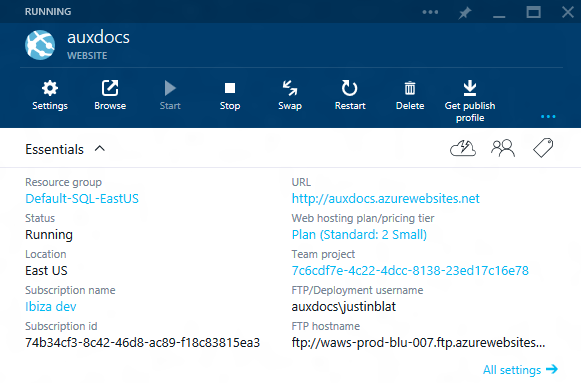

The essentials panel shows basic properties for the current resource. It also shows common platform capabilities such as:

- Resource group
- Settings
- Quickstart
- Users & Roles
- Tags
- Keys

Providing this information and access to core functionality greatly improves the consistency of the platform.

<a name="resource-management-essentials-panel-adding-an-essentials-panel"></a>
### Adding an essentials panel

The Essentials panel is to be used only on resource blades - the initial blade launched from browse for your resource. Define the `<ResourceSummary>` in PDL for the given blade:

`\SamplesExtension\Extension\Client\ResourceTypes\Engine\Engine.pdl`

```xml
<Blade Name="EngineBlade">
    <Blade.Parameters>
        <Parameter Name="id" Type="Key" />
    </Blade.Parameters>
    <ResourceSummary Name="EngineBladeResourceSummary"
                     ViewModel="EngineResourceSummaryViewModel"
                     ResourceIdSource="{BladeParameter Name=id}"
                     ItemCount="4" />
    ...
</Blade>
```

The `ResourceIdSource` property expects to be given a resource uri used to interact with Azure Resource Manager.  The view model named with the `ViewModel` property should inherit `MsPortalFx.ViewModels.Parts.ResourceSummary.ViewModel2`.  This view model follows the typical part view model pattern and enables setting up of the properties and common services.

The `ItemCount` property represents the maximum number of properties the panel can contain; if its value is too small, the Essentials panel may appear vertically clipped.

**NOTE:** The view model base class `MsPortalFx.ViewModels.Parts.ResourceSummary.ViewModel2` replaces the *non-responsive, deprecated* `MsPortalFx.ViewModels.Parts.ResourceSummary.ViewModel` class.  Do not use the old `ViewModel` class, as support for it will be removed from the framework in the future.

All of the view model code below can be found in this sample:

`\SamplesExtension\Extension\Client\ResourceTypes\Engine\ViewModels\EngineResourceSummaryViewModel.ts`

<a name="resource-management-essentials-panel-built-in-properties"></a>
### Built-in Properties

To make the Essentials panel appear responsive, *the framework* (that is, the panel itself) populates the properties in the left-hand column.  The framework shows the rendered panel as soon as *essential* left-hand column properties are loaded, allowing the user to interact with the panel early.  Remaining properties load incrementally, showing a "---" loading indicator while they load.

In support of this goal of responsiveness, extensions have limited control over this left-hand column:

- **'Resource group' property** - With the `MsPortalFx.ViewModels.Parts.ResourceSummary.Options.noResourceGroup` option, extensions can opt-out of the 'Resource group' property.  This is useful for tenant-only services.
- **'Status' property** - The `MsPortalFx.ViewModels.Parts.ResourceSummary.Options2.status` option controls the 'Status' property.
  - Supplying `null` for this option will hide the 'Status' property entirely.
  - To show the 'Status' property (preferable), extensions supply both a `value` and an `isLoading` observable, the latter of which controls a loading indicator.  Typically, the `isLoading` observable comes from the `loading` property on the `EntityView` or `QueryView` used to load data for the Essentials panel:

```ts
// Status property
let statusValue = ko.computed(lifetime, () => {
    let status = engineView.item() && engineView.item().status();
    switch (status) {
        case EngineData.EngineStatus.Running:
            return ClientResources.engineStatusRunning;
        case EngineData.EngineStatus.OilLow:
            return ClientResources.engineStatusLowOil;
        case EngineData.EngineStatus.Seized:
            return ClientResources.engineStatusSeized;
    }
    return "unhandled status: {0}".format(status);
});
let engineView = this._engineView;
let statusIsLoading = engineView.loading;  // A loading indicator is shown while the Engine data is loading.

return <MsPortalFx.ViewModels.Parts.ResourceSummary.Options2>{
    getQuickStartSelection: getQuickStartSelection,
    getSettingsSelection: getAllSettingsSelection,
    getKeysSelection: getKeysSelection,
    collapsed: false,
    status: {
        value: statusValue,
        isLoading: statusIsLoading
    },
    staticProperties: properties
};
```

<a name="resource-management-essentials-panel-static-properties"></a>
### Static Properties

*The extension* populates properties in the right-hand column of the Essentials panel.

The most responsive user experience can be attained for those properties that the extension knows *statically*.  That is, the names, visibility and placement of these properties will not vary between instances of the resource.  For such *static* properties, the extension supplies these via the `MsPortalFx.ViewModels.Parts.ResourceSummary.Options2.staticProperties` option.  Notice that such properties are constructed with an `isLoading` observable which controls the "---" loading indicator for the property.  Typically, this will be the `loading` property of an `EntityView` or `QueryView` with which the extension loads its Essentials data:

```ts
let engineView = this._engineView;
let properties: MsPortalFx.ViewModels.Parts.Properties.Property[] = [];

// Open blade property
properties.push(new MsPortalFx.ViewModels.Parts.Properties.OpenBladeProperty({
    label: ClientResources.engineNamePropertyLabel,
    displayValue: ko.computed(lifetime, () => {
        return engineView.item() && engineView.item().name();
    }),
    bladeSelection: this._bladeSelection,
    isLoading: engineView.loading  // A loading indicator is shown while the Engine data is loading.
}));

// Text property
properties.push(new MsPortalFx.ViewModels.Parts.Properties.TextProperty({
    label: ClientResources.engineModelPropertyLabel,
    value: ko.computed(lifetime, () => {
        return engineView.item() && engineView.item().model();
    }),
    isLoading: engineView.loading  // A loading indicator is shown while the Engine data is loading.
}));

// Link property
properties.push(new MsPortalFx.ViewModels.Parts.Properties.LinkProperty({
    label: ClientResources.sponsorLinkPropertyLabel,
    value: ko.observable(ClientResources.microsoftUri),
    displayValue: ko.observable(ClientResources.microsoft),
    isLoading: ko.observable(false)  // The displayed value is a static string (not loaded asynchronously).
}));

return <MsPortalFx.ViewModels.Parts.ResourceSummary.Options2>{
    getQuickStartSelection: getQuickStartSelection,
    getSettingsSelection: getAllSettingsSelection,
    getKeysSelection: getKeysSelection,
    collapsed: false,
    status: ...,
    staticProperties: properties
};
```

Static properties are displayed at the top of the right-hand column of the Essentials panel.

<a name="resource-management-essentials-panel-dynamic-properties"></a>
### Dynamic Properties

In some cases, the extension only knows to add additional properties once it has examined the loaded resource data.  Once the data has loaded, the extension adds these properties to the Essentials panel using the `MsPortalFx.ViewModels.Parts.ResourceSummary.ViewModel2.setDynamicProperties` method:

```ts
public onInputsSet(inputs: Def.InputsContract, settings: Def.SettingsContract): MsPortalFx.Base.Promise {

    return super.onInputsSet(inputs, settings).then(() => {
        return this._engineView.fetch(inputs.resourceId).then(() => {

            // Show some dynamic, purely data-driven properties based on the loaded Engine.
            let engine = this._engineView.item();
            this._updateDynamicProperties(engine);
        });
    });
}

private _updateDynamicProperties(engine: SamplesExtension.DataModels.Engine): void {
    // Create properties based on some aspect of the loaded Engine.
    let useLinkProperty = engine.displacement().indexOf("600") >= 0;
    let dynamicProperty: MsPortalFx.ViewModels.Parts.Properties.Property;
    if (useLinkProperty) {
        dynamicProperty = new MsPortalFx.ViewModels.Parts.Properties.LinkProperty({
            label: ClientResources.engineDisplacementPropertyLabel,
            value: ko.observable(ClientResources.microsoftUri),
            displayValue: engine.displacement
        });
    } else {
        dynamicProperty = new MsPortalFx.ViewModels.Parts.Properties.TextProperty({
            label: ClientResources.engineDisplacementPropertyLabel,
            value: engine.displacement
        });
    }

    this.setDynamicProperties([ dynamicProperty ]);
}
```

Dynamic properties are displayed at the bottom of the right-hand column of the Essentials panel.

**NOTE:** Dynamic properties are added to the *already-rendered* Essentials panel, which can be a jarring experience for the user.  Static properties should be used wherever possible.  Static properties are less jarring, as they will be rendered with "---" loading indicators while their values load.

<a name="resource-management-essentials-panel-advanced-customizing-the-layout-of-properties"></a>
### (Advanced) Customizing the layout of properties

In certain advanced scenarios, the extension may need to customize the layout of properties beyond just defining the right-hand column properties.  This is not recommended for most scenarios, as per-extension customization can easily violate the guidelines described [here](#portalfx-ux-essentials), either today or if the guidelines are revised in the future.  For those scenarios where it is necessary to customize beyond the defaults, this can be done using the `MsPortalFx.ViewModels.Parts.ResourceSummary.Options2.layout` option.  Here, the extension can control which properties are shown as well as property ordering/placement in the left- and right-hand columns.  Consult the relevant doc comments in MsPortalFx.d.ts for details.

 <h1 name="portalfx-ux-essentials"></h1>
 <properties title="Essentials" pageTitle="Essentials" description="" authors="mattshel" />

<a name="resource-management-essentials-panel-essentials"></a>
### Essentials

Essentials are a high-level snapshot of a resource. The Essentials pane contains the most important resource properties, along with links to other locations in the portal. The content in the Essentials pane is divided into two columns: the left column shows 5 properties similar to the Browse view, while the right column shows 5 properties specific to the resource. Extensions decide what properties to show in the right column, and whether they're static or dynamic.

![essentials part image][essentials]


Properties **can** contain links, and can open blades containing related resources (for example, resource group, subscription, hosting plan, etc). The links can also point to external sites. Properties **can't** open blades that collect information.

Everything that appears in the Essentials pane should also be accessible in <strong>Settings</strong>.

<a name="resource-management-essentials-panel-essentials-ordering-guidelines"></a>
#### Ordering guidelines

**Left column**

1. Resource group
1. Status
1. Location
1. Subscription name (as a link to a child blade)
1. Subscription ID

**Right column**

Up to 5 key domain-specific properties in the following order (<span style="color:#ff0000;font-size:large;">*</span><span style="color:#ff0000;"> = required</span>):</p>
 
* URL [link to site in a new tab] <span style="color:#ff0000;font-size:large;"><strong>*</strong></span>
* Web hosting plan [link to hosting plan blade] <span style="color:#ff0000;font-size:large;"><strong>*</strong></span>
 
Choose from the following options to complete the list:


- If no continuous deployment, no linked database, no IP SSL then add:

	- FTP/Deployment username [text]
	- FTP hostname [text]
	- FTPS hostname [text]

- If no continuous deployment but with 1+ linked database(s), then add:

	- Linked database [link to blade]
	- FTP/Deployment username [text]
	- FTP hostname [text]

- If no continuous deployment but with 1+ IP SSL binding(s), then add:

	- Virtual IP address
	- FTP/Deployment username [text]
	- FTP hostname [text]

- If using a local Git continuous deployment, then add:

	- 	Git/Deployment username [text]
	- 	Git clone URL [text]
	- 	FTP hostname [text]

- If using team project continuous deployment, then add:

	- Team project [link to team project blade]
	- FTP/Deployment username [text]
	- FTP hostname

- If using 3rd party continuous deployment, then add:

	- Git clone URL (or Hg equivalent) [text]
	- Git/Deployment username [text]
	- Project URL (or the folder if using Dropbox) [link to project in a new tab]


[essentials]: ../media/portalfx-ux-essentials/Essentials.PNG

	

<a name="resource-management-essentials-panel-settings"></a>
### Settings

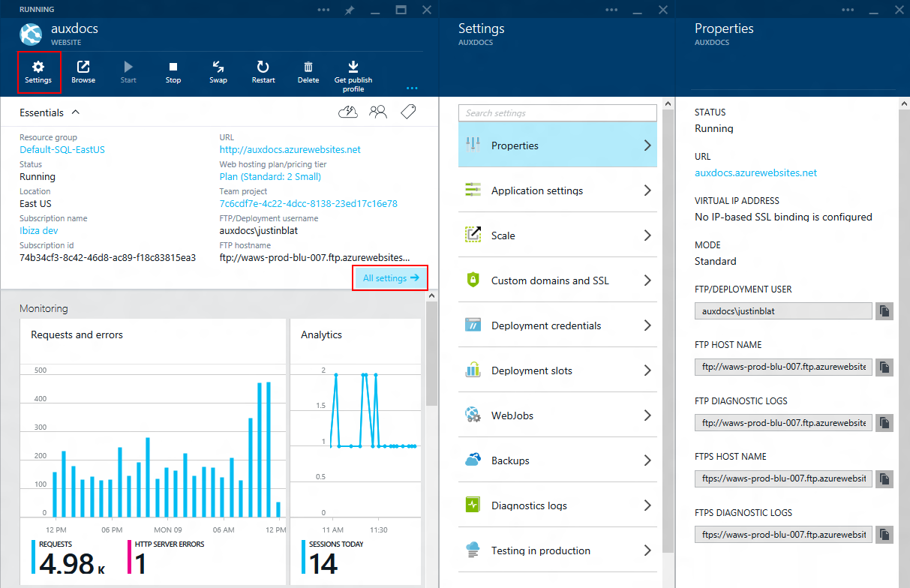

Settings in the portal should be discoverable in a consistent fashion. Each resource blade should expose a link to a `<azurefx:SettingListBlade>` blade via the first command, and via the all settings link in the essentials panel:

```ts
var getAllSettingsSelection: MsPortalFx.ViewModels.Parts.ResourceSummary.GetDynamicBladeSelection = (inputs: Def.InputsContract) => {
    return <MsPortalFx.ViewModels.DynamicBladeSelection> {
        detailBlade: ExtensionDefinition.BladeNames.engineAllSettingsBlade,
        detailBladeInputs: {
            id: inputs.resourceId
        }
    }
};
```

For convenience, the `Settings` blade automatically opens whenever a corresponding resource blade is opened.

<a name="resource-management-essentials-panel-quick-start"></a>
### Quick start

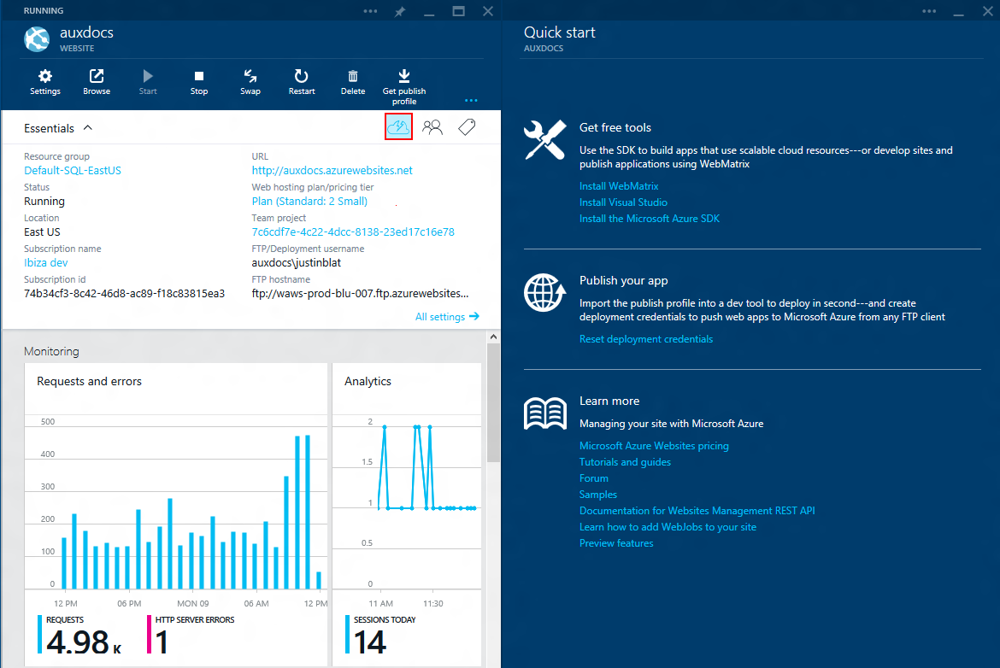

The quick start provides a common design for helping users get started with your resources. The quick start blade must be built for each extension, using the `<azurefx:QuickStartBlade>`

```ts
var getQuickStartSelection: MsPortalFx.ViewModels.Parts.ResourceSummary.GetDynamicBladeSelection = (inputs: Def.InputsContract) => {
    return <MsPortalFx.ViewModels.DynamicBladeSelection> {
        detailBlade: ExtensionDefinition.BladeNames.engineQuickStartBlade,
        detailBladeInputs: {
            id: inputs.resourceId
        }
    }
};
```

<a name="resource-management-essentials-panel-users-roles"></a>
### Users &amp; Roles

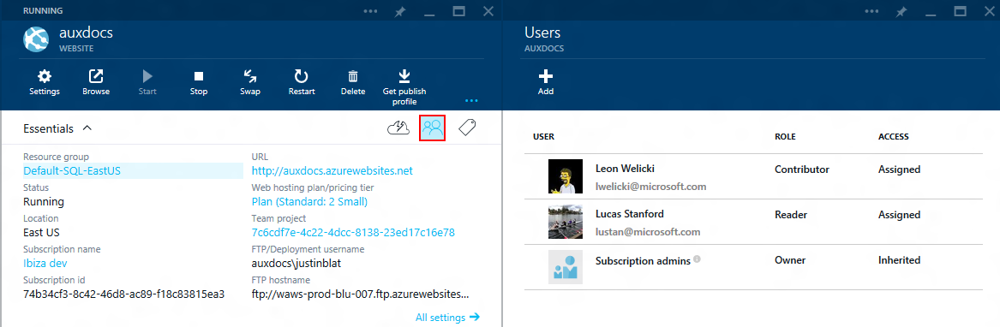

Resources support simple role based access via Azure Active Directory. Most resources support simple users & roles out of the box.

<a name="resource-management-essentials-panel-tags"></a>
### Tags

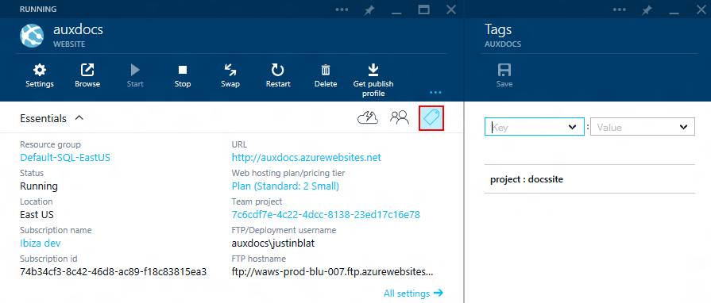

Tags provide a simple way for developers to organize their resources with lightweight key/value pairs. Most resources support tags out of the box.


 <h1 name="portalfx-resourcemenu"></h1>
 ## Resource menu

The resource menu provides a browse/manage experience for an Azure resource. It
does this by providing an app-like container for a resource, with a navigation
menu on the left. This navigation menu allows for access to all functionality
of the resource categorized into relevant groups.

<a name="resource-management-essentials-panel-adoption"></a>
### Adoption

To adopt the resource menu extensions need to upgrade to SDK version
[5.0.302.374](../generated/downloads.md) or newer.

* For migration from settings blade to the resource menu see
[Resource Menu Adoption][resourcemenuadoption]
* For a full list of the APIs used throughout see
[Resource Menu APIs][resourcemenuapis]
* See the [frequently asked questions][resourcemenufaq]
* For first time use see the rest of this document

<a name="resource-management-essentials-panel-responding-to-user-feedback"></a>
### Responding to user feedback

As a product the main source of negative user feedback comes from horizontal
scrolling and UI movement. This is something we are trying to address across the
portal one way of doing that is removing blades from the user's journey. The
average journey depth is 3/4 blades and the average flow is Browse, Resource
blade, Settings and then some blade from settings. In most cases this will
result in the 4th blade being off screen and then scrolled into view.

<a name="resource-management-essentials-panel-how-is-this-different-from-the-settings-blade"></a>
### How is this different from the settings blade?

Previously every extension had to create a settings blade for every resource
they owned, that was an extra overhead, now the resource menu is a blade which
is loaded from the HubsExtension and calls into the AssetViewModel associated to
the AssetType to determine what menu items to show and what blades those items
open. Every extension and resource can leverage this blade without worrying
about getting UX consistency and avoid having to implementing the same blade
multiple times. The biggest change to the API is how dynamic items are handled.
Instead of having an observable array, the API is now a function that returns a
promise for the list of items. The main motivator for this change was to counter
usability issues with the list becoming jumpy and moving underneath the user
unpredictably. Although it is still possible to handle all the dynamic cases
that exist today by disabling the item and observably updating if the item is
enabled/disabled once the blade/inputs have been determined or delay creating
the menu object until all the dynamic items have been determined.

<a name="resource-management-essentials-panel-how-is-this-different-from-the-settings-blade-the-api-is-slightly-different-in-two-cases"></a>
#### The API is slightly different in two cases

 1. Grouping was defined by aligning every item within the same group to use the
 same group id where as now we have promoted the grouping concept, further
 details about that below.
 2. Defining what blade to open was a dynamic blade selection whereas now it is
 a function supplyBladeReference().

<a name="resource-management-essentials-panel-how-is-this-different-from-the-settings-blade-what-is-required-to-enable-the-resource-menu"></a>
#### What is required to enable the resource menu?

The resource menu requires:

* Opting in via the PDL AssetType
* Providing an AssetViewModel on the AssetType
* A 'getMenuConfig' method on the AssetViewModel
* Add menu items to the menu
* Verify that UX is responsive when maximized and restored

<a name="resource-management-essentials-panel-how-is-this-different-from-the-settings-blade-opting-in-via-the-pdl-assettype"></a>
#### Opting in via the PDL AssetType

Just provide 'UseResourceMenu="true"' as a property on the AssetType PDL tag as
shown below. At some point in the future this will become the default experience
and will require an opt out if the behaviour is undesired.

```xml
<AssetType Name="MyResource"
           ...
           UseResourceMenu="true">
```

For this flag to take effect, your asset type should map to an ARM resource. You
can associate your ARM resource to your asset type by specifying the following
tags within your <AssetType> tag.

```xml
<Browse Type="ResourceType" />
<ResourceType
    ResourceTypeName="<<your-resource-type-name>>"
    ApiVersion="api-version-you-want-to-use" />
```

As an example, for Resource Groups, currently, the resource type tag is similar to below.

```xml
<ResourceType
    ResourceTypeName="Microsoft.Resources/subscriptions/resourceGroups"
    ApiVersion="2014-04-01-preview" />
```

<a name="resource-management-essentials-panel-how-is-this-different-from-the-settings-blade-providing-an-assetviewmodel-on-the-assettype"></a>
#### Providing an AssetViewModel on the AssetType

First, if you don't have one already, create a new viewmodel for your
AssetViewModel below is a skeleton for the AssetViewModel. For more information
on assets [see the following](#portalfx-assets)

```ts
/**
 * The MyResource view model.
 */
export class MyResourceViewModel
    implements ExtensionDefinition.ViewModels.MyResourceViewModel.Contract {

    /**
     * Initializes a new instance of the desktop view model class.
     *
     * @param container Object representing the container in the shell.
     * @param initialState Bag of properties saved to user settings via viewState.
     * @param dataContext Long lived data access object passed into all view models in the current area.
     */
    constructor(container: FxContainerContract, initialState: any, dataContext: DataContext) {
    }
}
 ```

Once the AssetViewModel has been added you will need to add a reference to it
from the AssetType in PDL.

```xml
<AssetType Name="MyResource"
           ...
           ViewModel="{ViewModel Name=MyResourceViewModel, Module=./AssetViewModels/MyResourceViewModel}">
```

#### Adding a 'getMenuConfig' method on the AssetViewModel

The method must be called 'getMenuConfig' and must follow the signature below, see [Resource Menu APIs][resourcemenuapis] for a full list of the APIs and interfaces. 

```ts
public getMenuConfig(resourceInfo: MsPortalFx.Assets.ResourceInformation): MsPortalFx.Base.PromiseV<MsPortalFx.Assets.ResourceMenuConfig> {
    return Q({});
}
```

The following object is populated and passed in, if you would like to see more properties added here feel free to reach out to [ibiza Menu Blade](mailto:ibiza-menu-blade@microsoft.com).

```ts
/**
 * The resource information for the resource menu.
 */
interface ResourceInformation {
    /**
     * The resource ID.
     */
    resourceId: string;
    /**
     * The resource or resource group.
     */
    resource: FxAzure.Subscription | FxHubsAzure.ResourceGroup | FxHubsAzure.Resource;
}

```

#### Add menu items to the menu

Once you have the skeleton of the resource menu working, the next step is to create the menu object to return in your 'getMenuConfig' method.
The menu object follows the following structure, again see [Resource Menu APIs][resourcemenuapis] for the full list of APIs.

```ts
/**
 * The resource menu configuration.
 */
interface ResourceMenuConfig {
    /**
     * The menu item groups.
     */
    groups: FxMenuBlade.MenuGroup[];
    /**
     * The ID of the default menu item.
     */
    defaultItemId: string;
    /**
     * Optional set of resource menu options.
     */
    options?: ResourceMenuOptions;
}
```

| Property        | Description |
|-----------------|-------------|
| `groups`        | Array of groups and menu items within each group that will open a blade |
| `defaultItemId` | ID of the menu item (defined in `groups`) to be selected by default |
| `options`       | Flags to show/hide common menu items |

The following options are available:

| Option                        | Exit criter | Enabled by default | Scenario |
|-------------------------------|-------------|--------------------|----------|
| `enableAlerts`                | No  | No | Create, view, and update alert rules. |
| `enableAppInsights`           | No  | No | View Application Insights monitoring. |
| `enableDiagnostics`           | No  | No | View monitoring diagnostics. |
| `enableExportTemplate`        | Yes | Resources, resource groups | Export a template of the resource group to automate redeployments. RPs must provide [template schemas](http://aka.ms/armschema) for this. Does not support classic resources. |
| `enableLocks`                 | Yes | Resources, resource groups, subscriptions | Lock resources to avoid accidental deletion and/or editing. |
| `enableLogAnalytics`          | No  | No | View OMS workspace. |
| `enableLogSearch`             | No  | No | Search logs. |
| `enableMetrics`               | No  | No | View monitoring metrics. |
| `enableProperties`            | No  | No | Generic properties blade for resources. Only includes standard ARM properties today, but may be integrated with the supplemental data, if needed. (Please file a [partner request](http://aka.ms/portalfx/request).) Does not support non-tracked resources. |
| `enableRbac`                  | Yes | All ARM resource types | Manage user/role assignments for this resource. |
| `enableSupportEventLogs`      | Yes | Resources, resource groups, subscriptions | View all operations and events |
| `enableSupportHelpRequest`    | Yes | All ARM resource types | Create a support request for this resource, resource group, or subscription. |
| `enableSupportResourceHealth` | Yes | No | Check resource for common health issues (e.g. connectivity) and recommend fixes. |
| `enableSupportTroubleshoot`   | No  | No | **Deprecated. Do not use.** Legacy support only. Moved to a new design with improved usability scores. |
| `enableSupportTroubleshootV2` | Yes | No | Troubleshoot possible availability/reliability issues (e.g. connectivity). |
| `enableTags`                  | Yes | Resources, resource groups, subscriptions | Tag resource with key/value pairs to group/organize related resources. RP must support PATCH operations to update tags. Does not support classic resources. |
| `showAppInsightsFirst`        | No  | No | View Application Insights monitoring. `enableAppInsights` must be set to `true`. |

In this case let's assume your resource has an item with the ID 'overview' and has also onboarded support, getting
export template, locks, RBAC, Activity Log, new support request, and tags automatically:

```ts
public getMenuConfig(resourceInfo: MsPortalFx.Assets.ResourceInformation): MsPortalFx.Base.PromiseV<MsPortalFx.Assets.ResourceMenuConfig> {
    return Q(
        <MsPortalFx.Assets.ResourceMenuConfig>{
            defaultItemId: "overview",
            options: {
                enableSupportTroubleshoot: true,
                enableSupportResourceHealth: true
            },
            groups: <FxMenuBlade.MenuGroup[]>[
                ...
            ]
        }
    );
}
```

Now define a group with a single item, the menu's group and item API is as follows.

```ts
/**
 * Defines a group in the menu.
 */
interface MenuGroup extends MenuItemBase {
    /**
     * The menu items in the group.
     */
    items: MenuItem[];
}

/**
 * Defines an item in a group of the menu.
 */
interface MenuItem extends MenuItemBase, FxComposition.Selectable2Options<FxComposition.BladeReference<any>> {
    /**
     * The icon associated to the menu item.
     */
    icon: FxBase.Image;
    /**
     * A value indicating whether or not the item is enabled.
     */
    enabled?: KnockoutObservableBase<boolean>;
}

/**
 * Attributes common to all items and groups in the menu.
 */
interface MenuItemBase {
    /**
     * Gets the ID for the item.
     */
    id: string;
    /**
     * The display text for the item.
     */
    displayText: string;
    /**
     * A space-delimited list of keywords associated to the item.
     */
    keywords?: string | string[];
}
```

Now given that our 'getMenuConfig' will look something like the following.

```ts
import * as ClientResources from "ClientResources";
import * as FxMenuBlade from "MsPortalFx/Composition/MenuBlade";
import * as BladeReferences from "../../../_generated/BladeReferences";

public getMenuConfig(resourceInfo: MsPortalFx.Assets.ResourceInformation): MsPortalFx.Base.PromiseV<MsPortalFx.Assets.ResourceMenuConfig> {
    return Q(
        <MsPortalFx.Assets.ResourceMenuConfig>{
            defaultItemId: "overview",
            options: {
                enableSupportTroubleshoot: true,
                enableSupportResourceHealth: true
            },
            groups: <FxMenuBlade.MenuGroup[]>[
                {
                    id: "overview_group",
                    displayText: ClientResources.ResourceMenuGroup.overview,
                    items: [
                        {
                            id: "overview",
                            displayText: ClientResources.ResourceMenu.overview,
                            enabled: ko.observable(true),
                            keywords: "overview",
                            icon: Images.MyResourceIcon,
                            supplyBladeReference: () => {
                                return new BladeReferences.MyResourceOverviewBlade({ id: resourceInfo.resourceId });
                            }
                        }
                    ]
                }
            ]
        }
    );
}
```

Now you will have a Resource menu which has one group with one item in it which opens the blade 'MyResourceOverviewBlade'.

#### Adding to the resourcemenu title and subtitle

The resource menu by default (for the overview) will show the name of the
resource as the title of the blade, and the resource type as the subtitle. When
any menu item is selected, the title gets updated to

"`<<resource name>> - <<selected menu item>>`"

Extension authors can add to the title and subtitle through the blade opened in
the content area. They can do this by implementing the `HostedInMenuBlade`
interface as follows.

```ts
export class MyResourceBlade
    extends MsPortalFx.ViewModels.Blade
    implements MsPortalFx.ViewModels.HostedInMenuBlade {

    public menuContent = {
        title: ko.observable<string>(),
        subtitle: ko.observable<string>(),
    };

    public onInputsSet(inputs: any): MsPortalFx.Base.Promise {
        return someAsyncCall().then(data => {
            this.menuContent.title(data.title);
            this.menuContent.subtitle(data.subtitle);
        });
    }
}
```


#### Verify that UX is responsive when maximized and restored

Since the resource menu acts as a container for the blades opened by the menu items, the display state is preserved when you switch between menu items. So, you should verify that blades render acceptable UX when the resource menu is maximized and when the resource menu is restored to the specified widths.

Next Steps:

* There are samples of resources using this in the Samples Extension see the Client\ResourceTypes\Desktop\ folder, particularly the AssetViewModels\DesktopViewModel.ts
* See [Resource Menu APIs][resourcemenuapis]
 <h1 name="portalfx-resourcemenu-api"></h1>
 <properties title="" pageTitle="Resource menu apis" description="" authors="sewatson" />


### Resource menu APIs

```ts
import * as FxMenuBlade from "Fx/Composition/MenuBlade";
 
declare module MsPortalFx.Assets {
    /**
     * The resource information for the resource menu.
     */
    interface ResourceInformation {
        /**
         * The resource ID.
         */
        resourceId: string;
        /**
         * The resource or resource group.
         */
        resource: FxSubscription | FxHubsAzure.ResourceGroup | FxHubsAzure.Resource;
        /**
         * The resource's subscription information (only valid for non-tenant resources).
         */
        subscription?: FxSubscription;
    }

    /**
     * The options of the resource menu config.
     */
    interface ResourceMenuOptions {
        /**
         * Enables the settings for roles and users.
         */
        enableRbac?: boolean;
        /**
         * Enables the settings for help request support.
         */
        enableSupportHelpRequest?: boolean;
        /**
         * Enables the settings for troubleshoot support.
         */
        enableSupportTroubleshoot?: boolean;
        /**
         * Enables the settings for troubleshootv2 support.
         */
        enableSupportTroubleshootV2?: boolean;
        /**
         * Enables the settings for resource health support.
         */
        enableSupportResourceHealth?: boolean;
        /**
         * Enables the settings for the event logs.
         */
        enableSupportEventLogs?: boolean;
        /**
         * Enables the setting for tags.
         */
        enableTags?: boolean;
    }

    /**
     * Defines a group extension in the menu.
     * This is used to extend the built-in groups with additional items.
     *
     * NOTE: The referenceId must be one of the constants for group IDs in this file.
     *       Using a different ID will result in a load rejection.
     */
    interface MenuGroupExtension {
        /**
         * Gets the ID for the built-in group.
         */
        referenceId: string;
        /**
         * The menu items in the group.
         */
        items: MenuItem[];
    }

    /**
     * The menu group instance type (either a menu group or a menu group extension).
     */
    type MenuGroupInstance = MenuGroup | MenuGroupExtension;

    /**
     * The resource menu configuration.
     */
    interface ResourceMenuConfig {
       /**
         * The resource menu item (overview item).
         */
        overview: MenuItem;
        /**
         * The menu item groups.
         */
        groups: MenuGroupInstance[];
        /**
         * The ID of the default menu item.
         * If this is not provided, the overview item will be the default item.
         */
        defaultItemId?: string;
        /**
         * Optional set of resource menu options.
         */
        options?: ResourceMenuOptions;
    }

    /**
     * The contract for the asset type's resource menu config.
     */
    interface ResourceMenuConfigContract {
        /**
         * Gets the resource menu configuration.
         *
         * @param resourceInfo The resource ID and resource|resource group for the menus.
         * @return A promise which will be resolved with the resource menu configuration.
         */
        getMenuConfig(resourceInfo: ResourceInformation): FxBase.PromiseV<ResourceMenuConfig>;
    }
}

```

### Menu APIs

```ts
declare module "Fx/Composition/MenuBlade" {
    /**
     * Attributes common to all items and groups in the menu.
     */
    interface MenuItemBase {
        /**
         * Gets the ID for the item.
         */
        id: string;
        /**
         * The display text for the item.
         */
        displayText: string;
        /**
         * A space-delimited list of keywords associated to the item.
         */
        keywords?: string | string[];
    }

    /**
     * Defines an item in a group of the menu.
     */
    interface MenuItem extends MenuItemBase, FxComposition.Selectable2Options<FxComposition.BladeReference<any>> {
        /**
         * The icon associated to the menu item.
         */
        icon: FxBase.Image;
        /**
         * A value indicating whether or not the item is enabled.
         */
        enabled?: KnockoutObservableBase<boolean>;
    }

    /**
     * Defines a group in the menu.
     */
    interface MenuGroup extends MenuItemBase {
        /**
         * The menu items in the group.
         */
        items: MenuItem[];
    }
}
```

### Selectable 2 APIs

```ts
declare module "Fx/Composition/Selectable" {
    /**
     * Configuration to pass to the selectable constructor
     */
    interface Selectable2Options<TBladeReference> {
        /**
         * This callback is invoked by the portal when a new blade is to be opened
         * in response to a user-invoked navigation.
         *
         * @return A blade reference that describes the blade to open.  This value cannot be null or undefined.
         */
        supplyBladeReference?: () => TBladeReference;
        /**
         * This callback is invoked by the portal when a new blade is to be opened
         * asychronously in response to a user-invoked navigation.
         *
         * @return A promise that returns a blade reference that describes the blade to open.  This value cannot be null or undefined.
         */
        supplyBladeReferenceAsync?: () => Q.Promise<TBladeReference>;
    }
}
```

* See the [frequently asked questions][resourcemenufaq]
 <h1 name="portalfx-resourcemenu-faq"></h1>
 ### What version is required?

You must be on version [5.0.302.374](../generated/downloads.md) at least.

#### What is the resource menu?

The resource menu is the new pattern on what a resource blade should be, it creates a single location for all the resource's functionality.
It reduces horizontal movement by promoting the navigation menu from the settings list, what was the previous pattern, to a new concept of a menu blade.

![resourcemenu-resourcegroup][resourcemenu-resourcegroup-example]

#### Is there any samples I can refer to?

We have numerous samples covering the adoption of the resource menu which can be found in the samples extension. Look for the Desktop assets, or refer to:

```
..\SamplesExtension\Extension\Client\ResourceTypes\Desktop\AssetViewModels\DesktopViewModel.ts
```

#### How do I add items to the Support/Resource Management Group?

You can add items by using a MenuGroupExtension. MenuGroupExtension is a special kind of menu group, you can specify it as a group in the menu config object
See how to do this under the [creating an asset view model section][/documentation/articles/portalfx-resourcemenu-adoption#creating-an-assetviewmodel-if-you-havent-already-and-adding-a-method-to-your-assetviewmodel]

#### Do any other resources use this yet?

Yes! - IaaS, AppServices, Resource Groups, AppInsights and many others.
You can see this in the RC environment.

#### How much work is it to adopt this?

We have tried to keep the amount of churn to a minimum, you don't have to create a new blade we have a framework blade which adapts given a resource id.
All that is required is opting in and setting your menu items.
The Menu API is very similar to the settings list API which you are likely already using today.
We found porting the resource group over took less than a day's worth of work, the resource group only has 12 items in the menu so this will vary depending on the number of items you need to port.

#### I've adopted it but it's not showing up?

The resource menu is currently hidden behind a global feature flag, this will be turned on publically once we have majority adoption.
For testing purposes please use the following feature flag in your URL, this works in all environments.

```
?feature.resourcemenu=true
```

#### Will this be tracked in the weekly status email?

Yes, this is going to be tracked in the weekly status email.

#### I've noticed a bug how can I report it?

You can file a bug directly on Sean Watson using the link below, it will be triaged asap.
[Resource menu bug](http://aka.ms/portalfx/resourcemenubug)
Or if you don't have access to that template, email [ibiza Menu Blade](mailto:ibiza-menu-blade@microsoft.com) 


[resourcemenu-resourcegroup-example]: ../media/portalfx-resourcemenu/resourcemenu-resourcegroup.gif

* [Migrate any of your current resources to use the resource menu][resourcemenuadoption]
 <h1 name="portalfx-resourcemenu-adoption"></h1>
 # Resource menu adoption

The resource menu is the navigation menu for all your resource's functionality. Since visually it's not a separate blade it ties the navigation menu and the content
directly together giving the user the sense of being in a single 'app' like container. See [Resource menu](#portalfx-resourcemenu) for a overview of what
the resource menu is and why its worth doing.

## Migrating from a settings blade to a resource menu blade

Adopting the resource menu requires a few steps:

1. You must be on version [5.0.302.374](../generated/downloads.md) at least
1. Opting in your asset to use the resource menu
1. Creating an AssetViewModel, if you haven't already, and adding a method to your AssetViewModel
1. Porting the current settings into the new method
1. Feature flag any old behaviour


### Opting in your asset to use the resource menu

You need to add the 'UseResourceMenu' property and specify a viewmodel on your AssetType PDL tag.

``` xml
<AssetType Name="MyResource"
           ViewModel="{ViewModel Name=MyResourceViewModel, Module=./AssetViewModels/MyResourceViewModel}"
           ...
           UseResourceMenu="true">
```

### Creating an AssetViewModel, if you haven't already, and adding a method to your AssetViewModel

Now create your viewmodel and then add a 'getMenuConfig' method. This method is where all the logic for determining which items to add to the menu given any dynamic dependencies.
Below is a simple menu with three items and two groups; specifying an overview item, a custom group with an item, and adding an item to a framework group. See [Resource Menu APIs][resourcemenuapis] for a full list of the APIs.

``` ts
import BladeReferences = require("../../_generated/BladeReferences");
import * as FxMenuBlade from "MsPortalFx/Composition/MenuBlade";
import * as ClientResources from "ClientResources";

import FxAssets = MsPortalFx.Assets;

const MenuGroupStrings = ClientResources.ResourceMenuGroup;
const MenuStrings = ClientResources.ResourceMenu;

/**
 * The MyResource view model.
 */
export class MyResourceViewModel
    implements ExtensionDefinition.ViewModels.MyResourceViewModel.Contract {

    /**
     * Initializes a new instance of the desktop view model class.
     *
     * @param container Object representing the container in the shell.
     * @param initialState Bag of properties saved to user settings via viewState.
     * @param dataContext Long lived data access object passed into all view models in the current area.
     */
    constructor(container: FxContainerContract, initialState: any, dataContext: DataContext) {
    }

    /**
     * Gets the resource menu configuration.
     *
     * @param resourceInfo The resource ID and resource|resource group for the menus.
     * @return A promise which will be resolved with the resource menu configuration.
     */
    public getMenuConfig(resourceInfo: MsPortalFx.Assets.ResourceInformation): MsPortalFx.Base.PromiseV<MsPortalFx.Assets.ResourceMenuConfig> {
        return Q(<MsPortalFx.Assets.ResourceMenuConfig>{
            overview: {
                id: "overview",
                displayText: MenuStrings.overview,
                keywords: ["keyword1","keyword2"],
                icon: MsPortalFx.Base.Images.Polychromatic.MyResourceImage(),
                supplyBladeReference: () => {
                    return new BladeReferences.MyResourceOverviewBladeReference({
                        id: resourceInfo.resourceId
                    });
                }
            },
            options: <MsPortalFx.Assets.ResourceMenuOptions>{
                enableRbac: true,
                enableTags: true,
                enableSupportEventLogs: true,
                enableSupportHelpRequest: true,
                enableSupportResourceHealth: true,
                enableSupportTroubleshoot: true
            },
            groups: <FxMenuBlade.MenuGroup[]>[
                {
                    id: "overview_group",
                    displayText: MenuGroupStrings.overview,
                    items: <FxMenuBlade.MenuItem[]>[
                        {
                            id: "properties",
                            displayText: "Properties",
                            keywords: ["keyword1","keyword2"],
                            icon: MsPortalFx.Base.Images.Polychromatic.MyPropertiesImage(),
                            supplyBladeReference: () => {
                                return new BladeReferences.MyResourcePropertiesBladeReference({
                                    resourceGroup: resourceInfo.resourceId
                                });
                            },
                            enabled: ko.observable(true)
                        }
                    ]
                },
                {
                    // There are a number of predefined framework groups items can be added to them using the following pattern
                    referenceId: FxAssets.SupportGroupId,
                    items: <FxMenuBlade.MenuItem[]>[
                        {
                            id: "alerts",
                            displayText: "Alerts",
                            keywords: ["keyword1","keyword2"],
                            icon: MsPortalFx.Base.Images.Polychromatic.Notification(),
                            supplyBladeReference: () => {
                                return new MsPortalFx.Composition.PdlBladeReference<any>(
                                    "AlertsListBlade",
                                    {
                                        targetResourceIds: [resourceInfo.resourceId],
                                        options: { enableEvents: false }
                                    },
                                    null,
                                    null,
                                    InsightsExtensionName
                                );
                            }
                        }
                    ]
                }
            ]
        });
    }
}
 ```


<a name="resource-management-essentials-panel-porting-the-current-settings-into-the-new-method"></a>
### Porting the current settings into the new method

 You can see that the API follows the settings item API very closely minus the groups and the blade references. Referencing blades within your own extension can be done via
 the first two options, if you are opening a blade outside of your extension you can use the third method.

<a name="resource-management-essentials-panel-feature-flag-any-old-behaviour"></a>
### Feature flag any old behaviour

Once you have adopted the Resource menu you will notice throughout your experience there are a few cases which the old behaviour is no longer suitable. If that is the
case please use the following to switch on.

``` ts
MsPortalFx.isFeatureEnabled("resourcemenu")
```

One such case is the Resource summary part on the resource blade. Please add the following to the getSettingsSelection option:

``` ts
getSettingsSelection: MsPortalFx.isFeatureEnabled("resourcemenu") ? null : SettingsSelection;
```

Next Steps:

* Adopt the resource menu for all your resources
* See the [frequently asked questions][resourcemenufaq]
* There are samples of resources using this in the Samples Extension see the Client\ResourceTypes\Desktop\ folder, particularly the AssetViewModels\DesktopViewModel.ts
* If there are any issues please reach out to [ibiza Menu Blade](mailto:ibiza-menu-blade@microsoft.com) 

[resourcemenuapis]: /documentation/articles/portalfx-resourcemenu-api
[resourcemenufaq]: /documentation/articles/portalfx-resourcemenu-faq

* If there are any issues please reach out to [ibiza Menu Blade](mailto:ibiza-menu-blade@microsoft.com) 


 <h1 name="portalfx-permissions"></h1>
 <properties title="" pageTitle="Defining permissions" description="" authors="flanakin" />

<a name="resource-management-defining-permissions-and-checking-access"></a>
## Defining permissions and checking access

<a name="resource-management-defining-permissions-and-checking-access-role-based-access-control-rbac-in-azure"></a>
### Role-based access control (RBAC) in Azure

Azure supports 3 built-in roles today, powered by Azure Active Directory (AAD): Owner, Contributor, and Reader. Owners have full control, Contributors can do everything except manage access, and Readers have full, read-only access. These roles can be assigned at a subscription, resource group, or resource level. Access is hierarchical and additive - you can grant more permissions, but cannot revoke permissions granted at a higher level. For instance, a subscription reader can be granted contributor access to a resource group and Owner access for a resource, but a subscription owner cannot be restricted to reader or contributor access on a resource or resource group.

> [WACOM.NOTE] The legacy service admin and co-admin roles are treated as owners in the new, role-based access control (RBAC) model. The account admin role does not yet have an equivalent.

In addition to the built-in roles, AAD will soon introduce new roles to manage groups of resources. For instance, a Web Contributor will have the ability to manage all aspects of the Azure Websites service, including websites and web hosting plans. Similar roles will be included for other services. Longer term, we'll also enable customers to define custom roles, which will define specific actions customers are allowed to perform at a specific scope.

Actions are specific operations, like create a website or backup a database. Instead of checking for roles, your UI needs to check for the specific actions required by that UI element, whether it be a blade, part, command, form, or individual control. This will be especially critical when custom roles are available.

For more information, read the full [RBAC documentation](http://aka.ms/azurerbac).


<a name="principles"></a>
<a name="resource-management-defining-permissions-and-checking-access-core-principles"></a>
### Core principles

<a name="resource-management-defining-permissions-and-checking-access-core-principles-fail-open"></a>
#### Fail open
In general, every element should be prepared to "fail open" in case of network failures when checking access. It's better to allow the user to try to perform an action and allow the back-end to reject it if the user doesn't have access than to deny access for a user who does have access. All built-in APIs will fail open, including `hasPermission()`.

<a name="resource-management-defining-permissions-and-checking-access-core-principles-readers-should-be-able-to-read-_everything_-except-secrets"></a>
#### Readers should be able to read <em>everything</em> except secrets
Be granular when defining permissions. If any bit of data can be obtained via an HTTP GET call, don't require write access to access that information. When data is only exposed in a form, disable form controls to ensure readers cannot submit changes, but don't block access to _viewing_ the form.


<a name="summary"></a>
<a name="resource-management-defining-permissions-and-checking-access-core-principles-at-a-glance"></a>
#### At a glance

Before you begin, here's a quick look at the steps you can expect to complete:

1. [Identify the required actions for each UI element](#actions)

    Before you can annotate required access, you need to know what HTTP requests are required and optional to initialize and use each element. For parts, also consider the requests the related blade requires. Once you have a list of HTTP methods and endpoints, you can translate each into a scope and an action.

    The scope is always a subscription, resource group, or resource id. Actions are composed of the resource type (e.g. Microsoft.SQL/servers/databases for a SQL database), an operation (e.g. backup), and one of the following strings based on the HTTP method: read (GET/HEAD), write (PUT/PATCH), action (POST), delete (DELETE) (e.g. Microsoft.SQL/servers/databases/backup/action).

2. [Create an alias for required permissions](#references)

    To simplify development and avoid typos, we recommend defining permissions within your asset type definition in PDL and referencing them in PDL and TypeScript for compiler-checked references to avoid errors.

    ```xml
    <AssetType Name="Robot">
      <AssetType.Permissions>
        <PermissionDefinition Name="read"         Action="Microsoft.Robotics/robots/read" />
        <PermissionDefinition Name="restart"      Action="Microsoft.Robotics/robots/restart/action" />
        <PermissionDefinition Name="readChildren" Action="Microsoft.Robotics/robots/children/read" />
      </AssetType.Permissions>
    </AssetType>
    ```

    If the resource type is dynamic and the required permission is standard across all supported resource types (e.g. read, write), you can use relative permissions by replacing the resource type with "." or "{resourceType}". For instance, if checking read access on a website, you can check for "./read", which will be evaluated as "Microsoft.Web/sites/read". For a website deployment slot, this would be evaluated as "Microsoft.Web/sites/slots/read".

3. [Annotate required permissions in PDL](#pdl)

    Every blade and part that represents an asset should already have an asset type/id associated with it. In these cases, use a simple permission reference for required permissions.

    ```xml
    <Blade AssetType="Robot" AssetIdProperty="id">
      <Blade.Permissions>
        <PermissionReference Permission="read" />
        <PermissionReference Permission="readChildren" />
      </Blade.Permissions>
    </Blade>
    ```

    If the element isn't associated with an asset or is associated with multiple assets, specify the asset type and id property within the reference.

    ```xml
    <Part>
      <Part.Permissions>
        <PermissionReference AssetType="Robot" AssetId="id" Permission="read" />
        <PermissionReference AssetType="Robot" AssetId="id" Permission="readChildren" />
      </Part.Permissions>
    </Part>
    ```

4. [Check access manually for remaining scenarios](#ts)

    For finer-grained checks and more advanced scenarios, use the `hasPermission()` function in conjunction with `container.unauthorized()` to react to limited access.

    ```ts
    MsPortalFx.Extension.hasPermission(resourceUri, [ExtensionDefinition.AssetTypes.Robot.Permissions.read])
        .then((hasAccess) => {
            if (!hasAccess) { container.unauthorized(); return; }
            /* do awesome stuff */
        });
    ```


<a name="actions"></a>
<a name="resource-management-defining-permissions-and-checking-access-core-principles-determining-the-action"></a>
#### Determining the action

Actions are implicitly defined by the ARM resource provider (RP) API. For instance, the action for deleting a website is "Microsoft.Web/sites/delete". Use the following steps to determine the appropriate action for your API call:

1.  Start with the API call you need to make (including the HTTP verb)

    GET /subscriptions/id/resourceGroups/name/providers/Microsoft.SQL/servers/name/databases/name/usages

2.  Append the HTTP verb to the end

    ~~**GET**~~ /subscriptions/id/resourceGroups/name/providers/Microsoft.SQL/servers/name/databases/name/usages/**GET**

3.  Replace the HTTP verb with the respective permission

    | HTTP verb | Permission |
    | --------- | ---------- |
    | GET/HEAD  | read       |
    | PUT/PATCH | write      |
    | POST      | action     |
    | DELETE    | delete     |

    /subscriptions/id/resourceGroups/name/providers/Microsoft.SQL/servers/name/databases/name/usages/**read**

4.  Remove everything before the last RP namespace

    /~~**subscriptions/id/resourceGroups/name/providers**~~/Microsoft.SQL/servers/name/databases/name/usages/read

5.  Remove the instance names

    Microsoft.SQL/servers/~~**name**~~/databases/~~**name**~~/usages/read

6.  Now you have the action to check for:

    Microsoft.SQL/servers/databases/usages/read

If the resource type is dynamic and the required permission is standard across all supported resource types (e.g. read, write), you can use relative permissions by replacing the resource type with "." or "{resourceType}". For instance, if checking read access on a website, you can check for "./read", which will be evaluated as "Microsoft.Web/sites/read". For a website deployment slot, this would be evaluated as "Microsoft.Web/sites/slots/read".

<a name="resource-management-defining-permissions-and-checking-access-convert-your-api-call-to-an-action"></a>
### Convert your API call to an action
Use the following form to convert an API call (e.g. ``GET /subscriptions/###``) to an action (e.g. ``microsoft.resources/subscriptions/read``).

<select id="_verb" style="width:100px">
    <option value="read">GET/HEAD</option>
    <option value="write">PUT/PATCH</option>
    <option value="action">POST</option>
    <option value="delete">DELETE</option>
</select> <input id="_api" style="width:500px" />
<button style="width:100px" onclick="var slash = '/'; var msres = 'microsoft.resources'; var api = document.getElementById('_api').value.replace('https:'+slash+slash, '').replace('management.azure.com', '').replace('dogfood-resources.windows.net', ''); var prov = api.lastIndexOf(slash+'providers'+slash); if (prov >= 0) { api = api.substring(prov+11); } else { api = msres+slash+api; } if (api[0] == slash) { api = api.substring(1); } api = api.split(slash); for (var i=2; i<api.length; i+=2) { api[i] = ''; } api.push(document.getElementById('_verb').value); document.getElementById('_action').value = api.join(slash).replace(/\/+/g, slash)">Get action</button> <input id="_action" style="width:500px" />


<a name="pdl"></a>
<a name="resource-management-defining-permissions-and-checking-access-convert-your-api-call-to-an-action-required-permissions-for-blades-parts-and-commands"></a>
#### Required permissions for blades, parts, and commands

Start by defining the required permissions for your blades, parts, and commands. A permission consists of an action and a scope. As covered above, actions are defined by the ARM RP API. The scope is the asset the action pertains to.

> [WACOM.NOTE] The portal uses assets instead of resources because not all entities within the portal are ARM resources. In the future, the permissions API may be expanded to support external entities.

```xml
<Part>
  <Part.Permissions>
    <Permission
        Action="Arm.Namespace/resourceType/action"
        AssetType="{AssetTypeReference Robot, Extension=Company_Suite_Component}"
        AssetId="id"/>
  </Part.Permissions>
</Part>
```

Each `Permission` supports the following properties:

| Property  | Type                         | Description |
| --------- | ---------------------------- | ----------- |
| Action    | string                       | Action the user needs access to in order to use the UI element. |
| AssetType | string / AssetTypeReference  | Optional. Asset type and extension, if external, that the user needs to have access to. Required, if not specified on the UI element. |
| AssetId   | string                       | Optional. Name of the part property that has the id for the specified AssetType. Required, if the AssetType is specified. |

If the asset type is in the current extension, use the asset type name instead of the asset type reference.

```xml
<Part>
  <Part.Permissions>
    <Permission
        Action="Arm.Namespace/resourceType/action"
        AssetType="Robot"
        AssetId="{BladeProperty id}"/>
  </Part.Permissions>
</Part>
```

If the blade/part/command is already associated with an asset type, each permission will default to that asset.

```xml
<Part AssetType="Object" AssetIdProperty="id">
  <Part.Permissions>
    <Permission Action="Arm.Namespace/resourceType/action" />
  </Part.Permissions>
</Part>
```

> [WACOM.NOTE] Do not define permissions on parts used in locked blades. Instead, render an empty part if the user doesn't have access to anything in it. This will ensure the UI doesn't render an odd "no access" message when the user simply should not see the part at all.


> [WACOM.NOTE] Adapter parts and part references do not support defining permissions. The extension that controls what data will be used should define and check access. Extensions that use an `ExtenderViewModel` will need to expose a way to allow consumers to either check access or define the actions/scopes that need to be checked.


<a name="references"></a>
<a name="resource-management-defining-permissions-and-checking-access-convert-your-api-call-to-an-action-permission-references"></a>
#### Permission references

If your asset has commonly-used actions, create an alphanumeric alias and use a reference instead of a full permission. Permission references use predefined, compiler-checked aliases instead of action ids.

```xml
<AssetType Name="Robot">
  <AssetType.Permissions>
    <PermissionDefinition Name="alias" Action="Arm.Namespace/resourceType/action" />
  </AssetType.Permissions>
</AssetType>

<Part AssetType="Object" AssetIdProperty="id">
  <Part.Permissions>
    <PermissionReference Permission="alias" />
  </Part.Permissions>
</Part>
```

Each `PermissionDefinition` supports the following properties:

| Property   | Type                         | Description |
| ---------- | ---------------------------- | ----------- |
| Permission | string                       | Name of the PermissionDefinition defined on the related AssetType. |
| AssetType  | string / AssetTypeReference  | Optional. Asset type and extension, if external, that the user needs to have access to. Required, if not specified on the UI element. |
| AssetId    | string                       | Optional. Name of the part property that has the id for the specified AssetType. Required, if the AssetType is specified. |

Aliases are shared with PDE and can be used by dependent extensions:

```xml
<Part AssetType="Object" AssetIdProperty="id">
  <Part.Permissions>
    <Permission
        Asset="{AssetReference HubsExtension.ResourceGroups Id={BladeProperty content.resourceGroup}}"
        Type="read"/>
  </Part.Permissions>
</Part>
```


<a name="bool"></a>
<a name="resource-management-defining-permissions-and-checking-access-convert-your-api-call-to-an-action-boolean-logic"></a>
#### Boolean logic

By default, all of the specified permissions are required, like an AND operation.

```xml
<Part AssetType="Object" AssetIdProperty="id">
  <Part.Permissions>
    <PermissionReference Permission="read" />
    <PermissionReference Permission="readChildren" />
  </Part.Permissions>
</Part>
```

This can also be written with a PermissionSet.

```xml
<Part AssetType="Object" AssetIdProperty="id">
  <Part.Permissions>
    <PermissionSet Require="all">
      <PermissionReference Permission="read" />
      <PermissionReference Permission="readChildren" />
    </PermissionSet>
  </Part.Permissions>
</Part>
```

Alternatively, if any one of the specified permissions is adequate, you can change the requirement to treat it as an OR operation.

```xml
<Part AssetType="Object" AssetIdProperty="id">
  <Part.Permissions>
    <PermissionSet Require="any">
      <PermissionReference Permission="read" />
      <PermissionReference Permission="readChildren" />
    </PermissionSet>
  </Part.Permissions>
</Part>
```

For more advanced scenarios, you can also nest permission sets.

```xml
<Part AssetType="Object" AssetIdProperty="id">
  <Part.Permissions>
    <PermissionSet Require="any">
      <Permission Name="read" />
      <Permission Name="readChildren" />
      <PermissionSet Require="all">
        <Permission Name="write" />
        <Permission Name="writeChildren" />
      </PermissionSet>
    </PermissionSet>
  </Part.Permissions>
</Part>
```


<a name="pickers"></a>
<a name="resource-management-defining-permissions-and-checking-access-convert-your-api-call-to-an-action-checking-permissions-for-pickers"></a>
#### Checking permissions for pickers

To check access in pickers, add a filter that returns a lambda to obtain the resource id and the required action.

```ts
this.filters([
    new MsPortalFx.ViewModels.PickerFilter.ArmRbacFilter((item: PickersData.MyResourcePickerGridViewModel) => {
        return item.resourceId();
}, "Arm.Namespace/resourceType/action")]);
```

> [WACOM.NOTE] The filter is currently applied after you click the item, not before. When you click, the item is disabled.


<a name="ts"></a>
<a name="resource-management-defining-permissions-and-checking-access-convert-your-api-call-to-an-action-checking-permissions-from-typescript"></a>
#### Checking permissions from TypeScript

In some cases, you may need to check access in TypeScript. A few examples include:

* Not using a predefined asset type (e.g. generic resource API)
* Asset id is not an input parameter
* Need to render elements within the part differently based on access
* Need to render an empty part on a locked blade
* Defining permissions for blade templates

To check access via PDL, call the `hasPermission()` API:

```ts
MsPortalFx.Extension.hasPermission(​
    resourceUri, ​
    [ExtensionDefinition.Assets.Robot.Permissions.read]​
).then((hasAccess) => { ​
    if (!hasAccess) { container.unauthorized(); return; }​
    /* do awesome stuff */ ​
});
```

Note that you can also reference the permission definition from TypeScript in the `ExtensionDefinition.Assets.{asset-type-name}.Permissions` module.

> **NOTE:** Always use `container.unauthorized()` when denying access to a blade, part, or command, except for parts on locked blades, which should be rendered empty.


<a name="rdfe"></a>
<a name="resource-management-defining-permissions-and-checking-access-convert-your-api-call-to-an-action-checking-rdfe-classic-access"></a>
#### Checking RDFE/classic access

Before adding any UI that requires access to RDFE, be sure to check RDFE access (e.g. service and co-admin) by checking for "rdfe" permission. TypeScript would look like the following, as an example:

```ts
MsPortalFx.Extension.hasPermission(​resourceUri, ​["rdfe"]​).then((hasAccess) => { ​
    if (!hasAccess) { container.unauthorized(); return; }​
    /* do awesome stuff */ ​
});
```


 <h1 name="portalfx-notifications"></h1>
 <properties title="" pageTitle="Working with notifications" description="" authors="flanakin,gurua" />

<a name="resource-management-notifications"></a>
## Notifications

The Notifications menu aggregates informational messages, warnings, and errors across all portal extensions and cloud-connected services via local, client notifications and global, server events from the Event service.

![Notifications help project status and progress][notification]

<a name="resource-management-notifications-what-is-a-notification"></a>
### What is a notification?

A notification is a **short, informative message** letting the user know about, and ideally take action on, an event that has occurred (or may occur) in the system. Notifications must be **useful and relevant**.

**Server events** are maintained by the public Event service. The Event service tracks all service events, which may be aggregated into larger operations, which are then visualized as notifications within the portal. The Notifications hub automatically surfaces notifications for all critical, error, and completed deployment events.

**Client notifications** are only available in the current browser session. When the browser is refreshed, local, client notifications will be lost. Always prefer server events.


<a name="resource-management-notifications-how-and-when-to-use-notifications"></a>
### How and when to use notifications

<a name="resource-management-notifications-how-and-when-to-use-notifications-is-a-notification-appropriate"></a>
#### Is a notification appropriate?

Avoid raising notifications people don't care about and don't use notifications too often. Avoid using multiple notifications when a single notification will suffice.

<a name="resource-management-notifications-how-and-when-to-use-notifications-always-use-server-events-for-back-end-events"></a>
#### Always use server events for back-end events

Always use server events for non-read operations and any events that originate in a back-end system.

Always prefer global, server events by integrating with the Event service. Only use local, client notifications if the error originates on the client and doesn't apply to other users. Every event originating from a back-end system should be processed as a server event. This will ensure they are available to additional users and across browser sessions. _Local, client notifications are only visible in the current session._ When the browser is refreshed, all client notifications will be lost.

<a name="resource-management-notifications-how-and-when-to-use-notifications-always-save-server-events-for-asset-changes"></a>
#### Always save server events for asset changes

Server events are used to track asset history. Even if a change is deemed as unimportant, at least raise a low-priority Info event to track it appropriately.


<a name="resource-management-notifications-how-and-when-to-use-notifications-use-correct-status"></a>
#### Use correct status

Always use the correct status for your notifications. Use the following lists as a guide.

* **InProgress** - Long-running operation has started or is executing (e.g. creating new resources or changing state)
* **Info** - Successful or non-critical update (e.g. state change) that doesn't require action (e.g. stopped a website)
* **Advisory** - (**Coming soon!**) Informational/potential warning, issue under investigation, or a change that should have no impact (e.g. upcoming data migration or outage investigation)
* **Warning** - Potential problem or issue that might require attention and/or could result in a more critical error (e.g. certificate about to expire)
* **Error** - Problem or condition that should be investigated (e.g. data loss)
* **Critical** - (**Coming soon!**) Urgent problem/condition that needs immediate action/attention (e.g. VM crashed)

> [WACOM.NOTE] This table depicts the notification status values we are moving towards. **Advisory** and **Critical** are coming, but not yet supported today. Please do not use **Success**, which will be deprecated moving forward. Use **Info** instead.


<a name="resource-management-notifications-how-and-when-to-use-notifications-use-in-progress-notifications-for-long-running-operations"></a>
#### Use in-progress notifications for long-running operations

If an operation requires calling a server-side API or may take more than 2 seconds, use an in-progress notification to track it. Most long-running operations can do the following:

1. Create an in-progress local, client notification before calling the back-end server
2. Initiate the server operation, which should create an in-progress server event
3. Save the correlation id (from the Event service) to the client notification to avoid duplicate notifications
4. Poll for status updates and update the client notification as appropriate

> [WACOM.NOTE] If warnings or errors occur during the execution of the long-running operation, but don't affect the outcome, publish separate server events (and optionally client notifications) to track those issues.

5. When the operation is complete, update the title and description, and re-publish the client notification
6. Finalize the operation with necessary UI processing

Following the aforementioned steps will ensure the UI is as responsive as possible.

> [WACOM.NOTE] Server events may take up to 1.5 minutes to display in the portal. **Using both server events and client notifications is critical to ensuring UI responsiveness.**


<a name="resource-management-notifications-how-and-when-to-use-notifications-be-specific"></a>
#### Be specific

Be as specific as possible and follow the voice and tone guidelines when defining notifications. Notifications are referenced out of context (e.g. within the hub and not the asset blade) and generic messages may not make sense.


<a name="resource-management-notifications-how-and-when-to-use-notifications-never-create-dead-ends"></a>
#### Never create dead ends

Associate notifications with assets and ensure there is a clear next-action. When a notification is clicked, the related asset is opened. If a notification does not have an asset, it is essentially a useless dead-end. _Do not create dead-end notifications!_


<a name="resource-management-notifications-defining-your-notifications"></a>
### Defining your notifications

**NOTE:** **Using legacy notifications?** The below API was introduced in SDK 5.0. If you're using one of the older, PDL-based Notifications APIs, use the [Notifications v3 upgrade guide](#portalfx-notifications-upgrade) to convert your code.

<a name="resource-management-notifications-defining-your-notifications-one-time-notification"></a>
#### One-time notification

For simple, one-time notifications that aren't part of a long-running operation and don't result in server events, simply publish a notification with the title, description, status, and linked asset. When the notification is clicked, the associated asset will be opened.

To link a notification to an asset, specify the asset details: 

```ts
MsPortalFx.Hubs.Notifications.ClientNotification.publish({
    title: resx.myEvent.title,
    description: resx.myEvent.description,
    status: MsPortalFx.Hubs.Notifications.NotificationStatus.Information,
    asset: {
        extensionName: ExtensionDefinition.definitionName,
        assetType: ExtensionDefinition.AssetTypes.MyAsset.name,
        assetId: assetId
    }
});
```

To link a notification to a blade directly, specify the blade details: 

```ts
MsPortalFx.Hubs.Notifications.ClientNotification.publish({
    title: resx.myEvent.title,
    description: resx.myEvent.description,
    status: MsPortalFx.Hubs.Notifications.NotificationStatus.Information,
    linkedBlade: {
        extension: "ExtensionName",
        detailBlade: "BladeName",
        detailBladeInputs: {
            bladeInputProperty1: "bladeInput1"
        }
    }
});
```

Or you can link a notification to a deeplink by specify the deeplink URI: 

```ts
MsPortalFx.Hubs.Notifications.ClientNotification.publish({
    title: resx.myEvent.title,
    description: resx.myEvent.description,
    status: MsPortalFx.Hubs.Notifications.NotificationStatus.Information,
    uri: "#asset/HubsExtension/ResourceGroups/subscriptions/12345689-dg32-4554-9a9a-b6e983273e5f/resourceGroups/Default"
});
```

<a name="resource-management-notifications-defining-your-notifications-suppressing-server-events"></a>
#### Suppressing server events

When a client notification is associated with a back-end server event, add the correlation id from the Event service. By specifying the correlation id, the portal will suppress any server events to ensure duplicate notifications aren't published.

> [WACOM.NOTE] Azure Resource Manager (ARM) automatically publishes server events for every operation. If your extension initiates ARM operations, extract the Event service correlation id from the `x-ms-correlation-request-id` response header.

As discussed above, to ensure UI responsiveness when initiating long-running operations, you'll create a new client notification, start your operation, and then update the notification accordingly.

```ts
// publish an in-progress server event
var n = new MsPortalFx.Hubs.Notifications.ClientNotification({
    title: resx.myEvent.title,
    description: resx.myEvent.description,
    status: MsPortalFx.Hubs.Notifications.NotificationStatus.InProgress,
    asset: {
        extensionName: ExtensionDefinition.definitionName,
        assetType: ExtensionDefinition.AssetTypes.MyAsset.name,
        assetId: assetId
    }
});
n.publish();

// start server event
...

// save correlation id from ARM response and re-publish
n.correlationIds.push(xhr.getResponseHeader("x-ms-correlation-request-id"));
n.publish();

...

// update the notification
n.percentComplete = 25;  // .1 == .1%, 10 == 10%
n.publish();

...

// finish processing
n.percentComplete = 100;
n.status = MsPortalFx.Hubs.Notifications.NotificationStatus.Information;
n.publish();
```


<a name="resource-management-notifications-defining-your-notifications-open-a-different-asset-for-one-message"></a>
#### Open a different asset for one message

If you need to open a different blade for a specific message, simply change the associated asset before re-publishing the notification.


<a name="resource-management-notifications-defining-your-notifications-open-a-different-blade"></a>
#### Open a different blade

If you need to open a different blade (e.g. based on asset metadata or from another extension), use dynamic blade selection on the associated asset type.

[notification]: ../media/portalfx-notifications/notifications.png

 <h1 name="portalfx-subscriptions"></h1>
 <properties title="" pageTitle="Working with subscriptions" description="" authors="flanakin" />

<a name="resource-management-subscriptions"></a>
## Subscriptions

Extensions need subscription details to enable the following scenarios:

* Determining if a resource is in a disabled subscription
* Showing the subscription display name in resource properties
* Making a decision based on the quota id
* Showing resources for all filtered subscriptions

<a name="resource-management-subscriptions-getting-subscription-details"></a>
### Getting subscription details
Most extensions should only need the details of a single subscription for these first 3 scenarios. To get subscription details, call the `getSubscriptionInfo()` function:

```ts
MsPortalFx.Azure.getSubscriptionInfo(subId).then((sub: Subscription) => {
    var name = sub.displayName,
        isDisabled = sub.state.toLowerCase() === "disabled",
        quotaId = sub.subscriptionPolicies.quotaId;
    ...
});
```

<a name="resource-management-subscriptions-browse"></a>
### Browse
Extensions that have subscription resources should use [Browse v2](#portalfx-browse), which handles the complexity of aggregating resources across subscriptions on behalf of the extension. All supplemental data should be obtained using the specified resource ids to ensure the extension isn't querying or polling for more data than is actually necessary.


<a name="resource-management-subscriptions-subscription-filtering-on-blades-and-parts"></a>
### Subscription filtering on blades and parts
If you show content across subscriptions, use the following guidelines:

1. Locked blades should add the `ResourceFilterPart` to the top of their blade (see below)
2. Unlocked blades should add a subtitle that represents the selected subscriptions and a `Filter` command that includes the subscription filter in a context pane (same as locked blades)
3. Parts should add a subtitle that represents the selected subscriptions and expose a `Filter` command similar to unlocked blades

The selected subscription label should be formatted using these rules:

* 1 subscription: "{subscription.displayName}"
* 2+ subscriptions: "{count} subscriptions"
* All subscriptions: "All subscriptions"

> [WACOM.NOTE] We will provide an API to do the label calculation for you. Stay tuned...

If you have a locked blade that shows resources across subscriptions, you can add the `ResourceFilterPart` from Hubs and bind its outputs to your part's inputs:

```xml
<PartReference Name="Filter" PartType="ResourceFilterPart" InitialSize="FullWidthFitHeight">
  <PartReference.PropertyBindings>
    <Binding Property="textFilterEnabled" Source="{Constant true}" />
  </PartReference.PropertyBindings>
</PartReference>
<PartReference Name="List" PartType="BrowseResourceListPart" InitialSize="FullWidthFitHeight">
  <PartReference.PropertyBindings>
    <Binding Property="filter"
             Source="{PartProperty Part=Filter, Property=filter}" />
    <Binding Property="selectedSubscriptions"
             Source="{PartProperty Part=Filter, Property=subscriptions}" />
    <Binding Property="subscriptionsFiltered"
             Source="{PartProperty Part=Filter, Property=subscriptionsFiltered}" />
  </PartReference.PropertyBindings>
</PartReference>
```

The following optional part inputs are supported:

| Input property             | Values |
|----------------------------|--------|
| textFilterEnabled          | Optional. Specifies whether the text filter is visible. Defaults to false. |
| subscriptionsFilterEnabled | Optional. Specifies whether the subscription filter is visible. Defaults to true. |
| textFilterPlaceholder      | Optional. Specifies the text filter placeholder when empty. Defaults to "Filter items..." |
| selectedSubscriptionId     | Optional. Specifies the subscription id to show. This will hide the subscription filter. Defaults to null. |

Bind the following outputs to your part:

| Output property       | Values |
|-----------------------|--------|
| filter                | Text filter value |
| selectedSubscriptions | Array of selected subscriptions |
| subscriptionsFiltered | Boolean value to indicate whether subscriptions have been filtered or not |


 <h1 name="portalfx-tags"></h1>
 <properties title="" pageTitle="Resource tags" description="" authors="flanakin,justbe" />

<a name="resource-management-resource-tags"></a>
## Resource Tags

In the full Azure portal, subscriptions are the only way to organize and group resources. In the preview portal, [resource groups](http://azure.microsoft.com/en-us/documentation/articles/azure-preview-portal-using-resource-groups) allow you to manage related resources as a single unit, which became even more valuable with [role-based access control](portalfx-permissions). Now, you can  tag resources with name/value pairs to categorize and view resources across resource groups and, within the portal, across subscriptions.

To get started, open any resource in the preview portal, click tag icon in Essentials to add or remove tags for that resource, and click the tag to view all resources and resource groups with the same tag. Pin the tag blade to the Startboard to access it quickly and easily, or use the Browse hub to navigate to any tags across all your subscriptions. You can also [manage tags using Azure PowerShell](http://go.microsoft.com/fwlink/?linkid=394765&clcid=0x4090) or by using the [Azure Resource Manager REST API reference](http://msdn.microsoft.com/en-us/library/azure/dn790568.aspx).

For more information, read the full [Tags documentation](http://azure.microsoft.com/en-us/documentation/articles/azure-preview-portal-using-tags).

![Tags make it easy to categorize and organize resources][tags]

**NOTE:** The Tags blade uses an HTTP PATCH operation to save tags to your resource provider (RP) using the last API version defined in your RP manifest for that resource type. To use an explicit API version, include it in the resource id you specify in the part/blade (e.g. /subscriptions/###/resourceGroups/xxx/providers/Microsoft.Cache/redis/xxx?api-version=2015-01-01).

[tags]: ../media/portalfx-tags/tags.png
 <h1 name="portalfx-resourcemove"></h1>
 <properties title="" pageTitle="Resource moves" description="" authors="flanakin" />

<a name="resource-management-resource-moves"></a>
## Resource moves

Resources can be moved between resource groups or subscriptions in the Properties blade and Essentials (resource summary part). Every resource that can be moved, directly or indirectly, by the ARM `/moveResources` API must have both Properties and Essentials entry points for consistency.

Start with your Properties blade by specifying an "edit blade" option for your resource group and subscription name properties:

```ts
var subscriptionNamePropertyOptions = {
    label: strings.subscriptionName,
    value: subscriptionName,
    editBlade: MsPortalFx.Azure.ResourceManager.getMoveResourceBlade(
        resourceId,
        MsPortalFx.Azure.ResourceManager.MoveType.Subscription)
};
partProperties.push(new FxPropertiesPart.CopyFieldProperty(this._container, subscriptionPropertyOptions));
```

In Essentials, simply add the `supportsResourceMove` option:

```ts
var resourceSummaryOptions = <MsPortalFx.ViewModels.Parts.ResourceSummary.Options2>{
    getQuickStartSelection: getQuickStartSelection,
    getSettingsSelection: getAllSettingsSelection,
    getKeysSelection: getKeysSelection,
    supportsResourceMove: MsPortalFx.Azure.ResourceManager.MoveType.SubscriptionAndResourceGroup,
    status: {
        value: statusValue,
        isLoading: statusIsLoading
    },
    staticProperties: properties
}
```

 <h1 name="portalfx-extension-pricing-tier"></h1>
 ## Pricing Tier
<a name="resource-management-resource-moves-consuming-the-spec-picker-blade"></a>
### Consuming the Spec Picker Blade
The spec picker has a three controls (dropdown, infobox, and selector) for getting the data from the spec picker blades. The best way is to use the Spec Picker dropdown in your create blades.

```typescript

// The spec picker initial data observable.
var initialDataObservable = ko.observable<SpecPicker.InitialData>({
    selectedSpecId: "A0",
    entityId: "",
    recommendedSpecIds: ["small_basic", "large_standard"],
    recentSpecIds: ["large_basic", "medium_basic"],
    selectRecommendedView: false,
    subscriptionId: "subscriptionId",
    regionId: "regionId",
    options: { test: "DirectEA" },
    disabledSpecs: [
        {
            specId: "medium_standard",
            message: ClientResources.robotPricingTierLauncherDisabledSpecMessage,
            helpBalloonMessage: ClientResources.robotPricingTierLauncherDisabledSpecHelpBalloonMessage,
            helpBalloonLinkText: ClientResources.robotPricingTierLauncherDisabledSpecLinkText,
            helpBalloonLinkUri: ClientResources.robotPricingTierLauncherDisabledSpecLinkUri
        }
    ]
});
this.specDropDown = new Specs.DropDown(container, {
    form: this,
    accessor: this.createEditScopeAccessor((data: CreateEngineDataModel) => {
        return data.spec;
    }),
    initialData: initialDataObservable,
    // This extender should be the same extender view model used for the spec picker blade.
    // You may need to extend your data context or share your data context between your
    // create area and you spec picker area to use the extender with the current datacontext.
    specPickerExtender: new BillingSpecPickerExtender.BillingSpecPickerV3Extender(container, initialDataObservable(), dataContext),
    pricingBlade: {
        detailBlade: "BillingSpecPickerV3",
        detailBladeInputs: {},
        hotspot: "EngineSpecDropdown1"
    }
});

```

<a name="resource-management-resource-moves-spec-picker-blade"></a>
### Spec Picker Blade
To create a pricing tier blade you'll need to first create the blade in pdl using the `SpecPickerV3` template,
```xml

<azurefx:SpecPickerBladeV3 Name="RobotSpecPickerV3"
                        BladeViewModel="RobotSpecPickerV3BladeViewModel"
                        PartExtenderViewModel="RobotSpecPickerV3Extender" />

```
a blade view model,
```typescript

/**
* The view model that drives the Virtual Machines specific spec picker blade.
*/
export class RobotSpecPickerV3BladeViewModel extends MsPortalFx.ViewModels.Blade {
   /**
    * Creates the view model for the spec picker blade.
    *
    * @param container The view model for the blade container.
    * @param initialState The initial state for the blade view model.
    * @param dataContext The data context for the Create area.
    */
   constructor(container: MsPortalFx.ViewModels.ContainerContract, initialState: any, dataContext: HubsArea.DataContext) {
       super();
       this.title(ClientResources.vmSpecPickerBladeTitle);
       this.subtitle(ClientResources.vmSpecPickerBladeSubtitle);
   }
}

```
and an extender viewModel,
```typescript

/**
* The sample extender for the robot spec picker blade.
*/
export class RobotSpecPickerV3Extender implements HubsExtension.Azure.SpecPicker.SpecPickerExtender {
   /**
    * See SpecPickerExtender interface.
    */
   public input = ko.observable<SpecPicker.SpecPickerExtenderInput>();

   /**
    * See SpecPickerExtender interface.
    */
   public output = ko.observable<SpecPicker.SpecPickerExtenderOutput>();
   
   /**
    * See SpecPickerExtender interface.
    */
   public selectionMode: Lists.ListView.SelectionMode;

   /**
    * See SpecPickerExtender interface.
    */
   public filterControls: KnockoutObservableArray<SpecPicker.FilterControl>;

   private _specDataView: MsPortalFx.Data.EntityView<SpecPicker.SpecData, any>;

   private _specData = ko.observable<SpecPicker.SpecData>();

   /**
    * Extender constructor.
    *
    * @param container The view model for the part container.
    * @param initialState The initial state for the part.
    * @param dataContext The data context.
    */
   constructor(container: MsPortalFx.ViewModels.ContainerContract, initialState: any, dataContext: HubsArea.DataContext, selectionMode?: Lists.ListView.SelectionMode) {
       
```

Inside of the constructor of the extender view model you'll have to setup the input and output observables for the extender.
```typescript

// The spec picker can return one or many specs. Specify if you want the user to be able to select multiple specs.
this.selectionMode = selectionMode || Lists.ListView.SelectionMode.Single;

// Perform the initial fetch to load data into the view from your own controllers
//config#specPickerData
this._specDataView = dataContext.robotData.specDataEntity.createView(container);
this._specDataView.fetch({}).then(
    () => {
        var specData = ko.toJS(this._specDataView.item());
        // Pass the spec data into an observable
        this._specData(specData);
    },
    () => {
        // Implement custom error handling logic
        throw new Error("Fetch spec data failed.");
    }
);
//config#specPickerData

// a computed which returns an array of spec ids which will determine what specs will be shown
var filteredSpecIds = ko.computed(container, () => {
    var input = this.input();
    if (!input) {
        return [];
    }
    // Options is a property passed in as part of the blade inputs. Defaults to any type
    var options = input.options;
    var filterFeatures: string[] = options && options.filterFeatures || [];
    
    // React to the input availableSpecData observable. This observable is updated
    // when billing information returns from the server and contains specs which have not
    // been filtered out by the billing calls.
    return input.availableSpecData().filter((spec) => {
        // This will filter out any spec which contains the feature in input.options.filterFeatures
        return !spec.features.first((feature) => !!~filterFeatures.indexOf(feature.displayValue));
    }).map((spec) => spec.id)
});
ko.reactor(container, () => {
    // react to inputs and specData observables being updated
    var input = this.input(),
        specData = this._specData();

    if (!input || !specData) {
        return;
    }

    var output: SpecPicker.SpecPickerExtenderOutput = {
        specData: specData,
        //disabledSpecs: [],
        //failureMessage: "",
        //recentSpecIds: [],
        filteredSpecIds: filteredSpecIds
    };
    // Update the output observable to give all the spec data back to the spec picker blade
    this.output(output);
});

```

The data fetching part is where you're code will bring all of the spec picker data into the output.
```typescript

this._specDataView = dataContext.robotData.specDataEntity.createView(container);
this._specDataView.fetch({}).then(
    () => {
        var specData = ko.toJS(this._specDataView.item());
        // Pass the spec data into an observable
        this._specData(specData);
    },
    () => {
        // Implement custom error handling logic
        throw new Error("Fetch spec data failed.");
    }
);

```

The data in here will have the information that will be shown on the specs and as well as the `ResourceMap` information used to look up pricing from billing.

<a name="resource-management-resource-moves-sample-spec-data"></a>
### Sample Spec Data
Sample Spec
```typescript

{
    "id": "Standard_D15_v2",
    "colorScheme": "mediumBlue", //available colors: "mediumBlue", "yellowGreen", "darkOrchid", "orange""
    "title": "Standard",
    "specCode": "D15_v2",
    "promotedFeatures": [
        {
            "id": "cores",
            "value": "20",
            "unitDescription": "Cores"
        },
        {
            "id": "ram",
            "value": "140",
            "unitDescription": "GB"
        }
    ],
    "features": [
        {
            "id": "disks",
            "displayValue": "40"
        },
        {
            "id": "iops",
            "displayValue": "40x500"
        },
        {
            "id": "ssdCache",
            "displayValue": "1000 GB"
        },
        {
            "id": "loadBalancing",
            "displayValue": ""
        },
        {
            "id": "autoScale",
            "displayValue": ""
        }
    ],
    "cost": {
        "currencyCode": "USD",
        "caption": "{0}/Month (Estimated)"
    }
},

```
Sample Features
```typescript

{
    "id": "disks",
    "displayName": "Data disks",
    "iconSvgData": "<svg viewBox=\"0 0 50 50\" class=\"msportalfx-svg-placeholder\" > <path d=\"M50,37.198c0,5.001-11.194,9.054-25,9.054S0,42.199,0,37.198v-4.88h50V37.198z\" class=\"msportalfx-svg-c14\"/> <path d=\"M50,32.318c0,5.001-11.194,9.054-25,9.054S0,37.319,0,32.318c0-5,11.193-9.054,25-9.054S50,27.318,50,32.318 \" class=\"msportalfx-svg-c13\"/> <path d=\"M33.013,31.797c0,1.33-3.588,2.407-8.014,2.407s-8.015-1.077-8.015-2.407s3.589-2.407,8.015-2.407 S33.013,30.468,33.013,31.797\" class=\"msportalfx-svg-c14\"/> <path opacity=\"0.25\" d=\"M43.071,26.115c-3.502-1.327-8.104-2.269-13.279-2.633l-3.244,6.004 c1.596,0.094,3.023,0.329,4.127,0.662L43.071,26.115z\" class=\"msportalfx-svg-c01\"/> <path opacity=\"0.25\" d=\"M5.902,38.208c3.601,1.543,8.598,2.643,14.288,3.045l3.793-7.02 c-1.579-0.06-3.014-0.257-4.168-0.552L5.902,38.208z\" class=\"msportalfx-svg-c01\"/> <path d=\"M50,17.682c0,5.001-11.194,9.054-25,9.054S0,22.682,0,17.682v-4.88h50V17.682z\" class=\"msportalfx-svg-c19\"/> <path d=\"M50,12.802c0,5.001-11.194,9.054-25,9.054S0,17.802,0,12.802s11.193-9.054,25-9.054S50,7.801,50,12.802\" class=\"msportalfx-svg-c15\"/> <path d=\"M33.013,12.281c0,1.33-3.588,2.407-8.014,2.407s-8.015-1.077-8.015-2.407s3.589-2.407,8.015-2.407 S33.013,10.951,33.013,12.281\" class=\"msportalfx-svg-c19\"/> <path opacity=\"0.25\" d=\"M43.071,6.549c-3.502-1.327-8.104-2.269-13.279-2.633L26.548,9.92 c1.596,0.094,3.023,0.329,4.127,0.662L43.071,6.549z\" class=\"msportalfx-svg-c01\"/> <path opacity=\"0.25\" d=\"M5.902,18.642c3.601,1.543,8.598,2.643,14.288,3.045l3.793-7.02 c-1.579-0.06-3.014-0.257-4.168-0.552L5.902,18.642z\" class=\"msportalfx-svg-c01\"/> </svg>"
},
{
    "id": "iops",
    "displayName": "Max IOPS",
    "iconName": "Monitoring"
},

```
Sample Resource Map
```typescript

"default": [
    {
        "id": "Standard_D15_v2",
        "firstParty": [
            {
                "id": "STANDARD_D15_V2",
                "resourceId": "4naypwzhqsu7yaeruxj3fpqa5ah5p9ax4nayrti71j3x5pdwtc7y4imyqeyy6a",
                "quantity": 744
            }
        ],
        "thirdParty": [
            {
                "id": "samplecloudconnect:sample:samplebackup",
                "publisherId": "sample",
                "offerId": "samplecloudconnect",
                "planId": "samplebackup",
                "promotionCode": "",
                "meters": [
                    {
                        "meterId": "20core",
                        "quantity": 744
                    }
                ]
            }
        ]
    },
    
```

For the resourceIds in the resource map, you'll need to cooridanate with billing to add any new resource ids in your spec picker.
The `default` resource map will be used if no region is specified as part of the spec picker blade inputs.

<a name="debugging"></a>
# Debugging
 <h1 name="portalfx-debugging"></h1>
 ## Debugging

Occasionally you may run into a little bit of trouble while developing your
extension. When that happens, here are a few tips that help get you back on
track.

<a name="debugging-using-the-debug-tool"></a>
### Using the Debug Tool

The portal contains a debug tool to aid with extension development. The keyboard
shortcut **CTRL+ALT+D** toggles the visibility of the debug tool. When visible,
the tool overlays stickys onto each blade and part in the portal. A sticky is
also pinned to the bottom right of the portal.

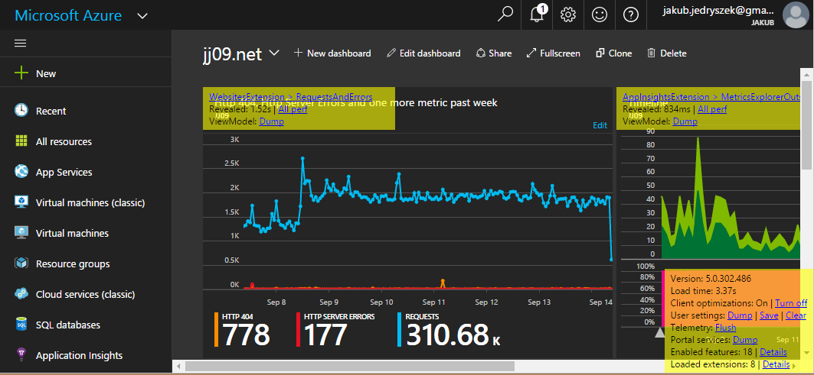

The bottom right sticky provides useful information and functionality such as: -

- The version of the portal
- Client optimizations - provides a way to toggle client optimizations such as
minification and bundling.
- User Settings
    * "Dump" logs all user settings to the console.
    * "Clear" resets a user's startboard and all other customizations. Clicking
"Clear" is equivalent to clicking Settings -> Discard modifications.
    * "Save" is solely for automated Selenium testing purposes.
- Telemetry Flush (we send telemetry to server in batches). Solely for automated Selenium testing purposes.
- Portal Services dump. Solely for shell team runtime debugging.
- Enabled features - provides a list of features that are currently enabled.
- Loaded extensions - provides a list of all extensions that are currently
loaded and their load times. Clicking an extension name will log information to
the console including the extension definition and manifest.

The stickys places on each blade and part provide the following: -
- The name and owning extension - clicking on this logs debug information to the
console including the composition instance, view model and definition.
- The revealed time and all other perf information logged by that part/blade
- View model
    * "Dump" the view model to the console for debugging purposes
showing its name, parent extension and load time. You can click that div to log
more information to the console such as the part or blade definition, view model
name and inputs.
    * "Track" the view model observables
- Deep link to the blade if applicable


<a name="debugging-toggling-optimizations-turn-on-off-bundling-and-minification"></a>
### Toggling optimizations (turn on/off bundling and minification)

You can disable bundling and minification (for debugging).

The following modes are available
* **true:** all optimizations are enabled
* **false:** all optimizations are turned off
* **bundle:** files are bundled together however not minified - this mode
enables you to benefit from debugging non-minified code with friendly names and
at the same time have a reasonably fast portal on most browsers.
* **minify:** files are minified however not bundled

To set the optimizations mode for the portal and all extensions:

    https://portal.azure.com/?clientoptimizations=<value>

To set the optimization mode for a specific extension only:

    https://portal.azure.com/?<YourExtension>_clientoptimizations=<value>

You can also use IsDevelopmentMode setting on your server to alter the default
optimization settings for your extension.

<a name="debugging-restore-default-settings"></a>
### Restore default settings

The portal manages tracking the state of the desktop for users as they
navigate through the portal. This includes storing information that includes
the list of opened blades, active journeys, part selection status, and various
other states of the portal. At development time, it's often necessary to clear
this information. If new parts are not appearing on a blade or the startboard
as expected, this is often the cause.

You can reset settings in settings pane (that can be opened by clicking on settings icon in nav bar):


Next, click the 'Restore default settings':


The portal will refresh, and user settings will be cleared.

<a name="debugging-checking-for-console-errors"></a>
### Checking for console errors

The portal logs a great deal of useful information into the browser developer
console. Often this surfaces common errors and problems. To open up the
console, hit the F12 key on your keyboard. After entering the developer tools in your browser, locate and
open the `console`:


_The following examples demonstrate using the browser tools in Internet
Explorer. There are similar debugging tools in other popular browsers. In
Internet Explorer, the console will not start logging messages unless it is
already opened. After opening the console, you may need to refresh the portal
to see all messages._

After opening the console and refreshing the portal, do a quick visual scan of
the console log. Errors are written to the log in red:


As of 9/14/2016 the best, and fastest, Developer Tools are provided by Google Chrome.

<a name="debugging-checking-for-console-errors-trace-modes"></a>
#### Trace Modes

Often the errors present in the console can lead you down the path of fixing your issues. In addition to viewing the standard errors displayed in the console, it's often useful to load the portal in trace mode. Trace mode is
enabled by appending one of the following flags to the end of your querystring.  For example: [https://portal.azure.com/?trace=diagnostics](https://portal.azure.com/?trace=diagnostics) will enable verbose debugging information in the console.

There are also a variety of other tracing mechanisms available:

- **?trace=usersettings** => Show all writes and reads to the user settings service.  Great for debugging issues that require a 'reset desktop'.
- **?trace=partsettings.viewModelOrPartName** => Show writes and reads of part settings for a specific part. Can use the viewmodel name or the part name to filter trace.
- **?trace=desktop** => Log all shell desktop operations.  Useful for reporting errors to the alias.
- **?trace=diagnostics** => Display the debug hub, and add verbose tracing.
- **?trace=inputsset.log.viewModelOrPdlName** => Log in console when onInputsSet is about to be called on extension side. Can use the viewmodel name or the part/blade name to filter trace.
- **?trace=inputsset.debug.viewModelOrPdlName** => Breaks into debugger when onInputsSet is about to be called on extension side. Can use the viewmodel name or the part/blade name to filter trace.
- **?trace=inputsset.verbose.viewModelOrPdlName** => Logs in console every time shell evalutates whether onInputsSet should be called. Can use the viewmodel name or the part/blade name to filter trace.
- **?trace=inputsset.log.WebsiteBlade,inputsset.log.CommandViewModel** => Further refine which view model to trace.

<a name="debugging-checking-for-console-errors-diagnostic-switches"></a>
#### Diagnostic Switches

In addition to tracing, there are a variety of diagnostic switches that may be helpful when debugging:

- **?clientOptimizations=false** => Turns off bundling and minification of JavaScript to make debugging easier. Note this will apply to both the portal and extensions source. During development if you want to speed up portal load during your dev test cycles you can to turn off bundling and minification for your extension only.  To do this do not specify clientOptimizations but rather set the *IsDevelopmentMode appSetting in your web.config to true (Note: do not set IsDevelopmentMode to true on deployed extensions in production, use clientOptimizations instead).
- **?feature.canmodifyextensions** => Used by [testing in production](#portalfx-testinprod)
- **?feature.canmodifystamps** => Used by [custom deployment environments](#portalfx-deployment)
- **?feature.consoletelemetry=true** => Logs most telemetry events to the browser console
- **?feature.customportal=false** => Turns off automatic redirection for users in the microsoft.com tenant
- **?feature.verbosediagnostics=all** => Includes default diagnostics and all filtered diagnostics in the `Ctrl+Alt+A` popup
- **?feature.verbosediagnostics=permissions** => Includes default diagnostics and the permissions entry in the `Ctrl+Alt+A` popup
- **?feature.verbosediagnostics=assets** => Includes default diagnostics and the assets/assetManagement entries in the `Ctrl+Alt+A` popup
- **?feature.verbosediagnostics=desktop** => Includes default diagnostics and the desktop entry in the `Ctrl+Alt+A` popup
- **?nocdn=true** => Bypasses the CDN when loading resources for the *portal only*
- **?nocdn=force** => Bypasses the CDN when loading resources for portal and *all extensions*
- **?microsoft_azure_marketplace_ItemHideKey=GalleryItemName** => Shows unpublished items in the gallery

<a name="debugging-ensuring-your-extension-is-loaded"></a>
### Ensuring your extension is loaded

You can check if your extension is loaded in debug panel (**CTRL+ALT+D**)
by clicking 'Loaded extensions':

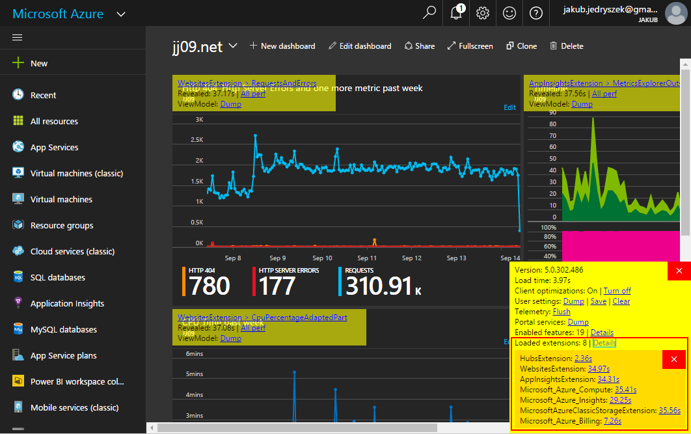

If the extension throws an error while trying to load your extension, try
clicking on the url in the console. That will lead to the location on your
machine where the extension is running. You should see either a blank web
page, or something similar to this:


If you see the graphic above, your extension is available for the shell to
load. If your extension is not loaded, or if your extension site is not
running, visit the [Creating Extensions](#portalfx-creating-extensions)
and the [Debugging extension failures](#portalfx-debugging-extension-load-failures) guides.

<a name="debugging-debugging-javascript"></a>
### Debugging JavaScript

Most modern browsers include tools that make it easy (and fun!) to debug
JavaScript. To understand how the JavaScript debugging tools work in Chrome, visit the [Chrome DevTools Overview](https://developer.chrome.com/devtools). For Microsoft Edge: check [F12 tools guide](https://developer.microsoft.com/en-us/microsoft-edge/platform/documentation/f12-devtools-guide/debugger/).

In most cases, you will be debugging code that is part of your extension. To
locate your sources, press **CTRL+P** and search for your extension by name: [YourExtension]ScriptsCore.js, and open the file. You
may also search all available source files using **CTRL+SHIFT+F**.


To debug a specific view model, search for the code by class name. You can now
set breakpoints, add watch variables, and step through your code as described
in the [How to step through your code](https://developers.google.com/web/tools/chrome-devtools/debug/breakpoints/step-code).

To learn more about debugging JavaScript check [Debugging tools for the Web](https://vimeo.com/157292748).

<a name="debugging-debugging-the-data-stack"></a>
### Debugging the data stack

If you're having trouble figuring out why your edit scope changes aren't showing up in your query cache or why a row in the grid was 
suddenly updated here are tips on how to debug the data stack:

* If you're working with a QueryCache or an EntityCache you can use the `dump()` method to inspect the contents of the cache at any 
point. By default it will print the data to the console but you can get the data returned as objects using `dump(true)` so you can 
do things like `queryCache.dump(true)[0].name()`.

* The edited data contained in an EditScope is accessible via the `root` property on the EditScope (if you're using an EditScopeView
then it's available at `editScopeView.editScope().root` after the editScope() observable is populated). You can view the original data 
as well using the `getOriginal()` method so to view the original root object you can do `editScope.getOriginal(editScope.root)`.

<a name="debugging-debugging-knockout"></a>
### Debugging Knockout

<a name="debugging-debugging-knockout-ko-datafor-and-0"></a>
#### ko.dataFor and $0

We use Knockout. A lot. All of our UI that comes from view models is bound through Knockout.  As a result, when something doesn't appear to be correct on the screen, generally something has gone wrong either in the ViewModel, or in framework code.  Let's take a look at what to do when we first encounter something odd in the UI.

One of the most useful commands when debugging knockout UI:

```
ko.dataFor(element)
```

This command will get back the object bound to the element via KO.

As a very relevant aside, did you know about $0?  In most modern browsers, $0 will return the currently selected element in the elements pane.

So to access what the object bound to the UI is (which is often your ViewModel*) and examine/observe it at runtime, select the element in the elements pane, and then run the following command:

```
ko.dataFor($0)
```

For intellisense support you can do the same thing, but assign it to a variable.

```
var viewModel = ko.dataFor($0)
```

[See the ko.dataFor video in the debugging section for more details](/portal-sdk/generated/index-videos.md#debugging)

*It's not actually your ViewModel, but rather a copy of your ViewModel in the shell side of the iframe kept in sync with your ViewModel in your iframe via something called the Proxy Observable (PO).  See the [aux docs architecture here](#portalfx-howitworks).   For now, it's probably best to recognize that it's not the same ViewModel, but can be treated mostly as such.  Most bugs I've encountered don't involve issues in the PO layer.  We'll cover that how to look at errors across iframes in a later post.

<a name="debugging-debugging-knockout-knockoutobservable-subscribe-and-debugger"></a>
#### KnockoutObservable.subscribe and debugger

In the previous section, we talked about how to get ahold of your ViewModel object using ko.dataFor. That's all well and good, but often we're not as interested in what is in our data, but rather what caused our data to change.

Fortunately, there is a pretty straightforward trick to figure out where changes have come from. All you need to do is subscribe to the observable for any changes. The subscribe API in Knockout takes a callback that allows you to execute code.

As another relevant aside, do you know about the JavaScript [debugger](https://developer.mozilla.org/en-US/docs/Web/JavaScript/Reference/Statements/debugger) keyword?  Basically it tells browsers to break when it's hit.

First, grab your ViewModel via ko.dataFor:

```
var myProperty = ko.dataFor($0).observablePropertyICareAbout;
```

Then, subscribe to it:

```
myProperty.subscribe(function (value) { debugger; })
```

What this basically does is says "whenever this property changes, break". Once you hit your injected breakpoint, you can examine your call stack, and see what caused this to trigger. The variable ```value``` is the new value being set to your observable.

[See the KnockoutObservable.subscribe and debugger video in the debugging section for more details](/portal-sdk/generated/index-videos.md#debugging)

<a name="debugging-crossing-the-iframe-boundary"></a>
### Crossing the iframe boundary

In previous sections we ignored that there are multiple iframes and just assumed everything was in a single iframe. In reality, both iframes can, and do change, values in response to one another.  Below, we'll be taking a look at how to figure out where changes are coming from when they come from a different iframe. Note: Unlike the previous two parts, this is very portal specific. Before going any further, it's important to have at least a [high level understanding of how our portal is set up](# How the portal works).

Firstly, you'll need to load the portal with diagnostics turned on (?trace=diagnostics).  Without this flag, we don't capture callstacks across iframes for perf reasons.  If doing this in a non-dev environment, it helps to turn off client optimizations as well (clientOptimizations=false), otherwise you'll be debugging minified code.

Next, you'll need to break at a point where an observable is changing:

```
ko.dataFor($0).observablePropertyICareAbout.subscribe(function (value) { debugger; })
```

At that point, you can leverage the framework to see what the callstack across iframes is via the following call:

```
MsPortalFx.Base.Rpc.Internal.messageContext.callStack
```

NOTE: Do not put this line of code anywhere in your actual source.  It will not run properly without diagnostics turned on (ie: It won’t work in prod).

This will return the combined callstack of your current frame to the bottom of the stack on the other iframe side.  Note: This only traverses the iframe boundary once.  Also, it's not a real callstack as the call across the iframe is async, so to go further back, you'll need to set a breakpoint on the other iframe and repeat the process until you find the code you are looking for.

[See the Crossing the iframe boundary video in the debugging section for more details](/portal-sdk/generated/index-videos.md#debugging)

Further reading:
1. [http://www.knockmeout.net/2013/06/knockout-debugging-strategies-plugin.html](http://www.knockmeout.net/2013/06/knockout-debugging-strategies-plugin.html)
1. [https://app.pluralsight.com/library/courses/knockout-tips/table-of-contents](https://app.pluralsight.com/library/courses/knockout-tips/table-of-contents)

<a name="debugging-fixing-520-errors"></a>
### Fixing 520 Errors

When the portal encounters a part it cannot render, it will render a 520
error:

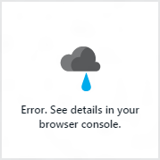

This can happen for a variety of reasons. To debug a 520 error, follow these
steps:

- Check the browser console, and look for errors.
- Click on the failed part. With some types of errors, this will add a stack trace to the browser console.
- Double check your Knockout template for correct syntax.
- Ensure all variables referenced on the template are available as public properties on the corresponding view model class.
- Reset the desktop state.
- Enable first chance exceptions in the JavaScript debugger.
- Set break points inside of the view model constructor, and ensure no errors are thrown.

<a name="production"></a>
<a name="debugging-debugging-in-production"></a>
### Debugging in production

To debug and test your local extension against the production portal (or any deployed environment), refer to [testing in production](#portalfx-testinprod).

<a name="gettinghelp"></a>
<a name="debugging-getting-help"></a>
### Getting Help

If you're stuck, ask for help!

- Read the [documentation](https://github.com/Azure/portalfx-docs-pr). (yes, this documentation)
- Check out the samples. They're installed with the SDK! You can find them under `\My Documents\PortalSDK\FrameworkPortal\Extensions\SamplesExtension`
- Reach out to Ibiza team on: [https://stackoverflow.microsoft.com/questions/tagged?tagnames=ibiza](https://stackoverflow.microsoft.com/questions/tagged?tagnames=ibiza).

Next steps: [Deploying your extension](#portalfx-deployment)


<a name="debugging-faq"></a>
### FAQ

<a name="debugging-faq-i-have-set-applicationcontext-version-for-my-extension-how-do-i-check-what-version-of-my-extension-is-currently-loaded-in-shell"></a>
#### I have set ApplicationContext.Version for my extension, how do I check what version of my extension is currently loaded in shell?

- Go to the portal where your extension is hosted or side loaded
- Press F12 in the browser and select the console tab
- Set the current frame dropdown to that of your extension
- In the console type fx.environment.version and hit enter to see the version of your extension on the client

	

- In addition, any request you make to your extension, including ajax calls, should also return the version on the server in the response.

	response-headers-show-version.png]

 Its important to note that there can be a difference in the fx.environment.version on the client and the version in the x-ms-version returned from the server e.g the user starts a session and the extension is updated/deployed while the user's session is still active.

 <h1 name="portalfx-debugging-extension-load-failures"></h1>
 <properties title="" pageTitle="Debugging Your Extension" description="" authors="nickharris" />

<a name="debugging-debugging-extension-load-failures"></a>
## Debugging extension load failures

<a name="debugging-debugging-extension-load-failures-extension-failure-states"></a>
### Extension failure states
Extensions could failures are logged along with an associated failure code.  This error code is printed out as part of the error message logged by the client trace controller.
Below is a list of the failure codes and what they mean:

<a name="debugging-debugging-extension-load-failures-extension-failure-states-firstresponsenotreceived"></a>
#### FirstResponseNotReceived
This error state means that the shell loaded the extension URL obtained from the config into an IFrame, however there wasn't any response from the extension.

<a name="debugging-debugging-extension-load-failures-extension-failure-states-firstresponsenotreceived-possible-causes-and-resolution"></a>
##### Possible causes and resolution
1. Verify that the extension is correctly hosted and accessible from the browser.
2. Your extension should have code injected in your layout.cshtml which includes a postMessage call. Verify that this code gets executed.

<a name="debugging-debugging-extension-load-failures-extension-failure-states-manifestnotreceived"></a>
#### ManifestNotReceived
This error state means that the bootstrap logic was completed, however the extension did not return a manifest to the shell. The shell waits for a period of time (currently 40 seconds as of 2014/10/06) and then timed out.

<a name="debugging-debugging-extension-load-failures-extension-failure-states-manifestnotreceived-possible-causes-and-resolution"></a>
##### Possible causes and resolution
1. Verify that the extension is correctly hosted and accessible from the browser.
2. In case your extension is using AMD modules, verify that your manifest.js file is accessible from the browser. Under default settings it should be present at /Content/Scripts/_generated/manifest.js

<a name="debugging-debugging-extension-load-failures-extension-failure-states-invalidextensionname"></a>
#### InvalidExtensionName
This error state means that the name of the extension specified in the extensions JSON in config doesn't match the name of the extension in the extension manifest.

<a name="debugging-debugging-extension-load-failures-extension-failure-states-invalidextensionname-possible-causes-and-resolution"></a>
##### Possible causes and resolution
Verify what the correct name of the extension should be, and if the name in config is incorrect, update it.
If the name in the manifest is incorrect, contact the relevant extension team to update `<Extension>` tag in their PDL with the right extension name and recompile.

<a name="debugging-debugging-extension-load-failures-extension-failure-states-invalidindicateloaded"></a>
#### InvalidIndicateLoaded
This means, that the manifest for an extension was received at an invalid time. e.g. if the manifest was already obtained or the extension was already loaded.

<a name="debugging-debugging-extension-load-failures-extension-failure-states-invalidindicateloaded-possible-causes-and-resolution"></a>
##### Possible causes and resolution
Report this issue to the framework team for investigation.

<a name="debugging-debugging-extension-load-failures-extension-failure-states-invalidmanifest"></a>
#### InvalidManifest
This error state means that the manifest that was received from an extension was invalid, i.e. it had validation errors.
Scan the error logs for all the validation errors in the extension manifest and fix them.

<a name="debugging-debugging-extension-load-failures-extension-failure-states-invaliddefinition"></a>
#### InvalidDefinition
This error state means that the definition that was received from an extension was invalid, i.e. it had validation errors

<a name="debugging-debugging-extension-load-failures-extension-failure-states-invaliddefinition-possible-causes-and-resolution"></a>
##### Possible causes and resolution
Scan the error logs for all the validation errors in the extension definition and fix them.

<a name="debugging-debugging-extension-load-failures-extension-failure-states-failedtoinitialize"></a>
#### FailedToInitialize
This error state means that the extension failed to initialize one or more calls to methods on the extension's entry point class failing

<a name="debugging-debugging-extension-load-failures-extension-failure-states-failedtoinitialize-possible-causes-and-resolution"></a>
##### Possible causes and resolution
Scan all the relevant error messages during the timeframe of the failure.
These errors should have information about what exactly failed while trying to initialize the extension e.g. the initialize endpoint, the getDefinition endpoint, etc.

<a name="debugging-debugging-extension-load-failures-extension-failure-states-toomanyrefreshes"></a>
#### TooManyRefreshes
This error state means that the extension try to reload itself within the IFrame multiple times. The error should specify the number of times it refreshed before the extension was disabled

<a name="debugging-debugging-extension-load-failures-extension-failure-states-toomanyrefreshes-possible-causes-and-resolution"></a>
##### Possible causes and resolution
Scan the errors to see if there are any other relevant error messages during the time frame of the failure.

<a name="debugging-debugging-extension-load-failures-extension-failure-states-toomanybootgets"></a>
#### TooManyBootGets
This error state means that the extension try to send the bootGet message to request for Fx scripts multiple times. The error should specify the number of times it refreshed before the extension was disabled

<a name="debugging-debugging-extension-load-failures-extension-failure-states-toomanybootgets-possible-causes-and-resolution"></a>
##### Possible causes and resolution
Scan the errors to see if there are any other relevant error messages during the time frame of the failure.

<a name="debugging-debugging-extension-load-failures-extension-failure-states-timedout"></a>
#### TimedOut
This error signifies that the extension failed to load after the predefined timeout (currently 40 seconds).

<a name="debugging-debugging-extension-load-failures-extension-failure-states-timedout-possible-causes-and-resolution"></a>
##### Possible causes and resolution
Scan the errors to see if there are any other relevant error messages during the time frame of the failure.

 <h1 name="portalfx-testinprod"></h1>
 <properties title="" pageTitle="Testing in production" description="" authors="flanakin" />

<a name="debugging-testing-in-production"></a>
## Testing in production

Extensions can be registered on a per-user basis on production deployments. This can be used to test a new extension or existing extension on a developer's machine with production credentials. To register a custom extension supply both of the following in the query string feature.canmodifyextensions and testExtensions in the following form:

* [https://portal.azure.com/?feature.canmodifyextensions=true#?testExtensions={"YourExtensionName":"https://localhost:1234/"}](https://portal.azure.com/?feature.canmodifyextensions=true#?testExtensions={"YourExtensionName":"https://localhost:1234/"})

  The `feature.canmodifyextensions=true` feature flag is required to support loading untrusted extensions for security purposes. The `YourExtensionName` must match the name in the `<Extension>` element in PDL and the `uri` refers to the extension endpoint. The actual uri host must be localhost. The protocol you use (HTTP vs HTTPS) must match the protocol of the Shell you’re loading your extension into (so for the production Shell, your extension must be on HTTPS), otherwise browsers won’t allow the two to communicate. (see below)

To avoid this being a phishing risk, we enforce that your extension must be hosted on localhost (any port, but no other hostname). If you need to use a different hostname than localhost, the existing registerTestExtension API is still available and may be used as follows:

* Sign in to a production account at [https://portal.azure.com?feature.canmodifyextensions=true](https://portal.azure.com?feature.canmodifyextensions=true)
* Hit F12 to open the developer tools in the browser
* Run the following command to register your custom extension:

```ts
  // use this if you want the change to be permanent until the user has resets settings or executes MsPortalImpl.Extension.unregisterTestExtension("YourExtensionName")
  MsPortalImpl.Extension.registerTestExtension({ name: "YourExtensionName", uri: "https://someserver:59344" });

  //use this if you want the extension to be registered only for the current portal load. 
  MsPortalImpl.Extension.registerTestExtension({ name: "YourExtensionName", uri: "https://someserver:59344" }, true);
```
  
* Navigate to [https://portal.azure.com?feature.canmodifyextensions=true&clientOptimizations=false](https://portal.azure.com?feature.canmodifyextensions=true&clientOptimizations=false)

  * For other useful switches, please refer to the [debugging guide](#portalfx-debugging)

The registered extension will be saved to user settings, and available in future sessions. When using the portal in this mode, you will see a banner letting you know the state of the configured extensions has been changed:

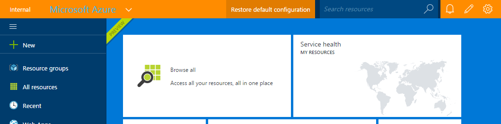

<a name="debugging-marking-automated-tests-as-test-synthetic-traffic"></a>
## Marking automated tests as test/synthetic traffic

Automated tests that run against a production environment need to be marked as test/synthetic traffic.  In order to accomplish this, you can do one of the following:

* Add the TestTraffic phrase to your userAgentString.  Replace `<TeamName>` and `<Component>` with appropriate values.

```ts
  TestTraffic-<TeamName>-<Component>
```

* Set the query string parameter

```ts
  feature.UserType=test
```

This allows us to exclude test traffic from our reports.

<a name="debugging-marking-automated-tests-as-test-synthetic-traffic-faq"></a>
### FAQ

<a name="debugging-marking-automated-tests-as-test-synthetic-traffic-faq-my-extension-fails-to-side-load-and-i-get-an-err_insecure_response-in-the-browser-console"></a>
#### My Extension fails to side load and I get an ERR_INSECURE_RESPONSE in the browser console

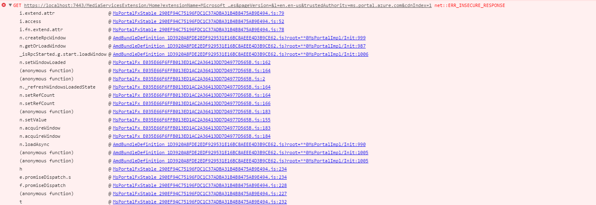

In this case the browser is trying to load the extension but the SSL certificate from localhost is not trusted the solution is to install/trust the certificate.

<a name="debugging-marking-automated-tests-as-test-synthetic-traffic-faq-i-get-an-error-security-of-a-sandboxed-iframe-is-potentially-compromised-by-allowing-script-and-same-origin-access-how-do-i-fix-this"></a>
#### I get an error &#39;Security of a sandboxed iframe is potentially compromised by allowing script and same origin access&#39;. How do I fix this?

You need to allow the Azure Portal to frame your extension URL. For more information, [click here](#portalfx-creating-extensions)


<a name="other"></a>
# Other
 <h1 name="portalfx-binding-reference"></h1>
 <properties title="" pageTitle="Binding Quick Reference" description="" authors="nickharris,tomacox" />

<a name="other-pdl-binding-quick-reference"></a>
## PDL Binding Quick Reference

<table>
<thead>
<tr>  
  <th>Binding</th>
  <th>Applies To</th>
  <th>Notes</th>
</tr>
</thead>
<tbody>
<tr>  
  <td>ViewModel="BladeViewModel"</td>
  <td rowspan="2">Blade, CustomPart</td>
  <td>Binds to filename BladeViewModel.ts and class name BladeViewModel. </td>    
</tr>
<tr>
<td>ViewModel="{ViewModel Name=BladeViewModel, Module=./Locked/ViewModels/BladeViewModelFilename}"</td>  
  <td>Binds to BladeViewModel defined within BladeViewModelFilename.ts located at path ./Locked/ViewModels/ </td>
</tr>
<tr>
  <td>
<pre>
&lt;Blade.Parameters&gt;
   &lt;Parameter Name="id" Type="%Type%" /&gt;
&lt;/Blade.Parameters&gt;
</pre>
  <td>Blade.Parameters</td>
  <td>Blade.Parameters is used to define a collection of Parameter elements that define the parameters the blade is required to receive from the caller. %Type% may be any of the following values {Key, NewEditScope, Output, Supplemental} <a href="#portalfx-blades-parameters"> - more detail</a></td>
</tr>
<tr>
  <td>
  <pre>
&lt;Blade.Properties&gt;
  &lt;Property Name="idX" 
               Source="{BladeParameter id}"/&gt;
&lt;/Blade.Properties&gt;
  </pre>
  <td>Blade.Properties</td>
  <td>Blade parameters defined within Blade.Parameters can be passed to the blade view model via a Blade.Property collection of Property elements bound to a Source BladeParameter.  In this example the blade ViewModel onInputsSet method inputs parameter will have a property inputs.idX that contains the value of the supplied BladeParameter with name id <a href="#portalfx-blades-properties">- more detail</a></td>
</tr>

<tr>
  <td>Template="{Html Source='..\\..\\Common\\Templates\\PartWithTitle.html'}"</td>
  <td>CustomPart</td>
  <td>Defines a html template for CustomPart located at relative path .\\..\\Common\\Templates\\PartWithTitle.html</td>
</tr>

<tr>
  <td>Template="{Html Source='..\\..\\Common\\Templates\\PartWithTitle.html'}"</td>
  <td>CustomPart</td>
  <td>Defines a html template for CustomPart located at relative path .\\..\\Common\\Templates\\PartWithTitle.html</td>
</tr>
<tr>
 <td>
 <pre>
&lt;Lens ...&gt;
  &lt;CustomPart ...&gt;
    &lt;CustomPart.Properties&gt;
       &lt;Property Name="resetTriggered" 
 	Source="{ActionBarProperty resetTriggered}" /&gt;
    &lt;/CustomPart.Properties&gt;
  &lt;/CustomPart&gt;
&lt;/Lens&gt;
&lt;ActionBar Name="FilterFormActionBar"
       ActionBarKind="Generic"
       ViewModel="FilterFormActionBarViewModel"&gt;
&lt;/ActionBar&gt;
  </pre>
  </td> 
  <td>CustomPart.Properties</td>
  <td>As FilterFormActionBarViewModel.resetTriggered changes onInputsSet will be called on the CustomPart ViewModel with parameter inputs.resetTriggered defined with the value of FilterFormActionBarViewModel.resetTriggered</td>
 </tr>
</tbody>
</table>

 <h1 name="portalfx-blade-viewmodel"></h1>
 # Understanding the blade view model

The portal uses a view model abstraction to allow extensions to author UI in the portal. This allows extensions to deal with data
and manipulate UI without worrying about the differences in DOM events across browsers or having to remember to include the right 
accessiblity attributes (these are encapsulated in the widgets provided by the portal). Remember the architecture of portal puts
the DOM in an iframe controlled by the portal (the 'shell' iframe) and extension in a separate iframe (the 'extension' iframe).
The shell iframe and the extension iframe communicate through view models (often using knockout observable values). It's important
for you as an extension author to understand these interactions because they will have a performance impact on the blades you create.

We'll start with the blade view model. When a blade is opened by the user the portal will call into the iframe for the extension 
that owns the blade and request the view model for that blade. That blade view model will be composed of 
other view models like textbox view models, button view models & other widgets. These widget view models are the way the extension 
communicates with user  (by displaying or collecting information). The blade view model handles plumbing the data to and from 
the widget view models and coordinates the interactions between the widgets on the blade.

To help you understand what code belongs where we'll look at a simple example blade. The blade will load a person object from the 
server and display it to the user in some readonly textboxes. To make the scenario more dynamic we won't show a textbox for the 
person's smartphone if the string is empty. Our UI will either look like this:

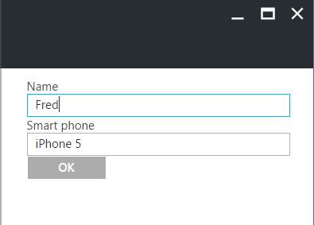

Or this:

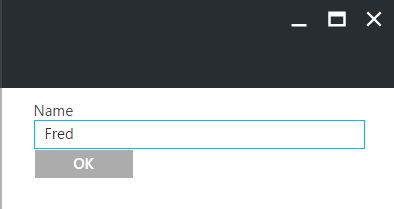

For reference here are the properties we'll put on the blade view model to create this blade:

```typescript

/**
 * Textbox control containing the user's name.
 */
public nameTextBox: TextBox.ViewModel;

/**
 * Observable containing either a numeric textbox or a textbox.
 */
public smartPhone: KnockoutObservable<TextBox.ViewModel>

/**
 * OK button for submitting updated user data back to server.
 */
public okButton: SimpleButton.ViewModel;

/**
 * EntityView containing the person being edited
 */
private _view: MsPortalFx.Data.EntityView<Person, any>;

```

One important thing to note here is the EntityView object is named `_view`. The reason for this is it's not directly used in the 
rendering of the blade (it doesn't appear in the blade template) and thus does not need to be proxied to the shell iframe. The
proxied observable layer does not transfer private members of the blade view model (properties whose name starts with an underscore) 
to the other iframe. If you are not careful about what data you are proxing to the shell you can cause greatly slow down the 
performance of your blade.

The template for this blade is:

```xml

<div data-bind="pcControl: nameTextBox"></div>
<div data-bind="pcControl: smartPhone"></div>
<div data-bind="pcControl: okButton"></div>

```

(As an aside we generally recommend using a section control to layout your controls rather than directly putting them in the 
template like we've done above because it provides default styling and an easier way to deal with dynamically adding/removing 
control but doing it this way is useful for this example)

<a name="other-blade-initialization"></a>
## Blade initialization

<a name="other-blade-initialization-blade-constructor"></a>
### Blade constructor

When a blade is opened the first thing that happens is the portal creates a blade with loading UI and shows it to the users while 
the view model for the blade is requested from the extension. The first thing that happens in the extension is the constructor 
for the blade view model will run. This is the place to create view models for your UI and do as much initialization as you can. 
In our example we know we'll always need a readonly textbox for the name and a OK button to close the blade so we'll create those 
now. Note we don't know what the value of the name textbox will be yet (we'll only  know that after the data is retrieved) but 
we can still create the textbox now and update the value later because the `value` property of the textbox view model is observable.
Here's what our blade view model constructor looks like:

```typescript

this._view = dataContext.personData.peopleEntities.createView(container);

this.nameTextBox = new TextBox.ViewModel(container, {
    readonly: true,
    label: ko.observable("Name")
});

this.smartPhone = ko.observable<TextBox.ViewModel>();

this.okButton = new SimpleButton.ViewModel(container, {
    text: "OK",
    onClick: () => {
        container.closeChildBlade();
    }
});

```

This is where it's important to understand the different between observables and non-observable. Observable values can be updated 
after their creation. Any properties that are not observable cannot be *observably* updated after the proxied observable layer has 
mirrored the view model in the other iframe. That means you could write code like:

```ts
viewModel.readonly = false;
```

But this new value will never be propogated to the shell side and thus will never take effect. However if you write a new value to 
an observable:

```ts
viewModel.value("updated");
```

The proxied observable layer will be notified of the change in the value and will reflect the change in the other iframe. Let's take 
a look at what we did and didn't make observable in our constructor (remember changes to non-observable values won't show up in the 
shell iframe). Only one of the properties on the blade, `smartPhone`, is an observable. The others are non-observable 
values because, even though we might update properties on the `nameTextBox` for example , we won't remove or replace the actual textbox 
view model itself. It's value is static for the lifetime of the blade. With `smartPhone` however we won't know if we want to create 
the textbox control until we get the data (after the `onInputsSet` function finishes running) so we need to make the property observable.

The same applies for properties on widget view models. For example, when we create the `okButton` view model we specify a static string
for the `text` property. Since it is not an observable value we won't be able to update the button text later. If you look at the 
type signature for the `text` property however you'll see it is a union type. It accepts both a `string` and a `KnockoutObservable<string>`.
In case we want to revisit the decision of making the property dynamic or such that it can be updated later then we can achieve that by 
defining an observable at construction time:

```ts
this._buttonText = ko.observable("OK");
this.smartPhone = new SimpleButton.ViewModel(container, {
    text: this._buttonText,
    ...
});
```

And then at any point later updated the text by writing to that observable:

```ts
this._buttonText("New button text");
```

The question then becomes 'why not make every property observable just in case you want to update it later?'. The reason is performance.
Using an observable string instead of a string increases the size of your view model. It also means the proxied observable layer has 
to do extra work to hook up listeners to the observable in case it is ever updated. Both these things will hurt your blade reveal 
performance for literally no benefit if you never update the observable. Anywhere you can provide an observable or non-observable value 
you should provide the non-observable value if possible. (Unfortunately there are still many places where framework view models
accept only observable values so you must provide an observable even if you never plan on updating the value. We are currently working 
on that).

<a name="other-blade-initialization-blade-oninputsset"></a>
### Blade onInputsSet

When the input values for your blade are ready the framework will call your onInputsSet method. This is often when you'll fetch the 
data for blade and update the view models you created in your constructor. When the promise you return from the onInputsSet method 
is resolved your blade is considered 'loaded' the loading UI will be removed from your blade. Here's the code for our example's 
onInputsSet method:

```typescript

return this._view.fetch(inputs.id).then(() => {
    let person = this._view.data;

    // populate name textbox value
    this.nameTextBox.value(person.name());

    // if smartphone has a value create a control to display it
    // otherwise leave it empty
    let smartPhone = person.smartPhone();
    if (smartPhone) {
        let textBox = new TextBox.ViewModel(this._container, {
            readonly: true,
            label: ko.observable("Smart phone"),
            defaultValue: ko.observable(smartPhone)
        });
        this.smartPhone(textBox);
    }
});

```

Based on the inputs provided to us by the framework we'll start a `fetch()` to get data from the server. The return value for our
onInputSet is the promise returned to us by the fetch call because our blade is ready to be displayed as soon as the data is loaded. 
We also hook up a `then()` on the fetch promise so we can populate the dynamic pieces of our blade.

The first thing we do is update the value of the name textbox with the name of the person we got from the server by writing to the 
`value` observable on the textbox. If we hadn't marked the textbox as read only we could also subscribe to the value observable and 
observe any changes the user makes to the textbox in the subscription callback.

The other thing we do is decide whether or not to populate the blade's `smartPhone` observable with a textbox view model. Observables 
aren't limited to just primative types. When the textbox view model is written to the `smartPhone` observable the `pcControl` binding 
handler in the blade template observes the new view model and constructs a textbox widget. If we don't populate the observable the 
`<div>` in our template stays empty and nothing is displayed on the blade.

As mentioned before there are other cases besides optional UI elements for populating an observable (or the section control's 
`children` observable array). The grid control, for example, has a boolean option in it's constructor that controls whether column headers 
should be shown or not. Since it's not an observable boolean this can't be changed after the grid view model is created. If this 
decision depends on some data that you get from the server you'll have to delay constructing the grid until you know that information.
If proxied observables has already frozen your view model by the time you get your data you can get around this restriction by putting 
the grid view model in an observable.

<a name="other-blade-initialization-best-practices-when-using-observables"></a>
### Best practices when using observables

* Proper naming of view model properties
  - The easiest thing you can do to improve performance is make sure proxied observables is 
not copying data to the shell that is only needed in the extension iframe. The shell will warn you when it sees certain types of 
objects (like an editscope) being sent to the shell but it can't guard against everything. It is on the extension author to review 
their view model and ensure the right data is public vs private. Any private member name should start with an underscore so that 
proxied observables knows not to send the property to the shell.

* Avoid observables when possible
  - As mentioned above it is much more efficient and performant to use non-observables values. 
Whenever possible specifying a string instead of a KnockoutObservable<string> or a boolean instead of a KnockoutObservable<boolean> 
will improve performance. The performance between transfering a single string and KnockoutObservable<string> isn't huge but if 
a blade can make tens or hundreds of such savings they will add up.

* Efficient mutation of observable arrays
  - While doing:

  ```ts
  let numbers = ko.observable([]);
  for (i = 0; i < 100; i++) {
      numbers.push(i);
  }
  ```

  and

  ```ts
  let tempArray = [];
  for (i = 0; i < 100; i++) {
      tempArray.push(i);
  }
  let numbers = ko.observable(tempArray);
  ```

  Might look more or less equivalent the first example above can lead to SEVERE performance problems. In terms of observable 
  changes the first example queues 100 observable updates of one item each. The second example queues a single observable update 
  with 100 items.

  This is obviously a fictional example but let's say we were pushing data points to a series displayed on a chart that had 
  auto-scaling of it's axes turned on. Let's assume it takes 0.01 seconds to render an extra data point but 0.5 seconds to 
  recalcuate the scale of the x-axis and the y-axis every time the data is updated.

  In this case the first example would take 100 * (0.01 + 0.5) = 51 seconds to process all the changes. The second example 
  would take (100 * 0.01) + 0.5 = 1.5 seconds to process the changes. That is a *3400% difference*. Again, this is a made up 
  example but we have seen this mistake made by extension authors again and again that results in real performance problems.

  This is such a common problem the framework attempts to detect when an extension writes this type of code and warns them 
  with the message:

  Performance warning: A proxied observable array is mutated inefficiently.

  Generally this means you have somewhere in your code doing a repeated push() on an observable array (although there are a few
  other inefficient array mutations it attempts to catch). If you ever see this warning in the console please take them time 
  to figure out what is going on and address the issue.

<a name="data-pureComputed">
<a name="other-blade-initialization-ko-purecomputed"></a>
### ko.pureComputed()

You might have noticed unlike `ko.reactor` or knockout's observable subscribe method the portal's version of the knockout 
`pureComputed()` has not been modified to take a lifetime manager. Knockout has some good documentation on pureComputeds 
[here]("http://knockoutjs.com/documentation/computed-pure.html") but in a nut shell
the reason is that any knockout dependencies (which are the things that will pin a computed or observable in memory) associated 
with the pureComputed are allocated only when someone is listening to the pureComputed and are cleaned up as soon everyone stops 
listening to the pureComputed. This works great for 'pure' functions where there are no side effects which applies to the vast majority
of cases where you would like to create a computed so you should always try to use a pureComputed as opposed to a ko.reactor. Here's an 
example to help you understand the difference between the two so you know when you need to use a reactor as opposed to a pureComputed:

```ts
let obsNum = ko.observable(0);
let pureComputedCounter = 0;
let reactorCounter = 0;

let pure = ko.pureComputed(() => {
    pureComputedCounter++;
    return obsNum() + 1;
});

let reactor = ko.reactor(lifetime, () => {
    reactorCounter++;
    return obsNum() + 2;
});

obsNum(10);
obsNum(3);
obsNum(5);

console.log("According to pureComputed obsNum changed " + pureComputedCounter + " times");
console.log("According to reactor obsNum changed " + reactorCounter + " times");
```

The output of the above will be:

```
According to pureComputed obsNum changed 0 times
According to reactor obsNum changed 3 times
```

Here incrementing `pureComputedCounter` or `reactorCounter` is a side-effect because it has no bearing on the value of the observables 
produced by the functions (`pure` and `reactor`). If you need a side effect use `ko.reactor()`. If you don't use `ko.pureComputed()`. 
(Note: if we had added `pure.subscribe(lifetime, (val) => console.log(val.toString()))` right after creating `pure` then `pureComputedCounter`
would have been incremented to 3 as well because the pureComputed becomes live as soon as a listener is attached).

<a name="other-blade-initialization-ko-reactor"></a>
### ko.reactor()

Any observables read in the function passed to `ko.reactor()` will become a dependency for that reactor and the reactor will recompute 
whenever *any* of those observable values change. The same goes for `ko.pureComputed()` and the observable array's `map()` and `mapInto()`
functions (for map and mapInto this information is covered in more detail [here](#data-shaping)). This can very easily lead to a situation 
where a computed is recalculating at times you never intended. Whenever you write a pureComputed or a reactor it's always a good idea 
to put a breakpoint in the computed function and see when and why. We have seen computed functions that should run once actually run 
30+ time and waste CPU time recalcuating things that didn't need to be recalculated. If another computed takes a dependency on that computed
the problem grows expontentially.

This is actually such a common problem the framework has code that attempts to detect problematic computed functions. When a computed 
is created that has dependencies on 30 or more other observables the shell will output an error to the console. This should be an 
indication to the extension author the computed has likely picked up unnecessary dependencies and is wasting time recomputing when 
those dependencies change.

There are a few strategies you can use to ensure your computed only calculates when you intend it to:

* Try to avoid calling other functions in your computed method. When the entire implementation of the computed is visible in one place 
it's not too hard to scan the code and figure out what observables are dependencies of the function. If you write something like:

```ts
let computed = ko.pureComputed(() => {
    let foo = this.foo();
    this._processfoo(foo);
});
```

And `_processFoo()` calls three more helper methods it becomes a lot of work to figure out which observables will cause `computed()` to 
recalculate.

* Use the explicit dependency overload of ko.reactor()/ko.pureComputed(). There is an overload of those functions that takes as a second 
parameter a list of observables to subscribe to. When this overload is used an observable that is read is the computed function will 
not become a dependency. No matter what code is called inside the body of the computed you can be sure it will only recalculate when 
the observables you listed as dependencies are changed.

* Use ko.ignoreDependencies() inside your computed function. Doing:

```ts
let computed = ko.reactor(lifetime, () => {
    let foo = this.foo();
    let bar = this.bar();
    ko.ignoreDependencies(() => {
        this._processFoo(foo, bar);
    });
});
```

Is equivalent to doing:

```ts
let computed = ko.reactor(lifetime, [this.foo, this.bar], (foo, bar) => {
    this._processFoo(foo, bar);
});
```

(The second just looks a lot cleaner).

 <h1 name="portalfx-load-configuration"></h1>
 <properties title="" pageTitle="how to expose config settings for consumption in the client" description="" authors="lixinxu" />

<tags
    ms.service="portalfx"
    ms.workload="portalfx"
    ms.tgt_pltfrm="portalfx"
    ms.devlang="portalfx"
    ms.topic="get-started-article"
    ms.date="12/26/2015"
    ms.author="lixinxu"/>    

<a name="other-how-to-expose-config-settings-for-consumption-in-the-client"></a>
## How to expose config settings for consumption in the client

Configuration settings are commonly used to control an application's behavior. For example, using timeout values, page size, endpoints, ARM version number, etc. Using the .NET framework, managed code can load config easily but in the case of portal extensions most of the extensions implementation is JavaScript running on client side.  By allowing the client code in extensions to gain access to configuration settings the portal framework provides a way to get the configuration and expose it in `window.fx.environment`. The following steps detail how it works:

1. Portal framework will initialize the instance of the class ApplicationConfiguration (it is under Configuration folder in your project). It will try to populate all properties by finding configuration in web.config appSettings section. 
For each property, portal framework will use the key "{ApplicationConfiguration class full name}.{property name}" unless you give a different name in the associated "ConfigurationSetting" attribute applied that property in your ApplicationConfiguration.

1. Portal framework will create an instance of "window.fx.environment" for client script. It uses the mapping in ExtensionConfiguration dictionary which created by Definition.cs under the Controllers folder.

1. Client script loads the configuration from "window.fx.environment" which implements the interface "FxEnvironment". To declare the new configuration entry, the file FxEnvironmentExtensions.d.ts under Definitions folder should be updated for each property you want exposed to the client.

<a name="step-by-step-walkthrough"></a>
# Step by step walkthrough
Suppose you created a portal extension called "MyExtension" the following steps describe how to add a new configuration called "PageSize".

1. Open the "ApplicationConfiguration.cs" file under "Configuration" folder.

1. Add a new property called "PageSize"

```csharp

/// <summary>
/// The configuration for co-admin management.
/// </summary>
[Export(typeof(ArmConfiguration))]
[Export(typeof(ConfigurationSettings))]
public class ArmConfiguration : ConfigurationSettings
{
    /// <summary>
    /// Gets the ARM/CSM endpoint
    /// </summary>
    [ConfigurationSetting]
    public Uri ArmEndpoint
    {
        get;
        private set;
    }

    /// <summary>
    /// Gets the Portal ARM/CSM endpoint
    /// </summary>
    [ConfigurationSetting]
    public string PortalArmEndpoint
    {
        get;
        private set;
    }
}

```

1. Save the file

1. You will notice the namespace is "Microsoft.Portal.Extensions.MyExtension". So the full name of the class is "Microsoft.Portal.Extensions.MyExtension.ApplicationConfiguration". Since the property is "PageSize" so the configuration key should be "Microsoft.Portal.Extensions.MyExtension.ApplicationConfiguration.PageSize".

1. Open web.config of your extension.

1. Locate the "appSettings" section. Add a new entry for PageSize

    ```xml
    ...
      <appSettings>
            ...
            <add key="Microsoft.Portal.Extensions.MyExtension.ApplicationConfiguration.PageSize" value="20"/>
      </appSettings>
      ...
    ```

1. Save and close the web.config file

1. Open "Definition.cs" from "Controllers" folder. Add a new mapping in "ExtensionConfiguration" property

    ```csharp
        /// <summary>
        /// Initializes a new instance of the <see cref="Definition"/> class.
        /// </summary>
        /// <param name="applicationConfiguration">The application configuration.</param>
        [ImportingConstructor]
        public Definition(ApplicationConfiguration applicationConfiguration)
        {
            this.ExtensionConfiguration = new Dictionary<string, object>()
            {
                ...
                { "pageSize", applicationConfiguration.PageSize },
            };
            ...
        }
    ```

1. Open "FxEnvironmentExtensions.d.ts" file from "Definitions" folder and add "pageSize" property in the environment interface

    ```ts
        interface FxEnvironment {
            ...
            pageSize?: number;
        } 
    ```

1. Now new configuration entry has been defined. To use the configuration, add the code like this in script:

    ```JavaScript
        var pageSize = window.fx.environment && window.fx.environment.pageSize || 10;
    ```

If you have any questions, reach out to Ibiza team on: [https://stackoverflow.microsoft.com/questions/tagged?tagnames=ibiza](https://stackoverflow.microsoft.com/questions/tagged?tagnames=ibiza).

An extended version of the above is used to transfer domain based configuration (such as correctly formatted FwLinks) to the client.
For details and examples, please see [Domain based configuration](#portalfx-domain-based-configuration).

