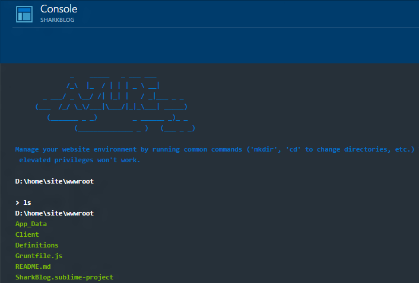

<a name="console"></a>
## Console
The console control provides a REPL like experience which can be used to replicate a Bash/PowerShell/Batch like experience.



`\SamplesExtension\Extension\Client\Controls\Console\Templates\ConsoleInstructions.html`

```html
<div data-bind='pcConsole: consoleViewModel'></div>
```

`\SamplesExtension\Extension\Client\Controls\Console\ViewModels\ConsoleViewModels.ts`

```ts
public consoleViewModel: MsPortalFx.ViewModels.Controls.Console.Contract;

constructor(container: MsPortalFx.ViewModels.PartContainerContract,
			initialState: any,
			dataContext: ControlsArea.DataContext) {

    // Initialize the console view model.
    this.consoleViewModel = new MsPortalFx.ViewModels.Controls.Console.ViewModel();

    // To get input from the user, subscribe to the command observable.
    // This is where you would parse the incomming command.
    // To show output, you can set the info, warning, success and error properties.
    this.consoleViewModel.command.subscribe(container, (s) => {
        // In this example, we are just piping back the input as an info, warning, success or error message based off of what you type in.
        switch (s) {
            case ClientResources.consoleInfo:
                this.consoleViewModel.info(s);
                break;
            case ClientResources.consoleWarning:
                this.consoleViewModel.warning(s);
                break;
            case ClientResources.consoleSuccess:
                this.consoleViewModel.success(s);
                break;
            case ClientResources.consoleError:
                this.consoleViewModel.error(s);
                break;
            default:
                this.consoleViewModel.error(s);
        }
    });

    // You can also observably set the prompt which is displayed above the > in the console.
    this.consoleViewModel.prompt = ko.observable(ClientResources.consolePrompt);
}
```
