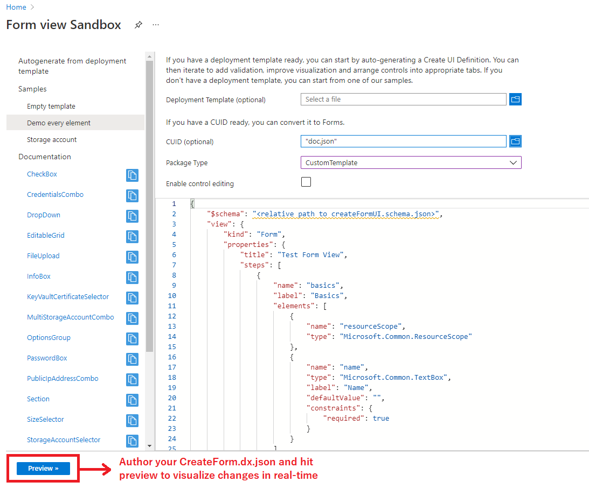
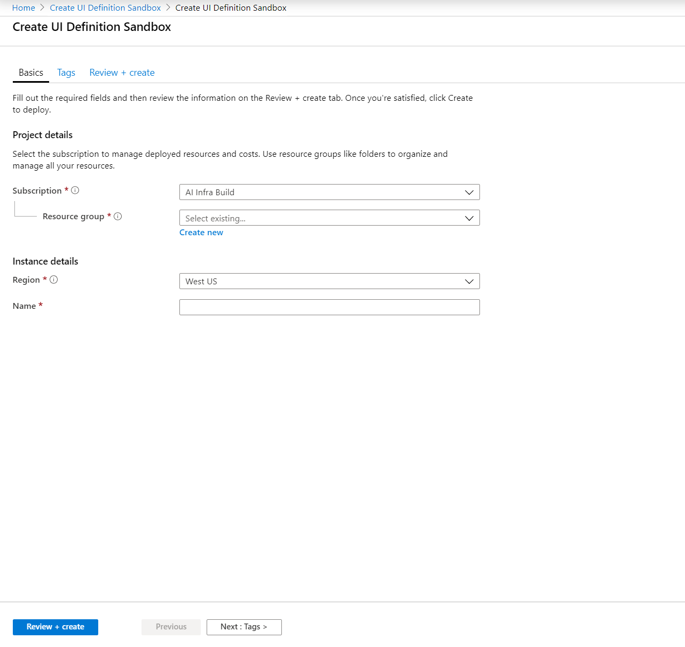
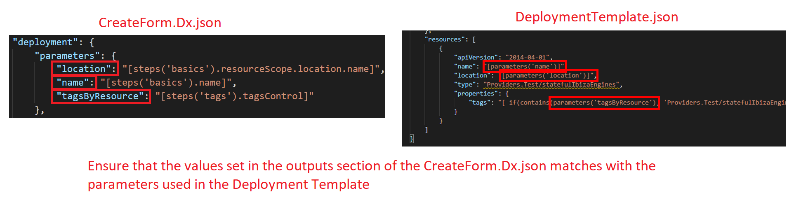
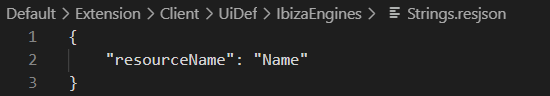
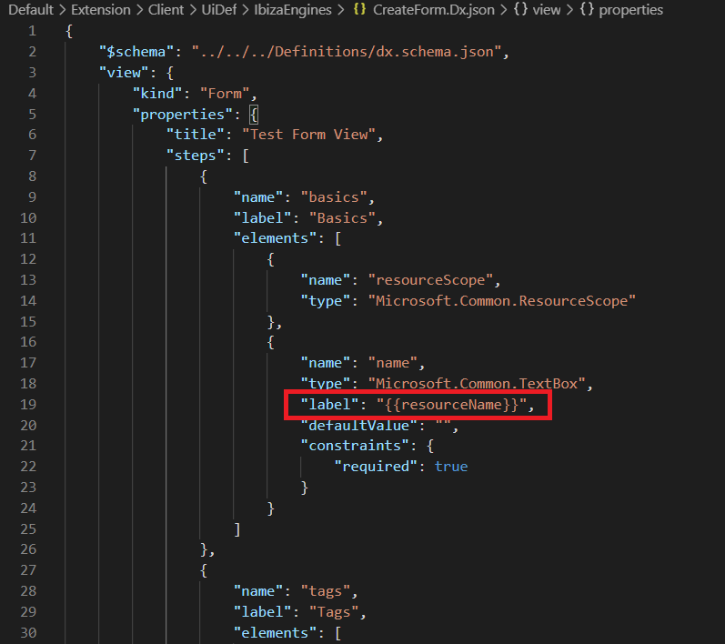
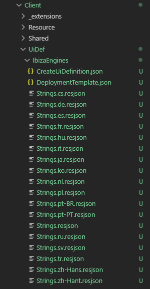
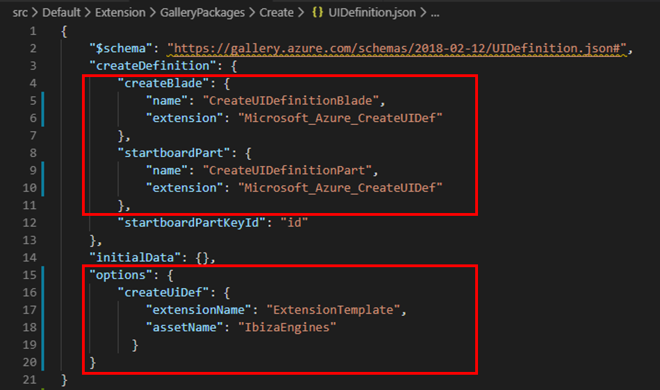

<a name="building-a-compliant-full-screen-create"></a>
# Building a compliant full screen create

Read this document if you want to know how you can build a compliant, full screen create in under an hour by just authoring a json!

This document will talk about the following –

1.	Our new full screen create pattern
2.	Authoring a Declarative Form json
3.	Changes needed in the Gallery Package
4.	Achieving localization via Declarative Form
5.	Sequence of deploying your changes

<a name="building-a-compliant-full-screen-create-our-new-full-screen-create-pattern"></a>
## Our new full screen create pattern

The Azure Portal has a new, rich, full screen pattern which has been developed to address multiple pain points in our old create experience after extensive user research. Some advantages of the new experience are –

1.	Introduces tabs to provide customers the ability to go back and forth editing inputs when they create a resource
2.	Adds a tags tab as all resources should support tags going forward to light up multiple policy and governance related scenarios
3.	Introduces a Review and Create section that lets customers review all their inputs before making the final create decision

The new create experience is extremely popular with customers and therefore, the Azure Portal is working with all extension owners to move their creates to this new, compliant, full screen create pattern. All new create experiences in the Portal should meet the full screen create pattern guidelines. You can learn more about our new full screen create pattern [here](design-patterns-resource-create.md).

<a name="building-a-compliant-full-screen-create-introduction-to-declarative-form"></a>
## Introduction to Declarative Form

Declarative Form is the successor of CreateUIDefinition, with the following benefits - 

1) Parity with CreateUIDefinition 
2) Supports new controls and improvements
3) Supports deploying to different scopes - Tenant, Management Group, Subscription and Resource Group
4) Multiple actions available - Deploying a template, returning outputs, and performing an ARM call

<a name="building-a-compliant-full-screen-create-building-a-declarative-form-based-create"></a>
## Building a Declarative Form based create

Declarative Form is a declarative way of building a create experience in the Azure Portal. The idea is simple, you author a json expressing the inputs you need to create a resource of your resource type. You can then map these user provided inputs to values in an ARM deployment template for provisioning.

Some of the advantages of moving the Declarative Form based create are -

1) Have a compliant full screen create by just authoring a json and save development time.
2) Get all accessibility, performance and consistency/design asks for free when the framework updates guidelines.

Declarative Form only supports ARM resources. Additionally, if your create has complex logic that maybe difficult to express as a json, Declarative Form may not be the solution for you and you may have to write a native Ibiza create experience. That said, the Declarative UX team is constantly investing in increasing Declarative Form’s capabilities. If you want to have a discussion to evaluate if your create scenario can be supported by Declarative Form, please reach out to [Shrisha Kumar](mailto:shku@microsoft.com) or [Gary Keong](mailto:garyke@microsoft.com).

<a name="building-a-compliant-full-screen-create-steps-to-move-to-full-screen-create"></a>
## Steps to move to Full Screen Create

<a name="building-a-compliant-full-screen-create-steps-to-move-to-full-screen-create-step-1-author-your-declarative-form-json"></a>
### Step 1: Author your Declarative Form json

You can author your Declarative Form json by using the Declarative Form sandbox available [here](https://aka.ms/form/sandbox). You can click on the “Demo every element” option to get a sense of the capabilities of Declarative Form. You can reach out to [Shrisha Kumar](mailto:shku@microsoft.com) or [Gary Keong](mailto:garyke@microsoft.com) if you have any questions.

The [Declarative Form sandbox](https://aka.ms/form/sandbox) also links to Declarative Form documentation in the left nav section.  

**Note** that the current documentation still refers to CreateUIDefinition, we will update our docs for Declarative Forms soon.

In this example, we will build a full screen create blade for an asset named IbizaEngine which has an ARM resource type of `Providers.Test/statefulIbizaEngines`. We use the Declarative Form sandbox to author our CreateForm.Dx.json and see it render in real-time by clicking Preview.





**NOTES**

1) #schema - The schema attribute must contain a valid dx.schema.json, which is available in the Azure Portal SDK.
2) Basics tab - Declarative Form uses the Microsoft.Common.ResourceScope control to explicitly define the Basics scope section.  In this example, the scope is set to `ResourceGroup` as defined in the `deployment.kind` section.  The following scopes are supported
   - Tenant
   - ManagementGroup
   - Subscription
   - ResourceGroup

CreateForm.Dx.json sample -
```
{
    "$schema": "<relative path to dx.schema.json>",
    "view": {
        "kind": "Form",
        "properties": {
            "title": "Test Form View",
            "steps": [
                {
                    "name": "basics",
                    "label": "Basics",
                    "elements": [
                        {
                            "name": "resourceScope",
                            "type": "Microsoft.Common.ResourceScope"
                        },
                        {
                            "name": "name",
                            "type": "Microsoft.Common.TextBox",
                            "label": "Name",
                            "defaultValue": "",
                            "constraints": {
                                "required": true
                            }
                        }
                    ]
                },
                {
                    "name": "tags",
                    "label": "Tags",
                    "elements": [
                        {
                            "name": "tagsControl",
                            "type": "Microsoft.Common.TagsByResource",
                            "resources": [
                                "Providers.Test/statefulIbizaEngines"
                            ]
                        }
                    ]
                }
            ],
            "deployment": {
                "kind": "ResourceGroup",
                "resourceGroupId": "[steps('basics').resourceScope.resourceGroup.id]",
                "parameters": {
                    "location": "[steps('basics').resourceScope.location.name]",
                    "name": "[steps('basics').name]",
                    "tagsByResource": "[steps('tags').tagsControl]"
                },
                "template": {
                    "file": "<ARM deployment template relative path>"
                }
            }
        }
    }
}
```

<a name="building-a-compliant-full-screen-create-steps-to-move-to-full-screen-create-step-2-adding-you-declarative-form-json-to-your-extension"></a>
### Step 2: Adding you Declarative Form json to your extension.

1. In your extension, you can add your declarative form and deployment template anywhere within your extension folder.  Please take note that the casing of your declarative form name matters.

The `DeploymentTemplate.json` for our example looks like this -

```
{
    "$schema": "http://schema.management.azure.com/schemas/2014-04-01-preview/deploymentTemplate.json#",
    "contentVersion": "1.0.0.0",
    "parameters": {
        "name": {
            "type": "string"
        },
        "location": {
            "type": "string"
        },
		"tagsByResource": {
			"type": "Object"
		}
    },
    "resources": [
        {
            "apiVersion": "2014-04-01",
            "name": "[parameters('name')]",
            "location": "[parameters('location')]",
            "type": "Providers.Test/statefulIbizaEngines",
            "properties": {
				"tags": "[ if(contains(parameters('tagsByResource'), 'Providers.Test/statefulIbizaEngines'), parameters('tagsByResource')['Providers.Test/statefulIbizaEngines'], json('{}')) ]"
            }
        }
    ]
}
```
2. Please update the `deployment.template` section of the CreateForm.Dx.json with the relative path to your Deployment Template (ex. `./DeploymentTemplate.json`)

3. Please ensure that the values set in the `deployment.parameters` section of the CreateForm.Dx.json matches with the parameters used in the Deployment Template.



<a name="building-a-compliant-full-screen-create-steps-to-move-to-full-screen-create-step-3-enabling-localization"></a>
### Step 3: Enabling localization

1. Ensure that you have already set up localization for your extension. If localization is still not enabled for your extension, refer to our doc on localization [here]( top-extensions-localization-globalization.md).
2. Once you have ensured that localization is enabled for your extensions, add a Strings.resjson file in the same folder as the one you have the DeploymentTemplate.json and CreateForm.Dx.json in.
3. The Strings.resjson is a simple json with key value pairs where the key is the unique key for each display string and the value is the display name. In the example below, "resourceName" is the key for the display string "Name" -



1. In the CreateForm.Dx.json, replace the display string with the key corresponding to that display string, defined in the `property` item.  Add this key to the Strings.resjson as a key value pair.  Finally, add a `stringSource` element which contains a relative path to the Strings.resjson.


5. You need to generate the resjson in all 18 languages the portal supports. For eg, for Spanish, you need to generate a resjson with Spanish strings called Strings.es.json. This can be done using capabilities of the localization pipeline. You need not check in the localized files as they will be generated during each official build. The exact instructions depend on the build system you are using. Please refer to [this doc](https://aka.ms/locv3) to learn how to do this for your extension based on the build system you are on. For eg, if you are using CoreXt, add the following to your extension csproj –

```
<ItemGroup>
<FilesToLocalize Include="Client\UiDef\**\Strings.resjson">
<OutputPath>$(MSBuildThisFileDirectory)\Client\UiDef\%(RecursiveDir)</OutputPath>
<CopyOption>LangIDOnName</CopyOption>
</FilesToLocalize>
</ItemGroup>
```



6. Check-in the above changes and trigger a build. Once the loc pipeline runs, localization should be enabled for your new create.

<a name="building-a-compliant-full-screen-create-steps-to-move-to-full-screen-create-step-4-gallery-package-changes"></a>
### Step 4: Gallery package changes

Since the entry to any create experience happens through a gallery package, the gallery package needs a few changes to understand that this particular gallery package has a create blade powered through Declarative Form.json

1. Update the UIDefinition.json file in the Gallery package to point to the CreateForm blade.  In this example, `CreateForm.Dx.json` will be translated to `CreateForm_Dx` blade (case-sensitive).



Here is the UIDefinition.json from our example -

```
{
  "$schema": "https://gallery.azure.com/schemas/2018-02-12/UIDefinition.json#",
  "createDefinition": {
      "createBlade": {
          "name": "CreateForm_Dx",
          "extension": "ExtensionTemplate"
      }
  }
}
```

<a name="building-a-compliant-full-screen-create-steps-to-move-to-full-screen-create-step-5-deployment-sequence"></a>
### Step 5: Deployment sequence

1. Once you have made the required changes and have tested locally by side-loading your extension, first deploy your new extension with the changes. If you publish the new gallery package first, your experience will break in Production.
2. Once the new extension has been deployed in all 5 production changes, go ahead and publish the new gallery package. You can find instructions on publishing a new gallery package [here](/gallery-sdk/generated/index-gallery.md#new-process).

**Congratulations! You now have a compliant, full screen create in the Azure Portal.**