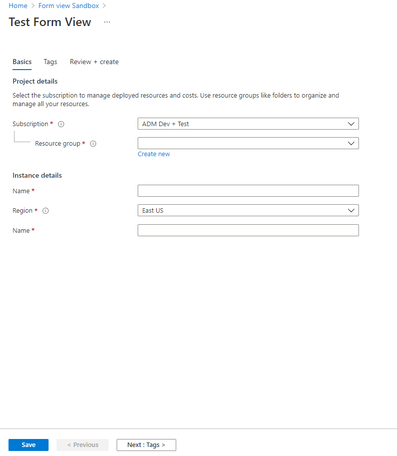
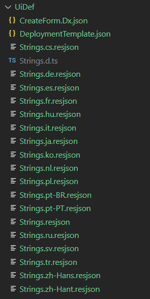
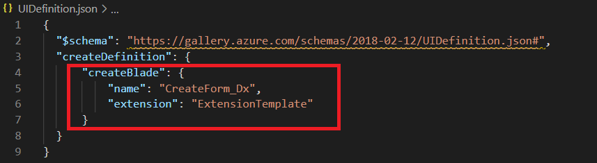

<a name="moving-to-compliant-full-screen-create-using-createuidefinition"></a>
# Moving to Compliant Full Screen Create using CreateUiDefinition

Read this document if you want to know how you can move to a compliant, full screen create in under an hour by just authoring a json!

This document will talk about the following –

1.	Our new full screen create pattern
2.	Authoring a CreateUiDefinition json
3.	Changes needed in the Gallery Package
4.	Achieving localization via CreateUiDefinition
5.	Sequence of deploying your changes

<a name="moving-to-compliant-full-screen-create-using-createuidefinition-our-new-full-screen-create-pattern"></a>
## Our new full screen create pattern

The Azure Portal has a new, rich, full screen pattern which has been developed to address multiple pain points in our old create experience after extensive user research. Some advantages of the new experience are –

1.	Introduces tabs to provide customers the ability to go back and forth editing inputs when they create a resource
2.	Adds a tags tab as all resources should support tags going forward to light up multiple policy and governance related scenarios
3.	Introduces a Review and Create section that lets customers review all their inputs before making the final create decision

The new create experience is extremely popular with customers and therefore, the Azure Portal is working with all extension owners to move their creates to this new, compliant, full screen create pattern. You can learn more about our new full screen create pattern [here](design-patterns-resource-create.md).

Additionally, the portal is planning to automatically full screen every blade in the Azure Portal on 2/14/2020.

While making these changes to improve the experience for our customers, we are aware that these wins for the customers come at the cost of developer hours on both, portal and extension teams. Therefore, we have also been working on making it cheaper and easier for extension owners to update their extensions to meet the compliance requirements of the Portal. One such effort is "no-code" Full Screen option powered by CreateUiDefinition.

If you have a partial blade create experience, you can quickly move to a full screen create using CreateUiDefinition before 2/14/2020.

<a name="moving-to-compliant-full-screen-create-using-createuidefinition-moving-to-createuidefinition-based-create"></a>
## Moving to CreateUiDefinition based create

CreateUiDefinition is a declarative way of building a create experience in the Azure Portal. The idea is simple, you author a json expressing the inputs you need to create a resource of your resource type. You can then map these user provided inputs to values in an ARM deployment template for provisioning.

Some of the advantages of moving the CreateUiDefinition based create are -

1) Have a compliant full screen create by just authoring a json and save development time.
2) Get all accessibility, performance and consistency/design asks for free when the framework updates guidelines.

CreateUiDefinition only supports ARM resources. Additionally, if your create has complex logic that maybe difficult to express as a json, CreateUiDefinition may not be the solution for you and you may have to write a native Ibiza create experience. That said, the CreateUiDefinition team is constantly investing in increasing CreateUiDefinition’s capabilities. If you want to have a discussion to evaluate if your create scenario can be supported by CreateUiDefinition, please reach out to [Shrisha Kumar](mailto:shku@microsoft.com) or [Gary Keong](mailto:garyke@microsoft.com).

<a name="moving-to-compliant-full-screen-create-using-createuidefinition-steps-to-move-to-full-screen-create"></a>
## Steps to move to Full Screen Create

<a name="moving-to-compliant-full-screen-create-using-createuidefinition-steps-to-move-to-full-screen-create-step-1-update-the-sdk-in-your-existing-extension"></a>
### Step 1: Update the SDK in your existing extension

SDKs above version 5.0.302.62501 support CreateUiDefinition based creates.

Therefore, step 1 of moving to CreateUiDefinition based creates will be update your extension to a newer SDK.

<a name="moving-to-compliant-full-screen-create-using-createuidefinition-steps-to-move-to-full-screen-create-step-2-author-your-createuidefinition-json"></a>
### Step 2: Author your CreateUiDefinition json

You can author your CreateUiDefinition json by using the CreateUiDefinition sandbox available [here](https://aka.ms/createuidef/sandbox). You can click on the “Demo every element” option to get a sense of the capabilities of CreateUiDefinition. You can reach out to [Shrisha Kumar](mailto:shku@microsoft.com) or [Gary Keong](mailto:garyke@microsoft.com) if you have any questions.

The [CreateUiDefinition sandbox](https://aka.ms/createuidef/sandbox) also links to CreateUiDefinition documentation in the left nav section.

In this example, we will build a full screen create blade for an asset named IbizaEngine which has an ARM resource type of `Providers.Test/statefulIbizaEngines`. We use the CreateUiDefinition sandbox to author our CreateUiDefinition.json and see it render in real-time by clicking preview.




CreateUiDefinition.json from the sample -

```
{
  "handler": "Microsoft.Azure.CreateUIDef",
  "version": "0.0.1-preview",
  "parameters": {
    "resourceTypes": [
        "Providers.Test/statefulIbizaEngines"
    ],
    "basics": [
        {
            "name": "name",
            "type": "Microsoft.Common.TextBox",
            "label": "Name",
            "defaultValue": "",
            "constraints": {
                "required": true
            }
        }
    ],
    "steps": [
        {
            "name": "tags",
            "label": "Tags",
            "elements": [
                {
                    "name": "tagsControl",
                    "type": "Microsoft.Common.TagsByResource",
                    "resources": [ "Providers.Test/statefulIbizaEngines" ]
                }
            ]
        }
    ],
    "outputs": {
        "location": "[location()]",
        "name": "[basics('name')]",
        "tagsByResource": "[steps('tags').tagsControl]"
    }
  }
}
```

<a name="moving-to-compliant-full-screen-create-using-createuidefinition-steps-to-move-to-full-screen-create-step-3-adding-you-createuidefinition-json-to-your-extension"></a>
### Step 3: Adding you CreateUiDefinition json to your extension.

1. In your extension, add a folder under the Client folder with the name `UiDef`.
2. Create a new folder inside this `UiDef` folder for each create you would like to power using CreateUiDefinition. You can pick a name for this folder. We recommend picking a name that helps you identify which resource type\asset corresponds to that particular create experience. In the example below, we have named the folder `IbizaEngines` as that is also the name of our asset.
Note: We will be using this folder name later in these instructions and refer to it as `asset folder name`.

3. Add your CreateUiDefinition.json (maintain the exact same name) in this folder.
4. Add your ARM Deployment Template for deployment in the same folder. The ARM deployment template should be in a file named DeploymentTemplate.json.
The `DeploymentTemplate.json` (maintain the exact same name) for our example looks like this -

```
{
    "$schema": "http://schema.management.azure.com/schemas/2014-04-01-preview/deploymentTemplate.json#",
    "contentVersion": "1.0.0.0",
    "parameters": {
        "name": {
            "type": "string"
        },
        "location": {
            "type": "string"
        },
		"tagsByResource": {
			"type": "Object"
		}
    },
    "resources": [
        {
            "apiVersion": "2014-04-01",
            "name": "[parameters('name')]",
            "location": "[parameters('location')]",
            "type": "Providers.Test/statefulIbizaEngines",
            "properties": {
				"tags": "[ if(contains(parameters('tagsByResource'), 'Providers.Test/statefulIbizaEngines'), parameters('tagsByResource')['Providers.Test/statefulIbizaEngines'], json('{}')) ]"
            }
        }
    ]
}
```

5. Please ensure that the values set in the outputs section of the CreateUiDefinition json matches with the parameters used in the Deployment Template.


The folder structure in your extension should look as follows once you have added the DeploymentTemplate.json and CreateUiDefinition.json in the correct place -


<a name="moving-to-compliant-full-screen-create-using-createuidefinition-steps-to-move-to-full-screen-create-step-4-enabling-localization"></a>
### Step 4: Enabling localization

1. Ensure that you have already set up localization for your extension. If localization is still not enabled for your extension, refer to our doc on localization [here]( top-extensions-localization-globalization.md).
2. Once you have ensured that localization is enabled for your extensions, add a Strings.resjson file in the same folder as the one you have the DeploymentTemplate.json and CreateUiDefinition.json in.
3. The Strings.resjson is a simple json with key value pairs where the key is the unique key for each display string and the value is the display name. In the example below, "resourceName" is the key for the display string "Name" -


4. In the CreateUiDefintion.json, replace the display string with the key corresponding to that display string between two pairs of curly braces.


5. You need to generate the resjson in all 18 languages the portal supports. For eg, for Spanish, you need to generate a resjson with Spanish strings called Strings.es.json. This can be done using capabilities of the localization pipeline. You need not check in the localized files as they will be generated during each official build. The exact instructions depend on the build system you are using. Please refer to [this doc](https://aka.ms/locv3) to learn how to do this for your extension based on the build system you are on. For eg, if you are using CoreXt, add the following to your extension csproj –

```
<ItemGroup>
<FilesToLocalize Include="Client\UiDef\**\Strings.resjson">
<OutputPath>$(MSBuildThisFileDirectory)\Client\UiDef\%(RecursiveDir)</OutputPath>
<CopyOption>LangIDOnName</CopyOption>
</FilesToLocalize>
</ItemGroup>
```




6. Check-in the above changes and trigger a build. Once the loc pipeline runs, localization should be enabled for your new create.


<a name="moving-to-compliant-full-screen-create-using-createuidefinition-steps-to-move-to-full-screen-create-step-5-gallery-package-changes"></a>
### Step 5: Gallery package changes

Since the entry to any create experience happens through a gallery package, the gallery package needs a few changes to understand that this particular gallery package has a create blade powered through CreateUiDefinition.json

1. Update the UIDefinition.json file in the Gallery package to point to the CreateUiDefinitionBlade and Part from the Microaoft_Azure_CreateUIDef extension.
2. Add a createUiDef section under options and pass the extension name in which you have added the CreateUiDefinition.json and the `asset folder name` as shown below. In the example, the name of the extension is `ExtensionTemplate` and the `asset folder name` is `IbizaEngines`.



Here is the UIDefinition.json from our example -

```
{
    "$schema": "https://gallery.azure.com/schemas/2018-02-12/UIDefinition.json#",
    "createDefinition": {
        "createBlade": {
            "name": "CreateUIDefinitionBlade",
            "extension": "Microsoft_Azure_CreateUIDef"
        },
        "startboardPart": {
            "name": "CreateUIDefinitionPart",
            "extension": "Microsoft_Azure_CreateUIDef"
        },
        "startboardPartKeyId": "id"
    },
    "initialData": {},
    "options": {
        "createUiDef": {
            "extensionName": "ExtensionTemplate",
            "assetName": "IbizaEngines"
          }
    }
}

```


<a name="moving-to-compliant-full-screen-create-using-createuidefinition-steps-to-move-to-full-screen-create-step-6-deployment-sequence"></a>
### Step 6: Deployment sequence

1. Once you have made the required changes and have tested locally by side-loading your extension, first deploy your new extension with the changes. If you publish the new gallery package first, your experience will break in Production.
2. Once the new extension has been deployed in all 5 production changes, go ahead and publish the new gallery package. You can find instructions on publishing a new gallery package [here](index-gallery.md#new-process).

**Congratulations! You now have a compliant, full screen create in the Azure Portal.**

<a name="moving-to-compliant-full-screen-create-using-createuidefinition-steps-to-move-to-full-screen-create-faqs"></a>
### FAQs

**Question**: I see an error when I build my extension which says "Failed to find `ViewDefinition.json`". How do I fix this?

**Answer**: This is a bug the Ibiza team is fixing. Please add an empty json file called `ViewDefintion.json` in the `asset folder name`. This will have no impact on any of your production experiences.


The contents of this `ViewDefinition.json` can be an empty json as follows -

```
{}
```