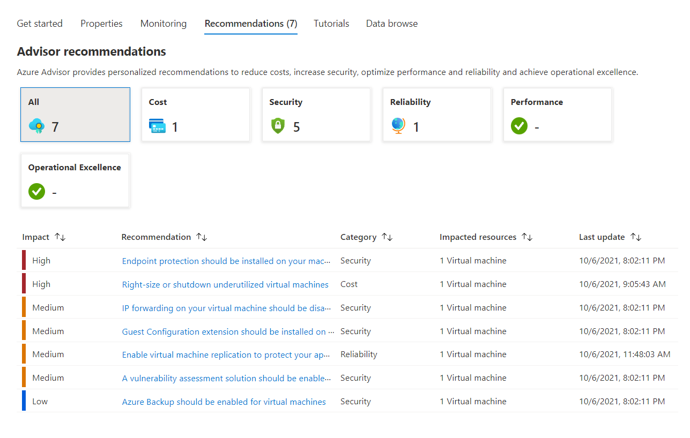

<a name="declarative-resource-overview-experience"></a>
# Declarative Resource Overview experience

This document will guide you on how to create the Declarative Resource Overview blade. The Declarative Resource Overview blade is the home page for your resource, which provides the purpose, top actions and key information so that users can quickly get value from your resource.

The Declarative Resource Overview blade includes the following sections:

1. Command bar - Define actions for your resource
2. Essentials - Display key properties of your resource
3. Views - Display key information of your resource

The following Views that are supported:

1. Getting Started
2. Properties
3. Monitoring
4. Capabilities
5. Recommendations
6. Tutorials
7. DataBrowse
8. Information

<a name="declarative-resource-overview-experience-getting-started-with-declarative-resource-overview-blade"></a>
## Getting started with Declarative Resource Overview blade

Below is an example the Declarative Resource Overview blade schema, as defined by the `GetStarted` kind. The `resources` section takes an ARM `id` and `apiVersion`, which in turn makes a ARM GET request to retrieve the resource details.  You can use the `resources()` function to retrieve the resource payload at runtime.

<a name="declarative-resource-overview-experience-getting-started-with-declarative-resource-overview-blade-declarative-resource-overview-schema"></a>
##### Declarative Resource Overview schema
<a name="resourceoverviewschema"></a>
```
{
  "$schema": "../../Definitions/dx.schema.json",
  "stringSource": "Resources/MyStrings.resjson",
  "view": {
    "kind": "GetStarted",
    "export": true,
    "parameters": [
      {
        "name": "id",
        "type": "key"
      }
    ],
    "resources": [
      {
        "id": "[parameters('id')]",
        "apiVersion": "2014-04-01"
      }
    ],
    "essentials": {},
    "commands": [],
    "properties": {
        "title": "title",
        "tabs": []
    }
  }
}
```
The `essentials` section defines what is rendered in Essentials.  The `commands` section defines the Commands in the command bar.  The `properties` section defines the tabbed Views to be rendered (under Essentials).  See below for an illustration.


<a name="declarative-resource-overview-experience-configuring-views"></a>
## Configuring views

The following views are supported -
****
1. [Getting Started](#getting-started)
2. [Properties](#properties)
3. [Monitoring](#monitoring)
4. [Capabilities](#capabilities)
5. [Recommendations](#recommendations)
6. [Tutorials](#tutorials)
7. [DataBrowse](#data-browse)
8. [Information](#information)

<a name="declarative-resource-overview-experience-configuring-views-getting-started"></a>
#### Getting Started
The Getting Started view is the primary view that users first see in Declarative Resource Overview blade. The purpose of the Getting Started view is to help the user learn about the resource and service. The Getting Started view consist of free form text followed by `features`, which can include actions such as URL, Blade and Menu open actions. The Menu action opens a menu item as defined with the `id`. In the example below, `tags` will open the Tags menu blade. [Learn more about configuring the resource menu](declarative-assets.md#configuring-the-resource-menu).

To add the Getting Started view, add the following example to the `properties.tabs` section in the [Declarative Resource Overview schema](#declarative-resource-overview-schema)

```
{
    "kind": "GetStarted",
    "title": {
        "property": "tab1Title"
    },
    "description": {
        "property": "tab1Description"
    },
    "learnMore": {
        "url": "https://azure.microsoft.com/en-us/features/azure-portal/",
        "ariaLabel": "Learn more about Azure Portal"
    },
    "features": [
        {
            "title": {
                "property": "tab1feature1Title"
            },
            "description": {
                "property": "tab1feature1Description"
            },
            "learnMore": {
                "url": "https://azure.microsoft.com/en-us/features/azure-portal/",
                "ariaLabel": "Learn more about Azure Portal"
            },
            "icon": {
                "file": "../../Content/svg/engine.svg"
            },
            "action": {
                "menu": "tags",
                "displayName": {
                    "property": "tab1feature1actionDisplayName"
                }
            }
        },
        {
            "title": {
                "property": "tab1feature2Title"
            },
            "description": {
                "property": "tab1feature2Description"
            },
            "learnMore": {
                "url": "https://azure.microsoft.com/en-us/features/azure-portal/",
                "ariaLabel": "Learn more about Azure Portal"
            },
            "icon": {
                "file": "../../Content/svg/engine.svg"
            },
            "action": {
                "blade": {
                    "name": "ActiveDirectoryMenuBlade",
                    "extension": "Microsoft_AAD_IAM"
                },
                "displayName": {
                    "property": "tab1feature2actionDisplayName"
                }
            }
        },
        {
            "title": {
                "property": "tab1feature3Title"
            },
            "description": {
                "property": "tab1feature3Description"
            },
            "learnMore": {
                "url": "https://azure.microsoft.com/en-us/features/azure-portal/",
                "ariaLabel": "Learn more about Azure Portal"
            },
            "icon": {
                "file": "../../Content/svg/msi.svg"
            },
            "action": {
                "url": "https://www.azure.com",
                "displayName": {
                    "property": "tab1feature3actionDisplayName"
                }
            }
        }
    ]
}
```
Example


<a name="declarative-resource-overview-experience-configuring-views-properties"></a>
#### Properties
The Properties view is used to showcase additional resource-specific properties that are frequently accessed by users for the given resource. It supports adding Secret and Date formats for secure string and datetime value. It supports adding sourceUnits and maximumFractionDigits for number value. SourceUnits indicates the initial unit which can be calculated with the value for the display value and unit. MaximumFractionDigits indicates the maximum fraction digits for the display value. It supports adding an action link to an URL, a resource or a blade.

To add the Properties view, add the following example to the `properties.tabs` section in the [Declarative Resource Overview schema](#declarative-resource-overview-schema)

```
{
    "kind": "Properties",
    "groups": [
        {
            "displayName": "Virtual machine",
            "icon": "MsPortalFx.Base.Images.Polychromatic.VirtualMachine",
            "action": {
                "menu": "tags"
            },
            "description": "This is a virtual machine.",
            "items": [
                {
                  "displayName": "Provisioning State",
                  "value": "[resources().properties.provisioningState]",
                  "description": "This is provisioning state.",
                  "valueMapping": [
                    {
                      "value": "Succeeded",
                      "displayName": "Succeeded",
                      "icon": "MsPortalFx.Base.Images.StatusBadge.Outline.Success"
                    },
                    {
                      "value": "Warning",
                      "displayName": "Warning",
                      "icon": "MsPortalFx.Base.Images.StatusBadge.Outline.Warning"
                    },
                    {
                      "value": "Failed",
                      "displayName": "Failed",
                      "icon": "MsPortalFx.Base.Images.StatusBadge.Outline.Failed"
                    }
                  ]
                },
                {
                    "displayName": "Computer name",
                    "value": "abc",
                    "valueMapping": [
                        {
                            "value": "abc",
                            "displayName": "def"
                        }
                    ]
                },
                {
                    "displayName": "Key",
                    "value": "[resources().id]",
                    "format": "Secret"
                },
                {
                    "displayName": "Creation time",
                    "value": "2021-03-23T21:24:47.7856737Z",
                    "format": "Date"
                },
                {
                    "displayName": "Disk Size",
                    "value": "[resources().properties.diskSize]",
                    "sourceUnits": "Gigabytes",
                    "maximumFractionDigits": 2
                },
                {
                    "displayName": "Azure portal",
                    "value": "https://azure.microsoft.com/",
                    "action": {
                        "url": "https://azure.microsoft.com/"
                    }
                },
                {
                    "displayName": "Open a resource",
                    "value": "Resource name",
                    "action": {
                        "resourceId": "/subscriptions/{subscription}/resourcegroups/{resourcegroup}/providers/{provider}/{resourceType}/{resourceName}"
                    }
                },
                {
                    "displayName": "Open a blade",
                    "value": "Blade name",
                    "action": {
                        "blade": {
                            "name": "A blade name",
                            "extension": "An extension name",
                            "parameters": {
                                "resId": "[resources().id]"
                            }
                        }
                    }
                },
                {
                    "displayName": "Open a menu",
                    "value": "Tags",
                    "action": {
                        "menu": "tags"
                    }
                }
            ]
        }
    ]
}
```
Example


<a name="declarative-resource-overview-experience-configuring-views-monitoring"></a>
#### Monitoring
The Monitoring view is used to display the most useful resource-specific charts and metrics. The metrics are derived from Azure Monitor.

Metrics can be defined as such
```
{
    "id": "Percentage CPU",
    "aggregationType": "Sum",
    "resourceMetadata": {
        "id": "[parameters('id')]"
    }
}
```
And the `id` and `aggregationType` must match what is available in Azure Monitor's `Metric` and `Aggregation`


To add the Monitoring view, add the following example to the `properties.tabs` section in the [Declarative Resource Overview schema](#declarative-resource-overview-schema)

```
{
    "kind": "Monitoring",
    "charts": [
        {
            "title": "CPU (average)",
            "metrics": [
                {
                    "id": "Percentage CPU",
                    "aggregationType": "Avg",
                    "resourceMetadata": {
                        "id": "[parameters('id')]"
                    }
                }
            ]
        }
    ]
}
```
Example


<a name="declarative-resource-overview-experience-configuring-views-capabilities"></a>
#### Capabilities
The Capabilities view is used to highlight valuable features of a resource that are not part of the Get Started or Properties content. Each capability card should correspond to a resource menu item as defined in `actions.menu` property. When user activates (click or keyboard) an unconfigured capability, the card should open a context pane to configure the capability. When a user activates (click or keyboard) a configured capability, the card should navigate to the corresponding menu item.

To add the Capabilities view, add the following example to the `properties.tabs` section in the [Declarative Resource Overview schema](#declarative-resource-overview-schema)

```
{
    "kind": "Capabilities",
    "capabilities": [
        {
            "title": "Backup",
            "icon": "MsPortalFx.Base.Images.Polychromatic.Backup",
            "description": "Simple and reliable server backup to the cloud",
            "action": {
                "menu": "tags"
            },
            "status": {
                "value": "[contains(resources().name, 'test')]",
                "valueMapping": [
                    {
                        "value": "true",
                        "displayName": "Configured",
                        "icon": "MsPortalFx.Base.Images.StatusBadge.Success"
                    },
                    {
                        "value": "false",
                        "displayName": "Not configured",
                        "icon": "MsPortalFx.Base.Images.StatusBadge.None",
                        "action": {
                            "blade": {
                                "name": "",
                                "extension": "",
                                "parameters": {},
                                "inContextPane": true
                            }
                        }
                    }
                ]
            }
        },
        {
            "title": "Disaster recovery",
            "icon": "MsPortalFx.Base.Images.Polychromatic.SiteRecovery",
            "description": "Replicate your virtual machine to another Azure region",
            "action": {
                "menu": "tags"
            },
            "status": {
                "value": "[not(contains(resources().name, 'test'))]",
                "valueMapping": [
                    {
                        "value": "true",
                        "displayName": "Configured",
                        "icon": "MsPortalFx.Base.Images.StatusBadge.Success"
                    },
                    {
                        "value": "false",
                        "displayName": "Not configured",
                        "icon": "MsPortalFx.Base.Images.StatusBadge.None",
                        "action": {
                            "blade": {
                                "name": "",
                                "extension": "",
                                "parameters": {},
                                "inContextPane": true
                            }
                        }
                    }
                ]
            }
        },
        {
            "title": "Insights",
            "icon": "MsPortalFx.Base.Images.Polychromatic.Insights",
            "description": "Enable logs and detailed monitoring capabilities",
            "action": {
                "menu": "tags"
            },
            "status": {
                "value": "[resources().properties.test]",
                "valueMapping": [
                    {
                        "value": "present",
                        "displayName": "Configured",
                        "icon": "MsPortalFx.Base.Images.StatusBadge.Success"
                    },
                    {
                        "value": "notPresent",
                        "displayName": "Not configured",
                        "icon": "MsPortalFx.Base.Images.StatusBadge.None",
                        "action": {
                            "blade": {
                                "name": "",
                                "extension": "",
                                "parameters": {},
                                "inContextPane": true
                            }
                        }
                    },
                    {
                        "value": "null",
                        "displayName": "Error",
                        "icon": "MsPortalFx.Base.Images.StatusBadge.Error"
                    },
                    {
                        "value": "undefined",
                        "displayName": "Error",
                        "icon": "MsPortalFx.Base.Images.StatusBadge.Error"
                    }
                ]
            }
        },
        {
            "title": "Security",
            "icon": "MsPortalFx.Base.Images.Polychromatic.SslCustomDomains",
            "description": "Continuously monitor your VM for potential security vulnerabilities",
            "action": {
                "menu": "tags"
            }
        }
    ]
}
```
Example


<a name="declarative-resource-overview-experience-configuring-views-recommendations"></a>
#### Recommendations
The Recommendations view is used to show the active Azure Advisor recommendations for the resource.

To add the Recommendations view, add the following example to the `properties.tabs` section in the [Declarative Resource Overview schema](#declarative-resource-overview-schema)

```
{
    "kind": "Recommendations"
}
```
Example


<a name="declarative-resource-overview-experience-configuring-views-tutorials"></a>
#### Tutorials
The Tutorials view is used to display the most useful resource-specific Microsoft training, videos, and useful links to “How to…” documents.

To add the Tutorials view, add the following example to the `properties.tabs` section in the [Declarative Resource Overview schema](#declarative-resource-overview-schema)

```
{
    "kind": "Tutorials",
    "tilesGroup": {
        "displayName": {
            "property": "freeTrainingsFromMicrosoft"
        },
        "items": [
            {
                "title": {
                    "property": "tile1Title"
                },
                "icon": "MsPortalFx.Base.Images.Polychromatic.Learn",
                "subtitle": {
                    "property": "tile1Subtitle"
                },
                "description": {
                    "property": "tile1Description"
                },
                "action": {
                    "url": "https://www.azure.com",
                    "displayName": {
                        "property": "start"
                    }
                }
            }
        ]
    },
    "videosGroup": {
        "displayName": {
            "property": "tab2videosTitle"
        },
        "items": [
            {
                "title": {
                    "property": "tab2feature1Title"
                },
                "description": {
                    "property": "tab2feature1Description"
                },
                "learnMore": {
                    "url": "https://www.azure.com",
                    "ariaLabel": "Learn more about Azure"
                },
                "video": {
                    "src": "https://www.youtube.com/watch?v=KXkBZCe699A"
                }
            }
        ]
    },
    "linksGroup": {
        "displayName": "Useful links",
        "items": [
            {
                "title": "Concepts",
                "action": [
                    {
                        "url": "https://azure.microsoft.com/en-us/",
                        "displayName": "Azure Managed applications overview"
                    },
                    {
                        "url": "https://azure.microsoft.com/en-us/",
                        "displayName": "Service Catalog applications"
                    },
                    {
                        "url": "https://azure.microsoft.com/en-us/",
                        "displayName": "Managed applications in Azure Marketplace"
                    }
                ]
            }
        ]
    }
}
```
Example


<a name="declarative-resource-overview-experience-configuring-views-data-browse"></a>
#### Data Browse
The Data Browse view is used to display the array data in a table.

To add the Data Browse view, add the following example to the `properties.tabs` section in the [Declarative Resource Overview schema](#declarative-resource-overview-schema)

Example for static array data source.

```
{
    "kind": "DataBrowse",
    "displayName": "Data browse",
    "ariaLabel": "Data browse",
    "data": [
        {
            "diskSize": 100,
            "price": 100,
            "displayName": "a",
            "creationTime": "2021-03-23T21:24:47.7856737Z"
        },
        {
            "diskSize": 10000,
            "price": 10000,
            "displayName": "b",
            "creationTime": "2021-04-24T21:24:47.7856737Z"
        },
        {
            "diskSize": 1500,
            "price": 1500,
            "displayName": "c",
            "creationTime": "2021-05-25T21:24:47.7856737Z"
        }
    ],
    "columns": [
        {
            "displayName": "Disk Size",
            "name": "diskSize",
            "format": "Number",
            "sourceUnits": "Gigabytes",
            "maximumFractionDigits": 2
        },
        {
            "displayName": "Price",
            "name": "price"
        },
        {
            "displayName": "Display Names",
            "name": "displayName"
        },
        {
            "displayName": "Creation time",
            "name": "creationTime",
            "format": "Date"
        }
    ]
}
```

Example for resources() data source, the output for resources().resources must be an array.

```
{
    "kind": "DataBrowse",
    "displayName": "Data browse",
    "ariaLabel": "Data browse",
    "data": "[resources().resources]",
    "columns": [
        {
            "displayName": "Name",
            "name": "name"
        },
        {
            "displayName": "VM Type",
            "name": "type"
        },
        {
            "displayName": "Location",
            "name": "location"
        }
    ]
}
```
Example


Example for icon and link support.

```
{
	"kind": "DataBrowse",
	"displayName": "Data browse",
	"ariaLabel": "testing",
	"data": [
		{
			"name": "resourceName1",
			"id": "/subscriptions/{subscription}/resourcegroups/{resourcegroup}/providers/{provider}/{resourceType}/{resourceName}",
			"status": "Succeeded",
			"menu": "tags",
			"urlText": "Azure portal",
			"urlAction": {
				"url": "https://azure.microsoft.com/"
			},
			"parameters": {
				"title": "resourceName1"
			}
		},
		{
			"name": "resourceName2",
			"id": "/subscriptions/{subscription}/resourcegroups/{resourcegroup}/providers/{provider}/{resourceType}/{resourceName}",
			"status": "Warning",
			"menu": "properties",
			"urlText": "Microsoft",
			"urlAction": {
				"url": "https://www.microsoft.com/en-us/"
			},
			"parameters": {
				"title": "resourceName2"
			}
		},
		{
			"name": "resourceName3",
			"id": "/subscriptions/{subscription}/resourcegroups/{resourcegroup}/providers/{provider}/{resourceType}/{resourceName}",
			"status": "Failed",
			"menu": "locks",
			"urlText": "Github",
			"urlAction": {
				"url": "https://github.com/"
			},
			"parameters": {
				"title": "resourceName3"
			}
		}
	],
	"columns": [
		{
			"displayName": "Name",
			"name": "name",
			"action": {
				"resourceId": "[$item.id]"
			}
		},
		{
			"displayName": "Status",
			"name": "status",
			"valueMapping": [
				{
					"value": "Succeeded",
					"displayName": "Succeeded",
					"icon": "MsPortalFx.Base.Images.StatusBadge.Outline.Success"
				},
				{
					"value": "Warning",
					"displayName": "Warning",
					"icon": "MsPortalFx.Base.Images.StatusBadge.Outline.Warning"
				},
				{
					"value": "Failed",
					"displayName": "Failed",
					"icon": "MsPortalFx.Base.Images.StatusBadge.Outline.Failed"
				}
			]
		},
		{
			"displayName": "Menu",
			"name": "menu",
			"action": {
				"menu": "[$item.menu]"
			}
		},
		{
			"displayName": "Url",
			"name": "urlText",
			"action": {
				"url": "[$item.urlAction.url]"
			}
		},
		{
			"displayName": "Blade",
			"name": "name",
			"action": {
				"blade": {
					"name": "A blade name",
					"extension": "An extension name",
					"parameters": "[$item.parameters]",
					"inContextPane": true
				}
			}
		}
	]
}
```
Example


<a name="declarative-resource-overview-experience-configuring-views-information"></a>
#### Information
The Information view allows you to specify an array of actions including URL, Blade and Menu open actions.


To add the Information view, add the following example to the `properties.tabs` section in the [Declarative Resource Overview schema](#declarative-resource-overview-schema)

```
{
    "kind": "Information",
    "displayName": "Information",
    "features": [
        {
            "title": "Declarative Resources",
            "action": [
                {
                    "displayName": "Declarative Developer guide",
                    "url": "https://aka.ms/portalfx/declarative"
                },
                {
                    "displayName": "Declarative Form Sandbox",
                    "url": "https://aka.ms/form/sandbox"
                },
                {
                    "displayName": "Open Active Directory",
                    "blade": {
                    "name": "ActiveDirectoryMenuBlade",
                    "extension": "Microsoft_AAD_IAM"
                    }
                },
                {
                    "displayName": "Open Tags",
                    "menu": "tags"
                }
            ]
        }
    ]
}
```
Example


<a name="declarative-resource-overview-experience-configuring-views-default-tab"></a>
#### Default tab
The Declarative Resource Overview allows you to set any tab as the default tab when rendering the page. If there are multiple tabs with "default: true", only the first one will be set as the default tab.


To set the default tab, add the following example to any of the above tabs.

```
"default": true
```

<a name="declarative-resource-overview-experience-configuring-the-command-bar"></a>
## Configuring the command bar

The command bar allows you to provide top actions that interacts with your resource. The following commands are supported:

1. [OpenBladeCommand](#openbladecommand)
2. [OpenMarketplaceCommand](#openmarketplacecommand)
3. [ArmCommand](#armcommand)
4. [MenuCommand](#menucommand)
5. [MoveCommand](#movecommand)
6. [RefreshCommand](#refreshcommand)
7. [DeleteCommand](#deletecommand)

<a name="declarative-resource-overview-experience-configuring-the-command-bar-openbladecommand"></a>
#### OpenBladeCommand
This command allows you to open another blade either in full screen or as a context pane. The blade name is defined in `blade` property. You can also specify the `blade.extension` to reference blade in another extension. Example of OpenBladeCommand -
```
    {
        "kind": "OpenBladeCommand",
        "id": "openBladeCommand",
        "displayName": "Open Blade",
        "icon": "MsPortalFx.Base.Images.Logos.MicrosoftSquares",
        "blade": {
            "name": "CreateForm_dx",
            "inContextPane": true
        }
    }
```
<a name="declarative-resource-overview-experience-configuring-the-command-bar-openmarketplacecommand"></a>
#### OpenMarketplaceCommand
This command allows you to open the Create experience for a Marketplace package as defined by the `marketplaceItemId` property. The `marketplaceItemId` must exists in the Azure Marketplace.  Example of OpenMarketplaceCommand -

```
    {
        "kind": "OpenMarketplaceCommand",
        "id": "openMarketplaceCommand",
        "displayName": "Marketplace Command",
        "icon": "MsPortalFx.Base.Images.Polychromatic.Store",
        "marketplaceItemId": "Microsoft.DxIbizaEngine"
    }
```
<a name="declarative-resource-overview-experience-configuring-the-command-bar-armcommand"></a>
#### ArmCommand
This command allows you to make an ARM request. The ARM request method and URI are defined in the `definition` property.  Example of ArmCommand -

```
    {
        "kind": "ArmCommand",
        "id": "armCommand",
        "displayName": "Arm Command",
        "icon": "MsPortalFx.Base.Images.Go",
        "definition": {
            "httpMethod": "post",
            "uri": "[concat(resources().id, '?api-version=2014-04-01')]"
        }
    }
```
<a name="declarative-resource-overview-experience-configuring-the-command-bar-menucommand"></a>
#### MenuCommand
This command allows you to group multiple commands and displays them in a menu.  Example of MenuCommand -
```
    {
        "kind": "MenuCommand",
        "id": "menuCommand",
        "displayName": "Menu",
        "icon": "MsPortalFx.Base.Images.AllServices",
        "commands": [
          {
            "kind": "RefreshCommand",
            "id": "refreshCommandId2",
            "displayName": "refresh",
            "icon": "MsPortalFx.Base.Images.Refresh"
          },
          {
            "kind": "DeleteCommand",
            "id": "deleteCommand2",
            "displayName": "delete",
            "icon": "MsPortalFx.Base.Images.Delete",
            "confirmation": {
              "title": "deleteResourceTitle",
              "message": "deleteResourceMessage"
            },
            "definition": {
              "apiVersion": "2014-04-01"
            }
          }
        ]
    }
```
<a name="declarative-resource-overview-experience-configuring-the-command-bar-movecommand"></a>
#### MoveCommand
The Move command allows the user to move the resource to another subscription or resource group.  Example of MoveCommand -
```
    {
        "kind": "MoveCommand",
        "id": "moveCommand",
        "displayName": "move",
        "icon": "MsPortalFx.Base.Images.Move"
    }
```
<a name="declarative-resource-overview-experience-configuring-the-command-bar-refreshcommand"></a>
#### RefreshCommand
The Refresh command allows the user to refresh the blade. Example of RefreshCommand -
```
    {
        "kind": "RefreshCommand",
        "id": "refreshCommandId",
        "displayName": "refresh",
        "icon": "MsPortalFx.Base.Images.Refresh"
    }
```
<a name="declarative-resource-overview-experience-configuring-the-command-bar-deletecommand"></a>
#### DeleteCommand
The Delete command allows the user to delete the resource. A confirmation dialog will appear to re-confirm the delete action. The `definition.apiVersion` must match the supported API version of the Resource Provider. Example of DeleteCommand -
```
    {
        "kind": "DeleteCommand",
        "id": "deleteCommand",
        "displayName": "delete",
        "icon": "MsPortalFx.Base.Images.Delete",
        "confirmation": {
          "title": "deleteResourceTitle",
          "message": "deleteResourceMessage"
        },
        "definition": {
          "apiVersion": "2014-04-01"
        }
    }
```


<a name="declarative-resource-overview-experience-configuring-essentials"></a>
## Configuring essentials

Essentials allows you to display key properties of your resource. The space in essentials is limited, so only configure the most used properties in essentials. By default, and for consistency, we display Resource Group, Location, Subscription, Subscription ID and Tags properties. You can also add custom properties of the resource in essentials.

Please note that the default properties are listed first (on the left of essentials) and custom properties are listed after the default (on the right of essentials)

<a name="declarative-resource-overview-experience-configuring-essentials-to-configure-default-essentials"></a>
#### To configure default essentials
To configure default essentials, simply add `"essentials": {}` to your Declarative Resource Overview json like this -


The default essentials will render like this -


<a name="declarative-resource-overview-experience-configuring-essentials-to-configure-custom-properties-in-essentials"></a>
#### To configure custom properties in essentials
We support the following custom essential types -

1. [String Content](#string-content)
2. [Action URL](#action-url)
3. [Action Resource](#action-resource)
4. [Action Blade](#action-blade)
5. [Icon Support](#icon-support)

<a name="declarative-resource-overview-experience-configuring-essentials-to-configure-custom-properties-in-essentials-string-content"></a>
##### String Content
String content can be dynamic or static. Using the `resources()` function, you can display properties of your resource at runtime.  Example json -

```
"essentials": {
    "properties": [
        {
            "displayName": "propertydisplayname",
            "value": "[resources().name]"
        }
    ]
}
```
<a name="declarative-resource-overview-experience-configuring-essentials-to-configure-custom-properties-in-essentials-action-url"></a>
##### Action URL
<a name="actionurl"></a>
Action URL allows you to open the `url` in a browser window.  Example json -

```
"essentials": {
    "properties": [
        {
            "displayName": "propertydisplayname",
            "value": "action url",
            "action": {
                "url": "https://www.azure.com"
            }
        }
    ]
}
```
<a name="declarative-resource-overview-experience-configuring-essentials-to-configure-custom-properties-in-essentials-action-resource"></a>
##### Action Resource
<a name="actionresource"></a>
Action Resource allows you to open a resource by resourceId.  Example json -

```
"essentials": {
    "properties": [
        {
            "displayName": "propertydisplayname",
            "value": "action resource",
            "action": {
                "resourceId": "/subscriptions/{subscription}/resourcegroups/{resourcegroup}/providers/{provider}/{resourceType}/{resourceName}"
            }
        }
    ]
}
```
<a name="declarative-resource-overview-experience-configuring-essentials-to-configure-custom-properties-in-essentials-action-blade"></a>
##### Action Blade
<a name="actionblade"></a>
Action Blade allows you to open a blade.  Example json -

```
"essentials": {
    "properties": [
        {
            "displayName": "propertydisplayname",
            "value": "action blade",
            "action": {
                "blade": {
                    "extension": "Microsoft_AAD_IAM",
                    "name": "ActiveDirectoryQuickStartBlade",
                    "parameters": {}
                }
            }
        }
    ]
}
```
<a name="declarative-resource-overview-experience-configuring-essentials-to-configure-custom-properties-in-essentials-icon-support"></a>
##### Icon Support
<a name="iconsupport"></a>
You can add an icon on the left of the value, the icon is changing based on the current value.  Example json -

```
"essentials": {
    "properties": [
        {
            "displayName": "propertydisplayname",
            "value": "Succeeded",
            "valueMapping": [
                {
                    "value": "Succeeded",
                    "displayName": "Succeeded",
                    "icon": "MsPortalFx.Base.Images.StatusBadge.Outline.Success"
                },
                {
                    "value": "Warning",
                    "displayName": "Warning",
                    "icon": "MsPortalFx.Base.Images.StatusBadge.Outline.Warning"
                },
                {
                    "value": "Failed",
                    "displayName": "Failed",
                    "icon": "MsPortalFx.Base.Images.StatusBadge.Outline.Failed"
                }
            ]
        }
    ]
}
```