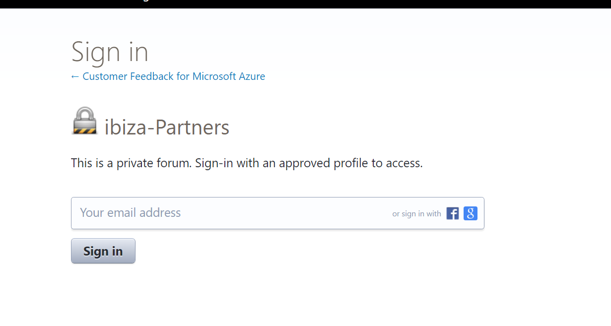
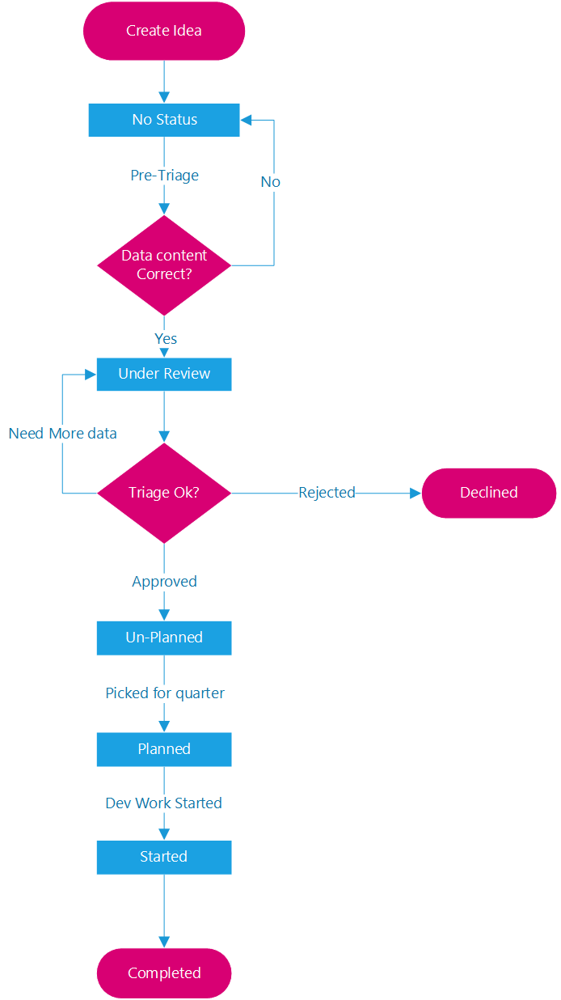

# Partner Request Process

To have a better customer experience, you may want to have richer experience in Ibiza portal. Sometimes to get this richer experience, you may have limited acheiving it using our famework. In such scenario, you may want us (Ibiza Team) to do some work in framework for achieving this goal.

You can help us identify the enhancements aka features needed in frameworkusing this process. This process is for you folks to tell us exactly what you need and when you need it.

## What is the Process?

Basically this is simple Uservoice forum where you can post ideas to help us improve. We will pick the popular ideas that can be worked on when we plan our quarters.

## How to file a request?

To file a new request:

1. To get access, you need to sign-up to [Uservoice](https://aka.ms/portalfx/uservoice) with your **"@microsoft.com"**.
2.  Once signed up, go to our private forum ["ibiza-partners"](https://aka.ms/portalfx/uservoice)
    - **REMEMBER**, this is Uservoice "Private Forum" which is **ONLY** visible to Uservoice users with "@Microsoft.com" accounts. If you have not logged in with @ microsoft account, you will see below screen.

3. Post the Title for your idea. 
    - When you type your idea, you will get suggestions of all similar ideas. Just make sure, your idea is not one of the already existing ones. 
    - If it already exists, you can bump up the Priority by "Voting". More votes, higher probability of address.
4. If your idea does not match to the one that ``already exists``:
    - Fill in understandable Title, descriptions and category.

     `Tip: More detailed ask, will lead to better understanding and more votes.`
   

## How we will triage your request?

1.  We triage once per week.
1.	Highly voted requests will be considered for the next Ibiza quarterly planning cycle. 
1.	We will opportunistically pull the highest voted items into the current cycle as bandwidth permits.  
1.	For more urgent requests, again, you are free to engage with PMs on our team.
1.	We will give higher priority to requests that block a scenario that is required to get one of your benchmark usability tasks.  
1.	Items with status<>``"<blank>|under review"`` once we’ve read through the item and feel it has sufficient data for the item to be acted upon.
1.	If an item needs more data or is declined then we will email you during the triage.
1.	Items will be marked as Work Status = **In Progress** once we’ve started working on it.

Here is the flow diagram for tracking purpose.

