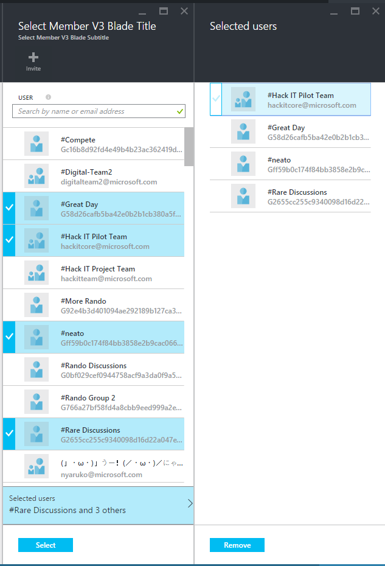
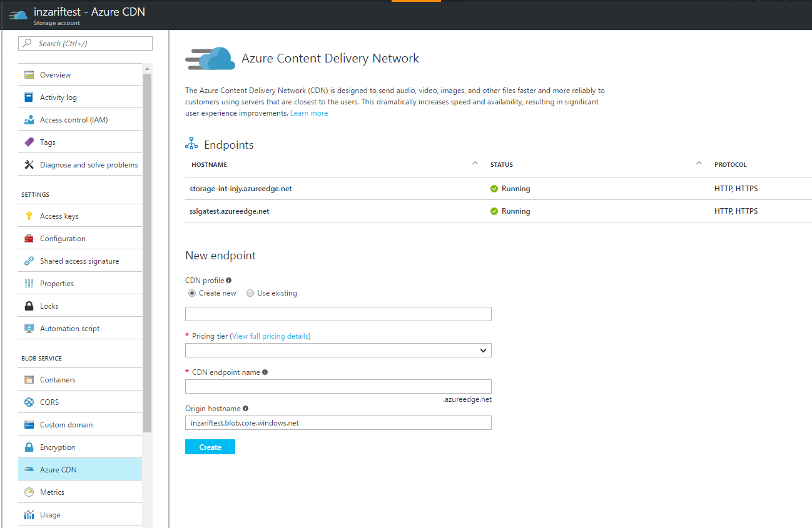

<a name="sharing-your-pde-with-other-teams"></a>
## Sharing your PDE with other teams

The following guidelines have been created to ensure a consistent and easy to consume developer experience across all partner teams that need to share their PDE.

To share your PDE with other teams please follow these guidelines:

- Create a NuGet

    - use the consistent naming convention `Microsoft.Portal.Extensions.<Name>`
    - the *.pde file is to be delivered under `/Client/_extensions/<Name>`
    - all *.d.ts files to be delivered under `/Client/_extensions/<Name>/*.d.ts`

    The following nuproj snippet can be used to customimze for your extensions NuGet creation. Most teams name it `Microsoft.Portal.Extensions.<Name>` to be consistent with the produced package name


    ```xml

    <?xml version="1.0" encoding="utf-8"?>
    <Project ToolsVersion="4.0" DefaultTargets="Build" xmlns="http://schemas.microsoft.com/developer/msbuild/2003">
    <Import Project="$(EnvironmentConfig)" />

    <PropertyGroup>
        <Id>Microsoft.Portal.Extensions.Name</Id>
        <Title>Microsoft Portal Extension Name</Title>
        <Description>Provides the Microsoft Portal Name PDE</Description>
        <Summary>Provides the Microsoft Portal Name PDE</Summary>
        <Tags>Microsoft Azure Cloud Portal Framework Name  PDE</Tags>
    </PropertyGroup>

    <ItemGroup>
        <!-- update the following to pull the PDE from your official build-->
        <Content Include="$(RepoRoot)\src\SDK\Extensions\HubsExtension\Extension\TypeScript\HubsExtension\HubsExtension.pde">
        <!-- update the following to pull in any *.d.ts files that consumers of your extensions PDE will require -->
        <Content Include="$(RepoRoot)\src\SDK\Extensions\HubsExtension\Extension\TypeScript\HubsExtension\ForExport\*.d.ts">
        <TargetPath>Client\_extensions\Name</TargetPath>
        </Content>
        <!-- include an install.ps1 to both set appropriate build action on pde and to pop documents-->
        <File Include="$(REPOROOT)\RDPackages\NuGet\Microsoft.Portal.Extensions.Name\Install.ps1" >
        <TargetPath>Tools\Install.ps1</TargetPath>
        </File>
    </ItemGroup>
    <!-- update the following as needed aka.ms/onebranch -->
    <Import Project="$(PkgNuProj)\NuProj.Targets" />
    <Import Project="..\Portal.Common.NuGet.props" />
    <PropertyGroup>
        <GenerateSymbolPackage>false</GenerateSymbolPackage>
    </PropertyGroup>
    </Project>

    ```

- Include in the nuproj a Install.ps1 that will:

    - set the correct build action on PDE
    - and open documentation on how to consume the exposed content.

    Customize the following Install.ps1 script

    ```powershell

    param($installPath, $toolsPath, $package, $project)

    # set the build action for the pde to ExtensionResource
    $item = $project.ProjectItems.Item("Client").ProjectItems.Item("_extensions").ProjectItems.Item("Your Folder Name that nuproj puts the pde in").ProjectItems.Item("SomeExtension.pde") 
    $item.Properties.Item("ItemType").Value = "ExtensionReference"
    # open the documentation for consuming exposed content from the pde. use an aka.ms link so you can change out the target content without having to republish
    $DTE.ItemOperations.Navigate("https://aka.ms/portalfx/somepde")

    ```

- Now that the NuGet is created as part of your build you need to create a document for consuming the content exposed by the PDE

    - [Check your access to the doc repo portalfx-docs-pr](https://github.com/Azure/portaldocs)

        - if you don’t have access follow the instructions [here](https://aka.ms/azuregithub) to enable 2FA on your github account and link your microsoft account
		- Then through [here](https://aka.ms/azuregithub) request access to portalfxdocs

- The resulting NuGet is to be published from your official builds to [https://msazure.visualstudio.com/One/Azure%20Portal/_packaging?feed=Official&_a=feed](https://msazure.visualstudio.com/One/Azure%20Portal/_packaging?feed=Official&_a=feed). See OneBranch guidance to [publish your package](https://microsoft.sharepoint.com/teams/WAG/EngSys/Implement/OneBranch/Publish%20your%20package.aspx)

* [Sharing your PDE with other teams](#sharing-your-pde-with-other-teams)
* [Getting started with the Select Members Blade](#getting-started-with-the-select-members-blade)
* [What is the Select Member Blade?](#what-is-the-select-member-blade)
* [Downloading the PDE](#downloading-the-pde)
* [Example Collector](#example-collector)
* [PDL Changes](#pdl-changes)
* [Configuration Options](#configuration-options)
* [searchCriteria Values](#searchcriteria-values)
* [Pre-selecting Members](#pre-selecting-members)
* [Installation](#installation)
* [Consumption](#consumption)
* [Installation](#installation-1)
* [Parts](#parts)
    * [ResourceTagsPart](#parts-resourcetagspart)
    * [PricingTierLauncherV3](#parts-pricingtierlauncherv3)
    * [SpecPickerListViewPartV3](#parts-specpickerlistviewpartv3)
    * [PricingTierLauncher](#parts-pricingtierlauncher)
    * [SpecPickerListViewPart](#parts-specpickerlistviewpart)
    * [DiagnosticsTile](#parts-diagnosticstile)
    * [FeedbackTile](#parts-feedbacktile)
    * [WhatsNewTile](#parts-whatsnewtile)
    * [LegalTermsSubscriptionProgrammaticAccessTilePart](#parts-legaltermssubscriptionprogrammaticaccesstilepart)
    * [GalleryLauncherPart](#parts-gallerylauncherpart)
    * [BrowseResourceListPart](#parts-browseresourcelistpart)
    * [BrowseResourceListPartWithCookie](#parts-browseresourcelistpartwithcookie)
    * [ResourceGroupMapPart](#parts-resourcegroupmappart)
    * [ResourceMapPart](#parts-resourcemappart)
    * [MapResourceGroupListPart](#parts-mapresourcegrouplistpart)
    * [BrowseServiceListPart](#parts-browseservicelistpart)
    * [BrowseServiceListPartWithCookie](#parts-browseservicelistpartwithcookie)
* [Blades](#blades)
    * [DeployFromTemplateBlade](#blades-deployfromtemplateblade)
    * [TemplateEditorBlade](#blades-templateeditorblade)
    * [ParametersEditorBlade](#blades-parameterseditorblade)
    * [ResourceGroupPickerV3Blade](#blades-resourcegrouppickerv3blade)
    * [SubscriptionPickerV3Blade](#blades-subscriptionpickerv3blade)
    * [LocationPickerV3Blade](#blades-locationpickerv3blade)
    * [SettingsBlade](#blades-settingsblade)
    * [DeploymentDetailsBlade](#blades-deploymentdetailsblade)
    * [ResourceGroupMapBlade](#blades-resourcegroupmapblade)
    * [BrowseResourceBlade](#blades-browseresourceblade)
    * [BrowseAllResourcesBlade](#blades-browseallresourcesblade)
    * [BrowseAllFilteredResourcesBlade](#blades-browseallfilteredresourcesblade)
    * [BrowseResourceGroupBlade](#blades-browseresourcegroupblade)
    * [MapResourceGroupBlade](#blades-mapresourcegroupblade)
* [Commands](#commands)
    * [MoveResourceCommand](#commands-moveresourcecommand)
    * [Getting started with Azure Insights](#commands-getting-started-with-azure-insights)
    * [Installation](#commands-installation-2)
    * [Consumption](#commands-consumption-1)
    * [Getting started with Azure Monitoring](#commands-getting-started-with-azure-monitoring)
    * [Installation](#commands-installation-3)
    * [Consumption](#commands-consumption-2)
    * [Getting started with the KeyVault picker blades](#commands-getting-started-with-the-keyvault-picker-blades)
    * [What are the KeyVault picker blades](#commands-what-are-the-keyvault-picker-blades)
    * [Downloading the PDE](#commands-downloading-the-pde-1)
    * [KeyVault Picker](#commands-keyvault-picker)
        * [Inputs/Outputs](#commands-keyvault-picker-inputs-outputs)
        * [Config](#commands-keyvault-picker-config)
        * [Constructor](#commands-keyvault-picker-constructor)
        * [PDL Changes](#commands-keyvault-picker-pdl-changes-1)
    * [Key/Secret Pickers](#commands-key-secret-pickers)
        * [Inputs/Outputs](#commands-key-secret-pickers-inputs-outputs-1)
        * [Config](#commands-key-secret-pickers-config-1)
        * [Constructor](#commands-key-secret-pickers-constructor-1)
        * [PDL Changes](#commands-key-secret-pickers-pdl-changes-2)
        * [Secret Picker](#commands-key-secret-pickers-secret-picker)
    * [Contact](#commands-contact)
* [Getting started with Azure CDN](#getting-started-with-azure-cdn)
    * [1\. Importing CDN Extension NuGet Package](#getting-started-with-azure-cdn-importing-cdn-extension-nuget-package)
    * [2\. Referencing CDN PDE](#getting-started-with-azure-cdn-referencing-cdn-pde)
    * [3\. Referencing CDN Integration Blade](#getting-started-with-azure-cdn-referencing-cdn-integration-blade)
        * [Blade Inputs](#getting-started-with-azure-cdn-referencing-cdn-integration-blade-blade-inputs)
        * [Notes and Tips](#getting-started-with-azure-cdn-referencing-cdn-integration-blade-notes-and-tips)
    * [4\. Telemetry and Monitoring](#getting-started-with-azure-cdn-telemetry-and-monitoring)
        * [Contact Us](#getting-started-with-azure-cdn-telemetry-and-monitoring-contact-us)


<tags
    ms.service="portalfx"
    ms.workload="portalfx"
    ms.tgt_pltfrm="portalfx"
    ms.devlang="portalfx"
    ms.topic="select-members-usage-doc"
    ms.date="10/29/2015"
    ms.author="admeyerms"/>    

<a name="getting-started-with-the-select-members-blade"></a>
## Getting started with the Select Members Blade

<a name="what-is-the-select-member-blade"></a>
## What is the Select Member Blade?

The Select Member Blade is a tool intended to unify "member selection" scenarios across the portal by separating the process of selection from the action being taken on those members. This means the hosting extension will be responsible for making any changes to the back-end data after the members have been returned by the Select Member Blade. Note that currently, a "member" can refer to any User, Group, or Service Principal within the current tenant's context. The Select Member Blade is built using the ParameterCollection Framework v3.0. This means the Select Member Blade is a "provider" and that to use it, you will need to write a "collector" which calls it. An example of this can be found in the next section. To better understand the basics of how passing data with this framework works, see the examples of its usage in the Samples extension provided with the Azure SDK. 



<a name="downloading-the-pde"></a>
## Downloading the PDE

The .pde you need to reference can be found by downloading the Microsoft.Portal.Extensions.AAD.nuget from \\\wanuget\nugetpackages\dev and extracting the contents. (the .pde will be found under /Content/_extensions/AAD)

<a name="example-collector"></a>
## Example Collector

    // This interface is used to define the inputs from the collector.
    export interface SelectMemberInputs {
        memberIds: KnockoutObservable<string>;
    }
  
    // This interface is used to define the config from the collector.
    export interface SelectMemberConfig {
        isSingleSelect: boolean;
        isInviteEnabled: boolean;
        searchCriteria: string[];
    }
  
    /**
     * This is an example of a command which calls into the select member blade
     */
    export class TestSelectMemberV3CommandViewModel extends MsPortalFx.ViewModels.OpenBladeCommand implements VMD.Contract {
       
      // collector
      public selectMemberCollector: MsPortalFx.ViewModels.ParameterCollector<SelectMemberInputs>;
      
      // inputs
      private _memberIds = ko.observable("");
      
      // configuration values
      private _isSingleSelect = ko.observable(true);
      private _isInviteEnabled = ko.observable(true);
      private _searchCriteria = ko.observableArray<string>([]);
  
      // blade parameter values (these are passed via the blade params, not via the PCv3 framework.)
      public title = "Choose Members";
      public subtitle = "Select Member Blade";
  
      constructor(_container: MsPortalFx.ViewModels.CommandContainerContract, initialState: any, dataContext: SharedArea.DataContext) {
          super(_container);
          this.icon(MsPortalFx.Base.Images.Polychromatic.Key());
          
          this.selectMemberCollector = new MsPortalFx.ViewModels.ParameterCollector<SelectMemberInputs>(_container, {
              supplyInitialData: () => {
                  return <SelectMemberInputs> {
                      // this is where you would pass in an array of pre-selected members, if you desire.
                      memberIds: ko.observable("")                  
                  };
              },
              receiveResult: (result: SelectMemberInputs) => {
                  // this is what will happen when the user finishes selecting members and the blade closes.
                  this._performActionOnMembers(result.memberIds());
              },
              supplyProviderConfig: () => {
                  return <SelectMemberConfig> {
                      isSingleSelect: this._isSingleSelect(),
                      isInviteEnabled: this._isInviteEnabled(),
                      searchCriteria: this._searchCriteria()
                  };
              }
          });
      }
  
      // normally, you would perform some action on the returned members here. In this example, just dump the payload into the log.
      private _performActionOnMembers(membersAsJson: string) {
          log.verbose(membersAsJson);
      }
  
      public onInputsSet(inputs: VMD.InputsContract): MsPortalFx.Base.Promise {
          // these inputs are coming from another part
          this._isSingleSelect(inputs.isSingleSelect);
          this._isInviteEnabled(inputs.isInviteEnabled);

          // remove all elements of the array
          this._searchCriteria = ko.observableArray<string>(["IncludeAllUsers", "IncludeOnlySecurityGroups", "ExcludeMSAUsers"]);
  
          return null;
      }
    }

<a name="pdl-changes"></a>
## PDL Changes

The following is an example of the PDL changes needed to use the blade. Note that "title" and "subtitle" will actually set 

the title and subtitle which appear on the selectMember blade.

```xml
<!--This is a test collector for the selectMemberv3 blade-->
    <Command Name ="TestSelectMemberV3Command"
             Kind ="Blade"
             Text ="{Resource testSelectMemberV3CommandTitle, Module=ClientResources}"
             ViewModel ="TestSelectMemberV3CommandViewModel">
      <BladeAction Blade ="{BladeReference SelectMemberV3, ExtensionName=Microsoft_Azure_AD}"
                   ParameterCollector ="selectMemberCollector">
        <BladeInput Parameter="title" Source="title" />
        <BladeInput Parameter="subtitle" Source="subtitle" />
      </BladeAction>
      <Property Name="isSingleSelect" Source="{PartProperty Part=SomeOtherPart, Property=isSingleSelect}"/>
      <Property Name="isInviteEnabled" Source="{PartProperty Part=SomeOtherPart, Property=isInviteEnabled}"/>
    </Command>
```

<a name="configuration-options"></a>
## Configuration Options

The Select Member Blade has several available options for configuration. 
- isSingleSelect: if true, only one member may be selected at a time. if false, multiple members may be selected (no limit)
- isInviteEnabled: if true, users may invite external users to the current tenant via a command button on the blade. If false, the command button will not be enabled, preventing this behavior.
- searchCriteria: this is an array of strings which are associated with various settings for the blade. The acceptable settings are listed in the next section. Note that these settings are cumulative, and as many can be applied as wanted.

<a name="searchcriteria-values"></a>
## searchCriteria Values

- IncludeAllUsers: this query includes all users (guest and non-guest users)
- IncludeOnlySecurityGroups: this query includes security groups
- IncludeServicePrincipals: this query includes service principals
- ExcludeMSAUsers: this query excludes MSA users (they will be disabled and not selectable)

<a name="pre-selecting-members"></a>
## Pre-selecting Members

Pre-selecting members allows you to indicate which members are already in the role for which you are selecting members. For example, if you are selecting an admin, you may want to indicate which members are already admins to avoid choosing them again. This is accomplished by passing a JSON-serialized array of strings in the collector's supplyInitialData function (see the example collector above). Each string in the array should contain the GUID of the User/Group/Service Principal which should be marked as pre-selected by the Select Member Blade.


<tags
    ms.service="portalfx"
    ms.workload="portalfx"
    ms.tgt_pltfrm="portalfx"
    ms.devlang="portalfx"
    ms.topic="pde-billing"
    ms.date="04/18/2016"
    ms.author="nickha"/>    

<a name="installation"></a>
## Installation

From nuget package manager console

```
Install-Package Microsoft.Portal.Extensions.Billing -Source https://msazure.pkgs.visualstudio.com/DefaultCollection/_packaging/Official/nuget/v3/index.json -Version <Version_Number>
```

*Note:* you will need to update the <Version_Number> with the latest version number from [here](https://msazure.visualstudio.com/DefaultCollection/One/_apps/hub/ms.feed.feed-hub?feedName=Official&protocolType=NuGet&packageName=microsoft.portal.extensions.billing)

<a name="consumption"></a>
## Consumption

- No docs have been provided to auxdocs that detail consumption. In the interim please reach out to [Mayur Oberoi](mailto:mayuro@microsoft.com) or [Ruchi Chopra](mailto:ruchic@microsoft.com) for consumption guidelines.
* [Sharing your PDE with other teams](#sharing-your-pde-with-other-teams)
* [Getting started with the Select Members Blade](#getting-started-with-the-select-members-blade)
* [What is the Select Member Blade?](#what-is-the-select-member-blade)
* [Downloading the PDE](#downloading-the-pde)
* [Example Collector](#example-collector)
* [PDL Changes](#pdl-changes)
* [Configuration Options](#configuration-options)
* [searchCriteria Values](#searchcriteria-values)
* [Pre-selecting Members](#pre-selecting-members)
* [Installation](#installation)
* [Consumption](#consumption)
* [Installation](#installation-1)
* [Parts](#parts)
    * [ResourceTagsPart](#parts-resourcetagspart)
    * [PricingTierLauncherV3](#parts-pricingtierlauncherv3)
    * [SpecPickerListViewPartV3](#parts-specpickerlistviewpartv3)
    * [PricingTierLauncher](#parts-pricingtierlauncher)
    * [SpecPickerListViewPart](#parts-specpickerlistviewpart)
    * [DiagnosticsTile](#parts-diagnosticstile)
    * [FeedbackTile](#parts-feedbacktile)
    * [WhatsNewTile](#parts-whatsnewtile)
    * [LegalTermsSubscriptionProgrammaticAccessTilePart](#parts-legaltermssubscriptionprogrammaticaccesstilepart)
    * [GalleryLauncherPart](#parts-gallerylauncherpart)
    * [BrowseResourceListPart](#parts-browseresourcelistpart)
    * [BrowseResourceListPartWithCookie](#parts-browseresourcelistpartwithcookie)
    * [ResourceGroupMapPart](#parts-resourcegroupmappart)
    * [ResourceMapPart](#parts-resourcemappart)
    * [MapResourceGroupListPart](#parts-mapresourcegrouplistpart)
    * [BrowseServiceListPart](#parts-browseservicelistpart)
    * [BrowseServiceListPartWithCookie](#parts-browseservicelistpartwithcookie)
* [Blades](#blades)
    * [DeployFromTemplateBlade](#blades-deployfromtemplateblade)
    * [TemplateEditorBlade](#blades-templateeditorblade)
    * [ParametersEditorBlade](#blades-parameterseditorblade)
    * [ResourceGroupPickerV3Blade](#blades-resourcegrouppickerv3blade)
    * [SubscriptionPickerV3Blade](#blades-subscriptionpickerv3blade)
    * [LocationPickerV3Blade](#blades-locationpickerv3blade)
    * [SettingsBlade](#blades-settingsblade)
    * [DeploymentDetailsBlade](#blades-deploymentdetailsblade)
    * [ResourceGroupMapBlade](#blades-resourcegroupmapblade)
    * [BrowseResourceBlade](#blades-browseresourceblade)
    * [BrowseAllResourcesBlade](#blades-browseallresourcesblade)
    * [BrowseAllFilteredResourcesBlade](#blades-browseallfilteredresourcesblade)
    * [BrowseResourceGroupBlade](#blades-browseresourcegroupblade)
    * [MapResourceGroupBlade](#blades-mapresourcegroupblade)
* [Commands](#commands)
    * [MoveResourceCommand](#commands-moveresourcecommand)
    * [Getting started with Azure Insights](#commands-getting-started-with-azure-insights)
    * [Installation](#commands-installation-2)
    * [Consumption](#commands-consumption-1)
    * [Getting started with Azure Monitoring](#commands-getting-started-with-azure-monitoring)
    * [Installation](#commands-installation-3)
    * [Consumption](#commands-consumption-2)
    * [Getting started with the KeyVault picker blades](#commands-getting-started-with-the-keyvault-picker-blades)
    * [What are the KeyVault picker blades](#commands-what-are-the-keyvault-picker-blades)
    * [Downloading the PDE](#commands-downloading-the-pde-1)
    * [KeyVault Picker](#commands-keyvault-picker)
        * [Inputs/Outputs](#commands-keyvault-picker-inputs-outputs)
        * [Config](#commands-keyvault-picker-config)
        * [Constructor](#commands-keyvault-picker-constructor)
        * [PDL Changes](#commands-keyvault-picker-pdl-changes-1)
    * [Key/Secret Pickers](#commands-key-secret-pickers)
        * [Inputs/Outputs](#commands-key-secret-pickers-inputs-outputs-1)
        * [Config](#commands-key-secret-pickers-config-1)
        * [Constructor](#commands-key-secret-pickers-constructor-1)
        * [PDL Changes](#commands-key-secret-pickers-pdl-changes-2)
        * [Secret Picker](#commands-key-secret-pickers-secret-picker)
    * [Contact](#commands-contact)
* [Getting started with Azure CDN](#getting-started-with-azure-cdn)
    * [1\. Importing CDN Extension NuGet Package](#getting-started-with-azure-cdn-importing-cdn-extension-nuget-package)
    * [2\. Referencing CDN PDE](#getting-started-with-azure-cdn-referencing-cdn-pde)
    * [3\. Referencing CDN Integration Blade](#getting-started-with-azure-cdn-referencing-cdn-integration-blade)
        * [Blade Inputs](#getting-started-with-azure-cdn-referencing-cdn-integration-blade-blade-inputs)
        * [Notes and Tips](#getting-started-with-azure-cdn-referencing-cdn-integration-blade-notes-and-tips)
    * [4\. Telemetry and Monitoring](#getting-started-with-azure-cdn-telemetry-and-monitoring)
        * [Contact Us](#getting-started-with-azure-cdn-telemetry-and-monitoring-contact-us)


<a name="installation-1"></a>
## Installation

From nuget package manager console

```
Install-Package Microsoft.Portal.Extensions.Hubs -Source https://msazure.pkgs.visualstudio.com/_packaging/Official/nuget/v3/index.json -Version <Version_Number>
```

*Note:* you will need to update the <Version_Number> with the latest version number from [here](https://msazure.visualstudio.com/DefaultCollection/One/_apps/hub/ms.feed.feed-hub?feedName=Official&protocolType=NuGet&packageName=microsoft.portal.extensions.hubs)

<a name="parts"></a>
# Parts

<a name="parts-resourcetagspart"></a>
## ResourceTagsPart

This part should not be used directly. Using the ResourceSummaryPart (essentials) will include showing tags for your resource.

<a name="parts-pricingtierlauncherv3"></a>
## PricingTierLauncherV3

* [See live sample](https://aka.ms/portalfx/samples#blade/SamplesExtension/PricingV3Blade)
* See sample code  file://%userprofile%/documents/PortalSDK/FrameworkPortal/Extensions/SamplesExtension/Extension/Client/Hubs/PricingV3

<a name="parts-specpickerlistviewpartv3"></a>
## SpecPickerListViewPartV3

To use this part contact Sam Armstrong <ibiza-hubs@microsoft.com>.

<a name="parts-pricingtierlauncher"></a>
## PricingTierLauncher

To use this part contact Sam Armstrong <ibiza-hubs@microsoft.com>.

<a name="parts-specpickerlistviewpart"></a>
## SpecPickerListViewPart

To use this part contact Sam Armstrong <ibiza-hubs@microsoft.com>.

<a name="parts-diagnosticstile"></a>
## DiagnosticsTile

To use this part contact Michael Flanakin <ibiza-hubs@microsoft.com>.

<a name="parts-feedbacktile"></a>
## FeedbackTile

To use this part contact Michael Flanakin <ibiza-hubs@microsoft.com>.

<a name="parts-whatsnewtile"></a>
## WhatsNewTile

To use this part contact Guruprasad Airy <ibiza-hubs@microsoft.com>.

<a name="parts-legaltermssubscriptionprogrammaticaccesstilepart"></a>
## LegalTermsSubscriptionProgrammaticAccessTilePart

INTERNAL - Do not use.

<a name="parts-gallerylauncherpart"></a>
## GalleryLauncherPart

DEPRECATED - Do not use. Legacy part. This part uses the old parameter collection API and is no
longer supported.

<a name="parts-browseresourcelistpart"></a>
## BrowseResourceListPart

This part represents a browse V2 grid list for a specific resource type.  This is usually not used directly and is
used by the BrowseResourceBlade.  However, it can use referenced if the inputs are provided.  The inputs include
the 'bladeId' which is used to identify the owner blade and is used to communicate query errors from the browse data
layer with the blade.  The 'resourceType' input is the fully qualified resource type (ie, "Microsoft.Web/sites") for
the resources that should appear in the list.  The 'selectedSubscriptions' input is an array of selected subscriptions
that filters the list and is generally the output from the ResourceFilterPart.subscriptions property.  The
'subscriptionsFiltered' input is a flag to indicate the selectedSubscriptions input is currently filtered.  The
'filter' input is the text filter for the resources that should appear in the list and is generally the output from
the ResourceFilterPart.filter property.  The optional 'scope' input is the scope for the resources that should appear
in the list and can be a fully qualified subscription ID (/subscriptions/..subID..) to show only the resources from
the given subscription, a resource group ID (/subscriptions/..subID../resourcegroups/..resgroupID..) to show only the
resources contained in the given resource group or a resource ID
(/subscriptions/..subID../resourcegroups/..resgroupID../providers/..provider../..type../..resID..) to show only the
nested resources under the given resource.

<a name="parts-browseresourcelistpartwithcookie"></a>
## BrowseResourceListPartWithCookie

This part represents a BrowseResourceListPart with an additional cookie input.  Currently this is not used and is a
placeholder when custom data sources are added to browse V2.

<a name="parts-resourcegroupmappart"></a>
## ResourceGroupMapPart

This part represents a resource group map list part to be used on a blade.
This part is deprecated and the MapResourceGroupListPart should be used instead.

<a name="parts-resourcemappart"></a>
## ResourceMapPart

This part represents a resource map list part to be used on a blade.
This part is deprecated and the MapResourceGroupListPart should be used instead.
* See sample code file://%userprofile%/documents/PortalSDK/FrameworkPortal/Extensions/SamplesExtension/Extension/Client/ResourceTypes/Snowmobile/Snowmobile.pdl

<a name="parts-mapresourcegrouplistpart"></a>
## MapResourceGroupListPart

This part represents a resource group map list part to be used on a blade.  The inputs for this part include the 'id'
input which is the resource group ID or resource ID for the map.  This part can take either ID and produce the
resource group map list.

<a name="parts-browseservicelistpart"></a>
## BrowseServiceListPart

This part represents a browse V1 grid list.  The 'assetTypeId' input represents the extension and asset type for the
assets to be shown in the list.

<a name="parts-browseservicelistpartwithcookie"></a>
## BrowseServiceListPartWithCookie

This part represents a browse V1 grid list.  The 'assetTypeId' input represents the extension and asset type for the
assets to be shown in the list.  The 'cookie' input is an opaque cookie value that is passed directly to the browse
service view model when retrieving items.
* See sample code file://%userprofile%/documents/PortalSDK/FrameworkPortal/Extensions/SamplesExtension/Extension/Client/Hubs/BrowseReuse/BrowseReuse.pdl

<a name="blades"></a>
# Blades

<a name="blades-deployfromtemplateblade"></a>
## DeployFromTemplateBlade

To use this blade contact Guruprasad Airy <ibiza-hubs@microsoft.com>.

<a name="blades-templateeditorblade"></a>
## TemplateEditorBlade

To use this blade contact Guruprasad Airy <ibiza-hubs@microsoft.com>.

<a name="blades-parameterseditorblade"></a>
## ParametersEditorBlade

To use this blade contact Guruprasad Airy <ibiza-hubs@microsoft.com>.

<a name="blades-resourcegrouppickerv3blade"></a>
## ResourceGroupPickerV3Blade

To use this blade contact Guruprasad Airy <ibiza-hubs@microsoft.com>.

<a name="blades-subscriptionpickerv3blade"></a>
## SubscriptionPickerV3Blade

To use this blade contact Guruprasad Airy <ibiza-hubs@microsoft.com>.

<a name="blades-locationpickerv3blade"></a>
## LocationPickerV3Blade

To use this blade contact Guruprasad Airy <ibiza-hubs@microsoft.com>.

<a name="blades-settingsblade"></a>
## SettingsBlade

To use this blade contact Rachana Mhetre <ibiza-hubs@microsoft.com>.

<a name="blades-deploymentdetailsblade"></a>
## DeploymentDetailsBlade

To use this blade contact Guruprasad Airy <ibiza-hubs@microsoft.com>.

<a name="blades-resourcegroupmapblade"></a>
## ResourceGroupMapBlade

This blade is used to represent a resource group map standalone blade.  The 'id' input represents a resource group ID.
The blade will show the resource group map list for the resource group.

<a name="blades-browseresourceblade"></a>
## BrowseResourceBlade

This blade represents a Browse V2 blade for a specific resource type.  The 'resourceType' input is used to control
which type of resources will appear in the BrowseResourceListPart on the blade.  The optional 'scope' input is the
scope for the resources that should appear in the list and can be a fully qualified subscription ID
(/subscriptions/..subID..) to show only the resources from the given subscription, a resource group ID
(/subscriptions/..subID../resourcegroups/..resgroupID..) to show only the resources contained in the given resource
group or a resource ID (/subscriptions/..subID../resourcegroups/..resgroupID../providers/..provider../..type../..resID..)
to show only the nested resources under the given resource.

Normal browse resource blade:
* [See live sample](https://aka.ms/portalfx/samples#blade/HubsExtension/BrowseResourceBlade/resourceType/Microsoft.Test%2Fhosts)

Scoped browse resource blade:
* [See live sample](https://aka.ms/portalfx/samples#blade/HubsExtension/BrowseResourceBlade/resourceType/Microsoft.test%2Fhosts/scope/%2Fsubscriptions%2Fsub123%2Fresourcegroups%2Fservicetest)
* See sample code file://%userprofile%/documents/PortalSDK/FrameworkPortal/Extensions/SamplesExtension/Extension/Client/Hubs/ScopedBrowse/ViewModels/ScopedBrowseLauncherPartViewModel.ts
* See sample code file://%userprofile%/documents/PortalSDK/FrameworkPortal/Extensions/SamplesExtension/Extension/Client/Hubs/ScopedBrowse/ScopedBrowse.pdl

<a name="blades-browseallresourcesblade"></a>
## BrowseAllResourcesBlade

This blade represents a Browse V2 blade for all resource types.  The optional 'scope' input is the scope for the
resources that should appear in the list and can be a fully qualified subscription ID (/subscriptions/..subID..) to
show only the resources from the given subscription, a resource group ID
(/subscriptions/..subID../resourcegroups/..resgroupID..) to show only the resources contained in the given resource
group or a resource ID (/subscriptions/..subID../resourcegroups/..resgroupID../providers/..provider../..type../..resID..)
to show only the nested resources under the given resource.

Normal browse all resources blade:
* [See live sample](https://aka.ms/portalfx/samples#blade/HubsExtension/BrowseAllResourcesBlade)

Scoped browse all resources blade:
* [See live sample](https://aka.ms/portalfx/samples#blade/HubsExtension/BrowseAllResourceBlade/scope/%2Fsubscriptions%2Fsub123%2Fresourcegroups%2Fservicetest)
* See sample code file://%userprofile%/documents/PortalSDK/FrameworkPortal/Extensions/SamplesExtension/Extension/Client/Hubs/ScopedBrowse/ViewModels/ScopedBrowseLauncherPartViewModel.ts
* See sample code file://%userprofile%/documents/PortalSDK/FrameworkPortal/Extensions/SamplesExtension/Extension/Client/Hubs/ScopedBrowse/ScopedBrowse.pdl

<a name="blades-browseallfilteredresourcesblade"></a>
## BrowseAllFilteredResourcesBlade

This blade represents a Browse V2 blade for all resource types with a pre-populated filter.  The 'scope' input is the
same as with the 'BrowseAllResourcesBlade' and the 'filter' input contains the initial text filter for the blade.

<a name="blades-browseresourcegroupblade"></a>
## BrowseResourceGroupBlade

This blade represents a Browse V2 blade for resource groups.  The 'resourceType' input must be
'Microsoft.Resources/subscriptions/resources'.  The optional 'scope' input is the scope for the resources groups that
should appear in the list and should only be a fully qualified subscription ID (/subscriptions/..subID..) to show only
the resource groups from the given subscription.

Normal browse resource blade:
* [See live sample](https://aka.ms/portalfx/samples#blade/HubsExtension/BrowseResourceGroupBlade/resourceType/Microsoft.Resources%2Fsubscriptions%2Fresourcegroups)

Scoped browse resource blade:
* [See live sample](https://aka.ms/portalfx/samples#blade/HubsExtension/BrowseResourceGroupBlade/resourceType/Microsoft.Resources%2Fsubscriptions%2Fresourcegroups/scope/%2Fsubscriptions%2Fsub123)
* See sample code file://%userprofile%/documents/PortalSDK/FrameworkPortal/Extensions/SamplesExtension/Extension/Client/Hubs/ScopedBrowse/ViewModels/ScopedBrowseLauncherPartViewModel.ts
* See sample code file://%userprofile%/documents/PortalSDK/FrameworkPortal/Extensions/SamplesExtension/Extension/Client/Hubs/ScopedBrowse/ScopedBrowse.pdl

<a name="blades-mapresourcegroupblade"></a>
## MapResourceGroupBlade

This blade is used to represent a resource group map standalone blade.  The 'id' input represents a resource group ID
or a resource ID.  The blade will show the resource group map list for the resource group or the resource group for
the resource depending on input.

<a name="commands"></a>
# Commands

<a name="commands-moveresourcecommand"></a>
## MoveResourceCommand

To use this command contact Guruprasad Airy <ibiza-hubs@microsoft.com>.

<a name="commands-getting-started-with-azure-insights"></a>
## Getting started with Azure Insights

<a name="commands-installation-2"></a>
## Installation

From nuget package manager console

```
Install-Package Microsoft.Portal.Extensions.Insights -Source https://msazure.pkgs.visualstudio.com/DefaultCollection/_packaging/Official/nuget/v3/index.json -Version 5.10.0.43
```

*Note:* you will need to update the version snippet with the latest from [here](https://msazure.visualstudio.com/DefaultCollection/One/_apps/hub/ms.feed.feed-hub?feedName=Official&protocolType=NuGet&packageName=microsoft.portal.extensions.insights)

<a name="commands-consumption-1"></a>
## Consumption

- ETA for the consumption docs is 8/12/2016. In the interim please reach out to [Ibiza Activity Logs](mailto:ibiza-activity-logs@microsoft.com) for consumption guidelines.

<tags
    ms.service="portalfx"
    ms.workload="portalfx"
    ms.tgt_pltfrm="portalfx"
    ms.devlang="portalfx"
    ms.topic="azure-monitoring-usage-doc"
    ms.date="05/24/2016"
    ms.author="nagan"/>    

<a name="commands-getting-started-with-azure-monitoring"></a>
## Getting started with Azure Monitoring

<a name="commands-installation-3"></a>
## Installation

From nuget package manager console

```
Install-Package Microsoft.Portal.Extensions.Monitoring -Source https://msazure.pkgs.visualstudio.com/DefaultCollection/_packaging/Official/nuget/v3/index.json -Version 1.0.26.0
```

*Note:* you will need to update the version snippet with the latest from [here](https://msazure.visualstudio.com/DefaultCollection/One/_apps/hub/ms.feed.feed-hub?feedName=Official&protocolType=NuGet&packageName=microsoft.portal.extensions.monitoring)

<a name="commands-consumption-2"></a>
## Consumption

- ETA for the consumption docs is 8/12/2016. In the interim please reach out to Rajesh Ramabathiran rajram@microsoft.com;thompham@microsoft.com; for consumption guidelines.

* [Sharing your PDE with other teams](#sharing-your-pde-with-other-teams)
* [Getting started with the Select Members Blade](#getting-started-with-the-select-members-blade)
* [What is the Select Member Blade?](#what-is-the-select-member-blade)
* [Downloading the PDE](#downloading-the-pde)
* [Example Collector](#example-collector)
* [PDL Changes](#pdl-changes)
* [Configuration Options](#configuration-options)
* [searchCriteria Values](#searchcriteria-values)
* [Pre-selecting Members](#pre-selecting-members)
* [Installation](#installation)
* [Consumption](#consumption)
* [Installation](#installation-1)
* [Parts](#parts)
    * [ResourceTagsPart](#parts-resourcetagspart)
    * [PricingTierLauncherV3](#parts-pricingtierlauncherv3)
    * [SpecPickerListViewPartV3](#parts-specpickerlistviewpartv3)
    * [PricingTierLauncher](#parts-pricingtierlauncher)
    * [SpecPickerListViewPart](#parts-specpickerlistviewpart)
    * [DiagnosticsTile](#parts-diagnosticstile)
    * [FeedbackTile](#parts-feedbacktile)
    * [WhatsNewTile](#parts-whatsnewtile)
    * [LegalTermsSubscriptionProgrammaticAccessTilePart](#parts-legaltermssubscriptionprogrammaticaccesstilepart)
    * [GalleryLauncherPart](#parts-gallerylauncherpart)
    * [BrowseResourceListPart](#parts-browseresourcelistpart)
    * [BrowseResourceListPartWithCookie](#parts-browseresourcelistpartwithcookie)
    * [ResourceGroupMapPart](#parts-resourcegroupmappart)
    * [ResourceMapPart](#parts-resourcemappart)
    * [MapResourceGroupListPart](#parts-mapresourcegrouplistpart)
    * [BrowseServiceListPart](#parts-browseservicelistpart)
    * [BrowseServiceListPartWithCookie](#parts-browseservicelistpartwithcookie)
* [Blades](#blades)
    * [DeployFromTemplateBlade](#blades-deployfromtemplateblade)
    * [TemplateEditorBlade](#blades-templateeditorblade)
    * [ParametersEditorBlade](#blades-parameterseditorblade)
    * [ResourceGroupPickerV3Blade](#blades-resourcegrouppickerv3blade)
    * [SubscriptionPickerV3Blade](#blades-subscriptionpickerv3blade)
    * [LocationPickerV3Blade](#blades-locationpickerv3blade)
    * [SettingsBlade](#blades-settingsblade)
    * [DeploymentDetailsBlade](#blades-deploymentdetailsblade)
    * [ResourceGroupMapBlade](#blades-resourcegroupmapblade)
    * [BrowseResourceBlade](#blades-browseresourceblade)
    * [BrowseAllResourcesBlade](#blades-browseallresourcesblade)
    * [BrowseAllFilteredResourcesBlade](#blades-browseallfilteredresourcesblade)
    * [BrowseResourceGroupBlade](#blades-browseresourcegroupblade)
    * [MapResourceGroupBlade](#blades-mapresourcegroupblade)
* [Commands](#commands)
    * [MoveResourceCommand](#commands-moveresourcecommand)
    * [Getting started with Azure Insights](#commands-getting-started-with-azure-insights)
    * [Installation](#commands-installation-2)
    * [Consumption](#commands-consumption-1)
    * [Getting started with Azure Monitoring](#commands-getting-started-with-azure-monitoring)
    * [Installation](#commands-installation-3)
    * [Consumption](#commands-consumption-2)
    * [Getting started with the KeyVault picker blades](#commands-getting-started-with-the-keyvault-picker-blades)
    * [What are the KeyVault picker blades](#commands-what-are-the-keyvault-picker-blades)
    * [Downloading the PDE](#commands-downloading-the-pde-1)
    * [KeyVault Picker](#commands-keyvault-picker)
        * [Inputs/Outputs](#commands-keyvault-picker-inputs-outputs)
        * [Config](#commands-keyvault-picker-config)
        * [Constructor](#commands-keyvault-picker-constructor)
        * [PDL Changes](#commands-keyvault-picker-pdl-changes-1)
    * [Key/Secret Pickers](#commands-key-secret-pickers)
        * [Inputs/Outputs](#commands-key-secret-pickers-inputs-outputs-1)
        * [Config](#commands-key-secret-pickers-config-1)
        * [Constructor](#commands-key-secret-pickers-constructor-1)
        * [PDL Changes](#commands-key-secret-pickers-pdl-changes-2)
        * [Secret Picker](#commands-key-secret-pickers-secret-picker)
    * [Contact](#commands-contact)
* [Getting started with Azure CDN](#getting-started-with-azure-cdn)
    * [1\. Importing CDN Extension NuGet Package](#getting-started-with-azure-cdn-importing-cdn-extension-nuget-package)
    * [2\. Referencing CDN PDE](#getting-started-with-azure-cdn-referencing-cdn-pde)
    * [3\. Referencing CDN Integration Blade](#getting-started-with-azure-cdn-referencing-cdn-integration-blade)
        * [Blade Inputs](#getting-started-with-azure-cdn-referencing-cdn-integration-blade-blade-inputs)
        * [Notes and Tips](#getting-started-with-azure-cdn-referencing-cdn-integration-blade-notes-and-tips)
    * [4\. Telemetry and Monitoring](#getting-started-with-azure-cdn-telemetry-and-monitoring)
        * [Contact Us](#getting-started-with-azure-cdn-telemetry-and-monitoring-contact-us)


<tags
    ms.service="portalfx"
    ms.workload="portalfx"
    ms.tgt_pltfrm="portalfx"
    ms.devlang="portalfx"
    ms.topic="keyvault-pickers-usage-doc"
    ms.date="1/31/2017"
    ms.author="karlaug"/>    

<a name="commands-getting-started-with-the-keyvault-picker-blades"></a>
## Getting started with the KeyVault picker blades

<a name="commands-what-are-the-keyvault-picker-blades"></a>
## What are the KeyVault picker blades

The KeyVault picker blades are a tool intended to unify KeyVault selection and/or key/secret selection scenarios across the portal. The Pickers are built using the ParameterCollection Framework v3.0. This means the blades are a "provider" and that to use it, you will need to write a "collector" which calls the blades and receives data back. An example of this can be found in the next section. To better understand the basics of how passing data with this framework works, see the examples of its usage in the Samples extension provided with the Azure SDK. 
A typical flow for partner teams to follow if they need a key identifier or secret identifier in order to initialize their resource would be:

- Vault and key selector buttons are shown, but key selector is locked.
- User opens vault selector and picks (or creates) a vault from the KeyVault picker.
- Key selector is unlocked, and user picks (or creates) a key that is then returned to the calling extension.

<a name="commands-downloading-the-pde-1"></a>
## Downloading the PDE

The .pde you need to reference can be found by downloading the Microsft.Portal.Extensions.KeyVault.nuget from \\\wanuget\nugetpackages\official and extracting the contents. (the .pde will be found under /Content/_extensions/KeyVault). Please see [This link](https://msazure.visualstudio.com/One/_packaging?feedName=Official&protocolType=NuGet&packageName=microsoft.portal.extensions.keyvault&packageVersion=1.0.30&_a=view) for the latest nuget version.

<a name="commands-keyvault-picker"></a>
## KeyVault Picker

<a name="commands-keyvault-picker-inputs-outputs"></a>
### Inputs/Outputs
	
	export interface VaultPickerInputsOutputs {
	    id: KnockoutObservable<string>; //resourceId of the vault selected
	    name: KnockoutObservable<string>; // name of the vault selected
	    type: KnockoutObservable<string>; // Microsoft.KeyVault/vaults
	    location: KnockoutObservable<string>; // region the vault is deployed in
	    tags: KnockoutObservable<StringMap<KnockoutObservable<string>>>; // any tags associated with the vault
	    properties?: KnockoutObservable<VaultProperties>; // Any properties associated with this vault, such as access policies. ONLY INCLUDED IF THE VAULT IS CREATED ON THE BLADE.
	}
	
	export interface VaultProperties {
	    sku: KnockoutObservable<Sku>;
	    tenantId: KnockoutObservable<string>;
	    accessPolicies: KnockoutObservableArray<AccessPolicy>;
	    enabledForDeployment: KnockoutObservable<boolean>;
	    enabledForDiskEncryption: KnockoutObservable<boolean>;
	    enabledForTemplateDeployment: KnockoutObservable<boolean>;
	    vaultUri: KnockoutObservable<string>;
	}
	
	export interface Sku {
	    family: KnockoutObservable<string>;
	    name: KnockoutObservable<string>;
	}
	
	export interface AccessPolicy {
	    tenantId: KnockoutObservable<string>;
	    objectId: KnockoutObservable<string>;
	    permissions: KnockoutObservable<AccessPolicyPermission>;
	}
	
	export interface AccessPolicyPermission {
	    keys: KnockoutObservableArray<string>;
	    secrets: KnockoutObservableArray<string>;
	}

<a name="commands-keyvault-picker-config"></a>
### Config

	export interface VaultPickerConfig {
	    subscriptionId?: string; // if supplied, only vaults from this subscription will be shown. If not, vaults in all. Subscriptions will be shown.
	    resourceGroup?: string; // only valid when subscriptionId is supplied, otherwise behavior is undefined. Name of resourceGroup to show vaults for.
	    location?: string; // if supplied, only vaults in this region/location will be shown
	    showCreateNew?: boolean; // whether the picker should display the create new button.
        createOnBlade?: boolean; // whether the vault should be created on the blade, or returned to be created later (ex. in a template deployment). This should not be false if you are using the key/secret pickers as well, since the vault needs to be created in order to select keys/secrets.
	    requiredPermissions?: string[]; // **TODO – Not implemented yet** An array of requirements for the ability for this user to select vaults. If the user doesn’t have this access the vault will be shown but displayed as disabled. Allowed values are: “keys”, and “secrets” for listing keys, and listing secrets respectively.
	}

<a name="commands-keyvault-picker-constructor"></a>
### Constructor
	this.vaultPickerCollector = new MsPortalFx.ViewModels.ParameterCollector<VaultPickerInputsOutputs>(_container, {
	          supplyInitialData: () => {
	              return <VaultPickerInputsOutputs> {
	                  // this is where you would pass in pre selected vault, if desired
				     id: ko.observable("")
	              };
	          },
	          receiveResult: (result: VaultPickerInputsOutputs) => {
	              // this is what will happen when the user finishes selecting a vault and the blade closes.
	              this._vault(result);
	          },
	          supplyProviderConfig: () => {
	              return <VaultPickerConfig> {
	                  subscriptionId: this._subscriptionSelector.value ? this._subscriptionSelector.value().subscriptionID : null,
	                  resourceGroup: this._resourceGroupSelector.value ? this._resourceGroupSelector.value.name() : null,
	                  location: this._locationSelector.value ? this._locationSelector.value().name : null
	              };
	          }
	      });


<a name="commands-keyvault-picker-pdl-changes-1"></a>
### PDL Changes

The following is an example of the PDL changes needed to use the blade. 

```xml

    <BladeAction Blade ="{BladeReference VaultPicker, ExtensionName=Microsoft_Azure_KeyVault}"
                   ParameterCollector ="vaultPickerCollector">
      </BladeAction>

```

<a name="commands-key-secret-pickers"></a>
## Key/Secret Pickers


<a name="commands-key-secret-pickers-inputs-outputs-1"></a>
### Inputs/Outputs
	export interface KeyPickerInputsOutputs {
	    key: KnockoutObservable<Key>; // The key that was picked, or created.
	    vaultId: KnockoutObservable<string>; // The vault id of the vault to pick from. This can be supplied here or in config. If it is supplied here it is an updateable input.
	}
	
	export interface Key {
	    kid: KnockoutObservable<string>; // base key identifier of the base key, i.e. https://myvault.vault.azure.net/keys/mykey
	    attributes: KnockoutObservable<KeyAttributes>; // Key attributes of the selected key
	    tags: KnockoutObservable<StringMap<KnockoutObservable<string>>>; // any tags associated with the key
	}
	
	export interface KeyAttributes {
	    kid: KnockoutObservable<string>; // Full key identifier of the current key version, i.e. https://myvault.vault.azure.net/keys/mykey/1d7c8dd8-f795-439c-9ebf-9510af7ec445
	    enabled: KnockoutObservable<boolean>;
	    nbf: KnockoutObservable<number>;
	    exp: KnockoutObservable<number>;
	    created: KnockoutObservable<number>;
	    updated: KnockoutObservable<number>;
	}

<a name="commands-key-secret-pickers-config-1"></a>
### Config
	export interface KeyPickerConfig {
	    vaultId: string; // the resource id of the vault to display keys from (Optional if the id of the vault was supplied in the KeyPickerInputsOutputs)
	    showCreateNew?: boolean; // Whether the picker will give the option to create a new key.
	    requiredKeyOperations?: string[]; // Required key operations for selected keys. Supported key_ops are "sign", "verify", "wrapKey", "unwrapKey", "encrypt" & "decrypt". When a key doesn't have all required key_ops, it is readonly and cannot be selected.
	}
<a name="commands-key-secret-pickers-constructor-1"></a>
### Constructor
	this.keyPickerCollector = new MsPortalFx.ViewModels.ParameterCollector<KeyPickerInputsOutputs>(_container, {
	          supplyInitialData: () => {
	              return <KeyPickerInputsOutputs> {
	                  vaultId: this._vaultSelector.value().id;
	                  // this is where you would pass in pre selected key, if desired
	                  key: ko.observable(<Key>{
	                      kid: ko.observable("")
	                  });
	              };
	          },
	          receiveResult: (result: KeyPickerInputsOutputs) => {
	              // this is what will happen when the user finishes selecting a key and the blade closes.
	             this._keyId(result.key().kid());
	          },
	          supplyProviderConfig: () => {
	              return <KeyPickerConfig> {
	                  vaultId: this._vaultSelector.value().id();
	              };
	          }
	      });

<a name="commands-key-secret-pickers-pdl-changes-2"></a>
### PDL Changes
	<BladeAction Blade ="{BladeReference KeyPicker, ExtensionName=Microsoft_Azure_KeyVault}"
	                   ParameterCollector ="keyPickerCollector">
	</BladeAction>

<a name="commands-key-secret-pickers-secret-picker"></a>
### Secret Picker

Similarly for the secret picker, the blade name is "SecretPicker".

<a name="commands-contact"></a>
## Contact

For any questions or requests please contact azurekeyvault@microsoft.com


<a name="getting-started-with-azure-cdn"></a>
# Getting started with Azure CDN

The Azure Content Delivery Network (CDN) is designed to send audio, video, images, and other files faster and more reliably to customers using servers that are closest to the users. This dramatically increases speed and availability, resulting in significant user experience improvements.

>**The benefits of using the CDN to cache web site assets include:**
>- Better performance and user experience for end users, especially when using applications where multiple round-trips are required to load content.
>- Large scaling to better handle instantaneous high load, like at the start of a product launch event.
>- Less traffic is sent to the origin by distributing user requests and serving content from edge servers.

CdnIntegrationBlade allows customers to create and manage CDN endpoints for their existing Azure resources.


Through the simple integration explained in this document, your customers can enable CDN on their Azure resources within your extension without having to leave and go to the CDN extension. The CDN integration blade can be embedded in your own extension if you follow the below steps.

<a name="getting-started-with-azure-cdn-importing-cdn-extension-nuget-package"></a>
## 1. Importing CDN Extension NuGet Package

To be able to use the CDN integration blade, you will need to reference Microsoft.Portal.Extensions.Cdn nuget package.
For CoreXT based environemtns, you can add a reference to the package in your **corext.config** or **packages.config** file as shown below. If you are not using CoreXT, please reference the package as appropriate in your environment.
```xml
<package id="Microsoft.Portal.Extensions.Cdn" version="1.0.13.177" />
```

*Note:* you will need to update the version with the latest from [here](https://msazure.visualstudio.com/DefaultCollection/One/_apps/hub/ms.feed.feed-hub?feedName=Official&protocolType=NuGet&packageName=microsoft.portal.extensions.cdn)

<a name="getting-started-with-azure-cdn-referencing-cdn-pde"></a>
## 2. Referencing CDN PDE

In your extension *.csproj file, you will need to add a reference to the Microsoft_Azure_Cdn.pde similar to this:
```xml
<ExtensionReference Include="$(PkgMicrosoft_Portal_Extensions_Cdn)\content\Client\_extensions\Cdn\Microsoft_Azure_Cdn.pde" />
```

<a name="getting-started-with-azure-cdn-referencing-cdn-integration-blade"></a>
## 3. Referencing CDN Integration Blade

For the CdnIntegrationBlade to show up in your extension, you may reference it in one of the following ways:

 - You can add it as an item in your resource menu similar to the code below (this approach is fully type-checked, even the strings for the extension name and blade name, which will be available when a corresponding .pde file is imported):
```ts
{
    id: "cdnIntegration",
    displayText: "Azure CDN",
    enabled: ko.observable(true),
    visible: ko.observable(true), //Shouldn't be visible in national clouds
    keywords: [
        "cdn",
        "endpoint",
        "profile",
        "domain"
    ],
    icon: MsPortalFx.Base.Images.Polychromatic.Cdn(),
    supplyBladeReference: () => {
        return BladeReferences.forExtension("Microsoft_Azure_Cdn").forBlade("CdnIntegrationBlade").createReference({
            parameters: {
                resourceId: <your resource Id>,
                location: <your resource location>,
                originHostname: <your resource hostname>
            }});
    }
}
```

 - You can alternatively open the CdnIntegrationBlade as a DynamicBladeSelection, which doesn't require importing the CDN nuget package, as shown in this example (this approach is discouraged if can be avoided, as there is no type safety):

```ts
this._container.selectable.selectedValue(<MsPortalFx.ViewModels.DynamicBladeSelection>{
        extension: "Microsoft_Azure_Cdn",
        detailBlade: "CdnIntegrationBlade",
        detailBladeInputs: {
            resourceId: this.resourceUri(),
            location: this._siteView.item().Location(),
            originHostname: this._siteView.item().DefaultHostName()
        }
    });
```

<a name="getting-started-with-azure-cdn-referencing-cdn-integration-blade-blade-inputs"></a>
### Blade Inputs
The CdnIntegrationBlade takes the following inputs:

1. **resourceId**:
This is the id of your ARM resource. For example, if you are calling the Azure CDN blade from Storage resource menu, this is what the resourceId looks like for a storage account
"/subscriptions/93456ca3-e4aa-4986-ab1c-98afe7a12345/resourceGroups/rg1/providers/Microsoft.ClassicStorage/storageAccounts/storagetest1"

2. **location**:
The AzureLocation of your resource, like *"West US"*, *"East Asia"*, etc.

3. **originHostname**:
The hostname of your service which is used as an origin for the created CDN endpoints. This shouldn't include any slashes or protocols, only the domain name, like *"storagetest1.blob.core.windows.net"* or *"webapptest2.azurewebsites.net"*.


<a name="getting-started-with-azure-cdn-referencing-cdn-integration-blade-notes-and-tips"></a>
### Notes and Tips
1.  Please use *"cdnIntegration"* for the resource menu item *id* because we use this id to track blade loads and create telemetry on CDN Integration Blade.
2.  The *displayText* "Azure CDN" needs to be localized and should come from your Resources.resx.
3.  The CdnIntegrationBlade *only* works in public Azure and is NOT available in national clouds like MoonCake, BlackForst, etc.
4.  You can set the *visible* property on this menu item to true or choose to conditionally show this blade based on a feature flag  in your extension.
	```ts
	visible: ko.observable(MsPortalFx.isFeatureEnabled("cdnintegration"))
	```

<a name="getting-started-with-azure-cdn-telemetry-and-monitoring"></a>
## 4. Telemetry and Monitoring
We are tracking the usage and actions on CDN integration blade through following metrics:

 - Number of CDN Endpoints created from partner extensions vs. CDN extension.
 - Number of customers clicking Azure CDN from partner extension.
 - Number of customers managing CDN from partner extension.
 - Percentage of customers initiating a CDN create operation after landing into the Azure CDN blade.
 - Percentage of success and failure of create operations from the Azure CDN blade.

You shouldn't need to add any extra telemetry on your side.

<a name="getting-started-with-azure-cdn-telemetry-and-monitoring-contact-us"></a>
### Contact Us
You can start development today! Create a code review and add "inzarif" and "cdneng" as reviewers.
Don't hesitate to contact us for any questions, concerns, or bug reports.

