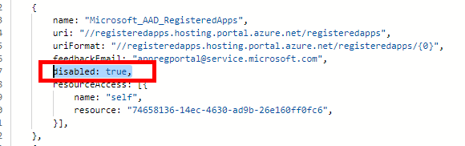
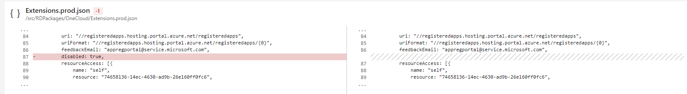

## Process Details

To add an extension to the Portal, send a pull request, as specified in [top-extensions-publishing.md](top-extensions-publishing.md).

To enable an extension, remove the `disabled` parameter from the json file that contains the description of the extension.

 The pull request allows you to compare the current file and the proposed proposed changes to ensure that the enabling of the extension is correct previous to creating the pull request, as in the following example.

An example of a pull request that puts the extension immediately into the enabled state is located at [https://msazure.visualstudio.com/One/_git/AzureUX-PortalFx/pullrequest/909233?_a=overview](https://msazure.visualstudio.com/One/_git/AzureUX-PortalFx/pullrequest/909233?_a=overview).

An example of a pull request that enables the `HDInsight` extension in the Mooncake environment and increases the extension test is located at [https://msazure.visualstudio.com/One/Azure%20Portal/_git/AzureUX-PortalFx/commit/062ccb2ed5c5a8a086877e2d61dd6009242f17fc?refName=refs%2Fheads%2Fdev](https://msazure.visualstudio.com/One/Azure%20Portal/_git/AzureUX-PortalFx/commit/062ccb2ed5c5a8a086877e2d61dd6009242f17fc?refName=refs%2Fheads%2Fdev).

The following is an example of a pull request for registering a `Scheduler` extension in the Fairfax environment.
[https://msazure.visualstudio.com/One/Azure%20Portal/_git/AzureUX-PortalFx/commit/459608f61d5c36864affafe6eb9d230655f67a29?refName=refs%2Fheads%2Fdev](https://msazure.visualstudio.com/One/Azure%20Portal/_git/AzureUX-PortalFx/commit/459608f61d5c36864affafe6eb9d230655f67a29?refName=refs%2Fheads%2Fdev).

### Service Level Agreements for deployment

As per the safe deployment mandate, all the configuration changes are treated as code changes. Consequently, they use similar deployment processes.

All changes that are checked in to the dev branch will be deployed in the following order: Dogfood -> RC -> MPAC -> PROD-> National Clouds (FairFax, and Mooncake). The table located at in [top-extensions-svc-lvl-agreements.md](top-extensions-svc-lvl-agreements.md) specifies the amount of time allowed to complete the deployment.

### Expediting deployment

To deploy expedited changes, developers can send a pull request for each branch in the Portal repository, i.e., Dogfood, MPAC and Production. How to send the pull request is specified in  [top-extensions-publishing.md](top-extensions-publishing.md).

Typically, all pull requests are for the Dev branch. When a pull request for an environment is marked as complete, the specified commit can be cherry-picked from that environment and included in a pull request for the next branch. The dev branch is followed by the **Dogfood** branch, which in turn is followed by the **MPAC** branch and finally the production branch.

If the pull request is not sent in the specified order, or if the commit message is changed, then unit test failure may occur. In this case, the changes that are associated with the extension will be reverted without notice.

The SLA for deploying configuration changes to all regions in the Production Environment is in the table specified in [top-extensions-svc-lvl-agreements.md](top-extensions-svc-lvl-agreements.md).

As per the safe deployment mandate, deployment to production environment is performed in stages, where each stage is a logical grouping of regions. There are five stages in the production environment. There is a 24-hour wait period between promoting the build from one batch to another. This implies that the minimum time to deploy a change in all regions in Production branch is five days.

### Receiving notifications when changes are deployed

After the commit has been associated with a workitem, the developer will receive a notification when the config change is deployed to each region.

When the development team wants to subscribe to these changes, ask them to make a comment on the workitem. After they have made changes, they will start receiving the notifications.
