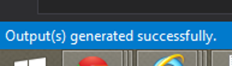

<a name="faqs-for-debugging-extensions"></a>
## FAQs for Debugging Extensions

<a name="faqs-for-debugging-extensions-ssl-certificates"></a>
### SSL certificates

   <!-- TODO:  FAQ Format is ###Link, ***title***, Description, Solution, 3 Asterisks -->
   
***How do I use SSL certs?***
 
SSL Certs are relevant only for teams that host their own extensions.  Azure Portal ONLY supports loading extensions from HTTPS URLs. Use a wildcard SSL cert for each environment to simplify maintenance, for example,   ``` *.<extensionName>.onecloud-ext.azure-test.net  ``` or  ``` *.<extensionName>.ext.azure.com) ``` .    To simplify overall management when your team is building separate, independent extensions, you can also use  ``` <extensionName>.<team>.ext.azure.com ``` and create a wildcard SSL cert for  ``` *.<team>.ext.azure.com ```. Internal teams can create SSL certs for the DogFood environment using the SSL Administration Web page that is located at [http://ssladmin](http://ssladmin). 
 
 Production certs must follow your organization’s PROD cert process. 

 **NOTE**: Do not use the SSL Admin site for production certs.

* * *

<a name="faqs-for-debugging-extensions-loading-different-versions-of-an-extension"></a>
### Loading different versions of an extension

***How do I load different versions of an extension?***

Understanding which extension configuration to modify is located at [portalfx-extensions-configuration-overview.md#(#configuration-file-locations-and-structure](portalfx-extensions-configuration-overview.md#(#configuration-file-locations-and-structure).

* * * 

<a name="faqs-for-debugging-extensions-checking-the-version-of-a-loaded-extension"></a>
### Checking the version of a loaded extension

***I have set ApplicationContext.Version for my extension, how do I check what version of my extension is currently loaded in shell ?***

1.  Navigate to the Portal where your extension is hosted or side loaded.
1. Press F12 in the browser and select the console tab.
1. Set the current frame dropdown to that of your extension.  If it's not obvious, for example, if the extension is running in a web worker, select one of the values in the dropdown and run MsPortalFx.getEnvironmentValue("`<extensionName>`") to determine the context.
1. In the console type `fx.environment.version` and click enter to see the version of the extension on the client, as in the following image.

    

1. In addition, any requests that are made to the extension, including **Ajax** calls, should also return the version on the server in the response, as in the following image.

    

  **NOTE**: There  can be a difference in the `fx.environment.version` on the client and the version in the `x-ms-version` returned from the server.  This can occur when the user starts a session and the extension is updated/deployed while the session is still active.

* * *

<a name="faqs-for-debugging-extensions-onboarding-faq"></a>
### Onboarding FAQ

***Where are the onboarding FAQs for Sparta (ARM/CSM-RP)?***

The SharePoint Sparta Onboarding FAQ is located at [http://sharepoint/sites/AzureUX/Sparta/SpartaWiki/Sparta%20Onboarding%20FAQ.aspx](http://sharepoint/sites/AzureUX/Sparta/SpartaWiki/Sparta%20Onboarding%20FAQ.aspx).

* * *

 ### Compile on Save

**What is Compile on Save ?**

Compile on Save is an option in VS **TypeScript** Project Properties that allows the developer to compile  `.ts` files when they are saved to disk. To use it, make sure that **TypeScript** 2.3.3 was installed on your machine. The version can be verified by executing the following  command.

```bash
$>tsc -version
```
Then, verify that when a **TypeScript** file is saved, that the following text is displayed in the bottom left corner of the **Visual Studio** application.



 * * *
 
<a name="faqs-for-debugging-extensions-other-debugging-questions"></a>
### Other debugging questions

***How can I ask questions about debugging ?***

You can ask questions on Stackoverflow with the tag [ibiza](https://stackoverflow.microsoft.com/questions/tagged/ibiza).

