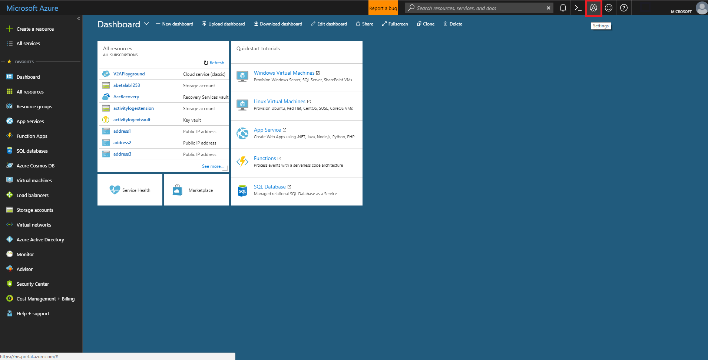
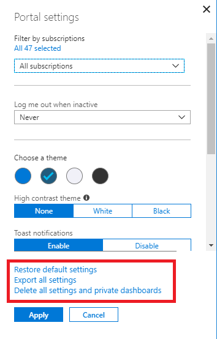

# Azure Portal: GDPR compliance

## Overview

In May 2018, a European privacy law, the General Data Protection Regulation (GDPR), is due to take effect. The GDPR imposes new rules on companies, government agencies, non-profits, and other organizations that offer goods and services to people in the European Union (EU), or that collect and analyze data tied to EU residents. The GDPR applies no matter where you are located.
Microsoft products and services are available today to help you meet the GDPR requirements. Read more about Microsoft Privacy policy at [Trust Center](https://www.microsoft.com/en-us/trustcenter).

Azure Portal creates or captures the following data, which can contain EUII.

* Azure Portal Dashboards
* User settings eg: Favorite Subscriptions or Directories, Last logged in Directory
* Themes and Customizations

GDPR compliance for Azure Portal can be reached in two ways.

1. Use the Export option.

1. Delete User Settings and Dashboards.

We strongly recommend the verifying the data by using option 1, previous to using option 2, because it will be time consuming to rebuild the dashboards and re-add customizations.

### Portal Dashboard Settings

The following are the instructions for the Portal Dashboard Settings options.

When a user logs in to https://portal.azure.com, they are presented with the following screen.

The user should use the settings gear in the top-right of the screen to display their settings for the Portal, as in the following image.

The user settings are as follows.

* Restore default settings

    Clicking on this item will restore the user experience to the Portal defaults.

* Export all settings

    Clicking on this item will create a .json file that contains the user settings.  The user can save the file in the **File Open** document dialog, or manipulate it as appropriate.  It contains settings like the dashboard theme.  For example, double-clicking on the Portal dashboard will change the theme colors.

* Delete all settings and private dashboards

    Clicking on this item will delete all links to private dashboards and other user customizations to the Portal dashboard.

For more information about the Azure Portal, see [Stackoverflow](https://stackoverflow.microsoft.com).
