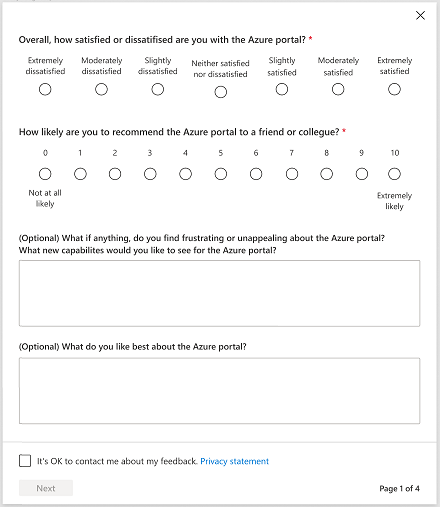
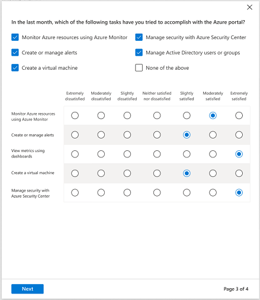

<a name="happiness-tracking-surveys-hats"></a>
# Happiness Tracking Surveys (HaTS)

HaTS is an in-product survey with a variety of questions aimed at collecting attitudinal data at a large scale directly in the product and over time. It elicits overall product perception, and some specific product area perceptions. This way the team can track customer perception of changes and improvements to the product and see if it is overall hurting or helping


<a name="happiness-tracking-surveys-hats-how-is-hats-implemented"></a>
### How is HaTS implemented?
HaTS follows a funnel approach, meaning the questions go from broad to specific, to avoid order effects. The first questions ask about the product as a whole and are important to build rapport with the respondent. The questionnaire then presents product specific questions, including asking them to rate attributes and give specific feedback on tasks. Rating scale questions are to remain unlabeled with numbers so respondents focus on the meaning of the answer options. Open-ended questions are added to allow for qualitative explanatory “why” data.

The questionnaire ends with specific segmentation questions.

<a name="happiness-tracking-surveys-hats-how-is-hats-implemented-example"></a>
##### Example


<a name="happiness-tracking-surveys-hats-tasks-overview"></a>
### Tasks Overview
A portion of the HaTSurvey prompts the user to select up to 5 portal tasks the user may have completed and to provide a rating.  Relevant tasks are determined and prioritized based on blade/extension usage over the last 14 days.



<a name="happiness-tracking-surveys-hats-how-to-contribute-list-of-tasks"></a>
### How to contribute list of tasks
Extension owners can participate in the survey by contributing a prioritized list of extension specific tasks and checking these files into their respective repo.  The following two files should be included in ExtensionName\Extension\Client folder.


> **Note**: Make sure to put a clear identifier in the key for your task name, as this is how we will be able to identify your task in the HaTs dashboard (e.g task_task1_ExtensionName_TaskName) as seen below.


<a name="happiness-tracking-surveys-hats-how-to-contribute-list-of-tasks-hatsresources-resjson"></a>
##### HatsResources.resjson

```json
{
    "tasks_task1_HubsExtension_FindSpecificResource_DisplayName": "Try to find a specific Azure resource",
    "tasks_task2_HubsExtension_PerformBulkCommandAction_DisplayName": "Perform a bulk action (example: delete) on multiple resources",
    "tasks_task3_HubsExtension_ManageTags_DisplayName": "Manage tags for Azure resources",
    "tasks_task4_CreateUIDef_DeployCustomTemplate_DisplayName": "Deploy a custom template",
    "tasks_task5_HubsExtension_AuthorQueryinARG_DisplayName": "Author a query with Azure Resource Graph Explorer"
}
```
<a name="happiness-tracking-surveys-hats-how-to-contribute-list-of-tasks-extensionsurvey-pdl"></a>
##### ExtensionSurvey.pdl

```xml
<?xml version="1.0" encoding="utf-8" ?>
<Definition xmlns="http://schemas.microsoft.com/aux/2013/pdl">
  <!-- Priority sets the order of importance for the survey task/question -->
  <!-- DisplayName must follow the following format: "Tasks.Task<Priority>.displayName" -->
  <Survey>
    <SurveyTask DisplayName="{Resource Tasks.Task1.HubsExtension.FindSpecificResource.displayName, Module=HatsResources}"
                Priority="1" />
    <SurveyTask DisplayName="{Resource Tasks.Task2.HubsExtension.PerformBulkCommandAction.displayName, Module=HatsResources}"
                Priority="2" />
    <SurveyTask DisplayName="{Resource Tasks.Task3.HubsExtension.ManageTags.displayName, Module=HatsResources}"
                Priority="3" />
    <SurveyTask DisplayName="{Resource Tasks.Task4.CreateUIDef.DeployCustomTemplate.displayName, Module=HatsResources}"
                Priority="4" />
    <SurveyTask DisplayName="{Resource Tasks.Task5.HubsExtension.AuthorQueryinARG.displayName, Module=HatsResources}"
                Priority="5" />
  </Survey>
</Definition>
```

If using an alternate file location, update the pdl Module definition.
<a name="happiness-tracking-surveys-hats-how-to-contribute-list-of-tasks-example-1"></a>
##### Example:

```xml
    <SurveyTask DisplayName="{Resource Tasks.Task5.HubsExtension.AuthorQueryinARG.displayName, Module=AlternateFolder\HatsResources}"
                Priority="1" />
```

