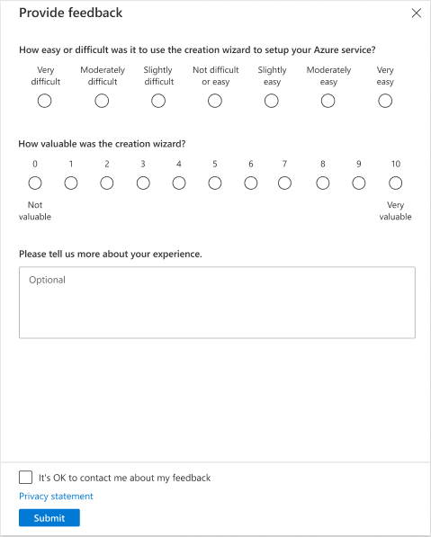

<a name="in-product-feedback"></a>
# In product feedback

Feature-based feedback surveys are used to measure customer effort score (CES) and customer value add (CVA).  Based on the Gartner model, CES is a key predictor of customer retention and a customer's increase in spending.

Customers are busy. They expect and want their interactions with your service to be easy, fast, and valuable. Use the customer effort score to ensure you’re meeting their expectations and to identify new opportunities that will improve their experience.


<a name="in-product-feedback-what-s-in-the-survey"></a>
### What&#39;s in the survey
The survey consists of two questions that are always prefixed with:
1.  How difficult or easy was it...
2.  How valuable was...

English strings are validated to ensure questions are formatted correctly.  Each question is then followed by a rating scale which the user must complete before submitting the feedback.  Users my also choose to provide additional comments.

<a name="in-product-feedback-what-s-in-the-survey-example"></a>
#### Example



<a name="in-product-feedback-when-to-ask-for-feedback"></a>
### When to ask for feedback

A good design prompts for feedback immediately after the user has completed a specific task.  Prompts that are always on and within the context of multiple tasks can lead to an accurate response.

<a name="in-product-feedback-how-to-ask-for-feedback"></a>
### How to ask for feedback

Use a Status Bar, Command Bar, or a Notification that prompts for feedback.  A good practice is to keep the text neutral, for example: "Send us your feedback"


<a name="in-product-feedback-how-to-use-the-inproductfeedbackblade-ipf"></a>
### How to use the InProductFeedbackBlade (IPF)

The IPF blade is designed and optimized for use within a context pane.  The blade requires 6 parameters that will also be used for reporting:
- featureName
- surveyId
- bladeName
- extensionName
- cesQuestion
- cvaQuestion

<a name="in-product-feedback-how-to-use-the-inproductfeedbackblade-ipf-implementation-example"></a>
#### Implementation Example

```typescript
const bladeName = "Your_Blade";
const extensionName = "Your_Extension";

container.openContextPane(BladeReferences.forBlade("InProductFeedbackBlade").createReference({
    parameters: {
        bladeName,
        cesQuestion: inProductFeedbackClientStrings.cesQuestion,
        cvaQuestion: inProductFeedbackClientStrings.cvaQuestion,
        extensionName,
        featureName: "Your_FeatureName",
        surveyId: "FeatureName+Date",
    },
    onClosed: (reason: BladeClosedReason) => {
        if (reason === BladeClosedReason.ChildClosedSelf) {
            container.statusBar(null);
        }
    },
}));
```

<a name="in-product-feedback-how-to-review-the-results"></a>
### How to review the results
Feedback results are available via the [IPF Dashboard](https://msit.powerbi.com/groups/4f11aaa4-1faf-4bf3-9983-1dc7351bf5b6/reports/64b8df41-a76b-4b7d-af5c-5b67c165ed64?ctid=72f988bf-86f1-41af-91ab-2d7cd011db47).

Survey results are also available in Kusto.

```js

cluster('azportalpartner').database('AzurePortal').ClientTelemetry
| where source  == 'InProductFeedbackBlade'
| where action == 'InProductFeedbackSubmit'
| where extension == 'HubsExtension'
| extend featureExtensionName = extractjson("$.extensionName", ['data'])
| extend featureBladeName = extractjson("$.bladeName", ['data'])
| extend CESValue = extractjson("$.CESValue", ['data'], typeof(decimal ))
| extend CVAValue = extractjson("$.CVAValue", ['data'], typeof(decimal ))
| extend comments = extractjson("$.comments", ['data'])
| extend featureName = extractjson("$.featureName", ['data'])
| extend surveyId = extractjson("$.surveyId", ['data'])
| extend validStringFormat = extractjson("$.validStringFormat", ['data'])
| extend mayContact = extractjson("$.mayContact", ['data'])
| project PreciseTimeStamp, featureName, surveyId, featureExtensionName, featureBladeName, CESValue, CVAValue, comments, validStringFormat, userId, mayContact

```
