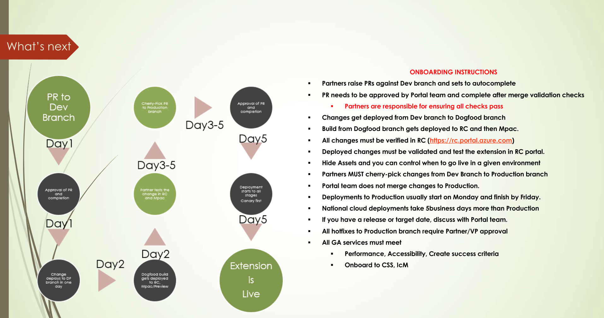
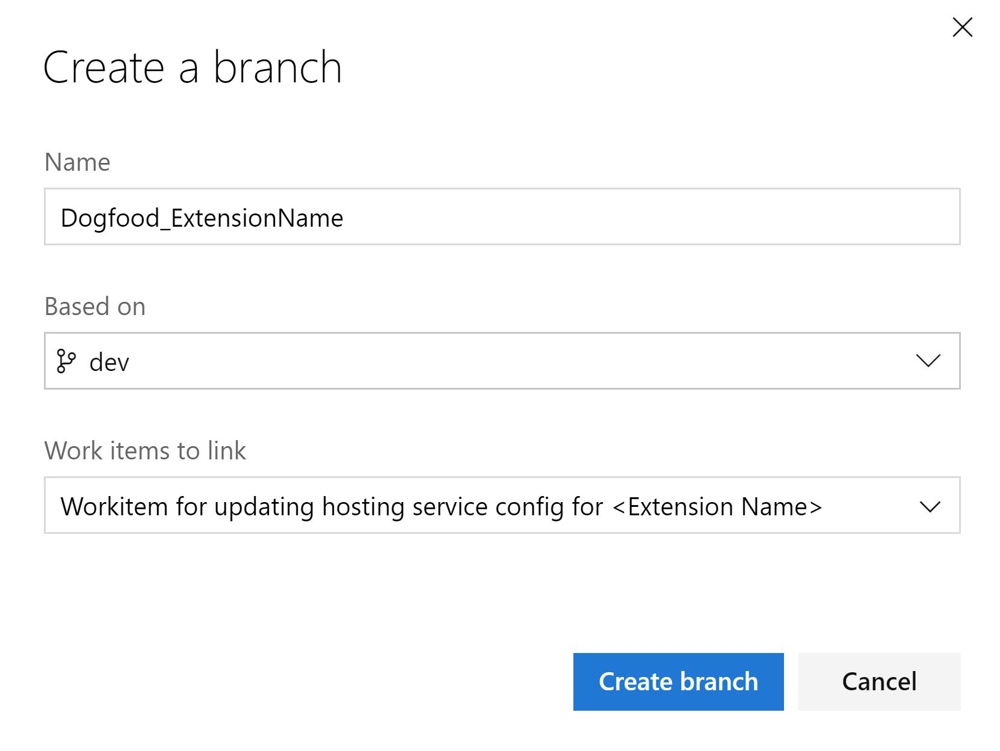
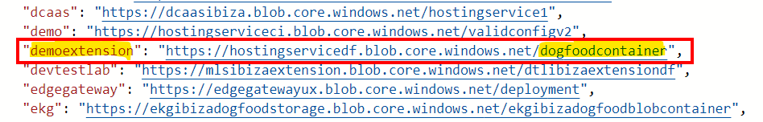
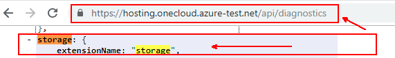
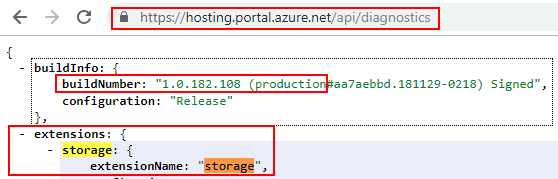
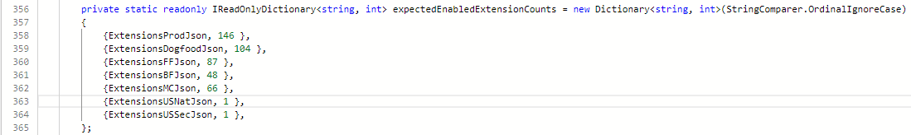
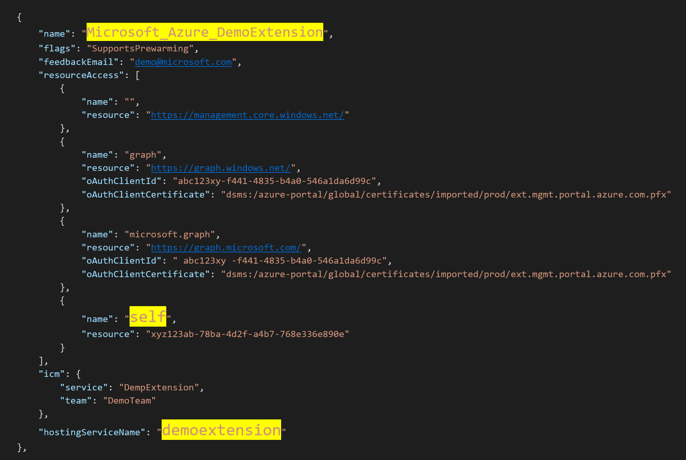
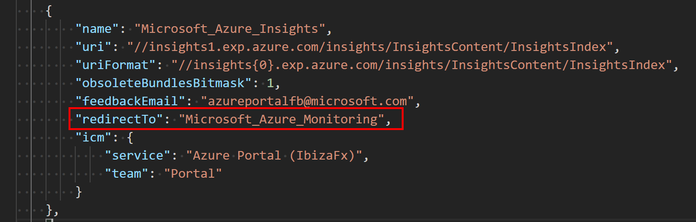
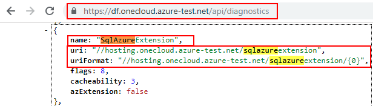
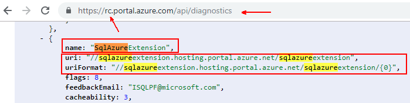

<a name="portal-extensions"></a>
<a name="portal-extensions"></a>
# Portal Extensions

<a name="portal-extensions-introduction"></a>
<a name="portal-extensions-introduction"></a>
## Introduction

If you are working on an Azure service and want to expose UI to your customers in the Azure portal then this is the right starting point. The portal has an extension model where each team that builds UI creates and deploys an extension. This process requires a relationship to be established between your team and the central portal team. This document walks you through the process of onboarding your team and starting that relationship.

<a name="portal-extensions-step-by-step-process-overview"></a>
<a name="portal-extensions-step-by-step-process-overview"></a>
## Step by Step Process overview

Onboarding a service, or developing a Portal extension, has three phases: onboarding, development, and deployment. The process is specified in the following image.


<a name="phase-1-onboarding"></a>
<a name="phase-1-onboarding"></a>
# Phase 1 - Onboarding

<a name="phase-1-onboarding-kickoff-meeting"></a>
<a name="phase-1-onboarding-kickoff-meeting"></a>
## Kickoff Meeting

There are lots of docs here. We recommend you send mail to [ibiza-onboarding@microsoft.com](<mailto:ibiza-onboarding@microsoft.com?subject=Kickoff Meeting Request&body=My team would like to meet with you to learn about the Azure onboarding process.>) and request a kickoff meeting. Someone from our team will spend 30 minutes walking through the process at a high level. We can point you in the right direction regarding the latest patterns and practices. We can also answer any questions you have. Finally, we can talk about how the relationship between our teams is managed.

<a name="phase-1-onboarding-onboard-with-related-teams"></a>
<a name="phase-1-onboarding-onboard-with-related-teams"></a>
## Onboard with related teams

Onboarding to Azure all up is a big task that spans many teams. The doc you are reading will help you onboard to the portal, but there are many other teams you will need to work with to get your entire service up and running. These include, but are not limited to the following teams:

1. Azure Resource Manager Team - Vlad Joanovic

     Reach out to this team to onboard your resource provider.
    <!--TODO: Locate distribution list for this purpose.  -->

1. Azure Marketing Team – Hamid Mahmood

   To ensure that the business goals of the new extension or service are aligned with Azure's business strategy, please reach out to the Integrated Marketing Team or the L&R - Operations - GD&F team at <a href="mailto:ibiza-bmr@microsoft.com?subject=Azure Business Model Review">ibiza-bmr@microsoft.com</a>. Brian Hillger’s team and Stacey Ellingson’s team will guide you through the business model review process. The extension or service is not ready to be onboarded to Azure until its business model has received approval from those teams. Do not proceed with the next step until the business model has received approval.

1. Support Team  – Michael Fosmire

   For integrating with the support system and UX integration.

1. Azure.com team

   For a presence on the marketing site.

1. Billing team – Vikram Desai

   To register meters and other billing related activities.

1. AAD onboarding

   Reach out to AAD onboarding if the new extension service needs special permissions besides just calling your own resource provider servers.  If the extension requires additional built-in support for standard Graph or ARM APIs, submit a partner request at the site located at [https://aka.ms/portalfx/uservoice](https://aka.ms/portalfx/uservoice).

1. Azure fundamentals and compliance  – Angie Wilson

    The Azure Fundamentals are a set of tenets to which each Azure service is expected to adhere. The Azure Fundamentals program is described in the document located at [https://aka.ms/azurefundamentals](https://aka.ms/azurefundamentals). The document also identifies the stakeholders and contacts for each of the tenets.

1. Security and privacy reviews  – Paul Mattson

1. Start the CSS onboarding process with the CSS team at least three months previous to public preview. This process may coincide with the following step. For more information about development phases, see [top-extensions-developmentPhases.md](top-extensions-developmentPhases.md).

1. Decide on a name and URLs for the extension.  You may need to contact emailing <a href="mailto:ibiza-onboarding@microsoft.com?subject=Name and URLs for new Extension">ibiza-onboarding@microsoft.com</a> to ensure that the name and URL's are unique.

1. Schedule a UX feasibility review with the Ibiza team UX contact by emailing <a href="mailto:ibiza-onboarding@microsoft.com?subject=Extension Feasibility Review">ibiza-onboarding@microsoft.com</a>.  Many extensions have been made more successful by setting up early design reviews with the Azure Portal team. Taking the time to review the design gives extension owners an opportunity to understand how they can leverage Azure Portal design patterns, and ensure that the desired outcome is feasible.

While the portal team cannot help directly with all of these factors, see [portalfx-extensions-contacts.md](portalfx-extensions-contacts.md) for a list of items with which we can assist you.

For less common scenarios, you might need to do a custom deployment. For example, if the extension needs to reach server services using certificate based authentication, then there should be controller code on the server that our hosting service does not support. You should be very sure that  a custom hosting solution is the correct solution previous to developing one.

<a name="phase-1-onboarding-join-dls-and-request-permissions"></a>
<a name="phase-1-onboarding-join-dls-and-request-permissions"></a>
## Join DLs and request permissions

Request the following permissions to stay current on product roadmaps, get news on latest features, and read workshop announcements.

* PMs and Developer Leads need to join the `ibizapartners PM`  group by clicking on this link: [https://idwebelements/GroupManagement.aspx?Group=ibizapartners-pm&Operation=join](https://idwebelements/GroupManagement.aspx?Group=ibizapartners-pm&Operation=join).

* Developers should join the  `ibizapartners DEV` group by clicking on this  link:  [https://idwebelements/GroupManagement.aspx?Group=ibizapartners-dev&Operation=join](hhttps://idwebelements/GroupManagement.aspx?Group=ibizapartners-dev&Operation=join).

* Developers should join the appropriate group listed on [https://aka.ms/standardaccess](https://aka.ms/standardaccess) to get access to portal telemetry. All groups on this page receive access.

* Developers should join the  `Azure Portal Partner Contributors - 19668(19668)` group by using this link: [https://myaccess](https://myaccess).

* PMs, Developers, and Developer Leads should subscribe to the partner request process by joining the ```Uservoice ``` group at this link:  [https://aka.ms/portalfx/uservoice](https://aka.ms/portalfx/uservoice). For more information about the partner request process, see [top-extensions-partner-request.md](/portal-sdk/generated/top-extensions-partner-request.md).

* PMs, Developers, and Developer Leads should receive notifications on breaking changes by joining the ```ibizabreak ``` group at  this  link:  [https://idwebelements/GroupManagement.aspx?Group=ibizabreak&Operation=join](https://idwebelements/GroupManagement.aspx?Group=ibizabreak&Operation=join).

* PMs, Developers, and Developer Leads  should join Stackoverflow Forums that are located at [https://stackoverflow.microsoft.com](https://stackoverflow.microsoft.com)  to let us know if you have any questions. Remember to tag questions with ```ibiza``` or related tag.  For more information about the supported tags that are monitored by the Ibiza team, see [portalfx-stackoverflow.md].

* Developers who want to contribute to the Azure documentation or test framework should join groups from the site located at [https://aka.ms/azuregithub](https://aka.ms/azuregithub).

Ask an onboarding question on [Stackoverflow](https://stackoverflow.microsoft.com/questions/tagged/ibiza-onboarding).

<a name="phase-1-onboarding-get-the-sdk-docs-and-samples-to-your-developers"></a>
<a name="phase-1-onboarding-get-the-sdk-docs-and-samples-to-your-developers"></a>
## Get the SDK, docs, and samples to your developers

 The [development guide](top-extensions-getting-started.md) located in the main documentation index has all the right pointers.

<a name="phase-2-development"></a>
<a name="phase-2-development"></a>
# Phase 2 - Development

<a name="phase-2-development-develop-your-extension"></a>
<a name="phase-2-development-develop-your-extension"></a>
## Develop your extension

 The [development guide](top-extensions-getting-started.md) located in the main documentation index has all the right pointers.

<a name="phase-2-development-learn-about-the-hosting-service-plan-your-deployment-strategy"></a>
<a name="phase-2-development-learn-about-the-hosting-service-plan-your-deployment-strategy"></a>
## Learn about the hosting service / plan your deployment strategy

The Ibiza team provides and operates a common extension hosting service that makes it easy to get your extension into a globally distributed system without having to manage your own infrastructure. For more information see [top-extensions-hosting-service.md](top-extensions-hosting-service.md).

For less common scenarios, you might need to do a custom deployment.

For example, if you need to talk to backend services using certificate-based authentication then you'll need controller code on the server. This is not supported with our hosting service. You should be very sure you require a custom hosting solution before going down this path.

**NOTE**: The deployment can be configured in such a way that the client portion of the extension uses the hosting service while the custom controller code can be deployed separately.
For more information, see [top-extensions-custom-deployment.md](top-extensions-custom-deployment.md).

<a name="phase-2-development-register-the-extension-with-the-portal-product-configuration"></a>
<a name="phase-2-development-register-the-extension-with-the-portal-product-configuration"></a>
## Register the extension with the portal product configuration

Once the name of the extension is finalized, it is time to register the extension in all environments. This requires a portal deployment and can take time. Our Service Level Agreements are located at [top-extensions-svc-lvl-agreements.md](top-extensions-svc-lvl-agreements.md).  Please plan accordingly.

* For internal partners, the request to register an extension is a pull request, as specified in [top-extensions-publishing.md](top-extensions-publishing.md).

* External teams can submit their requests by reaching out to the <a href="mailto:ibizafxpm@microsoft.com?subject=Onboarding Request: Add <extensionName> to the Portal&body=Extension Name:  <br><br>Company:  <br><br>Brand or Suite:  <br><br>Product or Component:  <br><br> URLs: <br><br>Production: main.<extensionName>.ext.<company>.com<br><br>  Contact info: <br><br>Business Contacts <br><br> Dev leads: <br><br> PROD on-call email for live site incidents: <br><br>">ibizafxpm team</a> with an onboarding request.

* **NOTE**: Extension names must use standard extension name format, as in the example located [here](/portal-sdk/generated/top-extensions-configuration.md#configuration-file-locations-and-structure).

* **NOTE**:  Extension URLs adhere to the naming requirements located in [portalfx-extensions-cnames.md](portalfx-extensions-cnames.md).

* Enable the extension in all environments.

<a name="phase-3-deployment"></a>
<a name="phase-3-deployment"></a>
# Phase 3 - Deployment

<a name="phase-3-deployment-release-kind"></a>
<a name="phase-3-deployment-release-kind"></a>
## Release kind

There are three typical release kinds: private preview, public preview, and Global Availability (GA). For the purposes of deployment public preview and GA are the same. The only difference is that the UI may show preview labels and disclaimers where appropriate. For more information about the three kinds of releases, see  [top-extensions-developmentPhases.md](top-extensions-developmentPhases.md).

<a name="phase-3-deployment-private-preview"></a>
<a name="phase-3-deployment-private-preview"></a>
## Private preview

For a private preview, the goal is to hide your experience to the general public, but show it to a limited audience. This procedure assumes that the discoverable entry point in the product is the All Services menu, also known as the Browse menu.

Hiding or showing items in the all services menu is controlled by the extension configuration that gets deployed with your extension. The following  example shows how to set it up.
<!--
TODO - Example here - Add after the feature is ready (ETA is March or April) -->

When in the hidden state, users will not be able to browse to or search for the entry point of the extension. However, you can distribute a special link like the following one that enables the entry point by using a feature flag.

<!--
TODO - Example here - Add after the feature is ready (ETA is March or April)
-->

A few notes about this path:
* Any user that receives this URL will be able to see your entry point.
* Any users who receives a deep link to blades within your extension will be able to see that experience even without the feature flag
* If the extension is integrated into the Marketplace, then that team has its own way of hiding Marketplace items. Contact <a href="mailto:1store@microsoft.com?subject=Integrating a New Extension into the Marketplace">1store@microsoft.com </a> for more details.

<a name="phase-3-deployment-public-preview-or-ga"></a>
<a name="phase-3-deployment-public-preview-or-ga"></a>
## Public preview or GA

You are required to check the quality of your extension. We have standardized ways of measuring reliability and performance at key areas. If you have a private preview then we have already collected this data for you.

There is no blocking exit criteria, which means you do not have to prove that the extension's performance and reliability are in the required range. However, once you ship, the Portal team will monitor the quality of the extension. Extensions that do not meet the required quality bar will be flagged in executive reviews and will be asked to improve their quality as soon as possible.

When you are ready for all users to see your experience, you will enable your entry point as shown in the following example and then deploy your extension.

<a name="steps-to-portal-onboarding"></a>
<a name="steps-to-portal-onboarding"></a>
# Steps to Portal onboarding

Azure portal onboarding steps listed below assumes that all new services have completed the onboarding meeting with [ibiza-onboarding@microsoft.com](mailTo:ibiza-onboarding@microsoft.com) team and that you have downloaded the Azure portal SDK to start the development of your extension. If you have not had either the onboarding meeting or have developed the extension, please discuss with the Azure portal team on the requirements.

<a name="steps-to-portal-onboarding-pre-onboarding-checks"></a>
## Pre-Onboarding Checks

1) As a partner team, please take a moment to understand the different branches we have in Azure portal. We have

2) Understand the deployment schedules and [SLAs](top-extensions-svc-lvl-agreements.md) for Portal framework and Hosting service repositories.

3) Portal team has a process of freezing deployments during special events like //build //Ignite //Inspire etc. Any changes to Production branch will NOT be honored during this freeze time. Please plan your Preview/Release of your service accordingly.

4) Portal team does an automatic merge from Dogfood branch to Mpac and Mpac to Production during special events like conferences. During all other times, partners MUST always cherry-pick the changes from Dev branch to Production branch for the respective changes to go live.

5) National cloud deployments take 2 weeks more than Production branch.

6) Always work with Azure portal onboarding contact about your release dates before you commit timelines to release the product or any Marketing communications.

7) All exceptions to bypass SLAs and fasttrack deployments will require Partner level approval on both sides. All exception during major events will require VP level approval.



Note : Step 1 and Step 2 below are sequential and required to complete the Portal onboarding. Step 3 is optional unless the onboarding service requires dedicated tokens.

<a name="steps-to-portal-onboarding-step-1-hosting-service"></a>
<a name="steps-to-portal-onboarding-step-1-hosting-service"></a>
## Step 1 - Hosting Service

To use the Extension Hosting Service after you have developed your extension, you will have to onboard onto the Extension Hosting service separately. You will have to follow the steps in [this document](/portal-sdk/generated/top-extensions-hosting-service.md#) to have your extension to be ready for deploying onto the hosting service. The reason we have the steps below is to let you do these things in parallel. Developers should join the  `Azure Portal Partner Contributors - 19668(19668)` group by using this link: [https://myaccess](https://myaccess).
1) Create storage account for each environment
eg: Dogfood, Prod, Mooncake, and Fairfax
2) Create a container under the storage account with anonymous read access


3) Upload the [config.json](/portal-sdk/generated/top-extensions-hosting-service.md#step-6-upload-safe-deployment-config) and the [generated zip file](/portal-sdk/generated/top-extensions-hosting-service.md#step-1-generate-hosting-service-versioned-zip-file) from your build.

**NOTE**:  You can make changes to hosting service configuration and raise a pull request for a self-service onboarding to hosting service

4) Create a new branch in the [hosting service repository](https://msazure.visualstudio.com/One/_git/AzureUX-PortalHostingSvc/branches) based on the dev branch



5) Update the hosting service configuration for appropriate environment(eg: [config.dogfood.json](https://msazure.visualstudio.com/One/_git/AzureUX-PortalHostingSvc?path=%2Fsrc%2FRDPackages%2FExtensionHost%2Fconfig.dogfood.json&version=GBdev),
[config.prod.json](https://msazure.visualstudio.com/One/_git/AzureUX-PortalHostingSvc?path=%2Fsrc%2FRDPackages%2FExtensionHost%2Fconfig.prod.json&version=GBdev),
[config.ff.json](https://msazure.visualstudio.com/One/_git/AzureUX-PortalHostingSvc?path=%2Fsrc%2FRDPackages%2FExtensionHost%2Fconfig.ff.json&version=GBdev),
[config.mc.json](https://msazure.visualstudio.com/One/_git/AzureUX-PortalHostingSvc?path=%2Fsrc%2FRDPackages%2FExtensionHost%2Fconfig.mc.json&version=GBdev) by editing and adding a new line for the [extension route prefix](https://github.com/Azure/portaldocs/blob/dev/portal-sdk/generated/top-extensions-hosting-service.md#step-1-generate-hosting-service-versioned-zip-file) entry in the "hostExtensionConfigs" section as shown below.



6) Commit and Create a pull request to the Dev Branch.
7) Create a hosting service onboarding [workitem](https://aka.ms/extension-hosting-service/onboarding) and this to the pull request.
8) Send email to [ibiza-onboarding@microsoft.com](mailTo:ibiza-onboarding@microsoft.com) with the workitem details and pull request id to get the approval.

Note:  Incorrect or insufficient information in the workitem could delay the onboarding process.

<a name="steps-to-portal-onboarding-how-to-verify-if-hosting-service-onboarding-is-complete"></a>
<a name="steps-to-portal-onboarding-how-to-verify-if-hosting-service-onboarding-is-complete"></a>
## How to verify if hosting service onboarding is complete?

1. Check Hosting Service API Diagnostics log for [Dogfood](https://hosting.onecloud.azure-test.net/api/diagnostics) or [Production](https://hosting.portal.azure.net/api/diagnostics) in web browser.
2. Press Ctrl+F to find your extension routeprefix that registered for your service. Eg: storage





<a name="steps-to-portal-onboarding-step-2-portal-framework"></a>
<a name="steps-to-portal-onboarding-step-2-portal-framework"></a>
## Step 2 - Portal Framework
1) Register your extension with Azure portal framework by raising a pull request to the appropriate extension config json. eg: [extensions.dogfood.json](https://msazure.visualstudio.com/One/_git/AzureUX-PortalFx?path=%2Fsrc%2FRDPackages%2FOneCloud%2FExtensions.dogfood.json&version=GBdev), [extensions.prod.json](https://msazure.visualstudio.com/One/_git/AzureUX-PortalFx?path=%2Fsrc%2FRDPackages%2FOneCloud%2FExtensions.prod.json&version=GBdev), [extensions.ff.json](https://msazure.visualstudio.com/One/_git/AzureUX-PortalFx?path=%2Fsrc%2FRDPackages%2FOneCloud%2FExtensions.ff.json&version=GBdev), [extensions.mc.json](https://msazure.visualstudio.com/One/_git/AzureUX-PortalFx?path=%2Fsrc%2FRDPackages%2FOneCloud%2FExtensions.mc.json&version=GBdev), etc,. If you are disabling the extension in the given environment(eg: "flags": "Disabled"), you do not have to increment the extension count.
2) If you are NOT using disabled flag, you must increment the extension count in [DeploymentSettingsTests.cs](https://msazure.visualstudio.com/One/_git/AzureUX-PortalFx?path=%2Fsrc%2FStbPortal%2FWebsite.Server.Tests%2FDeploymentSettingsTests.cs&version=GBdev)

3) Always raise the PR to the Dev branch
4) For Prod config chanages, once the PR is approved, please cherry pick the change to Prod after thoroughly testing the portal in MPAC. Portal team does not auto merge the changes to Production branches
5) Always cherry-pick the change from Dev to Prod branch. ***This is a new change to the cherry-picking process as we will deploy to Mpac by default from Dev branch.***
6) Here is a sample PR change for dogfood branch.

Note : Dogfood config does not require creating a CNAME entry for extensions as all extensions use the common DNS endpoint. Onboarding to Production config will require the CNAME created with route prefix.



7) [Hide all assets](portalfx-assets.md#how-to-hide-your-asset-in-different-environments) in your extension code before updating the framework config. By doing this, you can control when the assets can be shown and when you want to go live in Production.

8) Make sure all assets are hidden in portal.azure.com.json and ms.portal.azure.com.json within your extension's config folder and control showing assets only when required in the desired environments.

Note : Extension name cannot be changed once onboarding is complete. It will require a new onboarding and redirecting to the new extension.



<a name="steps-to-portal-onboarding-how-to-verify-if-portal-framework-onboarding-is-complete"></a>
<a name="steps-to-portal-onboarding-how-to-verify-if-portal-framework-onboarding-is-complete"></a>
## How to verify if portal framework onboarding is complete?

1. Add a comment in the workitem associated with the pull request to get notified of deployment.
2. Check [Commit Search](https://aka.ms/portalfx/commitsearch) with the commit id and [deployment pipeline](http://simonp-sites/pipeline).
3. If the changes are deployed you should find them in the API diagnostics log in respective branches [DF](https://df.onecloud.azure-test.net/api/diagnostics), [RC](https://rc.portal.azure.com/api/diagnostics), [MPAC](https://ms.portal.azure.com/api/diagnostics) or [PROD](https://portal.azure.com/api/diagnostics)





Note : Please DO NOT get the pull request approved, bypassed or completed without hosting service onboarding complete and required DNS entries created.

<a name="steps-to-portal-onboarding-step-3-aad-onboarding"></a>
<a name="steps-to-portal-onboarding-step-3-aad-onboarding"></a>
## Step 3 - AAD Onboarding
1) For teams that require Graph access and AAD app for per extension tokens, please create a [workitem](https://aka.ms/portalfx/newextension)
2) Any changes to the AAD app to add more permissions or reply URLs will require an additional workitem. Please schedule a meeting to go over the changes along with the onboarding
2) Send email to [ibiza-onboarding@microsoft.com](mailTo:ibiza-onboarding@microsoft.com) with the workitem details and extension details.

Here is the list of [graph endpoints](https://msft.spoppe.com/sites/Identity/MSODS/SitePages/AAD%20Environments.aspx) for different clouds

<!--
TODO - Add an example after the feature is ready (ETA is March or April )
-->

You can ask developer community questions on Stackoverflow with the tag [ibiza-onboarding](https://stackoverflow.microsoft.com/questions/tagged/ibiza-onboarding).

<!--
gitdown": "include-file", "file": "../templates/portalfx-extensions-glossary-onboarding.md"}
-->

<a name="steps-to-portal-onboarding-step-4-alerting-onboarding"></a>
## Step 4 - Alerting Onboarding

In order to ensure that all teams meet quality standard to be included in the Azure Portal, we require teams onboard to our out-of-the box alerting infrastructure. This will not require any deployment on your part, but only submitting a PR with a JSON configuration specifying your thresholds, which you can learn more about in our [alerting onboarding documentation](./top-telemetry-alerting.md)

The following alerts are required:
1. Extension SDK Age (automatically opted-in by default when onboarded to alerting)
1. Performance
1. Availability
