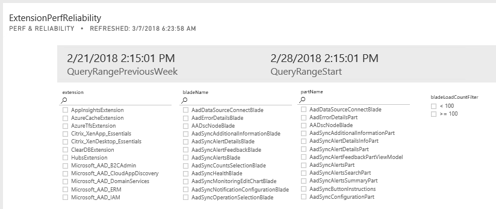
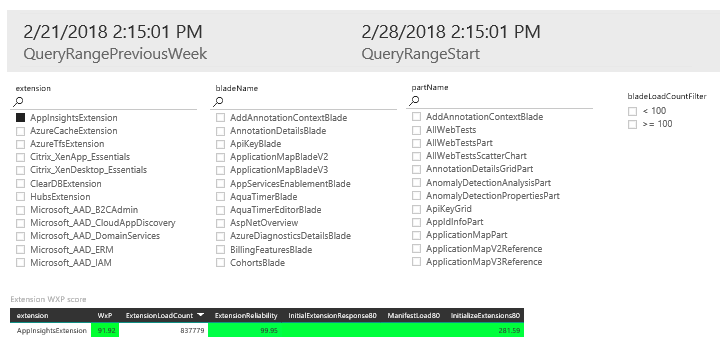
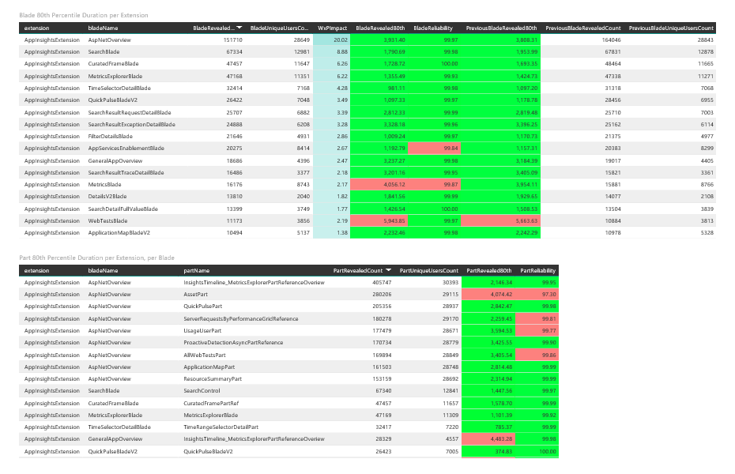

<a name="overview"></a>
## Overview

Performance statistics for several extensions are displayed on the PowerBi dashboard that is located at [http://aka.ms/portalfx/dashboard/extensionperf](http://aka.ms/portalfx/dashboard/extensionperf). You can select your extension, blade, and part(s) from the filters, as in the following image.



In the following example, the AppInsightsExtension has been selected for further examination. Its blades and parts are described, and its scores are below the list of parts.



Portal performance is the sum of the performance of all the experiences in the product or extension.  Portal performance from a customer's perspective is seen as all experiences throughout the product. For example, the blades and parts associated with the extension in the previous image are displayed in the following image. As a developer, you have a responsibility to  uphold your extension to the 95th percentile performance bar.



All extensions need to meet the minimum performance required to be  at the 95th percentile, as  in the following table.

| Area      |  Telemetry Action         | How is it measured? |
| --------- | ------------------------- | ------------------- |
| Extension   | ExtensionLoad          | The time it takes for your extension's home page to be loaded and the initial scripts, specifically, the initialize call, to complete within the  Extension definition file. |
| Blade     | BladeFullReady      | The time it takes for the blade's `onInitialize` or `onInputsSet` to resolve and all the parts on the blade to become ready. This means that it can display all of the data it has requested.  |
| Part      | PartReady              | Time it takes for the part to be rendered and then the part's `OnInputsSet` to resolve.   |
| WxP       |  N/A                      | The overall experience score, calculated by weighting blade usage and the blade full ready time. |

<!--| Extension | Initial Extension Response | TODO                | InitialExtensionResponse | TODO |
| Extension | Manifest Load              | TODO                | ManifestLoad             | TODO |
| Extension | Initialization             | TODO                | InitializeExtensions     | TODO | -->

<a name="extension-performance"></a>
## Extension performance

Extension performance is impacted by both Blade and Part performance, when the extension is loaded, when it is unloaded, and when it is required by another extension.

When a user visits a resource blade for the first time, the Portal  loads the extension and then requests the ViewModel.  This adds to the counts and times for the Blade and Part performance.

In addition, if the user were to browse away from the UI experience and browse back previous to the unloading of the extension, the load times for the second visit are faster because the UI does not have to re-load the entire extension.

<a name="blade-performance"></a>
## Blade performance

Blade performance is measured  around specific areas that are encapsulated under the `BladeFullReady` action. They are as follows.

1. The constructor
1. The call to the `OnInputsSet` method or the `onInitialize` method
1. Displaying parts within the blade


<a name="blade-performance-the-bladeperformanceincludingnetwork-method"></a>
### The BladePerformanceIncludingNetwork method

<!-- TODO:  Some, but not all of this, has been changed from 95% to 80%.  -->

The `BladePerformanceIncludingNetwork` function samples 1% of traffic in order to measure the number of network requests that are made throughout a session. Within the function, we correlate the count of any network requests that are made when the user is loading a specific blade. The function does not impact the markers that measure performance; however, a larger number of network requests typically results in slower performance. 

There is a known calculation issue with the current approach because the 95th percentile is reported as the summation of the 95th percentiles for `BladeFullReady` and the `getMenuConfig` call.

The subtle difference with the standard `BladeFullReady` marker is that if the blade is opened within a `ResourceMenu` blade, we include the time it takes to resolve the `getMenuConfig` promise when the `ResourceMenu` blade is loaded to the 95th percentile of the `BladeFullReady` duration. 

 In most cases the difference is insignificant because the `getMenuConfig` 95th percentile is less than < 10 milliseconds because it is static.  If your extension is drastically affected by the time it takes to load the `ResourceMenu` blade, its performance can be improved by making the menu statically defined.

<a name="part-performance"></a>
## Part performance

Part performance is measured  around specific areas that are encapsulated under the `PartReady` action. They are as follows.

1. The constructor
1. The call to the `onInitialize` method or the  `OnInputsSet` method

<a name="wxp-score"></a>
## WxP score

The WxP score is a per-extension Weight eXPerience score (WxP). It is expressed as a percentage and calculated as follows.

```txt

WxP = (BladeViewsMeetingTheBar * 95thPercentileBar) /
     ((BladeViewsMeetingTheBar * 95thPercentileBar) + 
     ∑(BladeViewsNotMeetingTheBar * ActualLoadTimePerBlade))

```

| Blade   | 95th Percentile Times | Usage Count | Meets 95th Percentile Bar? |
| ------- | --------------------- | ----------- | -------------------------- |
| Blade A | 1.2                   | 1000        | Yes                        |
| Blade B | 5                     | 500         | No                         |
| Blade C | 6                     | 400         | No                         |

```txt

WxP = (BladeViewsMeetingTheBar * 95thPercentileBar) /
     ((BladeViewsMeetingTheBar * 95hPercentileBar) +
     ∑(BladeViewsNotMeetingTheBar * ActualLoadTimePerBlade)) %   
      
   = (4 * 1000) / ((4 * 1000) + ((5 * 500) + (6 * 400))) %
    = 44.94%

```

The model counts the views that do not meet the bar and gives them a negative score.

<a name="assessing-blade-performance"></a>
## Assessing blade performance

There are two methods that are used to assess the performance of an extension. The PowerBi dashboard that is located at [http://aka.ms/portalfx/dashboard/extensionperf](http://aka.ms/portalfx/dashboard/extensionperf) measures blade, part, and extension performance, or you may run local Kusto queries to determine the numbers that are associated with extension performance.

For more information about telemetry, see [portalfx-telemetry-getting-started.md](portalfx-telemetry-getting-started.md).

**NOTE**: It is good practice to run queries locally by using the Azure-provided Kusto functions to calculate your assessment.

<a name="performance-profiling"></a>
## Performance profiling

<a name="performance-profiling-how-to-profile-your-scenario"></a>
### How to profile your scenario

1.	Open a browser and load the Portal using `https://portal.azure.com/?clientoptimizations=bundle&feature.nativeperf=true`.

    * The `clientOptimizations=bundle` flag allows you to assess which bundles are being downloaded in a user-friendly manner. For more information, see [top-extensions-debugging.md#toggling-optimizations](top-extensions-debugging.md#toggling-optimizations).

    * The `feature.nativeperf=true` feature  exposes native performance markers within the profile traces, which allows you to accurately match portal telemetry markers to the profile.

1. Go to a blank dashboard.

1. Clear cache by using a hard reset and reload the Portal.

1. Use the browser's profiling timeline to throttle both the network and the CPU, which  best reflects the 95th percentile scenario, and then start the Profiler.

1. Walk through your scenario.

    *	Switch to the dashboard that is associated with the scenario.

    *	Deep link to your blade. Make sure to keep the feature flags in the deep link. Deep-linking will isolate as much noise as possible from the profile.

1. Stop the Profiler.


<a name="identify-common-slowdowns"></a>
## Identify common slowdowns

Some of the main factors in extension performance are associated with network performance, extra bundled code, and overallocation of CPU resources to rendering and observables. The following guidelines may help you isolate areas in which extension performance can be improved.

1.	Blocking network calls

    You can identify Unnecessary network calls by using the scenarios located in [The BladePerformanceIncludingNetwork method](#the-bladeperformanceincludingnetwork-method).

1.	Heavy rendering and CPU from overuse of UI-bound observables

    Guidelines on how to use observables are located in [portalfx-blades-viewmodel.md](portalfx-blades-viewmodel.md).

<a name="verifying-a-change"></a>
## Verifying a change

To correctly verify a change, you will need to ensure the 'before' and 'after' are instrumented correctly with telemetry. Without telemetry, you cannot truly verify that the change was helpful. What may seem to be huge improvement in performance may transition into a smaller win after the extension moves to production. Occasionally, they actually transision into decreases in performance.  The main goal is to trust the telemetry and instead of profiling, because the telemetry reports on the extension's performance in production.

<a name="topics-that-improve-blade-performance"></a>
## Topics that Improve Blade Performance

The following table contains documents that are related to improving extension perfomance.

| Purpose | Name |  
| ------- | ---- | 
| Content Delivery Network | [portalfx-cdn.md](portalfx-cdn.md)  | 
| Improve part performance | [portalfx-parts-revealContent.md](portalfx-parts-revealContent.md) | Optimize CORS preflight requests | [portalfx-data-loadingdata.md#optimize-cors-preflight-requests](portalfx-data-loadingdata.md#optimize-cors-preflight-requests)  |
| Performance caching  | [portalfx-performance-caching-homepage.md](portalfx-performance-caching-homepage.md)|
| Persistent caching of scripts | [portalfx-performance-caching-scripts.md](portalfx-performance-caching-scripts.md)   |
