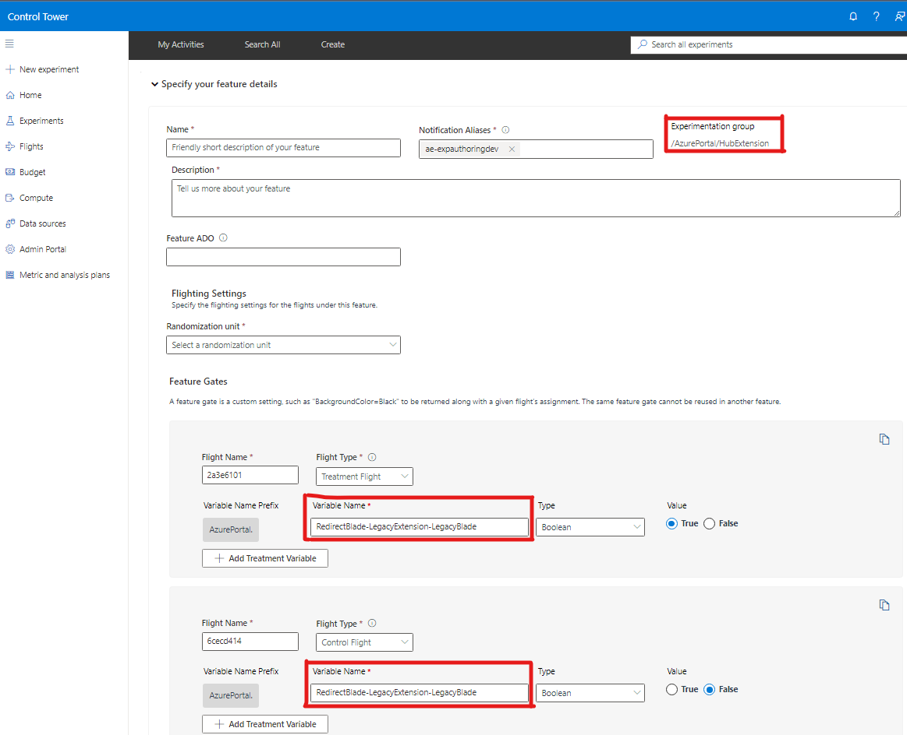
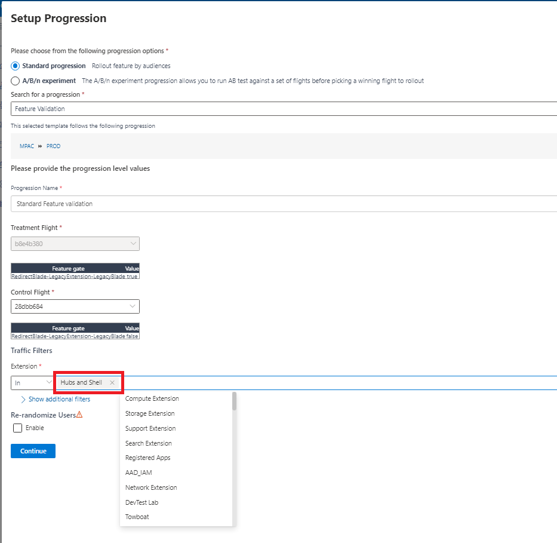

<a name="redirects"></a>
# Redirects

<a name="redirects-blade-redirects"></a>
## Blade redirects

In the course of updating and improving Portal UI, it is common to want to retire an old Blade and replace it with a newly-developed Blade.  Scenarios for this include:
- Migrating a Blade to a different extension
- Converting a Blade from Knockout to React

The portal framework offers "Blade redirect" APIs that make introducing a new Blade that replaces an old one easy to do. Once you've developed a "Blade redirect" in your extension, customer navigations to blade<sub>old</sub> will, instead, render blade<sub>new</sub>.

A "Blade redirect" is developed alongside the new/replacement Blade, and the way the "Blade redirect" is expressed varies according to the programming model chosen for the new Blade.

**NOTE** - When developing the new/replacement Blade, the API signature for blade<sub>new</sub> must be compatible with blade<sub>old</sub>. That is, both old and new Blade must accept same-named parameters and each parameter must be of the same type.
<a name="redirects-blade-redirects-package-version-requirements"></a>
### <strong>Package Version Requirements</strong>
The following packages with minimum versions are needed to use blade redirects and its functionality including flighting capabilities:
- Portal SDK: 10.154
	- allows general use of blade redirects
	- more on how to update Portal SDK packages for your extension at [Updating Azure Portal SDK packages](./top-extensions-packages.md#updating-your-extension-to-a-newer-version-of-the-sdk)
- @microsoft/azureportal-reactview: ^1.84.0
	- allows usage of blade redirects decorator for ReactViews
	- more on how to update the  @microsoft/azureportal-reactview node package at [Install Azure Portal ReactView package](./react-guides-onboarding-an-existing-extension.md#install-the-packages)
<a name="redirects-blade-redirects-sample-api-usage"></a>
### Sample API usage

Below, you'll see the same "Blade redirect" scenario depicted for each of the supported programming models.  Here, blade<sub>old</sub> is named '`LegacyBlade`' from the '`LegacyExtension`' extension; blade<sub>new</sub> is named '`NewBlade`' from the '`NewExtension`' extension.

<a name="redirects-blade-redirects-sample-api-usage-reactviews"></a>
#### ReactViews
```ts
import * as React from "react";
import * as ReactView from "@microsoft/azureportal-reactview/ReactView";
@ReactView.ReplacesOldBlade.Decorator({
	replacedBlade: "LegacyBlade",
	extension: "LegacyExtension",
})
@ReactView.ReduxFree.Decorator<{}, {}>()
export class NewBlade extends React.Component<{}, {}> {
	public render() {
		return (
			<>
				<p>This is a replacement ReactView blade</p>
			</>
		);
	}
}
```
<a name="redirects-blade-redirects-sample-api-usage-no-pdl-knockout-blades"></a>
#### No-PDL / Knockout Blades
```ts
import * as TemplateBlade from "Fx/Composition/TemplateBlade";
@TemplateBlade.ReplacesOldBlade.Decorator({
	replacedBlade: "LegacyBlade",
	extension: "LegacyExtension",
})
@TemplateBlade.Decorator({
	htmlTemplate: "<p>This is replacement KO blade </p>",
})
export class NewBlade {
	public title = "New Blade";
	public subtitle = "";
	public context: TemplateBlade.Context<void>;
	public async onInitialize() {
	}
}
```
<a name="redirects-blade-redirects-sample-api-usage-pdl-knockout-blades"></a>
#### PDL / Knockout Blades
```xml
<?xml version="1.0" encoding="utf-8"?>
<Definition xmlns="http://schemas.microsoft.com/aux/2013/pdl" Area="Blades">
	<!-- This RedirectBlade tag specifies what blade is being replaced, and from what extension -->
	<RedirectBlade Name="LegacyBlade" Extension="LegacyExtension">
		<!-- Name of the blade in the extension to replace LegacyBlade -->
		<NewBlade Name="NewBlade"/>
	</RedirectBlade>
</Definition>
```

<a name="redirects-flighting-blade-redirects"></a>
## Flighting Blade Redirects

The framework also provides the ability to flight blade redirects using the experimentation platform (see [Ibiza Experimentation ](https://aka.ms/Ibizaexperimentation)). With this, you can stage the introduction of blade<sub>new</sub> to your customers.

<a name="redirects-flighting-blade-redirects-sample-api-usage-1"></a>
### Sample API usage

For your Blade redirect (authored via one of the programming models [above](#blade-redirects)), to use the flighting mechanism, you'll make use of a '`useFlighting`' option, as per the examples below.

<a name="redirects-flighting-blade-redirects-sample-api-usage-1-reactviews-1"></a>
#### ReactViews
```ts
@ReactView.ReplacesOldBlade.Decorator({
	replacedBlade:  "LegacyBlade",
	extension:  	"LegacyExtension",
	useFlighting:  	true,
})
```
<a name="redirects-flighting-blade-redirects-sample-api-usage-1-no-pdl-knockout-blades-1"></a>
#### No-PDL / Knockout Blades
```ts
import * as TemplateBlade from "Fx/Composition/TemplateBlade";
@TemplateBlade.ReplacesOldBlade.Decorator({
	replacedBlade:  "LegacyBlade",
	extension:      "LegacyExtension",
	useFlighting:  	true,
})
```
<a name="redirects-flighting-blade-redirects-sample-api-usage-1-pdl-knockout-blades-1"></a>
#### PDL / Knockout Blades
```xml
<!-- This RedirectBlade tag specifies what blade is being replaced, and from what extension -->
<RedirectBlade Name="LegacyBlade" Extension="LegacyExtension" UseFlighting="True" >
	<!-- Name of the blade in the extension to replace LegacyBlade -->
	<NewBlade Name="NewBlade"/>
</RedirectBlade>
```
<a name="redirects-flighting-blade-redirects-creating-your-experiment"></a>
### Creating your experiment

Once you've developed your Blade redirect using the '`useFlighting`' option, you will proceed to create an experiment that stages the application of the Blade redirect, gradually migrating customers to blade<sub>new</sub>.

You'll create your experiment using the [ExP experimentation Platform](http://aka.ms/exp).  Learn more about experiment creation and onboarding for Azure Portal at [Ibiza ExP Documentation](https://aka.ms/IbizaExperimentation).

For an experiment that controls the application of a Blade redirect, First, you'll create an experiment specifying your Extension 'experimentation group' as the management group in the Ibiza tenant that the Ibiza Experimentation team set up for your extension. For example, "AzurePortal/Samples."

Your experiment will stage the application of your Blade redirect by controlling the value of a feature variable (also known as 'feature gate').  The feature variable you'll use for your experiment here must be named as follows: '`RedirectBlade-{sourceExtensionName}-{sourceBladeName}`'.



To further illustrate, for the scenario treated by the examples above, the feature variable (feature gate) must be named '`RedirectBlade-LegacyExtension-LegacyBlade`'.


**`IMPORTANT`** During the Experiment Progression Setup, It is very important to make sure to add the **'`Hubs and Shell`'**  for the `'Extension'` Traffic Filter as shown below, without this filter the experiment variables cannot be used by Portal SDK to apply the blade redirection

<a name="redirects-validation"></a>
## Validation

Once you've developed a Blade redirect, you'll want to verify that it is impacting Portal navigations as you expect. This should be done in three stages:
1. Validating before committing the extension change
1. Validating against a test extension stamp
1. Validating in a production environment

<a name="redirects-validation-validation-steps"></a>
### Validation steps
Each of these stages follows the same process:
1. Navigate to Azure Portal, loading the extension version you wish to verify
1. If your Blade redirect uses the '`useFlighting`' option, in the Portal URL include the query string '`&exp.RedirectBlade-{sourceExtensionName}-{sourceBladeName}=true`' reflecting your redirect
1. Navigate to blade<sub>old</sub> in the Portal as a customer would
1. Verify that blade<sub>new</sub> is rendered
1. Additionally, if your redirect specifies '`useFlighting`', you can explicitly simulate the scenario where a customer is not assigned to your flight:
    1. In the Portal URL include the query string '`&exp.RedirectBlade-{sourceExtensionName}-{sourceBladeName}=false`' to force your session to be excluded from the flight
	1. Navigate to blade<sub>old</sub> in the Portal as a customer would
	1. Verify that blade<sub>old</sub> is rendered

<a name="redirects-validation-validating-before-committing-the-extension-change"></a>
### Validating before committing the extension change

Once you've developed your Blade redirect and before you commit your extension change, you can validate your new Blade redirect just as you would any new extension feature:
1. Side-load your extension locally
1. Follow the steps [above](#validation-steps)

<a name="redirects-validation-validating-against-a-test-extension-stamp"></a>
### Validating against a test extension stamp

Next, you'll validate your Blade redirect against a true deployment of your updated extension.
1. To the Extension Hosting Service, deploy your extension to a test stamp
1. Navigate to Azure Portal, loading your extension from the test stamp using a query string of the form: `https://portal.azure.com?feature.canmodifystamps=true&{newExtension}={testStampName}`
1. Follow the steps [above](#validation-steps)

<a name="redirects-validation-validating-in-a-production-environment"></a>
### Validating in a production environment

Next, you'll validate your Blade redirect against a deployment of your updated extension that customers use.
1. Deploy your extension
1. Navigate to Azure Portal
1. Follow the steps [above](#validation-steps)
1. Consult Kusto to confirm that customers are reaching blade<sub>new</sub> (see details [below](#monitoring-blade-traffic))

<a name="redirects-safely-removing-an-old-blade"></a>
## Safely removing an old Blade

Once your Blade redirect is operational, it is important to keep the old/replaced Blade in your extension until you've verified that no customer navigations are reaching the old/replaced Blade.

Weeks later, you can use the Kusto query described [here](#monitoring-blade-traffic) to verify that customers are no longer loading blade<sub>old</sub> (that is, that the load count for blade<sub>old</sub> is at or near zero).

**This verification step is critical.** Even once your Blade redirect has been deployed to all clouds and all regions, it will take time for all customers to refresh their browsers and begin to load your new extension version containing the Blade redirect. If you remove the old/replaced Blade from your extension before your Blade redirect is honored in all customer sessions, you risk customers navigating to a non-existent Blade, seeing a Portal error page and triggering a CRI.

<a name="monitoring-blade-traffic"></a>
# Monitoring Blade Traffic
You can monitor traffic for the Blade you want to check using the following KQL query in using [Data Explorer](https://dataexplorer.azure.com) along with the Azure Portal kusto cluster feed: `https://azportalpartner.kusto.windows.net/`
```sql
let ['bladeName']='Your Blade name';
let ['extensionName']='Your Extension Name';
let ['_startTime']=datetime('Start Date timestamp');
let ['_endTime']=datetime('End Date timestamp');
let ['portalEnvironment']='https://portal.azure.com';
database('AzurePortal').ClientTelemetry
| where PreciseTimeStamp between (_startTime.._endTime)
| where requestUri startswith "https://portal.azure.com"
| where action == "BladeFullReady"
| where extension == extensionName
| where name endswith bladeName
| summarize count() by name, extension, action
```
