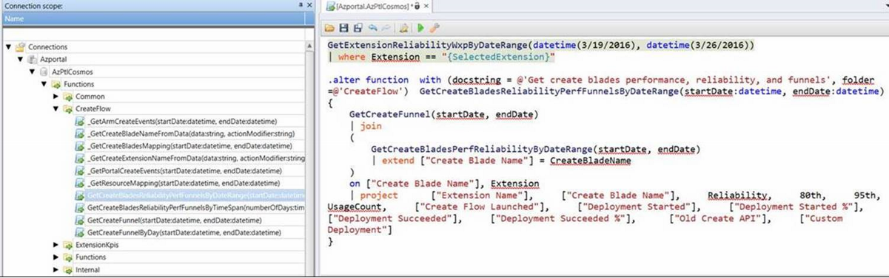

* [Kusto Telemetry](#kusto-telemetry)
    * [Supported Databases](#kusto-telemetry-supported-databases)
    * [Supported Kusto Tables](#kusto-telemetry-supported-kusto-tables)
    * [Supported Functions](#kusto-telemetry-supported-functions)
    * [Query for Reported Numbers](#kusto-telemetry-query-for-reported-numbers)
    * [ClientTelemetry (AzPtlCosmos)](#kusto-telemetry-clienttelemetry-azptlcosmos)


<a name="kusto-telemetry"></a>
## Kusto Telemetry

<a name="kusto-telemetry-supported-databases"></a>
### Supported Databases

|Name              | Details                                                                                                                                                                                                                                                                                                                                                                                         |
|------------------|-------------------------------------------------------------------------------------------------------------------------------------------------------------------------------------------------------------------------------------------------------------------------------------------------------------------------------------------------------------------------------------------------|
|AzPtlCosmos       | This is our main telemetry database. Data here is deduped, geo-coded, expanded and filtered. All the official dashboards\reports are based on this table. It is highly encouraged that this database is used for your needs. Data here is persisted for 120 days and excludes test traffic.                                                                                                     |
|AzurePortal       | There will be many scenarios where you may want to debug your issues. For e.g., debugging perf issues. To look at diagnostic events, this is the right table to use. This is the raw data coming from MDS directly to Kusto and it is unprocessed. Data here is persisted for 45 days. To filter out test traffic when doing queries on this database, you should use userTypeHint == "".       |


<a name="kusto-telemetry-supported-kusto-tables"></a>
### Supported Kusto Tables

|Database          | Table Name        | Details                                                                                                                                              |
|------------------|-------------------|------------------------------------------------------------------------------------------------------------------------------------------------------|
|AzPtlCosmos       | ClientTelemetry   | This is all the Client Telemetry data that is collected from the Portal. This is the main table that should be good for most scenarios.              |
|AzPtlCosmos       | ExtTelemetry      | This holds client events data for extensions using the Extension Telemetry feature.                                                                  |

> **Important:** Data in both ClientTelemetry and ExtTelemetry tables will only include rows where the action is present in their respective allow list. If you need to query for actions that are not present in these tables, Kusto supports [cross-databases queries](https://kusto.azurewebsites.net/docs/queryLanguage/query_language_syntax.html?q=cross) allowing you to query the ClientTelemetry or ExtTelemetry directly from the AzurePortal database.

Other useful Kusto tables are the ones where errors and warnings are getting logged. These tables are currently available only under AzurePortal database:

|Database          | Table Name        | Details                                                                                                                                                                                                                                 |
|------------------|-------------------|-----------------------------------------------------------------------------------------------------------------------------------------------------------------------------------------------------------------------------------------|
|AzurePortal       | ClientEvents      | This table contains errors and warnings thrown from Framework and Hubs IFrame.                                                                                                                                                          |
|AzurePortal       | ExtEvents         | This table contains errors and warnings thrown from an extension's IFrame. Your extension will log to this table only if you have previously [onboarded to ExtTelemetry/ExtEvents tables](portalfx-telemetry.md).  |

<a name="kusto-telemetry-supported-functions"></a>
### Supported Functions


Other functions in the databases are available for exploration but are mainly intended for internal usage and are subject to change at any time.

<a name="kusto-telemetry-query-for-reported-numbers"></a>
### Query for Reported Numbers

On a weekly basis, we send out a Weekly Ibiza Status mail where we cover the KPI numbers for all extensions among other things. For folks not getting these emails, please join one of the groups in the screenshot below.

These emails have clickable Kusto links within the reported numbers. Clicking on these will take you to the Kusto query behind getting these numbers. We use functions to hide the complexity behind the queries that we use. To view the details about the queries, look under **Functions\Public**. Once you find the right function, if you right-click and do “Make a command script”, you will be able to see the details of that function. You can do this recursively for any functions underneath.



<a name="kusto-telemetry-clienttelemetry-azptlcosmos"></a>
### ClientTelemetry (AzPtlCosmos)

<a name="kusto-telemetry-clienttelemetry-azptlcosmos-action"></a>
#### Action
This represents an event in the Portal.

[top-telemetry.md](top-telemetry#overview-viewing-telemetry-custom-queries-tracked-actions)

<a name="kusto-telemetry-clienttelemetry-azptlcosmos-actionmodifier"></a>
#### ActionModifier
This is used in tandem with the Action field. This represents a status of a particular Action. So for BladeReady for eg., you will see ActionModifier values of start, complete & cancel

<a name="kusto-telemetry-clienttelemetry-azptlcosmos-area"></a>
#### Area
This field usually gives the extension name associated with the particular Action. This is derived from either then Name field or the Source field depending on the Action

<a name="kusto-telemetry-clienttelemetry-azptlcosmos-blade"></a>
#### Blade
This field gives the Blade name associated with the particular Action. This is derived from either then Name field or the Source field depending on the Action

<a name="kusto-telemetry-clienttelemetry-azptlcosmos-browserfamily"></a>
#### BrowserFamily
This field represents the name of the Browser used by the User. This is derived from the UserAgent field

<a name="kusto-telemetry-clienttelemetry-azptlcosmos-browsermajorversion"></a>
#### BrowserMajorVersion
This field represents the Major Version of the Browser used by the User. This is derived from the UserAgent field

<a name="kusto-telemetry-clienttelemetry-azptlcosmos-browserminorversion"></a>
#### BrowserMinorVersion
This field represents the Minor Version of the Browser used by the User. This is derived from the UserAgent field

<a name="kusto-telemetry-clienttelemetry-azptlcosmos-clienttime"></a>
#### ClientTime
This field gives the actual time of the event according to the client's clock (which can be off based on the client settings). This is a good field to reconstruct the precise sequence of events.

<a name="kusto-telemetry-clienttelemetry-azptlcosmos-data"></a>
#### Data
The Data field is the most dynamic field in telemetry. It is a JSON object with no set structure. They often contain information specific to a particular Action.

Below is an example of the **Data** filed for **Action** "ProvisioningStarted"

```json
	{
		"oldCreateApi": true,
		"launchingContext": {
		"galleryItemId": "Microsoft.SQLDatabase",
		"source": [
			"GalleryCreateBlade"
		],
		"menuItemId": "recentItems",
		"itemIndex": 0
		}
	}
```

<a name="kusto-telemetry-clienttelemetry-azptlcosmos-duration"></a>
#### Duration
This field gives the duration a particular Action took to complete. This value is non-zero only for Actions with ActionModifier having values either "complete", "succeeded", etc. The time is in milliseconds.

<a name="kusto-telemetry-clienttelemetry-azptlcosmos-journeyid"></a>
#### JourneyId
This field provides the journey Id for each action. A journey is basically a tiny sub-session within which a user navigates a flow of blades. This id allows us to identify the actions that the user took within any given journey, how many journey did a user interact with, etc.

<a name="kusto-telemetry-clienttelemetry-azptlcosmos-lens"></a>
#### Lens
This field gives the Lens name associated with the particular Action. This is derived from either then Name field or the Source field depending on the Action

<a name="kusto-telemetry-clienttelemetry-azptlcosmos-name"></a>
#### Name
The Name field usually changes it's format based on the Action. In most scenarios, it usually has the following format

        Extension/<extensionName>/Blade/<BladeName>/Lens/<LensName>/PartInstance/<PartName>

<a name="kusto-telemetry-clienttelemetry-azptlcosmos-this-field-is-usually-used-to-identify-the-extension-blade-lens-part-associated-with-a-particular-action"></a>
#### This field is usually used to identify the extension\Blade\Lens\Part associated with a particular Action.

<a name="kusto-telemetry-clienttelemetry-azptlcosmos-sessionid"></a>
#### SessionId
This represents each sessions that the user opens. SessionId refreshes everytime a user logs in\refreshes.

<a name="kusto-telemetry-clienttelemetry-azptlcosmos-part"></a>
#### Part
This field gives the Part name associated with the particular Action. This is derived from either then Name field or the Source field depending on the Action

<a name="kusto-telemetry-clienttelemetry-azptlcosmos-precisetimestamp"></a>
#### PreciseTimeStamp
This field gives the time the event was logged by the server. It is in UTC.

<a name="kusto-telemetry-clienttelemetry-azptlcosmos-userid"></a>
#### UserId
This field identifies a user by PUID. We can use this to identify queries like daily active users, unique users using my feature, etc.

<a name="kusto-telemetry-clienttelemetry-azptlcosmos-useragent"></a>
#### UserAgent
This represents the user agent of the user. This is a standard UserAgentString - [User Agent](https://en.wikipedia.org/wiki/User_agent)

<a name="kusto-telemetry-clienttelemetry-azptlcosmos-usercity"></a>
#### UserCity
This represents the City that the User has used the Portal from. We derive this from the Users Client IP.

<a name="kusto-telemetry-clienttelemetry-azptlcosmos-usercountry"></a>
#### UserCountry
This represents the Country/Region that the User has used the Portal from. We derive this from the Users Client IP.

Read more about [Kusto query language](https://kusto.azurewebsites.net/docs/queryLanguage/query_language.html).
