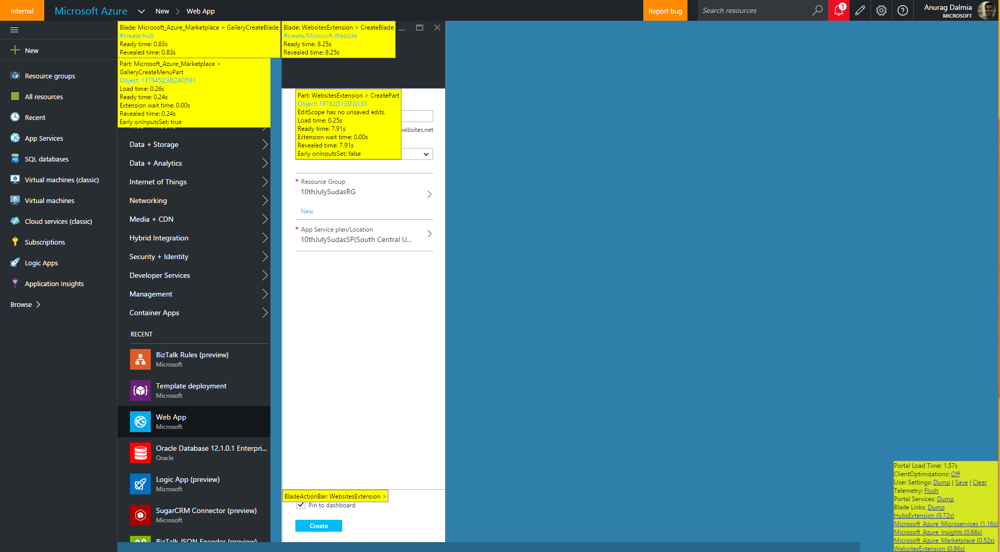

# How to verify live Telemetry

## Using Console Logs
	
1. Enable Console Telemetry - [https://portal.azure.com/?feature.consoletelemetry=true](https://portal.azure.com/?feature.consoletelemetry=true) 
1. Hit F12 and view the "Console" Tab.
1. You will be able to see most of all telemetry logs within this window. The only known **Action** that doesn’t show up here is **CreateFlowLaunched**
    

## Using Fiddler

1. Install Fiddler - [http://www.telerik.com/fiddler](http://www.telerik.com/fiddler)
1. Open Fiddler and configure the "Filters" as below
      
1. Open Portal and you should see all relevant telemetry logs emitted here.

> If the sign in flow would normally require 2FA (i.e. you are not already signed in), Fiddler will break the sign in flow

>  Fiddler can capture your passwords

### Viewing Blade Names

Pressing Ctrl-Alt-D in the Ibiza portal shows some component loading times

