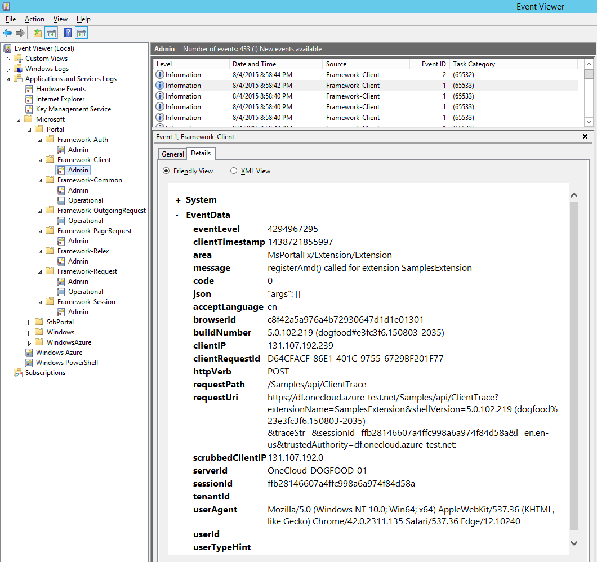

<a name="logging"></a>
# Logging

The SDK provides TypeScript and .NET libraries to assist with logging.

<a name="logging-enabling-extensions-to-log-to-portal-mds-tables"></a>
#### Enabling extensions to log to portal MDS tables

This feature can be enabled by setting 'EnablePortalLogging' to true in the extensiondefinition. When this is turned on, all extension traces and telemetry are logged to the portal MDS tables.

`\SamplesDefinition.cs`

```cs
 [Export(typeof(ExtensionDefinition))]
    internal class SamplesExtensionDefinition : ExtensionDefinition
    {
        [ImportingConstructor]
        public SamplesExtensionDefinition(ArmConfiguration armConfiguration, ApplicationConfiguration applicationConfiguration)
        {
            this.EnablePortalLogging = true;
        }
```

The feature is turned on by default for serverless extension. 

<a name="logging-enabling-extensions-to-log-ajax-errors-automatically-through-base-net"></a>
#### Enabling extensions to log Ajax errors automatically through Base.net

Ajax errors logging can be enabled through the required 'TraceAjaxErrors' property in extensiondefinition. When this is turned on, ajax calls made through the Base.net ajax methods will log all HTTP 5xx errors to the extension's ClientEvents MDS table.

The new attribute is added to the Extension Definition like this:
```cs
public override bool TraceAjaxErrors
{
    get
    {
        return true;
    }
}
```

<a name="logging-logging-from-the-client"></a>
#### Logging from the Client

When working on the client side of your extension, you may use your own
logging infrastructure, or opt into the provided APIs. The provided API allows
you to write messages which will appear in the browser console. In addition to
displaying in the console, the portal manages batching these messages and
provides an API to send them to the server. You can find an example of this
in:

`\Client\Diagnostics\Logging\ViewModels\LoggingViewModels.ts`

```ts
MsPortalFx.Base.Diagnostics.Log.writeEntry(
    MsPortalFx.Base.Diagnostics.LogEntryLevel.Error,
    "Area of your application",
    "The message you would like to log",
    "Extra parameter 1",
    "Extra parameter 2");
```

The code above will submit a new log entry as an error, include the area of
the site, the log message, and (n) parameters. You can also retreive logged
entries using the `MsPortalFx.Base.Diagnostics.LoggetEntries` method.

<a name="logging-logging-on-the-server"></a>
#### Logging on the Server

When using the MsPortalFx client API, messages are automatically batched and
sent to the server. If using the provided `Microsoft.Portal.Framework` DLL,
the endpoint is automatically included in your application. Trace events sent
to the provided endpoint will be automatically logged to ETW.

<a name="logging-logging-on-the-server-logging-from-c"></a>
##### Logging from C#

In addition to managing trace events from TypeScript, there is framework
support for logging to ETW from .NET as well. To define a list of events, see
the sample at:

`\Tracing\Tracing.cs`

```cs
/// <summary>
/// Event ids for the events. This is the ETW event id.
/// </summary>
public enum EventIds
{
    /// <summary>
    /// Denotes that a website has been deleted
    /// </summary>
    WebsiteDeleted = 1,
}

/// <summary>
/// Basic tracing in the sample extension.
/// </summary>
[EventSourceDefinition("Microsoft-Portal-Extensions-SamplesExtension", Guid = "763D3D57-E01F-4DD1-BD1E-4FE96054F7A4")]
public interface IBasicTracing
{
    /// <summary>
    /// Trace the deletion of a website.
    /// </summary>
    [EventDefinition((int)EventIds.WebsiteDeleted, EventLevel.Verbose, "The website with '{0}' was deleted.")]
    void WebsiteDeleted(int id);
}
```

After defining all of the possible events, you can log new events. To use
logger, export your class and use the importing constructor below that
includes an instance of the interface created above. For example:

`\Controllers\WebsitesController.cs`

```cs
/// <summary>
/// WebsitesController class.
/// </summary>
[Export]
[PartCreationPolicy(CreationPolicy.NonShared)]
public class WebsitesController : ApiController
{
    private IBasicTracing tracing;

    /// <summary>
    /// Initializes a new instance of the WebsitesController class.
    /// </summary>
    [ImportingConstructor]
    public WebsitesController(IBasicTracing tracing)
    {
        this.tracing = tracing;
    }

    /// <summary>
    /// Deletes specific entity from the repository.
    /// </summary>
    /// <param name="id">Entity id.</param>
    /// <returns>A <see cref="HttpResponseMessage" /> with the response.</returns>
    /// <example>Hit /api/nameOfController/id with DELETE verb.</example>
    [HttpDelete]
    public async Task<HttpResponseMessage> DeleteWebsite(int id)
    {
        WebsiteModel model;
        HttpResponseMessage response;

        if (this.Repository.TryRemove(id, out model))
        {
            this.tracing.WebsiteDeleted(id);
            response = Request.CreateResponse(HttpStatusCode.OK, model);
        }
        else
        {
            response = Request.CreateResponse(HttpStatusCode.NotFound);
        }

        // Fake running some heavy operations by waiting before returning result.
        await Task.Delay(this.operationDelay);

        return response;
    }
}
```

<a name="logging-logging-on-the-server-manually-accepting-log-requests"></a>
##### Manually accepting log requests

These messages are sent to `/api/ClientTrace?timeStamp={timestamp}`, which is
by default managed by the framework. If custom handling of traces is required,
the URL is configurable. To change the default trace endpoint, start by
modifying your extension's web.config to point to your own endpoint:

`web.config (appSettings section)`

```xml
<add key="Microsoft.Portal.Extensions.SamplesExtension.ApplicationConfiguration.ClientTraceUri"
     value="~/MyController/MyTraceAction" />
```

Now update the `ApplicationConfiguration.cs` class to include a
`ClientTraceUri` property:

`\Configuration\ApplicationConfiguration.cs`

```cs
[ConfigurationSetting]
public AppRelativePath ClientTraceUri
{
    get;
    private set;
}
```

Now update the `CustomApplicationContext.cs` class to include a
`ClientTraceUri` property:

`\Configuration\CustomApplicationContext.cs`

```cs
public override AppRelativePath ClientTraceUri
{
    get
    {
        return this.configuration.ClientTraceUri;
    }
}
```

The end result of these configuration changes will be updating the
`fx.environment.clientTraceUri` property available on the client of the
extension at runtime. The request will include a JSON body which includes an
array of traces. A typical payload takes the following structure:

```json
[
    {
        "timestamp": 1389849966392,
        "level": 0,
        "area": "Performance",
        "message": "This is an example trace event.",
        "args": [
            "extra arg 1",
            12345,
            "you can have many of these"
        ]
    }
]
```

If using a non-.NET backend, you will need to create an endpoint which
receives JSON in the body, and can accept these requests.

<a name="logging-logging-on-the-server-writing-to-etw"></a>
##### Writing to ETW

Now that you are receiving logs via ClientTrace, they can be written to [ETW](https://msdn.microsoft.com/en-us/library/windows/desktop/bb968803%28v=vs.85%29.aspx) and either viewed in Event Viewer, or picked up by a central logging system (which for first parties, will probably be MDS).

To write to ETW, first the Providers must be registered with ETW. We provide a utility to do this:   `EtwRelatedFilesUtility.exe`. It must be run as a startup task in your instance, before any users of ETW are run.

1. Make sure that `EtwRelatedFilesUtility.exe` is placed in the `\bin` folder of your web role.
2. Create a startup script to run the utility and capture any output (in case something goes wrong). E.g.

```
REM SetupEtw.cmd example
@ECHO OFF
EtwRelatedFilesUtility.exe >> EtwRelatedFilesUtility.log  2>> EtwRelatedFilesUtility.err
EXIT %ERRORLEVEL%
```

3. Add this startup script to your instance's definition, making sure that it is run as an elevated, "simple" task. E.g.

```xml
<Startup>
  <Task commandLine="StartupTasks\SetupEtw.cmd" executionContext="elevated" taskType="simple">
  </Task>
</Startup>
```
4. Once you deploy with this configuration, you should see new logs created in Event Viewer, similar to below:




<a name="logging-logging-on-the-server-writing-to-mds"></a>
##### Writing to MDS

If you are a first party, you may have a requirement to write your logs to [MDS](https://microsoft.sharepoint.com/teams/WAG/EngSys/Monitor/_layouts/15/start.aspx#/AmdWiki). We support this scenario, as we use it ourselves.

_Please ensure that you have a requirement to use MDS before you start onboarding. Different teams have different requirements._

1. Make sure that the logs appear in ETW. MDS will only upload logs that appear in ETW. (See above.)
2. Onboard to MDS by following their Wiki (e.g. create an MDS account, provision storage accounts, etc.). See [here](https://microsoft.sharepoint.com/teams/WAG/EngSys/Monitor/AmdWiki/Onboarding.aspx).
2. Once you have onboarded to MDS, follow their steps to configure and deploy the Monitoring Agent. See [here](https://microsoft.sharepoint.com/teams/WAG/EngSys/Monitor/AmdWiki/Onboarding%20-%20Configuring%20and%20Deploying%20the%20Monitoring%20Agent.aspx).
3. After completing this, you should have added a startup task to your instance's definition. Make sure that this task runs **AFTER** the startup task that runs `EtwRelatedFilesUtility.exe` (that you set up above).
4. Upload your MDS schema configuration files before/at the start of deployment, as per the [MDS documentation](https://microsoft.sharepoint.com/teams/WAG/EngSys/Monitor/AmdWiki/MDS.EXE%20Command%20Reference.aspx#UploadMdsConfig). You should be able to see examples of MDS schema configuration files as part of the ETW NuGet package (`Microsoft.Portal.Tools.Etw.[version].nupkg`) under `Tools\EtwRelatedFilesUtility\MonitoringConfig`.
    * If you have your own MDS schema configuration files, you'll have to merge the portal configuration files that contain tables that you want to be part of your schema.
5. When you deploy and your instance starts, remember that it can take 5-15 minutes for ETW logs to be uploaded to MDS and show up in searches.


<a name="logging-logging-on-the-server-alerting-microsoft-internal-only"></a>
##### Alerting (Microsoft Internal Only)

The Portal team manages alerts for when your extension fails to load.  The Extension Load Failure alert will create an ICM incident which we will route to your team based on the [spreadsheet here](http://aka.ms/portalfx/partners).  

If you are using MDS logging, you can create additional alerts for your extension through the [Geneva Monitoring system](https://jarvis-west.dc.ad.msft.net/?page=documents&section=f787c5ad-c22e-48aa-898a-1a042632f9d1&id=8a22767c-90e3-4fe6-9ea5-e421422d0e2c).  Please ensure that any alerts created are initially routed to your team (not the Portal team).

If you are using AppInsights, then please contact the [AppInsights team](mailto:VSAIDiscussion@microsoft.com).
