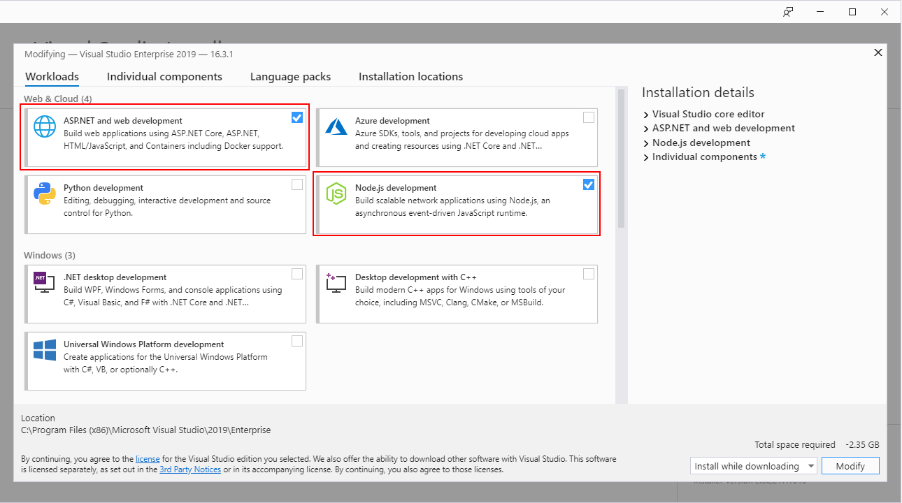
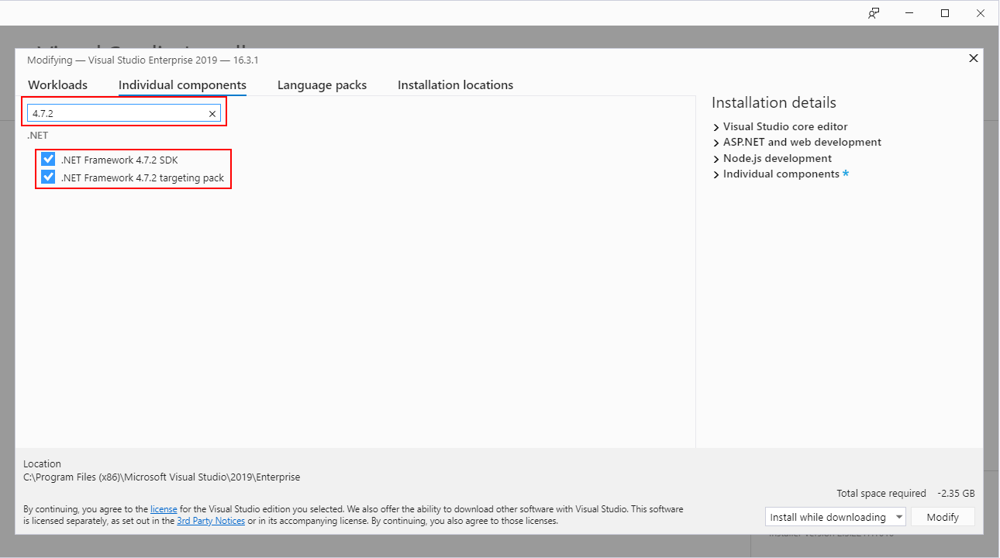

<a name="cli-overview"></a>
# CLI Overview

The Azure portal extension developer CLI, namely `ap`, is the foundational tool used for all inner dev/test loop actions during extension development.

This document details the usage and extensibility points of the ap CLI.  The following video covers the majority of the content within this document - [ap cli video https://aka.ms/portalfx/apcli](https://aka.ms/portalfx/apcli).


<!-- docs#setup -->
<a name="cli-overview-setup-and-installation"></a>
## Setup and Installation

<a name="cli-overview-setup-and-installation-one-time-configuration-steps"></a>
### One time configuration steps

 - Install the LTS of nodejs [download](https://nodejs.org/en/download)

Windows
   1. download [setup.js](https://aka.ms/portalfx/cli/setup) and place 'setup.js' inside the project or directory you are working on.
   1. run `node setup.js` and perform any actions it asks you to.

MacOS
   1. download  [mac-setup.sh](https://aka.ms/portalfx/xplat/setup/mac) i.e `curl -fsSL https://aka.ms/portalfx/xplat/setup/mac > mac-setup.sh`
   1. run `bash mac-setup.sh`

If you prefer follow along see the step by step:
 - [Manual one time Auth Setup and Installation steps](#manual-one-time-auth-setup-and-installation)
 - [Video:One time configuration steps](https://msit.microsoftstream.com/video/d1f15784-da81-4354-933d-51e517d38cc1?st=657)

<!-- docs#setup -->

<a name="cli-overview-basic-workflows"></a>
## Basic workflows

<a name="cli-overview-basic-workflows-restore-build-serve-sideload-and-watch"></a>
### restore, build, serve, sideload and watch

1. Run command prompt as Admin
1. Get started with a declarative extension. A declarative extension is easier to build and cheaper to maintain. Learn more [here](top-declarative.md). Extension authors can always shift from a declarative extension to a hybrid extension (declarative and native typescript blades) at any point of time.
1. To get started with a declarative extension, run following commands

```
cd c:\ && mkdir dev && cd dev
ap new -d -n Microsoft_Azure_FirstExtension -o ./FirstExtension
cd ./FirstExtension/src/default/extension
ap start

```

Alternatively, if you have evaluated using a declarative extension and established that it does not work for your scenario, you can start with a native Ibiza extension using the following commands -

```
cd c:\ && mkdir dev && cd dev
ap new -n Microsoft_Azure_FirstExtension -o ./FirstExtension
cd ./FirstExtension/src/default/extension
ap start

```

See `ap start` demo in the [Video: A single command for restoring dependencies, building, serving with local hosting service, sideloading and compile on save](https://msit.microsoftstream.com/video/d1f15784-da81-4354-933d-51e517d38cc1?st=1627)

<a name="cli-overview-basic-workflows-run-tests"></a>
### run tests
1. Run command prompt as Admin
1. run following commands

```
cd ./FirstExtension/src/default/extension.unittests
ap run test
```


See `ap run test` demo in the [Video: running tests](https://msit.microsoftstream.com/video/d1f15784-da81-4354-933d-51e517d38cc1?st=1807)
<a name="cli-overview-basic-workflows-lint-your-extension"></a>
### lint your extension

```
cd ./FirstExtension/src/default/extension
ap lint
```

<a name="cli-overview-basic-workflows-updating-your-portal-framework-version"></a>
### updating your Portal Framework version
1. Run the command prompt as Admin
1. Update the cli to the target version of Portal Framework e.g `npm install -g @microsoft/azureportalcli@5.303.601`
1. From the root of your enlistment run `ap update` and see changes with `git status`
```
ap update
git status
```

See `ap update` demo in the [Video: Updating the CLI, extension SDK version and revoked SDKs](https://msit.microsoftstream.com/video/d1f15784-da81-4354-933d-51e517d38cc1?st=2214).

<a name="cli-overview-command-reference"></a>
## Command Reference

Command | Alias | Description
--- | --- | ---
build | | Runs msbuild.exe on the *.sln or *proj with/p:RunBundlerInDevMode=true. If no *.sln or *proj is found and tsconfig.json exists then runs tsc.cmd. If arguments are supplied they are passed through to underlying executable.
diag | | Emits all information and current deployed state of extension for all clouds.
lint | | Runs eslint against an extension including azure portal custom lint rules.
new | | Creates a new extension.
samples | | Clones the samples extension.
release | | Runs msbuild.exe on the *.sln or *proj with /p:RunBundlerInDevMode=false;Configuration=Release. If no *.sln or *proj is found and tsconfig.json exists then runs tsc.cmd. If arguments are supplied they are passed through to underlying executable.
restore | | Installs node modules and restores NuGet packages for all package.json, *.sln and *.csproj recursively from the current working directory.
run | | Straight passthrough to npm run i.e 'ap run mycommand' will execute 'npm run mycommand'
serve | | A command to run the local hosting service. Optional arguments are passed through to the local hosting service.
start | | A command to restore, build, run the local hosting service and start the watch process to enable compile on save.
update | | Updates Azure Portal SDK NuGets and node modules to same version as the CLI.
watch | | enables compile on save by running tsc.cmd in watch mode on the current working directory.
help | | Lists available commands and their short descriptions.

Options:
Option | Description
--- | --- | ---
  --version | Show version number of ap cli
  --help | Shows help. Can be used on ap directly i.e `ap --help` or on its commands e.g `ap start --help`

<a name="cli-overview-command-reference-ap-build"></a>
### ap build

```
ap build <arguments> [options]
```

Runs msbuild.exe on the *.sln or *proj with /p:RunBundlerInDevMode=true. If no
*.sln or *proj is found and tsconfig.json exists then runs tsc.cmd.  The resulting output is the build output in the format required by local hosting service. For deployable zip see release command. Arguments are optional, if supplied they are passed through to underlying executable for the resolved build type.  The build alias for msbuild and tsc can be overriden using apCliConfig.json.

<a name="cli-overview-command-reference-ap-build-arguments"></a>
#### Arguments
Argument | Description
--- | ---
\* | All arguments supplied are passed through to the resolved build executable, generally msbuild or tsc.
--help | Show help for build command

<a name="cli-overview-command-reference-ap-build-example-usage"></a>
#### Example Usage

Most common usage is to perform build allowing `ap` to resolve the *.sln, *proj or tsconfig.json that requires build.

```
ap build
```

Perform build supplying your own arguments that are passthrough to msbuild.

```
ap build /m /t:Rebuild /flp1:logfile=msbuild.log /flp2:logfile=msbuild.err;errorsonly /flp3:logfile=msbuild.wrn;warningsonly /p:RunBundlerInDevMode=true
```

Perform build supplying your own arguments to tsc.cmd.

```
ap build -p tsconfig.json --traceResolution
```

Emit help for the build command.

```
ap build --help
```

<a name="cli-overview-command-reference-ap-build-supplying-defaults-using-apcliconfig-json"></a>
#### Supplying defaults using apCliConfig.json
When the build command runs it will search for apCliConfig.json from the current working directory up to the root of the drive. The build command can be customized by supplying any of the following optional top level properties. This may be useful if you have a predefined wrapper alias used within your build environment.

Property | Description
--- | ---
msbuildAlias | optional. alias or path to alias to be used in place of msbuild.exe.
msbuildDefaultArgs | optional. arguments to be supplied to msbuild based projects when running `ap build`
tscAlias | optional. alias or path to alias to be used in place of tsc.cmd.

Example apCliConfig.json configuration:
```json
{
    "msbuildAlias": "myspecialmsbuildalais",
    "msbuildDefaultArgs": "/m /t:Rebuild /p:RunBundlerInDevMode=true;Configuration=MyCustomConfig",
    "tscAlias": "./alias/not/on/path/tsc.cmd",
}
```
<a name="cli-overview-command-reference-ap-diag"></a>
### ap diag

```
ap diag <arguments>
```

This command emits diagnostics for an extension from clouds.
Help developers understand what version of their extension is deployed in each of these different clouds and provide useful information about the extension.
Diagnostics also include extension name, primary stamp version, shell version, extension portal side version, extension hosting service side version, SDK version, SDK age, stage definition, manifest errors, and last error in all common deployment slots in all public clouds.


<a name="cli-overview-command-reference-ap-diag-arguments-1"></a>
#### Arguments
Argument | alias | Description
--- | --- | ---
--name | --n | Optional. The extension name in portal registration or extensions hosting service name to emit the diagnostics for.
--production | --prod | Optional. Emits the diagnostics from production cloud.
--blackforest | --bf | Optional. Emits the diagnostics from blackforest cloud.
--fairfax | --ff | Optional. Emits the diagnostics from fairfax cloud.
--mooncake | --mc | Optional. Emits the diagnostics from mooncake cloud.
--dogfood | --df | Optional. Emits the diagnostics from dogfood cloud.
--mpac | --mpac | Optional. Emits the diagnostics from mpac cloud.

<a name="cli-overview-command-reference-ap-diag-example-usage-1"></a>
#### Example Usage

Emits the diagnostics for the extension within the current working directory from all 6 clouds (production, blackforest, fairfax, mooncake, dogfood, mpac). When you run `ap diag`, you get the `getExtensionNameInPortalRegistration` as a default extension name from `./devServerConfig.json`

```
ap diag
```

Emits the diagnostics for "Microsoft_Azure_Storage" extension from specific clouds. You can also choose the clouds you want to be diagnosed. If cloud name not given, it emits the diagnostics from all 6 clouds.

```
ap diag --name Microsoft_Azure_Storage
```

Emits the diagnostics for "storage" extension from specific clouds. You can also choose the clouds you want to be diagnosed. If cloud name not given, it emits the diagnostics from all 6 clouds.

```
ap diag --name storage
ap diag --name storage --prod
ap diag --name storage --prod --ff
ap diag --name storage --ff --bf --df
```

Emits the diagnostics for existing default extension from specific clouds. You can also choose the clouds you want to be diagnosed.

```
ap diag --prod
ap diag --mc --df --mpac
```

<a name="cli-overview-command-reference-ap-diag-supplying-defaults-using-apcliconfig-json-1"></a>
#### Supplying defaults using apCliConfig.json
When the `ap diag` command runs, it will search for `apCliConfig.json` from the current working directory up to the root of the drive. The `diag` command can be customized by supplying any of the following optional top level properties. This may be useful if you have other custom friendly names you wish to emit diagnostic information on by default.

Property | Description
--- | ---
diagAdditionaFriendlyNames | Optional. Collection of additional friendly names to emit diagnostics on.

```
{
    "diagAdditionaFriendlyNames": ["staging", "someotherfriendlyname"]
}
```

<a name="cli-overview-command-reference-ap-lint"></a>
### ap lint

```
ap lint <arguments>
```

This command lints the current directory using eslint / typescript-eslint. The CLI ships both core and recommended rule configuration for common public lint rules as well as custom lint rules authored by portal team for extension developers. To understand exactly how the portal team is planning to use this as a means to improve your developer experience it's recommended that you watch the linting [Video: Linting - custom portal lint rules, automated breaking change resolution and lint integration to VS Code](https://msit.microsoftstream.com/video/d1f15784-da81-4354-933d-51e517d38cc1?st=2578)

If an .eslintrc* and/or .eslintignore files is present in the current working directory its configuration will take precedence over the configuration shipped within the CLI.

If authoring custom rules for your own team use apCliConfig.json to supply a collection of paths and ap CLI will supply them to the eslint --rulesdir argument.

<a name="cli-overview-command-reference-ap-lint-arguments-2"></a>
#### Arguments
Argument | Description
--- | ---
--fix | Optional. Automatically fix problems by running the automated fix implementation that ship with each lint rule.
--format | Optional. formats results in the desired eslint format https://eslint.org/docs/user-guide/formatters.
--resolve-plugins-relative-to | Optional. A folder where plugins should be resolved from.
--help | Show help for the command.

<a name="cli-overview-command-reference-ap-lint-example-usage-2"></a>
#### Example Usage

Most common usage, integration directly with VS Code for realtime feedback on lint violations as you develop, see subsequent section for configuring the eslint plugin for VS Code.

Run lint from command prompt

```
ap lint
```

Run lint with automated fix

```
ap lint --fix
```

Emit help for the command.

```
ap lint --help
```

<a name="cli-overview-command-reference-linting-directly-within-vs-code"></a>
### Linting directly within VS Code

A plugin can be installed and configured directly within VS Code to allow you to see and fix lint violations directly within the IDE as you develop. If you ware not using VS Code and want integration in your IDE you can checkout the following [recommended plugins by IDE](https://eslint.org/docs/user-guide/integrations)

1. Install the [eslint plugin for VS Code](https://marketplace.visualstudio.com/items?itemName=dbaeumer.vscode-eslint)
1. The eslint plugin requires an .eslintrc (.js,.json,.yaml) file to be present. You can take the latest from node_modules\@microsoft\azureportalcli\lint\\.eslintrc.json
    ```json
    {
        "plugins": [
            "@microsoft/eslint-plugin-azureportal"
        ],
        "extends": [
            "plugin:@microsoft/eslint-plugin-azureportal/lib/core"
        ],
        "rules": {}
    }
    ```
1. Enable eslint in VS Code for typescript - open json settings using `CTL + Shift + P` select `(Preferences): Open Settings (JSON)` and add:
    ```json
        "eslint.validate": [
            {
                "language": "typescript",
                "autoFix": false
            },
        ],
    ```
1. Install dev dependencies required by the eslint plugin for vscode `npm install typescript@3.5.3 @microsoft/eslint-plugin-azureportal --no-optional --save-dev` (note version of typescript may have been updated since authoring.)

The eslint plugin should now be running the core set of azure portal rules directly within VS Code. If you suspect there are issues you can see the eslint plugin output in the Output window by changing the dropdown to Eslint. i.e Ctl + Shift + U to get the output window then select ESLint in the dropdown. Review the ouput to see if there are any configuration errors.

<a name="cli-overview-command-reference-customizing-lint-rules"></a>
### Customizing Lint Rules
The CLI linting component is built as an eslint pluging and is therefore highly extensible and configurable. For the most part many teams will what is provided out of the box should be sufficient, for those teams that wish to customize read on.

The CLI ships two sets of rules, namely `core` and `recommended`.  `core` is the minimal set of rules that at the time of writing included only deprecated and azure portal custom rules.  The `recommended` set contains all core rules and a recommended configuration common public rules from typescript-eslint.

You can change your project to use the recommended set by updating your .eslintrc* file to extend recommended rather then core i.e

    ```json
    {
        "plugins": [
            "@microsoft/eslint-plugin-azureportal"
        ],
        "extends": [
            "plugin:@microsoft/eslint-plugin-azureportal/lib/recommended"
        ],
        "rules": {}
    }
    ```

To customize rule levels off/warn/error additional rules you have full control of of all content within your own .eslintrc* this follows the eslintrc schema and is documented at [configuring rules](https://eslint.org/docs/user-guide/configuring#configuring-rules). The rule set you may be most interested in customizing for your specific team are documented [here - typescript-eslint rules](https://github.com/typescript-eslint/typescript-eslint/tree/master/packages/eslint-plugin#supported-rules). We view the recommended set of rules as being extension developer community driven with the oversight of the azure portal team, if you believe rule configurations should be different/added in the recommeneded set please reach out to us to discuss.

Before turning a rule off globally its worth considering just disabling the rule on the specific instance in the source file where it is flagged, at the same time it may be worth creating a work item to remediate the issue - this is particularly important for the custom azure portal rules i.e @microsoft/azureportal/* rules.  To disble a rule for a specific occurrence see the inline comment syntax documentation - [disabling rules with inline comments](https://eslint.org/docs/user-guide/configuring#disabling-rules-with-inline-comments).

If you have authored your own eslint plugin or custom ruleset please reach out to us as we would like to understand if it makes sense to role those rules into @microsoft/eslint-plugin-azureportal to enable all teams to use them. You can supply paths to your custom rulesets to the ap CLI using apCliConfig.json lintCustomRules property. Each rule in the collection will be supplied to eslint as a --rulesdir. example config

```json
{
    "lintCustomRules":["./tools/mycustomlintrules/stable", "./tools/mycustomlintrules/futures"],
}
```

To learn more about linting and its configuration see [Video: Linting - custom portal lint rules, automated breaking change resolution and lint integration to VS Code](https://msit.microsoftstream.com/video/d1f15784-da81-4354-933d-51e517d38cc1?st=2578).

<a name="cli-overview-command-reference-ap-new"></a>
### ap new

```
ap new <arguments>
```

Creates/Scaffolds a new Portal Extension and corresponding test project with the supplied name to the target output folder. For a video walkthrough of scaffolding a new extension see [this video](https://msit.microsoftstream.com/video/d1f15784-da81-4354-933d-51e517d38cc1?st=1495).

<a name="cli-overview-command-reference-ap-new-arguments-3"></a>
#### Arguments
Argument | alias | Description
--- | --- | ---
--name | -n | Required. The name used in portal registration of the extension e.g Microsoft_Azure_SomeExtension.
--output | -o | Required. The output directory to place the new project.
--declarative | -d | Optional. Scaffolds declarative extension.
--help | | Optional. Show help for new command.

<a name="cli-overview-command-reference-ap-new-example-usage-3"></a>
#### Example Usage

Two examples scaffolding a new extension to the ./dev/newextension folder. The first using shorthand, the second longhand.

```
ap new -n CompanyName_ProductName_ServiceName -o ./dev/someextension
ap new --name Microsoft_Azure_Storage --output ./dev/storage
ap new --name Microsoft_Azure_MyExtension --output ./dev/myextension --declarative
ap new -n Microsoft_Azure_MyExtension -o ./dev/myextension -d
```

Emit help for the build command.

```
ap new --help
```

<a name="cli-overview-command-reference-ap-samples"></a>
### ap samples

```
ap samples <arguments>
```

Clones the Azure portal Samples Extension.

<a name="cli-overview-command-reference-ap-samples-arguments-4"></a>
#### Arguments
Argument | alias | Description
--- | --- | ---
--output | -o | Optional. The output directory to place the new project.
--help | | Optional. Show help for new command.

<a name="cli-overview-command-reference-ap-samples-example-usage-4"></a>
#### Example Usage

Two examples scaffolding a samples extension to the ./dev/samplesextension folder. The first using shorthand, the second longhand.

```
ap samples
ap samples -o ./dev/someextension
ap samples --output ./dev/storage

```

Emit help for the build command.

```
ap samples --help
```

<a name="cli-overview-command-reference-ap-release"></a>
### ap release

```
ap release <arguments>
```

Runs msbuild.exe on the *.sln or *proj with /p:RunBundlerInDevMode=false;Configuration=Release. If no
*.sln or *proj is found and tsconfig.json exists then runs tsc.cmd.  The result is the versioned zip, e.g 1.0.0.0.zip, output which can be deployed to hosting service. For build output in the format for required local hosting service see the build command. Arguments are optional, if supplied they are passed through to underlying executable for the resolved build type.  The build alias for msbuild and tsc can be overriden using apCliConfig.json. For a video walkthrough of the release command [this video](https://msit.microsoftstream.com/video/d1f15784-da81-4354-933d-51e517d38cc1?st=2132)

<a name="cli-overview-command-reference-ap-release-arguments-5"></a>
#### Arguments
Argument | Description
--- | ---
\* | All arguments supplied are passed through to the resolved build executable, generally msbuild or tsc.
--help | Show help for build command

<a name="cli-overview-command-reference-ap-release-example-usage-5"></a>
#### Example Usage

Most common usage is to perform build allowing `ap` to resolve the *.sln, *proj or tsconfig.json that requires build.

```
ap release
```

Perform release build supplying your own arguments that are passthrough to msbuild.

```
ap release /m /t:Rebuild /flp1:logfile=msbuild.log /flp2:logfile=msbuild.err;errorsonly /flp3:logfile=msbuild.wrn;warningsonly /p:RunBundlerInDevMode=false;Configuration=Release
```

Perform release build supplying your own arguments to tsc.cmd.

```
ap release -p tsconfig.json --traceResolution
```

Emit help for the release command.

```
ap release --help
```

<a name="cli-overview-command-reference-ap-release-supplying-defaults-using-apcliconfig-json-2"></a>
#### Supplying defaults using apCliConfig.json
When the build command runs it will search for apCliConfig.json from the current working directory up to the root of the drive. The build command can be customized by supplying any of the following optional top level properties. This may be useful if you have a predefined wrapper alias used within your build environment.

Property | Description
--- | ---
msbuildAlias | optional. alias or path to alias to be used in place of msbuild.exe.
msbuildDefaultArgs | optional. arguments to be supplied to msbuild based projects when running `ap release`
tscAlias | optional. alias or path to alias to be used in place of tsc.cmd.

Example apCliConfig.json configuration:
```json
{
    "msbuildAlias": "myspecialmsbuildalais",
    "msbuildDefaultArgs": "/m /t:Rebuild /p:RunBundlerInDevMode=true;Configuration=MyCustomConfig",
    "tscAlias": "./alias/not/on/path/tsc.cmd",
}
```
<a name="cli-overview-command-reference-ap-restore"></a>
### ap restore

```
ap restore <arguments>
```

Installs node modules and restores NuGet packages for all package.json, *.sln
and *.csproj recursively from the current working directory. Note that the following folders are ignored node_modules, obj, objd, objr, out, output, debug and release.

Where recursive discovery of NuGet packages and node modules that need restoration is slow, such as in large projects, arguments or apCliConfig.json can be used to provide the collection of *.sln,*.csproj,package.json for restore/install.

Requires `nuget` and `npm.cmd` available on the path. See first time setup steps at top of this document.

<a name="cli-overview-command-reference-ap-restore-arguments-6"></a>
#### Arguments
Argument | Alias | Description
--- | --- | ---
--nugetRestoreFiles | | optional. The *.sln, *.csproj or packages.config files to perform a NuGet restore upon. If more then one supplied separate using ';'. When supplied the command will not scan directories for files to restore.
--npmInstallPackageJsonFiles | | optional. The package.json files to perform a npm install upon. If more then one supplied separate using ';'. When supplied the command will not scan directories for package.json files to restore.
--restoreInParallel | | optional. Run npm install and NuGet restore in parallel.
--help | | Emits help and usage for the command

<a name="cli-overview-command-reference-ap-restore-example-usage-6"></a>
#### Example Usage

Most common usage, node modules and NuGet packages needing install/restore will be discovered. if specific set supplied in apCliConfig.json then they will be used in place of recursive search.

```
ap restore
```

Examples specifying which files to perform NuGet restore against. In this case only the specified list will be restored using NuGet however node modules will still be discovered.

```
ap restore --nugetRestoreFiles ./SomeDir/Some.sln
ap restore --nugetRestoreFiles ./SomeDir/Some.sln --restoreInParallel
ap restore --nugetRestoreFiles ./SomeDir/Some.csproj
ap restore --nugetRestoreFiles ./SomeDir/Some.sln;./OtherDir/Other.csproj;./AnotherDir/packages.config
```

Examples specifying which files to perform npm install against. In this case only the specified list will be installed using npm however NuGet packages requireing restore will still be discovered.

```
ap restore --npmInstallPackageJsonFiles ./SomeDir/package.json
ap restore --npmInstallPackageJsonFiles ./SomeDir/package.json;./OtherDir/package.json
```

Supplying explicit set of NuGet and node module for restore and install. Note if used frequently rather then simple discovery see next section on supplying this via config.

```
ap restore --nugetRestoreFiles ./SomeDir/Some.sln;./OtherDir/package.json --npmInstallPackageJsonFiles ./SomeDir/package.json;./OtherDir/package.json
```

Emits help and usage examples for the restore command

```
ap restore --help
```

<a name="cli-overview-command-reference-ap-restore-supplying-defaults-using-apcliconfig-json-3"></a>
#### Supplying defaults using apCliConfig.json
When the restore command runs it will search up from the current working directory up until it finds apCliConfig.json or the root of the drive. The restore command can be customized by supplying any of the following optional top level properties. If you have a large project and discovery is slow this is useful to supply an explicit list of node modules and NuGet packages to be used by default by `ap restore`.

Property | Description
--- | ---
nugetRestoreFiles | Optional. An explicitly collection of files e.g ./foo.sln and ./bar.csproj to perform NuGet restore against.
npmInstallPackageJsonFiles | Optional. An explicitly collection of package.json *.sln and *.csproj to perform NuGet restore against.
restoreInParallel | Optional. Run npm install and NuGet restore in parallel.

Example apCliConfig.json configuration:
```json
{
    "nugetRestoreFiles": ["./src/proja/Some.sln", "./src/projb/Other.sln", "./other/proj.csproj"],
    "npmInstallPackageJsonFiles": ["src/Default/Extension.UnitTest/package.json", "src/default/Extension.E2ETests/package.json"],
    "restoreInParallel": true,
}
```

<a name="cli-overview-command-reference-ap-run"></a>
### ap run

```
ap run <arguments>
```

The `ap run` command provides straight passthrough to `npm run`. Typically used to run scripts defined in package.json.

<a name="cli-overview-command-reference-ap-run-arguments-7"></a>
#### Arguments
Argument | Description
--- | ---
\* | Required. All arguments are passed through directly to npm run. See usage examples
--help | Emits help and usage for the command

<a name="cli-overview-command-reference-ap-run-example-usage-7"></a>
#### Example Usage

Running tests in watch mode
```
ap run test
```

Running tests in single run ci mode
```
ap run test-ci
```

Running an arbitrary script from package.json
```
ap run myscript --myscriptargument
```

<a name="cli-overview-command-reference-ap-serve"></a>
### ap serve

```
ap serve <arguments>
```

A command to run the local hosting service. Optional arguments are passthrough to the local hosting service.

<a name="cli-overview-command-reference-ap-serve-arguments-8"></a>
#### Arguments
Argument | Description
--- | ---
\* | Optional. All arguments are passed through directly to local hosting service. See usage examples
--help | Emits help and usage for the command

<a name="cli-overview-command-reference-ap-serve-example-usage-8"></a>
#### Example usage

Most common usage, discovers first devServerConfig.json below current directory and runs local hosting service to side load your extension in portal.azure.com.
```
ap serve
```
Precedence:
- -s "URL"
- "sideLoadTarget" specified in devserverConfig.json
- -s if neither is specified and -s is passed, the default <https://portal.azure.com>  is loaded

Use specific ./devServerConfig.json and side load extension.
```
ap serve -c ./devServerConfig.json -s
```

Side load extension in mpac.
```
ap serve -s https://ms.portal.azure.com
```

Side load extension using specific config into rc.portal.azure.com.
```
ap serve -c ./devServerConfig.json -s https://rc.portal.azure.com
```
Side load extensions can be used with custom parameters
```
ap serve -c ./Extension.Server/devServerConfig.json -s https://portal.azure.com?feature.foo=true#blade/Microsoft_AAD_IAM/ActiveDirectoryMenuBlade/Overview
```

<a name="cli-overview-command-reference-ap-serve-overriding-settings-for-local-development"></a>
#### Overriding settings for local development

A Local host specific *.config can be used to override prod settings for local development. This is useful in scenarios where an extension may want to update a setting to use a webApi that is running on localhost or to test the impact of changing other settings.

By default local override config files can be placed within `./LocalContent/Config`
they are identical to trusted authority files that are located within `/Content/Config` except the settings are customized to your desired local use.

Example:
Assume you want to change settings for mpac:

Copy `./Content/Config/ms.portal.azure.com.json`  to `./LocalContent/Config/ms.portal.azure.com.json` and update the config to use the local settings you wish to test; for example a local webapi you are developing

```
{
    ...
    "fooApi" : "https://localhost:12345/Api/foo",
    ...
}
```
When you run `ap serve` the content of  `./LocalContent/Config/ms.portal.azure.com.json` will be used instead of `./Content/Config/ms.portal.azure.com.json`.

The path for `./LocalContent/Config` can be customized from the default using either the -l argument or the localConfigPath property of devServerConfig.json, examples follow.


Example: supplying the local config path via -l argument
```
ap serve -c ./devServerConfig.json  -l "./Test/Config"
```

Example: supply the local config path via devServerConfig.json
```
{
  ...
    localConfigPath: "ExamplePath"
  ...
}
```
If the path is supplied in multiple places the precedence is -l argument followed by devServerConfig.json otherwise default path `./LocalContent/Config` is used.

**Paths are relative to where the devServerConfig.json exists**

The local hosting service devServerConfig.json supports the following properties:

| PropertyName | Description
| --- | --- |
| extensionHostingServiceName​ | Name of extension as registered in the hosting service ​|
| extensionNameInPortalRegistration​ | Name of extension as registered in the Azure Portal​ ​|
| port​ | The port the server will listen on for incoming requests​ ​|
| extensionServableContentPath​ | The output that is generated by the bundler ​|
| bundlerPath​ | The path to the bundler executable​ ​|
| extensionContentSource​ | The output of the typescript compiler​​ ​|
| sideLoadTarget | URL for sideload supports custom parameters. This is optional ​|
| localConfigPath | Optional. The folder path relative to devServerConfig.json that contains local config files for development. ​|
| galleryPackagePath | Optional. The path to the local gallery package. If omitted, will default to <devServerConfig.json path>/App_Data/Gallery |

example:
An example of a dev server config:
```
{
    "extensionHostingServiceName": "firstextension",
    "extensionNameInPortalRegistration": "Microsoft_Azure_FirstExtension",
    "port": 1339,
    "extensionServableContentPath": "./obj/Debug",
    "bundlerPath": "../../packages/Microsoft.Portal.Tools.5.0.303.3921/build/bundle.exe",
    "extensionContentSource": "./Output",
    "sideLoadTarget": "https://portal.azure.com?feature.foo=true#blade/Microsoft_AAD_IAM/ActiveDirectoryMenuBlade/Overview"
    "localConfigPath" : "./LocalContent/Config",
    "galleryPackagePath": "./App_Data/Gallery"
}
```

<a name="cli-overview-command-reference-ap-start"></a>
### ap start

```
ap start
```

Provides a simple single command to restore, build, serve the extension via local hosting service and start the watch
process to enable compile on save. This effectively enables compile on save based development with a full pipeline from save through local hosting service ingestion such that you can see changes reflected within the browser as you undergo active development. The following video demonstrates this command - [Video: A single command for restoring dependencies, building, serving with local hosting service, sideloading and compile on save](https://msit.microsoftstream.com/video/d1f15784-da81-4354-933d-51e517d38cc1?st=1627).

Customization using apCliConfig.json as defined in the restore, build and watch commands will also apply to this command.

<a name="cli-overview-command-reference-ap-start-arguments-9"></a>
#### Arguments
Argument | Description
--- | ---
--help | Emits help and usage for the command

<a name="cli-overview-command-reference-ap-start-example-usage-9"></a>
#### Example Usage

Performs restore, build, serve and watch commands enabling compile on save and fast inner dev/test loop.
```
ap start
```

Emits help and usage examples for the watch command

```
ap start --help
```

<a name="cli-overview-command-reference-ap-update"></a>
### ap update

```
ap update
```

Updates Azure Portal SDK NuGets and node modules to same version as the CLI. By default the following files are recursively searched for and updated: packages.config,package.json,corext.config,*.proj,*.csproj,*.njsproj and devServerConfig.json.  To provide your own set of files either supply a collection of file paths or supply a glob pattern via apCliConfig.json.  This video details how to update both the ap CLI and your extension using this command - [Video: Updating the CLI, extension SDK version and revoked SDKs](https://msit.microsoftstream.com/video/d1f15784-da81-4354-933d-51e517d38cc1?st=2214).

<a name="cli-overview-command-reference-ap-update-arguments-10"></a>
#### Arguments
Argument | Alias | Description
--- | --- | ---
--config | -c | Optional. Path to apCliConfig.json.
--help | Emits help and usage for the command

<a name="cli-overview-command-reference-ap-update-example-usage-10"></a>
#### Example Usage

Most common, recursively finds target files to update NuGet and node module references from portal sdk.

```
ap update
```

Supplying a config file argument where a glob is defined that specifies the set of file you wish to have updated by this command. Note, by default update also searches up from the current working directory for apCliConfig.json if no --config file is supplied.

```
ap update --config ../../some/other/path/apCliConfig.json
```

Emits help and usage examples for the update command.

```
ap update --help
```

<a name="cli-overview-command-reference-ap-update-supplying-defaults-using-apcliconfig-json-4"></a>
#### Supplying defaults using apCliConfig.json
When the update command runs you can optionally specify a collection of file paths or custom glob pattern for files to be updated using apCliConfig.json
using either of the following optional top level properties. If you have a large project and discovery is slow this is useful to supply an explicit list of files will speed up this command.

Property | Description
--- | ---
updateCmdFiles | optional. A collection of file paths.
updateCmdFilesGlob | optional. A glob pattern. If updateCmdFiles is defined it will take precedence and this setting will be ignored.


Example apCliConfig.json configuration providing a custom list of files:
```json
{
    "updateCmdFiles": ["./src/Default/Extension.UnitTest/package.json", "./src/Default/Extension/packages.config", "./src/Default/Extension/Extension.csproj"],
}

Example apCliConfig.json configuration providing a custom glob pattern
```json
{
    "updateCmdFilesGlob": "**/{packages.config,package.json,corext.config,*.proj,*.csproj,*.njsproj,devServerConfig.json}",
}

```

### ap watch

```
ap watch
```

This command enables compile on save by running tsc.cmd in watch mode on the current working
directory. When used in conjunction with serve command provides end to end compile on save and ingestion of updated files into local hosting service for faster inner dev test loop.  For build environments where you may have your own alias abstracting tsc you can supply your own tscAlias within apCliConfig.json as defined in the build

Requires tsconfig.json to be present within the directory that this command is run within.

#### Arguments
Argument | Description
--- | ---
--help | Emits help and usage for the command

#### Example Usage

Most common usage, performs tsc watch using tsconfig.json from current working directory.  Used predominantly for compile on save based development.

```
ap watch
```

Emits help and usage examples for the watch command

```
ap watch --help
```

#### Supplying defaults using apCliConfig.json
When the watch command runs it will search for apCliConfig.json from the current working directory up to the root of the drive. The watch command can be customized by supplying any of the following optional top level properties. This may be useful if you have a predefined wrapper alias used within your build environment.

Property | Description
--- | ---
tscAlias | optional. alias or path to alias to be used in place of tsc.cmd.

Example apCliConfig.json configuration:
```json
{
    "tscAlias": "./my/tsc.cmd",
}
```

<a name="cli-overview-extending-the-cli-with-your-teams-own-commands"></a>
## Extending the cli with your teams own commands

The Azure portal extension developer CLI is extensible and allows you to add your own custom commands that may be specific to tasks that your team commonly performs. Note if you have commands that you think are applicable to all teams reach out to us to discuss collaborating to contribute these back to the CLI so all teams can benefit.  this content is also covered in this [Video: Extending and Overriding commands in the CLI](https://msit.microsoftstream.com/video/d1f15784-da81-4354-933d-51e517d38cc1?st=2578)

To extend the CLI with your own custom commands requires two things a custom command(s) module(s) extending portalYargsCommand and config in apCliConfig.json defining where the CLI can load your commands from. Step by step instructions follow:

1. create a directory in your repo for your extensions e.g src/tools/cliextensions
1. cd src/tools/cliextensions
1. run command `npm init`
1. run command `npm install yargs @microsoft/azureportalcli --no-optional --save`
1. add file src/tools/cliextensions/cmds/foobar.ts with the following content

    ```typescript
    //src/tools/cliextensions/cmds/foobar.ts
    import { Argv } from "yargs";
    import { PortalYargsCommand } from "@microsoft/azureportalcli/lib/core/portalYargsCommand";

    class Foobar extends PortalYargsCommand {
        public readonly command = "foobar";
        public readonly description = "my teams foobar command";

        public builder(yargs: Argv): Argv<any> {
            return yargs.options({
                name: {
                    alias: "n",
                    description: "<name> argument",
                    requiresArg: true,
                    required: true,
                },
            }).example(`ap ${this.command} -n somename`, "");
        }

        public async runCommand(args: { [argName: string]: string; }): Promise<void> {
            console.log(`custom implementation of ${this.command} called with argument ${args.n || args.name}`);
        }
    }

    export = Foobar;
    ```

1. Build the foobar.ts file `..\node_modules\.bin\tsc.cmd foobar.ts --lib ES2015,dom`.

1. update your apCliConfig.json, typically located in /src/apCliConfig.json, to specify the path to the build output, i.e *.js, for your custom commands. Note the output path you use will vary depending on your build or if you are distributing using a node module.

    example with relative build output
    ```json
    {
        "customCommandRootPaths": ["./tools/cliextensions/cmds"],
    }
    ```

    example if distributed as a node module
    ```json
    {
        "customCommandRootPaths": ["./node_modules/@microsoft/azureportalcil-myteam-extensions/tools/cliextensions/cmds"],
    }
    ```

1. run `ap --help` and observe that your foobar command now shows up

<a name="cli-overview-overriding-the-behavior-of-existing-commands"></a>
## Overriding the behavior of existing commands
There are two ways to override and existing command within the cli.  This can be useful to teams that have very specific requirements that the configurability of the existing command arguments and apCliConfig.json do not allow you to control. note if you think your scenario should be supported reach out to us to discuss adding support.

To override an existing either of the following approaches can be used:

1. define the command within the scripts object of the package.json in the current working directory. e.g to override restore define `"restore": "echo my restore"`. when you run `ap restore` it will now output my estore rather then using the CLIs implementation. For more involved cases that cant be expressed in package.json see the following approach.

1. In the section above foobar.ts was added to extend the cli. This approach can also be used to override and existing command. Simply ensure the filename, class name and command property all express the same name of the command you wish to override.

<a name="cli-overview-telemetry"></a>
## Telemetry
Telemetry is collected to help improve ap and the extension developer experience. Writing remote telemetry can be disabled by setting `disableRemoteTelemetry` to true in apCliConfig.json AND apCliConfig.json exists in the current directory that ap is run within or any parent directory between where ap is run and the root of the drive. i.e it will find-up from the process.cwd().

<a name="cli-overview-contributions-and-feedback"></a>
## Contributions and feedback
The ap CLI is built by the Azure portal team for the extension developer community. We welcome your contributions to the CLI and lint infrastructure where those contributions are applicable to all teams. Please reach out to us to discuss ideas. More details in
[Video: Contributions and Feedback](https://msit.microsoftstream.com/video/d1f15784-da81-4354-933d-51e517d38cc1?st=4374)

<a name="cli-overview-faq"></a>
## FAQ

- Do I have to read this document, don't you have a video?

    Yes, see the [ap cli video https://aka.ms/portalfx/apcli](https://aka.ms/portalfx/apcli).

- How do I update the CLI?

    `npm install -g @microsoft/azureportalcli@5.303.1234` Note update the version to the target version of cli/sdk you desire.  For commentary on updating the cli, your extension and revoked SDKs see [Video: Updating the CLI, extension SDK version and revoked SDKs](https://msit.microsoftstream.com/video/d1f15784-da81-4354-933d-51e517d38cc1?st=2214).

- Can I use the CLI with VS Code?

    Yes, you can use it directly within VS Code either via the deep integration VS Code provides with package.json scripts e.g "start": "ap start". See this video for details [VS Code integration](https://msit.microsoftstream.com/video/d1f15784-da81-4354-933d-51e517d38cc1?st=2513). For deeper integration [see VS Code tasks](https://code.visualstudio.com/docs/editor/tasks) if you create a deeper integration here we would be interested in hearing from you. Note you may also used the integrated terminal.

- Where can I request features?

    Request here [https://aka.ms/portalfx/clifeature](https://aka.ms/portalfx/clifeature) or work with us to contribute the feature back to the portal extension dev community.

- Where can I log bugs?

    Log here [https://aka.ms/portalfx/clibug](https://aka.ms/portalfx/clibug) or contribute a fix back.

- Where can I ask general questions?

    [Ask questions here](https://stackoverflow.microsoft.com/questions/ask?tags=ibiza,ibiza-cli&title=apcli:)

- What are the IDE specific installs required for Visual Studio Code?
    The first time [Setup and Installation](./top-ap-cli.md#setup-and-installation) covers everything required. Visual Studio Code can be installed from [here](https://code.visualstudio.com/download)

- What are the IDE specific installs required for Visual Studio?
    Install Visual Studio 2019 Professional or Enterprise from [https://visualstudio.microsoft.com/downloads/](https://visualstudio.microsoft.com/downloads/).

      * Select the following workloads from the *workloads* tab:
        * Node.js development
        * ASP.NET and web development

      

      * Select .NET Framework 4.7.2 SDK and targeting pack from the *Individual components* tab:

      

- How can CloudTest access internal Azure DevOps feed?

   - **Recommended approach**\
   When using CloudTest's official [ADO agentless server build ADO pipeline task](https://marketplace.visualstudio.com/items?itemName=asg-cloudtest.asg-cloudtest-servertasks), the active pipeline's build job access token (`SYSTEM_ACCESSTOKEN`) is passed from ADO to CloudTest automatically and then made available to test setup and execution code in the `%VstsAccessToken%` environment variable. Using this token, you can authenticate with your ADO NPM feed during CloudTest runtime.   
   The main way to consume the `%VstsAccessToken%` is to create a Setup script which alters your `.npmrc` file to inject the user environment variable. One such example of this can be found here: https://paste.microsoft.com/0be0c07a-6599-4f47-89f3-f9cf2e8a021b Inside of the .npmrc file, each ADO NPM feed should have the token appended like so: `//${registryPath}:_authToken=${accessToken}`
   If you see authentication errors, you may need to change your ADO's [Job authorization scope](https://learn.microsoft.com/en-us/azure/devops/pipelines/process/access-tokens?view=azure-devops&tabs=yaml#job-authorization-scope) settings to 
   
   - **Secondary approach**\
   For cases where CloudTest's API is invoked directly to submit test sessions, the ADO Build Access Token wouldn't be passed and the below steps would need to be used.
        1. Create a [service account with 2FA exemption](https://www.1eswiki.com/wiki/Service_Accounts).
        1. This is the [ link to grant the service account access ](https://onebranch.visualstudio.com/OneBranch/_wiki/wikis/OneBranch.wiki/3092/System-Account-Access-to-msazure-ADO-instance-and-SharePoint-Site) to the AzurePortal Feed https://msazure.visualstudio.com/One/_packaging?_a=connect&feed=AzurePortal .
        1. Once granted access, after the service account has permission to the AzurePortal Feed, you can [ generate PAT token following this doc ](https://www.1eswiki.com/wiki/Service_Account_Lockdown#Generating_a_PAT_via_the_Command-line).
        1. Store the PAT token in a KeyVault that CloudTest can access.
        1. If not already base 64 encoded, don't forget to encode the PAT token in base 64 before putting it in .npmrc. more details to[ generate .npmrc with a long lasting PAT here ](https://docs.microsoft.com/en-us/azure/devops/artifacts/npm/npmrc).

<!-- docs#manualsetup -->

<a name="cli-overview-manual-one-time-auth-setup-and-installation"></a>
## Manual one time Auth Setup and Installation
The following steps detail the one time configuration that must be applied to authenticate against the internal AzurePortal registry for both NuGet and npm.
If you prefer follow along see the step by step: [Video:One time configuration steps](https://msit.microsoftstream.com/video/d1f15784-da81-4354-933d-51e517d38cc1?st=657)

Windows:
- Install the LTS of nodejs [download](https://nodejs.org/en/download)
- Install the .NET 4.7.2 *Developer Pack* - [located here](https://dotnet.microsoft.com/download/dotnet-framework/thank-you/net472-developer-pack-offline-installer)
- NuGet Credential provider
    1. Connect to the AzurePortal Feed https://msazure.visualstudio.com/One/_packaging?_a=connect&feed=AzurePortal
    1. Select NuGet.exe under the NuGet header
    1. Click the 'Get the tools' button in the top right corner
    1. Follow steps 1 and 2 to download the latest NuGet version and the credential provider.

- NPM Auth Personal Access Token (PAT)

    Just as NuGet needed the credential provider npm requires a PAT for auth.  Which can be configured as follows.

    1. Connect to the AzurePortal Feed https://msazure.visualstudio.com/One/_packaging?_a=connect&feed=AzurePortal
    1. Select npm under the npm header
    1. Click the 'Get the tools' button in the top right corner
    1. Optional. Follow steps 1 to install node.js and npm if not already done so.
    1. Follow step 2 to install vsts-npm-auth node.
    1. Add a .npmrc file to your project or empty directory with the following content
        ```
        registry=https://msazure.pkgs.visualstudio.com/_packaging/AzurePortal/npm/registry/
        always-auth=true
        ```
    1. From the command prompt in the same directory:
        - set the default npm registry
        ```
        npm config set registry https://msazure.pkgs.visualstudio.com/_packaging/AzurePortal/npm/registry/
        ```
        - generate a readonly PAT using vsts-npm-auth
        ```
        vsts-npm-auth -R -config .npmrc
        ```
        Generally the PAT will be written to %USERPROFILE%\.npmrc we strongly recommend not checking your PAT into source control; anyone with access to your PAT can interact with Azure DevOps Services as you.


- Path
    Ensure the following are on your path i.e resolve when typed in and run from the command prompt.
    1. `NuGet` and the above installed credential provider is on your path.
    1. Ensure `npm` is on your path.
    1. Ensure `msbuild` is on your path.

    If not present you can add the items to your path as follows:
    1. WindowsKey + R
    1. `rundll32.exe sysdm.cpl,EditEnvironmentVariables`
    1. In the dialog click `Edit` on the `Path` variable and add (note paths may vary depending on your environment and msbuiuld version)
        - for npm `C:\Users\youralias\AppData\Roaming\npm`
        - for NuGet and cred provider `C:\Users\youralias\.nuget`
        - for msbuild `C:\Program Files (x86)\Microsoft Visual Studio\2019\Enterprise\MSBuild\Current\bin`

If you have run into problems checkout the [Video:One time configuration steps](https://msit.microsoftstream.com/video/d1f15784-da81-4354-933d-51e517d38cc1?st=657)

MacOS:
- `curl -fsSL curl -fsSL https://aka.ms/portalfx/xplat/setup/mac | bash`
- Or
    - download https://aka.ms/portalfx/xplat/setup/mac and save to mac-setup.sh
    - call bash mac-setup.sh
<a name="cli-overview-manual-one-time-auth-setup-and-installation-installing-the-azure-portal-extension-developer-cli"></a>
### Installing the Azure portal extension developer CLI

With the one time configuration steps complete you can now install the CLI as you would with any other node module.

1. Run the following command in the directory that contains your .npmrc.
    ```
    npm install -g @microsoft/azureportalcli
    ```

[Video: Installing the node module](https://msit.microsoftstream.com/video/d1f15784-da81-4354-933d-51e517d38cc1?st=1324)

<!-- docs#manualsetup -->

To validate that your dev machine is ready for Azure Portal Extension development start with the template extension in the [Getting Started Guide](top-extensions-getting-started.md)
<a name="cli-overview-manual-one-time-auth-setup-and-installation-migrating-your-project-to-work-on-macos-osx"></a>
### Migrating your project to work on MacOS/OSX

The ap cli inner dev loop is now enabled for xplat on MacOS/OSX.
<a name="cli-overview-manual-one-time-auth-setup-and-installation-migrating-your-project-to-work-on-macos-osx-pre-reqs"></a>
#### Pre-reqs

 1. You have already migrated off C# TypeMetadata [https://aka.ms/portalfx/tmopt](https://aka.ms/portalfx/tmopt) - introduced 2019/02/01
 1. You are already on ap CLI [https://aka.ms/portalfx/apcli](https://aka.ms/portalfx/apcli) - introduced 2019/11/15
 1. Update to SDK 7.128.0.5
 1. Your build pipline is on either dotnet core or MSBuild 16.

<a name="cli-overview-manual-one-time-auth-setup-and-installation-migrating-your-project-to-work-on-macos-osx-migration-steps-for-extension-to-support-xplat-inner-dev-loop"></a>
#### Migration steps for extension to support xplat inner dev loop

The following steps are required to migrate your extension to support cross platform development on MacOS.
A walkthrough of the process is given in the https://aka.ms/portalfx/xplatvideo and a reference to the changeset can be found here https://aka.ms/portalfx/xplatchanges.

1. Update `Extension.csproj` to the new .net core sdk-style project
    - [Official guidance for porting to dotnet core](https://docs.microsoft.com/en-us/dotnet/core/porting/)
    - [Example Extension.csproj migration](https://aka.ms/portalfx/xplatchanges)
1. Update `NuGet.Config` to support restore path in .net core [https://aka.ms/portalfx/xplatchanges/nuget](https://aka.ms/portalfx/xplatchanges/nuget)
1. Update `devServerConfig.json` to use .net core paths [https://aka.ms/portalfx/xplatchanges/devserverconfig](https://aka.ms/portalfx/xplatchanges/devserverconfig)
1. Remove `*.njsproj` and their references from `Default.sln` [https://aka.ms/portalfx/xplatchanges](https://aka.ms/portalfx/xplatchanges)
