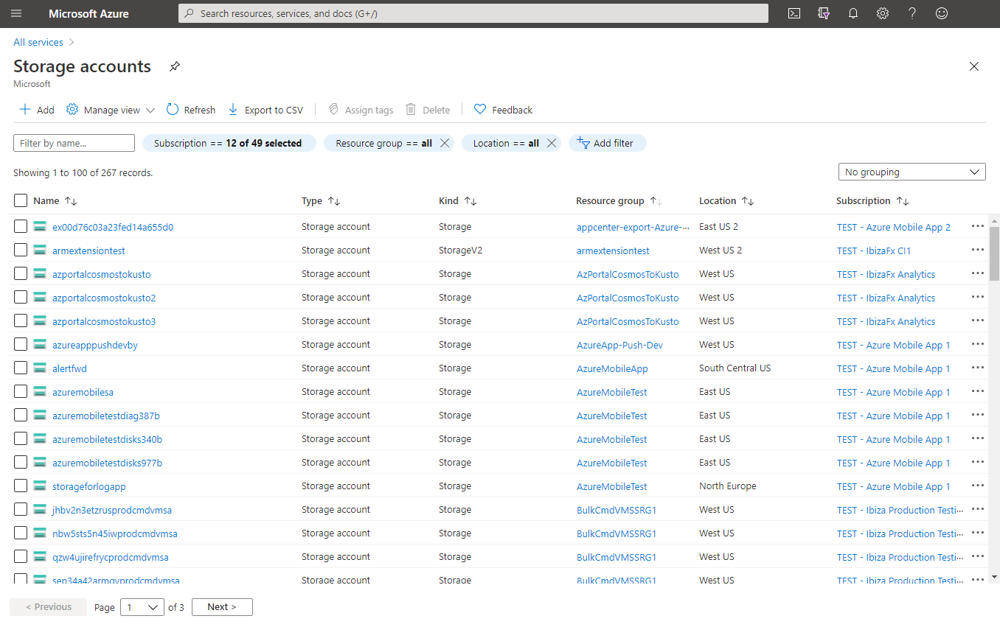
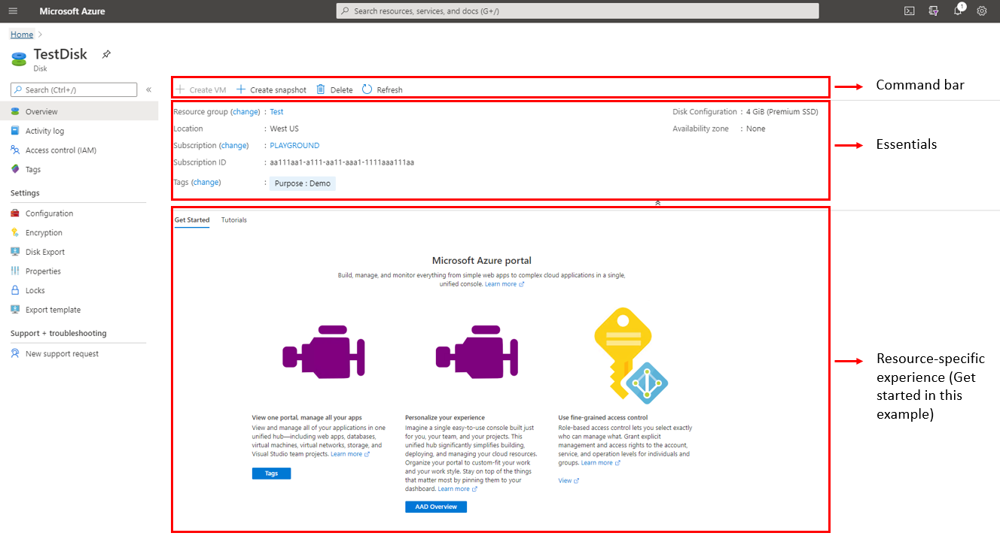
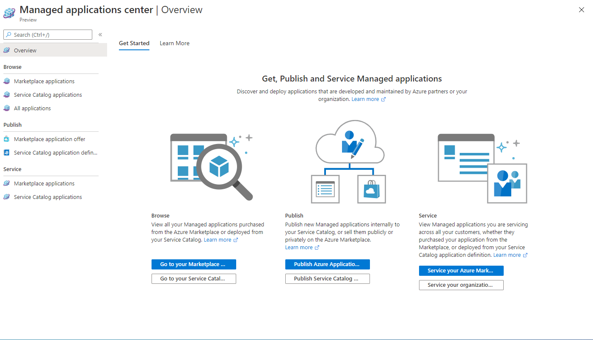
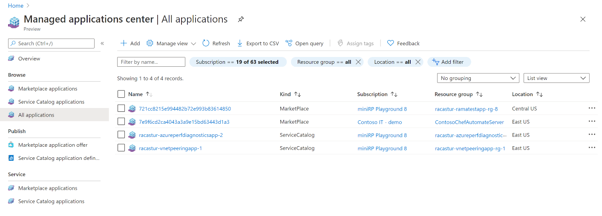
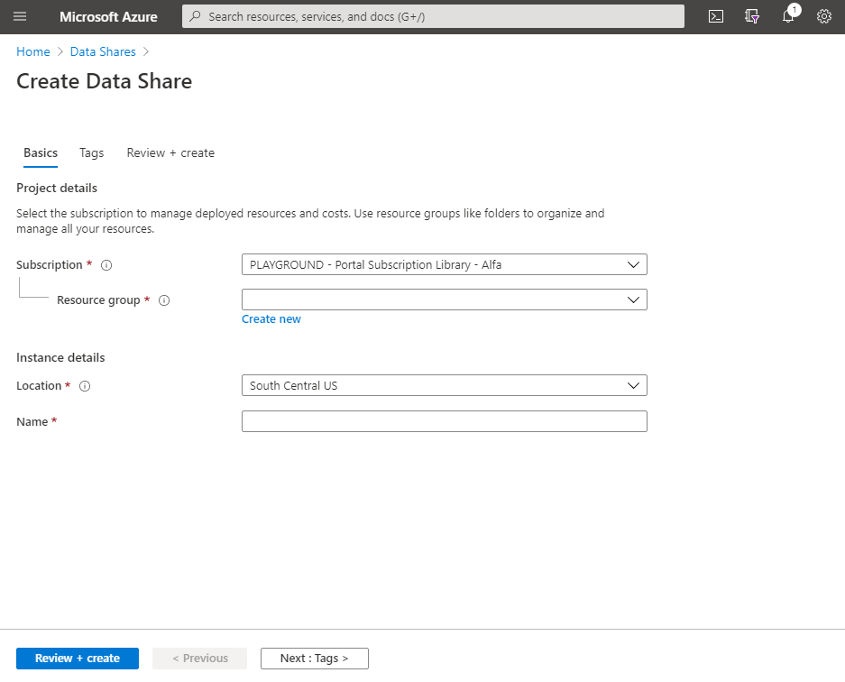
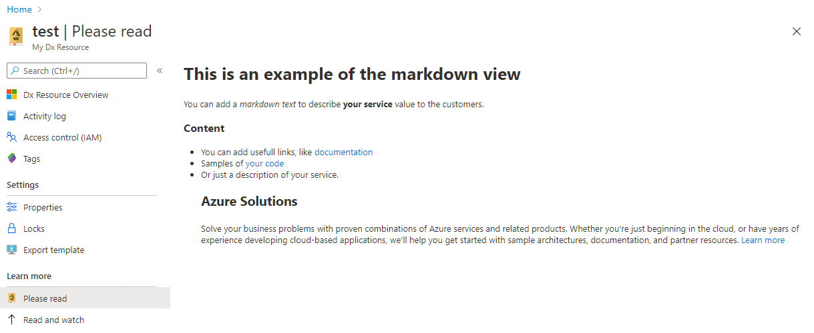

* [Declarative views](#declarative-views)
    * [Introduction](#declarative-views-introduction)
    * [Advantages of using declarative views](#declarative-views-advantages-of-using-declarative-views)
    * [Supported declarative views](#declarative-views-supported-declarative-views)
        * [All services integration](#declarative-views-supported-declarative-views-all-services-integration)
        * [Browse](#declarative-views-supported-declarative-views-browse)
        * [Resource menu](#declarative-views-supported-declarative-views-resource-menu)
        * [Overview](#declarative-views-supported-declarative-views-overview)
        * [Get started experiences](#declarative-views-supported-declarative-views-get-started-experiences)
        * [Browse as a resource menu item](#declarative-views-supported-declarative-views-browse-as-a-resource-menu-item)
        * [Resource creation](#declarative-views-supported-declarative-views-resource-creation)
        * [Markdown](#declarative-views-supported-declarative-views-markdown)
    * [Auto Generated views](#declarative-views-auto-generated-views)
    * [Declarative views basics](#declarative-views-declarative-views-basics)
        * [Localization in a declarative extension](#declarative-views-declarative-views-basics-localization-in-a-declarative-extension)
        * [Getting started with a declarative extension](#declarative-views-declarative-views-basics-getting-started-with-a-declarative-extension)
    * [Questions?](#declarative-views-questions)


<a name="declarative-views"></a>
# Declarative views

<a name="declarative-views-introduction"></a>
## Introduction

For common and popular views in the Azure portal like browse, get started, etc., it does not make sense for each team to build this view from scratch. Therefore, the framework team has built these popular views and lets you customize them easily by authoring a JSON file. The framework team recommends that extension team not re-build a view that is supported declaratively, as declarative views come with multiple advantages.

<a name="declarative-views-advantages-of-using-declarative-views"></a>
## Advantages of using declarative views

As a result of the framework handling the design and rendering, declarative views abstract away many of the challenges of building UI using native Ibiza blades/react views such as -

1. **Consistency** - The Azure Portal has well defined design patterns for common Azure scenarios like creating, browsing and managing a resource. All teams are expected to adhere to these design patterns and update their UI when the design patterns are updated. Declarative UI abstracts authors from this requirement and ensures that all declarative views are compliant with the latest design patterns.

1. **Cost of development** - Building declarative views is a lot quicker than native Ibiza development. When building declarative experiences, extension authors are abstracted from the challenges of UI development and only express the minimum contract for the experience being built.

1. **Accessibility** - The Azure Portal has certain accessibility standards that have to be met to make the portal usable for people who have limitations that prevent or impede the use of conventional user interfaces. All UI in the Azure Portal should meet this accessibility bar. The Portal goes continuously goes through accessibility testing and any bug related to accessibility has to be fixed immediately. Declarative UI abstracts away this accessibility requirements from partners and ensures that all declarative views meet the Portal's accessibility requirements.

1. **Performance** - The Azure Portal also has performance requirements which require that all blades load under a certain time threshold. All declarative views are optimized to provide the best possible performance. While declarative experiences alone cannot guarantee performance as there is a dependency on the backend API performance, when using declarative views, extension authors don't have to worry about the UI performance and can focus on the performance of backend APIs.

1. **Maintenance** - Native experiences in the Azure Portal have maintenance costs such as upgrading the SDK once ever 120 days, moving from deprecated controls and APIs to newer implementations etc. Maintaining a declarative view is a lot cheaper as there are no breaking changes to consume. Declarative experiences still have the 120 day SDK requirement. However, the team is working on removing this requirement too.

<a name="declarative-views-supported-declarative-views"></a>
## Supported declarative views

Declarative supports most popular patterns that are used repeatedly in the Azure Portal. Currently, scenarios listed below can be achieved declaratively.

<a name="declarative-views-supported-declarative-views-all-services-integration"></a>
### All services integration

To have a presence in the Azure Portal [All Services menu](https://portal.azure.com/?feature.customportal=false#allservices) and other entry points such as the global search bar in the Portal, an asset has be to defined. This asset can be defined declaratively. An asset represents a service in Azure and most assets map to an ARM resource type.

[Learn more about defining assets in the Azure Portal](declarative-assets.md).

Example of the storage account asset showing up in the Portal's global search -


Example of the storage account asset showing up in the Portal's All Services Menu -


<a name="declarative-views-supported-declarative-views-browse"></a>
### Browse

When Portal users click on the asset described above, they are taken to a browse view. The browse view is a list of all resources of the given resource type. In most cases, this information of all resources for a given resource type comes from [Azure Resource Graph](https://learn.microsoft.com/azure/governance/resource-graph/). Additionally, extension authors can add actions to the command bar to perform operations on a group of resources.

[Learn more about browse views in the Azure Portal](declarative-assets.md#configuring-browse).

Example of the storage account browse -



<a name="declarative-views-supported-declarative-views-resource-menu"></a>
### Resource menu

When a customer clicks on a particular resource in browse, they are taken to a page specific to that particular resource. A resource menu serves as a table of content for the resource and is present on the left side of the page. The resource menu is a list  of different options available to manage the resource. Authors can add new menu sections and menu items based on the necessary functionality for their resources. Additionally, a few menu items are available to all resources for free such as Activity log, Tags etc.

[Learn more about configuring the resource menu](declarative-assets.md#configuring-the-resource-menu).

Example of the resource menu for storage accounts -


<a name="declarative-views-supported-declarative-views-overview"></a>
### Overview

For consistency across resources, the first item in the resource menu for all resources should be overview. The overview for a resource contains three sections -

1. **Command bar** - The command bar contains actions that can be performed on a given resource.

1. **Essentials** - The essentials section displays properties of the resource. A few common properties are available for default such as subscription, resource group, location, tags etc. Additionally, the essentials view can be customized to add more properties.

1. **Resource specific experience** - Extension authors can choose how to utilize the space below essentials. This space can be built using any of the declarative views below. In the below example, the get started experience has been used.

Example of overview -



Learn more about building the overview view [here](portalfx-declarative-overview.md).

<a name="declarative-views-supported-declarative-views-get-started-experiences"></a>
### Get started experiences

In some scenarios, an asset does not necessarily map to an ARM resource type. In such cases, the best experience for customers may be a landing page/get started experience. A get started experience lays out information for the customer to get started with the service in the form of cards. The get started experience can optionally have a menu. Learn more about get started views in the Azure Portal [here](portalfx-declarative-overview.md#getting-started).

Example of the get started view for the Managed Apps center -



<a name="declarative-views-supported-declarative-views-browse-as-a-resource-menu-item"></a>
### Browse as a resource menu item

There are scenarios when an extension author may want a resource browse experience as a resource menu item. Examples of such scenarios are when a resource has child resources or landing pages that link to a category of resources. We recommend that all browse experiences be powered by [Azure Resource Graph](https://learn.microsoft.com/azure/governance/resource-graph/) when possible. Learn more about browse as a resource many item in the Azure Portal [here](portalfx-declarative-assets.md#browse-as-a-resource-menu-item).

Example of browse as a resource menu item -



<a name="declarative-views-supported-declarative-views-resource-creation"></a>
### Resource creation

Creating a resource is an important experience in the Azure Portal. The Azure Portal has a full screen, multi-tabbed pattern for resource creation that it recommends. Learn more about building declarative create experiences [here](portalfx-cuid.md).

Example of a compliant, full screen, multi-tabbed create experience -



<a name="declarative-views-supported-declarative-views-markdown"></a>
### Markdown

For simple experiences where an extension author want to display a document/information in the Azure Portal, they can use the markdown view. The markdown view is a simple view that renders markdown on the page.

Example of a markdown view -




<a name="declarative-views-auto-generated-views"></a>
## Auto Generated views

Before you begin authoring your own declarative blades, be sure to check the   [Generated Repo](https://msazure.visualstudio.com/One/_git/AzureUX-GeneratedExtension?path=/src/views) to grab existing declarative blades auto-generated on your behalf.

If your resource provider has published Azure REST API specs [(check here)](https://github.com/Azure/azure-rest-api-specs), we likely have views and asset definitions already generated.

To get started, [browse the GeneratedExtension repo](https://msazure.visualstudio.com/One/_git/AzureUX-GeneratedExtension?path=/src/views) & look for the name of your resource provider and drill into the respective api-version folder. Here you will find asset & blade definitions (dx files) that you can copy into your extension repo.

Learn more about UX Auto Generation [here](top-extensions-autogeneration.md)!

<a name="declarative-views-declarative-views-basics"></a>
## Declarative views basics

All declarative view JSONs should be compliant with dx.schema.json which is shipped as part of the Portal SDK. This schema drives your authoring experience, declarative views and assets validation during build time for your extension.

<a name="declarative-views-declarative-views-basics-localization-in-a-declarative-extension"></a>
### Localization in a declarative extension

Declarative extension support localization on par with native Ibiza extensions. We recommend using resjson for strings to be localized but support both, resjson and resx. Please refer to [this doc](https://aka.ms/locv3) to learn how to do this for your extension based on the build system you are on.

<a name="declarative-views-declarative-views-basics-getting-started-with-a-declarative-extension"></a>
### Getting started with a declarative extension

- Perform these [one time configuration steps](https://eng.ms/docs/products/azure-portal-framework-ibizafx/development/ap-cli#one-time-configuration-steps).
- We recommend using VS Code, however, if you want to use Visual Studio 2019 see [What are the IDE specific installs required for Visual Studio?](https://eng.ms/docs/products/azure-portal-framework-ibizafx/development/ap-cli#FAQ)
- Install the Azure Portal Developer CLI `npm install -g @microsoft/azureportalcli`
- To snap to a specific version include the version i.e `npm install -g @microsoft/azureportalcli@5.302.64701`.

- For start with a new declarative extension, run the following -

```
cd c:\ && mkdir dev && cd dev
ap new -d -n Microsoft_Azure_FirstExtension -o ./FirstExtension
cd ./FirstExtension/src/default/extension
ap start
```
<a name="declarative-views-questions"></a>
## Questions?

If you have any questions with using a declarative extension, please post your questions on [stack overflow](https://stackoverflow.microsoft.com/) with the `ibiza-declarative` tag.
