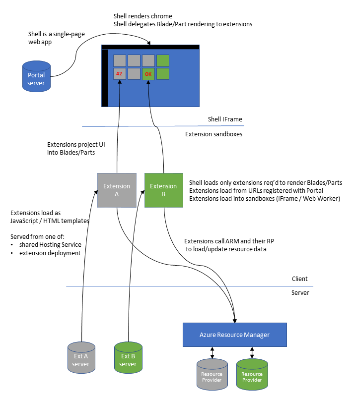
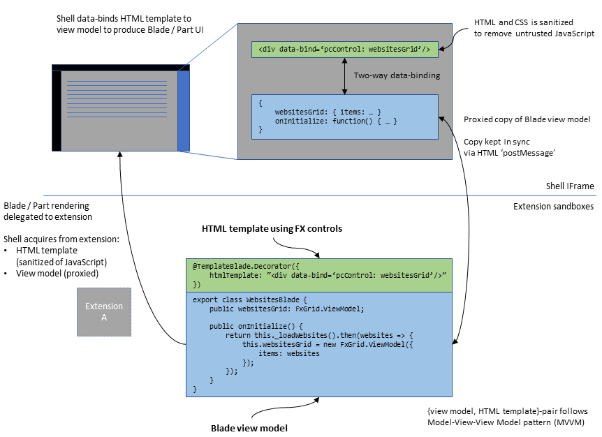

<a name="azure-portal-a-composed-web-application"></a>
# Azure Portal - A composed web application

The Azure Portal web application is based on a UI composition system whose primary design goal is to enable the integration of UI built by hundreds of teams into a single, robust single-page web application.

With this system, a team develops a UI extension to plug into and extend the UI of the Azure Portal.  Teams develop and refine UI iteratively and can choose a deployment cadence that suits their team schedule and their customer needs.  They can safely link from their UI to UI's constructed by other teams, resulting in a Portal application that -- to the Azure user -- appears to have been built by a single team.  Any bug in a team's UI has only a local impact on that team's UI and does not impact the availability/reliability of the larger Azure Portal UX or that of any other UI extension.

[The Portal Shell](#the-portal-shell)

[UI extensions](#ui-extensions)

[UI extension isolation](#ui-extension-isolation)

[Projecting Blade and Part UI](#projecting-blade-and-part-ui)

[Secure per service UI](#secure-ui-per-service)

[Linking and navigating within the Portal](#linking-and-navigating-within-the-portal)

[Blade and Part API versioning](#blade-and-part-api-versioning)

[Common Portal UX Marketplace and Browse](#common-portal-ux-marketplace-and-browse)

* * *

<a name="azure-portal-a-composed-web-application-the-portal-shell"></a>
### The Portal Shell

The Azure Portal web application is designed to the [single-page application pattern](portalfx-extensions-glossary-architecture.md), where UI is generated via client-side-evaluated JavaScript and dynamic HTML.  The Azure Portal "Shell" is the client-side JavaScript that controls the overall rendering of UI in the browser.  The Shell is responsible for rendering the [chrome](portalfx-extensions-glossary-architecture.md) of the Azure Portal (the navigation menu on the left and bar at the top).  Any team- or service-specific UI is developed in UI extensions as Blades (pages or windows) and Parts (tiles).  Based on user interaction with the Azure Portal UI, the Shell determines which Blades/Parts are to be displayed and it delegates the rendering of these Blades/Parts to the appropriate extension(s).



<a name="azure-portal-a-composed-web-application-ui-extensions"></a>
### UI extensions

UI extensions are simple, static web applications. Static  means that UI extensions do no server-side UI-generation.  UI extensions are developed as client-side-evaluated TypeScript that compiles to JavaScript, as HTML templates, and as LESS stylesheets that compile to CSS.  When the Shell determines that it needs to display a Blade or Part from UI extension "A", the JIT loads an HTML page that collects the extension JavaScript/HTML/CSS for that extension.  The Shell loads the HTML page from an endpoint URL registered centrally as part of the Azure Portal's configuration.  The Shell then directs the extension and its client-side JavaScript to render the required Blade or Part.  When the user navigates in such a way that no Blades/Parts from extension "A" are in use, the Shell can unload the UI extension from the browser, allowing the larger Azure Portal app to reclaim browser memory and network connections.

<a name="azure-portal-a-composed-web-application-ui-extension-isolation"></a>
### UI extension isolation

The business logic and UI generation accomplished by UI extensions is isolated from the Azure Portal "chrome" and from the UI of other UI extensions.  This is important for three reasons:
* Security - UI extension HTTP access can be restricted to specific origins/endpoints. UI extension JavaScript can be isolated to their own JavaScript heap
* Reliability - UI extension isolation limits the user impact of UI extension bugs
* Scale - Separating UI extension JavaScript allows the UI extension to be "unloaded" from the browser

In 2013, when the Azure Portal was designed, the only browser facility suitable for client-side JavaScript/DOM isolation was the `<IFRAME>` element.  Unfortunately, browsers circa 2013 did not scale performance-wise to the number of IFrames required by the many Parts (tiles) suggested by the 2013 Azure Portal UX design.  For this reason, UI extensions are loaded into the browser into non-visible IFrames.  Rather than using dynamic HTML techniques that require direct DOM access by the UI extension JavaScript, UI extensions "project" UI using Ibiza FX controls and HTML templates.  Such "projected" UI is rendered in the single, visible IFrame that is managed by the Shell.

**NOTE**: Since browsers circa 2018 scale better IFrames and since the Ibiza UX design is pivoting towards full-screen Blades, the Ibiza team continues to invest in a more conventional use of IFrames, where UI extensions can access the DOM directly and can craft their UI generation following standard web development patterns and OSS libraries.

<a name="azure-portal-a-composed-web-application-projecting-blade-and-part-ui"></a>
### Projecting Blade and Part UI

UI extensions develop their Blades and Parts following the [MVVM](portalfx-extensions-glossary-architecture.md) pattern.
* The "view" is defined as a Blade/Part-specific HTML template.  The HTML template typically arranges uses of FX controls in the Blade/Part content area.
*  The HTML template and FX controls are bound to a UI-extension-developed [ViewModel](portalfx-extensions-glossary-architecture.md) TypeScript class, which is where the UI extension business logic is isolated from the JavaScript of the larger Portal application and from other UI extensions.
* The `ViewModel` frequently includes "model" data loaded via AJAX from the cloud, though most often it is loaded from the Azure Resource Manager or from the team's/service's [Resource Provider](portalfx-extensions-glossary-architecture.md).

UI extensions develop a Blade or Part to this pattern by developing a TypeScript class adorned with a TypeScript decorator, as in the following code.

```
@TemplateBlade.Decorator({
    htmlTemplate: "./WebsiteDetails.html"
})
export class WebsiteDetailsTemplateBlade {
    public title = "Website details";
    public subtitle: string;

    public context: TemplateBlade.Context<void, WebsitesArea.DataContext>;

    public onInitialize() {
        return this._loadWebsiteDetails();
    }
}
```

**NOTE**: Blades and Parts were previously developed by authoring XAML that describes the mapping from a Blade / Part name to its corresponding `ViewModel` TypeScript class and its associated "view" HTML template.  This XAML API (named "PDL" for Portal Definition Language) was found to be developer-unfriendly in that it required that all three artifacts -- the XAML file, the TypeScript class file and the HTML template file -- be managed separately and kept in sync.  The new "no-PDL" TypeScript decorator APIs allow for a Blade or Part to be developed in a single TypeScript file.

Now, when a UI extension's Blade or Part is to be displayed, the Shell instantiates in that UI extension's IFrame an instance of the Blade / Part TypeScript class, also known as the `ViewModel`.  To "project" this Blade/Part UI into the Shell-managed visible IFrame that the user sees, the Shell makes use of a simple object-remoting API.  Here, the Blade / Part "view" and `ViewModel` are copied and sent via the HTML `postMessage` API to the visible IFrame managed by the Shell.  It is in the Shell-managed, visible IFrame that the "view" and `ViewModel` are two-way bound,  using the Knockout.js OSS library that is located at [https://knockoutjs.com/](https://knockoutjs.com/).



Because most UI is dynamic, like Forms that the user updates or like Grids/Lists that are refreshed to reflect new/updated server data, changes to the `ViewModel` are kept consistent between the Shell and UI extension IFrames.  The object-remoting system detects changes to [Knockout.js](https://knockoutjs.com/) observables  that are embedded in the `ViewModel`, computes diffs between the two `ViewModel` copies and uses `postMessage` to send diff-grams between the two `ViewModel` copies.  Beyond the conventional use of the Knockout.js library by the UI extension and its `ViewModel` class, complexities of the object-remoting system are hidden from the UI extension developer.

<a name="azure-portal-a-composed-web-application-secure-ui-per-service"></a>
### Secure UI per service

The security model for UI extensions builds upon the standard [same-origin policy](portalfx-extensions-glossary-architecture.md) that supported by all browsers and is the basis for today's web applications.  A UI extension's homepage URL is typically located on an origin specific to that UI extension and its resource provider.  This HTML page can only issue HTTPS calls to its origin domain and any origins that allow [COR](portalfx-extensions-glossary-architecture.md) calls from the UI extension's origin.

In practice, HTTPS calls from UI extensions are made from the client to load "model" data, and the HTTPS calls are typically directed to the following locations.

* Using CORs, to the Azure Resource Manager (ARM) and/or to the service's Resource Provider (RP);

* Less common, not recommended -- Using same-origin, to HTTP endpoints that are  extension controllers that are  dedicated to the operation of the UI extension.

In any of these cases, the HTTPS call includes an [AAD](portalfx-extensions-glossary-architecture.md) token that authorizes the UI extension to act on behalf of the user against those Azure resource types that the UI extension supports.  The AAD token is obtained during AAD single-sign-on authentication that precedes the loading of the Portal Shell.  When a UI extension is loaded into its client-side IFrame and asked to render a Blade or a Part, the UI extension typically calls an FX API with which it can acquire an AAD token that is scoped to that UI extension.  To load "model" data, the UI extension then issues HTTP calls carrying this token to ARM, to its RP or to its extension controller.

<a name="azure-portal-a-composed-web-application-linking-and-navigating-within-the-portal"></a>
### Linking and navigating within the Portal

Frequently, user interactions with the Portal chrome and within Blade/Part UI will cause in-Portal navigation to a new Blade.  This navigation is accomplished via FX APIs, as in the following example.

```
public onClick() {
    const { container, parameters } = this.context;

    container.openBlade(BladeReferences.forBlade("WebsiteDetailsBlade").createReference({
        parameters: { resourceId: parameters.resourceId },
    }));
}
```

There are two important concepts regarding navigation that are demonstrated here. First, in-Portal navigation is accomplished by using an FX TypeScript API available to UI-extension-authored Blades and Parts instead of by using URL. Second, the API requires the following uses of a code-generated Blade reference types.

* To identify the target Blade in question

* To provide a compiler-verified API for the Blade's parameters

For every Blade and Part developed in a UI extension, Ibiza tooling will code-generate a corresponding `BladeReferenceTypes.d.ts` or `PartReferenceTypes.d.ts` files that can be utilized with FX APIs to open a Blade and to pin a Part respectively, as in the following example.

```
import * as PartPinner from "Fx/Pinner";
import { PartReferences } from "Fx/Composition";

public onPinButtonClick() {
    const { parameters } = this.context;

    PartPinner.pin([
        PartReferences.forPart("WebsitePart").createReference({
            parameters: { resourceId: parameters.resourceId },
        })
    ]);
}
```

These APIs and associated code-generation are critical to integrating UI and UX across Azure services. Similar Blade and Part reference types useful to extension "A" for navigating among its Blades/Parts can be employed by extension "B" to link to Blades from "A". All that is necessary is for extension "A" to redistribute a code package containing the following.

* A [PDE](portalfx-extensions-glossary-architecture.md) file emitted as part of extension "A"'s build

* A TypeScript definition file for those API types used in the construction of extension "A"'s exported Blades and Parts

<a name="azure-portal-a-composed-web-application-blade-and-part-api-versioning"></a>
### Blade and Part API versioning

Each UI-extension-developed Blade and Part includes TypeScript types that describe the set of parameters with which that Blade/Part can be invoked, as in the following example.

```
export interface WebsiteDetailsBladeParameters {
    resourceId: string;
}

public onClick() {
    const { container, parameters } = this.context;
    const bladeParameters: WebsiteDetailsBladeParameters = {
          resourceId: parameters.resourceId
    };

    container.openBlade(BladeReferences.forBlade("WebsiteDetailsBlade").createReference({ parameters: bladeParameters }));
}

```

These form the APIs for the Blades and Parts exported by extension "A" to those teams who wish to link to extension "A" UI.  Like any other API that is produced by one team for the consumption of others, these APIs should be updated only in a backwards-compatible manner.  The TypeScript implementation of a Blade in extension "A" continues to support all versions of the `parameters` type ever published/exported to consuming teams.  Typically, extensions follow these best practices.

* Never change the name of a Blade or a Part

* Limit their `parameters` updates to the addition of parameters that are marked in TypeScript as optional

* Never remove parameters from their `Parameters` type

With this, extensions preserve the flexibility to evolve their sets of Blades and Parts and their APIs, independent of the Portal team and of team's reusing their UI, and to deploy changes at their own cadence, including backward-compatible API changes.

Additionally, the Ibiza SDK contains APIs that allow for the wholesale replacement of one Blade or Part with new equivalent Blades/Parts.  It also has APIs that allow for the safe migration of Blades and Part between UI extensions, for example, when responsibilities for specific UIs transfer between teams.

<a name="azure-portal-a-composed-web-application-common-portal-ux-marketplace-and-browse"></a>
### Common Portal UX Marketplace and Browse

Beyond Blades and Parts, UI extensions can benefit from other UI integration with the Azure Portal.
<!--  mentioned briefly here. -->

First, a UI extension team can develop "Marketplace packages".  Each of these packages describes an entry that will be displayed in the Azure Portal "Marketplace" UI.  A package includes the following.

* Metadata that specifies the UI for the item in the marketplace (icons, text, etc)

* Metadata that locates the Blade that will be invoked once that item is selected by the user in the Marketplace.  This Blade is a stylized Form that includes logic that knows how to provision Azure resources

* ARM templates that describe how a resource will be provisioned via ARM.

A UI extension team publishes their N>0 packages to a service, where all such packages/items are available in queryable form to the Azure Portal and to the Marketplace UI. The Marketplace UI is itself implemented as Blades in the "Azure Marketplace" UI extension.

<!-- TODO: Determine the meaning of "N>0". -->

Second, for a given UI extension / ARM resource type to be represented in the standard Azure Portal "Browse" UI, UI extensions develop UI metadata for the resource types that their UI extension supports.  This is accomplished with the PDL `<AssetType>` tag.  No-PDL variants of `<AssetType>` are currently in development.  An "asset type" is expressed as metadata so that standard Azure Portal UI, like "Browse" Blades and Parts, can display resources without the need to involve UI extension business log, which is potentially a performance problem when spanning N resource types.


<!--
gitdown": "include-file", "file": "../templates/portalfx-extensions-glossary-architecture.md"}
-->
