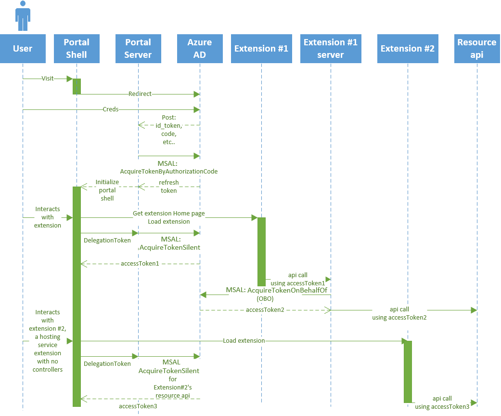

<a name="portal-authentication-architecture"></a>
## Portal Authentication Architecture

<a name="portal-authentication-architecture-portal-sign-in-flow"></a>
### Portal Sign-in flow

The Azure Portal uses Azure AD for authentication. Once the portal obtains a token from AD the user can then use that token to access the various backend services that power the UI. For example, the token can call Azure Resource Manager and the Active Directory Graph.

The following diagram shows the sequence of the authentication events during the sign-in process. It also shows how the portal interacts with the various backend services.



The following is the signin process that is performed by the Portal.

1. User browses to the Portal.

1. The Portal redirects to AAD to sign in.

1. AAD redirects to the `portal.azure.com/signin/index/` with an id_token. The audience of the id_token is the Azure Portal app.

1. The Portal server exchanges this code for an access token. This refresh token is returned to the browser, as part of the Portal Shell UI and is stored in memory.

1. When the user triggers the loading of the extension, the extension home page is downloaded from the location in the extension configuration, as specified in [portalfx-extensions-configuration-overview.md](portalfx-extensions-configuration-overview.md). This provides information required by the Shell to bootstrap the extension UI.

1. When an extension asks for a token, it makes a request to the Portal `DelegationToken` controller endpoint. This endpoint requires the refresh token that was just acquired, in addition to the extension name and the resource name that the extension requested. This endpoint returns access tokens to the browser.

    * Sample request:
        ```
        "extensionName":"Microsoft_AAD_IAM",
        "resourceName":"self",
        "tenant":"9e4917cd-bd32-4371-b1c8-82b5d610f2e2",
        "portalAuthorization":"MIIF…."
        ```

    * Sample response:
        ```
        "value":{
            "authHeader":"Bearer eyJ0...",
            "authorizationHeader":"Bearer ...",
            "expiresInMs":3299000,
            "refreshToken":"MIIF...",
            "error":null,
            "errorMessage":null
        },
        "portalAuthorization":"MIIF..."
        ```

    **NOTE**: Tokens are cached in memory on the server. In this example, the `resourceName: self` indicates that this extension only calls itself from the client.

1. Now the extension's client side can call server side API's, or call external services directly.

    * Server side API

        The extension's server-side code can exchange its current access token for another access token that allows it to use resources, as described in [http://aka.ms/portalfx/onbehalfof](http://aka.ms/portalfx/onbehalfof). Details of how this is achieved is outlined in [top-extensions-authentication-procedures.md](top-extensions-authentication-procedures.md)

    *  Direct external services call

        The PortalFx's client side `ajax` wrapper makes the `DelegationToken` call to get a token for the specified resource. In this case, the PortalFx team creates the app registration for the extension and manages permissions for the API's as specified in [top-extensions-configuration.md](top-extensions-configuration.md).

        The framework keeps track of token expiration. When the user interacts with the site in a way that results in an API call, and the token is about to expire, the framework makes the call to `DelegationToken` again to get new access tokens. The extension uses the PortalFx's client side `ajax` wrapper.

The Portal signs the user into the last-used directory, the home directory for AAD accounts, or the first directory it gets from ARM for MSA accounts. It also loads the Startboard and all extensions.

Navigating to a new extension repeats this process, beginning at triggering the loading of the extension. If the user revisits an extension, a client side in-memory token cache is used instead of  making another request to the Portal `DelegationToken` controller endpoint. This cache is lost on page refresh.

**NOTE**: Cookies are not used for authentication.

For more information about OIDC flow, see [https://docs.microsoft.com/en-us/azure/active-directory/develop/active-directory-protocols-openid-connect-code](https://docs.microsoft.com/en-us/azure/active-directory/develop/active-directory-protocols-openid-connect-code).
