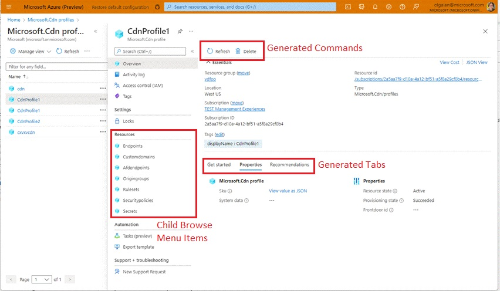
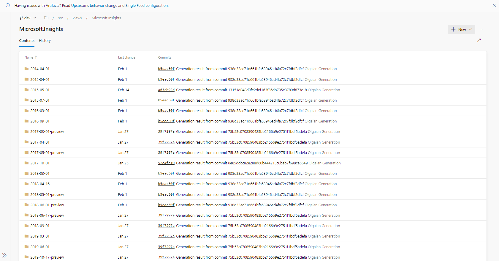
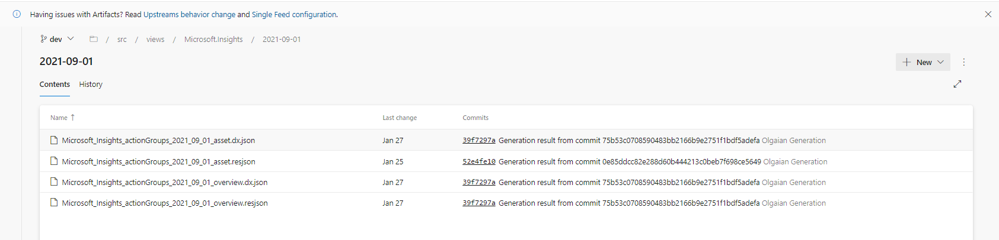

# Getting started with Default Experiences (Generated UX)

Azure Portal leverages the Declarative framework and Hubs to automatically generate & serve experiences for resource types using Azure Resource Provider metadata. Extension developers can save time by making use of these auto-generated artifacts (asset definitions and views).

If your resource provider has published Azure REST API specs [(check here)](https://github.com/Azure/azure-rest-api-specs), we most likely have asset definitions and views generated for your resource types.

You can discover the experiences for your resource types through Global Search. Default experiences include:

| **Browse + Management**       	|                                                                       	|
|-------------------------------	|-----------------------------------------------------------------------	|
| > Global Search               	| _Discover resource instances and browse view through search_              	|
| > All Resources               	| _Discover resource instances in All Resources and launch Overview UX_ 	|
| > Browse                      	| _Browse and manage resource instances in standard browse view_          	|
| **Overview UX**               	|                                                                       	|
| > Commands:                   	| Refresh, Delete, Create*, Open in mobile*                             	|
| > Tabs:                       	| Get Started template, Properties, Monitoring, Recommendations                  	|
| > Essentials                  	| _Enable essentials control_                 	|
| **Resource Menu**             	|                                                                       	|
| > Standard Framework Options: 	| Support + Troubleshooting, Activity Log, IAM, Tags, Monitoring, Diagnostics, etc.              	|
| > Properties view             	| _Enable properties view for resource_                                 	|
| > CLI / PS view               	| _Enable CLI / PS view for resource_                                   	|
| > Child Browse views          	| _View child resources in menu_                                        	|

## Extending default experiences with a portal extension:
You can copy, adjust & ship several generated artifacts in your extension to expedite development. We generate asset definitions for top level resource types, proxyasset definitions for child level resources and overview template that includes get started, properties, monitoring and recommendations tabs if applicable.

To customize the default experience, you must take ownership of the generated asset and develop a portal extension. Kickoff development by [browsing the AzureUX-GeneratedExtension repo](https://msazure.visualstudio.com/One/_git/AzureUX-GeneratedExtension?path=/src) for your generated asset definition & views that you can copy and use into your extension repo.

Look for the name of your resource provider in the "views" folder of the [Generated Repo](https://msazure.visualstudio.com/One/_git/AzureUX-GeneratedExtension?path=/src/views)

Drill into your current API-version

Copy and paste the available asset definitions and dx views into your extension project

After adjusting icons, strings and making any changes, you can ship your extension with these asset definitions and views.

We highly encourage using default experiences to reduce maintainence and feel free to submit feature requests. If you have any questions regarding default experience or generated UX, please contact dxportalteam@microsoft.com
