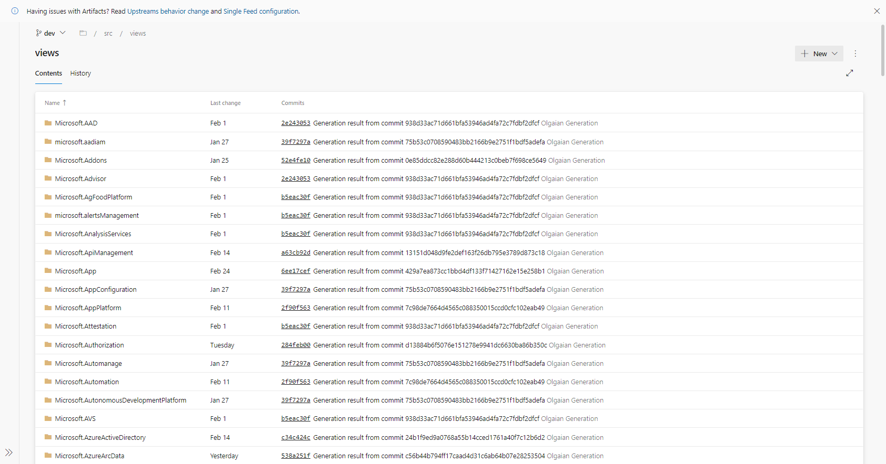

# Getting started with Auto Generation (Generated UX)

Azure Portal leverages the declarative framework to auto-generate artifacts for extensions using Azure resource provider metadata. Extension developers can save time by making use of these auto-generated artifacts (asset definitions and views).

If your resource provider has published Azure REST API specs [(check here)](https://github.com/Azure/azure-rest-api-specs), we most likely have asset definitions and views generated for your resource types. You can copy, adjust & ship several generated artifacts in your extension to expedite development.
  

## Add generated Asset definitions &amp; Views into your extension:

We generate asset definitions for top level resource types and proxyasset definitions for child level resources. The generated extension menu includes a generated "Get Started" / "Overview" declarative view and menu items for child resources (if applicable). The generated overview page includes tabs for extension information, properties, charts and recommendations. We also offer a PropertiesView dx view.

Generated Artifacts TLDR:
- Overview page with commands (Refresh, Delete) & tabs (Get Started, Properties, Recommendations)
- Extension Menu with Child Browse menu items (via asset / proxyAsset definitions)

- Properties View

  

# How it Works

[Browse the GeneratedExtension repo](https://msazure.visualstudio.com/One/_git/AzureUX-GeneratedExtension?path=/src) for asset & view definitions that you can copy and use into your extension repo.

1. Look for the name of your resource provider in the "views" folder of the [Generated Repo](https://msazure.visualstudio.com/One/_git/AzureUX-GeneratedExtension?path=/src/views) and drill into the respective api-version folder.

2. Copy and paste the available asset definitions and dx views into your extension repo

3. After adjusting icons and making any changes, you can ship your extension with these asset definitions and views. We highly encourage using autogenerated views as a template and making changes in your editor. If you have any questions regarding generated views, please contact dxportalteam@microsoft.com
