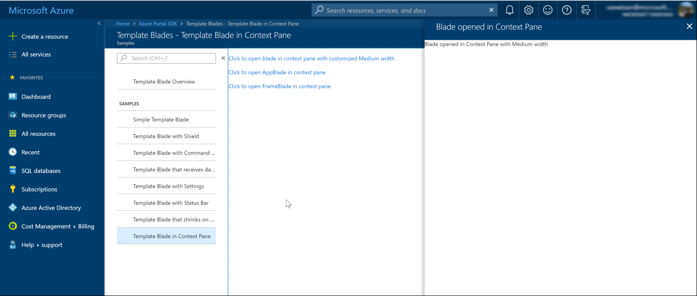

<a name="context-panes"></a>
# Context panes

Context panes are a different visual representation of blades. The main difference is that they do not cause the screen to horizontally scroll when navigating to a context pane. Instead, the context pane is displayed in front of the current content, beginning at  the right side of the screen, as in the following image.  This allows the user to interact with the context pane while retaining the context of the previous experience.

<a name="context-panes-when-to-use-a-context-pane"></a>
### When to use a context pane

Context panes are primarily used as leaf blades in your navigation experience. For example, if you want to present the user with properties that they can edit, or if you want to have the user create an entity, a single context pane is a good design choice.

<a name="context-panes-examples-of-a-context-pane"></a>
### Examples of a context pane

An example of a context pane is in the following image.



<a name="context-panes-how-to-author-a-context-pane"></a>
### How to author a context pane

A context pane can be authored as a standard blade implementation. The extension can call a variant of the blade-opening APIs that will instruct the Portal to open the context pane at the location at which you want to open the pane.
An example of using a context pane is located at `<dir>/Client/V1/Navigation/OpenAndCloseBladeApis/ViewModels/OpenBladeApiSamplesViewModel.ts`. It is also in the following code.

```
import { Person } from "DataModels/Person";
import * as Di from "Fx/DependencyInjection";
import * as OptionsGroup from "Fx/Controls/OptionsGroup";
import * as TextBox from "Fx/Controls/TextBox";
import { BladeReferences, BladeLink, ResourceLink, ClickableLink, OnClickHandler } from "Fx/Composition";
import * as FxCompositionBlade from "Fx/Composition/Pdl/Blade";
import { ViewModels as ViewModelDefinitions } from "_generated/ExtensionDefinition";
import { DataContext } from "../../NavigationArea";

import AjaxMock from "../../../../Mock/AjaxMock";

// import references to blades that are opened by these samples
import * as Resources from "ClientResources";

import Def = ViewModelDefinitions.V1$$Navigation.OpenBladeApiSamplesViewModel;
import BladeContainer = FxCompositionBlade.Container;
import Grid = MsPortalFx.ViewModels.Controls.Lists.Grid;
import QueryView = MsPortalFx.Data.QueryView;

// Data type used in the grid sample
export { Person } from "DataModels/Person";

// OBSOLETE API IMPORTS
import * as FxObsoleteHotSpot from "Fx/Controls/HotSpot";
const ObsoleteHotSpot: any = FxObsoleteHotSpot;
type ObsoleteHotSpotViewModel = any;

/**
 * Const function which produces a callback
 * which increments a give ko observable counter.
 *
 * @param observable ko observable counter to get incremented.
 * @returns a function which increments the provided counter.
 */
const incrementDynamicFxclickClickCount = (observable: KnockoutObservable<number>) => {
    return () => {
        observable(observable() + 1);
    };
};

@Di.Class("viewModel")
export class OpenBladeApiSamplesViewModel
    extends MsPortalFx.ViewModels.Blade
    implements Def.Contract {

    private _container: BladeContainer;

    public onOpenChildBladeLinkClick: OnClickHandler;

    /**
     * Renders a blade link as part of a standard HTML anchor tag from the template,
     * allowing for common browser operations like Ctrl + Click to open in new tab,
     * Right click -> copy link to copy to clipboard, etc. in addition to opening the blade on normal click.
     */
    public readonly onOpenChildBladeLinkClickWithBladeLink: BladeLink;

    /**
     * Renders a blade link as part of a standard HTML anchor tag from the template,
     * with an observable inner BladeReference,
     * allowing for common browser operations like Ctrl + Click to open in new tab,
     * Right click -> copy link to copy to clipboard, etc. in addition to opening the blade on normal click.
     */
    public readonly onOpenChildBladeLinkClickWithDynamicBladeLink: BladeLink;

    /**
     * Renders a resource link as part of a standard HTML anchor tag from the template,
     * allowing for common browser operations like Ctrl + Click to open in new tab,
     * Right click -> copy link to copy to clipboard, etc. in addition to opening the blade on normal click.
     */
    public readonly onOpenChildBladeLinkClickWithResourceLink: ResourceLink;

    /**
     * Renders a resource link as part of a standard HTML anchor tag from the template,
     * with an observable inner ResourceID,
     * allowing for common browser operations like Ctrl + Click to open in new tab,
     * Right click -> copy link to copy to clipboard, etc. in addition to opening the blade on normal click.
     */
    public readonly onOpenChildBladeLinkClickWithDynamicResourceLink: ResourceLink;

    /**
     * Renders a ClickableLink as part of a standard HTML anchor tag from the template,
     * allowing for common browser operations like Ctrl + Click to open in new tab,
     * Right click -> copy link to copy to clipboard, etc. in addition to opening the blade on normal click.
     */
    public readonly onLinkClickWithClickableLink: ClickableLink;

    public readonly bladeRefPicker: OptionsGroup.Contract<any>;
    public readonly resourceIdPicker: OptionsGroup.Contract<any>;
    public readonly fxclickPicker: OptionsGroup.Contract<any>;

    /**
     * Counter for usage telemetry on the dynamic fxclick sample.
     */
    public readonly dynamicFxclickClickCount = ko.observable<number>(0);

    /**
     * Counter for usage telemetry on the dynamic BladeLink sample.
     */
    public readonly bladeLinkClickCount = ko.observable<number>(0);

    /**
     * Counter for usage telemetry on the ResourceLink sample.
     */
    public readonly resourceLinkClickCount = ko.observable<number>(0);

    /**
     * Counter for usage telemetry on the ClickableLink sample.
     */
    public readonly clickableLinkClickCount = ko.observable<number>(0);

    /**
     * Observable BladeReference to hook up within the dynamic BladeLink.
     */
    private readonly dynamicBladeRef = ko.observable(BladeReferences.forBlade("OpenBladeApiChildBlade").createReference());

    /**
     * Observable BladeReference to hook up within the dynamic BladeLink.
     */
    private readonly dynamicResourceId = ko.observable("/subscriptions/sub123/resourceGroups/accounts/providers/Microsoft.test/accounts/Peter");

    /**
     * Dynamnic fxclick which wraps in an observable any of the four possible functions:
     * - regular callback,
     * - BladeLink,
     * - ResourceLink,
     * - ClickableLink.
     */
    public readonly dynamicFxclick: KnockoutObservable<OnClickHandler | BladeLink | ResourceLink | ClickableLink>;

    /**
     * Text to display on the dynamic fxclick link.
     */
    public readonly dynamicFxclickText: KnockoutObservable<string>;

    /**
     * Text to display on the <div> fxclick link.
     */
    public readonly divTagFxclickText = Resources.divTagFxclickText;

    /**
     * Text to display on the <a> fxclick link.
     */
    public readonly aTagFxclickText = Resources.aTagFxclickText;

    /**
     * on-click callback for the 'DIV' tag callback fxclick.
     */
    public onDivTagFxclickClick() {
        // in real applications one might opt for logging telemetry at this level
        console.log(`The 'DIV' tag callback fxclick has been accessed with href="${this.hrefValue()}"`);
    }

    /**
     * on-click callback for the 'A' tag callback fxclick.
     */
    public onATagFxclickClick() {
        // in real applications one might opt for logging telemetry at this level
        console.log(`The 'A' tag callback fxclick has been accessed with href="${this.hrefValue()}"`);
    }

    /**
     * Input field for feeding in the desired HREF value.
     */
    public readonly customHrefTextBox: TextBox.Contract;

    /**
     * The desired HREF value.
     */
    public readonly hrefValue = ko.observable<string>();
    /**
     * Used as a showcase callback for the dynamic fxclick sample.
     */
    private readonly _onCallbackFxclickClick: OnClickHandler;

    /**
     * Used as a showcase Blade Link for the dynamic fxclick sample.
     */
    private readonly _onBladeLinkFxclickLink: BladeLink;

    /**
     * Used as a showcase Resource Link for the dynamic fxclick sample.
     */
    private readonly _onResourceLinkFxclickLink: ResourceLink;

    /**
     * Used as a showcase Clickable Link for the dynamic fxclick sample.
     */
    private readonly _onClickableLinkFxclickLink: ClickableLink;

    /**
     * Hotspot view model
     */
    public hotspot: ObsoleteHotSpotViewModel;

    public grid: Grid.ViewModel<Person, Person>;

    private _view: QueryView<Person, string>;

    constructor(container: BladeContainer, dataContext: DataContext, _mock: AjaxMock) {
        super();
        this.title(Resources.openBladeAPITitle);
        this.subtitle(Resources.navigationSamplesTitle);

        this._container = container;

        this.bladeRefPicker = OptionsGroup.create(this._container, {
            label: Resources.bladeRefPickerLabel,
            items: [
                {
                    text: Resources.validChildBlade,
                    value: Resources.validChildBlade,
                },
                {
                    text: Resources.validBlade,
                    value: Resources.validBlade,
                },
                {
                    text: Resources.nullBladeRefLabel,
                    value: Resources.nullBladeRefLabel,
                },
            ],
        });

        this.resourceIdPicker = OptionsGroup.create(this._container, {
            label: Resources.resourceIdPickerLabel,
            items: [
                {
                    text: Resources.validResource,
                    value: Resources.validResource,
                },
                {
                    text: Resources.nullResourceIdLabel,
                    value: Resources.nullResourceIdLabel,
                },
            ],
        });

        this.fxclickPicker = OptionsGroup.create(this._container, {
            label: Resources.fxclickPickerLabel,
            items: [
                {
                    text: Resources.callback,
                    value: Resources.callback,
                },
                {
                    text: Resources.bladeLink,
                    value: Resources.bladeLink,
                },
                {
                    text: Resources.resourceLink,
                    value: Resources.resourceLink,
                },
                {
                    text: Resources.clickableLink,
                    value: Resources.clickableLink,
                },
            ],
        });

        this._onCallbackFxclickClick = () => {
            void this._container.openBlade(BladeReferences.forBlade("OpenBladeApiChildBlade").createReference());
            incrementDynamicFxclickClickCount(this.dynamicFxclickClickCount)();
        };

        this._onBladeLinkFxclickLink = {
            bladeReference: BladeReferences.forBlade("OpenBladeApiChildBlade").createReference(),
            onLinkOpened: incrementDynamicFxclickClickCount(this.dynamicFxclickClickCount),
        };

        this._onResourceLinkFxclickLink = {
            resourceId:  "/subscriptions/sub123/resourceGroups/accounts/providers/Microsoft.test/accounts/Peter",
            onLinkOpened: incrementDynamicFxclickClickCount(this.dynamicFxclickClickCount),
        };

        this._onClickableLinkFxclickLink = new ClickableLink(
            "http://www.bing.com/",
            "_new",
            "",
            incrementDynamicFxclickClickCount(this.dynamicFxclickClickCount),
        );

        // showcasing the callback case by default
        this.dynamicFxclick = ko.observable(this._onCallbackFxclickClick);
        this.dynamicFxclickText = ko.observable(Resources.dynamicFxclickCallbackText);

        this.onOpenChildBladeLinkClick = () => {
            void this._container.openBlade(BladeReferences.forBlade("OpenBladeApiChildBlade").createReference());
        };

        this.onOpenChildBladeLinkClickWithBladeLink = {
            bladeReference: BladeReferences.forBlade("OpenBladeApiChildBlade").createReference(),
        };

        this.onOpenChildBladeLinkClickWithDynamicBladeLink = {
            bladeReference: this.dynamicBladeRef,
            onLinkOpened: (keypress) => {
                this.bladeLinkClickCount(this.bladeLinkClickCount() + 1);

                if (keypress) {
                    console.log("The BladeLink has been accessed by 'Enter' key");
                } else {
                    console.log("The BladeLink has been accessed by left-Click");
                }
            },
        };

        this.onOpenChildBladeLinkClickWithResourceLink = {
            resourceId: "/subscriptions/sub123/resourceGroups/accounts/providers/Microsoft.test/accounts/Peter",
        };

        this.onOpenChildBladeLinkClickWithDynamicResourceLink = {
            resourceId: this.dynamicResourceId,
            onLinkOpened: (keypress) => {
                this.resourceLinkClickCount(this.resourceLinkClickCount() + 1);

                if (keypress) {
                    console.log("The ResourceLink has been accessed by 'Enter' key");
                } else {
                    console.log("The ResourceLink has been accessed by left-Click");
                }
            },
        };

        this.onLinkClickWithClickableLink = new ClickableLink(
            "http://www.bing.com/",
            "_new",
            "",
            (keypress) => {
                this.clickableLinkClickCount(this.clickableLinkClickCount() + 1);

                if (keypress) {
                    console.log("The ClickableLink has been accessed by 'Enter' key");
                } else {
                    console.log("The ClickableLink has been accessed by left-Click");
                }
            }
        );

        this.customHrefTextBox = TextBox.create(container, {
            placeHolderText: Resources.customHrefTextBoxPlaceholder,
            value: this.hrefValue,
        });

        this._initializeHotSpotSample(container);
        this._initializeGridSample(container, dataContext);
        this._initializeBladeLinkSample(container);
        this._initializeResouceLinkSample(container);
        this._initializeDynamicFxclickLinkSample(container);
    }

    /**
     * onInputsSet is invoked when the template blade receives new parameters
     */
    public onInputsSet(): Promise<any> {
        // fetch data for the grid sample
        return this._view.fetch("");
    }

    public bladeOpened = ko.observable(false);

    public onButtonClick() {
        // this callback is invoked when the blade is closed
        const onBladeClosed = () => {
            // just for demonstration purposes we set a value that is displayed in the blade to false
            this.bladeOpened(false);
        };

        // The openBlade API returns a promise that is resolved after the blade is opened
        const openBladePromise = this._container.openBlade(BladeReferences.forBlade("OpenBladeApiChildBlade").createReference({ onClosed: onBladeClosed }));

        // If the promise result is true the blade was sucessfully opened.
        // If the promise is false the blade could not be opened.
        // This can happen for example if a different blade is open with edits and the user doesn't want to lose their changes
        void openBladePromise.then((result) => {
            this.bladeOpened(result);
        });
    }

    public contextBladeOpened = ko.observable(false);

    public onContextBladeButtonClick() {
        // this callback is invoked when the blade is closed
        const onBladeClosed = () => {
            // just for demonstration purposes we set a value that is displayed in the blade to false
            this.contextBladeOpened(false);
        };

        const openContextBladePromise = this._container.openContextPane(BladeReferences.forBlade("OpenBladeApiChildBlade").createReference({ onClosed: onBladeClosed }));

        void openContextBladePromise.then((result) => {
            this.contextBladeOpened(result);
        });
    }

    public onContextAppBladeButtonClick() {
        /* Opens an AppBlade in the context menu (additional sample) */
        void this._container.openContextPane(BladeReferences.forBlade("AppBlade").createReference());
    }

    public onRowClick(item: Person) {
        void this._container.openBlade(BladeReferences.forBlade("PersonBlade").createReference({
            parameters: { ssnId: item.ssnId() },
        }));
    }

    public onResourceMenuButtonClick() {
        //bladeReference#resourceMenuBlade
        // open the "control" menu item in the resource menu for a specific resource
        const resourceId = "/subscriptions/sub123/resourcegroups/servertest/providers/Microsoft.test/virtualservers/web1";
        void this._container.openBlade(BladeReferences.forExtension("HubsExtension").forMenuBlade("ResourceMenuBlade", "control").createReference({ parameters: { id: resourceId } }));
        //bladeReference#resourceMenuBlade
    }

    public onResourceMenuButtonWithNotificationClick() {
        //bladeReference#resourceMenuBladeWithOverride
        const resourceId = "/subscriptions/sub123/resourcegroups/servertest/providers/Microsoft.test/virtualservers/web1";

        // create a reference with the custom notification we want to pass to the control blade
        const controlBladeReference = BladeReferences.forBlade("VirtualServerControlBlade").createReference({ parameters: { id: resourceId, showNotification: "true" } });

        // create a reference for the resource menu blade with our custom control blade reference
        const menuBladeReference = BladeReferences.forExtension("HubsExtension").forMenuBlade("ResourceMenuBlade", "control", controlBladeReference).createReference({ parameters: { id: resourceId } });

        // when the resource menu blade is opened -
        // 1. the 'control' menu item will be selected
        // 2. the 'VirtualServerControlBlade' will be opened as the menu blade content
        void this._container.openBlade(menuBladeReference);
        //bladeReference#resourceMenuBladeWithOverride
    }

    public onOpenBladeInPlaceButtonClick() {
        void this._container.openBlade(BladeReferences.forBlade("OpenBladeApiChildBlade").createReference(), { inPlace: true });
    }

    private _initializeHotSpotSample(container: BladeContainer) {
        this.hotspot = new ObsoleteHotSpot.ViewModel(container, {
            onClick: () => {
                void container.openBlade(BladeReferences.forBlade("OpenBladeApiChildBlade").createReference());
            },
        });
    }

    private _initializeGridSample(container: BladeContainer, dataContext: DataContext) {
        this._view = dataContext.personData.peopleQuery.createView(container);

        const selectionOptions: Grid.SelectableRowExtensionOptions<Person, Person> = {
            selectableRow: {
                selectionMode: Grid.RowSelectionMode.Single,
            },
            onRowClicked: this.onRowClick.bind(this),
        };

        this.grid = new Grid.ViewModel<Person, Person>(container, this._view.items, Grid.Extensions.SelectableRow, selectionOptions);
        this.grid.columns([
            {
                itemKey: "ssnId",
            },
            {
                itemKey: "name",
            }]);
    }

    private _initializeBladeLinkSample(container: BladeContainer) {
        this.bladeRefPicker.value.subscribe(container, (value) => {
            if (Resources.nullBladeRefLabel === value) {
                this.dynamicBladeRef(null);
            } else if (Resources.validBlade === value) {
                this.dynamicBladeRef(BladeReferences.forBlade("OpenBladeApiSamples").createReference());
            } else if (Resources.validChildBlade === value) {
                this.dynamicBladeRef(BladeReferences.forBlade("OpenBladeApiChildBlade").createReference());
            }
        });
    }

    private _initializeResouceLinkSample(container: BladeContainer) {
        this.resourceIdPicker.value.subscribe(container, (value) => {
            if (Resources.nullResourceIdLabel === value) {
                this.dynamicResourceId(null);
            } else if (Resources.validResource === value) {
                this.dynamicResourceId("/subscriptions/sub123/resourceGroups/accounts/providers/Microsoft.test/accounts/Peter");
            }
        });
    }

    private _initializeDynamicFxclickLinkSample(container: BladeContainer) {
        this.fxclickPicker.value.subscribe(container, (value) => {
            if (Resources.callback === value) {
                this.dynamicFxclick(this._onCallbackFxclickClick);
                this.dynamicFxclickText(Resources.dynamicFxclickCallbackText);
            } else if (Resources.bladeLink === value) {
                this.dynamicFxclick(this._onBladeLinkFxclickLink);
                this.dynamicFxclickText(Resources.dynamicFxclickBladeLinkText);
            } else if (Resources.resourceLink === value) {
                this.dynamicFxclick(this._onResourceLinkFxclickLink);
                this.dynamicFxclickText(Resources.dynamicFxclickResourceLinkText);
            } else if (Resources.clickableLink === value) {
                this.dynamicFxclick(this._onClickableLinkFxclickLink);
                this.dynamicFxclickText(Resources.dynamicFxclickClickableLinkText);
            }
        });
    }
}

```

For information about blade references, see [top-blades-opening-and-closing.md#open-blade-methods](top-blades-opening-and-closing.md#open-blade-methods).
