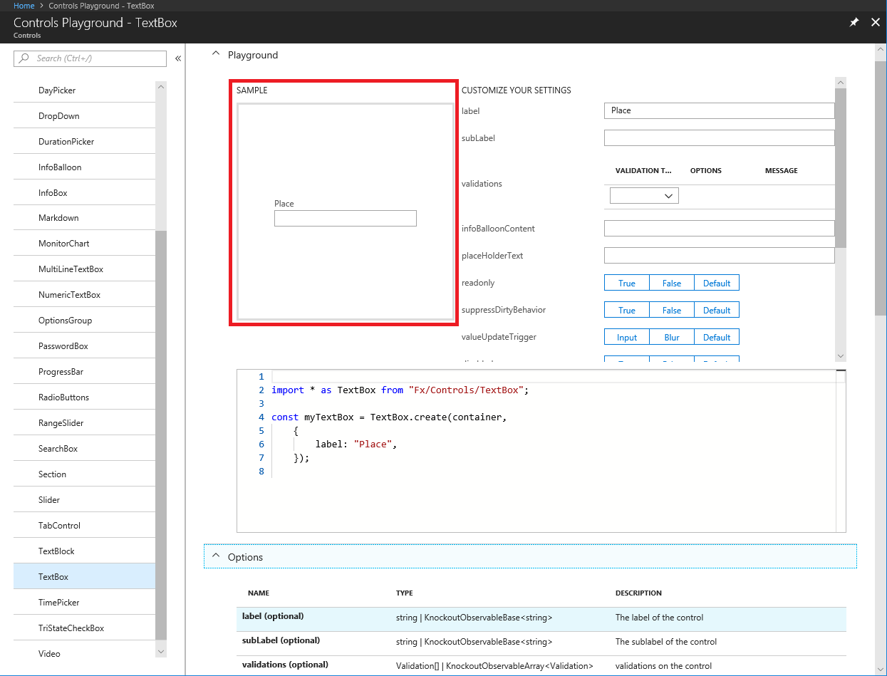
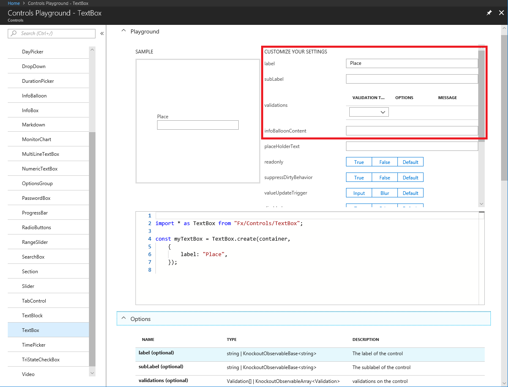
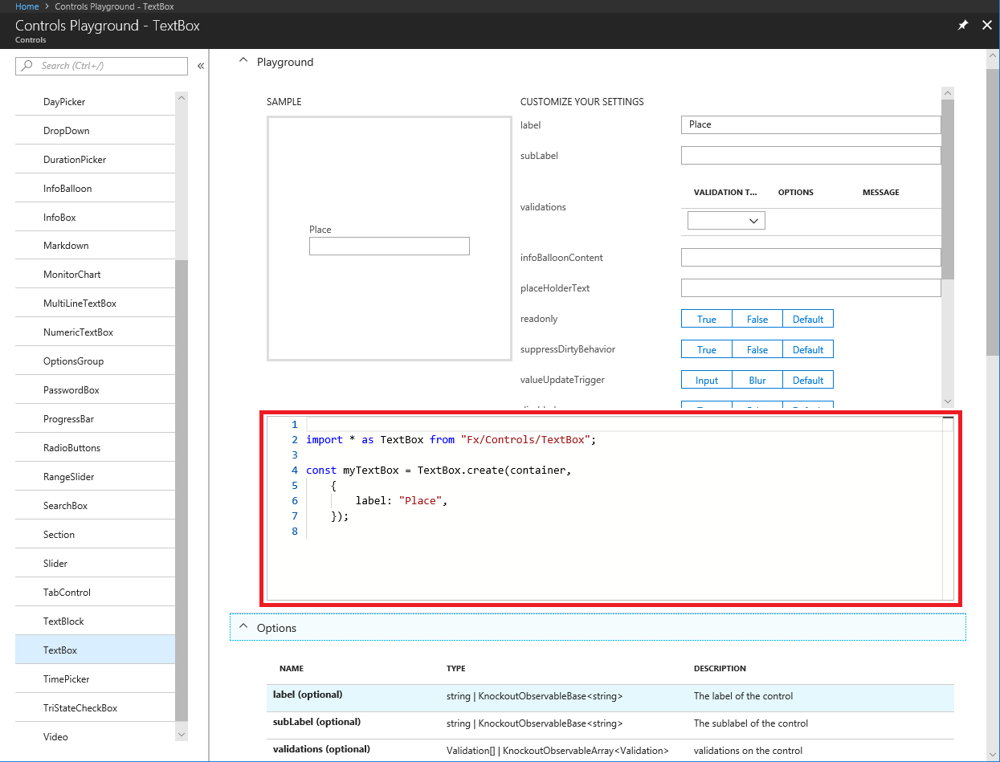
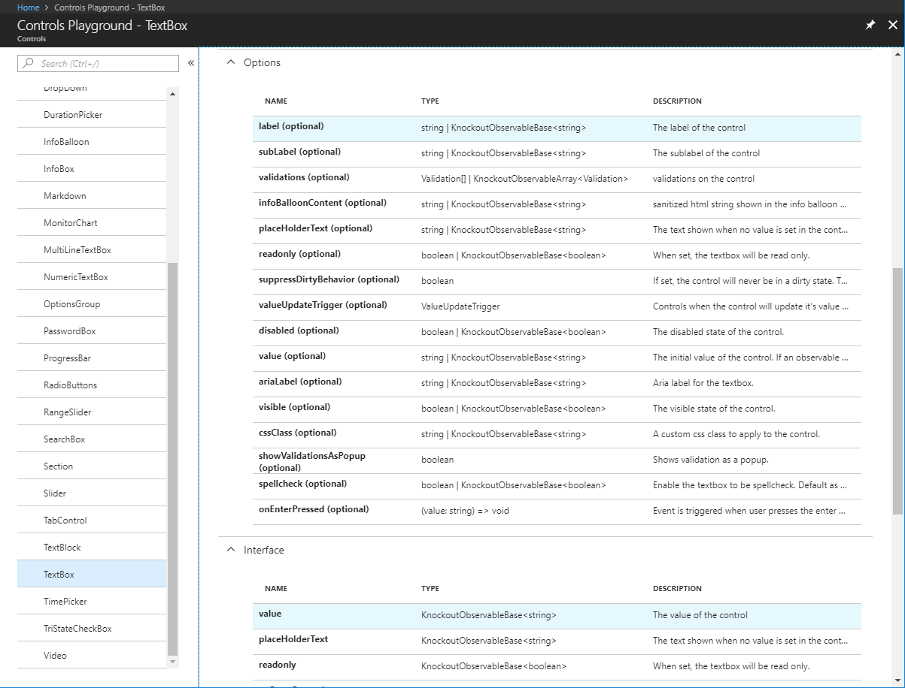

<a name="extension-controls"></a>
# Extension Controls

<a name="extension-controls-overview"></a>
## Overview

Controls are the building blocks of the Azure extension experience. They allow users to view, edit, and analyze data. Using built in controls provides consistency across the portal. Additionally, issues around usability, accessibility, security, and any other fundamentals are handled by the Framework team.

To render a control in the portal, you need to create a `ViewModel` and bind it to your html template.

Creating a control `ViewModel` involves calling a factory method from a framework-provided module. All of the modules live under `Fx/Controls/`, as in the following example.

```ts
import * as <alias> from "Fx/Controls/<ControlName>"; // this will pull in the <ControlName> module
```

All of the factory methods have similar signatures, like the following.

```ts
<alias>.create(lifetimeManager, configurationOptions);
```

The **Knockout** binding for all controls is the `pcControl` binding, as in the following code.

```ts
<div data-bind='pcControl: myControl'></div>
```

Taken together, creating a blade as specified in [top-blades-procedure.md](top-blades-procedure.md) that contains only a textbox would look something like the following.
<!-- TODO: Find a sample for this -->
```cs
import * as TemplateBlade from "Fx/Composition/TemplateBlade";
import * as TextBox from "Fx/Controls/TextBox";  // import statement for the control

@TemplateBlade.Decorator({
    htmlTemplate:
        "<div data-bind='pcControl: myTextbox'></div>" // div which binds to the textbox viewmodel
})
export class AddUserBlade {
    public title = ClientResources.bladeTitle;
    public subtitle = ClientResources.bladeSubtitle;
    public context: TemplateBlade.Context<void, MyArea.DataContext>;

    /**
     * textbox viewmodel declaration
     */
    public myTextbox: TextBox.Contract;

    public onInitialize() {
        const { container } = this.context;

        // textbox viewmodel factory method used to initialized the textbox;
        this.myTextbox = TextBox.create(container, {
            label: "this is my textbox"
        });

        return Q();
    }
}
```

Form controls are a subset of controls which are used to gather user input. You can see more information about forms at [top-extensions-forms.md](top-extensions-forms.md).

<a name="extension-controls-the-controls-playground"></a>
## The controls playground

The controls playground is located at [https://aka.ms/portalfx/playground](https://aka.ms/portalfx/playground), and it provides a space where developers can experiment with controls previous to adding them to an extension. They can see what a control looks like, and how it behaves.



You can quickly provide options for primitive types and enumerations.  The playground lets you configure working instances for basic scenarios.



The following code was generated by the playground to implement the preceding sample.



**NOTE**: You may still need to edit this code in your extension for localization purposes.

The playground provides a quick reference for both the options and the contract of the control, as in the following image.



You quickly see every property that can be sent to the control as an option, in addition to all of the properties that it can return.

For specific playground extension issues or general playground extension feedback, please reach out to  <a href="mailto:ibizacontrols@microsoft.com?subject=Playground Extension issues or feedback">ibizacontrols@microsoft.com</a>.


<a name="extension-controls-samples-controls"></a>
## Samples Controls

There are some controls that are not yet ported over to the V2 programming model that uses a `create factory` method).  Additionally, there are some scenarios that are a bit more complicated than can be handled by the playground.  As such, we ship some code samples in the samples extension, which we provide to extension authors as part of the SDK. The following tables include the location of code samples for common scenarios in the samples extension.
 
**NOTE**: In the following tables, `<dir>` is the `SamplesExtension\Extension\` directory, and  `<dirParent>`  is the `SamplesExtension\` directory, based on where the samples were installed when the developer set up the SDK. If there is a working copy of the sample in the Dogfood environment, it can be experienced by using the link in the table. 

| Control              | Sample Directory                                         | Experience                                                                              |
| -------------------- | -------------------------------------------------------- | --------------------------------------------------------------------------------------- |
| Code Editor          | `<dir>\Client\V1\Controls\Editor\ViewModels`             | [https://aka.ms/portalfx/samples#blade/SamplesExtension/EditorSamplesBlade](https://aka.ms/portalfx/samples#blade/SamplesExtension/EditorSamplesBlade) |
| Controls Chart       | `<dir>\Client\V1\Controls\Chart\ViewModels`              | [https://aka.ms/portalfx/samples#blade/SamplesExtension/ChartInstructions](https://aka.ms/portalfx/samples#blade/SamplesExtension/ChartInstructions) |
| Donut                | `<dir>\Client\V2\Controls\Donut`                         | [https://aka.ms/portalfx/samples#blade/SamplesExtension/DonutBlade](https://aka.ms/portalfx/samples#blade/SamplesExtension/DonutBlade) |
| EditableGrid         | `<dir>\Client\V2\Controls\EditableGrid`                  | [https://aka.ms/portalfx/samples#blade/SamplesExtension/EditableGrid](https://aka.ms/portalfx/samples#blade/SamplesExtension/EditableGrid) |
| Essentials Control   | `<dir>\Client\V2\Controls\Essentials`                    | [https://aka.ms/portalfx/samples#blade/SamplesExtension/EssentialsIndexBlade](https://aka.ms/portalfx/samples#blade/SamplesExtension/EssentialsIndexBlade) |
| File Download Button | `<dir>\Client\V1\Controls\FileDownloadButton\ViewModels` | [https://aka.ms/portalfx/samples#blade/SamplesExtension/FileDownloadButtonInstructions](https://aka.ms/portalfx/samples#blade/SamplesExtension/FileDownloadButtonInstructions) |
| Graph                | `<dir>\Client\V1\Controls\Graph\ViewModels`              | [https://aka.ms/portalfx/samples#blade/SamplesExtension/GraphIndex](https://aka.ms/portalfx/samples#blade/SamplesExtension/GraphIndex) |
| Grid Controls        | `<dir>\Client\V1\Controls\Grid\`                         | [https://aka.ms/portalfx/samples#blade/SamplesExtension/GridInstructions](https://aka.ms/portalfx/samples#blade/SamplesExtension/GridInstructions) |
| ListView             | `<dir>\Client\V1\Controls\ListView\ViewModels`           | [https://aka.ms/portalfx/samples#blade/SamplesExtension/ListViewInstructions](https://aka.ms/portalfx/samples#blade/SamplesExtension/ListViewInstructions) |
| Pill                 | `<dir>\Client\V2\Controls\Pill`                          | [https://aka.ms/portalfx/samples#blade/SamplesExtension/PillBlade](https://aka.ms/portalfx/samples#blade/SamplesExtension/PillBlade) |
| Splitter             | `<dir>\Client\V2\Controls\Splitter`                      | [https://aka.ms/portalfx/samples#blade/SamplesExtension/SplitterBlade](https://aka.ms/portalfx/samples#blade/SamplesExtension/SplitterBlade) |
| Toolbar              | `<dir>\Client\V1\Blades\Toolbar`                         | [https://aka.ms/portalfx/samples#blade/SamplesExtension/BladeWithToolbar](https://aka.ms/portalfx/samples#blade/SamplesExtension/BladeWithToolbar) |
| Tree View            | `<dir>\Client\V1\Controls\Tree`                          | [https://aka.ms/portalfx/samples#blade/SamplesExtension/TreeBlade](https://aka.ms/portalfx/samples#blade/SamplesExtension/TreeBlade) |


<a name="extension-controls-faqs-for-extension-controls"></a>
## FAQs for Extension Controls

   <!-- TODO:  FAQ Format is ###Link, ***title***, Description, Solution, 3 Asterisks -->

<a name="extension-controls-faqs-for-extension-controls-how-to-use-a-monitorchartpart-from-legacy-blade"></a>
### How to use a MonitorChartPart from Legacy Blade

***My extension is still using legacy blades (locked or unlocked). Is this still applicable to me? If yes, do I get the benefits mentioned above?***

SOLUTION: Even if you are not using template blades, you can reference the MonitorChartPart from the Hubs extension, as specified in [portalfx-controls-monitor-chart-v2.md#legacy-blade-usage](portalfx-controls-monitor-chart-v2.md#legacy-blade-usage).

If there is an Insights/Monitoring Metrics part on your blade already, you can reference the part from Hubs extension instead of referencing the metrics part from Insights/Monitoring extension. Because the Hubs extension is always loaded when you load the portal, it will be loaded before the user loads your extension blade. Hence, you will not load an additional extension and get significant performance benefits. However, for the best performance, we strongly recommend that your extension should use the [Monitor Chart control](portalfx-controls-monitor-chart-v2.md) directly on a template blade. For more information about migrating to template blades, see [portalfx-no-pdl-programming.md](portalfx-no-pdl-programming.md).

* * * 

<a name="extension-controls-faqs-for-extension-controls-changing-the-metrics-time-range-chart-type"></a>
### Changing the metrics/time range/chart type

***Can the users change the metrics/time range/chart type of the charts shown in the overview blade?***

SOLUTION: No, users cannot customize what is displayed in the overview blade. For customizations, users can click on the chart, navigate to Azure Monitor, make changes the chart if needed, and then pin it to the dashboard. The dashboard contains all the charts that users want to customize and view.

This means the extension has a consistent story.

1. View the metrics in overview blade

1. Explore the metrics in Azure Monitor

1. Track and monitor metrics in the Azure Dashboard

Removing customizations from blades also provides more reliable blade performance.
    
* * * 

<a name="extension-controls-faqs-for-extension-controls-controls-playground-questions"></a>
### Controls playground questions

DESCRIPTION:  If I run into any problems using the controls playground or the new control `ViewModels`, who do I ask? 

SOLUTION: For control `ViewModel` issues, please post on StackOverflow.  For specific playground extension issues or general playground extension feedback, please reach out to <a href="ibizacontrols@microsoft.com?subject=StackOverflow: Playground Controls and ViewModels">ibizacontrols@microsoft.com</a>.

* * *

<a name="extension-controls-faqs-for-extension-controls-adding-code-to-the-controls-playground"></a>
### Adding code to the controls playground

DESCRIPTION:  Why can’t I type code directly into the controls playground editor?

SOLUTION: The controls playground does not execute code provided by the user due to security concerns.  We are looking into how we can mitigate that, but for now, the code snippet is for your reference only.

* * *

<a name="extension-controls-faqs-for-extension-controls-missing-playground-controls"></a>
### Missing playground controls

DESCRIPTION: Why aren’t all of the new controls in the playground?

SOLUTION:  The code for the playground extension is generated from `Fx.d.ts`.  Some of the controls require additional configuration.

* * *

<a name="extension-controls-faqs-for-extension-controls-playground-controls-are-not-localized"></a>
### Playground controls are not localized

DESCRIPTION: Why is it that the controls playground does not provide localization?

SOLUTION: Localization is done at build times, so none of the string inputs are localized.  Instead, the strings are sent  in non-localized forms so that copy/pasted code compiles and runs without requiring additional work.

* * *


<a name="extension-controls-glossary"></a>
## Glossary

This section contains a glossary of terms and acronyms that are used in this document. For common computing terms, see [https://techterms.com/](https://techterms.com/). For common acronyms, see [https://www.acronymfinder.com](https://www.acronymfinder.com).

| Term             | Meaning |
| ---              | --- |
| big data | Data sets that are very large or very diverse,  including  structured, semi-structured and unstructured datathat may be located in  different sources. The variation in sizes or types of data stores is beyond the ability of traditional databases to capture, manage, and process the data with low-latency.  |
| heterogeneous blade activation | |
| homogeneous blade activation | |
| IANA | Internet Assigned Numbers Authority |
| skip-take | Also known as random access.  Accessing data in an order that is not sequential.  |
| SVG | Scalable Vector Graphics |
| timezone         | The local time of a country/region, based on factors like time zone maps and Daylight Savings Time. |
| timezone offset  | The difference, in minutes, between UTC time and the current time in the current locale.|
| UTC              | Universal Coordinated Time  |

