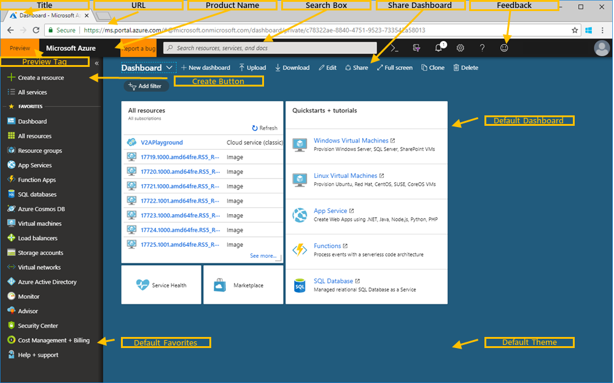
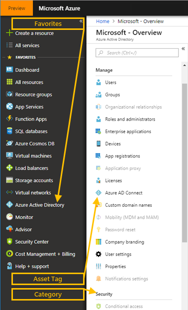

<a name="domain-based-configuration"></a>
# Domain-based configuration

* [Overview](#overview)

* [Onboarding process](#onboarding-process)

* [Configuration APIs](#configuration-apis)

* [Expose configuration settings](#expose-configuration-settings)

* [Configure the dictionary](#configure-the-dictionary)

* [Branding and Chrome](#branding-and-chrome)

* [Curation](#curation)

* [Default dashboard](#default-dashboard)

* [Update Community Clouds](#update-community-clouds)

* [Sample configuration](#sample-configuration)

* [Pull Request](#pull-request)

<a name="domain-based-configuration-overview"></a>
## Overview

Custom domains, or domain-based configurations, are primarily meant for services that are either part of OR align with Microsoft Azure and which have large footprint that demands a dedicated and customized experience. Some of the custom domains like `aad.portal.azure.com`, `intuneeducation.portal.azure.com` and `devicemanagement.microsoft.com` are good examples where the experience is created from Azure portal repository with few customizations that the framework allows.

Some partner needs are met at the deployment level. For example, national clouds like China, Germany, or Government, can use normal configuration with no dynamic tests at runtime.  Items that are based on which domain  is running the extension include  ARM and RP URLs, or AAD client application IDs.

In other instances, a single deployment of an extension supports multiple domains.  For example, community clouds, like Fujitsu A5, use domain-based configuration.  In these instances, functionality is selected based on the Trusted Authority for the calling extension, as specified in [#the-trustedAuthorityHost-function](#the-trustedauthorityhost-function). Although domain-based configuration is not required to support national clouds, there is great overlap between settings for community clouds. It is easier to store settings such as links in domain-based configuration, which allows the Portal to include support for expanding redirected links, or include support for friendly name services such as **FwLink** and **aka.ms**.

During development, the first-party or third-party developer identifies the extension functionality that is dependent on the domain in which the extension will run. Once the partner and developer have identified the configurations that provide this functionality for the extension, the developer creates a supporting `DictionaryConfiguration` class as specified in [#configure-the-dictionary](#configure-the-dictionary). The dictionary key is the host name the Shell was loaded under, which is available at run time by using the `PortalContext` and `TrustedAuthorityHost` functions.

It is recommended, but not required, that domain-based configuration class names have the characters `DomainBasedConfiguration` appended to them. Some examples are `ErrorApplicationDomainBasedConfiguration`, `HubsDomainBasedConfiguration`, and `WebsiteDomainBasedConfiguration`.

Extensions that are called contain additional code that pushes values to the browser.  The sample code located at [Sample configuration](#sample-configuration) demonstrates the pattern that initializes server-side domain-based configuration.

**NOTE**: Settings like ARM endpoints are not typically candidates for domain-based configuration.

If you and your team have an interest in custom domains, you should read this guide carefully to determine the settings and flags that define the look and feel of your custom sites. The Ibiza team relies on you to manage the extension registration and configuration processes.

**NOTE**: All custom domains must be approved by <a href="mailto:ibiza-onboarding@microsoft.com?subject=Custom%20Domains">Leon Welicki and Adam Abdelhamed</a> before any work can commence on the extension. Please schedule time with them to discuss the details about the extension and get an approval.

If you have any questions, reach out to Ibiza team at [https://stackoverflow.microsoft.com/questions/tagged?tagnames=ibiza](https://stackoverflow.microsoft.com/questions/tagged?tagnames=ibiza).

<a name="domain-based-configuration-onboarding-process"></a>
## Onboarding process

The following section contains questions that partner teams are expected to answer prior to the granting of the custom domain. You should determine the settings and values for your extension previous to filling out the questionnaire, by reviewing the values in the tables located in the [Override links](#override-links), and  [Branding and chrome](#branding-and-chrome) sections. You may also want to use settings that were specified in [Default Dashboard](#default-dashboard), if you decide to create one.

Partner team should reach out to  <a href="mailto:ibiza-onboarding@microsoft.com?subject=Custom%20Domains">Leon Welicki and Adam Abdelhamed</a> in the process of answering the questionnaire.

The main questions to answer, other than the settings and values as described in the [Override links](#override-links) and [Branding and chrome](#branding-and-chrome) sections, are the following.

1. Why do you need a Custom Domain?

1. What is the name of the extension in Ibiza Portal?

1. When do you expect the extension to be ready for deployment?

1. What are the expected timelines for various tasks and coordination?

    | Requirement                        | Estimated Completion Date |
    | ---------------------------------- | ------------------------- |
    | Azure Portal team PM Lead approval |                           |
    | Completed Questionnaire            |                           |
    | Completed Default Dashboard Json   |                           |
    | Planning for Dev work              | 1 week                    |
    | Dev work                           | 3-4 weeks after scheduling, subject to resource availability |
    | Deployments                        | Post dev work 2-3 weeks to Prod based on Safe deployment schedule |

1. What URL's will your extension require for the custom domain?

	| Setting name / notes	| Default Value	        | Extension value                  |
    | --------------------- | --------------------  | -------------------------------- |
    | Production URL        | `portal.azure.com`    | `aad.portal.azure.com`           |
    | Dogfood URL           | `df.portal.azure.com` | `df-aad.onecloud.azure-test.net` |

1. Branding and Chrome Values

    The unique values for settings and feature flags for your extension should be included in the  list specified in the [#branding-and-chrome](#branding-and-chrome) section.  You can make a copy of the tables, or you can reach out to  <a href="mailto:ibiza-onboarding@microsoft.com?subject=Custom%20Domains">Leon Welicki and Adam Abdelhamed</a>.

<a name="domain-based-configuration-configuration-apis"></a>
## Configuration APIs

 The Shell provides two APIs that support domain-based configuration. The following is the recommended implementation methodology, although partners and developers can implement domain-based configuration in many ways.

* [The trustedAuthorityHost function](#the-trustedAuthorityHost-function)

* [The getSharedSettings function](#the-getSharedSettings-function)

<a name="domain-based-configuration-configuration-apis-the-trustedauthorityhost-function"></a>
### The trustedAuthorityHost function

The Server-side `PortalContext.TrustedAuthorityHost` function returns the host name under which the extension was loaded. For example, an extension may need to know if it is being called from `portal.azure.com` or `contoso.azure.com`. In the first case `TrustedAuthorityHost` will contain `portal.azure.com` and in the second, `contoso.azure.com`.

**NOTE**: If the extension needs to change its configuration based on the domain of the caller, the recommended solution is to use domain-based configuration, which is designed specifically for this sort of work.  It is preferred over coding directly against values returned by `PortalContext.TrustedAuthorityHost`.

<a name="domain-based-configuration-configuration-apis-the-getsharedsettings-function"></a>
### The getSharedSettings function

In the `MsPortalFx.Settings.getSharedSettings()` function, selected values from the Shell are exposed through an RPC call for the following reasons.

 1. Extensions do not need individual copies of commonly defined values, such as the support URL.

 1. Changes to shared settings do not require simultaneous redeployment of extensions.

The first call by the extension to this API results in an RPC call from the extension to the Shell. After that, the results are served from a cache.

The `MsPortalFx.Settings.getSharedSettings()` API returns an object whose root is empty and reserved for future use, except for a `links` property that contains the following links collection structure, as defined in `src\SDK\Framework\TypeScript\MsPortalFx\SharedSettings.d.ts`.

| Element Name          | Description                                    |
| --------------------- | ---------------------------------------------- |
| accountsPortal        | Link to the Accounts portal                    |
| classicPortal         | Link to the Classic portal                     |
| createSupportRequest  | Link to the create support request UI          |
| giveFeedback          | Link to the feedback UI                        |
| helpAndSupport        | Link to the help and support UI                |
| learnRelatedResources | Link to the learn related resources help topic |
| manageSupportRequests | Link to the manage support request UI          |
| privacyAndTerms       | Link to the privacyAndTerms UI                 |
| resourceGroupOverview | Link to resource groups overview               |

Links are automatically expanded according to the user's domain, tenant, and language preferences. Links can be any of the following.

*  Full URLs, like external links

*  Fragment URLs, like blade links

*  Null, like `String.Empty`

    In this instance, the feature is not supported for that user / tenant / environment combination.

The extension should support all three formats if they are intended to be used in custom portal.

<a name="domain-based-configuration-configuration-apis-the-getsharedsettings-function-the-link-attribute"></a>
#### The link attribute

<!-- TODO: Determine where the  `{culture}` code should be in the FwLink template. -->

Expansion logic is required for properties that are marked `[Link]`. The format string is specified in the `LinkTemplate` property that is located at the root of the object. The **FwLink** template for the  `LinkTemplate` value is `https://go.microsoft.com/fwLink/?LinkID={linkId}&amp;clcid=0x{lcid}`, where format string expansion is applied according to the following rules.

1. If the string is numeric, then occurrences of `{linkId}` in the string are expanded to the numeric value. If no `LinkTemplate` property is specified, the value will be left unexpanded.

1. Occurrences of `{lcid}` are replaced with the hex representation of the user's preferred .NET LCID value.  For example, 409 is the .NET LCID value for US English.

1. Occurrences of `{culture}` are replaced with the user's preferred .NET culture code. For example, 'en-US' is the .NET culture code for US English.

An exception will be thrown if the target of a `[Link]` attribute is not in one of the following string formats.

* Numeric, for example, '12345'

* A URL hash-fragment, like '#create\Microsoft.Support'

* A http or https URL

<a name="domain-based-configuration-configuration-apis-the-getsharedsettings-function-override-links"></a>
#### Override links

Your cloud has the option of using configuration settings to override specific links that are displayed by the system. Overriding is optional, and in many cases no overrides are required. Where supported, settings use **FwLinks** instead of absolute URLs because they do not require the Shell to be redeployed if the  destination changes. In addition, **FwLinks** support the user’s in-product language selection, which may be  different from the browser’s default language.  For example, if the user has set the language in the Portal to Chinese, the extension should display Chinese-language pages.

Each link can be specified as one of the following five values.

* A numeric **FwLink** ID
    A **FwLink** ID is typically a six-digit number.

* A blade reference
    "#create/Microsoft.Support",

* An absolute URL

    Absolute URL's can be assigned friendly names by using the site located at [https://aka.ms](https://aka.ms).

* The word "blank"

    The link should be hidden and not displayed to the user.

* The word "same"

    The default value in the column from the table should be used. If the default value changes, that change is automatically propagated to the extension.

Links are separated into the following three sections.

* [Shell Links](#shell-links)

* [Hubs links](#hubs-links)

* [Error Page Links](#error-page-links)

<sup>1</sup> Settings do not support **FwLinks** or blade references because they are download links, or they are base URLs to which parameter or path information is added dynamically at run-time.

<sup>2</sup> Settings may not currently support the "blank" value, or they may not support values of the types other than the ones listed in the `Default Value` column. If you need to use them, reach out to  <a href="mailto:ibizapxfm@microsoft.com?subject=Settings%20and%20Links">ibizapxfm@microsoft .com</a> so that Ibiza can work with the owner team.

**NOTE**: Changing to support the unsupported values may result in a delay in delivery time.

* * *

<a name="domain-based-configuration-configuration-apis-the-getsharedsettings-function-shell-links"></a>
#### Shell Links

The values listed in the "Extension value" column are recommended values, although they can be customized for your extension.

| Setting name / notes | Default Value | Extension Value |
| -------------------- | ------------ | ---------- |
| accessDetails<sup>2</sup> | #blade/HubsExtension/MyAccess.ReactView/resourceId/ |	blank (verify that menu item is hidden) |
| accountPortal<sup>1</sup> | https://account.windowsazure.com/ | blank (verify that menu item is hidden) |
| classicPortal<sup>1</sup> | https://manage.windowsazure.com/	 | same  |
| createSupportRequest | #create/Microsoft.Support | same |
| giveFeedback | [https://go.microsoft.com/fwLink/?LinkID=522329](https://go.microsoft.com/fwLink/?LinkID=522329) | [https://go.microsoft.com/fwlink/?linkid=838978](https://go.microsoft.com/fwlink/?linkid=838978) |
| helpAndSupport | 	#blade/Microsoft_Azure_Support/HelpAndSupportBlade | same |
| learnRelatedResources	| [https://docs.microsoft.com/en-us/azure/azure-portal/azure-portal-dashboards](https://docs.microsoft.com/en-us/azure/azure-portal/azure-portal-dashboards) | same  |
| learnSharedDashboard | [https://docs.microsoft.com/en-us/azure/azure-portal/azure-portal-dashboard-share-access](https://docs.microsoft.com/en-us/azure/azure-portal/azure-portal-dashboard-share-access) | same  |
| manageSupportRequests | #blade/HubsExtension/BrowseServiceBlade/        assetTypeId/Microsoft_Azure_Support_SupportRequest | same |
| privacyAndTerms | [https://go.microsoft.com/fwLink/?LinkID=521839](https://go.microsoft.com/fwLink/?LinkID=521839)	 | same |
| resourceGroupOverview	| [https://docs.microsoft.com/en-us/azure/azure-resource-manager/resource-group-portal](https://docs.microsoft.com/en-us/azure/azure-resource-manager/resource-group-portal) | same  |
| survey	| [https://go.microsoft.com/fwLink/?LinkID=733278](https://go.microsoft.com/fwLink/?LinkID=733278)  | 	??? Gauge team to follow up on this |
| joinResearchPanel | [https://www.surveymonkey.com/](https://www.surveymonkey.com/) | same |
| learnAzureCli<sup>2</sup> | 	[https://azure.microsoft.com/en-us/documentation/articles/xplat-cli-azure-resource-manager/](https://azure.microsoft.com/en-us/documentation/articles/xplat-cli-azure-resource-manager/)	 | same |
 
<a name="domain-based-configuration-configuration-apis-the-getsharedsettings-function-hubs-links"></a>
#### Hubs links

| Setting name / notes  | Default Value | Extension Value |
| --------------------- | ------------ | ---------- |
| createNewSubscription     | [https://go.microsoft.com/fwLink/?LinkID=522331](https://go.microsoft.com/fwLink/?LinkID=522331)	 | same |
| manageAzureResourceHelp   | [https://go.microsoft.com/fwLink/?LinkID=394637](https://go.microsoft.com/fwLink/?LinkID=394637)	 | same |
| moveResourcesDoc<sup>2</sup>	| [https://go.microsoft.com/fwLink/?LinkID=747963](https://go.microsoft.com/fwLink/?LinkID=747963)	 | same |
| resourceGroupInstallClientLibraries (not found)	| `https://go.microsoft.com/fwLink/?LinkID=234674`	 | same |
| resourceGroupInstallPowerShell<sup>1</sup>	| [https://github.com/Azure/azure-powershell](https://github.com/Azure/azure-powershell)	 | same |
| resourceGroupInstallTools (page not found) | [https://aka.ms/portalfx/resourceGroupInstallTools](https://aka.ms/portalfx/resourceGroupInstallTools)  | same |
| resourceGroupIntroduction	| [https://go.microsoft.com/fwLink/?LinkID=394393](https://go.microsoft.com/fwLink/?LinkID=394393)	 | same |
| resourceGroupIntroductionVideo	| [https://go.microsoft.com/fwLink/?LinkID=394394](https://go.microsoft.com/fwLink/?LinkID=394394)	 | same |
| resourceGroupResourceManagement	| [https://go.microsoft.com/fwLink/?LinkID=394396](https://go.microsoft.com/fwLink/?LinkID=394396)	 | same |
| resourceGroupSample	| [https://go.microsoft.com/fwLink/?LinkID=394397](https://go.microsoft.com/fwLink/?LinkID=394397)	 | same |
| resourceGroupTemplate	| [https://go.microsoft.com/fwLink/?LinkID=394395](https://go.microsoft.com/fwLink/?LinkID=394395)	 | same |
| subCerts	| [https://go.microsoft.com/fwLink/?LinkID=734721](https://go.microsoft.com/fwLink/?LinkID=734721)	 | same |
| templateDeployment	| [https://go.microsoft.com/fwLink/?LinkID=733371](https://go.microsoft.com/fwLink/?LinkID=733371)	 | same |
| tagsHelp<sup>2</sup> | [https://go.microsoft.com/fwLink/?LinkID=822935](https://go.microsoft.com/fwLink/?LinkID=822935)  | same |
| pricingHelp<sup>2</sup> | [https://go.microsoft.com/fwLink/?LinkID=829091](https://go.microsoft.com/fwLink/?LinkID=829091)  | same |
| azureStatus<sup>2</sup> | [https://status.azure.com](https://status.azure.com)  | same |
 
<a name="domain-based-configuration-configuration-apis-the-getsharedsettings-function-error-page-links"></a>
#### Error Page Links

| Setting name / notes | Default Value |	Extension Value |
| -------------------- | ------------ | ---------- |
| classicPortal<sup>1</sup>	   | https://manage.windowsazure.com/	| same |
| contactSupport |	[https://go.microsoft.com/fwLink/?LinkID=733312](https://go.microsoft.com/fwLink/?LinkID=733312)	 | same |
| portalVideo |	[https://go.microsoft.com/fwLink/?LinkID=394684](https://go.microsoft.com/fwLink/?LinkID=394684) |	 blank |
| supportedBrowserMatrix |	[https://go.microsoft.com/fwLink/?LinkID=394683](https://go.microsoft.com/fwLink/?LinkID=394683)	 | same |

<a name="domain-based-configuration-expose-configuration-settings"></a>
## Expose configuration settings

Configuration settings are typically used to control application behavior like timeout values, page size, endpoints, ARM version number, and other items. With the .NET framework, managed code can easily load configurations; however, most of the extension implementation is client-side JavaScript.

By allowing the client code in extensions to gain access to configuration settings, the Portal framework provides a method to get the extension configuration and expose it in `window.fx.environment`, as in the following steps.

1. The Portal framework initializes the instance of the  `ApplicationConfiguration` class, which is located in the  **Configuration** folder in the **VS** project for the extension. The instance will try to populate all properties by finding their configurations in the `appSettings` section of the  `web.config` file. For each property, the Portal framework will use the key "{ApplicationConfiguration class full name}.{property name}" unless a different name is specified in the associated `ConfigurationSetting` attribute that applied that property in the `ApplicationConfiguration` class.

1. The Portal framework creates an instance of `window.fx.environment` for the client script. It uses the mapping in the `ExtensionConfiguration` dictionary in the `Definition.cs` file that is located in the `Controllers` folder.

1. The client script loads the configuration from `window.fx.environment` that implements the `FxEnvironment` interface. To declare the new configuration entry, the file `FxEnvironmentExtensions.d.ts` in the `Definitions` folder should be updated for each property that is exposed to the client.

In many cases, the domain-based configuration is needed in client-side **TypeScript**. The extension developer can use the following script to download these values to the client, although there a number of ways to accomplish the same effect.

1. In `ExtensionDefinition.cs`, add the configuration class to the `ImportConstructor`.

1. Override `IReadOnlyDictionary&lt;string, object&gt; GetExtensionConfiguration(PortalRequestContext context)`  to extend the environment object that is returned to the client, as in the following code.

    ```cs
        public override IReadOnlyDictionary<string, object> GetExtensionConfiguration(PortalRequestContext context)
        {
            var extensionConfig = base.GetExtensionConfiguration(context);
            var settings = this.myConfig.GetSettings(context.TrustedAuthorityHost, CultureInfo.CurrentUICulture);

            var mergedConfig = new Dictionary<string, object>()
            {
                {"links", settings.Links},
                {"someSetting", settings.someSetting},
            };

            mergedConfig.AddRange(extensionConfig);

        return mergedConfig;
    }
    ```

1. Update `ExtensionFxEnvironment.d.ts` to include **TypeScript** definitions for the new values that are being downloaded to the client. The settings and feature flags are specified in [#branding-and-chrome](#branding-and-chrome).

<a name="domain-based-configuration-expose-configuration-settings-configuration-procedure"></a>
### Configuration procedure

In this procedure, a Portal extension named `MyExtension` is customized to add a new configuration named "PageSize".

**NOTE**: In this discussion, `<dir>` is the `SamplesExtension\Extension\` directory, and  `<dirParent>`  is the `SamplesExtension\` directory, based on where the samples were installed when the developer set up the SDK.

1. Open the `ApplicationConfiguration.cs` file that is located in the  `Configuration` folder.

1. Add a new property named `PageSize` to the sample code that is located in the  `<dir>` directory, and to the code that is located at `<dir>Configuration\ArmConfiguration.cs`. The sample is included in the following code.

    <!--TODO: Customize the sample code to match the description -->

    <!--
    gitdown": "include-section", "file": "SamplesExtension/Extension/Configuration/ArmConfiguration.cs", "section": "config#configurationsettings"
    -->

1. Save the file.

    **NOTE**: The namespace is `Microsoft.Portal.Extensions.MyExtension`, the full name of the class is `Microsoft.Portal.Extensions.MyExtension.ApplicationConfiguration`, and the configuration key is `Microsoft.Portal.Extensions.MyExtension.ApplicationConfiguration.PageSize`.

1. Open the `web.config` file of the extension, and locate the `appSettings` section. Add a new entry for `PageSize`.

    ```xml
    ...
      <appSettings>
            ...
            <add key="Microsoft.Portal.Extensions.MyExtension.ApplicationConfiguration.PageSize" value="20"/>
      </appSettings>
      ...
    ```

1. Save and close the `web.config` file.

1. Open the `Definition.cs` file that is located in the `<dir>Controllers` folder, and add a new mapping in the `ExtensionConfiguration` property.

    ```csharp
        /// <summary>
        /// Initializes a new instance of the <see cref="Definition"/> class.
        /// </summary>
        /// <param name="applicationConfiguration">The application configuration.</param>
        [ImportingConstructor]
        public Definition(ApplicationConfiguration applicationConfiguration)
        {
            this.ExtensionConfiguration = new Dictionary<string, object>()
            {
                ...
                { "pageSize", applicationConfiguration.PageSize },
            };
            ...
        }
    ```

1. Open the `FxEnvironmentExtensions.d.ts` file that is located in the `<dir>Definitions` folder, and add the `pageSize` property to the environment interface.

    ```ts
        interface FxEnvironment {
            ...
            pageSize?: number;
        }
    ```

The new configuration entry is now defined. To use the configuration, add the following code to the script.

```js
    var pageSize = window.fx.environment && window.fx.environment.pageSize || 10;
```

An extended version of this procedure can be used to transfer domain-based-configurations, like correctly formatted FwLinks, to the client.

<a name="domain-based-configuration-configure-the-dictionary"></a>
## Configure the dictionary

The `DictionaryConfiguration` class allows strongly-typed JSON blobs to be defined in the configuration file, and selected based on an arbitrary, case-insensitive key. For example, the Shell and Hubs use the class to choose between the following two types of domain-specific configuration sets.

* A configuration class that is derived from `DictionaryCollection` that manages and exposes the instances, as specified in [#the-configuration-class](#the-configuration-class).

* A stand-alone settings class that contains the values that are associated with a specific key and user culture, as specified in [#the-settings-class](#the-settings-class).

Like other classes, these are named and populated from the configuration based on namespace, class name, and the Settings property name. For example, if the namespace is `Microsoft.MyExtension.Configuration` and the configuration class is `MyConfiguration`, then the configuration setting name is `Microsoft.MyExtension.Configuration.MyConfiguration.Settings`.

Instances of configuration classes are normally obtained through MEF constructors, and this is unchanged for `StringDictionaryConfiguration` and its sub-classes. The `DictionaryConfiguration` class supports a one-level inheritance model to avoid repeating unchanged settings in subclassed configurations.

At runtime, the strongly typed settings for a specific key are obtained by using the `GetSettings` method that is inherited by the configuration class, as in the following code.

 `T settings = configClass.GetSettings(string key, CultureInfo culture)`

 The `culture` parameter is optional, and is used when expanding settings that are marked with the special `[Link]` attribute. If the `culture` parameter  is not specified, the default is  `CultureInfo.CurrentUICulture`.

A example of deriving a configuration class is located at [Sample configuration](#sample-configuration).

<a name="domain-based-configuration-configure-the-dictionary-the-configuration-class"></a>
### The configuration class

To create a configuration class, derive a class from `StringDictionaryConfiguration&lt;T&gt;`, where `T` is the type of the settings class.

Remember to mark the class as MEF exportable if the config will be made available in the normal fashion, as in the following example.

```cs
namespace Microsoft.MyExtension.Configuration
{
    [Export]
    public class MyConfiguration : DictionaryConfiguration<MySettings>
    {
    }
}
```

Nested objects, like `Billing.EA.ShowPricing`, are fully supported, as in the sample code located at [Sample configuration](#sample-configuration).

<a name="domain-based-configuration-configure-the-dictionary-the-settings-class"></a>
### The settings class

The settings class is a data transport object. In this example, the configuration class name is  `MySettings`, and the settings class's namespace is `Microsoft.MyExtension.Configuration`.

All properties that are populated from the JSON blob in the configuration file are marked as `[JsonProperty]` so that the configuration system `ConfigurationSettingKind.Json` option can be used. If the properties are not marked, they will not be deserialized and will remain null.

If no exact match is found for the specified key, or if the caller sends a value of null, the `Get` function returns the settings associated with a key whose name is `default`. If a property inside the settings for a non-default key is missing or explicitly set to null,  the value for that property inherits its value from the default key, as in the following example.

``` xml
    <add key="Microsoft.Portal.Framework.WebsiteDomainBasedConfiguration.Settings" value="{
        'default': { 'setting1': 'A1', 'setting2': 'A2' },
        'config2': { 'setting1': 'B1', 'setting2': 'B2' },
        'config3': { 'setting1': 'C1' },
        'config4': { 'setting1': null },
    }"/>
```

These settings return the following values.

| Key     | Setting 1 | Setting 2 | Notes |
| ------- | --------- | --------- | ----- |
| Default | A1        | A2        |       |
| Config1 | A1        | A1        | Since there is no config1 entry, the default is returned |
| Config2 | B1        | B2        | Both values were overridden |
| Config3 | C1        | A2        | Only setting1 was overridden |
| Config4 | A1        | A2        | Assigning null is the same as skipping the property |

The following code contains the Json properties and the settings for the default values.

```
<table>
    <thead><tr><th>Example settings class</th><th>Example config*</th></tr></thead>
    <tr>
        <td>
            <pre>
namespace Microsoft.MyExtension.Configuration
{
    public class MySettings
    {
        [JsonProperty]
        public bool ShowPricing { get; private set; }
    }
}
            </pre>
        </td>
        <td>
<pre>
&lt;add key="Microsoft.MyExtension.Configuration.MyConfiguration.Settings" value="{
    'default': {
        'showPricing': true
    },
    'someOtherKey' : {
        'showPricing': false
    }
}" /&gt;
</pre>
        </td>
    </tr>
</table>
```

**NOTE**: The deserializer handles camel-case to pascal-case conversion when the code uses JSON property name conventions in the config file and C# name conventions in the configuration classes.

<a name="domain-based-configuration-branding-and-chrome"></a>
## Branding and chrome

Custom domains can create or set their own branding and chrome by specifying settings and feature flags.  The titles and labels that are displayed are controlled by the settings in the extension and its configuration files, as in the following image.



The following table specifies the parts in the dashboard image.

| Setting or feature flag | Description                                     | Default Value   |
| ----------------------- | ----------------------------------------------- | --------------- |
| defaultTheme            | The default color theme for the portal          | blue            |  
| feedback                | A value of `False` hides the feedback icon      | true            |
| hideCreateButton        | Hides the `Create a resource` or `+ New` button | false           |
| hideDashboardShare      | Hides the `Dashboard Share` button              | false           | 
| hideSearchBox           | Hides the `Search resources` box                | false           |
| internalonly            | Controls whether the `Preview` tag is displayed on the top bar | false |
| Product Name            | The text that is displayed on the top bar       | Microsoft Azure |
| Title                   | The text that is displayed on the Browser tab/title bar. It is located in the page’s `<TITLE>` element | Microsoft Azure |
| URL                     | The address of the extension.                   |                 |

* Feature flags

The following feature flags impact dashboard settings that are not immediately displayed.

| Setting                     | Description                                                       | Default Value |
| --------------------------- | ----------------------------------------------------------------- | ------------  |
| hidesupport                 | Hides support functionality in property and other select dialogs  | Not set           |
| nps                         | Controls whether the Net Promoter Score prompt can be displayed   | true               |
| hubsextension_skipeventpoll | Disables `what’s new` and subscription-level notifications        | Not set           |
| Description                 | SEO text that is included in the page source that is not visible to the end-user | Microsoft Azure Management Portal |

* Tile Gallery

The tile gallery is displayed when the user clicks on `Edit dashboard`. It contains a collection of tiles that can be dragged and dropped on the dashboard. Available tiles can be searched by Category, by Type, by resource group, by tag, or by using the Search string.

* The `hidePartsGalleryPivot` flag disables all the search types except the Category search. The Category selector will be displayed only if any tile has a category assigned to it.

* The `hiddenGalleryParts` list allows this extension to hide specific parts that are made available by other extensions. For example, by default, the Service Health part is always displayed, but it can be hidden by adding it to this list.

| Setting or feature flag | Description  | Default Value |
| ----------------------- | ------------ | ------------- |
| hidePartsGalleryPivots  | Hides parts types picker from parts gallery. Does not disable the category picker  | false |
| hiddenGalleryParts      | Hides listed parts from the parts gallery, like `All Resources`, `Service Health`, and others  | empty |

<a name="domain-based-configuration-curation"></a>
## Curation

Curation allows items that are displayed on the left navigation bar to be added, removed, and reordered. It is optional because the extension can inherit from the production environment. Curation is an alternative to hiding items programmatically, or making them accessible by using deep links. For example, you can hide the ability to create new storage accounts from users, and still allow the extension to open the `Storage Accounts` property and then open the `usage logs` blades for a storage account that was created for one of the extension's assets.

<!-- TODO:  If the storage account example is fictitious, locate one that is not fictitious. -->

A browsable asset type is one that is defined in the `PDL` file by using the `Browse` tag. Curation controls the visibility and grouping of browsable asset types in the **Favorites and Browse** portions of the left navigation bar, or the  **Favorites and Category** section, as in the following image.



<a name="domain-based-configuration-curation-curation-categories"></a>
### Curation categories

Curation provides a significant degree of flexibility, which can be overwhelming because options are NOT mutually exclusive. For example, the production curation definition can be programmatically modified in the following ways.

* Remove everything except the assets from three extensions

* For the third extension in the example, change the category in which items are located.

**NOTE**: Empty categories are automatically hidden.

The most common configurations are Community Clouds that display `Help & Support`, configs that automatically add new browsable assets, and configs that display only assets from the extension.

Use `Curation by AssetType` to list only items from the extension, and perhaps some items from `Help & Support`. It can be combined with `Curation by Extension` to allow new asset types you deploy to be displayed  while the  updates to your `Curation by AssetType` are waiting on the next Shell deployment, combined with a `DiscoveryPolicy` of "Hide" to prevent the display of new asset types from other extensions.

* All AAD extensions except "KeyVault" and "Help + Support"

* Default all items to go under "Security + Identity" category, including "Help + Support"

<a name="domain-based-configuration-curation-default-favorites"></a>
### Default Favorites

When a new user visits your Community Cloud for the first time, the system places several asset types in the far left navigation bar. The extension can also control which items are placed there, in addition to the order in which they are displayed. The only restriction is that these items must also exist in the Category Curation.

A list of items is as follows.

| Extension Name    | Asset ID                       |
| ----------------- | ------------------------------ |
| MICROSOFT_AAD_IAM | AzureActiveDirectory           |
| MICROSOFT_AAD_IAM | AzureActiveDirectoryQuickStart |
| MICROSOFT_AAD_IAM | UserManagement                 |
| MICROSOFT_AAD_IAM | Application                    |
| MICROSOFT_AAD_IAM | Licenses                       |

<a name="domain-based-configuration-default-dashboard"></a>
## Default Dashboard

The default dashboard JSON controls what parts are displayed on the dashboard for new users. Existing users will use the `Reset Dashboard` option to view updated versions of the default dashboard.

The following steps generate the JSON for the dashboard.

1. Use the Portal’s `customize` mode to manually create the dashboard.  Pin or drag and drop the dashboard contents into place.

1. Use the Portal’s `Share` feature to publish the dashboard to an Azure subscription.

 **NOTE**: The subscription is not related to your content.

1. Navigate to `More Services -> Resource Explorer` and find the dashboard that was  just published. The `Resource Explorer` will display the JSON representation of the dashboard.  You can review and adjust the tile sizes, positions, and settings.  

1. Inspect the JSON to confirm that it contains no user-specific values, because this dashboard will be applied to all new users.

1. Paste the following `AzureActiveDirectoryDashboardv2.json` File from AAD into the Default Dashboard JSON.

    ```
    {
        "properties": {
            "lenses": {
                "0": {
                    "order": 0,
                    "parts": {
                        "0": {
                            "position": {
                                "x": 0,
                                "y": 0,
                                "rowSpan": 2,
                                "colSpan": 4
                            },
                            "metadata": {
                                "inputs": [],
                                "type": "Extension/Microsoft_AAD_IAM/PartType/OrganizationIdentityPart"
                            }
                        },
                        "1": {
                            "position": {
                                "x": 4,
                                "y": 0,
                                "rowSpan": 2,
                                "colSpan": 4
                            },
                            "metadata": {
                                "inputs": [],
                                "type": "Extension/Microsoft_AAD_IAM/PartType/AzurePortalWelcomePart"
                            }
                        },
                        "2": {
                            "position": {
                                "x": 0,
                                "y": 2,
                                "rowSpan": 2,
                                "colSpan": 4
                            },
                            "metadata": {
                                "inputs": [],
                                "type": "Extension/Microsoft_AAD_IAM/Blade/ActiveDirectoryBlade/Lens/ActiveDirectoryLens/PartInstance/ActiveDirectory_UserManagementSummaryPart"
                            }
                        },
                        "3": {
                            "position": {
                                "x": 0,
                                "y": 4,
                                "rowSpan": 2,
                                "colSpan": 4
                            },
                            "metadata": {
                                "inputs": [
                                    {
                                        "name": "userObjectId",
                                        "isOptional": true
                                    },
                                    {
                                        "name": "startDate",
                                        "isOptional": true
                                    },
                                    {
                                        "name": "endDate",
                                        "isOptional": true
                                    },
                                    {
                                        "name": "fromAppsTile",
                                        "isOptional": true
                                    }
                                ],
                                "type": "Extension/Microsoft_AAD_IAM/PartType/UsersActivitySummaryReportPart"
                            }
                        },
                        "4": {
                            "position": {
                                "x": 0,
                                "y": 6,
                                "rowSpan": 1,
                                "colSpan": 2
                            },
                            "metadata": {
                                "inputs": [],
                                "type": "Extension/Microsoft_AAD_IAM/PartType/ADConnectStatusPart"
                            }
                        },
                        "5": {
                            "position": {
                                "x": 2,
                                "y": 6,
                                "rowSpan": 1,
                                "colSpan": 2
                            },
                            "metadata": {
                                "inputs": [],
                                "type": "Extension/Microsoft_AAD_IAM/PartType/AuditEventsDashboardPart"
                            }
                        },
                        "6": {
                            "position": {
                                "x": 4,
                                "y": 2,
                                "rowSpan": 4,
                                "colSpan": 4
                            },
                            "metadata": {
                                "inputs": [],
                                "type": "Extension/Microsoft_AAD_IAM/PartType/ActiveDirectoryRecommendationPart",
                                "viewState": {
                                    "content": {
                                        "selection": {
                                            "selectedItems": [],
                                            "activatedItems": []
                                        }
                                    }
                                }
                            }
                        },
                        "7": {
                            "position": {
                                "x": 8,
                                "y": 0,
                                "rowSpan": 2,
                                "colSpan": 2
                            },
                            "metadata": {
                                "inputs": [],
                                "type": "Extension/Microsoft_AAD_IAM/PartType/ActiveDirectoryQuickTasksPart"
                            }
                        },
                        "8": {
                            "position": {
                                "x": 8,
                                "y": 2,
                                "rowSpan": 1,
                                "colSpan": 2
                            },
                            "metadata": {
                                "inputs": [],
                                "type": "Extension/Microsoft_AAD_IAM/PartType/AzurePortalPart"
                            }
                        }
                    }
                }
            },
            "metadata": {
                "model": {
                    "timeRange": {
                        "value": {
                            "relative": {
                                "duration": 24,
                                "timeUnit": 1
                            }
                        },
                        "type": "MsPortalFx.Composition.Configuration.ValueTypes.TimeRange"
                    }
                }
            }
        },
        "id": "/subscriptions/8bd095e7-b4a6-4f9c-b826-8b83943111fa/resourceGroups/dashboards/providers/Microsoft.Portal/dashboards/438319b8-6761-4c27-9f1f-97b12413c30b",
        "name": "438319b8-6761-4c27-9f1f-97b12413c30b",
        "type": "Microsoft.Portal/dashboards",
        "location": "eastasia",
        "tags": {
            "hidden-title": "Dashboard"
        }
    }
    ```

<a name="domain-based-configuration-update-community-clouds"></a>
## Update Community Clouds

To add your custom domain to a community cloud, reach out to <a href="mailto:santhosh.somayajulu@microsoft.com?subject=Add%20Custom%20Domain%20to%20a%20Community%20Cloud&body=Hello,%20we%20would%20like%20to%20add%20our%20new%20custom%20domain%20to%20a%20community%20cloud.">Santhosh Somayajula</a> and we will set up meetings with you and your team to ensure that the custom domain is added to the appropriate environments.

Community clouds are primarily in the Dogfood environment, the PROD environment, or some combination thereof.  Within those environments, there are two extensions currently that serve community clouds or custom domains.  The following table describes the extension, the environment, and the area.  All of the associated json files unless otherwise noted are located at [https://aka.ms/portalfx/domainbasedconfiguration](https://aka.ms/portalfx/domainbasedconfiguration).

| Extension | Environment | Area | Json |
| --------- | ----------- | ---- | ---- |
| AAD | Dogfood | Dashboard | `DomainBasedConfiguration.dogfood.json`  |
| AAD | PROD    | Dashboard | `DomainBasedConfiguration.prod.json`     |
| AAD | Dogfood/PROD | Add Extensions | [https://aka.ms/portalfx/aad](https://aka.ms/portalfx/aad)
| AAD | Dogfood/PROD | Add Extensions | [https://aka.ms/portalfx/intune-edu](https://aka.ms/portalfx/intune-edu) |
| IntuneEducation | Dogfood | Dashboard | `DomainBasedConfiguration.dogfood.json` |
| IntuneEducation | PROD    | Dashboard | `DomainBasedConfiguration.prod.json` |

<a name="domain-based-configuration-sample-configuration"></a>
## Sample configuration

The following three examples demonstrate how to use the settings that are associated with custom domains.

* Extension code

    ```cs
    [ImportingConstructor]
    public MyConsumingClass(PortalContext portalContext, MyConfiguration myConfiguration)
    {
        this.portalContext = portalContext;
        this.myConfiguration = myConfiguration;
    }
    ...
    public void DoSomthing()
    {
        var settings = this.myConfiguration.Get(this.portalContext.TrustedAuthorityHost, CultureInfo.CurrentUICulture);
        if (settings.ShowPricing) {...};
        string expandedUrl = settings.GettingStarted;
    }
    ```

* Configuration and settings classes

    This example is for extensions that usenormal configuration with no dynamic tests at runtime.

    ```cs
    namespace Microsoft.MyExtension.Configuration
    {
        [Export]
        public class MyConfiguration : DictionaryConfiguration<MySettings>
        {
        }

        /// <summary>Configuration that can vary by the domain by which the user accesses the portal (or some other string)</summary>
        public class MySettings
        {
            [JsonProperty]
            public string LinkTemplate { get; private set; }

            [JsonProperty]
            public MyLinks Links { get; private set; }

            [JsonProperty]
            public bool ShowPricing{ get; private set; }
        }

        /// <summary>Links don't have to be a separate class, I just like to group them separately to other settings</summary>
        public class MyLinks
        {
            [JsonProperty, Link]
            public string GettingStarted { get; private set; }

            [JsonProperty, Link]
            public string Support { get; private set; }

            [JsonProperty, Link]
            public string TermsAndConditions { get; private set; }
        }
    }
    ```

* Corresponding example config settings

    This example is for an extension that supports multiple domains, and selects  functionality  based on its Trusted Authority. The deployment returns different run-time configuration values for the settings class, depending on  whether the portal was accessed through `portal.azure.com`, `example.microsoft.com`, `fujitsu.portal.azure.com`, or `hostfileoverride.com`.

    The configuration block is in the following code.

    ```xml
    <add key="Microsoft.MyExtension.Configuration.MyConfiguration.Settings" value="{
        'default': {
            'linkTemplate': 'https://go.microsoft.com/fwLink/?LinkID={linkId}&amp;clcid=0x{lcid}',
            'links': {
                'gettingStarted': '111111',
                'support': '#create/Microsoft.Support',
                'termsAndConditions': 'https://microsoft.com',
            },
            'ShowPricing': true,
        },
        'fujitsu.portal.azure.com' : {
            'links': {
                'gettingStarted': '222222',
                'support': '',
                'termsAndConditions': 'https://fujitsu.com',
            },
            'ShowPricing': false,
        },
        'example.microsoft.com': {
            'ShowPricing': false,
        }
        }"/>
    ```

    The following code calls the configuration code block.

    ```cs
        var config = this.myConfiguration.Get(this.portalContext.TrustedAuthorityHost, CultureInfo.CurrentUICulture);
    ```

    The call to the code block results in the following values.

    | URL                        | User's culture | config.showPricing | gettingStarted  | support |termsAndConditions |
    | ------------------------------------ | --------------|------------------|---------------------------|--------------------|-------------------------------
    | `portal.azure.com`         | en-us   | true  | [https://go.microsoft.com/fwLink/?LinkID=111111&clcid=0x409](https://go.microsoft.com/fwLink/?LinkID=111111&clcid=0x409) | #create/Microsoft.Support | [https://microsoft.com](https://microsoft.com) |
    | `portal.azure.com`         | zh-hans | true  | [https://go.microsoft.com/fwLink/?LinkID=111111&clcid=0x4](https://go.microsoft.com/fwLink/?LinkID=111111&clcid=0x4) | #create/Microsoft.Support | [https://microsoft.com](https://microsoft.com) |
    | `fujitsu.portal.azure.com` | en-us   | false | [https://go.microsoft.com/fwLink/?LinkID=222222&clcid=0x409](https://go.microsoft.com/fwLink/?LinkID=222222&clcid=0x409) | | [https://fujitsu.com](https://fujitsu.com)
    | `example.microsoft.com`    | en-us   | false | [https://go.microsoft.com/fwLink/?LinkID=111111&clcid=0x409](https://go.microsoft.com/fwLink/?LinkID=111111&clcid=0x409) | #create/Microsoft.Support  | [https://microsoft.com](https://microsoft.com) |
    | `hostFileOverride.com`     | en-us   | true  | [https://go.microsoft.com/fwLink/?LinkID=111111&clcid=0x409](https://go.microsoft.com/fwLink/?LinkID=111111&clcid=0x409) | #create/Microsoft.Support | [https://microsoft.com](https://microsoft.com) |

**NOTE**: The only URL that matters is the one that the user uses to access the Portal. The URL that is used to access the extension is not relevant and does not change.

**NOTE**: `gettingStarted`, `support`, and `termsAndConditions` are members of the  `links` parameter in the `config` variable.


<a name="domain-based-configuration-pull-request"></a>
## Pull Request

The pull request should include the definition of the new domain for the environment in which it will run. Remember to add a meaningful description to the PR, and attach information like RDTasks or screenshots. A sample pull request that modifies the Intune curation file to add a new asset type is located at [https://aka.ms/portalfx/intune-pr](https://aka.ms/portalfx/intune-pr). For more information about sending pull requests, see [top-extensions-publishing.md](top-extensions-publishing.md).

 <!--gitdown": "include-file", "file": "../templates/portalfx-extensions-bp-custom-domains.md"} -->

 
<a name="domain-based-configuration-frequently-asked-questions"></a>
## Frequently Asked Questions

<a name="domain-based-configuration-frequently-asked-questions-site-is-not-accessible"></a>
### Site is not accessible

***My site is not accessible from a custom URL in DogFood***

SOLUTION:  Verify that the configuration setting  `Microsoft.Portal.Framework.FrameworkConfiguration.AllowedParentFrame` is correctly set in your extension’s configuration file. Your extension will reject calls from pages from domains and subdomains of the values listed here. For example, a setting value of `df.onecloud.azure-test.net` will NOT allow calls from pages hosted at `df-myExtension.onecloud.azure-test.net`, but a setting of `onecloud.azure-test.net` will allow calls from both `df.onecloud.azure-test.net` and `df-myExtension.onecloud.azure-test.net`.

* * * 

<a name="domain-based-configuration-frequently-asked-questions-default-favorites-list-do-not-match-the-submitted-list"></a>
### Default favorites list do not match the submitted list

***I changed the default favorites definition, but am still seeing the old one.***

SOLUTION: Default favorites are user-configurable and stored in `User Settings`. The system generates and saves the user's default favorites only if they haven’t been previously generated for the user. To force a refresh, reset your desktop.

* * *

<a name="domain-based-configuration-frequently-asked-questions-shared-url-for-cloud-and-production"></a>
### Shared URL for cloud and production

***Can I point my Community Cloud and Production to the same extension URL?***

Yes, if the only difference between your Community Cloud and Production is branding the hiding of other extensions UI. 

However, a major reuse restriction is that you must serve the same PDL to both Production and your Community Cloud. You can serve a different domain-based configuration to the user’s browser,  as specified in `AuxDocs`, and you can review  `PortalContext.TrustedAuthorityHost` to determine the  environment from which the client is calling your extension.  However, you cannot change the behavior of server-to-server calls, and PDL is requested by servers.


