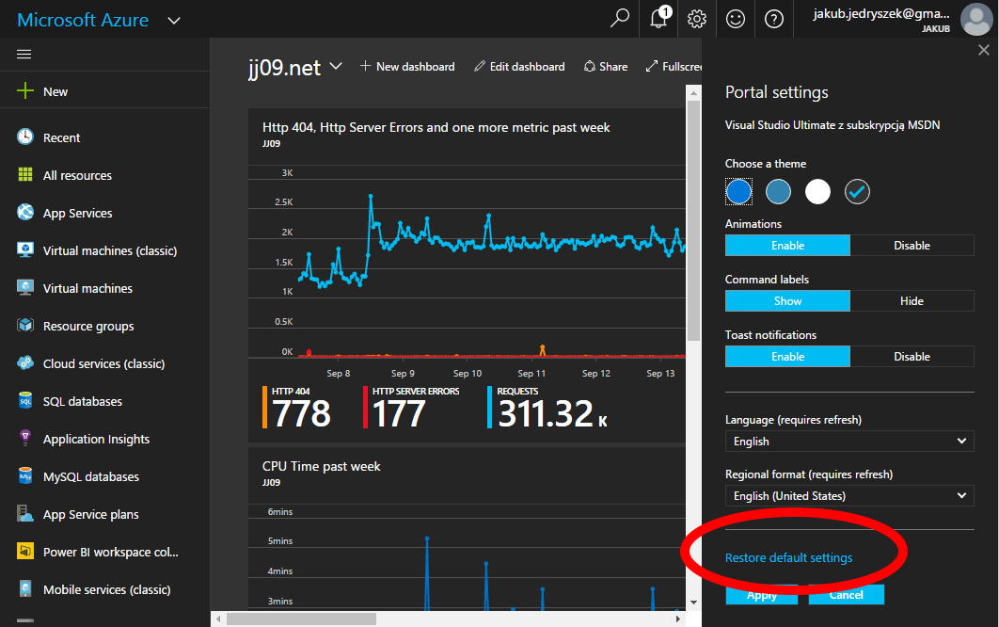
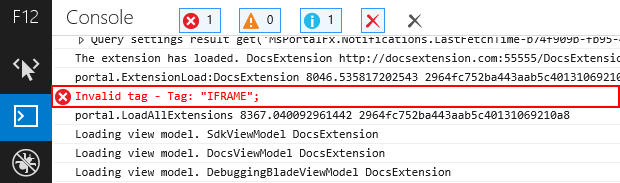

<a name="debugging-an-extension"></a>
# Debugging an Extension

<a name="debugging-an-extension-overview"></a>
## Overview

Occasionally, difficulties may be encountered while developing an extension. When that happens, the debug tool that is contained in the Portal can help remove obstacles.

Other samples and tools are also available to assist in the debugging process.  Any that are not included in the context of the discussion are  included in [top-extensions-samples.md](top-extensions-samples.md).

Here are a few tips that help get extension development back on track. If you still have questions, reach out to Ibiza team by using the Stackoverflow tags as specified in [StackOverFlow Forums](portalfx-stackoverflow.md).

To test your local extension against the production portal, see [top-extensions-sideloading.md](top-extensions-sideloading.md).  

For more information about deploying the extension, see [portalfx-deployment.md](portalfx-deployment.md).

<a name="debugging-an-extension-debug-mode"></a>
## Debug mode

The Portal contains a debug tool to aid with extension development. The keyboard shortcut CTRL+ALT+D toggles the visibility of the debug mode, as in the following image.

 

When visible, the tool overlays stickys onto Portal parts, and onto the Portal window itself. The  yellow blocks provide quick statistics and fast access to specific types of testing functionality.

The  information that is associated with the application window is located at the bottom of the window, on the right side.  It provides the following  information and functionality.

* **Version**:  The version of the Portal
* **Load time**: The amount of time that was required for the Portal to load.  This number has a direct impact on the create success rate of the extension.
* **Client optimizations**: Turns on or off client optimizations such as minification and bundling.
* **User settings**:  The list of settings is as follows.
  * **Dump**: Logs all user settings to the console.
  * **Clear**: Resets a user's startboard and all other customizations. This feature is equivalent to clicking ```Settings -> Discard modifications```.
  * **Save**: Reserved for automated `Selenium` testing purposes.
* **Telemetry**: Allows the user to send telemetry to the server in batches. This feature is only for automated `Selenium` testing purposes.
* **Portal services**: Dumps information about Portal services. This feature is reserved for runtime debugging for the shell team.
* **Enabled features**: A list of features that are currently enabled.
* **Loaded extensions**: Provides a list of all extensions that are currently loaded and their load times. Clicking an extension name will log information to the console, including the extension definition and manifest.

The information associated with each part provides the following information.

* **The name and owning extension**: Displays the name of the blade or part and the name of the extension that is the parent of the blade or part. Clicking on this logs debugging information to the console including the composition instance, view model and definition.

* **Revealed**: The revealed time and all other performance information that is logged by that part, as specified in [top-telemetry.md](top-telemetry#overview-viewing-telemetry-custom-queries-tracked-actions).

* **ViewModel**: Contains the following functionality.
  * **Dump**: Dumps the view model to the console for debugging purposes. Displays its name, parent extension and load time. Click on the div to log more information such as the part definition, view model name and inputs.
  * **Track**: Dumps the view model observables.
* **Deep link**: Optional. Links to the blade.

<a name="debugging-an-extension-debug-mode-toggle-optimizations"></a>
### Toggle optimizations

Bundling and minification can be enabled or disabled for debugging by using the **clientoptimizations** flag. This flag behaves somewhat like a trace mode flag, in that it does not turn on and off code within an extension, nor does it control requests for other extensions that are used by the extension that is being debugged.  Instead, it turns off bundling and minification of JavaScript to make debugging easier.

The following modes are available.

* `true`: Turns on bundling and minification
* `false`: Bundling and minification are turned off
* `bundle`: Turns off JavaScript minification but retains bundling. This mode assists in debugging non-minified code with friendly names, and enables a reasonably fast Portal on most browsers.  This is the recommended value for Portal extension debugging.
* `minify`: Files are minified but not bundled

 When debugging an extension, the developer should supply `false` for this flag to disable script minification and to turn on additional diagnostics.

To set the optimizations mode for the Portal and all extensions, use the following query string.

`https://portal.azure.com/?clientoptimizations=<value>`

where

**value**: One of the previously-specified four modes, without the angle brackets.

To set the optimization mode for a specific extension only, use the following code.

`https://portal.azure.com/?<extensionName>_clientoptimizations=<value>`

where

**extensionName**: Matches the name of the extension as specified in the extension configuration file. Do not use the angle brackets.  For more information about the configuration file, see [portalfx-extensions-configuration-overview.md](portalfx-extensions-configuration-overview.md).

**value**:  One of the previously-specified four modes, without the angle brackets.

The `IsDevelopmentMode` setting can be used on the server to alter the default optimization settings for the extension. for more information about the  `IsDevelopmentMode` setting and its alternatives, see [top-extensions-hosting-service-procedures.md#update-isdevelopmentmode-flag](top-extensions-hosting-service-procedures.md#update-isdevelopmentmode-flag).

**NOTE**:  This flag applies to both the Portal and extensions source. If you are testing extensions that are already deployed to production, use the **clientOptimizations** flag instead of the **IsDevelopmentMode** appSetting. If you are working in a development environment instead, use the **IsDevelopmentMode** appSetting instead of the **clientOptimizations** flag to turn off bundling and minification for this extension only. This will speed up Portal load during development and testing.  To change the **IsDevelopmentMode** appSetting, locate the appropriate `web.config` file and change the value of the **IsDevelopmentMode** appSetting to `true`.

<a name="debugging-an-extension-debug-mode-restore-default-settings"></a>
### Restore default settings

The Portal tracks the state of the desktop for users as they navigate through the Portal. It stores the list of opened blades, active journeys, part selection status, and various other states of the Portal. At development time, it is often necessary to clear this information. If new parts are not displayed as expected, this is often the cause.

The default settings can be restored by  using the Settings pane, which is activated by clicking on the `settings` icon in the navigation bar, as in the following image.  

 

Next, click the `Restore default settings` option, as in the following image.  

 

The Portal refreshes when the `Apply` button is clicked, and user settings are cleared.

<a name="debugging-an-extension-debug-extension-load-failures"></a>
## Debug extension load failures

You can check if the  extension is loaded in the debug panel (CTRL+ALT+D) by clicking 'Loaded extensions', as in the following example.


If the extension throws an error while trying to load, try clicking on the url in the console. That will lead to the location on the client computer where the extension is running. The browser should display a blank web page. If the extension is available for the shell to load, the Portal will display a page similar to the following image.


Extensions load failures are logged along with an associated failure code.  This error code is printed out as part of the error message logged by the client trace controller. A list of failure codes and what they mean is located at [portalfx-extensions-status-codes.md](portalfx-extensions-status-codes.md).

If the extension is not loaded, or if the extension site is not running, another guide that may be of assistance is "Creating an Extension", located at [portalfx-extensions-create-first-extension.md](portalfx-extensions-create-first-extension.md).

<a name="debugging-an-extension-debug-console-errors"></a>
## Debug console errors

The Portal logs a significant amount of information into the browser developer console. Often this surfaces common errors and problems.
Most modern browsers include tools that make it easy to debug JavaScript. To understand how the JavaScript debugging tools work in **Chrome**, view  "Chrome DevTools Overview" that is located at [https://developer.chrome.com/devtools](https://developer.chrome.com/devtools). For **Microsoft Edge**, the F12 tools guide is located at [https://docs.microsoft.com/en-us/microsoft-edge/f12-devtools-guide/debugger](https://docs.microsoft.com/en-us/microsoft-edge/f12-devtools-guide/debugger). The debugging tools in other popular browsers are outside of the scope of this document.  The following examples demonstrate Azure debugging techniques using the tools in **Internet Explorer**.  

To open up the **Internet Explorer** debugger tools, click the **F12** key. The console will not start logging messages unless it is already opened.  After opening the developer tools in the browser, locate and open the console, as in the following image.


After opening the console, refresh the Portal to display all messages. Then, do a quick visual scan of the console log. Errors are written to the log in red, as in the following image.



<a name="debugging-an-extension-debug-console-errors-trace-modes"></a>
### Trace Modes

The errors that are presented in the console can be of great assistance in fixing extension issues. The trace mode that is included in the Portal will display information other than the standard console errors. Trace mode is enabled by appending a flag to the end of the query string. For example,  `https://portal.azure.com/?trace=diagnostics` will enable verbose debugging information in the console. For more information about trace modes, see [top-extensions-flags.md#trace-mode-flags](top-extensions-flags.md#trace-mode-flags). For other debugging services, see [top-extensions-debugging.md](top-extensions-debugging.md).

<a name="debugging-an-extension-debug-javascript"></a>
## Debug JavaScript

In most cases, the code that is being debugged is part of the extension. To locate the source code files, press CTRL+P and search for the extension by name: ```<extensionName>ScriptsCore.js```, without the angle brackets, and open the file. All available source files can be searched using CTRL+SHIFT+F, as in the following image.


To debug a specific view model, search for the code by class name. You can now set breakpoints, add watch variables, and step through the code as described in  the video guide named ***How to step through your code***, located at [https://developers.google.com/web/tools/chrome-devtools/javascript/step-code](https://developers.google.com/web/tools/chrome-devtools/javascript/step-code).

For more information about debugging JavaScript, view the video named ***Debugging tools for the Web***, located at [https://vimeo.com/157292748](https://vimeo.com/157292748).

<a name="debugging-an-extension-debug-knockout"></a>
## Debug Knockout

All of the Azure UI data that comes from the view model (i.e., the `ViewModel` object that is bound to the HTML source)  is bound to the user interface by  the **Knockout** (KO) JavaScript library. As a result, when something does not display correctly on the screen, generally there is a discrepancy between the ViewModel and the framework code. This section discusses solutions for oddities that may be  encountered in the UI.

<a name="debugging-an-extension-debug-knockout-knockout-commands"></a>
### Knockout Commands

One of the most useful commands when debugging knockout user interfaces is in the following code.

```ko.dataFor(element)```

This command returns the ViewModel that is bound to the specified element via Knockout (KO). The object can be accessed by the element name that is stored in the Document Object Model (DOM). Also, in most modern browsers, `$0` will return the currently selected element in the elements pane. To access the object that is data bound to the UI, which is often the contents of the ViewModel object, select the element in the elements pane, and then run the following command:
```ko.dataFor($0)```.

This allows the developer to observe and examine live data at runtime. For **Intellisense** support you can perform  the same action, but assign it to a variable, as in the following example.

```var viewModel = ko.dataFor($0)```

**NOTE**: The debugger is not actually using your `ViewModel`. Instead, it makes available a copy of your `ViewModel` in the shell side of the `iframe`, and keeps it in sync with the `ViewModel` that is actually in the `iframe` by proxying all changes made to observables. For now, it is probably best to recognize that it is not the same `ViewModel`, but can be treated mostly as such, because most bugs are not associated with issues in the proxy observable layer.

For more information about debugging Knockout, see the following videos.

* [Using ko.dataFor to get the view model of an element](https://msit.microsoftstream.com/video/ade5a3ff-0400-86e8-f06f-f1ea75dd663f)
* [Using subscribe to figure out what causes observable changes to view model properties](https://msit.microsoftstream.com/video/ade5a3ff-0400-86e8-f077-f1ea75dd663f)
* [How to get call stacks from across iframes](https://msit.microsoftstream.com/video/ade5a3ff-0400-86e8-f078-f1ea75dd663f)

### What Causes Data Changes

Often, the focus of debugging is not the contents of the data variables,  but rather what caused the data to change. Fortunately, determining where changes came can be fairly straightforward. You can subscribe to the `observable` for any changes. The `subscribe` API in **Knockout** takes a callback that allows you to execute code.

### Knockout and the JavaScript debugger

The JavaScript `debugger` keyword, as described in  [https://developer.mozilla.org/en-US/docs/Web/JavaScript/Reference/Statements/debugger](https://developer.mozilla.org/en-US/docs/Web/JavaScript/Reference/Statements/debugger), will tell the browser to break when the code encounters the keyword. The process to do this is as follows.

1. Access the ViewModel by using  `ko.dataFor`, as in the following statement.
  
    ```var myProperty = ko.dataFor($0).observablePropertyICareAbout;```

1. Subscribe to the ViewModel, as in the following statement.
  
    ```myProperty.subscribe(function (value) { debugger; })```

This causes the debugger to break whenever the specified property changes, as long as the browser dev tools are open when that happens. After the injected breakpoint is encountered, the call stack can be examined to determine what caused this to trigger. The variable `value` is the new value being set to your observable.

For more information about the Knockout `subscribe` method and observable changes to view model properties, [watch this video](https://msit.microsoftstream.com/video/ade5a3ff-0400-86e8-f077-f1ea75dd663f).

### Crossing the iframe boundary

Previously, the perspective was that all of the extension debugging was in a single `iframe`, even though  multiple `iframes` can exist. Actually, both `iframes` can change, and do change, values in response to one another.

This section discusses how to figure out where changes are coming from when they originate from a different iframe.

**NOTE**:  Unlike debugging extensions that use **Knockout**, or debugging the data stack, `iframe` development is very Portal specific. You may want to review Azure Portal architecture, as specified in   [top-extensions-architecture.md](top-extensions-architecture.md), previous to continuing with `iframe` testing.

1. To debug an extension that sends information across multiple `iframes`, the Portal should be loaded with diagnostics turned on, by setting the  flag `?trace=diagnostics`.  Without this flag, callstacks are not captured across `iframes` for performance reasons.  If this debugging is occurring in a  non-development environment, then client optimizations should be turned off by setting `clientOptimizations=false`. Otherwise, the test session will be debugging bundled & minified code.

1. Next, the test session should break at a point where an observable is changing, as in the following code.

    ```json
    ko.dataFor($0).observablePropertyICareAbout.subscribe(function (value) { debugger; })
    ```

1. At that point, you can leverage the framework to see the call stack across `iframes`.  The following call returns the combined call stack of the current frame to the bottom of the stack that is associated with the other iframe.

```json
MsPortalFx.Base.Rpc.Internal.messageContext.callStack
```

**NOTE**: Do not put this line of code in your actual source.  It will not run properly without diagnostics turned on, and it will not work in the production environment.

**NOTE**: This code  traverses the `iframe` boundary only once.  Also, it is not a real call stack because the call across `iframes` is asynchronous.  To go further back, the test session requires a breakpoint on the other `iframe`, so you can repeat this process until you find the code you are seeking.

For more information about getting call stacks across `iframes`, [watch this video](https://msit.microsoftstream.com/video/ade5a3ff-0400-86e8-f078-f1ea75dd663f).

For more information:

* Knockout.js Troubleshooting Strategies

    [http://www.knockmeout.net/2013/06/knockout-debugging-strategies-plugin.html](http://www.knockmeout.net/2013/06/knockout-debugging-strategies-plugin.html)

* Essential Knockout and JavaScript Tips

    [https://app.pluralsight.com/library/courses/knockout-tips/table-of-contents](https://app.pluralsight.com/library/courses/knockout-tips/table-of-contents)

## Debug the data stack

The data stack contains all the information that the browser associates with the current testing session.  If, for example, edit scope changes are not displayed in the query cache,  or if  a row in the grid is updated without immediately apparent cause, the data stack may provide some answers to the debugging process.  Here are tips on how to debug using the data stack.

* When working with a cache object from the DataCache class, the ```dump()``` method can be used to inspect the contents of the cache at any point. By default, the ```dump()``` method  will print the data to the console, but the data can be returned as objects using `dump(true)`.  Having the data accessible as objects enables the use of methods like  `queryCache.dump(true)[0].name()`.

* When the edited data is contained in an `EditScope` object, it is accessible via the root property on the `EditScope` object. If `EditScopeView` object is being used, then the edited data is available at `editScopeView.editScope().root` after the `editScope()` observable is populated. The original data can be viewed using the `getOriginal()` method, so to view the original root object, the code can perform the  `editScope.getOriginal(editScope.root)` method.


## Best Practices

Methodologies exist that assist developers in improving the product while it is still in the testing stage. Some strategies include describing bugs accurately, including code-coverage test cases in a thorough test plan, and other items.

A number of textbooks are devoted to the arts of software testing and maintenance.  Items that have been documented here do not preclude industry-standard practices.

Portal development patterns or architectures that are recommended based on customer feedback and usability studies are located in the topic for the blade that is being developed. For more information, see [portalfx-extensions-bp-blades.md](portalfx-extensions-bp-blades.md).

### :bulb: Productivity Tip

**Typescript** 2.3.3 should be installed on your machine. The version can be verified by executing the following command.

```bash
$>tsc -version
```

Also, **Typescript** files should be set up to Compile on Save.

### Performance

There are practices that can improve the performance of the extension.  For more information, see [portalfx-extensions-bp-performance.md](portalfx-extensions-bp-performance.md).

### Productivity Tip

Install Chrome that is located at [https://www.google.com/intl/en_ca/chrome/](https://www.google.com/intl/en_ca/chrome/) to leverage the debugger tools while developing an extension.


## FAQs for Debugging Extensions

### SSL certificates

   <!-- TODO:  FAQ Format is ###Link, ***title***, Description, Solution, 3 Asterisks -->
   
***How do I use SSL certs?***
 
SSL Certs are relevant only for teams that host their own extensions.  Azure Portal ONLY supports loading extensions from HTTPS URLs. Use a wildcard SSL cert for each environment to simplify maintenance, for example,   ``` *.<extensionName>.onecloud-ext.azure-test.net  ``` or  ``` *.<extensionName>.ext.azure.com) ``` .    To simplify overall management when your team is building separate, independent extensions, you can also use  ``` <extensionName>.<team>.ext.azure.com ``` and create a wildcard SSL cert for  ``` *.<team>.ext.azure.com ```. Internal teams can create SSL certs for the DogFood environment using the SSL Administration Web page that is located at [http://ssladmin](http://ssladmin). 
 
 Production certs must follow your organization’s PROD cert process. 

 **NOTE**: Do not use the SSL Admin site for production certs.

* * *

### Loading different versions of an extension

***How do I load different versions of an extension?***

Understanding which extension configuration to modify is located at [portalfx-extensions-configuration-overview.md#(#configuration-file-locations-and-structure](portalfx-extensions-configuration-overview.md#(#configuration-file-locations-and-structure).

* * * 

### Checking the version of a loaded extension

***I have set ApplicationContext.Version for my extension, how do I check what version of my extension is currently loaded in shell ?***

1.  Navigate to the Portal where your extension is hosted or side loaded.
1. Press F12 in the browser and select the console tab.
1. Set the current frame dropdown to that of your extension.  If it's not obvious, for example, if the extension is running in a web worker, select one of the values in the dropdown and run MsPortalFx.getEnvironmentValue("`<extensionName>`") to determine the context.
1. In the console type `fx.environment.version` and click enter to see the version of the extension on the client, as in the following image.

    

1. In addition, any requests that are made to the extension, including **Ajax** calls, should also return the version on the server in the response, as in the following image.

    

  **NOTE**: There  can be a difference in the `fx.environment.version` on the client and the version in the `x-ms-version` returned from the server.  This can occur when the user starts a session and the extension is updated/deployed while the session is still active.

* * *

### Onboarding FAQ

***Where are the onboarding FAQs for Sparta (ARM/CSM-RP)?***

The SharePoint Sparta Onboarding FAQ is located at [http://sharepoint/sites/AzureUX/Sparta/SpartaWiki/Sparta%20Onboarding%20FAQ.aspx](http://sharepoint/sites/AzureUX/Sparta/SpartaWiki/Sparta%20Onboarding%20FAQ.aspx).

* * *

 ### Compile on Save

**What is Compile on Save ?**

Compile on Save is an option in VS **TypeScript** Project Properties that allows the developer to compile  `.ts` files when they are saved to disk. To use it, make sure that **TypeScript** 2.3.3 was installed on your machine. The version can be verified by executing the following  command.

```bash
$>tsc -version
```
Then, verify that when a **TypeScript** file is saved, that the following text is displayed in the bottom left corner of the **Visual Studio** application.


 * * *
 
<a name="debugging-an-extension-debug-knockout-other-debugging-questions"></a>
### Other debugging questions

***How can I ask questions about debugging ?***

You can ask questions on Stackoverflow with the tag [ibiza](https://stackoverflow.microsoft.com/questions/tagged/ibiza).


<!--
gitdown": "include-file", "file": "../templates/portalfx-extensions-glossary-debugging.md"}
-->
