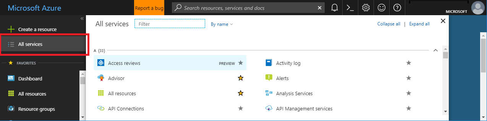
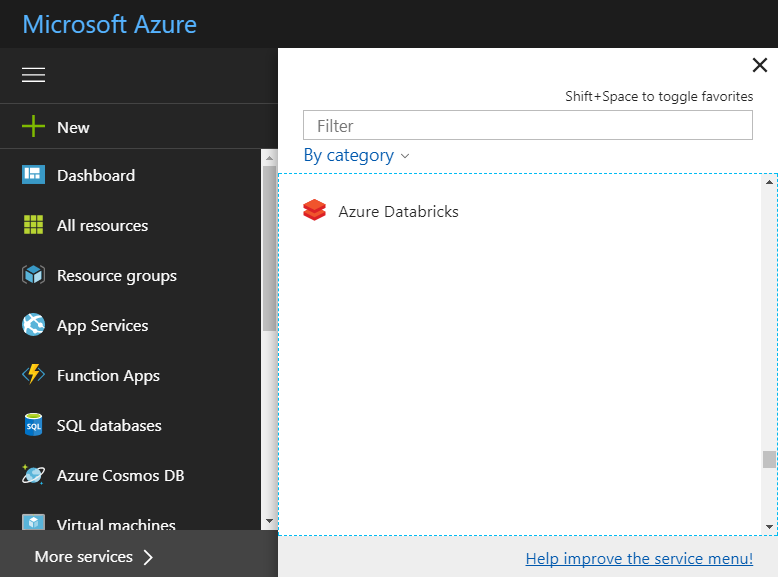

## Development Phases

Typically, there are three typical types of releases for an extension: private preview, public preview, and General Availability(GA).  For the purposes of deployment, public preview and GA are the same, except that the UI may show preview labels and disclaimers where appropriate.

### Private Preview

The extension is in private preview stage when it has been registered into the Azure Portal configuration. The goal is to hide the extension from the general public, but show it to a limited audience. After registration, the new extension can be discovered on the browse page, also known as the `All services` menu, as in the following image.

The extension is still in hidden/ disabled state, and the preview tag in the the `extension.pdl` file is set to `Preview="true"`.  Disabling an extension can be done in by using one of two different options.

1. Using `disabled: true` flag in the portal extension configuration.

1. Using `Options="HideAssetType"` in the extension's `.pdl` file.  This option is recommended as this can be controlled by the extension owners, while the first option requires a config update and a deployment by Portal team which takes time due to safe deployment practices.

The "Options" value is a comma-separated list of options which will be applied to the asset type:

Options| Result
--- | ---
HideAssetType | Hides the asset type from the All services left navigation
HideInstances | Hides any instances of the asset type in browse and global search
HideAssetType,HideInstance | Hide the asset type from left navigation AND hides any instances in browse and global search
*empty string* | This will show the asset type in left navigation AND shows instances in browse and global search

In this private preview state, the extension is not visible to all the customers of Azure Portal; instead, the developers and their team have acquired a small team of reviewers with which to collaborate on the development and testing of the extension.

<!--Determine whether this URL is above and beyond any standard private preview access. -->
Some teams also leverage this phase for testing the business model by providing a specific URL to their customers that allows them to access this extension.

The developer can then modify the extension until it meets specific criteria for usability, reliability, performance, and other factors. The criteria are located at [top-extensions-production-ready-metrics.md](top-extensions-production-ready-metrics.md).

When the criteria are met, the developer starts the processes that will move the extension from the private preview state to the public preview state. They should also start the CSS onboarding process with the CSS team at least three months previous to public preview. The CSS onboarding process requires information like the disclosure level, and the key contacts for the release. It allows the appropriate teams enough time to ensure that customers of the extension have access to Azure support and other permissions necessary to access the site.  To start the process, send an email to <a href="mailto:ibiza-css@microsoft.com?subject=Move extension from private preview to public preview&body=My team would like to continue the CSS onboarding process by moving the extension from private preview to public preview.">ibiza-css@microsoft.com</a>. For more information about CSS contacts, see [portalfx-extensions-contacts.md](portalfx-extensions-contacts.md). For more information about the CSS onboarding process, see [http://spot/intake](http://spot/intake).

When all requirements are met, CSS will release the extension from private preview to public preview. The extension will be enabled, but the preview tag in the the `extension.pdl` file is still set to `Preview="true"`.

This process is separate from onboarding to Azure.

### Public Preview

The public preview state assumes that the extension met the production-ready metrics for the private preview phase, and that the private preview phase validated the business model of the service. This includes new user experiences, or entry points, within an existing extension.

In this phase you can set the extension to the enabled state while leaving the `Preview=true` that was set in private preview stage. This can be done by either removing the `disable: true` attribute from the extension configuration file, or removing the `Options="HideAssetType"` flag from the asset's PDL file, as specified in [Private Preview](#private-preview).

Developers are required to check the quality of the extension. The Azure Portal has standardized ways of measuring reliability and performance at key areas. When an extension is in the  private preview stage, then this data has already been collected.  For more information about quality checks and Portal tools, see [top-extensions-production-ready-metrics.md](top-extensions-production-ready-metrics.md).

If the extension will be integrated into the Marketplace, then the hidden/ disabled rules follow Marketplace guidance. For more information about hiding Marketplace items, reach out to  <a href="mailto:1store@microsoft.com?subject=Marketplace Onboarding Request&body=Hello, I would like to onboard the attached package to the production environment. The .azkpg package is named <packageName>. ">1store.com</a>.

In the public preview state, the extension undergoes more development and review, and it can be used by all customers in Azure Portal.  The production-ready metrics for the public preview state are the same as the production-ready metrics for the private preview state, except for Usability. Public Preview requires extensions to have a score of 7/10, whereas GA requires extensions to have a score of 8/10.  An extension that meets the production-ready metrics with this public audience can be moved from public preview to General Availability. The criteria that are used to validate promoting the extension out of the public preview state are located at [top-extensions-production-ready-metrics.md](top-extensions-production-ready-metrics.md).

The icon to the right of the extension indicates whether the extension is in the private preview state or the public preview state, as in the following image.

 

**NOTE**: Any user that receives this URL will be able to see the new extension. Any users who receives a deep link to blades within the extension will be able to see the new experience.

### General Availability

The general availability state assumes that the extension met the production-ready metrics for the public preview phase, and that the public  preview phase validated the business model of the service.

When an extension passes all production-ready metrics for the public preview state, it can be promoted to the General Availability state. The criteria that are used to validate promoting the extension out of the public preview state are located at [top-extensions-production-ready-metrics.md](top-extensions-production-ready-metrics.md).

<!-- the `extension.pdl` file is not the JSON file. -->

 Enabling the extension for public preview will make the extension visible to all the customers in Azure Portal. Remove the preview tag in the `extension.pdl` configuration file to make the extension visible, as in the following example.

