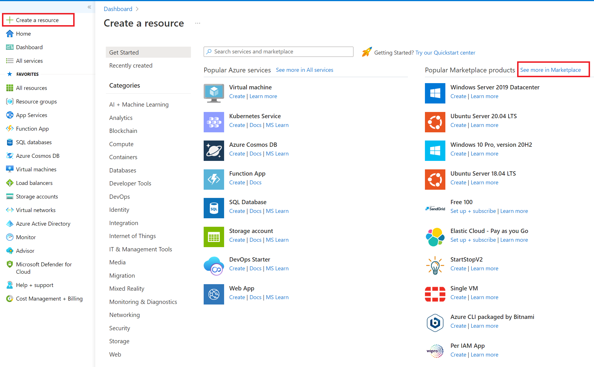
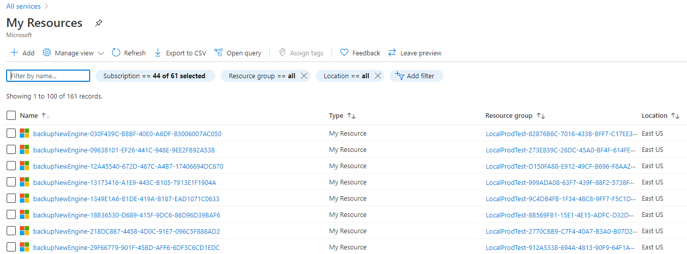
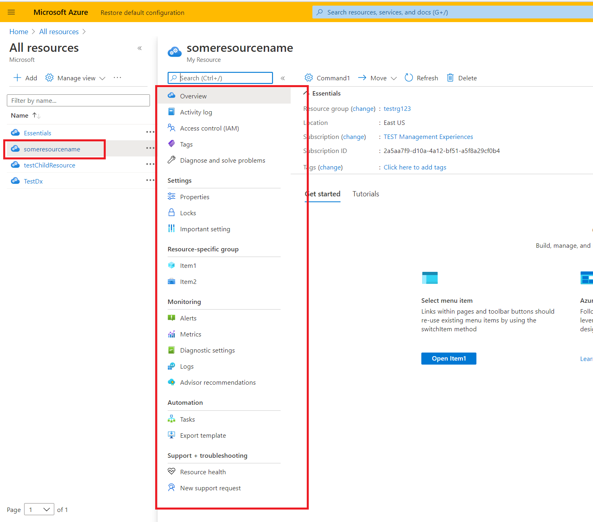

<a name="getting-started-with-the-portal-sdk"></a>
## Getting Started with the Portal SDK

The Azure Portal SDK includes everything you need to build extensions for the portal. Included are variety of tools and samples that help developers build extensions on top of the framework.  There are three common experiences for Azure resources; Create, Browse, and  Resource Management. This guide will walk you through creating your first extension, running that extension and then running the unit tests for that extension.

- [Installing the Azure Portal SDK](#install-the-azure-portal-sdk)
- [Creating and running an Extension](#creating-and-running-an-extension)
- [Exploring the Extension](#exploring-the-extension)
	- [Marketplace Create Experience](#marketplace-create-experience)
	- [Browse Experience](#browse)
	- [Resource Menu Blade](#resource-menu-blade)
- [Adding a blade](#adding-a-blade)
- [Running Unit Tests](#running-unit-tests)

<a name="getting-started-with-the-portal-sdk-installing-the-azure-portal-sdk"></a>
### Installing the Azure Portal SDK

- Perform the [one time configuration steps](top-ap-cli.md#one-time-configuration-steps)
- [Optional] if using Visual Studio 2019 see [What are the IDE specific installs required for Visual Studio?](top-ap-cli.md#FAQ)

<a name="getting-started-with-the-portal-sdk-creating-and-running-an-extension"></a>
### Creating and running an Extension

1. Install the Azure Portal Developer CLI `npm install -g @microsoft/azureportalcli`

**Note**:
- To snap to a specific version include the version i.e `npm install -g @microsoft/azureportalcli@5.302.64701`.
- If @microsoft/azureportalcli is not found or you are not seeing authentication issues e.g `npm ERR! code E401` coming from npm you need to perform the one time authentication step as follows:

    -  click 'connect to feed' [button on this page](https://msazure.visualstudio.com/One/_packaging?_a=feed&feed=AzurePortal)

    - select npm in the left nav of the dialog that opens
    - follow the instructions in the dialog. If done correctly the PAT (secret) should be added to a .npmrc in your c:\users\youralias\.npmrc this file with the PAT should not be checked in and should be treated as a secret. The .npmrc file in  Extension\\.npmrc will not have a PAT but will have the registry.  Authentication should now succeed.

2. `ap new -n Microsoft_Azure_YourExtension -o ./targetdirectory`
3. To launch your extension:

- Run the command prompt **as administrator** > cd ./src/Default/Extension > run command `ap start`
- Or, Visual Studio Code **as administrator**: `Ctl+Shift+P > Tasks: Run Task > npm: start`
- Or, Visual Studio **as administrator** > Open `/src/Default.sln` in Visual Studio *as Admin* > Press F5.

4. Your extension will now be side loaded into the production portal. The portal will prompt you to allow your side loaded extension. Click allow.


Congratulations! You've just created your first extension.
You will find that the project template has implemented many of the key components of an extension.

- Marketplace Gallery Integration (How people create your resources)
- Browse (How people browse resources they have created)
- Resource Menu Blade (How people use and manage resources they have created)
- Unit Tests

<a name="getting-started-with-the-portal-sdk-exploring-the-extension"></a>
### Exploring the Extension

<a name="getting-started-with-the-portal-sdk-exploring-the-extension-marketplace-create-experience"></a>
#### Marketplace Create Experience

The marketplace offers users a consistent way to browse and search the set of curated items that they can purchase/create.  If you plan on selling resources in the portal then you will need to integrate into the marketplace by building and publishing a package to the marketplace service. Contact 1store@microsoft.com to onboard. This section will walk you through the basics of the marketplace.

In the browser that has the portal and your side loaded extension, go to the marketplace by:

1. Clicking `+Create a resource`
1. Then, click `See all`.

	

Then click the `Local Development` category. A marketplace item will appear that matches the name you selected when creating your project.


Click the gallery item`AzurePortalExtension1` to launch the gallery items details blade.


The code to define the gallery package which provided the above experience is located in the GalleryPackages directory of the Extension project. It includes all the categorization, text, and images that you've seen so far.

When you click the `Create` button the portal will open the blade that is defined in GalleryPackages/Create/UIDefinition.json.


When you clicked `Create` the following `CreateBlade` from the project template is shown. This is a basic implementation of create that asks the user to specify the common Azure Resource properties.


The code that implements the create blade above is located in Client/Resource/Create/ViewModels. Note that the class name "CreateBlade" in the CreateBlade.ts matches the name in the UIDefinition.json file.


Fill out the create form and click New to actually create a resource.
For more information on creating gallery packages and create forms see the [gallery documentation](https://aka.ms/portalfx/gallery).
Now that you have created a resource it is time to explore how users will find that resource via the browse experience.

<a name="getting-started-with-the-portal-sdk-exploring-the-extension-browse"></a>
#### Browse

The portal exposes a common navigation experience, called 'Browse', that gives end users a list of all the different services and resource types offered by the portal.

You probably want your assets to be exposed in the navigation system. This section provides an overview.

In the running portal you can navigate to `All Resources`. In the blade that opens set the types filter to `My Resources`.  The browse experience will then show all resources of that type.  You should see the resource you created earlier.



The code for the browse implementation is located in Client/Browse. You can replace the Microsoft.PortalSdk/rootResourcesresource type name with your production Resource Provider (RP) type and your resources will show in the list on your next F5.


When you click on `someresourcename` it will launch the Resource Menu blade as defined in the BladeName property of the asset type. In the image below you can see for this extension it is the `ResourceOverviewBlade`


For more information on the browse experience see the [browse documentation](https://github.com/Azure/portaldocs/blob/dev/portal-sdk/generated/portalfx-browse.md#building-browse-experiences).

Now that you know that the `ResourceOverviewBlade` will be opened when you click on the resource you created in Browse its now time to explore Resource Menu blades.

<a name="getting-started-with-the-portal-sdk-exploring-the-extension-resource-menu-blade"></a>
#### Resource Menu Blade

If you are building an extension for an Azure service then it's likely you have built a resource provider that exposes a top-level resource (e.g. Virtual Machine, Storage account).

If that's the case then the resource menu blade is a great starting point. The idea is that after the user selects a particular resource from the browse experience they land on a menu blade that has a mixture of standard resource features (e.g. activity log, role based access control, Support, etc) and service-specific features (e.g. Tables in a storage account). This section walks through the basics.

Click on your resource from within the browse list it will open the resource menu blade as we previously learned in `Browse.pdl` from `AzurePortalExtension1` this action will open `ResourceOverviewBlade`.

Many of the standard Azure experiences such as tags, locks, and access control have been automatically injected into your menu.



In `Client/Resources/MyResourcesViewModel.ts` you can see how the items of the resource menu are customized and added to the resource menu.  For example see the Overview item from the menu is created by creating a MenuItem and the action performed when clicking it is defined via the supplyBladeReference.  In this case it is opening the ResourceOverviewBlade.


The ResourceOverviewBlade that is opened via the supply blade reference is the rendered portion highlighted in red below.


The code for this Template Blade is implemented in `/Resource/Blades/Overview/ResourceOverviewBlade.ts`


As an exercise review the ResourceOverviewBlade.ts source and try to map the components in the UI to their implementation.

<a name="getting-started-with-the-portal-sdk-adding-a-blade"></a>
### Adding a Blade
Blades are the main unit of UX that can be built using the SDK. They are basically pages that can be loaded in the portal.

- In solution explorer `right click` the `Blades folder > Select Add > New folder`. Name the folder HelloWorld
- `Right Click` the `HelloWorld` folder and select `Add > Class… > select TypeScript File > name it HelloWorldBlade.ts`
- Add the following TemplateBlade code and read through the comments to understand each component

```typescript
    import * as TemplateBlade from "Fx/Composition/TemplateBlade";
    import { DataContext } from "../../ResourceArea";

    /*
     * Defines the contract of input parameters required by this blade
     */
    export interface Parameters {
        readonly id: string;
    }

    /*
     * The template blade decorator lets the framework discover your blade. It is also where you define the html template.
     * This template shows a simple text data - binding(corresponding data - binding code is below).
     */
    @TemplateBlade.Decorator({
        htmlTemplate: "<div data-bind='text: helloWorldMessage'></div>"
    })
    export class HelloWorldBlade // todo - put your blade name here
    {
        public readonly title = "My blade title";
        public readonly subtitle = "My blade subtitle";
        // There are useful framework APIs that are exposed off context, parameters is one example.
        public context: TemplateBlade.Context<Parameters, DataContext>;

        // This property is bound to the htmlTemplate supplied in the TemplateBlade.Decorator
        public readonly helloWorldMessage = ko.observable("Hello world!");

        public onInitialize() {
            //demonstrates using a parameter that was passed to the blade
            this.helloWorldMessage(`Hello World - id: ${this.context.parameters.id}`);
            // run any initialization code you need here
            return Q();   // if you load data then return a loading promise here
        }
    }

```

- Compile the solution `Ctl + Shift + B`

Now that your blade successfully compiles lets provide a means for users to navigate to it in the portal. Recall the Resource Overview Blade had a Resource Menu. Lets update the resource menu to open the HelloWorldBlade when `Item1` in the menu is clicked.

- Open `Client\Resource\MyResourceViewModel.ts` and locate the `getMenuConfig` function we previously explored.
- Locate `mRSG_item1` and update the supplyBladeReference to return the `HelloWorldBlade` reference instead of ResourceKeysBlade.

Note: if the `HelloWorldBlade` string (and full typing definition) is not available on the BladeReferences API as a valid value for the `forBlade(...)` method, then you need to ensure the solution has compiled correctly as the blade references are generated as part of build.

Now that you have finished adding your blade and have provided a means to navigate to it lets try it out.

- Rebuild and Run your extension `Ctl + F5`
- Navigate back to your resource blade `All Resources` -> set filter to `My Resources` -> Click your resource
- Click on the `Item1` menu item which you just updated to open your new
HelloWorldBlade and observe that the content now displays the message and ID that was passed as a parameter to your blade.

    

To learn more about:

- Template blades see [this](https://aka.ms/portalfx/nopdl)
- The types of controls available and experiences you can create see Browse through the samples that are located at [top-extensions-samples.md](top-extensions-samples.md) to explore live examples of APIs. Sections, tabs, and other controls can be found in the playground located at [https://aka.ms/portalfx/playground](https://aka.ms/portalfx/playground).
- How to debug issues loading an extension in the portal, go through the [Debug extension load failures](top-extensions-debugging.md#debug-extension-load-failures) guide.

<a name="getting-started-with-the-portal-sdk-running-unit-tests"></a>
### Running Unit Tests

You may have noticed that there is a Unit Test project within the generated solution you have been working with.  The unit test framework, msportalfx-ut, provides a set APIs to make it simple to instantiate a blades view model, transition the blade lifecycle and assert state of the view model at different stages of that lifecycle.

If you open  `/test/ResourceOverviewBlade.test.ts` you can see a simple test against the ResourceOverviewBlade.


In step 1 within the above image the test uses sinonjs to setup a mock response for a request to the Resource Provider the ResourceOveviewBlade will call.

In step 2 within the above image the msportalfx-ut TemplateBladeHarness API is used to initialize a ResourceOverviewBlade with the arguments supplied in step 3.  The callbacks provided in step three also provide a useful place to perform assertions against the view model at different stages in the blade lifecycle namely `beforeOnInitializeCalled`, `afterOnInitializeCalled`, `afterRevealContentCalled`.   Once the promise returned by the `TemplateBladeHarness.initializeBlade` function resolves you are then able to assert the state of the blades view model as it stands after the blades onInitializeMethod has resolved. In this case you can see the first assert statement is validating that the blades title is equal to "bar" i.e the same value that was setup in the sinonjs mock in step 1.

To run the tests:

-  right click on the unit test project `AzurePortalExtension1.UnitTests` and select `Open Command Prompt Here`.
- Type `ap run test` and hit enter.

Test run  output:

- Running `ap run test` will run the tests  via karmajs in watch mode. By default tests are run in both Edge and Chrome. Test success and failure will be emitted to the console.
- Test results are also writing to disk in the ./TestResults folder in both TRX and JUNIT formats which are supported by many CI solutions e.g Azure Dev Ops and Jenkins.  Both the tests and their output can be harvested by these CI solutions to produce reporting as part of the pull request or CI workflows you may have. Note that while running within your CI solution a convenient script is available that you can run as follows `ap run test-ci`. This will perform a single run of the test suite as opposed to running in watch mode.

    

- Code Coverage reporting is also produced when running tests, its located at ./TestResults/coverage.  For example opening the ./TestResults/coverage/Edge*/index.html produces the summary view

    

- Clicking through from the summary view to the ResourceOverviewBlade you can see code coverage line by line

    

To learn more about the unit test framework, namely msportalfx-ut, see the [unit test documentation](https://aka.ms/portalfx/ut).

<a name="questions"></a>
## Questions?

Ask questions on: [stackoverflow.microsoft.com](https://stackoverflow.microsoft.com/questions/tagged?tagnames=ibiza), for a set of tags supported by the Azure Portal team see [supported tags](https://aka.ms/portalfx/stackoverflow-sla-tags)

<a name="faq"></a>
## FAQ:

<a name="faq-i-receive-a-this-site-is-not-secure-or-your-connection-is-not-private-error-when-running-the-extension"></a>
### I receive a &quot;this site is not secure&quot; or &quot;your connection is not private&quot; error when running the extension

Example in Edge:


Example in chrome Chrome:
Your connection is not private
Attackers might be trying to steal your information from localhost (for example, passwords, messages, or credit cards). Learn more
NET::ERR_CERT_AUTHORITY_INVALID


Solution:

- Save the certificate to disk by clicking those areas highlighted in red.

    

- Open the certificate from disk and install the certificate

    

- For `Store Location` select `Local Machine` and click Next
- Leave the remaining defaults selected and click through to finish.
- Terminate all browser instances in taskmgr and F5 again.

<a name="faq-the-portal-is-never-loaded-so-the-extension-has-not-sideloaded"></a>
### The portal is never loaded so the extension has not sideloaded

This is generally a popup blocker. After running F5 if you only have one tab open to `https://localhost:44300` as opposed to two tabs then it is likely that your popup blocker is stopping the first tab from launching the second tab that loads the portal and sideloads your extension. To solve this simply enable `https://localhost:44300` in your browsers popup blocker.

<a name="faq-i-m-stuck-where-can-i-find-help"></a>
### I&#39;m stuck. Where can I find help?

SOLUTION: There are a few ways to get help.
- Read the documentation located at [https://aka.ms/portalfx/docs](https://aka.ms/portalfx/docs).
- Read and experiment with the samples that are shipped with the SDK. They are located at `\My Documents\PortalSDK\FrameworkPortal\Extensions\SamplesExtension` directory.  The samples extension is F5'able locally on your development machine.  There is also a deployed version [here](http://aka.ms/portalfx/samples). Sections, tabs, and other controls can be found in the playground located at https://aka.ms/portalfx/playground.
- Read the [debugging guide](top-extensions-debugging.md).

If you are unable to find an answer, reach out to the Ibiza team at [Stackoverflow Ibiza](https://stackoverflow.microsoft.com/questions/tagged?tagnames=ibiza). For a list of topics and stackoverflow tags, see [supported tags](https://aka.ms/portalfx/stackoverflow-sla).
